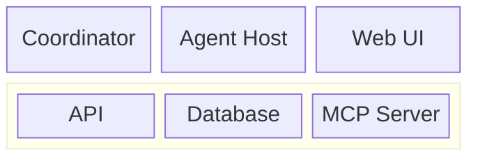

# Ralph — Baseline Approach: Open Issues in sabbour/agentweaver

**Evaluation:** `eval-1-ralph-go-parallel` | **Mode:** `without_skill`  
**Date:** 2026-07-01

---

## 1. Issue Triage

Open issues fetched from `gh issue list --repo sabbour/agentweaver --state open`:

| # | Type | Title | Priority |
|---|------|-------|----------|
| 97 | **bug** | orchestration: assembly failure shows opaque error with no retry | 1 |
| 98 | **bug** | run-page: preview sandbox not available on orchestration run page | 2 |
| 99 | **bug** | run-page: preview sandbox button hidden for completed runs | 3 |
| 95 | **bug** | run-page: confirm button does not disable immediately after click | 4 |
| 100 | **chore** | graph-view: zoom-in button, animated card navigation, scroll indicator | 5 |
| 101 | **docs** | architecture: replace AKS flowchart diagrams with block-beta diagrams | 6 |

> Features (59, 56, 53, 52, 51, 50, 49, 48, 46, 44, 1) are deferred — task says "bugs first, then chores."

---

## 2. Execution Plan

### Parallelism model

Issues 95, 99, and 97 all touch **different files** and are independent. Issue 98 depends on understanding issue 99's fix (both touch the Preview button, but in separate page files). Issues 100 and 101 are entirely independent of each other and of the bugs.

**Proposed parallel batches:**

```
Batch A (parallel):
  ├── #95  OutcomeSpecPanel.tsx (confirm button disabled state)
  ├── #99  WorkflowRunPage.tsx  (preview button gate for completed runs)
  └── #97  CoordinatorRunPage.tsx + backend RCA (assembly_blocked retry)

Batch B (after #99 is done, parallel):
  ├── #98  CoordinatorRunPage.tsx (port the Preview button from WorkflowRunPage)
  ├── #100 Graph view UI (zoom, navigation, scroll indicator)
  └── #101 README.md + docs/guide/architecture-aks.md (block-beta diagrams)
```

---

## 3. Per-Issue Approach

### Bug #95 — Confirm button does not disable immediately

**File:** `apps/web/src/components/OutcomeSpecPanel.tsx`

**Finding:** The code already has `confirmInFlightRef` as a synchronous guard (line 215) and `disabled={acting}` on the button (line 549). However `setActing(true)` is an async React state update, so the button stays visually enabled for one render cycle after the first click. The `confirmInFlightRef` ref blocks a second call from executing, but the button UI lags.

**Fix:** Add `confirmInFlightRef.current` to the button's `disabled` expression so the button goes visually disabled synchronously on the first click without waiting for React to re-render:

```tsx
// line 549 — before
disabled={acting || revising || runInterrupted}

// line 549 — after  
disabled={acting || confirmInFlightRef.current || revising || runInterrupted}
```

Apply same change to line 557 (the Decline sibling button if sharing the acting guard). Verify with existing tests in `OutcomeSpecPanel.test.tsx`.

**Estimated effort:** ~15 min, no new tests required (existing guard logic already tested).

---

### Bug #99 — Preview button hidden for completed runs

**File:** `apps/web/src/pages/WorkflowRunPage.tsx` line 836

**Finding:**
```tsx
// Current gate (line 836):
{isKubernetesSandbox && (runActive || !!previewSession) && (
```
`runActive = !SEED_STATUSES.has(runStatus)` — `'completed'` is in `SEED_STATUSES`, so `runActive=false`. `previewSession` is component state that resets to `undefined` on every page load. Result: button disappears permanently once a run completes and the user navigates away.

**Fix (Option A — always show for k8s sandbox):** Change gate to `isKubernetesSandbox` alone:
```tsx
{isKubernetesSandbox && (
```
This keeps the button visible regardless of run state. The dialog already handles the case where no session is active (it shows the "Start port-forward" form).

**Fix (Option B — disabled with tooltip for completed runs):** Show a disabled button:
```tsx
{isKubernetesSandbox && (
  <Button
    appearance="secondary"
    size="small"
    icon={<OpenRegular />}
    disabled={!runActive && !previewSession}
    title={!runActive && !previewSession ? 'Run is complete — sandbox may still be accessible' : undefined}
    onClick={() => { setPreviewDialogOpen(true); setPreviewError(undefined); }}
  >
    Preview
  </Button>
)}
```

**Recommended:** Option A (simpler, the dialog already guards against calling port-forward on a non-existent session). Option B is safer if the intent is to discourage stale port-forward attempts.

**Estimated effort:** ~10 min.

---

### Bug #98 — No Preview button on orchestration run page

**File:** `apps/web/src/pages/CoordinatorRunPage.tsx`

**Dependency:** Shares the same port-forward dialog logic as #99. Port the working implementation from `WorkflowRunPage.tsx` lines 836–845.

**Steps:**
1. Add the same state variables to `CoordinatorRunPage`: `previewSession`, `previewDialogOpen`, `previewError`, `isKubernetesSandbox` (derive from run metadata, same as WorkflowRunPage line 798).
2. Copy the port-forward dialog JSX (WorkflowRunPage lines ~960–1040) into CoordinatorRunPage.
3. Add the Preview button to the CoordinatorRunPage header row, gated on `isKubernetesSandbox` (using Option A from #99).
4. Wire `apiClient.startPortForward` / `stopPortForward` — backend already supports orchestration runIds per the issue notes.

**Acceptance tests:** Verify the button appears for k8s sandbox orchestration runs (active and completed), dialog opens, port-forward starts.

**Estimated effort:** ~60–90 min (copy + adapt + integration test).

---

### Bug #97 — Assembly failure shows opaque error, no retry

**Files:** `apps/web/src/pages/CoordinatorRunPage.tsx` + potentially a backend service

**Finding:** The `coordinator.assembly_blocked` event and `ineligible_subtasks` reason are already surfaced in the UI (lines 2223–2226 list blocking subtasks by name). The issue reports seeing "The collective assembly could not complete." — a generic fallback message without the ineligible subtask detail.

**Two sub-problems:**

**A) UI surfacing (front-end):** The detailed panel at line 2223 is already present but gated on `ineligibleSubtasks.length > 0`. For runs where the SSE event was received but the payload lacked `ineligibleSubtasks` (only bare subtask IDs), it may fall back to the generic message. Ensure the ID-only fallback (line 2244) also renders something helpful ("Subtask IDs: 59, 60, 61, 62").

**B) Auto-retry (back-end):** The coordinator should retry assembly after transient failures with backoff (capped at e.g. 3 retries). This requires a back-end change. The front-end should surface the retry count in the blocked panel.

**Immediate front-end fix:** Guard the ID-only path to display subtask IDs when full detail rows are absent:
```tsx
{ineligibleSubtasks && ineligibleSubtasks.length > 0
  ? /* existing detailed list */
  : ineligibleSubtaskIds && ineligibleSubtaskIds.length > 0
    ? <Text>Blocking subtask IDs: {ineligibleSubtaskIds.join(', ')}</Text>
    : <Text>Assembly halted — see run log for details.</Text>
}
```

**Back-end retry:** Requires RCA (per the issue's Smith dispatch) to confirm whether `ineligible_subtasks` is transient. Blocked on that investigation.

**Estimated effort:** Front-end UI fix ~30 min. Back-end retry: TBD, depends on RCA.

---

### Chore #100 — Graph view: zoom button, animated navigation, scroll indicator

**File:** `apps/web/src/pages/CoordinatorRunPage.tsx` (ReactFlow graph toolbar)

**Three sub-tasks (can be done in one PR or split):**

1. **Zoom-in button:** Add a "Zoom to fit cards" button to the existing ReactFlow toolbar. Use `useReactFlow().fitView({ padding: 0.1, maxZoom: 0.9 })` (already imported line 38). A "Fit overview" button using `fitView({ padding: 0.25 })` returns to full-graph view.

2. **Animated card navigation:** Add Prev/Next buttons. On click, call `setCenter(node.position.x + NODE_W/2, node.position.y + NODE_H/2, { zoom: 0.9, duration: 350 })` using `useReactFlow().setCenter`. Walk nodes in pipeline order (already computed via `layoutDag`).

3. **Scroll indicator:** Add a subtle fade-out CSS gradient on the graph container edges when content overflows. Use a ResizeObserver / intersection observer on the graph wrapper to toggle a CSS class.

**Acceptance criteria from issue:** Zoom ~0.75–1.0, 300–400ms animation, scroll indicator visible when overflow, all existing graph tests pass.

**Estimated effort:** ~2–3 hours.

---

### Docs #101 — Replace flowchart diagrams with block-beta

**Files:** `README.md` (lines 113–165), `docs/guide/architecture-aks.md` (lines 13–69)

**Approach:**
1. Read the existing `flowchart TB` sections in both files.
2. Re-author them as Mermaid `block-beta` diagrams showing component groupings without directional arrows.
3. Keep the detailed networking flowcharts in `architecture-aks.md` (they show data flow and are intentionally flowcharts per the issue).
4. Verify rendering in GitHub markdown preview.

**Example block-beta skeleton:**


**Estimated effort:** ~45 min.

---

## 4. Summary

| Issue | File(s) | Batch | Est. Effort |
|-------|---------|-------|------------|
| #95 confirm button | `OutcomeSpecPanel.tsx` | A | 15 min |
| #99 preview button gate | `WorkflowRunPage.tsx` | A | 10 min |
| #97 assembly error + retry | `CoordinatorRunPage.tsx` + backend | A | 30 min FE + TBD BE |
| #98 preview on coord page | `CoordinatorRunPage.tsx` | B (after #99) | 60–90 min |
| #100 graph UX | `CoordinatorRunPage.tsx` | B | 2–3 hrs |
| #101 block-beta diagrams | `README.md`, `architecture-aks.md` | B | 45 min |

**Total estimated FE effort:** ~6–7 hours across two parallel batches.  
**Back-end work** for #97 auto-retry is blocked on RCA of what causes `ineligible_subtasks`.

---

## 5. What I Would Do Next (if not in eval mode)

1. Create a feature branch per issue (or grouped by file ownership).
2. Batch A: fix #95, #99, and the front-end portion of #97 in parallel.
3. Once #99 is merged, implement #98 (copies the Preview dialog from WorkflowRunPage).
4. Run `pnpm --filter web test --run` after each fix to validate existing tests pass.
5. Open PRs linking back to the respective issue numbers.
