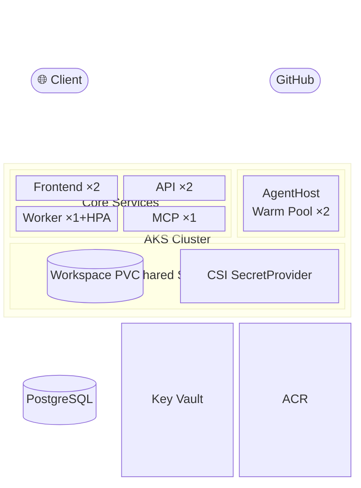

<p align="center">
  
</p>

# Agentweaver

> ⚠️ **Alpha software.** Agentweaver is under active development. Expect breaking changes, incomplete features, and rough edges. Not intended for production use.

Agentweaver runs AI agents inside sandboxed git worktrees, mirrors run events into a shared store so any replica can stream them live, and waits for human review before anything merges.

📖 **[Read the docs at sabbour.me/agentweaver](https://sabbour.me/agentweaver/)** — or browse the source in [docs/index.md](docs/index.md)

## Features

- **Sandboxed execution** — every agent run lives in an isolated git worktree with Kata VM isolation on AKS
- **Live streaming** — watch every agent step, tool call, and file change in real time from any replica
- **Human-in-the-loop review** — nothing merges until you approve the assembled diff
- **Sandbox browser preview** — open a live in-browser preview of the app running inside a run's sandbox (port-forward)
- **MCP server** — expose Agentweaver runs and outcomes as MCP tools for Claude Desktop and compatible clients

## Quick start

**Local dev — one command:**
```bash
curl -fsSL https://raw.githubusercontent.com/sabbour/agentweaver/main/install.sh | bash
```
```powershell
irm https://raw.githubusercontent.com/sabbour/agentweaver/main/install.ps1 | iex
```

**Deploy to AKS — one command** (requires `az login` + `kubectl` + `envsubst` + `openssl`):
```bash
curl -fsSL https://raw.githubusercontent.com/sabbour/agentweaver/main/install.sh | bash -s -- --aks
```
```powershell
& ([scriptblock]::Create((irm 'https://raw.githubusercontent.com/sabbour/agentweaver/main/install.ps1'))) -Aks
```

> **AKS flags:** `--skip-postgres` / `-SkipPostgres` and `--skip-oauth-key` / `-SkipOauthKey`
> skip optional provisioning steps if those resources already exist.

<details>
<summary>From a cloned checkout</summary>

**Windows (PowerShell):**
```powershell
.\install.ps1            # local dev — checks prereqs, installs deps, launches start-dev.ps1
.\install.ps1 -Aks       # AKS deploy (requires WSL2 + az login + kubectl)
```

**macOS / Linux (bash):**
```bash
bash install.sh          # local dev — checks prereqs, installs deps, prints start commands
bash install.sh --aks    # AKS deploy (requires az login + kubectl + envsubst + openssl)
```
</details>

## Build & deploy

### Local build

```bash
# Build the .NET solution
dotnet build agentweaver.sln

# Build the web frontend
npm --prefix apps/web run build
```

### Run locally

Start each component from the repo root (three terminals):

```bash
# Terminal 1 — API backend
dotnet run --project apps/Agentweaver.Api

# Terminal 2 — MCP server (optional)
dotnet run --project apps/Agentweaver.Mcp

# Terminal 3 — Web UI (Vite dev server, hot reload)
npm --prefix apps/web run dev
```

> **Windows shortcut:** `.\start-dev.ps1` launches all three automatically.

Configure the GitHub OAuth client secret for local dev with .NET user-secrets (do not put it in `appsettings*.json`):

```powershell
cd apps/Agentweaver.Api
dotnet user-secrets set "Auth:GitHub:ClientSecret" "<your-oauth-app-client-secret>"
```

### Deploy / redeploy to AKS

**First deploy:**
```bash
curl -fsSL https://raw.githubusercontent.com/sabbour/agentweaver/main/install.sh | bash -s -- --aks
```

**Redeploy with a new image tag** (build, push, and redeploy in one command):
```bash
bash install.sh --aks --image-tag <git-sha>
```
```powershell
.\install.ps1 -Aks -ImageTag <git-sha>
```

> **Never use `:latest`.** The default tag is the short git SHA (`git rev-parse --short HEAD`). Always pin to a specific SHA for reproducible deployments. Image tags are immutable per build.

## AKS architecture

### Block diagram



> Full component breakdown, networking, security model, and warm-pool lifecycle: [AKS Architecture →](docs/guide/architecture-aks.md)

## Key docs

- [Getting started](docs/guide/getting-started.md)
- [API reference](docs/reference/api.md)
- [MCP server reference](docs/reference/mcp.md)
- [AKS architecture](docs/guide/architecture-aks.md)
