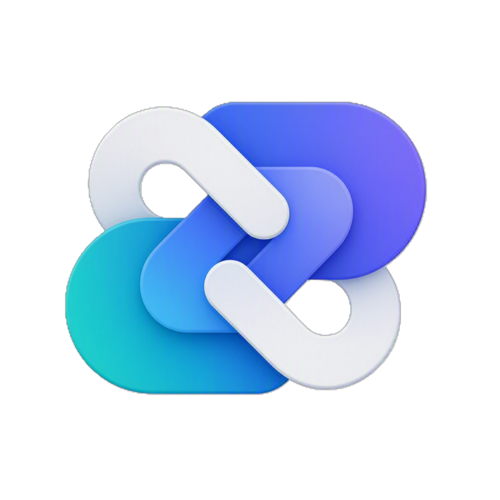
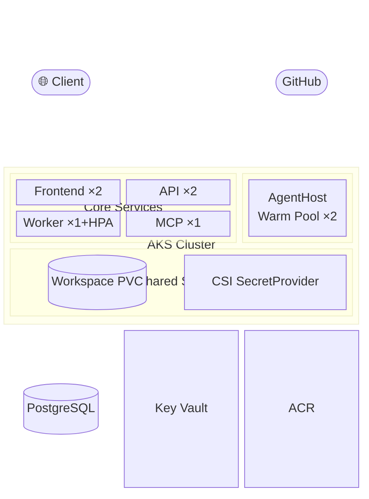

<p align="center">
  
</p>

# Agentweaver

> ⚠️ **Alpha software.** Agentweaver is under active development. Expect breaking changes, incomplete features, and rough edges. Not intended for production use.

Agentweaver runs AI agents inside sandboxed git worktrees, mirrors run events into a shared store so any replica can stream them live, and waits for human review before anything merges.

📖 **[Read the docs at sabbour.me/agentweaver](https://sabbour.me/agentweaver/)** — or browse the source in [docs/index.md](docs/index.md)

## Features

- **Sandboxed execution** — every agent run lives in an isolated git worktree with Kata VM isolation on AKS
- **Live streaming** — watch every agent step, tool call, and file change in real time from any replica
- **Human-in-the-loop review** — nothing merges until you approve the assembled diff
- **Sandbox browser preview** — open a live in-browser preview of the app running inside a run's sandbox (port-forward)
- **MCP server** — expose Agentweaver runs and outcomes as MCP tools for Claude Desktop and compatible clients

## Prerequisites

| Tool | Needed for | Windows (winget) | macOS (Homebrew) | Linux (Debian/Ubuntu) |
| --- | --- | --- | --- | --- |
| [git](https://git-scm.com/) | cloning the repo; the default image tag is the short git SHA | `winget install --id Git.Git -e` | `brew install git` | `sudo apt-get update && sudo apt-get install -y git` |
| [Node.js 20+](https://nodejs.org/) (LTS) | running every script in this repo, including the Azure toolchain (`scripts/azure/`) | `winget install OpenJS.NodeJS.LTS` | `brew install node@20` | `curl -fsSL https://deb.nodesource.com/setup_20.x \| sudo -E bash - && sudo apt-get install -y nodejs` |
| `npm` (bundled with Node) or `pnpm` | installing dependencies and running package scripts | *(bundled with Node.js)* | *(bundled with Node.js)* | *(bundled with Node.js)* |
| [.NET SDK 10](https://dot.net/download) | building/running the API and MCP server locally | `winget install Microsoft.DotNet.SDK.10` | `brew install --cask dotnet-sdk` | `curl -sSL https://dot.net/v1/dotnet-install.sh \| bash /dev/stdin --channel 10.0` |
| [Azure CLI](https://learn.microsoft.com/cli/azure/) (`az`), logged in via `az login` | everything under `npm run azure:*` | `winget install Microsoft.AzureCLI` | `brew install azure-cli` | `curl -sL https://aka.ms/InstallAzureCLIDeb \| sudo bash` |
| [kubectl](https://kubernetes.io/docs/tasks/tools/) | applying manifests and verifying the cluster during `azure:deploy`/`azure:upgrade`/`azure:verify` | `winget install Kubernetes.kubectl` | `brew install kubectl` | `sudo snap install kubectl --classic` |
| [`gh` CLI](https://cli.github.com/), authenticated via `gh auth status` | `npm run azure:release` only (changelog generation + creating the GitHub Release) | `winget install GitHub.cli` | `brew install gh` | `sudo apt-get update && sudo apt-get install -y gh` (or see [cli.github.com](https://cli.github.com/) if `gh` isn't in your distro's repos) |

`node scripts/azure/cli.mjs dev --setup` (aliased as `npm run setup`) checks
git/.NET/Node itself and prints the matching install command above for your
platform if one is missing.

Docker is **not** required locally — image builds run remotely via `az acr build`
(see `scripts/azure/steps/20-build-push-images.mjs`), not a local Docker daemon.

## Quick start

```bash
git clone https://github.com/sabbour/agentweaver.git
cd agentweaver

# Bootstrap: checks git/dotnet/node versions, installs apps/web's npm deps,
# and restores .NET packages (replaces the old install.sh/.ps1 local mode).
npm run setup

# Start the API (http://localhost:5000) and the Web UI (http://localhost:5173).
npm run azure:dev
```

Use `pnpm run <script>` in place of `npm run <script>` if you use pnpm.

## Deploy to Azure

From a cloned checkout:

```bash
# Interactive smart installer (run with no flags, in a terminal / TTY):
npm run azure:deploy
```

With no arguments, `azure:deploy` launches an interactive installer that prompts
for: the Azure subscription (defaulting to your current `az` default), a
resource group (pick an existing one or create a new one), a location, the
AKS cluster / ACR / Key Vault names (prefilled with sensible defaults,
editable), and a GitHub OAuth client ID + secret (the secret is entered with
no echo). It then provisions the cluster, identity, monitoring, the MCP OAuth
signing key, PostgreSQL, builds and pushes images, verifies image provenance,
and deploys and verifies the release. At the end it prints an **outputs
summary** (resource group, cluster, ACR, namespace, image tags, gateway
host/IP, verification pass/fail counts) — it never prints the OAuth client
secret or any other credential.

**Non-interactive usage** — via flags, environment variables, and/or a params
file (precedence: flags > env > params file > detected defaults > prompt; a
non-interactive run — no TTY, or any flags passed — never blocks on a prompt
and fails fast naming any missing required field):

```bash
npm run azure:deploy -- \
  --resource-group agentweaver-rg \
  --cluster-name agentweaver-aks-2 \
  --acr-name agentweaverregistry \
  --location westus2 \
  --keyvault-name agentweaver-kv \
  --github-client-id "$GITHUB_CLIENT_ID" \
  --github-client-secret "$GITHUB_CLIENT_SECRET"
```

Or with a params file (copy [`scripts/azure/params.example.json`](scripts/azure/params.example.json)):

```json
{
  "RESOURCE_GROUP": "agentweaver-rg",
  "CLUSTER_NAME": "agentweaver-aks-2",
  "ACR_NAME": "agentweaverregistry",
  "LOCATION": "westus2",
  "KEYVAULT_NAME": "agentweaver-kv",
  "NAMESPACE": "agentweaver",
  "GITHUB_CLIENT_ID": "your-github-oauth-app-client-id",
  "GITHUB_CLIENT_SECRET": "",
  "IMAGE_TAG": "",
  "SKIP_POSTGRES": false,
  "SKIP_OAUTH_KEY": false
}
```

```bash
npm run azure:deploy -- --params-file scripts/azure/params.my-env.json
```

> Never commit a params file containing a real `GITHUB_CLIENT_SECRET` — prefer
> the `GITHUB_CLIENT_SECRET` environment variable or the interactive secret
> prompt; the params file field exists only for unattended CI use against
> disposable/test environments.

**Upgrading an existing deployment:**

```bash
npm run azure:upgrade
```

`azure:upgrade` is for updating an *existing* deployment to newer code,
distinct from `azure:deploy` (initial/full setup). It mints a new immutable
image tag from `HEAD` (the short git SHA; it refuses to run against a dirty
working tree), builds and pushes the images, verifies image provenance,
redeploys, and cycles the AgentHost warm-pool sandboxes (reapplies the
SandboxTemplate/SandboxWarmPool and waits for the pool to become ready —
never by deleting pods).

**Related commands** (see the [operations guide](docs/guide/operations.md) and
[AKS deployment runbook](docs/guide/deployment-aks.md) for more detail):

- `npm run azure:release` — bumps the semver `VERSION`, tags and pushes the release, generates a changelog and GitHub Release, then builds/deploys/verifies it.
- `npm run azure:verify` — runs the post-deploy health verification checks on their own.

### Local development

```bash
# Full development environment (API + Web UI)
npm run azure:dev

# Frontend only (builds, then starts Vite)
npm run dev:web

# API only (builds, then starts the API)
npm run dev:api
```

Use `pnpm run` with the same script name if you use pnpm.

### Run components manually

Start each component from the repo root (three terminals):

```bash
# Terminal 1 — API backend
dotnet run --project apps/Agentweaver.Api

# Terminal 2 — MCP server (optional)
dotnet run --project apps/Agentweaver.Mcp

# Terminal 3 — Web UI (Vite dev server, hot reload)
npm --prefix apps/web run dev
```

Configure the GitHub OAuth client secret for local dev with .NET user-secrets (do not put it in `appsettings*.json`):

```powershell
cd apps/Agentweaver.Api
dotnet user-secrets set "Auth:GitHub:ClientSecret" "<your-oauth-app-client-secret>"
```

### Package scripts

From the repository root, run these with `npm run <script>` (or `pnpm run <script>`):

| Script | Purpose |
| --- | --- |
| `setup` | Local dev environment setup only: checks prerequisites (git/.NET 10/Node 20+), installs `apps/web`'s npm deps, restores .NET packages. No Azure calls. |
| `azure:deploy` | Interactive/non-interactive installer — provisions everything and deploys (replaces the old `install.sh`/`.ps1`). |
| `azure:upgrade` | Build a new immutable image tag, redeploy, and cycle the AgentHost warm pool. |
| `azure:release` | Semver bump/tag/GitHub release, then build/deploy/verify. |
| `azure:verify` | Post-deploy health verification checks. |
| `azure:dev` | Start the local API + Web UI dev environment. |
| `dev:web` | Build the web frontend, then start Vite. |
| `dev:api` | Build the API in Release mode, then run it without rebuilding. |

> **Never use `:latest`.** The default image tag is the short git SHA (`git rev-parse --short HEAD`). Always pin to a specific SHA for reproducible deployments — image tags are immutable per build.

## AKS architecture

### Block diagram


```mermaid
block-beta
  columns 3

  Client(["🌐 Client"])
  space
  GitHub(["GitHub"])

  block:aks["AKS Cluster"]:3
    columns 3
    block:core["Core Services"]:2
      columns 2
      fe["Frontend ×2"]
      api["API ×2"]
      worker["Worker ×1+HPA"]
      mcp["MCP ×1"]
    end
    block:kata["Kata VM Pool"]:1
      ah["AgentHost\nWarm Pool ×2"]
    end
    block:storage["Shared Storage"]:3
      columns 2
      pvc[("Workspace PVC")]
      csi["CSI SecretProvider"]
    end
  end

  pg[("PostgreSQL")]
  kv["Key Vault"]
  acr["ACR"]
```

> Full component breakdown, networking, security model, and warm-pool lifecycle: [AKS Architecture →](docs/guide/architecture-aks.md)

## Key docs

- [Getting started](docs/guide/getting-started.md)
- [API reference](docs/reference/api.md)
- [MCP server reference](docs/reference/mcp.md)
- [AKS architecture](docs/guide/architecture-aks.md)
