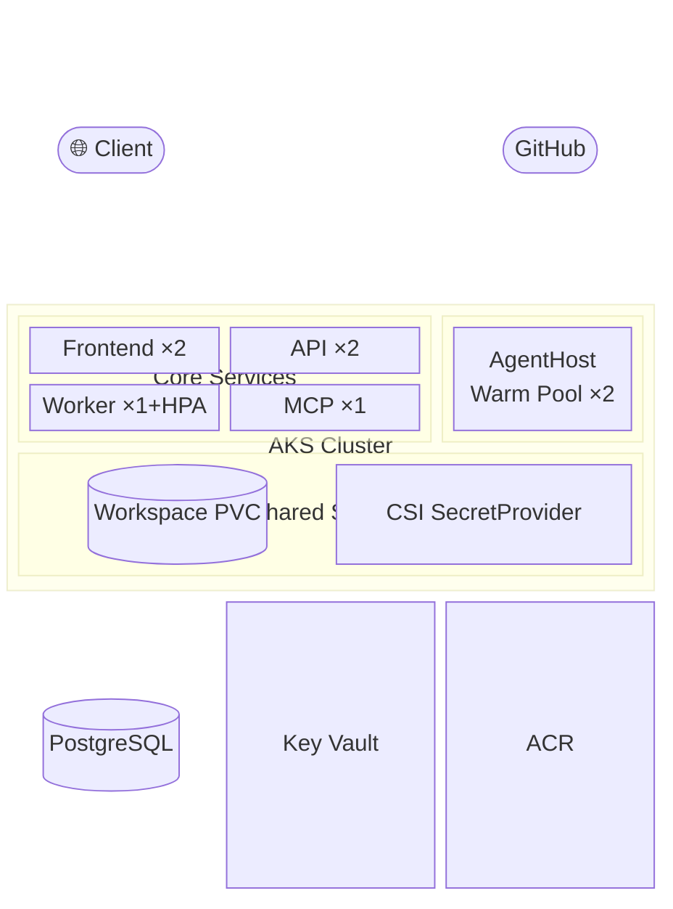

<p align="center">
  
</p>

# Agentweaver

> ⚠️ **Alpha software.** Agentweaver is under active development. Expect breaking changes, incomplete features, and rough edges. Not intended for production use.

Agentweaver runs AI agents inside sandboxed git worktrees, mirrors run events into a shared store so any replica can stream them live, and waits for human review before anything merges.

📖 **[Read the docs at sabbour.me/agentweaver](https://sabbour.me/agentweaver/)** — or browse the source in [docs/index.md](docs/index.md)

## Prerequisites

| Tool | Needed for | Windows (winget) | macOS (Homebrew) | Linux (Debian/Ubuntu) |
| --- | --- | --- | --- | --- |
| [git](https://git-scm.com/) | cloning the repo; the default image tag is the short git SHA | `winget install --id Git.Git -e` | `brew install git` | `sudo apt-get update && sudo apt-get install -y git` |
| [Node.js 20+](https://nodejs.org/) (LTS) | running every script in this repo, including the Azure toolchain (`scripts/azure/`) | `winget install OpenJS.NodeJS.LTS` | `brew install node@20` | `curl -fsSL https://deb.nodesource.com/setup_20.x \| sudo -E bash - && sudo apt-get install -y nodejs` |
| `npm` (bundled with Node) or `pnpm` | installing dependencies and running package scripts | *(bundled with Node.js)* | *(bundled with Node.js)* | *(bundled with Node.js)* |
| [.NET SDK 10](https://dot.net/download) | building/running the API and MCP server locally | `winget install Microsoft.DotNet.SDK.10` | `brew install --cask dotnet-sdk` | `curl -sSL https://dot.net/v1/dotnet-install.sh \| bash /dev/stdin --channel 10.0` |
| **WSL2 + `bubblewrap`** | **Windows local dev only** — `npm run dev` runs the API's sandbox executor inside WSL2 for real isolation ([why](https://sabbour.me/agentweaver/guide/getting-started#why-wsl2-on-windows)); macOS/Linux sandbox natively | `wsl --install` (elevated PowerShell, then reboot), then `sudo apt-get install -y bubblewrap` inside the distro | *Not required* | *Not required* |
| [Azure CLI](https://learn.microsoft.com/cli/azure/) (`az`), logged in via `az login` | everything under `npm run azure:*` | `winget install Microsoft.AzureCLI` | `brew install azure-cli` | `curl -sL https://aka.ms/InstallAzureCLIDeb \| sudo bash` |
| [kubectl](https://kubernetes.io/docs/tasks/tools/) | applying manifests and verifying the cluster during Azure deployment commands | `winget install Kubernetes.kubectl` | `brew install kubectl` | `sudo snap install kubectl --classic` |
| [`gh` CLI](https://cli.github.com/), authenticated via `gh auth status` | `release:publish`, `azure:deploy-from-release`, and `azure:release` release validation/publication | `winget install GitHub.cli` | `brew install gh` | `sudo apt-get update && sudo apt-get install -y gh` (or see [cli.github.com](https://cli.github.com/) if `gh` isn't in your distro's repos) |

`node scripts/azure/cli.mjs dev --setup` (aliased as `npm run setup`) checks
git/.NET/Node itself and prints the matching install command above for your
platform if one is missing. On Windows it also prints an **advisory** warning
when WSL2 is not detected (non-fatal). It does not check the Azure CLI, `kubectl`, or
`gh`, since local dev doesn't need them.

Docker is **not** required locally — image builds run remotely via `az acr build`
(see `scripts/azure/steps/20-build-push-images.mjs`), not a local Docker daemon.

### Installing prerequisites

<details>
<summary><strong>Windows</strong></summary>

Install `winget` first if it isn't already available (it ships with Windows 11
and recent Windows 10 updates):

```powershell
Set-ExecutionPolicy Bypass -Scope Process -Force
Install-Module Microsoft.WinGet.Client -Force -Repository PSGallery
Repair-WinGetPackageManager -AllUsers
```

Then install git, Node.js, and the .NET SDK:

```powershell
winget install --id Git.Git -e --accept-source-agreements --accept-package-agreements
winget install --id OpenJS.NodeJS.22 --exact --accept-source-agreements --accept-package-agreements
winget install --id Microsoft.DotNet.SDK.10 --accept-source-agreements --accept-package-agreements
```

Deploying to Azure? Also install the Azure CLI:

```powershell
winget install Microsoft.AzureCLI --accept-source-agreements --accept-package-agreements
```

`npm` ships bundled with Node.js — no separate install needed. Refresh `PATH`
in your **current** shell so the newly installed tools are found without
reopening the terminal:

```powershell
$env:Path = [Environment]::GetEnvironmentVariable('Path', 'Machine') + ';' +
            [Environment]::GetEnvironmentVariable('Path', 'User')
```

</details>

<details>
<summary><strong>macOS</strong></summary>

Install [Homebrew](https://brew.sh/) first if it isn't already available:

```bash
/bin/bash -c "$(curl -fsSL https://raw.githubusercontent.com/Homebrew/install/HEAD/install.sh)"
```

Then install git, Node.js, and the .NET SDK:

```bash
brew install git
brew install node@20
brew install --cask dotnet-sdk
```

Deploying to Azure? Also install the Azure CLI:

```bash
brew install azure-cli
```

`npm` ships bundled with Node.js — no separate install needed.

</details>

<details>
<summary><strong>Linux (Debian/Ubuntu)</strong></summary>

```bash
# git
sudo apt-get update && sudo apt-get install -y git

# Node.js 20.x + npm (via NodeSource -- distro repos are usually outdated)
curl -fsSL https://deb.nodesource.com/setup_20.x | sudo -E bash -
sudo apt-get install -y nodejs

# .NET SDK 10 (via the official install script -- apt package availability
# varies by distro/version)
curl -sSL https://dot.net/v1/dotnet-install.sh | bash /dev/stdin --channel 10.0
export PATH="$HOME/.dotnet:$PATH"
```

Deploying to Azure? Also install the Azure CLI:

```bash
curl -sL https://aka.ms/InstallAzureCLIDeb | sudo bash
```

</details>

`npm run setup` re-checks the local-dev tools itself after you install them,
and prints the matching command again if anything is still missing or out of
date. Full step-by-step guide: [sabbour.me/agentweaver/guide/getting-started](https://sabbour.me/agentweaver/guide/getting-started).

## Features

- **Sandboxed execution** — every agent run lives in an isolated git worktree with Kata VM isolation on AKS
- **Live streaming** — watch every agent step, tool call, and file change in real time from any replica
- **Human-in-the-loop review** — nothing merges until you approve the assembled diff
- **Sandbox browser preview** — open a live in-browser preview of the app running inside a run's sandbox (port-forward)
- **MCP server** — expose Agentweaver runs and outcomes as MCP tools for Claude Desktop and compatible clients

## Quick start

📖 New to Agentweaver? See [Prerequisites](#prerequisites) above if you don't
have git/Node/.NET installed yet, or follow the [full getting started
guide](https://sabbour.me/agentweaver/guide/getting-started).

> **Windows local dev requires WSL2 + `bubblewrap` before you start.** The API
> runs inside WSL2 for a real isolated sandbox; follow
> [Why WSL2 on Windows?](https://sabbour.me/agentweaver/guide/getting-started#why-wsl2-on-windows)
> so setup does not surprise you midway through the first run.

```bash
git clone https://github.com/sabbour/agentweaver.git
cd agentweaver

# One-time bootstrap: prerequisite checks, Web install, .NET restore, and
# appsettings.Development.json scaffolding. No servers or Azure resources.
npm run setup

# Start the API (http://localhost:5000) and the Web UI (http://localhost:5173).
npm run dev
```

Before first sign-in, configure the GitHub OAuth client ID and user-secrets as
described in the [local authentication
step](https://sabbour.me/agentweaver/guide/getting-started#1-configure-local-authentication-and-model-access).
The first API build can take **1–3 minutes** (commonly longer through a
Windows-mounted WSL2 checkout). API logs stream in the terminal; the loop is
ready only after it prints both **`API is ready`** and **`Web UI is ready`**.

Use `pnpm run <script>` in place of `npm run <script>` if you use pnpm.

### Dev/test versus branching

Local and Azure testing do not require a staging branch:

```text
feature worktree
  ├─ npm run dev ───────────────────────> local test (no GitHub interaction)
  ├─ azure:provision-infra / azure:deploy-from-local ─────> Azure dev/test environment
  ├─ azure:deploy-from-commit <ref> ──────────────────────> exact committed ref, without checkout switching
  └─ PR CI ─> update to latest dev ─> CI rerun ─> squash-merge to protected dev
                                                        └─ green SHA ─> release/vX.Y.Z soak ─> promotion to main
                                                                                                      └─ publish vX.Y.Z ─> deploy from release
```

`npm run dev` uses whatever is checked out locally. Azure dev/test commands
can deploy an unmerged feature branch to a real cluster for integration
testing. The cluster is the staging/integration **environment**; protected
`dev` plus required up-to-date PR checks is the git integration path. GitHub
Merge Queue is unavailable while the repo is owned by the personal `sabbour`
account. The [Branch Topology Activation Plan](CONTRIBUTING.md#branch-topology)
defines the measurable conditions for enabling it or adding another branch tier.
See the [full explanation](https://sabbour.me/agentweaver/guide/getting-started#how-local-and-azure-testing-fit-the-branch-flow).

## Deploy to Azure

📖 See [Prerequisites](#prerequisites) above (you'll also need the Azure CLI
logged in via `az login`), or the [full Azure deploy
guide](https://sabbour.me/agentweaver/guide/getting-started#deploy-to-azure-one-command).

From a cloned checkout:

```bash
# First/full provisioning of a personal or shared dev/test environment:
npm run azure:provision-infra
```

This is **environment validation, not a release**. Use `azure:provision-infra` to
provision or idempotently reconcile the full environment; after it exists,
use `npm run azure:deploy-from-local` to ship the current clean `HEAD` — even from an
unmerged feature branch/worktree — during normal development, and
`npm run azure:verify` to rerun live checks. Only the release workflow changes
`VERSION`, creates a `vX.Y.Z` tag, and publishes a GitHub Release. See the
[release and deployment command model](RELEASING.md#command-model).

With no arguments, `azure:provision-infra` launches an interactive installer that prompts
for: the Azure subscription (defaulting to your current `az` default), a
resource group (pick an existing one or create a new one), a location, the
AKS cluster / ACR / Key Vault names (prefilled with sensible defaults,
editable), and a GitHub OAuth client ID + secret (the secret is entered with
no echo). It then provisions the cluster, identity, monitoring, the MCP OAuth
signing key, PostgreSQL, builds and pushes images, verifies image provenance,
and performs an initial SHA-identified deployment. At the end it prints an **outputs
summary** (resource group, cluster, ACR, namespace, image tags, gateway
host/IP, **GitHub OAuth callback URL**, verification pass/fail counts) — it
never prints the OAuth client secret or any other credential.

> **GitHub OAuth App callback URL — local vs. Azure.** The registered
> callback URL must match where the app is actually running:
> - **Local dev** → `http://localhost:5000/auth/github/callback`
> - **Azure deployment** → `https://<gateway-host>/auth/github/callback` —
>   printed verbatim as **GitHub OAuth callback URL** in the outputs summary
>   above once the deploy finishes. It's only known *after* AKS App Routing
>   provisions the managed certificate on your first deploy, so there's no
>   way to know it in advance — deploy first with any placeholder callback
>   URL, then go back to the [OAuth App
>   settings](https://github.com/settings/developers) and paste in the
>   printed callback URL. GitHub OAuth Apps only support one callback URL
>   each — if you also do local dev, create a second OAuth App for
>   `localhost`, or swap the callback URL each time you switch between local
>   and Azure.

**Non-interactive usage** — via flags, environment variables, and/or a params
file (precedence: flags > env > params file > detected defaults > prompt; a
non-interactive run — no TTY, or any flags passed — never blocks on a prompt
and fails fast naming any missing required field):

```bash
npm run azure:provision-infra -- \
  --resource-group agentweaver-rg \
  --cluster-name agentweaver-aks \
  --acr-name agentweaverregistry \
  --location westus2 \
  --keyvault-name agentweaver-kv \
  --github-client-id "$GITHUB_CLIENT_ID" \
  --github-client-secret "$GITHUB_CLIENT_SECRET"
```

Or with a params file (copy [`scripts/azure/params.example.json`](scripts/azure/params.example.json)):

```json
{
  "RESOURCE_GROUP": "agentweaver-rg",
  "CLUSTER_NAME": "agentweaver-aks",
  "ACR_NAME": "agentweaverregistry",
  "LOCATION": "westus2",
  "KEYVAULT_NAME": "agentweaver-kv",
  "NAMESPACE": "agentweaver",
  "GITHUB_CLIENT_ID": "your-github-oauth-app-client-id",
  "GITHUB_CLIENT_SECRET": "",
  "IMAGE_TAG": "",
  "SKIP_POSTGRES": false,
  "SKIP_OAUTH_KEY": false
}
```

```bash
npm run azure:provision-infra -- --params-file scripts/azure/params.my-env.json
```

> Never commit a params file containing a real `GITHUB_CLIENT_SECRET` — prefer
> the `GITHUB_CLIENT_SECRET` environment variable or the interactive secret
> prompt; the params file field exists only for unattended CI use against
> disposable/test environments.

**Deploying current local work to an existing environment:**

```bash
npm run azure:deploy-from-local
```

`azure:deploy-from-local` deploys current local work without assigning release
identity. It is distinct from `azure:provision-infra` (initial/full setup) and
from `azure:deploy-from-release` (an existing published semver release). It
mints an immutable short-SHA tag from `HEAD`, builds and pushes images,
redeploys, performs post-deploy provenance verification, and waits for the
AgentHost warm pool.

To deploy a teammate's branch, PR ref, or older commit without switching your
own checkout:

```bash
npm run azure:deploy-from-commit -- origin/feature-branch
```

The command resolves the ref to an exact commit, creates a temporary detached
worktree, and runs the same short-SHA deployment pipeline. It never includes
uncommitted local state.

**Related commands** (see the [operations guide](docs/guide/operations.md) and
[AKS deployment runbook](docs/guide/deployment-aks.md) for more detail):

- `npm run release:publish` — create the tag and GitHub Release only.
- `npm run azure:deploy-from-release -- vX.Y.Z` — deploy an existing published release.
- `npm run azure:release` — publish and perform the first deployment as one resumable orchestration.
- `npm run azure:verify` — runs the post-deploy health verification checks on their own.

### Local development

```bash
# Supported full environment (API + Web UI; no browser auto-open)
npm run dev

# Same orchestration, but open the browser when ready
npm run azure:dev

# Frontend only (builds, then starts Vite)
npm run dev:web

# API only (builds, then starts the API)
npm run dev:api
```

Use `pnpm run` with the same script name if you use pnpm.

### Run components manually

Start each component from the repo root (three terminals). On Windows, use the
full `npm run dev` loop for actual agent execution: the raw `dotnet run`
command below runs natively and does not provide the required WSL2 +
`bubblewrap` sandbox path; it is suitable only for API debugging that does not
execute model-generated commands.

```bash
# Terminal 1 — API backend
dotnet run --project apps/Agentweaver.Api

# Terminal 2 — MCP server (optional)
dotnet run --project apps/Agentweaver.Mcp

# Terminal 3 — Web UI (Vite dev server, hot reload)
npm --prefix apps/web run dev
```

Configure the GitHub OAuth client secret for local dev with .NET user-secrets (do not put it in `appsettings*.json`):

```powershell
cd apps/Agentweaver.Api
dotnet user-secrets set "Auth:GitHub:ClientSecret" "<your-oauth-app-client-secret>"
```

### Package scripts

From the repository root, run these with `npm run <script>` (or `pnpm run <script>`):

| Script | Purpose |
| --- | --- |
| `setup` | Local dev environment setup only: checks prerequisites (git/.NET 10/Node 20+), installs `apps/web`'s npm deps, restores .NET packages. No Azure calls. |
| `azure:provision-infra` | Interactive/non-interactive installer — provisions everything and deploys (replaces the old `install.sh`/`.ps1`). |
| `azure:deploy-from-local` | Deploy current local HEAD using a short-SHA image identifier; no release identity. |
| `azure:deploy-from-commit` | Deploy an arbitrary exact committed ref through a temporary detached worktree. |
| `azure:deploy-from-release` | Deploy an existing published `vX.Y.Z` release to the configured environment. |
| `release:publish` | Create an annotated tag and GitHub Release from a prepared exact-main checkout; no deploy. |
| `azure:release` | Publish and deploy a prepared release by composing the two commands above. |
| `azure:verify` | Post-deploy health verification checks. |
| `azure:dev` | Start the local API + Web UI dev environment. |
| `dev:web` | Build the web frontend, then start Vite. |
| `dev:api` | Build the API in Release mode, then run it without rebuilding. |

> **Never use `:latest`.** The default image tag is the short git SHA (`git rev-parse --short HEAD`). Always pin to a specific SHA for reproducible deployments — image tags are immutable per build.

## Skills

Project skills in [`.copilot/skills/`](.copilot/skills/) capture Agentweaver's
project-specific operating practices:

- **agentweaver-azure-fluent-system-sync** — Refresh the Azure Fluent System library from Azure UI Kit / Fluent 2 via Figma MCP and validate checked-in React, CSS, docs, and showcase artifacts.
- **agentweaver-docs-feature** — Full authoring playbook for documenting new or existing features across all documentation facets.
- **agentweaver-docs-sync** — Keep Agentweaver docs in sync with code changes, including source grounding, regeneration, and builds.
- **agentweaver-git-workflow** — Agentweaver Git workflow for protected dev integration, worktrees, and PRs.
- **agentweaver-github-issue** — File a well-structured GitHub issue and dispatch the right Squad member for triage, RCA, or specification work.
- **agentweaver-issue-status** — Print a live pipeline status board for GitHub issues, deployments, and documentation disposition.
- **agentweaver-playwright-cli** — Automate browser interactions, test web pages, and work with Playwright tests.

GitHub Copilot CLI discovers its official skill paths in
[`.github/skills/`](.github/skills/); these thin entry points expose the
project's maintained harness workflows:

- **agentweaver-api-harness** — Run Agentweaver's REST API harness for backend validation, repro reruns, or plain-English scenario exploration.
- **agentweaver-harness** — Run Agentweaver's complete cross-surface persona harness for validation, regression, or exploratory passes.
- **agentweaver-harness-scenarios** — List built-in harness scenarios and persona catalogs, or generate reviewed surface adapters.
- **agentweaver-mcp-harness** — Run Agentweaver's MCP protocol harness for tool-surface validation, repro reruns, or scenario exploration.
- **agentweaver-ui-harness** — Run Agentweaver's deployed-UI harness for browser evidence, repros, or scenario exploration.

## AKS architecture

### Block diagram


```mermaid
block-beta
  columns 3

  Client(["🌐 Client"])
  space
  GitHub(["GitHub"])

  block:aks["AKS Cluster"]:3
    columns 3
    block:core["Core Services"]:2
      columns 2
      fe["Frontend ×2"]
      api["API ×2"]
      worker["Worker ×1+HPA"]
      mcp["MCP ×1"]
    end
    block:kata["Kata VM Pool"]:1
      ah["AgentHost\nWarm Pool ×2"]
    end
    block:storage["Shared Storage"]:3
      columns 2
      pvc[("Workspace PVC")]
      csi["CSI SecretProvider"]
    end
  end

  pg[("PostgreSQL")]
  kv["Key Vault"]
  acr["ACR"]
```

> Full component breakdown, networking, security model, and warm-pool lifecycle: [AKS Architecture →](docs/guide/architecture-aks.md)

## Key docs

- [Getting started](docs/guide/getting-started.md)
- [API reference](docs/reference/api.md)
- [MCP server reference](docs/reference/mcp.md)
- [AKS architecture](docs/guide/architecture-aks.md)
- [Contributing](CONTRIBUTING.md)
- [Releasing](RELEASING.md)

## Skills

- [Agentweaver changelog](.copilot/skills/agentweaver-changelog/SKILL.md) —
  Changesets, release publication, release notes, and release deployment identity.
