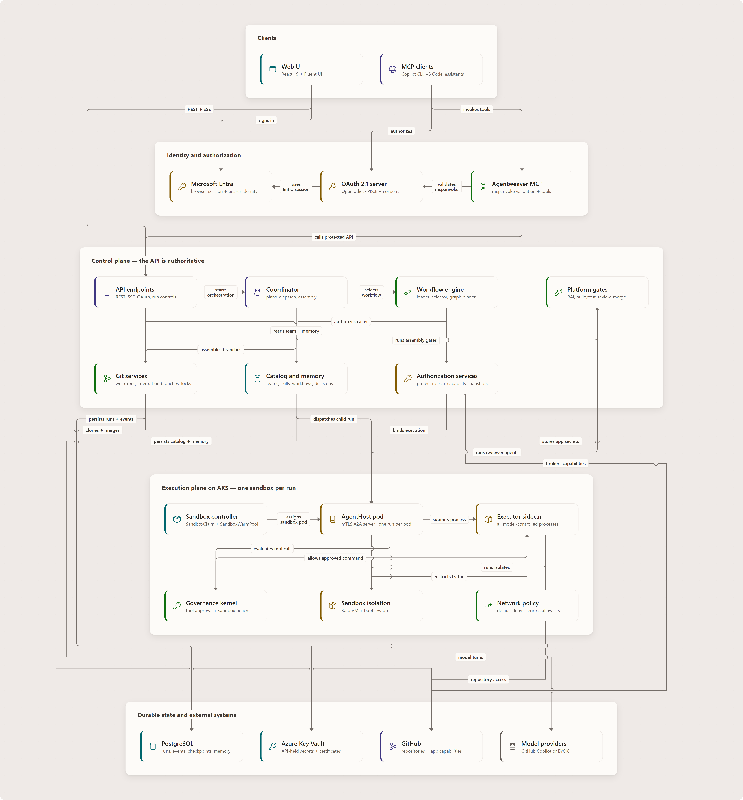

<p align="center">
  
</p>

<!-- Retained repository brand asset, also used by the documentation site.
     This logo is not an architecture diagram and has no draw.io conversion. -->

# Agentweaver

> ⚠️ **Alpha software.** Agentweaver is under active development. Expect breaking changes and incomplete features. Do not use it in production.

**Run teams of AI agents on your own infrastructure.**

Describe the work you want done. Agentweaver can generate the agent roles, skills, and workflow for that work, then run the team in isolated environments on infrastructure you control.

Workflows turn probabilistic agent work into a governed path toward a defined outcome, with the gates and approvals you set. Start and supervise work in the Agentweaver interface or through MCP from an assistant, editor, or CLI.



<!-- Editable canonical source: docs/diagrams/src/email-architecture.drawio.
     Export: pinned draw.io Desktop 31.4.5, --spec email-architecture.
     Research and inspected pitch/pass lineage: docs/diagrams/reviews/email-architecture/.
     README disposition: reuse this canonical, not a separate architecture image.
     Both README visuals: docs/diagrams/reviews/canonical-provider-admission/readme-visual-coverage.md. -->

📖 **[Read the documentation](https://sabbour.me/agentweaver/)** or browse the source in [docs/index.md](docs/index.md).

## Why Agentweaver

- **Generate the team and process.** Start from a description or reusable blueprint to define roles, skills, and the workflow the agents follow.
- **Set review gates.** Confirm the intended outcome before work starts and approve the assembled result before it merges.
- **Inspect every run.** Watch agent events and topology live. Runs keep their work in isolated git worktrees.
- **Use your preferred surface.** Operate the same projects, teams, workflows, and runs from the web interface or an MCP client.
- **Carry context forward.** Team memory and decisions give later runs prior constraints and learnings.

## What it includes

| Capability                                  | What it does                                                                                    |
| ------------------------------------------- | ----------------------------------------------------------------------------------------------- |
| [Projects](docs/guide/projects.md)          | Binds a repository and AI configuration to teams, runs, and memory.                             |
| [Teams and blueprints](docs/guide/teams.md) | Defines reusable roles, policies, and agent teams.                                              |
| [Workflows](docs/guide/workflows.md)        | Runs configurable multi-role flows for delivery, research, content, operations, and evaluation. |
| [Board and runs](docs/guide/board.md)       | Organizes work and shows active orchestration from plan to review.                              |
| [Review](docs/guide/review.md)              | Uses an RAI check and human approval before a result merges.                                    |
| [MCP server](docs/guide/mcp-cli.md)         | Lets MCP clients work with Agentweaver through authenticated tools.                             |

## Quick start

Install Git, Node.js, and the .NET 10 SDK. On Windows, install WSL2 and `bubblewrap` before you run local agent work.

```bash
git clone https://github.com/sabbour/agentweaver.git
cd agentweaver
npm run setup
npm run dev
```

`npm run setup` prepares the local application. `npm run dev` starts the API at `http://localhost:5000` and the web UI at `http://localhost:5173`.

Before you sign in, configure local authentication and model access. The [Getting started guide](docs/guide/getting-started.md) has platform setup, authentication, and first-run instructions.

## Learn more

- [Create a project and submit a run](docs/guide/getting-started.md)
- [Connect an MCP client](docs/guide/mcp-cli.md)
- [Configure authentication and model access](docs/guide/authentication.md)
- [Deploy to Azure Kubernetes Service](docs/guide/deployment-aks.md)
- [Understand the architecture](docs/guide/architecture-aks.md)
- [Contribute to Agentweaver](CONTRIBUTING.md)
- [Plan or publish a release](RELEASING.md)

<!-- diagram-context:email-architecture:start -->
<details id="diagram-context-email-architecture" v-pre>
<summary>Diagram details and constraints</summary>
<table><thead><tr><th>Element</th><th>Contract</th></tr></thead><tbody>
<tr><td>title</td><td>Identity, control, and execution</td></tr>
<tr><td>subtitle</td><td>Entra authenticates people; GitHub capabilities authorize purpose-bound repository access.</td></tr>
<tr><td>group-title0</td><td>AKS · control and execution workloads</td></tr>
<tr><td>group-title1</td><td>External services</td></tr>
<tr><td>API + worker</td><td>API + worker</td></tr>
<tr><td>API + worker</td><td>Control plane services</td></tr>
<tr><td>API + worker</td><td>Postgres + CSI mounted data</td></tr>
<tr><td>MCP service</td><td>MCP service</td></tr>
<tr><td>MCP service</td><td>Authenticated tool surface</td></tr>
<tr><td>MCP service</td><td>HTTP API client</td></tr>
<tr><td>AgentHost pod</td><td>AgentHost pod</td></tr>
<tr><td>AgentHost pod</td><td>Constrained turn execution</td></tr>
<tr><td>AgentHost pod</td><td>per-run bearer / sandbox</td></tr>
<tr><td>Microsoft Entra</td><td>Microsoft Entra</td></tr>
<tr><td>Microsoft Entra</td><td>User identity</td></tr>
<tr><td>Microsoft Entra</td><td>sign-in / sessions / roles</td></tr>
<tr><td>GitHub</td><td>GitHub</td></tr>
<tr><td>GitHub</td><td>Purpose-bound capabilities</td></tr>
<tr><td>GitHub</td><td>repository authorization</td></tr>
<tr><td>PostgreSQL</td><td>PostgreSQL</td></tr>
<tr><td>PostgreSQL</td><td>Shared durable state</td></tr>
<tr><td>PostgreSQL</td><td>API + worker persistence</td></tr>
<tr><td>e1</td><td>HTTP</td></tr>
<tr><td>e2</td><td>configure / A2A</td></tr>
<tr><td>e3</td><td>identity</td></tr>
<tr><td>e4</td><td>capability</td></tr>
<tr><td>e5</td><td>read / write</td></tr>
<tr><td>assurance-title</td><td>TRUST FLOWS ARE DELIBERATELY DISTINCT</td></tr>
<tr><td>assurance-line1</td><td>GitHub authorization constrains repository credentials used during execution; Entra establishes user identity.</td></tr>
<tr><td>assurance-line2</td><td>API and worker use PostgreSQL and CSI-mounted storage. MCP is an API client, not another database owner.</td></tr>
<tr><td>API + worker</td><td>Services</td></tr>
<tr><td>API + worker</td><td>Data</td></tr>
<tr><td>API + worker</td><td>Postgres persistence</td></tr>
<tr><td>API + worker</td><td>Files</td></tr>
<tr><td>API + worker</td><td>CSI-mounted storage</td></tr>
<tr><td>API + worker</td><td>Control</td></tr>
<tr><td>API + worker</td><td>Configure + A2A</td></tr>
<tr><td>MCP service</td><td>Surface</td></tr>
<tr><td>MCP service</td><td>Authenticated tools</td></tr>
<tr><td>MCP service</td><td>Credential</td></tr>
<tr><td>MCP service</td><td>Validated broker token</td></tr>
<tr><td>MCP service</td><td>Downstream</td></tr>
<tr><td>MCP service</td><td>HTTP API</td></tr>
<tr><td>MCP service</td><td>Storage</td></tr>
<tr><td>MCP service</td><td>No database connector</td></tr>
<tr><td>AgentHost pod</td><td>Host</td></tr>
<tr><td>AgentHost pod</td><td>AgentHost workload</td></tr>
<tr><td>AgentHost pod</td><td>Transport</td></tr>
<tr><td>AgentHost pod</td><td>Authenticated A2A</td></tr>
<tr><td>AgentHost pod</td><td>Constrained repo access</td></tr>
<tr><td>AgentHost pod</td><td>Scope</td></tr>
<tr><td>AgentHost pod</td><td>Bound to execution</td></tr>
<tr><td>Microsoft Entra</td><td>Role</td></tr>
<tr><td>Microsoft Entra</td><td>User authentication</td></tr>
<tr><td>Microsoft Entra</td><td>Methods</td></tr>
<tr><td>Microsoft Entra</td><td>Sign-in / sessions</td></tr>
<tr><td>Microsoft Entra</td><td>Access</td></tr>
<tr><td>Microsoft Entra</td><td>Role authorization</td></tr>
<tr><td>Microsoft Entra</td><td>Not</td></tr>
<tr><td>Microsoft Entra</td><td>Repository authority</td></tr>
<tr><td>GitHub</td><td>Repository capability</td></tr>
<tr><td>GitHub</td><td>Grant</td></tr>
<tr><td>GitHub</td><td>Purpose-bound access</td></tr>
<tr><td>GitHub</td><td>Delivery</td></tr>
<tr><td>GitHub</td><td>Constrained credentials</td></tr>
<tr><td>GitHub</td><td>Product sign-in</td></tr>
<tr><td>PostgreSQL</td><td>Durable persistence</td></tr>
<tr><td>PostgreSQL</td><td>Writers</td></tr>
<tr><td>PostgreSQL</td><td>Stores</td></tr>
<tr><td>PostgreSQL</td><td>Runs / events / projects</td></tr>
<tr><td>PostgreSQL</td><td>Separate</td></tr>
<tr><td>PostgreSQL</td><td>CSI-mounted files</td></tr>
<tr><td>api</td><td>API hosts execution orchestration; MCP calls API; no MCP database</td></tr>
<tr><td>mcp</td><td>Broker-token validation; No database connector from MCP</td></tr>
<tr><td>sandbox</td><td>Worker configures and streams A2A; Repository credential flow exists</td></tr>
<tr><td>entra</td><td>Authentication is not repo authority; Distinct from GitHub capability grants</td></tr>
<tr><td>github</td><td>Constrained credentials can reach execution; Not a credential-free sandbox</td></tr>
<tr><td>postgres</td><td>Run state / events / project data; CSI storage serves mounted files</td></tr>
<tr><td>notes</td><td>TRUST FLOWS ARE DELIBERATELY DISTINCT; GitHub authorization constrains repository credentials used during execution; Entra establishes user identity.; API and worker use PostgreSQL and CSI-mounted storage. MCP is an API client, not another database owner.</td></tr>
<tr><td>groups</td><td>AKS · control and execution workloads; External identity, capabilities, and durable data</td></tr>
</tbody></table>
</details>
<!-- diagram-context:email-architecture:end -->
