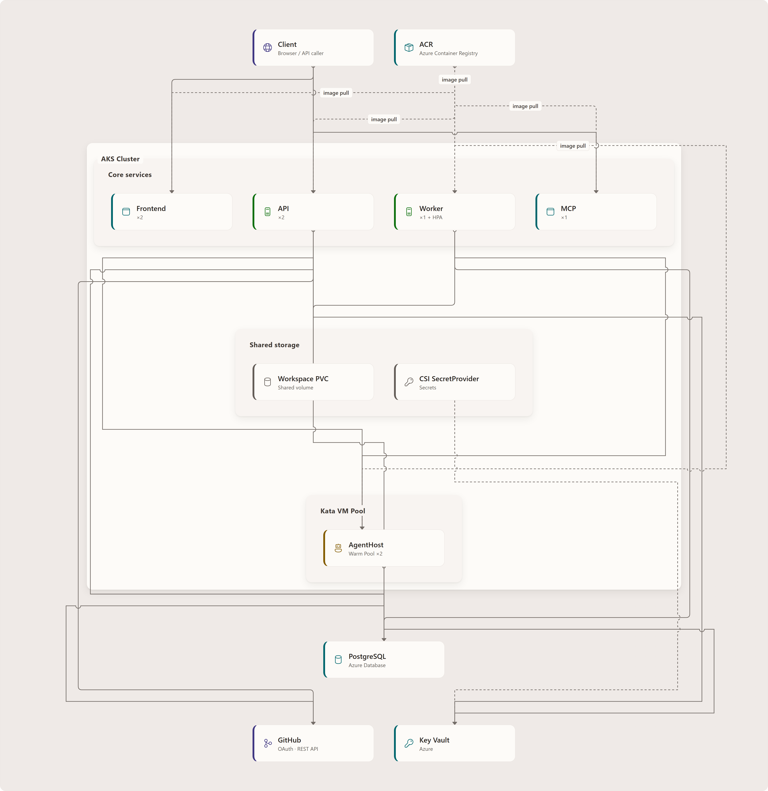

<p align="center">
  
</p>

# Agentweaver

> ⚠️ **Alpha software.** Agentweaver is under active development. Expect breaking changes, incomplete features, and rough edges. Not intended for production use.

Agentweaver runs AI agents inside sandboxed git worktrees, mirrors run events into a shared store so any replica can stream them live, and waits for human review before anything merges.

📖 **[Read the docs at sabbour.me/agentweaver](https://sabbour.me/agentweaver/)** — or browse the source in [docs/index.md](docs/index.md)

## Prerequisites

For local development, install Git, Node.js, and the .NET 10 SDK; Windows also
needs WSL2 + `bubblewrap`. Azure work additionally needs the Azure CLI and
`kubectl`; publishing a release needs the `gh` CLI. `npm run setup` checks the
local-development tools after you clone the repository.

For platform-specific install commands, the Windows isolation requirement, and
OAuth setup, follow the authoritative [Getting started guide](docs/guide/getting-started.md).

## Getting Started with an AI Agent

You do not need to memorize a command catalog to get started. Open your preferred
coding agent—GitHub Copilot CLI or an Agentweaver Squad agent—and describe the
outcome you want. These prompts are ready to paste and give the agent a clear
starting point:

### Understand the project
Get a plain-language tour of the product and the important parts of the repository.

```text
Explain what Agentweaver does and how this repository is structured. Point me to the best places to start reading.
```

### Run it locally
Ask the agent to prepare your machine and start the local development loop.

```text
Set up my local development environment and run Agentweaver. Tell me about any prerequisites I need to install first.
```

### Provision Azure infrastructure
Create a fresh Azure environment; the agent should use `azure:provision-infra` for the first-time infrastructure setup.

```text
Provision a fresh Azure environment for Agentweaver.
```

### Deploy local work to Azure
Ship the current checkout to an existing dev/test environment with `azure:deploy-from-local`—no PR is needed for this validation step.

```text
Deploy my current local changes to the Azure dev/test environment.
```

### Deploy a specific commit to Azure
Ask for a reviewable deployment of a named Git ref using `azure:deploy-from-commit -- <sha-or-ref>`.

```text
Deploy commit abc1234 to the Azure dev/test environment so I can review it.
```

### Create a release
Have the agent guide a real release through `release:publish`, or use `azure:release` for the full cut-and-deploy workflow when appropriate.

```text
Cut a new release of Agentweaver.
```

### Deploy an existing release
Deploy a version that has already been published using `azure:deploy-from-release -- vX.Y.Z`.

```text
Deploy release v1.4.0 to the staging environment.
```

### Investigate a bug or issue
Start with evidence and root cause before deciding how to change the code.

```text
Investigate issue #42 and figure out the root cause before proposing a fix.
```

### Fix a bug or issue
Ask the agent to trace, implement, and validate a focused fix.

```text
Fix the bug described in issue #42.
```

### Create a new feature
Describe the outcome in your own words; the agent can help turn it into an implementation plan.

```text
Add a new feature: <describe what you want>
```

## Features

- **Sandboxed execution** — every agent run lives in an isolated git worktree with Kata VM isolation on AKS
- **Live streaming** — watch every agent step, tool call, and file change in real time from any replica
- **Human-in-the-loop review** — nothing merges until you approve the assembled diff
- **Sandbox browser preview** — open a live in-browser preview of the app running inside a run's sandbox (port-forward)
- **MCP server** — expose Agentweaver runs and outcomes as MCP tools for Claude Desktop and compatible clients

## Quick start

📖 New to Agentweaver? See [Prerequisites](#prerequisites) above if you don't
have git/Node/.NET installed yet, or follow the [full getting started
guide](https://sabbour.me/agentweaver/guide/getting-started).

> **Windows local dev requires WSL2 + `bubblewrap` before you start.** The API
> runs inside WSL2 for a real isolated sandbox; follow
> [Why WSL2 on Windows?](https://sabbour.me/agentweaver/guide/getting-started#why-wsl2-on-windows)
> so setup does not surprise you midway through the first run.

```bash
git clone https://github.com/sabbour/agentweaver.git
cd agentweaver

# One-time bootstrap: prerequisite checks, Web install, .NET restore, and
# appsettings.Development.json scaffolding. No servers or Azure resources.
npm run setup

# Start the API (http://localhost:5000) and the Web UI (http://localhost:5173).
npm run dev
```

Before first sign-in, configure the Microsoft Entra application as
described in the [local authentication
step](https://sabbour.me/agentweaver/guide/getting-started#1-configure-local-authentication-and-model-access).
The first API build can take **1–3 minutes** (commonly longer through a
Windows-mounted WSL2 checkout). API logs stream in the terminal; the loop is
ready only after it prints both **`API is ready`** and **`Web UI is ready`**.

Use `pnpm run <script>` in place of `npm run <script>` if you use pnpm.

### Dev/test versus branching

Local and Azure testing do not require a staging branch:

```text
feature worktree
  ├─ npm run dev ───────────────────────> local test (no GitHub interaction)
  ├─ azure:provision-infra / azure:deploy-from-local ─────> Azure dev/test environment
  ├─ azure:deploy-from-commit <ref> ──────────────────────> exact committed ref, without checkout switching
  └─ PR CI ─> update to latest dev ─> CI rerun ─> squash-merge to protected dev
                                                        └─ green SHA ─> release/vX.Y.Z soak ─> promotion to main
                                                                                                      └─ publish vX.Y.Z ─> deploy from release
```

`npm run dev` uses whatever is checked out locally. Azure dev/test commands
can deploy an unmerged feature branch to a real cluster for integration
testing. The cluster is the staging/integration **environment**; protected
`dev` plus required up-to-date PR checks is the git integration path. See
[Branch Topology](CONTRIBUTING.md#branch-topology) for how branches map to
environments.

## Deploy to Azure

📖 See [Prerequisites](#prerequisites) above (you'll also need the Azure CLI
logged in via `az login`), or the [full Azure deploy
guide](https://sabbour.me/agentweaver/guide/getting-started#deploy-to-azure-one-command).

From a cloned checkout:

```bash
# First/full provisioning of a personal or shared dev/test environment:
npm run azure:provision-infra
```

This is **environment validation, not a release**. Use `azure:provision-infra` to
provision or idempotently reconcile the full environment; after it exists,
use `npm run azure:deploy-from-local` to ship the current clean `HEAD` — even from an
unmerged feature branch/worktree — during normal development, and
`npm run azure:verify` to rerun live checks. Only the release workflow changes
`VERSION`, creates a `vX.Y.Z` tag, and publishes a GitHub Release. See the
[release and deployment command model](RELEASING.md#command-model).

With no arguments, `azure:provision-infra` launches an interactive installer that prompts
for: the Azure subscription (defaulting to your current `az` default), a
resource group (pick an existing one or create a new one), a location, the
AKS cluster / ACR / Key Vault names, the Postgres server/location/access-mode
settings (prefilled with sensible defaults, editable), and Microsoft Entra
application and tenant IDs. It then provisions
the cluster, identity, monitoring, durable MCP OAuth signing/encryption certificates
(with active/previous version overlap during rotation), PostgreSQL,
builds and pushes images (or optionally imports already-published GHCR images
by immutable ref, or four operator-specified fully-qualified custom image
refs), verifies image provenance, and performs an initial SHA-identified
deployment. At the end it prints an **outputs summary** (resource group,
cluster, ACR, namespace, image tags, gateway host/IP, and verification
pass/fail counts). Configure the Entra app's redirect URI for each deployed
environment (for example, `https://<gateway-host>/auth/entra/callback`).
The Copilot GitHub App uses one exact callback for its two OAuth flows. The
project UI and MCP browser handoff enter the project-scoped flow; the other flow
is platform-default.
See [Authentication configuration](docs/guide/configuration.md#project-copilot-app-binding)
for the URL, distinct Repo App and Entra callbacks, and safe migration steps.

**Non-interactive usage** — via flags, environment variables, and/or a params
file (precedence: flags > env > params file > detected defaults > prompt; a
non-interactive run — no TTY, or any flags passed — never blocks on a prompt
and fails fast naming any missing required field):

```bash
npm run azure:provision-infra -- \
  --resource-group agentweaver-rg \
  --cluster-name agentweaver-aks \
  --acr-name agentweaverregistry \
  --location westus2 \
  --monitoring-location westus2 \
  --node-vm-size Standard_D4s_v6 \
  --keyvault-name agentweaver-kv \
  --postgres-server-name agentweaver-pg-staging \
  --postgres-location eastus2 \
  --postgres-ha-mode Disabled \
  --postgres-access-mode public \
  --entra-client-id "$ENTRA_CLIENT_ID" \
  --entra-tenant-id "$ENTRA_TENANT_ID"
```

Optional: pass `--node-vm-size <sku>` or set `NODE_VM_SIZE` to override the default `Standard_D4s_v6` for new AKS system/app/kata pools when your subscription or region requires a different allowed SKU. Existing clusters are unaffected: the value is only used during `az aks create` / `az aks nodepool add`, and the installer idempotently skips those calls when the cluster or pool already exists. You can also pass `--postgres-server-name <name>` or set `PG_SERVER_NAME` to override the default `agentweaver-pg` and route around the rare Azure-global Flexible Server name collision. Pass `--postgres-ha-mode <ZoneRedundant|Disabled>` or set `PG_HA_MODE` to override the default `ZoneRedundant`, which is useful in regions/environments where zone-redundant HA is unavailable (for example early-access/canary regions such as `eastus2euap`).

Log Analytics and Application Insights prefer the AKS region by default. If
that region does not support one of those resource types, provisioning queries
Azure's provider metadata and selects a nearby region that supports every
missing monitoring resource, logging the substitution before creation.
Existing monitoring resources are never moved. Set
`MONITORING_LOCATION` / `--monitoring-location <region>` to choose a different
preferred region explicitly; Azure still validates it and reports any
fallback loudly.

If AKS must stay in one region but PostgreSQL must be provisioned in another, pass
`--postgres-location <region>` (or set `PG_LOCATION`). When `PG_LOCATION`
differs from the main `--location`, Agentweaver intentionally fails closed
unless you also set `--postgres-access-mode public` / `PG_ACCESS_MODE=public`.
That's because Azure Database for PostgreSQL Flexible Server delegated subnet
integration is single-region only: a cross-region server cannot attach to the
AKS VNet privately. Public mode keeps the server on Azure's public endpoint and
uses `--public-access 0.0.0.0`, which creates the standard Azure firewall rule
that allows connections from Azure services/resources only. This is broader
than private VNet access and can include other customers' Azure-hosted sources,
so prefer the default `private` mode whenever the Postgres server can stay in
the same region as AKS.

In-cluster egress policy also follows the access mode. In `private` mode the API
and worker pods get plain Kubernetes `NetworkPolicy` objects
(`allow-api-postgres-egress` / `allow-worker-postgres-egress`) that allow port
5432 to the delegated subnet's CIDR. In `public` mode that CIDR is meaningless —
the server answers on an Azure-managed public IP — so the deploy step instead
emits `CiliumNetworkPolicy` objects (`allow-api-postgres-egress-fqdn` /
`allow-worker-postgres-egress-fqdn`) that allow port 5432 to the server's FQDN
(`<PG_SERVER_NAME>.postgres.database.azure.com`) via Cilium's `toFQDNs` rules,
matching the existing `agentweaver-app-egress-fqdn-allowlist` policy. FQDN-based
egress is used deliberately instead of a static IP allowlist: Azure can change a
public Flexible Server's IP, and a hardcoded `ipBlock` would then silently break
all pod-to-Postgres traffic until someone reconciled it by hand.

Before creating a new PostgreSQL Flexible Server, the installer now also runs a
read-only `az postgres flexible-server list-skus --location <region>` pre-flight
against the target `PG_LOCATION`. If Azure reports that the selected `PG_SKU`
is unavailable, has no supported server editions, or is offer-restricted for
the current subscription/region, the installer fails immediately with Azure's
reason text instead of letting `az postgres flexible-server create` sit in an
indefinite provisioning hang.

Or with a params file (copy [`scripts/azure/params.example.json`](scripts/azure/params.example.json)):

```json
{
  "RESOURCE_GROUP": "agentweaver-rg",
  "CLUSTER_NAME": "agentweaver-aks",
  "ACR_NAME": "agentweaverregistry",
  "LOCATION": "westus2",
  "MONITORING_LOCATION": "westus2",
  "NODE_VM_SIZE": "Standard_D4s_v6",
  "KEYVAULT_NAME": "agentweaver-kv",
  "PG_SERVER_NAME": "agentweaver-pg-staging",
  "PG_LOCATION": "eastus2",
  "PG_HA_MODE": "Disabled",
  "PG_ACCESS_MODE": "public",
  "NAMESPACE": "agentweaver",
  "ENTRA_CLIENT_ID": "your-entra-application-client-id",
  "ENTRA_TENANT_ID": "your-entra-tenant-id",
  "IMAGE_TAG": "",
  "SKIP_POSTGRES": false,
  "SKIP_OAUTH_KEY": false
}
```

```bash
npm run azure:provision-infra -- --params-file scripts/azure/params.my-env.json
```

To reuse the container images already published by `.github/workflows/publish-images.yml`
instead of rebuilding them into ACR, pass `--image-source ghcr --ghcr-ref <ref>`.
`<ref>` must be immutable: either a published `vX.Y.Z` GitHub Release tag or a
`sha-<hex>` image tag. Moving tags such as `dev`, `main`, `latest`, and `rc-*`
are rejected. The GHCR owner/repository is always derived from the repo's
GitHub origin remote, `--ghcr-token`/`GHCR_TOKEN` is available for private-
package auth, and `--force` is required before overwriting an existing
conflicting ACR tag.

To import images from any registry you trust instead of the repo-derived GHCR
owner, use `--image-source custom` and pass all four fully-qualified refs:

```bash
npm run azure:provision-infra -- \
  --image-source custom \
  --image-api ghcr.io/someuser/agentweaver-api:v1.2.3 \
  --image-frontend ghcr.io/someuser/agentweaver-frontend:v1.2.3 \
  --image-mcp ghcr.io/someuser/agentweaver-mcp:v1.2.3 \
  --image-agent-host ghcr.io/someuser/agentweaver-agent-host:v1.2.3
```

The installer fails closed if any one of the four refs is missing or malformed.
Unlike `--image-source ghcr`, custom mode does **not** derive or restrict the
registry/owner from the Git remote; that is intentional, and it means custom
mode trusts whatever registry/image you provide.

**Deploying current local work to an existing environment:**

```bash
npm run azure:deploy-from-local
```

`azure:deploy-from-local` deploys current local work without assigning release
identity. It is distinct from `azure:provision-infra` (initial/full setup) and
from `azure:deploy-from-release` (an existing published semver release). It
mints an immutable short-SHA tag from `HEAD`, builds and pushes images,
redeploys, performs post-deploy provenance verification, and waits for the
AgentHost warm pool.

To deploy a teammate's branch, PR ref, or older commit without switching your
own checkout:

```bash
npm run azure:deploy-from-commit -- origin/feature-branch
```

The command resolves the ref to an exact commit, creates a temporary detached
worktree, and runs the same short-SHA deployment pipeline. It never includes
uncommitted local state.

**Related commands** (see the [operations guide](docs/guide/operations.md) and
[AKS deployment runbook](docs/guide/deployment-aks.md) for more detail):

- `npm run release:publish` — create the tag and GitHub Release only.
- `npm run azure:deploy-from-release -- vX.Y.Z` — deploy an existing published release. By default this rebuilds images from source into ACR; add `--image-source ghcr` to import the images `.github/workflows/publish-images.yml` already published for that tag instead (the GHCR ref is always the release tag, and the owner/repository is derived from the GitHub origin remote — pass `--ghcr-token`/`GHCR_TOKEN` for private packages). This is the lightweight, images-only way to deploy a version bump: it never touches cluster/ACR/Postgres/identity infrastructure.
- `npm run azure:release` — publish and perform the first deployment as one resumable orchestration.
- `npm run azure:verify` — runs the post-deploy health verification checks on their own.

### Local development

```bash
# Supported full environment (API + Web UI; no browser auto-open)
npm run dev

# Same orchestration, but open the browser when ready
npm run dev:open

# Frontend only (builds, then starts Vite)
npm run dev:web

# API only (builds, then starts the API)
npm run dev:api
```

Use `pnpm run` with the same script name if you use pnpm.

### Run components manually

Start each component from the repo root (three terminals). On Windows, use the
full `npm run dev` loop for actual agent execution: the raw `dotnet run`
command below runs natively and does not provide the required WSL2 +
`bubblewrap` sandbox path; it is suitable only for API debugging that does not
execute model-generated commands.

```bash
# Terminal 1 — API backend
dotnet run --project apps/Agentweaver.Api

# Terminal 2 — MCP server (optional)
dotnet run --project apps/Agentweaver.Mcp

# Terminal 3 — Web UI (Vite dev server, hot reload)
npm --prefix apps/web run dev
```

Configure local Entra client and tenant IDs as described in the [local
authentication step](https://sabbour.me/agentweaver/guide/getting-started#1-configure-local-authentication-and-model-access).

### Package scripts

From the repository root, run these with `npm run <script>` (or `pnpm run <script>`):

| Script | Purpose |
| --- | --- |
| `setup` | Local dev environment setup only: checks prerequisites (git/.NET 10/Node 20+), installs `apps/web`'s npm deps, restores .NET packages. No Azure calls. |
| `azure:provision-infra` | Interactive/non-interactive installer — provisions everything and deploys (replaces the old `install.sh`/`.ps1`). |
| `azure:deploy-from-local` | Deploy current local HEAD using a short-SHA image identifier; no release identity. |
| `azure:deploy-from-commit` | Deploy an arbitrary exact committed ref through a temporary detached worktree. |
| `azure:deploy-from-release` | Deploy an existing published `vX.Y.Z` release to the configured environment. |
| `release:publish` | Create an annotated tag and GitHub Release from a prepared exact-main checkout; no deploy. |
| `azure:release` | Publish and deploy a prepared release by composing the two commands above. |
| `azure:verify` | Post-deploy health verification checks. |
| `dev` / `start` | Start the full local API + Web UI dev environment (WSL2 + bubblewrap sandbox on Windows). No Azure calls; browser does not auto-open. |
| `dev:open` | Same as `dev`, but opens the browser automatically once ready. Also makes no Azure calls. |
| `dev:web` | Build the web frontend, then start Vite. |
| `dev:api` | Build the API in Release mode, then run it without rebuilding. |

> **Never use `:latest`.** The default image tag is the short git SHA (`git rev-parse --short HEAD`). Always pin to a specific SHA for reproducible deployments — image tags are immutable per build.

## Skills

Project skills in [`.copilot/skills/`](.copilot/skills/) capture Agentweaver's
project-specific operating practices:

- **agentweaver-azure-fluent-system-sync** — Refresh the Azure Fluent System library from Azure UI Kit / Fluent 2 via Figma MCP and validate checked-in React, CSS, docs, and showcase artifacts.
- **agentweaver-docs-feature** — Full authoring playbook for documenting new or existing features across all documentation facets.
- **agentweaver-docs-sync** — Keep Agentweaver docs in sync with code changes, including source grounding, regeneration, and builds.
- **agentweaver-git-workflow** — Agentweaver Git workflow for protected dev integration, worktrees, and PRs.
- **agentweaver-github-issue** — File a well-structured GitHub issue and dispatch the right Squad member for triage, RCA, or specification work.
- **agentweaver-issue-status** — Print a live pipeline status board for GitHub issues, deployments, and documentation disposition.
- **agentweaver-playwright-cli** — Automate browser interactions, test web pages, and work with Playwright tests.

GitHub Copilot CLI discovers its official skill paths in
[`.github/skills/`](.github/skills/); these thin entry points expose the
project's maintained harness workflows:

- **agentweaver-api-harness** — Run Agentweaver's REST API harness for backend validation, repro reruns, or plain-English scenario exploration.
- **agentweaver-harness** — Run Agentweaver's complete cross-surface persona harness for validation, regression, or exploratory passes.
- **agentweaver-harness-scenarios** — List built-in harness scenarios and persona catalogs, or generate reviewed surface adapters.
- **agentweaver-mcp-harness** — Run Agentweaver's MCP protocol harness for tool-surface validation, repro reruns, or scenario exploration.
- **agentweaver-ui-harness** — Run Agentweaver's deployed-UI harness for browser evidence, repros, or scenario exploration.

All network harnesses use host-agnostic transport validation: arbitrary HTTPS hosts
are accepted, HTTP is loopback-only, URL credentials/fragments and TLS bypasses are
rejected, and bearer/session credentials remain confined to their configured origin.
Deterministic MCP smoke deletes only the unique project it creates.

## AKS architecture

### Block diagram



<!--
  Pre-rendered as a static PNG from docs/diagrams/src/aks-block-diagram.json
  by docs/diagram-renderer (a Fluent-styled React Flow app) + Playwright, so
  it matches the same card/icon/badge look used live in the product UI
  instead of generic Mermaid/mermaid-cli output. To edit the diagram: change
  the graph-spec JSON, then run `npm run docs:render-diagrams` and commit the
  regenerated PNG + .hash.txt. CI fails if the spec's content hash drifts from
  the committed .hash.txt (see scripts/docs/capture-diagrams.mjs).
-->

> Full component breakdown, networking, security model, and warm-pool lifecycle: [AKS Architecture →](docs/guide/architecture-aks.md)

## Key docs

- [Getting started](docs/guide/getting-started.md)
- [API reference](docs/reference/api.md)
- [MCP server reference](docs/reference/mcp.md)
- [AKS architecture](docs/guide/architecture-aks.md)
- [Contributing](CONTRIBUTING.md)
- [Releasing](RELEASING.md)

## Skills

- [Agentweaver changelog](.copilot/skills/agentweaver-changelog/SKILL.md) —
  Changesets, release publication, release notes, and release deployment identity.
