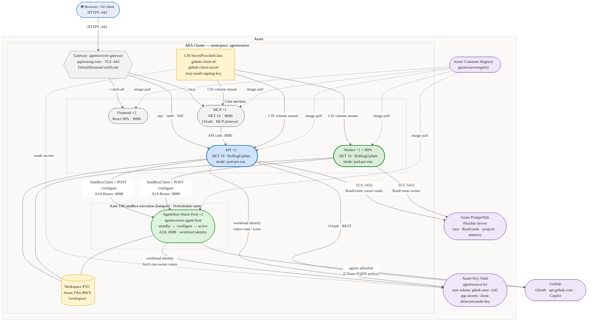
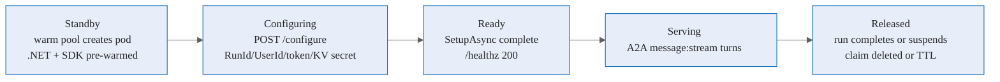
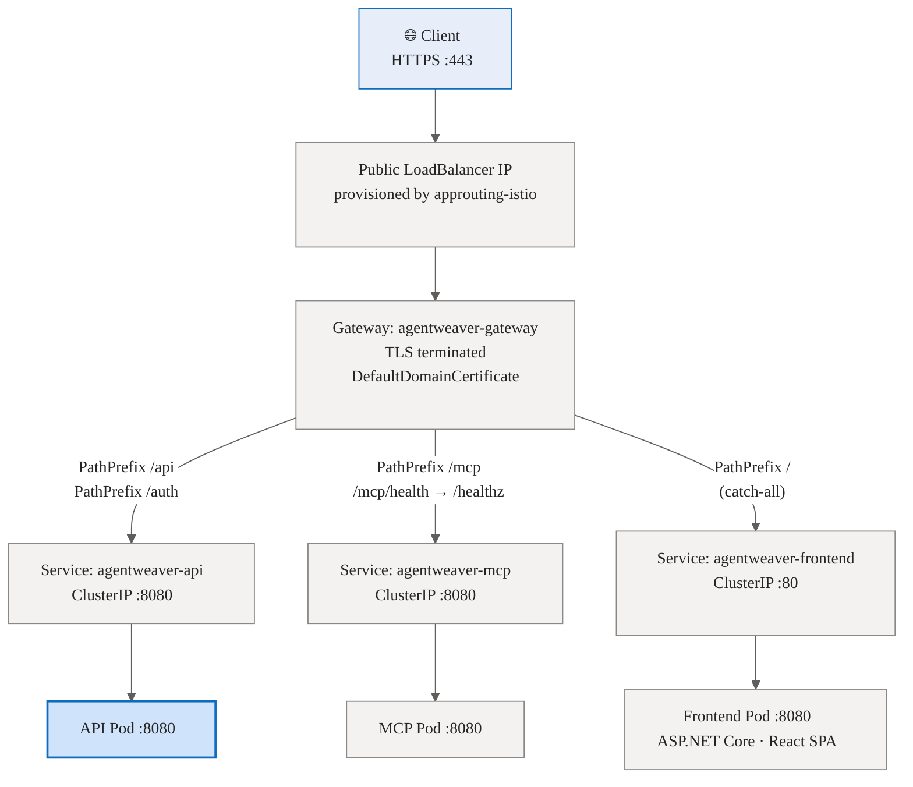
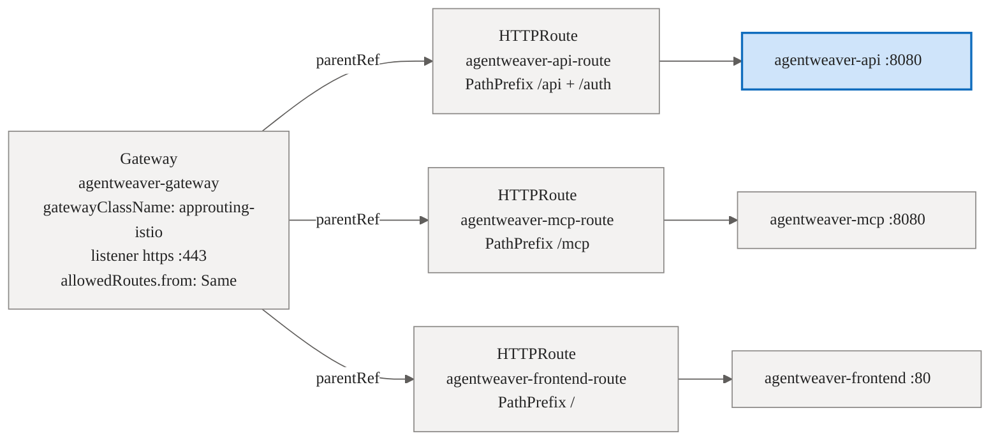
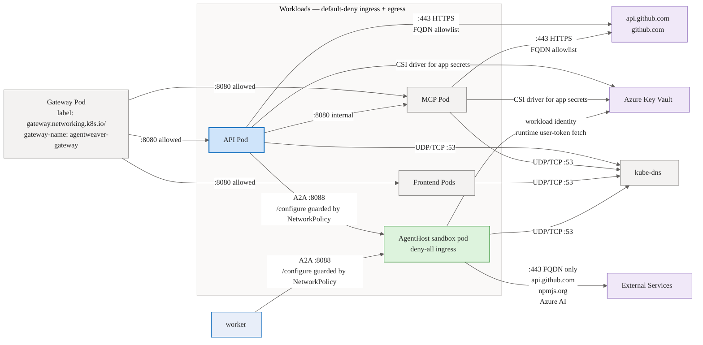

# AKS Architecture

This document describes the architecture of the Agentweaver AKS deployment: its components, networking topology, security model, and storage design.

For step-by-step deployment instructions see [Deploy to AKS](/guide/deployment-aks).

---

## Component diagram

> A simplified block diagram is also available: [aks-architecture-block.excalidraw](../aks-architecture-block.excalidraw) — open at [aka.ms/excalidraw](https://aka.ms/excalidraw).



---


## AgentHost warm-pool lifecycle

The Worker now runs in `pod-per-run`, so coordinator child agents execute in AgentHost pods via this warm pool rather than in-process on the Worker:

- **AgentHost pool** — `agentweaver-agent-host`, `k8s/sandbox-warmpool-agenthost.yaml`, `replicas: 2`, keeps two AgentHost pods pre-warmed for live agent turns.

Warm AgentHost pods boot with no `RunId`, enter standby, and accept `POST /configure` even while not ready for A2A turns. The executor claims one warm pod, waits for the claim binding, calls `/configure` with `{ runId, userId, turnBearerToken, kvUserSecretName, workingDirectory }`, then waits for `/healthz` to become ready before sending the first `message:stream` turn. `workingDirectory` is the run's `WorktreePath`, so pod setup and file tools share the worktree path named by the system prompt. The pod lifecycle is:



`/configure` has one-time semantics (`409` after the first successful configuration). It is not protected by the turn bearer token because it delivers that token; the NetworkPolicy limiting AgentHost ingress to API/worker pods is the guard.

The live sandbox path binds claims to the AgentHost warm pool (`AgentHostWarmPoolRef`, default `agentweaver-agent-host`) and delivers per-run context through `/configure`; it does not create per-run templates or per-run warm pools for AgentHost. Source: `apps/Agentweaver.Api/Sandbox/KubernetesSandboxExecutor.cs:40`, `apps/Agentweaver.Api/Sandbox/KubernetesSandboxExecutor.cs:332`, `apps/Agentweaver.Api/Sandbox/KubernetesSandboxExecutor.cs:480`, `apps/Agentweaver.Api/Sandbox/KubernetesSandboxExecutor.cs:497`, `k8s/sandbox-template-agenthost.yaml:36`, `k8s/sandbox-warmpool-agenthost.yaml:19`.

---

## Networking flow

### Inbound request path



Route specificity: `/api` and `/mcp` (longer prefixes) win over `/` — no conflict.

### Gateway API resource relationships



---

## Security model

### Network security — Cilium NetworkPolicy

The cluster is provisioned with `--network-dataplane cilium` (Azure CNI Overlay + Cilium). Cilium enforces all `NetworkPolicy` resources and also exposes `CiliumNetworkPolicy` for FQDN-based egress control when needed.

The `approuting-istio` gateway class means the Application Routing add-on uses an Istio-based data plane for the **gateway only** — no Istio service mesh, sidecars, or ambient mode runs on workload pods.

### Security policies

#### Network traffic diagram



#### NetworkPolicy rules

| Policy | Selector | Effect |
|--------|----------|--------|
| `default-deny-ingress` | all `app.kubernetes.io/part-of: agentweaver` pods (gateway excluded) | Denies all inbound by default |
| `allow-gateway-to-api` | `app: agentweaver-api` | Ingress on :8080 from gateway pods or `aks-istio-ingress` namespace |
| `allow-gateway-to-frontend` | `app: agentweaver-frontend` | Ingress on :8080 from gateway pods or `aks-istio-ingress` namespace |
| `allow-gateway-to-mcp` | `app: agentweaver-mcp` | Ingress on :8080 from gateway pods or `aks-istio-ingress` namespace |
| `default-deny-egress-apps` | api, mcp, frontend | Denies all egress by default |
| `allow-app-dns-egress` | api, mcp, frontend | UDP/TCP :53 to `kube-dns` |
| `allow-app-internal-egress` | api, mcp, frontend | TCP :8080 to other `app.kubernetes.io/part-of: agentweaver` pods |
| `allow-app-external-https-egress` | api, mcp only | TCP :443 to any external host |
| `sandbox-deny-ingress` | `app: agentweaver-sandbox` | Denies all ingress by default |
| `allow-worker-to-agenthost-a2a` | `app: agentweaver-sandbox` | Opens TCP :8088 only from worker/API pods for AgentHost A2A turns |
| `sandbox-egress-allowlist` | `app: agentweaver-sandbox` | DNS + TCP :443 to `140.82.112.0/20` (GitHub) |

Gateway pods are identified by `gateway.networking.k8s.io/gateway-name: agentweaver-gateway`, set automatically by the approuting-istio controller.

#### Sandbox isolation

Sandbox pods (`k8s/networkpolicy-sandbox.yaml` plus `k8s/networkpolicy-agenthost.yaml`) have a deny-by-default posture with one turn-path exception:
- **Ingress deny-all by default** — command execution still uses pod-exec through the kube-apiserver.
- **A2A ingress exception** — `allow-worker-to-agenthost-a2a` opens only TCP `8088` from worker/API pods to AgentHost pods. `POST /configure` is intentionally not protected by the turn bearer token because it delivers that token; NetworkPolicy is the guard. `POST /a2a/agent/v1/message:stream` still requires `Authorization: Bearer {per-run token}`, delivered by `/configure` and unique per run.
- **Egress allow-list** — DNS (`kube-dns`) + HTTPS on port 443 to the GitHub IP range `140.82.112.0/20` only. The cluster-internal pod and service CIDRs are not in the allow-list, so sandbox pods cannot reach API or other workload pods via the network.

The FQDN-based `CiliumNetworkPolicy` in `k8s/cilium-network-policy-sandbox.yaml` further narrows sandbox internet egress to specific hostnames: `api.github.com`, `registry.npmjs.org` (and `*.npmjs.org`), and Azure AI service domains. This policy requires `--network-dataplane cilium --enable-acns` at cluster creation and must be applied alongside `networkpolicy-sandbox.yaml`.

### Non-root containers

Both the API and Frontend containers run as UID 1000 (`runAsNonRoot: true`, `runAsUser: 1000`). Capabilities are dropped (`capabilities.drop: [ALL]`). The API pod additionally sets `allowPrivilegeEscalation: false`.

### Sandbox isolation

Agent runs execute shell commands in per-run Kata VM isolated sandbox pods
(`runtimeClassName: kata-vm-isolation`), claimed from a pre-warmed `SandboxWarmPool`
via a `SandboxClaim` (`extensions.agents.x-k8s.io/v1beta1`). This provides VM-grade
isolation. The API selects the `KubernetesSandboxExecutor` automatically when it detects
the in-cluster environment (`KUBERNETES_SERVICE_HOST` is set).
See [Deploy to AKS](/guide/deployment-aks#sandbox-setup) for setup details.

### Secrets management

Secrets are delivered from **Azure Key Vault** with **Azure Workload Identity**. API app secrets still use the Secrets Store CSI driver; AgentHost user GitHub tokens are fetched at `/configure` time by the pod itself using workload identity and the configured Key Vault URI. There are no static credentials in any manifest.

```mermaid
%%{init: {'theme':'base','themeVariables':{'fontFamily':'Segoe UI, system-ui, -apple-system, sans-serif','fontSize':'15px','primaryColor':'#E8EEF9','primaryBorderColor':'#0F6CBD','primaryTextColor':'#242424','lineColor':'#605E5C','clusterBkg':'#FAF9F8','clusterBorder':'#D2D0CE','edgeLabelBackground':'#FFFFFF'}}}%%
flowchart LR
    MI["Managed Identity<br/>agentweaver-api-identity<br/>Key Vault Secrets User"]
    SA["ServiceAccount<br/>agentweaver-api<br/>azure.workload.identity/client-id"]
    SA2["ServiceAccount<br/>agentweaver-agent-host<br/>azure.workload.identity/client-id"]
    OIDC["AKS OIDC Issuer<br/>agentweaver-api-fedcred"]
    OIDC2["AKS OIDC Issuer<br/>agentweaver-agenthost-fedcred"]
    KV["Azure Key Vault<br/>agentweaver-kv"]

    SPC["SecretProviderClass<br/>agentweaver-secrets"]
    USERSECRET["Per-user GitHub token secret<br/>ghtok-user--{base32(userId)}"]

    API["API Pod<br/>/mnt/secrets-store/<br/>github-client-id<br/>github-client-secret<br/>mcp-oauth-signing-key"]
    AGENT["Warm AgentHost Pod<br/>KeyVaultUserTokenProvider"]
    MCP["MCP Pod<br/>(no mounted secrets)"]

    SA -->|"federated credential"| OIDC --> MI
    SA2 -->|"federated credential"| OIDC2 --> MI
    MI -->|"Key Vault Secrets User"| KV
    KV --> SPC -->|"CSI volume mount"| API
    KV --> USERSECRET -->|"SecretClient + DefaultAzureCredential<br/>after POST /configure"| AGENT

    classDef client fill:#E8EEF9,stroke:#0F6CBD,stroke-width:1px,color:#242424;
    classDef svc fill:#F3F2F1,stroke:#8A8886,stroke-width:1px,color:#242424;
    classDef core fill:#CFE4FA,stroke:#0F6CBD,stroke-width:2px,color:#242424;
    classDef data fill:#FFF4CE,stroke:#C19C00,stroke-width:1px,color:#242424;
    classDef ext fill:#F0E8F8,stroke:#8764B8,stroke-width:1px,color:#242424;
    classDef runtime fill:#DDF3DD,stroke:#107C10,stroke-width:1px,color:#242424;
    classDef evt fill:#D6F0F0,stroke:#038387,stroke-width:1px,color:#242424;

    class SA,SA2,SPC,USERSECRET,MCP svc;
    class API,AGENT core;
    class MI,OIDC,KV ext;
```



The API's `ServiceAccount` (`agentweaver-api`) is annotated with a managed identity client ID and federated to a user-assigned managed identity through the cluster's OIDC issuer. The `agentweaver-agent-host` ServiceAccount shares the same managed identity (`agentweaver-api-identity`) via a second federated credential (`agentweaver-agenthost-fedcred`), allowing warm AgentHost pods to call Key Vault directly with workload identity.

One static `SecretProviderClass` object syncs app secrets from Key Vault into the API pod volume:

**`agentweaver-secrets`** (used by API pod, `k8s/secret-provider-class.yaml`):

| Key Vault secret | File in `/mnt/secrets-store/` | Used for |
|-----------------|------------------------------|----------|
| `github-client-id` | `github-client-id` | GitHub OAuth App client ID → `GitHub__ClientId` env var |
| `github-client-secret` | `github-client-secret` | GitHub OAuth App client secret → `GitHub__ClientSecret` env var |
| `mcp-oauth-signing-key` | `mcp-oauth-signing-key` | ECDSA P-256 key for signing Agentweaver OAuth tokens → `Auth__OAuth__SigningKey` |

The MCP pod mounts no secrets; MCP auth relies only on OAuth (Agentweaver-minted JWT + transitional GitHub passthrough).

Secrets are read at pod startup via a shell wrapper in the container `command` — they are sourced from files, not injected as Kubernetes Secret refs. The CSI volume mount on `/mnt/secrets-store` is required to trigger synchronization; without it the files are never written.

Secret rotation polling is set to 2 minutes (`secrets-store.csi.k8s.io/rotation-poll-interval: "2m"`) for CSI-mounted API app secrets. AgentHost user tokens no longer use CSI projection, per-run `SecretProviderClass` objects, or cloned templates/warm pools. Each authenticated user's GitHub OAuth token is stored in Key Vault under a per-user key (`ghtok-user--{base32(userId)}`). At run launch, `KubernetesSandboxExecutor` claims a pod from the shared `agentweaver-agent-host` pool, calls `POST /configure` with the run owner's secret name, and the pod's `KeyVaultUserTokenProvider` fetches only that secret through `SecretClient` + `DefaultAzureCredential`, caching it for the pod lifetime. `AgentHostUserTokenSyncService` and per-run SPC cleanup have both been removed.

---

## Authentication

Agentweaver uses **GitHub OAuth** for user authentication. There are no API keys issued to end users.

### Login flow

1. User visits the frontend and clicks **Sign in with GitHub**
2. Frontend redirects to `https://<host>/auth/github/login` (API endpoint)
3. API redirects to GitHub OAuth authorization URL with the app's client ID
4. User authorizes on GitHub; GitHub redirects back to `https://<host>/auth/github/callback`
5. API exchanges the authorization code for an access token using `github-client-id` and `github-client-secret` (from Key Vault)
6. API validates the token by calling `GET https://api.github.com/user` — the token is the user's GitHub OAuth token
7. API stores the token only in the authenticated user's Key Vault-backed scope (`GitHubTokenScope.ForUser(login)`, `ghtok-user--{base32(userId)}`)
8. API checks the user's org membership (`Auth__GitHub__AllowedOrg: microsoft`) — users not in the org are rejected
9. API issues a session and returns a cookie or Bearer token to the frontend

### MCP authentication

The MCP server (`agentweaver-mcp`) accepts inbound connections with a Bearer token. It forwards the caller's Bearer token as-is to the API (`AGENTWEAVER_API_URL: http://agentweaver-api:8080`). The API validates the token as an Agentweaver-minted JWT or a GitHub OAuth token via the `GET /user` + org membership flow. There is no static MCP bearer key — auth relies only on the OAuth paths.

### External dependencies

| Service | Purpose | Allowed by |
|---------|---------|-----------|
| `api.github.com` | OAuth token validation (`GET /user`), org membership | `CiliumNetworkPolicy` FQDN allowlist |
| `github.com` | GitHub OAuth redirect and OAuth exchange | `CiliumNetworkPolicy` FQDN allowlist |
| Azure Key Vault (`*.vault.azure.net`) | Secret fetch via CSI driver | HTTPS egress + workload identity |
| Azure Container Registry (`agentweaverregistry.azurecr.io`) | Image pull (kubelet, not pod) | ACR attachment on cluster |
| OpenTelemetry collector (`otel-collector.observability.svc.cluster.local:4317`) | Telemetry export (gRPC) | `CiliumNetworkPolicy` FQDN allowlist |

---

## Storage model

### PostgreSQL (primary data store)

The API uses **Azure Database for PostgreSQL Flexible Server** for all application state. The connection string is provisioned by `scripts/aks/17-provision-postgres.sh`, stored in the `agentweaver-postgres` Kubernetes Secret, and injected as environment variables at pod startup.

Both the `SqliteDb` (projects, runs, backlog, revisions) and the `MemoryDbContext` (decisions, agent memory, OAuth state, checkpoints) are wired to the same Postgres instance in production via `Database__Provider=Postgres`:

| Connection string key | Used by | Contents |
|-----------------------|---------|----------|
| `ConnectionStrings__Postgres` | `SqliteDb` (Dapper) | Projects, runs, backlog tasks, revisions, run events |
| `ConnectionStrings__MemoryDb` | `MemoryDbContext` (EF Core) | Decisions, agent memory, steering, OAuth state, checkpoints |

With Postgres as the data store, the API can run two replicas with `RollingUpdate` — no single-writer constraint.

### Workspace volume

One PersistentVolumeClaim handles all filesystem-backed state:

- `agentweaver-workspace` — Azure Files (`azurefile-csi-premium`, RWX), mounted at `/workspace`. Shared across all replicas and the worker pod.

```
PVC: agentweaver-workspace (Azure Files, RWX)
  storageClass: azurefile-csi-premium
  mountPath: /workspace
  │
  ├── .home/                   (shared HOME dir — app/runtime state; no GitHub token mirror)
  ├── worktrees/               (git worktrees per run)
  └── <project workspaces>     (project working directories)
```

### EF Core migrations

On startup, the API runs schema migrations via an **init container** (`migrate-memory-db`) that executes the EF bundle (`/app/efbundle`) against the Postgres connection string. This runs before the main API container starts, ensuring the schema is always current before the application accepts traffic.

The init container uses the same image as the API (`agentweaver-api:${IMAGE_TAG}`) and reads `ConnectionStrings__MemoryDb` + `ConnectionStrings__Postgres` from the `agentweaver-postgres` Secret.

### Ephemeral storage for testing

For throwaway testing without Postgres, set `Database__Provider=Sqlite` in the API environment and replace the workspace `persistentVolumeClaim` volume with `emptyDir`:

```yaml
volumes:
  - name: workspace
    emptyDir: {}
```

Data will be lost on pod restart, but the stack is fully functional for validation. SQLite mode enforces `replicas: 1` + `strategy: Recreate` to prevent write contention.
