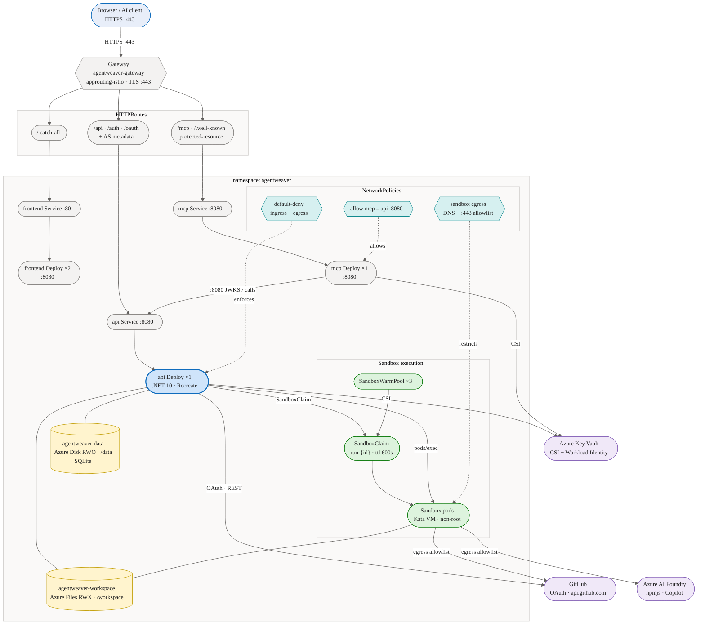
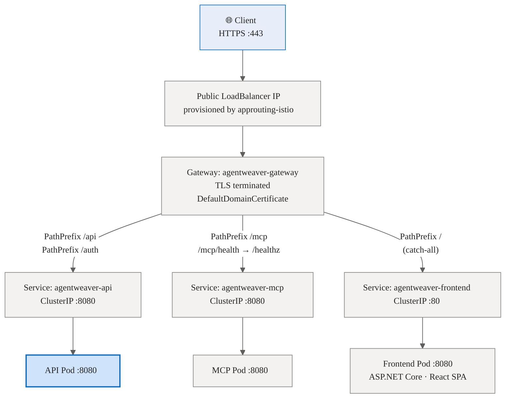
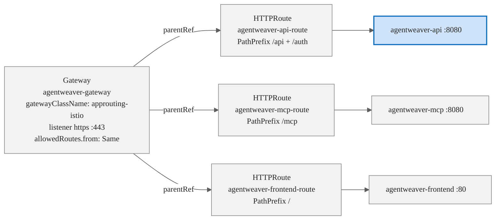
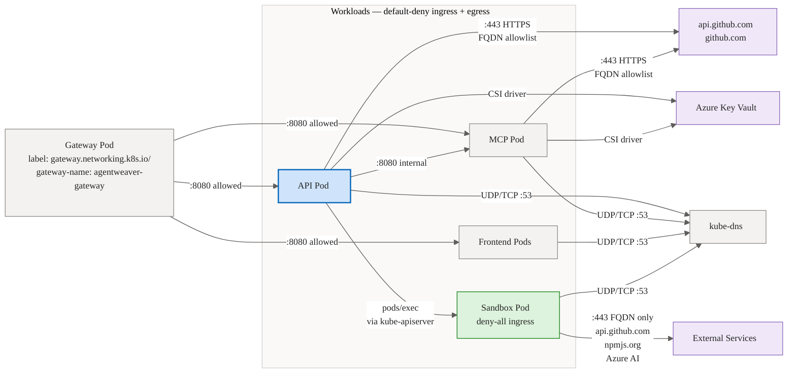
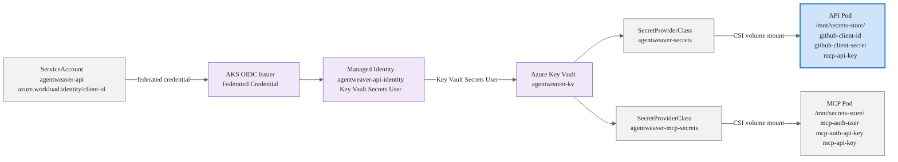

# AKS Architecture

This document describes the architecture of the Agentweaver AKS deployment: its components, networking topology, security model, and storage design.

For step-by-step deployment instructions see [Deploy to AKS](/guide/deployment-aks).

---

## Component diagram



---

## Networking flow

### Inbound request path



Route specificity: `/api` and `/mcp` (longer prefixes) win over `/` — no conflict.

### Gateway API resource relationships



---

## Security model

### Network security — Cilium NetworkPolicy

The cluster is provisioned with `--network-dataplane cilium` (Azure CNI Overlay + Cilium). Cilium enforces all `NetworkPolicy` resources and also exposes `CiliumNetworkPolicy` for FQDN-based egress control when needed.

The `approuting-istio` gateway class means the Application Routing add-on uses an Istio-based data plane for the **gateway only** — no Istio service mesh, sidecars, or ambient mode runs on workload pods.

### Security policies

#### Network traffic diagram



#### NetworkPolicy rules

| Policy | Selector | Effect |
|--------|----------|--------|
| `default-deny-ingress` | all `app.kubernetes.io/part-of: agentweaver` pods (gateway excluded) | Denies all inbound by default |
| `allow-gateway-to-api` | `app: agentweaver-api` | Ingress on :8080 from gateway pods or `aks-istio-ingress` namespace |
| `allow-gateway-to-frontend` | `app: agentweaver-frontend` | Ingress on :8080 from gateway pods or `aks-istio-ingress` namespace |
| `allow-gateway-to-mcp` | `app: agentweaver-mcp` | Ingress on :8080 from gateway pods or `aks-istio-ingress` namespace |
| `default-deny-egress-apps` | api, mcp, frontend | Denies all egress by default |
| `allow-app-dns-egress` | api, mcp, frontend | UDP/TCP :53 to `kube-dns` |
| `allow-app-internal-egress` | api, mcp, frontend | TCP :8080 to other `app.kubernetes.io/part-of: agentweaver` pods |
| `allow-app-external-https-egress` | api, mcp only | TCP :443 to any external host |
| `sandbox-deny-ingress` | `app: agentweaver-sandbox` | Denies all ingress |
| `sandbox-egress-allowlist` | `app: agentweaver-sandbox` | DNS + TCP :443 to `140.82.112.0/20` (GitHub) |

Gateway pods are identified by `gateway.networking.k8s.io/gateway-name: agentweaver-gateway`, set automatically by the approuting-istio controller.

#### Sandbox isolation

Sandbox pods (`k8s/networkpolicy-sandbox.yaml`) have two policies:
- **Ingress deny-all** — the API accesses sandbox pods via pod-exec through the kube-apiserver, not direct networking.
- **Egress allow-list** — DNS (`kube-dns`) + HTTPS on port 443 to the GitHub IP range `140.82.112.0/20` only. The cluster-internal pod and service CIDRs are not in the allow-list, so sandbox pods cannot reach API or other workload pods via the network.

The FQDN-based `CiliumNetworkPolicy` in `k8s/cilium-network-policy-sandbox.yaml` further narrows sandbox internet egress to specific hostnames: `api.github.com`, `registry.npmjs.org` (and `*.npmjs.org`), and Azure AI service domains. This policy requires `--network-dataplane cilium --enable-acns` at cluster creation and must be applied alongside `networkpolicy-sandbox.yaml`.

### Non-root containers

Both the API and Frontend containers run as UID 1000 (`runAsNonRoot: true`, `runAsUser: 1000`). Capabilities are dropped (`capabilities.drop: [ALL]`). The API pod additionally sets `allowPrivilegeEscalation: false`.

### Sandbox isolation

Agent runs execute shell commands in per-run Kata VM isolated sandbox pods
(`runtimeClassName: kata-vm-isolation`), claimed from a pre-warmed `SandboxWarmPool`
via a `SandboxClaim` (`extensions.agents.x-k8s.io/v1alpha1`). This provides VM-grade
isolation. The API selects the `KubernetesSandboxExecutor` automatically when it detects
the in-cluster environment (`KUBERNETES_SERVICE_HOST` is set).
See [Deploy to AKS](/guide/deployment-aks#sandbox-setup) for setup details.

### Secrets management

Secrets are delivered from **Azure Key Vault** via the **Secrets Store CSI driver** and **Azure Workload Identity** — there are no static credentials in any manifest.



The API's `ServiceAccount` (`agentweaver-api`) is annotated with a managed identity client ID and federated to a user-assigned managed identity through the cluster's OIDC issuer. Two `SecretProviderClass` objects sync secrets from Key Vault into pod volumes:

**`agentweaver-secrets`** (used by API pod, `k8s/secret-provider-class.yaml`):

| Key Vault secret | File in `/mnt/secrets-store/` | Used for |
|-----------------|------------------------------|----------|
| `github-client-id` | `github-client-id` | GitHub OAuth App client ID → `GitHub__ClientId` env var |
| `github-client-secret` | `github-client-secret` | GitHub OAuth App client secret → `GitHub__ClientSecret` env var |
| `mcp-api-key` | `mcp-api-key` | Internal key used by MCP server to call the API → `Auth__ApiKey` / `Mcp__ApiKey` |

**`agentweaver-mcp-secrets`** (used by MCP pod, `k8s/secretprovider-mcp.yaml`):

| Key Vault secret | File in `/mnt/secrets-store/` | Used for |
|-----------------|------------------------------|----------|
| `mcp-auth-user` | `mcp-auth-user` | Username for inbound MCP authentication → `Auth__User` env var |
| `mcp-auth-api-key` | `mcp-auth-api-key` | Inbound bearer key accepted from MCP callers |
| `mcp-api-key` | `mcp-api-key` | Key used to authenticate MCP server calls to the API |

Secrets are read at pod startup via a shell wrapper in the container `command` — they are sourced from files, not injected as Kubernetes Secret refs. The CSI volume mount on `/mnt/secrets-store` is required to trigger synchronization; without it the files are never written.

Secret rotation polling is set to 2 minutes (`secrets-store.csi.k8s.io/rotation-poll-interval: "2m"`). The CSI driver re-fetches Key Vault secrets on this interval, but pods must be restarted to pick up new values (the startup shell script reads files once on launch).

---

## Authentication

Agentweaver uses **GitHub OAuth** for user authentication. There are no API keys issued to end users.

### Login flow

1. User visits the frontend and clicks **Sign in with GitHub**
2. Frontend redirects to `https://<host>/auth/github/login` (API endpoint)
3. API redirects to GitHub OAuth authorization URL with the app's client ID
4. User authorizes on GitHub; GitHub redirects back to `https://<host>/auth/github/callback`
5. API exchanges the authorization code for an access token using `github-client-id` and `github-client-secret` (from Key Vault)
6. API validates the token by calling `GET https://api.github.com/user` — the token is the user's GitHub OAuth token
7. API checks the user's org membership (`Auth__GitHub__AllowedOrg: microsoft`) — users not in the org are rejected
8. API issues a session and returns a cookie or Bearer token to the frontend

### MCP authentication

The MCP server (`agentweaver-mcp`) accepts inbound connections with a Bearer token. It forwards the caller's Bearer token as-is to the API (`AGENTWEAVER_API_URL: http://agentweaver-api:8080`). The API validates the token as a GitHub OAuth token via the same `GET /user` + org membership flow.

For internal tooling or automated callers, an alternative `mcp-auth-api-key` / `mcp-auth-user` pair is also accepted (stored in Key Vault, mounted in the MCP pod).

### External dependencies

| Service | Purpose | Allowed by |
|---------|---------|-----------|
| `api.github.com` | OAuth token validation (`GET /user`), org membership | `CiliumNetworkPolicy` FQDN allowlist |
| `github.com` | GitHub OAuth redirect and OAuth exchange | `CiliumNetworkPolicy` FQDN allowlist |
| Azure Key Vault (`*.vault.azure.net`) | Secret fetch via CSI driver | HTTPS egress + workload identity |
| Azure Container Registry (`agentweaverregistry.azurecr.io`) | Image pull (kubelet, not pod) | ACR attachment on cluster |
| OpenTelemetry collector (`otel-collector.observability.svc.cluster.local:4317`) | Telemetry export (gRPC) | `CiliumNetworkPolicy` FQDN allowlist |

---

## Storage model

### SQLite on Azure Disk RWO

The API uses two PersistentVolumeClaims:
- `agentweaver-data` — Azure Disk (`managed-csi-premium`, RWO), mounted at `/data`, for the SQLite databases.
- `agentweaver-workspace` — Azure Files (`azurefile-csi-premium`, RWX), mounted at `/workspace`, for agent workspaces and per-run git worktrees.

The two SQLite databases on the data PVC are:
- `agentweaver.db` — main application data (runs, projects, tasks, blueprints)
- `memory.db` — EF Core managed memory/decisions store

Both are stored under the `Database:Path` configuration key (set to `/data/agentweaver.db`). The `MemoryDbContext` derives its path from the same directory, so both databases land on the same PVC.

```
PVC: agentweaver-data (Azure Disk, RWO)
  storageClass: managed-csi-premium
  mountPath: /data
  │
  ├── agentweaver.db      (main SQLite DB, SqliteDb)
  └── memory.db           (EF Core memory DB, MemoryDbContext)

PVC: agentweaver-workspace (Azure Files, RWX)
  storageClass: azurefile-csi-premium
  mountPath: /workspace
  │
  ├── worktrees/          (git worktrees per run)
  └── <project workspaces> (project working directories)
```

### Single-writer guarantee

SQLite does not support concurrent writes from multiple processes. The API Deployment enforces:

- `replicas: 1` — only one pod runs at a time
- `strategy: Recreate` — the old pod is fully terminated and releases the RWO disk before the new pod starts

This prevents the `RWO` disk from being multi-attached (which Azure Disk does not support) and prevents SQLite write corruption.

### EF Core migrations

On startup, the API runs database migrations via an **init container** (`migrate-memory-db`) that executes the EF bundle (`/app/efbundle`). This runs before the main API container starts, ensuring migrations are always applied before the application accepts traffic.

The init container uses the same image as the API (`agentweaver-api:${IMAGE_TAG}`) and runs against the same data PVC.

### Ephemeral storage for testing

Both PVCs (`agentweaver-data` and `agentweaver-workspace`) are applied by
`scripts/aks/30-deploy.sh` before the deployments roll out. For throwaway testing
without persistent volumes, replace the `persistentVolumeClaim` volumes in
`api-deployment.yaml` with `emptyDir`:

```yaml
volumes:
  - name: data
    emptyDir: {}
  - name: workspace
    emptyDir: {}
```

Data will be lost on pod restart, but the stack is fully functional for validation.
