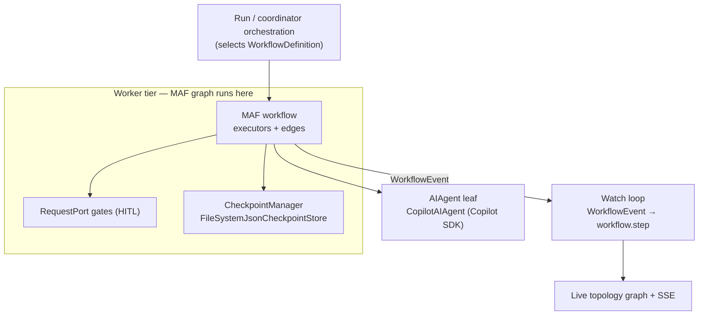

# Microsoft Agent Framework

Agentweaver's orchestration substrate is the **Microsoft Agent Framework** (MAF), shipped as `Microsoft.Agents.AI.Workflows` (with `Microsoft.Agents.AI.Workflows.Checkpointing`). Every run is a MAF **workflow** — a graph of typed executors that MAF schedules, checkpoints, suspends on human gates, and resumes. Agentweaver supplies the nodes and the policy; MAF owns the mechanism.

For the reasoning behind this choice — why MAF instead of a bespoke engine, and where Agentweaver deliberately steps off MAF — see the [Agent Framework deep dive](../deep-dive/agent-framework.md).

## Role in the architecture

MAF is the layer between run orchestration and agent execution. The orchestrator decides *which* workflow runs; MAF *runs* it: delivers each executor its typed input, routes outputs along edges, emits lifecycle events, and pauses at request ports. The graph runs entirely in the **worker tier** — distribution remotes only the agent leaf, not the graph.

## Building blocks

- **Executor** — a graph node with a typed input and output. Agentweaver nodes: agent-turn, peer-review, RAI, merge, scribe, and human-review gates. Each logical node binds to its own executor, so chained turns get distinct nodes.
- **Edge** — a typed connection between executors, optionally predicated. Cross-type transitions use **adapter** executors so the typed contract never breaks. Binding fails closed when a node or edge has no executor.
- **AIAgent** — the leaf unit of work. Production uses `CopilotAIAgent : AIAgent`, whose Copilot SDK session the checkpoint manager serializes into the checkpoint.
- **RequestPort** — the human-in-the-loop seam. Routing a value into a port emits a `RequestInfoEvent`, sets workflow status to `PendingRequests`, and suspends the run until a human responds.
- **WorkflowEvent** — MAF's lifecycle stream (`ExecutorInvoked/Completed/Failed`, `RequestInfoEvent`, `WorkflowOutputEvent`). The watch loop translates these into `workflow.step` events that drive the UI.
- **Checkpoint** — durable snapshot of superstep state plus the serialized agent session, written through `ResilientCheckpointStore` around `FileSystemJsonCheckpointStore`. The runId is the MAF session id.

## Graph binding

A run's graph is assembled from a `WorkflowDefinition`. The binder mints one MAF executor per logical node (keyed by node id), expands typed edges into adapter/terminal/gate plumbing, and validates that every node and edge resolves to a real executor before the graph is built. Production executors are real, never mocks; tests substitute the `AIAgent` leaf through an injectable factory seam.

## Feature → MAF primitive

| Agentweaver feature | MAF primitive it uses |
| --- | --- |
| Single-agent run | A MAF workflow graph; agent turn is an `AIAgent` (`CopilotAIAgent`) executor |
| Run review gate | `RequestPort.Create<WorkflowReviewRequest, WorkflowReviewDecision>` → suspend on `RequestInfoEvent` |
| Coordinator spec confirmation | `RequestPort` over the drafted `OutcomeSpec`; `draft → gate → confirm \| revise` MAF graph |
| Live topology graph | `WorkflowEvent` lifecycle stream translated to `workflow.step` events |
| Restart recovery | Resume from latest checkpoint (runId = session id) at the suspended port |
| Durable pause | `CheckpointManager` + `FileSystemJsonCheckpointStore` (superstep state + serialized session) |
| Coordinator dispatch + assembly | **Not MAF** — service-driven over DB rows (decision D3) |
| A2A remoting | Remotes only the `AIAgent` leaf; the MAF graph and all `RequestPort`/`WorkflowEvent` logic stay in the worker |

## Where MAF stops

The coordinator's spec/confirm phase is a MAF workflow because it suspends on a human gate and must resume after a restart. After confirmation, dispatch and collective assembly are **service-driven** (decision D3): their state lives in database rows (WorkPlan, subtask DAG, child runs, assembly status), so they need no MAF checkpoints. They reuse the real executors directly with a `NoOpWorkflowContext` stub. Each child run, however, is itself an ordinary MAF run — so MAF still orchestrates every leaf of real work.

See [orchestration overview](./overview.md), the [workflow engine deep dive](../deep-dive/workflow-engine.md), and the [coordinator internals deep dive](../deep-dive/coordinator-internals.md) for how these layers connect.
