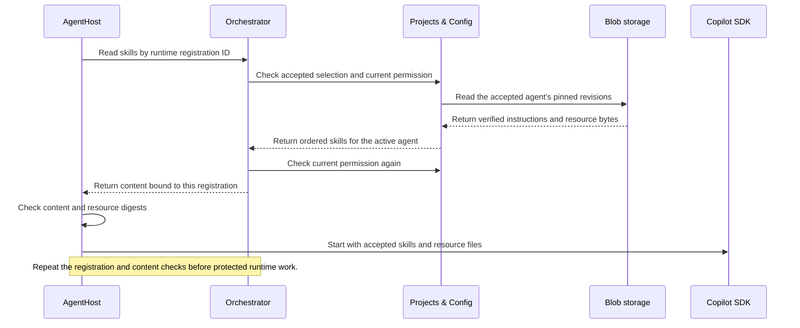
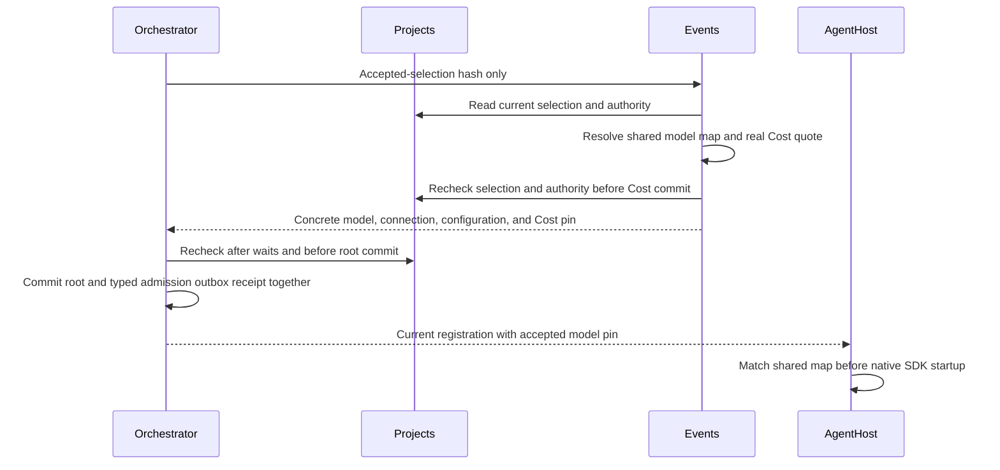
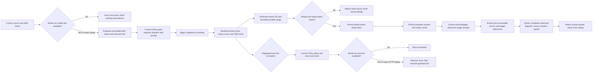

# AgentHost source candidate

The unpublished AgentHost executable runs the sole model harness inside the selected Sandbox.
It uses `GitHub.Copilot.SDK` 1.0.18 and the compatible native runtime 1.0.79.
Microsoft Agent Framework remains an Orchestrator dependency, not an AgentHost runtime.
This source does not provide an automatic scheduler, deployment, live OAuth acceptance, or paid model evidence.

The current native SDK path consumes a real hosted access token or BYOK key inside
the selected Sandbox. This is legacy credential delivery, **not credential-less
guest execution**, even when subprocess environment variables contain no secrets.
The [credential-less sandbox proposal](identity-secrets.md#credential-less-sandbox-proposal)
requires trusted-side request authentication or a supported model-runtime adapter
outside the guest, with the same guards, native results and accounting contracts.
Two containers sharing a Kata guest and private host directories alone do not
prove that separation. This proposal does not change the executable or its current
readiness contract; unsupported modes must not claim compliance.

## Authentication and immutable bindings

AgentHost requires an explicit HTTPS issuer, audience, owner addresses, image identity, and registered model bindings.
OpenIddict validates the bearer before a runtime route reads owner state.
The request host and scheme must match the exact configure audience.
The host never treats a caller-supplied actor, model, credential, or placement as authority.

Orchestrator supplies the current registration and immutable accepted-selection reference.
Environment supplies the exact retained lease, provider resource, image, and runtime profile.
Identity supplies separate configure and observe grants, plus current model-credential proof.
The host compares actor, tenant, project, run, session, purpose, grant revision, execution fence, and placement.
It repeats current authority checks after remote waits and before protected effects.
Accepted numeric and credit limits propagate without changing legacy null configuration.
Orchestrator reserves model sends and registered tool invocations through existing durable owner records.
AgentHost narrows prompt capacity through the actual SDK configuration.
These boundaries do not count the SDK's internal model API calls.

Before native session creation, AgentHost reads skills through the current runtime
registration. Orchestrator checks the accepted run selection and current read
permission; Projects returns only imported revisions assigned to the active agent.
AgentHost checks the registration binding and content digests, exposes those
instructions through the SDK skill provider, and places the exact resource bytes
in the native session filesystem. It repeats the content read during current
authority checks. Missing, changed, revoked, unassigned, or legacy unpinned content
denies session creation or continued use.



| Route | Source contract |
| --- | --- |
| `POST /runtime/v1/configure` | Authenticated delivery of the pending, purpose-bound configure nonce. No model session starts on delivery alone. |
| `POST /runtime/v1/configure/activate` | Contract version 1, exact registration, consume/exchange operation IDs, and the delivered configuration bytes. Exact replay returns the existing session. Changed bytes or bindings deny. |
| `POST /runtime/v1/refresh` | Exact session proof and an operation ID. Rotation rechecks current Identity and owner authority. Exact replay does not rotate again. |
| `POST /runtime/v1/a2a/message:send` | One `user` message with one `text` part, a GUID message ID, native context ID, exact runtime proof, and `immediate` or `enqueue` delivery. |
| `GET /health/live` | Process liveness only. |
| `GET /health/ready` | Current registration, source authority, lease, isolation, workspace, egress, configuration, and startup budgets. A lost prerequisite returns `503`. |

Runtime responses use `Cache-Control: no-store`.
Authentication rejection returns `401`.
Current-authority rejection returns `403` with the exact `code`.
Invalid input returns `400`; owner, execution, or startup failure returns `503`.

Hosted Copilot and BYOK remain distinct modes.
Hosted selection names an Identity-owned connection, not a secret version or personal-provider fallback.
Identity returns only the current GitHub user access token and typed proof.
Refresh tokens and OAuth client secrets stay inside Identity and its protected store.
BYOK uses the exact selected `SecretRef` and explicit native SDK Provider configuration without Copilot authentication or catalog lookup.
Neither a cache nor a submitted connection ID grants permission.

AgentHost and the enabled Events native consumer load the same server-owned
`AgentHost:ModelBindings` map and required `AgentHost:ModelBindingsRevision`.
The shared resolver lives in Identity without an SDK dependency.
It resolves the accepted reference to its concrete model ID; a reference is not a model ID.
It snapshots the map and hashes its canonical model, provider, header, and enabled-state values.
An optional accepted `ModelBindingPin` retains that revision, hash, reference, model ID, and source mode.
AgentHost rejects a changed pin before it starts the SDK client.
Disabled bindings and source-mode mismatches deny; BYOK cannot become hosted through a fallback.
The native catalog still checks the actual hosted model policy before session creation.
Legacy unpinned factory callers retain their existing API; they do not provide versioned admission proof.
For configured hosted credit limits, coordination root acceptance and backlog claim
now require a real Events run-admission receipt before their transaction writes the root.
The receipt binds the trusted Projects selection, selected connection, shared model pin, and Cost identity.
Unpriced or unavailable models cannot create a capped root.
The durable admission pin propagates through current owner context into the Host registration.
These source paths still need live PostgreSQL and whole-producer acceptance.



## Turns, tools, and durability

The native SDK supplies the effective model, session ID, runtime version, usage, and idle boundary.
The runtime disables ambient authentication, configuration discovery, native session persistence, and built-in tools.
Only registered guarded tools can run.
Each model turn and protected tool effect requires current AGT authorization and a committed Policy receipt before the effect.

The host serializes turns.
Prompt text preserves line breaks, tabs, and fenced code without trimming or changing its bytes.
Unsupported control characters, such as NUL, deny before dispatch.
`immediate` work takes priority over pending `enqueue` work at the next native idle boundary.
It does not interrupt an active native turn.
An exact message replay shares the original completion; changed content under the same ID denies.
Completed responses remain available for the configured host lifetime, independent of the pending-turn limit.
The configured pending-turn limit rejects excess work explicitly.

### Numeric budget boundaries

`MaxModelTurns` bounds owner-admitted native sends across the whole run.
Preparation reserves one slot in the existing immutable MAF dispatch table before a new send.
The root owner lock serializes reservations across child runtimes.
Exact prepared replay uses the same slot.
Completed, failed, or uncertain sends do not refund that slot after restart or fence changes.
A sending or uncertain dispatch cannot be resent.
The model action grant must match the prepared dispatch, current registration, and exact prompt hash.
The SDK exposes no pre-model admission hook; this limit does not count internal model API calls.

`MaxToolCalls` bounds registered pre-tool invocations across the whole run.
Current AGT Policy must allow the invocation before the owner reserves its slot.
The owner stores the invocation event ID and exact request hash in its existing outbox.
A root-run advisory lock serializes these reservations across child runtimes.
HTTP retry reuses that event ID; identical arguments on a new invocation receive a new ID.
Permission checks revalidate authority but do not consume a second tool slot.
The native pre-tool hook consumes the slot before the tool can execute.
Changed requests, missing reservations, exhausted capacity, or unavailable authority deny the invocation.

`MaxPromptTokens` is per-prompt/context capacity, not cumulative run usage.
Hosted sessions use the actual catalog's prompt capacity, or its context-window capacity when prompt capacity is absent.
An optional server-owned `PromptCapacityTokens` can narrow that capacity further.
BYOK requires this server-owned concrete capacity when a prompt limit is configured.
The effective capacity is the minimum of the accepted limit and those model capacities.
AgentHost passes it through the actual SDK model capability override and BYOK provider configuration.
Unknown capacity denies startup; the host does not estimate tokens or truncate prompt bytes.
The effective capacity becomes an immutable SDK-source and session-material pin.
Resume retains that pin if current capacity increases, and rejects a smaller current capacity before the SDK resume call.
Capability metadata alone does not prove live token enforcement or a hard-truncation guarantee.

Events stores actual user and assistant content as typed `TurnContent` through the existing Object Store.
The journal retains authenticated content references, Policy receipts, tool events, and compatible cache references.
Orchestrator commits native SDK source receipts.
Events fetches each receipt and commits immutable usage accounting before AgentHost acknowledges the turn.
Already-weighted nano-AIU is not multiplied again.
Unknown cost remains `Unpriced`, never zero.

At a confirmed idle boundary, the runtime captures opaque SDK cache bytes through its custom filesystem.
Recovery compares session scope, accepted selection, model reference, model ID, prompt-capacity pin, SDK version, and runtime version.
A compatible cache uses the actual SDK resume call.
A missing, incompatible, or corrupt cache rebuilds conversation context from authenticated journal content.
Recovery does not replay model turns, tools, or external effects.
Cancellation waits for the native abort idle event; a failed abort prevents another turn or cache capture.

The private native-receipt bridge records the SDK's durable cursor before sending.
After idle, it reads bounded, persisted events through the SDK event-log API.
It binds the actual native send message ID to the user event, turn start, turn end,
and completion receipt. The receipt's event range must match those native IDs.
The captured assistant bytes must match the returned answer.
An idle event alone cannot produce this proof.

When present, a native usage checkpoint retains its reported nano-AIU and source
sequence watermarks. This observed amount is not proof that all usage has settled.
Missing accounting stays unavailable. Native output evidence alone does not authorize
a protected send or prove financial completeness.

The source bridge now uses a typed `RuntimeNativeTurnObservation`.
It retains the actual root usage-event IDs found inside the native completion range.
Those IDs describe observed membership, not a complete accounting-source set.

Orchestrator exposes three authenticated turn routes under the existing observe grant.
Before sending, the MAF source path prepares the immutable dispatch row under the
current registration, root owner, decision, and checkpoint locks.
It pins the platform intent, complete request hash, source hash, model, and execution fence.
Exact prepared retries retain that row. A changed binding or an already-sending row denies.
For configured hosted credit limits, preparation verifies the real Events pricing
snapshot before it commits the dispatch. Unavailable pricing rejects dispatch start.
Begin repeats financial admission before any native work.
`POST /internal/runtime/turns/begin` requires a previously prepared MAF dispatch.
It checks the current registration, SDK source, model, request bytes, pending checkpoint,
and decision version before it changes `prepared` to `sending`.
The admission receipt contains the stable platform message ID, not predicted native IDs.
A repeated begin cannot resend a dispatch that has already entered `sending`.
For configured hosted credit limits, begin reads the existing Events pricing snapshot.
It validates the pinned zero-work quote and fully priced observed Copilot totals.
Missing or unpriced pricing cannot authorize capped native work.
The root owner lock serializes admission and its durable observed-credit guard.
At the soft limit, it queues one durable warning event through the existing outbox.
At or above the hard limit, it records exhaustion and denies new dispatch.
The currently executing turn can report usage above the limit; the next dispatch cannot start.
Another sending or accounting-pending dispatch blocks hard-capped admission.
These checks do not claim an all-future accounting-source barrier.
`POST /internal/runtime/turns/observations` attaches the actual native range and output hash
to that same dispatch. Exact retries retain the stored observation.
The resulting state is `terminal_pending_accounting`, with a `partial` source report.
It is not a source-completion manifest.
These routes reuse migration 015; they add no financial ledger or migration.

`POST /internal/runtime/turns/accounting` completes the observed dispatch.
It requires the recorded native range and exactly its observed usage-event references.
Events joins every reference to its immutable source receipt and actual ledger row.
The registration, SDK source, platform message, accounting hash, and price must match.
This read uses the existing Cost lock and transaction; it does not call Source GET.
Orchestrator then stores the references and changes the dispatch to `completed`.
Accounting remains explicitly `priced` or `unpriced`; unknown cost does not become zero.
The source report stays `partial`, and `hard_cap_serialized` stays false.
Neither source-completion nor strict retirement fields are populated.

The Host uses this path for a registration with an accepted workflow step.
The legacy string-turn method rejects that registration, so it cannot bypass admission.
The Host begins the dispatch before it writes user content or sends native work.
After native completion, it persists the partial observation, assistant content, and cache.
It retains actual Events acknowledgments and completes the durable observed join before returning the answer.
No observed usage means no synthetic usage event is required.
An accounting failure prevents an answer and makes the Host unavailable.
Exact message retries retain the result or failure and do not resend native work.
Unbound legacy sessions retain their existing turn behavior.
MAF prepares through the current source owner before sending.
After the Host responds, MAF rereads the completed dispatch and matches the actual output hash.
Only then can the workflow retain the result.
An explicit unpriced receipt does not block an uncapped answer.
Later usage still enters the ledger and affects the next capped admission.
These source paths do not prove live PostgreSQL or whole-producer acceptance.

The source owner also exposes an authenticated, read-only completion-proof route:
`GET /internal/projects/{projectId}/runs/{runId}/coordination/sessions/{sessionId}/usage-dispatch-completions/{dispatchId}`.
It reads only an owner-persisted hosted-Copilot source-completion manifest with matching dispatch scope and digest.
The retained SDK source supplies the actual meter mode, including for an empty receipt set.
An absent or unproven manifest returns `404` with `Cache-Control: no-store`.
There is no caller-facing manifest writer.
The current native observation path writes only `partial` reports, so it cannot supply this proof.
SDK 1.0.18 and runtime 1.0.79 expose no supported accounting-source finality guarantee.
Their output completion receipt, usage status, idle event, and watermarks do not prove
that every accounting source is final or that no late usage remains.
That missing guarantee does not block ordinary answer acknowledgment.
Observed pricing and accounting-source finality are separate facts.



## Startup evidence and image

Environment reports actual `scheduled`, `imageReady`, and `started` timestamps from Sandbox observations.
An exact Pod UID and image digest `Pulled` event also proves availability when the image is already cached.
Its timestamp is actual availability evidence; compressed pull bytes describe the pinned image, not new network traffic.
AgentHost records `configured` after authenticated native session creation and `ready` after current prerequisite checks.
The readiness receipt combines all five observations with the exact image and current source grant.
Readiness does not infer completion from a Kubernetes Ready condition.

The host enforces configured per-phase and total startup-time ceilings.
Exact ceiling values pass; values beyond the ceiling fail.
Missing, future, out-of-order, or differently bound observations fail.
The readiness owner read retains the exact lease during fresh egress and Sandbox observations.
Competing retirement waits for that lease lock.
The read uses the retained selection snapshot, not a recursive accepted-selection lookup.

The Dockerfile pins the build and runtime base digests and verifies the native archive SHA-512.
The final image runs as UID/GID `1654:1654` on `linux/amd64`.
It uses explicit HTTPS certificate configuration and a read-only root filesystem.
Private state and temporary files are separate from the attached workspace.
The pinned CLI loads its complete distribution from the image-owned `/app/native` directory.
The host sets `COPILOT_CLI_DIST_DIR` to the verified executable's directory, never a caller-selected path.
Startup rejects a missing distribution index, application module, or native runtime addon.
The CLI does not extract executable packages into private session state.
Private state and temporary mounts need no executable permission.
Opaque SDK session caches remain private and use the existing authenticated recovery path.
No registry credential or runtime model credential enters the image.

The selected `agent-sandbox` options can include the typed trusted `AgentHost` launch profile.
It contains only `ConfigurationMapName` and `TlsSecretName`.
Environment binds this optional subsection before it validates the selected Sandbox options.
The provider mounts the named `appsettings.json` read-only and the named TLS Secret read-only.
It supplies fixed private `/state` and `/tmp` volumes, UID/GID/fsGroup 1000, HTTPS 8443, and health probes.
The explicit Pod identity matches the admitted Azure Files workspace owner and its `0755` directories and `0644` files.
The image default remains UID/GID 1654 for standalone use.
This profile does not change Storage mount options or use a privileged initializer.
The SDK working directory is the exact negotiated workspace mount.
The executable process keeps `/app` as its working directory.
The provider validates this profile on template readback and on the actual Pod.
An absent profile preserves the legacy template and does not configure the new executable.

`deploy/k8s/profiles/agenthost/runtime-config.example.yaml` describes the required ConfigMap shape.
Its `.invalid` addresses, required image digest, zero byte count, and model markers deliberately fail startup until a trusted composition supplies real values.
The operator supplies the matching existing TLS Secret with `tls.crt` and `tls.key`.
The source creates neither TLS material nor cloud permission.
The provider creates the actual fenced template from accepted options; the example is not a disconnected replacement Pod.

The CI image check builds one unpublished amd64 candidate and measures its local OCI archive.
`scripts/release/measure-agenthost-image.mjs` verifies actual manifest, config, and compressed layer bytes against their descriptors.
The receipt records the platform manifest digest, config digest, source SHA/tree, and compressed pull bytes.
The byte total includes the manifest and each unique config/layer blob once.
It is not an uncompressed filesystem estimate or a hard image-size ceiling.

CI then compares the loaded image config digest with the receipt.
It runs `--verify-native-runtime` without network access, writes, credentials, or a model turn.
The native SDK status must report runtime 1.0.79, protocol 3, and the image-owned distribution path.
Both image checks use explicit `noexec,nosuid,nodev` state and temporary mounts.
They reject any extracted native package cache in private state.
CI separately runs the same image as UID/GID 1000 with an owner-writable `0755` workspace and private `0700` mounts.
It checks actual create, write, rename, read, and delete operations without network or a model call.
Fixture configuration and TLS files use mode `0440`.
This is simulated POSIX access proof, not a live Azure Files receipt or deployed TLS acceptance.
The receipt and native status remain exact-candidate CI artifacts, not publication or live Sandbox acceptance.

## BuildTest output collector mode

`--build-test-output-collector-v1` selects the trusted Linux file collector before web configuration or native SDK startup.
The mode accepts exactly one bounded encoded request; it does not create a runtime session or send a model turn.
Environment pins its image, executable, assembly, accepted output paths, and read-only Workspace PVC.
The collector obtains its actual Pod UID from the Kubernetes downward API.
It checks regular files, mount identity, no-follow paths, and accepted byte limits before it emits a receipt.
Unsupported platforms and invalid inputs return explicit nonzero exits.
Command logs cannot substitute for this file receipt.
See [Environment BuildTest](./environment-sandbox#buildtest-command-and-output-collection) for admission, reconciliation, and terminal classification.

## Native suspend evidence

`POST /runtime/v1/suspend/native-evidence` requires the current signed runtime proof and exact HTTPS audience.
The request carries the owner operation ID, stable manifest ID, and exact phase version.
Before closing turn admission, AgentHost calls Core's `POST /internal/runtime/suspend/require-current` with the unchanged request.
Only the exact request echo permits suspension.
Core must verify current Projects and run authority and its stored suspend intent, reserved manifest ID, execution fence, accepted selection, `fenced` phase, and version.
The completed manifest is stored only after actual evidence is available; it is not a prerequisite for native capture.
AgentHost closes new turn admission and waits for all admitted turns to finish.
It waits for the observed usage accounting worker, without claiming that no later usage can exist.
The authorized session then holds its execution gate, checks current authority, and commits the actual native cache to Events.
The manifest ID is the cache event ID.
The response returns the recorded native completion and the exact Events cache and journal acknowledgment.
AgentHost repeats the Core check before and after cache capture and persistence.
Exact replay reads the stored cache again and repeats that check; it does not send a turn or capture another cache.

An abort or idle acknowledgment is not a native completion receipt.
Missing native completion, failed accounting, changed authority, or a missing cache prevents a successful response.
New turns, content writes, ordinary cache writes, and credential refresh remain blocked after suspension starts.
Only the internal suspend path can capture a cache with the required current-operation check.
Disposal, credential revocation, and Sandbox abandonment do not produce this evidence.
This endpoint supplies native evidence only, not a completed Core suspend or resume manifest.
Core must also resolve its checkpoint and verified Workspace content.
The current Storage provider has no durable flush or content-checkpoint operation.

## Focused source checks

After the Release build, run these commands:

```powershell
dotnet test tests\Agentweaver.Identity.Broker.Tests\Agentweaver.Identity.Broker.Tests.csproj --no-build --no-restore --configuration Release --filter "FullyQualifiedName~RuntimeAgentHostTests|FullyQualifiedName~NativeRuntimeManifestTests|FullyQualifiedName~RuntimeCopilotSessionTests|FullyQualifiedName~RuntimeNativeTurnJournalTests|FullyQualifiedName~RuntimeSessionRecoveryTests|FullyQualifiedName~RuntimeActionHttpClientTests"
dotnet test tests\Agentweaver.Environment.Tests\Agentweaver.Environment.Tests.csproj --no-build --no-restore --configuration Release --filter FullyQualifiedName~EnvironmentRuntimePlacementPostgresTests
node --test scripts\release\tests\measure-agenthost-image.test.mjs
```

The host tests cover authenticated HTTP, exact replay, current-owner rejection, priority at idle boundaries, legacy accounting acknowledgment, and measured startup ceilings.
Workflow-bound tests cover admission denial, changed admission, stale authority, missing native proof, failed receipt persistence, and no acknowledgment or resend.
Native suspend tests hold an admitted turn, verify its exact cache receipt and replay, and reject abort-only evidence.
They also reject changed operation authority, mismatched Core echoes, and unsigned HTTP requests before cache disclosure.
These controlled Host tests do not prove a persisted Core suspend operation or PostgreSQL suspend success.
The combined Broker scenario connects current Projects authority, Identity connection rotation, Orchestrator receipts, native SDK callbacks, and Events/PostgreSQL accounting.
It covers ordinary native cache and accounting, not a completed suspend operation.
It controls external GitHub, Key Vault SDK, placement, and native transport inputs.
These fixtures do not prove live entitlement, Azure permissions, deployed TLS, or paid model execution.

Historical `TurnContent` reads require current `ReadRunSelection` or an actually supplied `ReadProjects` entitlement, exact signed project/run binding, and recorded session membership.
They do not require a dispatchable decision, live runtime lease, or current model credential.
SDK-cache reads remain restricted to the Core `ReadRunSelection`-eligible runtime path.
An eligible UI actor reads actual UTF-8 turn content from owner-recorded references, never an SDK cache.
Projects suppresses run-bound `ReadProjects` in its authorization-context response.
Its separate project-summary reader does not authorize opaque material or privileged Core model/runtime context.
An unbound browser Viewer cannot use these material routes.
Gateway/browser token composition for that Viewer remains separate work, without new grants or elevated proxy credentials.
