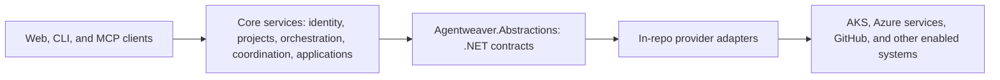
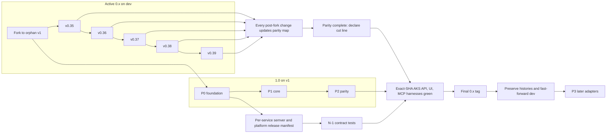

# ADR 0001: Agentweaver 1.0 platform architecture

- **Status:** Proposed

## Context

Agentweaver 0.x ties its GitHub Copilot SDK runtime, agent-sandbox execution,
Azure Files workspace, Postgres memory, Agent Governance Toolkit (AGT) policy,
and GitHub integration to one API-centered deployment and a repository-wide
`VERSION`. Agentweaver 1.0 is a breaking rebuild behind new contracts with
selective compatible code reuse, while 0.x continues to ship on `dev`.

Paths cited here and in the parity map refer to 0.x code on the `dev` branch.
The coupling preventing a straightforward service split is concrete:

- Workflows, backlog, and coordinator code share `MemoryDbContext` transactions
  and directly access other modules' tables; see
  `apps/Agentweaver.Api/Workflows/WorkflowChildWorkService.cs`,
  `apps/Agentweaver.Api/Backlog/BacklogPromotionService.cs`, and
  `apps/Agentweaver.Api/Coordinator/CoordinatorOrchestratorExecutor.cs`.
- The API, worker, and AgentHost share one read-write-many workspace volume,
  not a per-run isolation boundary; see `k8s/base/api-deployment.yaml`,
  `k8s/base/worker-deployment.yaml`, and
  `k8s/base/sandbox-template-agenthost.yaml`.
- Process-local run options, approval gates, caches, and credentials cannot
  simply be shared across replicas; see `apps/Agentweaver.Api/Program.cs` and
  `apps/Agentweaver.Api/Sandbox/RunRepositoryCredentialRegistry.cs`.
- Release automation, image publishing, and runtime reporting use one
  repository `VERSION`; see `.github/workflows/publish-images.yml` and
  `apps/Agentweaver.Api/Infrastructure/AppVersionProvider.cs`.

The new boundaries make ownership, isolation, and delivery explicit rather
than moving those cross-module dependencies between processes.

## Goals and non-goals

**Goals**

- Define provider-neutral .NET contracts with Azure-first defaults, selectable
  backends, and explicit capability negotiation.
- Split coarse control-plane and data-plane services with independently
  versioned images, owned schemas, and durable cross-service communication.
- Make a run journal, session tree, messages, and knowledge records authoritative
  instead of repository files for coordination, decisions, and memory.
- Keep the coordinator thin: it proposes through typed tools; deterministic
  Microsoft Agent Framework (MAF) workflows validate and execute its plans.
- Unify live previews, durable previews, and published applications, and
  introduce typed surfaces within Agentweaver's own user experience.
- Track 0.x capabilities through an auditable parity map while 0.x stays active.

**Non-goals**

- Migrating existing 0.x installations or building migration tooling.
- A local runtime mode, local executors, or local stores.
- Copying the GitHub Copilot app UI or its dynamic script workflows; the
  design borrows only useful coordination primitives.
- User-level bring-your-own-key (BYOK); model settings come from the
  platform and project.
- Adapters requiring Google Cloud Storage (GCS) or Amazon S3 for durable data.

## Decision

| Topic | Decision |
| --- | --- |
| Delivery | Build on an orphan `v1` branch; use `dev` as a behavior reference and selectively reuse compatible, reviewed code. |
| 0.x | Keep releases active; track each post-fork change in the parity map without blocking 0.x releases. |
| Runtime | Run on Azure Kubernetes Service (AKS) with Azure-first services. Use fakes and Testcontainers Postgres for tests, then exact-SHA AKS deployments and persona harnesses for integration. |
| Contracts | Version canonical .NET dependency-injection contracts in `Agentweaver.Abstractions`; keep adapters in-repo, wrapping HTTP, gRPC, or Kubernetes custom resources where needed. |
| Selection | Resolve platform defaults and allowed project overrides; pin effective bindings per run, with seam-specific cardinality. |
| Harness and model | Use the Copilot SDK as the only harness. Keep Copilot/BYOK model choice in the existing resolver, not a new provider seam. |
| Provider seams | Sessions, Snapshots, Sandbox, Storage, Memory, Policy, Guardrails, Network Policy, Cost, Application Hosting, Canvas, Secrets, Source Control, Telemetry, Messaging, Object Store: 16 planned. |
| Not seams | Model, Context, Tools, Skills, Model Context Protocol (MCP) Servers, Image Registry, State Store (Postgres), and Surfaces are configuration, protocols, or core logic. |
| Core domains | Coordination (sessions and messages), Orchestration (MAF workflows and work planning), and Applications & surfaces remain product logic. |
| UX | Keep Agentweaver's run page, topology, approvals, and chat; add a canvas-like surface panel without adopting the Copilot app's UI. |
| Orchestration | Require step catalogs and step-snapped WorkPlans; typed coordinator proposals undergo schema, policy, and workflow validation. |
| Applications | One application model has `live`, `preview`, and `published` stages. Application Hosting serves web applications through the built-in AKS runtime only for now. |
| Installed agent applications | Planned P2 extension: distribute digest-pinned OCI bundles and bind them through existing owners. Installation references are not resource-bound run pins. No new service or seam beyond the separately planned Canvas seam. |
| Canvas | A separate provider seam renders interactive content. P2 includes Agent-to-User Interface (A2UI) and GitHub Canvas compatibility research and reverse engineering. |
| Surfaces | Core owns surface identity, lifecycle, and typed `surface_*` actions. Canvas adapters render declarative content without owning workflow or viewer authorization. |
| Neutrality | Use Agentweaver vocabulary in contracts. Include a concept only when two providers need it; Azure is a default, not a contractual assumption. |
| Services and release | Use roughly ten coarse services, owned Postgres schemas, gRPC/HTTP, and an outbox. Release per-service semver versions as one tested manifest with N-1 compatibility (the preceding contract version). |

### Architecture at a glance

The layers keep core product decisions above provider contracts and external systems.

The **control plane** owns identity, desired state, policy decisions, and
durable workflow transitions:

- Gateway/backend for frontend (BFF) provides authenticated REST and live
  events; Identity brokers sign-in, OAuth, and purpose-bound credentials.
- Projects & Config owns projects, casting, skills, provider bindings, model
  settings, egress narrowing, and budget settings.
- Orchestrator owns runs, MAF workflows, the session tree, coordination verbs,
  typed decisions, gates, checkpoints, and recovery.
- Environment manager owns sandbox and storage lifecycle, networking,
  application hosting, previews, and control-plane image publication.
- Source Control & Merge owns repository preparation, pull requests, webhooks,
  and merge locks. Knowledge owns memory, decisions, and prompt composition.
- Events & Sessions owns the run journal, message delivery, usage ledger,
  and replay streams. The MCP server and web frontend expose these domains
  through Agentweaver's own user experience.
- The web frontend integrates Canvas adapters. A2UI and GitHub Canvas compatibility
  belong here, not in Application Hosting or a replacement Agentweaver UI.

The **data plane** runs the GitHub Copilot SDK AgentHost **inside** a Sandbox
environment, with execution tools and core enforcement gates. A Tool & MCP
gateway mediates outbound agent traffic; an app router exposes authenticated
routes. Hosted applications live outside AgentHost environments, while
provider sidecars and services supply optional implementations.

A run resolves and pins provider/model bindings, provisions an environment,
applies and verifies egress intent, attaches a workspace volume, and composes
context. Turns cross core policy/tool gates. The journal and usage ledger record
outcomes before workflow gates advance build/test, review, publish, or merge.
Services coordinate through idempotent commands, fencing, and at-least-once
outbox events rather than shared database transactions.

### Provider seams

A **provider seam** is a .NET contract between core behavior and a selectable
implementation. Selection can be exclusive, ordered, platform-wide, layered,
keyed by meter source, or per application. Pin implementation identity and
compatible capabilities, never credentials; fail if a pinned provider disappears.
Core gates enforce authorization and AGT policy regardless of adapter choice.

This map groups all 16 planned seams by primary owning service; it also shows core
domains and the categories reviewed but not made into provider seams.

```mermaid
flowchart TB
    subgraph Domains["Core domains"]
        Coordination["Coordination"]
        Orchestration["Orchestration"]
        Applications["Applications and surfaces"]
    end
    subgraph Environment["Environment manager"]
        Sandbox["Sandbox: agent-sandbox"]
        Snapshots["Snapshots: none until gated"]
        Storage["Storage: Azure Files"]
        Network["Network Policy: Cilium"]
        Hosting["Application Hosting: built-in AKS"]
    end
    subgraph Presentation["Web frontend / Applications"]
        Canvas["Canvas: A2UI and GitHub Canvas compatibility (P2)"]
    end
    subgraph Engine["Orchestrator and core enforcement"]
        Policy["Policy: AGT"]
        Guardrails["Guardrails: Prompt Shields"]
    end
    subgraph Identity["Identity"]
        Secrets["Secrets: Azure Key Vault"]
    end
    subgraph Knowledge["Knowledge"]
        Memory["Memory: native Postgres; Cosmos and Redis in P2"]
    end
    subgraph Events["Events and Sessions"]
        Sessions["Sessions: native Postgres journal"]
        Cost["Cost: Copilot credits"]
        Messaging["Messaging: Postgres outbox"]
    end
    subgraph Source["Source Control and Merge"]
        SourceControl["Source Control: GitHub"]
    end
    subgraph Platform["Platform-wide infrastructure"]
        Telemetry["Telemetry: OpenTelemetry to Azure Monitor"]
        Objects["Object Store: Azure Blob"]
    end
    subgraph Reviewed["Reviewed, not seams"]
        Config["Model, Context, Tools, Skills"]
        Protocols["MCP Servers, Image Registry, State Store, Surfaces"]
    end
    Coordination --> Sessions
    Coordination --> Messaging
    Orchestration --> Policy
    Orchestration --> Sandbox
    Applications --> Hosting
    Applications --> Canvas
    Sessions -->|"references, not large bytes"| Objects
```

| Seam | Primary owner | Azure-first default | Later or additional adapters |
| --- | --- | --- | --- |
| Sessions | Events & Sessions | Native Postgres journal | agentsessions capture sidecar (P3) |
| Snapshots | Environment manager | None until gated Azure Blob-backed AKS pod snapshot/restore capability | Compatible sandbox-native snapshots |
| Sandbox | Environment manager | agent-sandbox on AKS | OpenSandbox; Agent Substrate after AKS proof; Container Apps Sandboxes evaluation (P3) |
| Storage | Environment manager | Azure Files | Elastic SAN deferred outside P2; filesystem providers for agents when ready |
| Memory | Knowledge | Native Postgres | Cosmos and Redis providers (P2), behind the same Memory contract |
| Policy | Orchestrator/core enforcement | AGT .NET kernel with YAML rules | No second decision kernel planned |
| Guardrails | Orchestrator/core enforcement | Azure AI Content Safety Prompt Shields (P2) | Purview DLP; other classifiers |
| Network Policy | Environment manager | Cilium L3/L4; Agentweaver Tool & MCP gateway for L7 | Kubernetes NetworkPolicy where applicable; agentgateway (P3) |
| Cost | Events & Sessions | Copilot AI-credit pricing | Azure BYOK (P2); priced third-party meter sources |
| Application Hosting | Environment manager | Built-in AKS web runtime (P2) | No other implementation providers in the current plan |
| Canvas | Web frontend / Applications | A2UI renderer (P2) | GitHub Canvas-compatible adapter research and reverse engineering (P2) |
| Secrets | Identity | Azure Key Vault with workload identity | None planned |
| Source Control | Source Control & Merge | GitHub | Other source-control adapters if justified |
| Telemetry | Platform-wide | OpenTelemetry to Azure Monitor | Other OpenTelemetry Protocol (OTLP) exporters |
| Messaging | Events & Sessions | Postgres transactional outbox and relay | Azure Service Bus |
| Object Store | Platform-wide | Azure Blob | No GCS- or S3-backed adapters |

The reviewed non-seams are **Model**, **Context**, **Tools**, **Skills**,
**MCP Servers**, **Image Registry**, **State Store**, and **Surfaces**. MCP
already defines a plug-in protocol; Postgres remains the fixed transactional
state store. The [provider-seam design](../design/provider-seams.md) defines
cardinality, contracts, pinning, conformance, and enforcement in detail.

Canvas is the new rendering boundary; Surfaces remain core product logic.
The current source catalog still names 15 seams. The P2 Canvas contract and adapters
are planned work, not implemented or deployed providers.
Elastic SAN is not a P2 or cutover requirement. Cosmos and Redis join the exclusive
Memory seam in P2 without replacing the PostgreSQL session journal.
See [PostgreSQL and Blob](../persistence-objects.md#events-and-blob-have-different-jobs)
for the distinction between journal records and large object bytes.

## Design documents

| Document | Scope |
| --- | --- |
| [Provider seams](../design/provider-seams.md) | Provider contracts, 16 planned seams, adapter selection, capabilities, security invariants, and conformance. |
| [Sessions and coordination](../design/sessions-and-coordination.md) | Journal and Copilot session state, suspend/resume consistency, nested sessions, messages, and knowledge records. |
| [Orchestration](../design/orchestration.md) | Thin coordinator, typed decisions, step catalogs, step-snapped plans, and deterministic MAF gates. |
| [Applications and surfaces](../design/applications-and-surfaces.md) | The `live`/`preview`/`published` application lifecycle, hosting, and surface panel. |
| [Installed agent applications](../design/agent-application-bundles.md) | Proposed portable bundles, installations, activation, real-run binding, upgrade/uninstall, OCI distribution, and B1-B5/C1-C5 acceptance. |
| [Services and release](../design/services-and-release.md) | Control/data-plane decomposition, owned schemas, versioning, manifests, and delivery. |

## Delivery strategy

### Preserve behavior with selective reuse

For each capability, start with its 0.x specification and observable behavior,
then define a 1.0 contract, conformance tests, and an implementation. Reuse
compatible, reviewed code selectively when warranted; do not add shims, dual paths,
or 0.x implementation names to new contracts. The parity map tracks each
0.x capability and open roadmap item, its 1.0 owner, disposition (rebuild,
redesign, drop, or defer), and evidence.

The verified behavior guarantees in
[#1405](https://github.com/sabbour/agentweaver/issues/1405) become the
acceptance list **when published**; that document does not exist yet.
The appendix seeds the map, not a claim that parity is complete.

### Keep 0.x active

0.x continues on `dev` while 1.0 grows on `v1`. Add a field to the 0.x
pull-request template asking for “1.0 parity row: id / n.a.”, and have Squad
sweep changes when each 0.x milestone closes. This is a team process, **not**
a GitHub required check, and never delays a 0.x release. Shipped work updates
parity rows; open work at cutover moves to the owning 1.0 backlog.

### Cut over on evidence

The gate is a complete parity map plus green API, UI, and MCP persona harnesses
against the same exact-SHA AKS deployment. Start harness runs at the end of P1,
not at cutover. Once parity is complete, set a cut line: later 0.x changes go
into the 1.0 backlog rather than moving the gate forever ([R22](#risk-register)).

Tag the final 0.x release on `dev` and keep `release/0.x` for patches. Preserve
both histories without a force push: merge old `dev` into `v1` with
`--allow-unrelated-histories -s ours`, then fast-forward `dev` to `v1`
([R21](#risk-register)). 1.0 is a fresh installation, not a data migration.

The timeline shows active 0.x milestones feeding parity alongside 1.0 phases.
These milestones are roadmap inputs, not prerequisites that all must ship.

## Roadmap alignment

Shipped 0.x issues create parity obligations. Items still open at the cut
line enter the 1.0 backlog under the listed owner.

| 0.x milestone | Issues | 1.0 owner and treatment |
| --- | --- | --- |
| v0.35 | Remote MCP [#1229](https://github.com/sabbour/agentweaver/issues/1229) ([#1230](https://github.com/sabbour/agentweaver/issues/1230), [#1231](https://github.com/sabbour/agentweaver/issues/1231), [#1232](https://github.com/sabbour/agentweaver/issues/1232), [#1233](https://github.com/sabbour/agentweaver/issues/1233), [#1234](https://github.com/sabbour/agentweaver/issues/1234), [#1235](https://github.com/sabbour/agentweaver/issues/1235)); MCP surface [#1407](https://github.com/sabbour/agentweaver/issues/1407), [#1427](https://github.com/sabbour/agentweaver/issues/1427), [#1428](https://github.com/sabbour/agentweaver/issues/1428) | MCP catalog and Tool & MCP gateway ([Provider seams](../design/provider-seams.md)). |
| v0.35 | Tracked addressed messages [#1406](https://github.com/sabbour/agentweaver/issues/1406); run state and recovery effects [#1402](https://github.com/sabbour/agentweaver/issues/1402) | Message primitive and status snapshot ([Sessions and coordination](../design/sessions-and-coordination.md)). |
| v0.35 | Preview retention and abandoned-sandbox reclaim [#1688](https://github.com/sabbour/agentweaver/issues/1688) | Sandbox lifecycle and `live`-to-`preview` capture ([Provider seams](../design/provider-seams.md), [Applications](../design/applications-and-surfaces.md)). |
| v0.35 | Workflow applications [#662](https://github.com/sabbour/agentweaver/issues/662), canvas/A2UI renderer [#665](https://github.com/sabbour/agentweaver/issues/665), authorization [#668](https://github.com/sabbour/agentweaver/issues/668) | Built-in AKS Application Hosting and the separate Canvas seam for A2UI; core owns authorization. |
| v0.35 | Verified behavior guarantees [#1405](https://github.com/sabbour/agentweaver/issues/1405) | Parity-map acceptance list once published. |
| v0.36 | Image-backed [#666](https://github.com/sabbour/agentweaver/issues/666) and owner-managed [#667](https://github.com/sabbour/agentweaver/issues/667) app providers; image publication [#761](https://github.com/sabbour/agentweaver/issues/761) | Additional hosting providers are deferred from the current plan; control-plane image publication remains. |
| v0.37 | Suspend/resume [#1410](https://github.com/sabbour/agentweaver/issues/1410); AgentHost startup [#1257](https://github.com/sabbour/agentweaver/issues/1257) | Snapshots and consistency manifest; measured image pull size, download optimization, and startup-time budgets, with no hard image-size ceiling. |
| v0.38 | Delivery simplification [#1429](https://github.com/sabbour/agentweaver/issues/1429), [#1430](https://github.com/sabbour/agentweaver/issues/1430) | Fresh 1.0 release tooling ([Services and release](../design/services-and-release.md)). |
| v0.39 | Project-owned durable previews [#1494](https://github.com/sabbour/agentweaver/issues/1494) | Application `preview` stage. |

## Phases

**Historical foundation snapshot (2026-10-02):** Merged foundations below are libraries and validation
tooling, not a running or released platform. The workload-identity composition
from [#1771](https://github.com/sabbour/agentweaver/pull/1771) (issue
[#1766](https://github.com/sabbour/agentweaver/issues/1766)) is merged, but
deployed AKS workload identity and Identity authorization remain unverified.
The candidate for [#1778](https://github.com/sabbour/agentweaver/issues/1778) adds
dependency-free `release:plan`/`release:apply`/`release:pack` tooling
(see [release composition](../../../releases/README.md#release-planning-and-package-preparation)):
it applies source-bound component intent and prepares locked packages and service images.
A separate manual workflow can publish verified artifacts and record receipts.
No artifact publication, released platform composition, registry push, or deployment
occurred in this candidate.
Azure foundation tooling for issue [#1777](https://github.com/sabbour/agentweaver/issues/1777)
(Bicep modules, a guardrail-enforced plan/deploy/verify-acceptance CLI, and the
Kustomize service-account layout) is staged on a branch, not reviewed, merged,
or deployed. The phase descriptions below remain the scope authority.

**Candidate, not merged:** [#1776](https://github.com/sabbour/agentweaver/issues/1776)
adds trusted Identity run-grant authorization as a library. It compares exact
bindings and immutable grant ID/revision/expiry before and after acquisition,
narrows credential metadata without value access and invalidates on all
post-acquisition errors/cancellation. This does not complete the remaining
Identity broker, durable authority, service or Azure acceptance work.

The [#1779 broker candidate](../../specs/1779-identity-broker.md) adds the native
.NET/OpenIddict Identity service, owned PostgreSQL stores, and authenticated OAuth flows.
It includes locked image builds, but no publication or deployed Azure evidence.
Run-grant redemption composition (#1783) and Azure proof (#1790) remain separate dependencies.

**Current acceptance (2026-10-08):** P0 shipment and live acceptance are complete
under [#1801](https://github.com/sabbour/agentweaver/issues/1801). Its recorded
publication, AKS installation, authentication, Key Vault, Blob, PostgreSQL, telemetry,
and owned-cleanup results supersede the historical snapshot above.
This does not prove the unfinished P1 runtime, GitHub lifecycles, or integrated journeys.
Their current source acceptance remains under
[#1841](https://github.com/sabbour/agentweaver/issues/1841).

| Phase | Status and evidence | Remaining before phase completion |
| --- | --- | --- |
| P0 — Foundation | **Accepted.** Source and initial artifacts are shipped under [#1801](https://github.com/sabbour/agentweaver/issues/1801). The AKS installation [#1812](https://github.com/sabbour/agentweaver/issues/1812) and exact-source live acceptance [#1814](https://github.com/sabbour/agentweaver/issues/1814) are complete, including owned cleanup. | None for the accepted P0 scope. Obsolete package deletion [#1825](https://github.com/sabbour/agentweaver/issues/1825) is explicitly deferred and does not block acceptance. New P1 credential-writer deployment rights are not included in P0's read-only secret access. |
| P1 — Core and defaults | **Incomplete.** Accepted source and remaining delivery are tracked under [#1841](https://github.com/sabbour/agentweaver/issues/1841). The project issue workflow [#1743](https://github.com/sabbour/agentweaver/pull/1743) and workflow canvas [#1755](https://github.com/sabbour/agentweaver/pull/1755)/[#1757](https://github.com/sabbour/agentweaver/pull/1757)/[#1762](https://github.com/sabbour/agentweaver/pull/1762) are delivery tooling, not product acceptance. | Remaining core source and separately authorized exact-SHA AKS harness journeys described below. |
| P2 — Parity and cutover | **Not delivered.** | Parity, application/surface capabilities, acceptance and cutover described below. |
| P3 — After cutover | **Deferred and optional.** | Evaluate gated adapters only after cutover; none blocks it. |

- **P0 — Foundation.** Establish cloud-only layout and CI; a platform release
  manifest, per-service Postgres schemas and outbox, Azure Blob Object Store,
  Identity and Azure Key Vault with workload identity, OpenTelemetry to Azure
  Monitor, provider resolution, pinning, and conformance tests.
- **P1 — Core and defaults.** Build Orchestrator step catalogs, typed decisions,
  run limits, checkpoints, gates; the journal, session tree, tracked messages,
  status snapshot, Knowledge records, Projects & Config, Gateway/BFF, web, MCP
  server, and budgeted AgentHost startup. Supply native Sessions/Memory,
  agent-sandbox with retention/reclaim, Azure Files, Cilium egress intent,
  AGT, GitHub, and Copilot cost. Start exact-SHA AKS harness runs at the end of P1.
  Canonical work remains [MAF execution and joins #1855](https://github.com/sabbour/agentweaver/issues/1855),
  [AgentHost #1856](https://github.com/sabbour/agentweaver/issues/1856),
  [first-party MCP #1858](https://github.com/sabbour/agentweaver/issues/1858),
  [retained web UI #1859](https://github.com/sabbour/agentweaver/issues/1859), and
  [integrated acceptance #1860](https://github.com/sabbour/agentweaver/issues/1860).
  These links do not imply that all source or live acceptance is complete.
- **P2 — Parity and cutover.** Add suspend/resume with a consistency manifest,
  Guardrails and tool permission metadata, remote MCP catalog and gateway,
  [Cosmos #1902](https://github.com/sabbour/agentweaver/issues/1902) and
  [Redis #1898](https://github.com/sabbour/agentweaver/issues/1898) Memory providers,
  Azure BYOK cost and budgets, prompt ordering
  and cache telemetry, Squad import/export, and `live`/`preview`/`published`
  applications through [built-in AKS hosting #1900](https://github.com/sabbour/agentweaver/issues/1900).
  Add the separate [Canvas seam and A2UI renderer #1878](https://github.com/sabbour/agentweaver/issues/1878),
  [GitHub Canvas research #1901](https://github.com/sabbour/agentweaver/issues/1901),
  image publication, publish gate, and application/MCP App/built-in surfaces.
  The [research findings](../design/applications-and-surfaces.md#github-canvas-evidence-and-versions)
  establish experimental declarations, actions, and lifecycle shapes, not a portable
  renderer contract or executed interoperability. The
  [supported adapter #1904](https://github.com/sabbour/agentweaver/issues/1904)
  depends on admitted findings and the Canvas C1 contract; it remains unimplemented.
  Elastic SAN and additional Application Hosting providers are outside this scope.
  Close parity against these explicit dispositions, pass API/UI/MCP harnesses, and cut over.
- **P3 — After cutover.** Consider gated AKS pod snapshot/restore, OpenSandbox,
  Agent Substrate, [Container Apps Sandboxes #1899](https://github.com/sabbour/agentweaver/issues/1899),
  agentsessions, filesystem providers for agents,
  agentgateway, and Agentweaver surfaces exposed
  as MCP Apps. None of these optional adapters blocks cutover.

### Installed agent applications - planned post-core extension

Agentweaver will host [installed agent applications](../design/agent-application-bundles.md),
not only configured agents/workflows or generated application outputs.
The specification defines portable bundles and the existing-owner host boundary.
It does not describe an implemented installer or deployed capability.

This P2 extension follows its applicable core prerequisites.
It leaves P1's nineteen-item scope, counts, acceptance criteria, and completion gates unchanged.
It does not widen #1848 or #1851 or add a P1 prerequisite.
[#1878](https://github.com/sabbour/agentweaver/issues/1878) tracks B1-B5 and C1-C5
in milestone `v1.0.0` (18).
The [Canvas contract](../design/applications-and-surfaces.md#canvas-provider-contract-and-adapters)
uses the separately planned sixteenth seam; current source still implements fifteen.
A2UI and bounded GitHub compatibility are planned adapters.
MCP Apps is a protocol integration, not another provider or authorization system.

| Slice | Existing owners and prerequisites | Acceptance gate |
| --- | --- | --- |
| B1: Contract and inert validation | Projects, Core, trusted composition; existing configuration, selection, workflow validation, and outboxes. | Versioned manifest, exact digests, dependency lock, trust/schema/archive checks, explicit incompatibility, and no install-time execution or fabricated resource pins |
| B2: Durable installation and activation | Projects authority/active head, Core lifecycle operations, Object Store callers; typed gates and current authorization. | Missing-input states, denied activation, idempotency/conflicts, restart/reconciliation, fenced concurrency, isolated staging, and active-head CAS |
| B3: Accepted runs and components | Core, AgentHost, Environment, Policy/Identity, Tool & MCP gateway; real grants, content delivery, and negotiation. | Actual host-readable immutable bytes, genuine run/resource pins, unavailable producers, first-use gates, current revocation, credential redaction, and Canvas isolation |
| B4: Upgrade, rollback, uninstall | Projects, Core, Environment, Identity, retention owners; B2/B3 and exact owner receipts. | Old-run affinity, fresh new-run authority, pending-gate continuity, honest migration/rollback limits, drain, user-data retention, and exact cleanup or pending state |
| B5: Interoperability and approved live acceptance | Registry/release configuration, Gateway/MCP/web, acceptance coordinator; separate target-specific authority. | OCI referrers/404-only fallback, tag mutation, evidence/copy/auth failures, and exact-SHA AKS API/UI/MCP lifecycle journeys |

Installation freezes bundle/configuration/selected-provider references without provisioning Sandbox, Network, or Storage for compatibility.
Real runs negotiate resources and persist genuine immutable pins through existing owners.
The [integration matrix](../design/agent-application-bundles.md#required-integration-scenarios)
preserves lifecycle, failure, authorization, affinity, and ownership-safe cleanup requirements.
The [C1-C5 plan](../design/applications-and-surfaces.md#canvas-provider-delivery-and-milestone-placement)
retains Core state, native/A2UI views, MCP Apps, bundle integration, and live acceptance.
Documentation admission is not C1/source acceptance; #1878 remains open until its actual criteria are met.
GitHub adapter #1904 remains separately scoped after its applicable C1/web/Core/MCP prerequisites.
No additional hosting adapter, Elastic SAN, generic installer service, or permission framework is added.

## Risk register

**Type:** **Decided** fixes a design choice now; **Gated** means adoption only
after the stated evidence, with no cutover dependency; **Mitigated** means
the design contains the failure mode.

| ID | Risk | Type | Resolution |
| --- | --- | --- | --- |
| R1 | agentsessions adds little while the Copilot SDK owns calls. | Decided | P3 capture-only mirror of the journal with hash verification and playback; no re-execution promise. Drop it if the native journal suffices. |
| R2 | Filesystem providers for agents are pre-product. | Decided | Keep them off the 1.0 path; use Azure Files behind the volume contract. Elastic SAN is deferred outside P2. |
| R3 | AKS pod snapshot/restore is pre-preview; Blob end-to-end, Kata virtual machine (VM) v2, node pinning, warm-pool restore, and latency are unproven. | Gated | Suspend works without snapshots. Adopt only after public preview, Azure Blob end-to-end success, warm-pool claim restore, and capture/restore within the AgentHost startup budget; switch to Kata v2 then. |
| R4 | Pod snapshots exclude workspace volume data. | Mitigated | Record and validate storage generation separately in a consistency manifest. |
| R5 | User-level BYOK expands the credential boundary. | Decided | Keep platform and project settings only in 1.0. |
| R6 | AGT 5.0 policy language support lacks .NET parity. | Decided | Use the AGT .NET kernel with YAML rules as in 0.x; consider Rego/Cedar later without changing contracts. |
| R7 | Optional upstream memory and session libraries are previews. | Decided | Native implementations remain defaults. Cosmos and Redis Memory providers ship in P2 behind conformance gates; agentsessions stays optional in P3. No preview library is mandatory. |
| R8 | Agent Substrate has beta APIs, uncertain AKS viability, and no Blob snapshot store. | Gated | P3 conformance and an AKS proof of VM-level isolation ([#553](https://github.com/sabbour/agentweaver/issues/553)); leave snapshots off until Azure Blob support. |
| R9 | Messages cross service boundaries and may duplicate. | Decided | At-least-once outbox, idempotency keys, consumer deduplication, per-thread sequence numbers. |
| R10 | Operator chat may need to spawn runs. | Decided | Permit spawn under run-start authorization; record the run as the chat's child. |
| R11 | Per-run workflow generation is needed for parity. | Decided | Retain it with grammar/step-catalog validation and human confirmation before first use. |
| R12 | WorkPlans change mid-run. | Decided | Permit bounded revisions within steps; confirm additions/removals of steps or wider scope. |
| R13 | Strict step snapping can reject exploratory work. | Decided | Reject unmapped work unless an open step permits it; built-in workflows include an open implementation step. |
| R14 | A proposed agent volume API may change. | Mitigated | Use Agentweaver vocabulary in contracts; let the adapter absorb provider renames. |
| R15 | Elastic SAN is read-write-once only. | Decided | Defer the adapter outside P2. If reconsidered, limit it to `environment` volumes; Azure Files remains the workspace default. |
| R16 | Cilium cannot guarantee FQDN-only HTTPS egress to public IPs. | Mitigated | Route model, MCP, and agent-to-agent traffic through the L7 gateway; document remaining limits. |
| R17 | agentgateway per-environment policy is not the default. | Decided | Default to Agentweaver's own Tool & MCP gateway; consider agentgateway in P3. |
| R18 | Copilot AI-credit pricing changes. | Mitigated | Version the rate card and persist its version with each cost record. |
| R19 | Azure price lag, provisioned throughput allocation, and reconciliation trail budgets. | Decided | Enforce on estimates; reconciliation corrects reports but never retroactively stops runs. |
| R20 | The new branch needs a stable name. | Decided | Use orphan `v1`. |
| R21 | Cutover could discard 0.x history or require a force push. | Decided | Tag final 0.x on `dev`, keep `release/0.x` for patches, merge old `dev` into `v1` with `--allow-unrelated-histories -s ours`, and fast-forward `dev` to `v1`. |
| R22 | An active 0.x line keeps moving the parity target. | Decided | Set a cut line once the map is complete; later changes enter the 1.0 backlog rather than blocking cutover. |
| R23 | Persona harness coverage could arrive too late. | Decided | Run API/UI/MCP harnesses on exact-SHA AKS deployments from the end of P1; require all green at cutover. |
| R24 | Sandbox options, viewer auth, and application hosting can be confused. | Decided | Keep only built-in AKS Application Hosting for now. Evaluate Container Apps Sandboxes under the Sandbox seam in P3. Gateway/Identity retains viewer authorization. Defer [#666](https://github.com/sabbour/agentweaver/issues/666)/[#667](https://github.com/sabbour/agentweaver/issues/667) hosting adapters. |
| R25 | A2UI versions and experimental GitHub Canvas declarations/actions can change; a portable GitHub renderer contract is not established. | Mitigated | Isolate compatibility behind the P2 Canvas seam. Pin A2UI specification/catalog and each adapter/profile/content revision; GitHub discovery is not a rendering catalog. Preserve core action authority and require executed acceptance before claiming interoperability. |

## Consequences

- **Easier:** Backends can run side by side; conformance tests make compatibility
  visible. A journal and messages make coordination and audit inspectable
  without repository-file merges.
- **Harder:** Service boundaries, pinned capabilities, fencing, outbox
  delivery, and snapshot/volume consistency add operational work. Per-service
  releases require compatibility tests and a tested platform manifest.
- **Required:** Each port has behavioral evidence and an owner in the parity
  map. Every coordinator “must” or “never” rule needs a code enforcement point
  and test. Cutover needs parity and exact-SHA API/UI/MCP harness evidence.
- **Out of scope:** Migration tooling, local runtime, user-level BYOK, a copied
  Copilot app UI, and GCS- or S3-backed durable adapters.

## Appendix: Parity map (seed)

These rows seed, rather than close, the parity map. Evidence is from 0.x `dev`.
The linked area is accountable for each rebuild, redesign, drop, or deferral.
When the guarantees from
[#1405](https://github.com/sabbour/agentweaver/issues/1405) are published,
they supply the acceptance list.

| ID | Capability | 0.x evidence | 1.0 owner | Disposition |
| --- | --- | --- | --- | --- |
| identity-sign-in | Sign in and carry identity | `specs/identity-access/sign-in-and-carry-identity.md`; `apps/Agentweaver.Api/Auth/` | [Services and release](../design/services-and-release.md) | Rebuild |
| mcp-authorization | Authorize MCP clients for a user | `specs/identity-access/authorize-mcp-clients.md`; `apps/Agentweaver.Mcp/` | [Services and release](../design/services-and-release.md) | Rebuild |
| platform-onboarding | Setup and product tour | `specs/identity-access/complete-platform-setup-and-tour.md` | [Services and release](../design/services-and-release.md) (web) | Redesign |
| project-lifecycle | Create, configure, and recover projects | `specs/projects-workspace/`; `apps/Agentweaver.Api/Projects/` | [Services and release](../design/services-and-release.md) | Rebuild |
| workspace-browse | Browse project/run workspaces read-only | `specs/projects-workspace/browse-project-and-run-workspaces.md` | [Provider seams](../design/provider-seams.md) (Storage) | Redesign |
| team-casting / agent-roster | Cast teams, manage roles and charters | `specs/squad-casting/`; `apps/Agentweaver.Api/Casting/` | [Sessions and coordination](../design/sessions-and-coordination.md) | Rebuild |
| backlog / board | Capture and track work | `specs/work-intake-board/`; `apps/Agentweaver.Api/Backlog/` | [Orchestration](../design/orchestration.md) | Rebuild |
| github-issue-sync | Sync GitHub issues into backlog | `specs/work-intake-board/sync-github-issues-to-backlog.md` | [Provider seams](../design/provider-seams.md) (Source Control) | Rebuild |
| workflow-library / triggers / scheduling | Define, trigger, and schedule workflows | `specs/workflows-automation/`; `apps/Agentweaver.Api/Workflows/` | [Orchestration](../design/orchestration.md) | Rebuild |
| workflow-generation | Generate and edit workflows | `specs/workflows-automation/generate-and-save-workflows.md` | [Orchestration](../design/orchestration.md) | Redesign: validate step catalogs |
| workflow-authoring UI | Visually author, run, and schedule workflows | `specs/workflows-automation/run-schedule-and-visually-author-workflows.md` | [Orchestration](../design/orchestration.md) (web) | Redesign |
| durable-static-branches | Execute durable static branches | `specs/workflows-automation/execute-static-workflow-branches-durably.md` | [Orchestration](../design/orchestration.md) | Rebuild |
| dynamic-work-plan | Embed dynamic coordinator work inside workflows | `specs/workflows-automation/embed-dynamic-coordinator-work-plan.md` | [Orchestration](../design/orchestration.md) | Redesign: snap to steps |
| workflow-actions | Open and push pull requests as workflow actions | `specs/workflows-automation/open-pull-request-action.md` | [Provider seams](../design/provider-seams.md) (Source Control) | Rebuild |
| immutable-output | Pin reviewed output by revision | `specs/workflows-automation/pin-reviewed-output-by-revision.md` | [Orchestration](../design/orchestration.md) | Rebuild |
| single-agent-run / multi-agent-coordination | Run tasks and coordinate goals | `specs/orchestration-runs/`; `apps/Agentweaver.Api/Runs/` | [Orchestration](../design/orchestration.md) | Rebuild |
| run-steering | Steer, pause, recover, and resume runs | `specs/orchestration-runs/steer-and-recover-orchestrations.md` | [Sessions and coordination](../design/sessions-and-coordination.md) | Redesign: messages |
| agent-messaging | Send addressed messages; tracked acknowledgment [#1406](https://github.com/sabbour/agentweaver/issues/1406) | `specs/orchestration-runs/send-addressed-agent-messages.md`; `apps/Agentweaver.Api/Memory/AddressedMessageService.cs` | [Sessions and coordination](../design/sessions-and-coordination.md) | Rebuild |
| review / run-decision / child-output-integration | Review and integrate child output | `specs/review-merge/` | [Orchestration](../design/orchestration.md) | Rebuild |
| tool-governance | Approve tools and answer questions | `specs/agent-execution-sandbox/govern-agent-tools-and-questions.md` | [Provider seams](../design/provider-seams.md) (Policy) + [Sessions and coordination](../design/sessions-and-coordination.md) | Rebuild |
| sandbox-isolation / effective-permissions | Isolate execution and enforce permissions | `specs/agent-execution-sandbox/` | [Provider seams](../design/provider-seams.md) (Sandbox, Policy) | Rebuild |
| sandbox-preview | Show live previews | `specs/agent-execution-sandbox/preview-sandbox-apps.md` | [Applications and surfaces](../design/applications-and-surfaces.md) (`live`) | Redesign |
| preview-deployments | Durable project-owned previews [#1494](https://github.com/sabbour/agentweaver/issues/1494) | `specs/agent-execution-sandbox/project-owned-preview-deployments.md` | [Applications and surfaces](../design/applications-and-surfaces.md) (`preview`) | Redesign |
| image-builds | Build Open Container Initiative (OCI) images with rootless BuildKit | `specs/agent-execution-sandbox/build-images-with-rootless-buildkit.md` | [Services and release](../design/services-and-release.md) | Rebuild |
| agent-skills | Assign, import, sync, and browse skills | `specs/agent-configuration/`; `apps/Agentweaver.Api/Skills/` | [Provider seams](../design/provider-seams.md) (configuration, not a seam) | Rebuild |
| decision-inbox | Curate a file-backed decision inbox | `specs/memory-decisions/curate-decision-inbox.md` | [Sessions and coordination](../design/sessions-and-coordination.md) | Drop: knowledge records and messages replace it |
| repository-memory-sync | Sync memory ledgers with repository files | `specs/memory-decisions/sync-memory-ledgers.md` | [Sessions and coordination](../design/sessions-and-coordination.md) | Drop |
| agent-memory / knowledge-history | Store and restore agent knowledge | `specs/memory-decisions/` | [Sessions and coordination](../design/sessions-and-coordination.md) + [Provider seams](../design/provider-seams.md) (Memory) | Redesign |
| live-events | Watch and replay run events | `specs/observability-operations/watch-run-events-live.md` | [Sessions and coordination](../design/sessions-and-coordination.md) | Rebuild |
| lineage | Inspect execution and decision lineage | `specs/observability-operations/inspect-execution-identity.md` | [Sessions and coordination](../design/sessions-and-coordination.md) | Rebuild |
| usage-metering | Track tokens and AI-credit usage | `specs/observability-operations/track-token-and-cost-usage.md` | [Provider seams](../design/provider-seams.md) (Cost) | Redesign: durable ledger |
| health-operations | Inspect health, heartbeat, and cluster | `specs/observability-operations/operate-health-heartbeat-and-cluster.md` | [Services and release](../design/services-and-release.md) | Rebuild |
| context-pressure | Accept context-budget pressure | `specs/runtime-resilience/context-budget-pressure-acceptance.md` | [Orchestration](../design/orchestration.md) | Rebuild |
| mcp-control / project-copilot / browser-control | Control Agentweaver through MCP and browser chat | `specs/mcp-integrations/`; `apps/Agentweaver.Mcp/` | [Services and release](../design/services-and-release.md) (MCP server) | Rebuild / redesign |
| github-app | Connect GitHub App capabilities | `specs/mcp-integrations/connect-github-app-capabilities.md` | [Provider seams](../design/provider-seams.md) (Source Control) | Rebuild |
| unattended-settings | Manage unattended settings and diagnostics | `specs/mcp-integrations/unattended-project-settings-and-diagnostics.md` | [Services and release](../design/services-and-release.md) | Rebuild |
| cloud-deployment | Deploy and operate on AKS/Azure | `specs/deployment-platform/self-host-agentweaver.md` | [Services and release](../design/services-and-release.md) | Redesign: fresh tooling |
| local-runtime | Local executors, stores, and database modes | `packages/Agentweaver.SandboxExec/`; `apps/Agentweaver.Api/Infrastructure/` | [Services and release](../design/services-and-release.md) | Drop |
| docs-diagrams | Render and author documentation diagrams | `specs/deployment-platform/render-fluent-docs-diagrams.md` | Docs tooling (deferred; [Services and release](../design/services-and-release.md) is the delivery context) | Defer |
