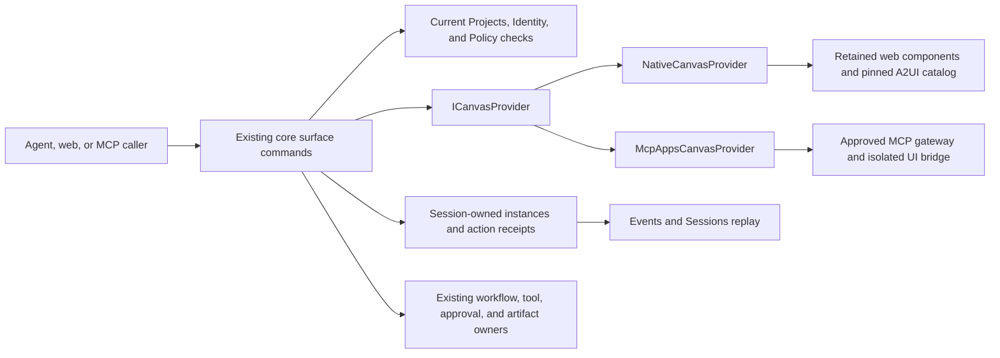

# Applications and surfaces

> Part of [ADR 0001: Agentweaver 1.0 platform architecture](../decisions/0001-platform-architecture.md). **Status:** Proposed.

## Summary

- An application has one project-owned identity and immutable revisions. `live`, `preview`, and
  `published` are deployment stages, not separate application products.
- A live preview runs in the agent sandbox. At run end, a runnable output is captured into a durable
  preview so the sandbox can be released rather than retained for viewers.
- The Application Hosting provider serves durable `preview` and `published` revisions. The default
  web provider runs on Agentweaver-managed Azure Kubernetes Service (AKS) capacity; declarative A2UI
  (Agent-to-User Interface) renders in the Agentweaver
  shell.
- Publication is an owner-authorized workflow gate for an exact verified revision. Viewers
  authenticate at the Gateway/Identity edge, regardless of the hosting provider.
- Agentweaver keeps its own user interface. Its canvas-like surface panel hosts applications, A2UI,
  Model Context Protocol (MCP) Apps, and built-in views.
- Agents control surfaces through Agentweaver-defined `surface_*` MCP tools. A2UI and MCP Apps
  supply rendering protocols, not a copied canvas API or a new provider seam.
- A proposed `ICanvasProvider` surface contract separates native rendering from MCP Apps integration.
  Its concrete adapters remain inside existing owners, not a sixteenth infrastructure seam.

## Today in 0.x

Paths refer to the 0.x code on the `dev` branch. The preview gateway routes a live application to
its AgentHost sandbox (`k8s/base/gateway-preview.yaml`). Preview availability therefore follows the
sandbox lease rather than an independently owned application deployment. Holding finished sandboxes
for previews can exhaust isolation capacity; bounded retention and abandoned-sandbox reclaim are
addressed by [#1688](https://github.com/sabbour/agentweaver/issues/1688).

The active 0.x roadmap also describes workflow publication with web and declarative A2UI profiles
([#662](https://github.com/sabbour/agentweaver/issues/662)), a canvas and renderer
([#665](https://github.com/sabbour/agentweaver/issues/665)), and audience, route, and
workflow-action authorization ([#668](https://github.com/sabbour/agentweaver/issues/668)).
Image-backed hosting ([#666](https://github.com/sabbour/agentweaver/issues/666)), owner-managed
hosting ([#667](https://github.com/sabbour/agentweaver/issues/667)), isolated image publication
([#761](https://github.com/sabbour/agentweaver/issues/761)), and project-owned preview deployments
([#1494](https://github.com/sabbour/agentweaver/issues/1494)) have explicit 1.0 owners. These are
roadmap requirements, not claims that every capability already ships in 0.x.

## Installed agent applications

An installed agent application bundles agents, tools, skills, restrictive policies,
canvases, workflows, and required assets.
Its project installation and activated revision are separate from the generated
application outputs described here.
The [installed-agent-application specification](agent-application-bundles.md)
defines distribution, configuration binding, activation, upgrade, and uninstall through existing owners.

An installed application can start an authorized run that produces a generated application.
That output still follows `live`, `preview`, and `published` deployment stages.
Installation does not publish an output, select a hosting provider by package claim,
or create a resource-bound run pin.
This planned extension adds no service or provider seam.
Bundled Canvas declarations bind to the [Canvas provider contract](#canvas-provider-contract-and-adapters).
The package includes schemas, content, assets, and action references, not trusted adapter registrations.

## One application, three stages

### Identity, revision, and deployment

An **Application** is the durable project-owned identity: name, owners, audience, and route. A run
may produce a candidate for an existing application, but the application's identity does not belong
to that run. Application owners decide which verified revision can be published.

A **Revision** is an immutable, content-addressed candidate produced by a workflow Build/Test step.
Its record identifies the source run, workflow identity, workflow version and digest, output digest,
and test evidence. The output is a source tree or artifact digest for a web profile, an image digest
receipt for an image profile, or an A2UI package for the declarative profile. A change to the output
creates another revision; it does not mutate a published revision.

A **Deployment** binds an application revision to a stage and a serving endpoint. Its provider and
effective options are selected from the platform-enabled catalog at the application boundary and
pinned per deployed revision. Stage, revision, health, and route are visible to owners and viewers
with appropriate permissions. The run and deployment remain linked for audit without making the
deployment depend on the run's sandbox.

| Stage | Owner and lifetime | Serving path | Transition |
| --- | --- | --- | --- |
| `live` | Run environment and sandbox lease | Sandbox endpoint descriptor through the authenticated app router; no Application Hosting provider | Working output can be viewed while the run is active. At run end, a runnable candidate is captured as a revision. |
| `preview` | Project-owned, revision-pinned, private, with bounded retention | Application Hosting provider through the app router | A verified candidate may be promoted through the publish gate; retention or an owner action may retire it. |
| `published` | Project-owned stable authenticated route | Application Hosting provider through the app router | The owner-approved exact revision remains served until a later approved revision, rollback, or retirement. |

The app router uses one route, authentication, network-intent, and audit model for all three stages.
A live capability URL does not become a published route. The same application can have a live
working view and one or more durable revision views; stage names describe what is being served, not
three unrelated records.

### Run-end capture and sandbox release

The environment manager inspects live output at run end. When the output meets the runnable
contract, the platform captures the verified artifact and its evidence as an immutable revision,
deploys it at `preview`, and releases the sandbox. The durable preview then serves from application
capacity, not from a retained AgentHost. This is the primary design response to the capacity failure
behind [#1688](https://github.com/sabbour/agentweaver/issues/1688), alongside the Sandbox seam's
retention and reclaim rules.

If the output cannot satisfy that contract, a retained sandbox is not a substitute for a durable
preview. The environment is released according to run policy, and the run record explains why no
preview was created. The project-owned preview remains available after the producing run ends,
subject to bounded retention ([#1494](https://github.com/sabbour/agentweaver/issues/1494)). The
journal and artifact references survive independently of the environment.

The Sandbox provider owns the live endpoint and environment lifetime; Application Hosting takes over
only for a durable stage. The handoff must not silently swap a candidate artifact, its verification
evidence, or its owner. See [Sandbox](provider-seams.md#sandbox) and
[Storage](provider-seams.md#storage) for environment ownership and workspace volumes. A workspace
volume is not the application's serving endpoint or its public artifact store.

### Publish and rollback

A publish step belongs to the workflow step catalog. The Orchestrator validates that Build/Test
evidence matches the exact revision to be published and obtains the application owner's
authorization at the gate. Publication is an Agent Governance Toolkit (AGT) decision and is written
to the run journal. The provider may perform deployment operations, but it cannot approve the
revision on the owner's behalf; see [Orchestration](orchestration.md).

A published route never inherits a preview capability URL or the producing run's credentials.
Viewers authenticate and are authorized for the application, route, and workflow actions at the
Gateway/Identity edge under [#668](https://github.com/sabbour/agentweaver/issues/668). Promotion
keeps the pinned revision and hosting decision. Rollback serves a previously approved immutable
revision at the stable authenticated route; it is not an edit to the current artifact.

The declarative A2UI profile invokes one typed form action bound to its approved workflow
([#662](https://github.com/sabbour/agentweaver/issues/662)). Its content cannot approve work, choose
another workflow, or confer a viewer's privileges. Application actions still pass through the same
core authorization and audit gates as other workflow actions.

This lifecycle keeps serving outside the agent's sandbox after a run completes.

```mermaid
stateDiagram-v2
    direction LR
    state "live (sandbox)" as Live
    state "preview (durable)" as Preview
    state "published (durable)" as Published
    state "retired" as Retired
    [*] --> Live
    Live --> Preview: run ends; capture runnable revision
    Live --> Retired: no runnable revision; release sandbox
    Preview --> Published: publish gate and owner approval
    Preview --> Retired: retention or owner action
    Published --> Published: rollback to approved revision
    Published --> Retired: owner retires route
    note right of Preview
        Agentweaver's surface panel can embed each stage
        through the authenticated app router.
    end note
```



## Application Hosting

### Boundary and operations

**Application Hosting** is a provider seam for serving an immutable application revision at the
durable `preview` or `published` stage. It runs the agent's output beyond the run. The
[Sandbox](provider-seams.md#sandbox) seam runs the agent and supplies the `live` endpoint.
Environment manager owns hosting adapters, deployment reconciliation, retention, and reclaim; the
provider never owns viewer identity or a workflow publish decision.

The canonical contract is a .NET interface in versioned `Agentweaver.Abstractions`. Adapters may use
in-process calls, gRPC, HTTP, or Kubernetes resources behind that interface. Operations are
idempotent and report their progress with durable `OperationRef` handles rather than assuming
immediate readiness.

| Operation | Meaning |
| --- | --- |
| `Deploy(application, revision, stage, exposure)` | Request a durable, revision-pinned deployment and return an `OperationRef`. `stage` is `preview` or `published`; `live` is served by Sandbox. |
| `Describe` and `Health` | Report endpoint, effective revision and stage, operation state, and health or drift. |
| `Promote(deployment, stage)` | Advance a deployment after the core publish gate has authorized that exact revision. |
| `Rollback(revision)` | Serve an earlier approved revision without modifying it. |
| `Retire(deployment)` | Stop serving the deployment and apply its retention policy. |

Capabilities advertise supported output profiles (web source, image, declarative), externally
operated capacity, scale to zero, retention enforcement, and health or drift reporting. A platform
default can be narrowed by a project choice from enabled providers. The selected provider and
compatible options are pinned per deployed revision; promotion is not an implicit migration to
another host. Provider-specific placement and route mechanics stay inside the adapter.

The Application Hosting seam follows the general [provider selection and
cardinality](provider-seams.md#selection-and-cardinality) rules. Image Registry is configuration,
not a separate provider seam. Surfaces are renderers and protocols, not hosting providers.

### Provider profiles

| Provider | Profile and responsibility | Phase |
| --- | --- | --- |
| Agentweaver shell | Default declarative A2UI provider. Agentweaver web renders the package using a pinned component catalog; no separate application server is required. Its actions call the approved workflow. | P2 |
| Built-in AKS serving runtime | Default generated-web provider. It runs the verified artifact on Agentweaver-managed capacity, separate from the AgentHost pool, under fixed launch, readiness, deadline, resource, isolation, and network policies. | P2 |
| Image-backed AKS | Serves an approved image-digest receipt instead of starting from source; [#666](https://github.com/sabbour/agentweaver/issues/666). | P2 if shipped in 0.x; otherwise backlog |
| Owner-managed external | Connects a deployment operated by the application owner without transferring edge authorization to it; [#667](https://github.com/sabbour/agentweaver/issues/667). | P2 if shipped in 0.x; otherwise backlog |
| Azure Container Apps | A later hosting option evaluated against the same contract; not needed for cutover. | P3 evaluation |

The web and declarative profiles express the “one publication, two profiles” goal of
[#662](https://github.com/sabbour/agentweaver/issues/662). Additional enabled providers do not
create separate application products. A provider that cannot meet required audience, routing,
network, isolation, or health conditions cannot be selected for that deployment.

### Image publication and trust

BuildKit may build an image from isolated run output. The control plane publishes only the approved
build output to the configured registry and stores its digest receipt; the run never receives a
registry credential ([#761](https://github.com/sabbour/agentweaver/issues/761)). Azure Container
Registry is the default configuration, not a new seam. The recorded digest, not a mutable image tag,
identifies what the hosting provider serves.

Applications do not receive run credentials, agent credentials, or the AgentHost's purpose-bound
tokens. Gateway and Identity authenticate viewers and enforce the configured audience and route
rules before traffic reaches any provider. This holds equally for shell-rendered, built-in,
image-backed, and externally operated applications
([#668](https://github.com/sabbour/agentweaver/issues/668)). External operation does not move the
authorization boundary.

Application ingress and egress compile through the [Network
Policy](provider-seams.md#network-policy) intent. For agent-side model, MCP, and agent-to-agent
traffic, the default Layer 7 (L7) enforcement point is Agentweaver's Tool & MCP gateway; network
policy alone is not a claim that all public-address HTTPS egress is FQDN-only. The app router
exposes deployments only through the authenticated edge. Hosting operations, route changes, and
publication decisions are auditable domain events; exporter availability does not replace that
record.

## Surface panel

### Place in the Agentweaver interface

Agentweaver retains its own run page, topology, approvals, and chat. Beside a run or chat it adds a
canvas-like **surface panel**: an instance of a typed view that a user or agent may open and act
upon. “Canvas-like” describes placement and interaction, not adoption of the Copilot application's
UI or its canvas API. The contract for surface actions is Agentweaver's own and is exposed over MCP.

A surface instance has a kind, instance ID, open input, and a set of typed actions. The panel
displays context without granting more authority than the actor has in the associated session. A
user action yields a typed session message; delivery and attribution follow [Sessions and
coordination](sessions-and-coordination.md). Agent actions and UI-originated tool calls reach the
same core enforcement gates.

### Surface kinds

| Kind | Presentation | Action boundary |
| --- | --- | --- |
| Application | Sandboxed iframe for `live`, `preview`, or `published`, showing stage and exact revision ([#665](https://github.com/sabbour/agentweaver/issues/665)). | Authenticated app-router route and application permissions. |
| A2UI | Declarative agent-generated forms, tables, charts, and approval cards rendered natively from a versioned component catalog. | Typed action bound to the specified workflow or gate; content alone cannot authorize it. |
| MCP App | Sandboxed iframe for an MCP server's `ui://` resource. | UI-initiated tool calls pass core tool authorization, audit, and outbound controls. |
| Built-in | Diff/review, Markdown document editor, read-only logs/terminal, and workflow graph. | Each built-in declares its allowed actions; a read-only view remains read-only. |

The application kind embeds the app at any stage; the A2UI kind renders declarative surface content
without deploying an application. An A2UI **application** is a project-owned revision with
deployment and publication controls. An A2UI **surface** is a session-facing view. The renderer can
be shared without conflating those lifecycles.

### Agent-facing MCP contract

The first-party MCP server publishes the following Agentweaver operations:

| Tool | Purpose |
| --- | --- |
| `surface_list_kinds` | Discover kinds, open-input schemas, and typed actions with JSON schemas. |
| `surface_open(kind, input, instanceId)` | Create or focus a typed surface instance. |
| `surface_invoke_action(instanceId, action, input)` | Execute a declared action with schema validation and the actor's permissions. |
| `surface_close` | Close an instance without changing the underlying application or session. |

A kind declares a schema for opening it and schemas for its actions; arbitrary UI messages do not
become tool privileges. Surface actions are journaled with the associated actor and session. User
actions return through the typed-message channel so coordination can react without scraping a view.
The MCP tool names are part of Agentweaver's surface-action contract, not a claim that a generic
canvas API is standardized.

### Protocol versions and host bridge

A2UI provides the declarative rendering protocol. The renderer pins a specification version and a
versioned component catalog per release: v0.9.1 is stable; v1.0 remains a release candidate until
finalized. A 1.0 final renderer is adopted only when the specification is final and the catalog is
compatible. A2UI content does not bypass workflow authorization.

MCP Apps (SEP-1865) provides `ui://` resources and the host bridge for MCP-server-provided custom
UI. Agentweaver hosts those resources in its own surface panel; UI-originated tool calls use the
same policy and audit path as agent calls. In P3, the first-party MCP server can expose Agentweaver
run and application surfaces as MCP Apps resources for other compliant hosts. It does not require
Agentweaver to replace its own UX.

These are standards where standards exist. Surface instances, input and action schemas, and MCP
`surface_*` tools remain Agentweaver-defined. Renderers and component catalogs are configuration and
protocol implementations, not provider seams.

### Canvas provider contract and adapters

**Status:** Proposed for P2. No product `ICanvasProvider`, Canvas adapter, or `surface_*` implementation exists at the reviewed source baseline.
The existing `ProviderSeam` enum contains fifteen infrastructure seams and no `Canvas` member.
Application Hosting has generic descriptor metadata, not an implemented Canvas contract.
The repository's [workflow Canvas extension](../../../.github/extensions/agentweaver-workflow-canvas/README.md)
is Copilot development tooling under the Squad milestone, not the Agentweaver product runtime.

The requested provider architecture uses a narrow surface adapter contract in `Agentweaver.Abstractions`.
It does not add a service, model harness, separate permission store, or generic plug-in framework.
The infrastructure catalog, run resolver, and fifteen seam cardinalities remain unchanged.
Native and MCP Apps adapters implement the same discovery, instance, state, and action boundary.
A2UI and MCP Apps remain protocols used behind that boundary, not competing authorization systems.

#### Proposed interface

This sketch describes a future .NET contract, not a compiled API:

```csharp
public interface ICanvasProvider
{
    Task<IReadOnlyList<CanvasTypeDescriptor>> ListTypesAsync(
        CanvasReadContext context, CancellationToken cancellationToken);
    Task<CanvasOpenResult> OpenAsync(
        CanvasOpenRequest request, CancellationToken cancellationToken);
    Task<CanvasDescription> DescribeAsync(
        CanvasReadRequest request, CancellationToken cancellationToken);
    Task<CanvasActionReceipt> InvokeActionAsync(
        CanvasActionRequest request, CancellationToken cancellationToken);
    Task<CanvasCloseReceipt> CloseAsync(
        CanvasCloseRequest request, CancellationToken cancellationToken);
}
```

The proposed records have these bounds:

| Record | Required contract |
| --- | --- |
| `CanvasTypeDescriptor` | Effective type ID, descriptor revision, profile, open-input schema, action input/output schemas, and bounded content requirements. Schema/catalog versions and digests are explicit. |
| `CanvasReadContext` / `CanvasReadRequest` | Core-validated project/session scope and current read authority. A read request identifies an existing instance. No caller-supplied tenant or permission flag establishes authority. |
| `CanvasOpenRequest` | Exact accepted type/content/configuration references, host-issued provider selection, scoped instance ID, and idempotency key. No arbitrary executable, registry URL, or browser token. |
| `CanvasOpenResult` / `CanvasDescription` | Instance identity, immutable adapter/type/content binding, state revision, renderer descriptor, readiness/failure, and replay cursor. A result distinguishes pending from ready. |
| `CanvasActionRequest` | Existing instance, declared action, bounded validated input, expected state revision, idempotency key, and exact core action binding. Current gates/fences apply when the action has effects. |
| `CanvasActionReceipt` | Action identity, bounded schema-valid result or explicit error, resulting state revision, and effect/operation receipt when applicable. It never turns a browser acknowledgment into an approval. |
| `CanvasCloseRequest` / `CanvasCloseReceipt` | Scoped instance and expected revision, idempotent closed/pending/failed result, and owned view/subscription cleanup status. Closing does not delete artifacts or cancel a run. |

Only the core constructs admitted requests after current authentication, Projects authority, and applicable Policy checks.
Providers cannot grant authority or interpret package declarations as permission.
The provider calls existing domain commands through the core action dispatcher.
Approval, publish, tool, workflow, and artifact actions retain their original owner and exact request/revision checks.
Local focus, selection, and layout actions do not need a model turn.
An artifact edit creates a new content revision through its owner.
It does not modify verified bundle bytes or an accepted application revision.

#### Selection, state, and lifecycle

Trusted composition registers versioned adapters and supported profiles through .NET DI and the existing surface catalog.
This is a surface catalog entry, not a fabricated `ProviderRegistration` under another seam.
Each adapter has a stable ID, exact adapter/options-schema versions, an immutable options revision, and supported catalog/protocol versions.
Projects can select only a platform-enabled, permitted profile.
The package declares a required profile and capabilities, never its own provider registration.
Unknown profiles or unsupported schema/capability combinations fail explicitly.

One adapter is selected for each surface instance.
Several instances can coexist, including different adapters and installed revisions.
The core preserves a `CanvasInstanceBinding` with the provider/type/schema/catalog/content/configuration revisions.
It is not `PinnedProviderBinding`, does not require a fake `runId`, and does not provision an environment.
An actual session-facing view can exist without starting an agent run.
Resource-bearing effects still use genuine bindings from their existing owners.

The Orchestrator's existing session-facing surface module owns durable instance revisions and action receipts.
Projects owns installed declarations and configuration references.
Events & Sessions supplies ordered events and authorized reconnect cursors.
Gateway/BFF and MCP expose projections and commands, not another surface state store.
The browser owns panel placement, focus, and reversible presentation state, not accepted backend state.

Reopening the same scoped instance with identical accepted input focuses it.
Conflicting input requires an explicit new instance or revision.
Browser reload or reconnect describes the existing instance and resumes its cursor without another run or effect.
Concurrent state mutations use expected revisions; duplicate action keys replay the original receipt.
Reusing a key with different input conflicts.
Dispatch to an effect owner carries the same operation identity.
Response loss is reconciled against that owner, not retried as a new action.
An unreconciled outcome reports pending or unknown, not success.
Closing releases only view-owned resources.
Reopening retained content requires a new authorized instance; it does not resurrect a retired binding.

Current authorization applies to reads, subscriptions, actions, and reconnect.
Revocation stops further access even when a descriptor or instance remains pinned.
Upgrade leaves existing instances on their accepted revisions; new instances use the newly accepted declaration.
Uninstall stops new opens and follows the bundle's drain and retention rules.
An open panel is not an ownership claim over user data.

#### Concrete implementations to deliver

These are named implementation targets, not existing packages:

| Adapter | Concrete implementation plan | Explicit limit |
| --- | --- | --- |
| `NativeCanvasProvider` (`Agentweaver.Providers.Canvas.Native`) | In-process .NET adapter plus retained Agentweaver web components. First deliver built-in artifact/progress views and one typed form/action; add the pinned A2UI renderer/catalog through the same interface. Persist state/receipts in the existing owner. | No arbitrary browser script, separate agent server, copied Copilot UI, or native Office automation. Built-in action bindings remain host-owned. |
| `McpAppsCanvasProvider` (`Agentweaver.Providers.Canvas.McpApps`) | In-process .NET adapter plus the existing planned Tool & MCP gateway and web host bridge. Resolve an approved connection's `ui://` resource and resource revision, then render it in an isolated iframe. Validate bridge messages and route declared tool calls through current core enforcement. | No package-created MCP connection, ambient browser bearer, direct outbound fetch, or unvalidated remote renderer. Unsupported protocol/resource profiles fail rather than falling back to native execution. |

An application view reuses Application Hosting or Sandbox endpoint descriptors.
The Canvas adapter embeds an authorized view; it does not deploy or publish an application.
The native adapter can serve verified static bundle assets through the authenticated edge under an isolated web profile.
Dynamic generated application servers still belong to Application Hosting.
MCP resources are supported only when their approved source supplies an enforceable exact resource revision.
An unversioned remote resource cannot satisfy an immutable-content requirement.

The trusted renderer validates complete messages before applying them.
Partial streamed JSON cannot invoke an action.
Web resources use isolated origins, restrictive iframe/CSP, and origin/instance-checked bridge messages.
No renderer receives an AgentHost, platform, registry, or model credential.
Cookie-originated commands require existing CSRF protections; bearer commands require the correct audience.
Executable, skill, policy, and canvas bundle content remains read-only and byte-verified at its actual host.
Mutable artifact/workspace data lives separately.
Renderer failure leaves a safe shell, explicit status, retained artifact links, and bounded retry.
Keyboard navigation, focus restoration, labels, and status announcements are acceptance requirements.



#### Reference evidence and limits

The original Copilot App reverse-engineering artifact is unavailable in the current verified context.
It is not a prerequisite, and this plan does not claim to have recovered it.
The public [Copilot SDK Canvas contract](https://github.com/github/copilot-sdk/blob/2023ed29af3cae890b26f9e2a269a04d8ac7ba60/nodejs/src/canvas.ts)
and the repository extension independently demonstrate declarations, open schemas, typed actions, instance IDs, and lifecycle callbacks.
The SDK contract is explicitly experimental.
Agentweaver borrows those separation patterns, not proprietary host behavior or a stable vendor wire API.
Its durable receipts and authorization remain Agentweaver contracts.

[Crew Studio](https://docs-platform.crewai.com/platform/en/features/crew-studio) has a visual workflow-authoring canvas.
It is not evidence of an interchangeable runtime Canvas provider.
CrewAI's [versioned frontend guide](https://docs.crewai.com/v1.15.23/en/guides/frontend/overview)
separates the agent server, CopilotKit runtime, and React frontend through AG-UI.
That supports separating rendering and actions from agent execution.
AG-UI event transport, A2UI descriptions, MCP Apps resources, and Canvas lifecycle remain distinct.
CrewAI documentation does not authorize importing its managed Studio or replacing Agentweaver's Copilot SDK harness.
A CrewAI runtime adapter is not included in this plan.

## Ownership

| Component | Responsibility |
| --- | --- |
| Environment manager | Sandbox-to-preview handoff, `live` environment lifecycle, Application Hosting adapters, retention, reclaim, and app-router deployment state. |
| Orchestrator | Build/Test evidence, workflow publish step, exact-revision approval and AGT gate. |
| Gateway/BFF and Identity | Viewer authentication and application, route, audience, and workflow-action authorization. |
| Web frontend | Agentweaver surface panel, A2UI renderer, MCP Apps host bridge, stage and revision presentation. |
| First-party MCP server | Surface discovery and `surface_*` tools, subject to the same core authorization. |
| Events & Sessions | Durable journal, audit linkage, and typed session messages for surface actions. |
| Orchestrator surface module and trusted composition | Canvas instance/action state and `ICanvasProvider` dispatch to registered native/MCP Apps adapters. No new service or independent authority store. |

See [Services and release](services-and-release.md) for control-plane and data-plane placement.
Hosting the application outside AgentHost is the key separation: publication cannot require a live
agent environment.

## Alternatives considered

| Option | Why not |
| --- | --- |
| Retain every sandbox to preserve a preview | Couples viewer lifetime to expensive isolation capacity and leaves abandoned leases; durable capture plus reclaim addresses [#1688](https://github.com/sabbour/agentweaver/issues/1688). |
| Maintain separate preview and published product models | Duplicates project ownership, routes, auth, evidence, and revision tracking; stages are sufficient. |
| Make each hosting provider authenticate viewers | Moves audience and route authorization to inconsistent provider-specific edges; Gateway/Identity owns that decision. |
| Use the Copilot application's canvas API as the surface standard | It is not a public standard. Agentweaver keeps its own UX and defines an MCP-exposed action contract. |
| Require an application server for declarative A2UI | The Agentweaver shell can render declarative packages without separate compute. |
| Make Azure Container Apps a cutover dependency | The built-in AKS and shell providers cover the required profiles; Container Apps remains a P3 evaluation. |

## Phasing

Installed agent applications follow a separate
[planned post-core extension](../decisions/0001-platform-architecture.md#installed-agent-applications---planned-post-core-extension).
They do not change the existing P1 scope or cutover gate.
The [Canvas delivery slices](#canvas-provider-delivery-and-milestone-placement) belong in P2, after the relevant P1 foundations.

- **P0 — foundation:** Define versioned application, revision, deployment, hosting capability, and
  surface contracts alongside the platform's identity, secrets, and provider catalog. Establish the
  outbox and artifact records used for durable handoff.
- **P1 — core:** Build the Gateway/BFF, Identity, Environment manager, Orchestrator, web, and MCP
  foundations; sandbox retention/reclaim and startup-phase observability cover
  [#1688](https://github.com/sabbour/agentweaver/issues/1688) and
  [#1257](https://github.com/sabbour/agentweaver/issues/1257). At the end of P1, persona harnesses
  start against exact-SHA AKS deployments.
- **P2 — parity and cutover:** Deliver `live`/`preview`/`published`, the built-in AKS and shell
  providers, verified publish gate, image publication
  ([#761](https://github.com/sabbour/agentweaver/issues/761)), project-owned previews
  ([#1494](https://github.com/sabbour/agentweaver/issues/1494)), and the application/A2UI/MCP
  App/built-in surface panel. Bring [#666](https://github.com/sabbour/agentweaver/issues/666) and
  [#667](https://github.com/sabbour/agentweaver/issues/667) adapters only if they shipped in 0.x
  before the parity cut line; otherwise track them in the 1.0 backlog.
- **P3 — after cutover:** Evaluate Azure Container Apps under the same hosting contract and expose
  first-party Agentweaver surfaces as MCP Apps resources for external hosts.

### Canvas provider delivery and milestone placement

**Release plan:** [#1878](https://github.com/sabbour/agentweaver/issues/1878)
tracks this work in `v1.0.0` as P2, not the active P1 epic [#1841](https://github.com/sabbour/agentweaver/issues/1841).
P1 already owns the service, session, authorization, web, and MCP foundations.
Its nineteen accepted child scopes exclude applications, surfaces, and the P2 Tool & MCP gateway.
Canvas work consumes those foundations; adding it to P1 would widen the agreed core gate.

At the planning check on 2026-10-07 UTC, `v1.0.0` is milestone 18.
The user-directed tracking issue covers the bundle lifecycle and Canvas providers.
The related [#665](https://github.com/sabbour/agentweaver/issues/665) remains open in `v0.35.0`.
The completed [#1751](https://github.com/sabbour/agentweaver/issues/1751) belongs to Squad development tooling.
Neither substitutes for a v1 product delivery issue.
P2 is an architecture phase, not a separate existing GitHub milestone.

The tracking issue contains the following planned slices.
Separate child issues and an execution schedule remain pending:

| Slice | Owner and prerequisite | Required completion evidence |
| --- | --- | --- |
| C1: Canvas contract and owner state | Orchestrator, Projects, Events & Sessions, trusted composition. Current session/authority/outbox foundations. | Versioned records, DI adapter boundary, type/profile validation, exact instance bindings, idempotency/CAS, restart, revoked reads/actions, and no fabricated run/resource pins |
| C2: Native Canvas provider and retained web panel | Web, Gateway/BFF, Orchestrator, first-party MCP. C1 and P1 web/MCP paths. | Agent/web/MCP discovery/open/describe/action/close, built-in artifact and typed form, pinned A2UI catalog, refresh/reconnect, truthful readiness/failure, and keyboard/accessibility checks |
| C3: MCP Apps Canvas provider | Tool & MCP gateway, web bridge, Identity/Policy, Orchestrator. C1 and P2 approved MCP connection/enforcement. | Exact `ui://` revision, sandbox/CSP/origin checks, schema-valid bridge, no credential leakage or direct provider effects, stale/revoked connection rejection, and explicit unsupported-resource errors |
| C4: Bundled Canvas lifecycle | Bundle B1-B4 owners and selected C2/C3 profile. Verified content delivery and fresh action authority. | Inventory/schema/reference validation, immutable host bytes, no adapter registration or implicit execution, effective-ID isolation, old-instance affinity, upgrade, drain, and retention-safe uninstall |
| C5: Integrated P2 acceptance | Acceptance coordinator with the C1-C4 source and approved deployment authority. | One exact-SHA AKS API/UI/MCP journey for native and MCP Apps profiles, browser restart, action response loss, revocation, renderer failure, bundle upgrade, and owned cleanup |

C1-C3 elaborate the already planned P2 surface capability.
C4 is the installed-bundle extension and does not silently become another cutover prerequisite.
Unshipped 0.x features retain the existing parity/backlog rule.
The user requested the tracking issue and its `v1.0.0` assignment.
That planning decision does not authorize runtime implementation, deployment, or live grants.

## Related risks

- [R24](../decisions/0001-platform-architecture.md#risk-register): Viewer authorization stays at
  Gateway/Identity; Container Apps is evaluated after cutover; image-backed and owner-managed timing
  follows the parity rule.
- [R25](../decisions/0001-platform-architecture.md#risk-register): Pin A2UI v0.9.1 and a versioned
  catalog until v1.0 is final; use MCP Apps for custom UI, not the nonstandard canvas API.
- [R16](../decisions/0001-platform-architecture.md#risk-register): The L7 gateway covers model, MCP,
  and agent-to-agent egress that Cilium FQDN controls cannot fully constrain.
- [R17](../decisions/0001-platform-architecture.md#risk-register): Agentweaver's Tool & MCP gateway is the
  default; an alternative gateway is optional after cutover.
- [R22](../decisions/0001-platform-architecture.md#risk-register): A completed parity map
  establishes the cut line; later 0.x work joins the 1.0 backlog rather than indefinitely moving
  publication parity.
