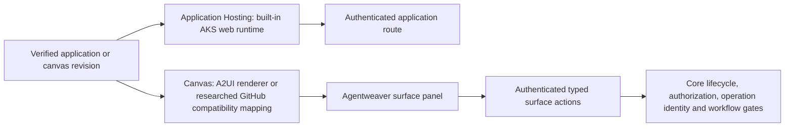
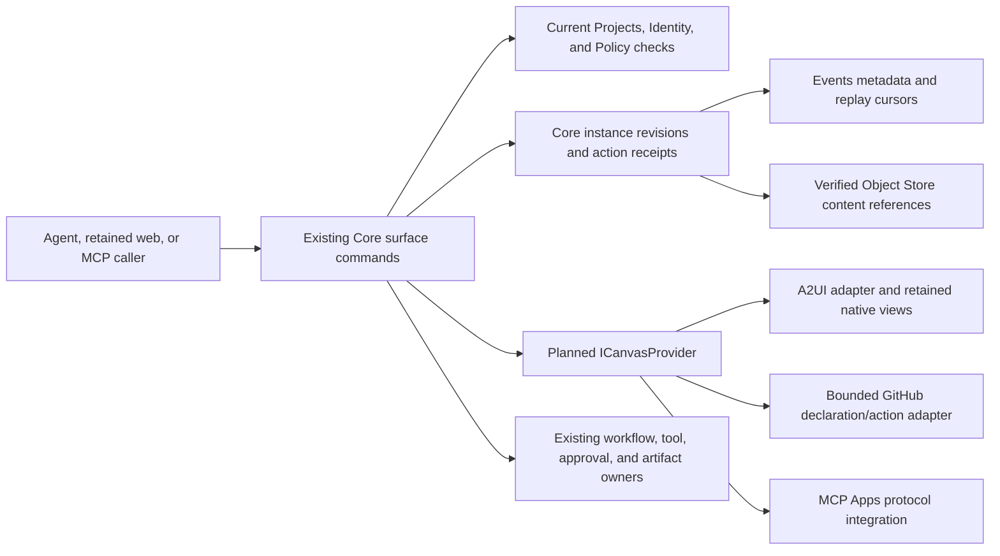

# Applications and surfaces

> Part of [ADR 0001: Agentweaver 1.0 platform architecture](../decisions/0001-platform-architecture.md). **Status:** Proposed.

## Summary

- An application has one project-owned identity and immutable revisions. `live`, `preview`, and
  `published` are deployment stages, not separate application products.
- A live preview runs in the agent sandbox. At run end, a runnable output is captured into a durable
  preview so the sandbox can be released rather than retained for viewers.
- Application Hosting serves durable web `preview` and `published` revisions through
  the built-in Azure Kubernetes Service (AKS) runtime. No other hosting adapters are planned for now.
- The separate Canvas provider renders interactive content. P2 includes A2UI
  (Agent-to-User Interface) and GitHub Canvas compatibility research and reverse engineering.
- Publication is an owner-authorized workflow gate for an exact verified revision. Viewers
  authenticate at the Gateway/Identity edge, regardless of the hosting provider.
- Agentweaver keeps its own user interface. Its canvas-like surface panel hosts applications, A2UI,
  Model Context Protocol (MCP) Apps, and built-in views.
- Agents control surfaces through Agentweaver-defined `surface_*` MCP tools. Canvas
  adapters do not replace the core action contract, authorization, or Agentweaver's own UI.

## Today in 0.x

Paths refer to the 0.x code on the `dev` branch. The preview gateway routes a live application to
its AgentHost sandbox (`k8s/base/gateway-preview.yaml`). Preview availability therefore follows the
sandbox lease rather than an independently owned application deployment. Holding finished sandboxes
for previews can exhaust isolation capacity; bounded retention and abandoned-sandbox reclaim are
addressed by [#1688](https://github.com/sabbour/agentweaver/issues/1688).

The active 0.x roadmap also describes workflow publication with web and declarative A2UI profiles
([#662](https://github.com/sabbour/agentweaver/issues/662)), a canvas and renderer
([#665](https://github.com/sabbour/agentweaver/issues/665)), and audience, route, and
workflow-action authorization ([#668](https://github.com/sabbour/agentweaver/issues/668)).
Image-backed hosting ([#666](https://github.com/sabbour/agentweaver/issues/666)), owner-managed
hosting ([#667](https://github.com/sabbour/agentweaver/issues/667)) remain historical parity inputs,
but their additional hosting adapters are deferred from the current plan.
Isolated image publication ([#761](https://github.com/sabbour/agentweaver/issues/761))
and project-owned preview deployments ([#1494](https://github.com/sabbour/agentweaver/issues/1494))
remain in scope. These are roadmap requirements, not claims that every capability already ships in 0.x.

## Installed agent applications

An installed agent application bundles agents, tools, skills, restrictive policies,
canvases, workflows, and required assets.
Its project installation and activated revision are separate from generated application outputs.
The [installed-agent-application specification](agent-application-bundles.md)
defines distribution, configuration binding, activation, upgrade, and uninstall through existing owners.

An installed application can start an authorized run that produces a generated application.
That output still follows `live`, `preview`, and `published` stages.
Installation does not publish an output, select a hosting provider by package claim,
or create a resource-bound run pin.
It adds no service or provider seam beyond the already planned Canvas seam.
Bundled Canvas declarations use the [proposed Canvas contract](#canvas-provider-contract-and-adapters).
The package contains schemas, content, assets, and action references, not trusted adapter registrations.

## One application, three stages

### Identity, revision, and deployment

An **Application** is the durable project-owned identity: name, owners, audience, and route. A run
may produce a candidate for an existing application, but the application's identity does not belong
to that run. Application owners decide which verified revision can be published.

A **Revision** is an immutable, content-addressed candidate produced by a workflow Build/Test step.
Its record identifies the source run, workflow identity, workflow version and digest, output digest,
and test evidence. The output is a source tree, artifact digest, or approved image digest
for web output, or a versioned Canvas package for declarative output. A change to the output
creates another revision; it does not mutate a published revision.

A web **Deployment** binds an application revision to a stage and a serving endpoint. Its provider and
effective options are selected from the platform-enabled catalog at the application boundary and
pinned per deployed revision. Stage, revision, health, and route are visible to owners and viewers
with appropriate permissions. The run and deployment remain linked for audit without making the
deployment depend on the run's sandbox.
Declarative revisions instead pin a Canvas provider and content version. They share
the application approval and retention model without an Application Hosting deployment.

| Stage | Owner and lifetime | Serving path | Transition |
| --- | --- | --- | --- |
| `live` | Run-owned working output; a web endpoint follows the sandbox lease | Sandbox endpoint through the app router for web output; Canvas for declarative output | At run end, a verified candidate is captured as a revision. |
| `preview` | Project-owned, revision-pinned, private, with bounded retention | Built-in AKS Application Hosting for web output; Canvas for declarative output | A verified candidate can pass the publish gate; retention or an owner action can retire it. |
| `published` | Project-owned stable authenticated view | Application Hosting web route or revision-pinned Canvas content | The owner-approved exact revision remains available until approved replacement, rollback, or retirement. |

The app router uses one route, authentication, network-intent, and audit model for web stages.
Canvas content and actions use the same core viewer permissions and publish gates.
A live capability URL does not become a published route. The same application can have a live
working view and one or more durable revision views; stage names describe what is being served, not
three unrelated records.

### Run-end capture and sandbox release

The environment manager inspects live output at run end. When the output meets the runnable
contract, the platform captures the verified artifact and its evidence as an immutable revision,
deploys it at `preview`, and releases the sandbox. The durable preview then serves from application
capacity, not from a retained AgentHost. Declarative output preserves its verified Canvas
package and renderer binding instead of starting an application server.
This is the primary design response to the capacity failure
behind [#1688](https://github.com/sabbour/agentweaver/issues/1688), alongside the Sandbox seam's
retention and reclaim rules.

If the output cannot satisfy that contract, a retained sandbox is not a substitute for a durable
preview. The environment is released according to run policy, and the run record explains why no
preview was created. The project-owned preview remains available after the producing run ends,
subject to bounded retention ([#1494](https://github.com/sabbour/agentweaver/issues/1494)). The
journal and artifact references survive independently of the environment.

The Sandbox provider owns the live endpoint and environment lifetime; Application Hosting takes over
only for a durable stage. The handoff must not silently swap a candidate artifact, its verification
evidence, or its owner. See [Sandbox](provider-seams.md#sandbox) and
[Storage](provider-seams.md#storage) for environment ownership and workspace volumes. A workspace
volume is not the application's serving endpoint or its public artifact store.

### Publish and rollback

A publish step belongs to the workflow step catalog. The Orchestrator validates that Build/Test
evidence matches the exact revision to be published and obtains the application owner's
authorization at the gate. Publication is an Agent Governance Toolkit (AGT) decision and is written
to the run journal. The provider may perform deployment operations, but it cannot approve the
revision on the owner's behalf; see [Orchestration](orchestration.md).

A published route never inherits a preview capability URL or the producing run's credentials.
Viewers authenticate and are authorized for the application, route, and workflow actions at the
Gateway/Identity edge under [#668](https://github.com/sabbour/agentweaver/issues/668). Promotion
keeps the pinned revision and its hosting or Canvas binding. Rollback serves a previously approved immutable
revision at the stable authenticated route; it is not an edit to the current artifact.

The declarative A2UI profile invokes one typed form action bound to its approved workflow
([#662](https://github.com/sabbour/agentweaver/issues/662)). Its content cannot approve work, choose
another workflow, or confer a viewer's privileges. Application actions still pass through the same
core authorization and audit gates as other workflow actions.

This lifecycle keeps serving outside the agent's sandbox after a run completes.

```mermaid
stateDiagram-v2
    direction LR
    state "live (Sandbox or Canvas)" as Live
    state "preview (AKS or Canvas)" as Preview
    state "published (AKS or Canvas)" as Published
    state "retired" as Retired
    [*] --> Live
    Live --> Preview: run ends; capture runnable revision
    Live --> Retired: no runnable revision; release sandbox
    Preview --> Published: publish gate and owner approval
    Preview --> Retired: retention or owner action
    Published --> Published: rollback to approved revision
    Published --> Retired: owner retires route
    note right of Preview
        Agentweaver's surface panel uses authenticated
        web routes or revision-pinned Canvas content.
    end note
```



## Application Hosting

### Boundary and operations

**Application Hosting** is a provider seam for serving an immutable application revision at the
durable `preview` or `published` stage. It runs the agent's output beyond the run. The
[Sandbox](provider-seams.md#sandbox) seam runs the agent and supplies the `live` endpoint.
Environment manager owns hosting adapters, deployment reconciliation, retention, and reclaim; the
provider never owns viewer identity or a workflow publish decision.

The canonical contract is a .NET interface in versioned `Agentweaver.Abstractions`. Adapters may use
in-process calls, gRPC, HTTP, or Kubernetes resources behind that interface. Operations are
idempotent and report their progress with durable `OperationRef` handles rather than assuming
immediate readiness.

| Operation | Meaning |
| --- | --- |
| `Deploy(application, revision, stage, exposure)` | Request a durable, revision-pinned deployment and return an `OperationRef`. `stage` is `preview` or `published`; `live` is served by Sandbox. |
| `Describe` and `Health` | Report endpoint, effective revision and stage, operation state, and health or drift. |
| `Promote(deployment, stage)` | Advance a deployment after the core publish gate has authorized that exact revision. |
| `Rollback(revision)` | Serve an earlier approved revision without modifying it. |
| `Retire(deployment)` | Stop serving the deployment and apply its retention policy. |

Capabilities advertise supported web artifacts, retention enforcement, and health or drift reporting. A platform
default can be narrowed by a project choice from enabled providers. The selected provider and
compatible options are pinned per deployed revision; promotion is not an implicit migration to
another host. Provider-specific placement and route mechanics stay inside the adapter.

The Application Hosting seam follows the general [provider selection and
cardinality](provider-seams.md#selection-and-cardinality) rules. Image Registry is configuration,
not a separate provider seam. Canvas renders content; it does not operate web hosting capacity.

### Provider profiles

| Provider | Profile and responsibility | Phase |
| --- | --- | --- |
| Built-in AKS serving runtime | Default generated-web provider. It runs the verified artifact on Agentweaver-managed capacity, separate from the AgentHost pool, under fixed launch, readiness, deadline, resource, isolation, and network policies. | P2 |

This is the only Application Hosting implementation in the current plan.
Image-backed, owner-managed external, and Container Apps hosting adapters are removed
for now. A web image remains an artifact format, not a separate hosting provider.
Container Apps Sandboxes belongs to the later [Sandbox evaluation](provider-seams.md#managed-runtime-contract-check).
The web and declarative profiles still share the application identity and publish
model of [#662](https://github.com/sabbour/agentweaver/issues/662), but use different
Hosting and Canvas contracts.

### Image publication and trust

BuildKit may build an image from isolated run output. The control plane publishes only the approved
build output to the configured registry and stores its digest receipt; the run never receives a
registry credential ([#761](https://github.com/sabbour/agentweaver/issues/761)). Azure Container
Registry is the default configuration, not a new seam. The recorded digest, not a mutable image tag,
identifies what the hosting provider serves.

Applications do not receive run credentials, agent credentials, or the AgentHost's purpose-bound
tokens. Gateway and Identity authenticate viewers and enforce the configured audience and route
rules before traffic reaches the built-in hosting runtime or Canvas content
([#668](https://github.com/sabbour/agentweaver/issues/668)). Neither provider owns the
authorization boundary.

Application ingress and egress compile through the [Network
Policy](provider-seams.md#network-policy) intent. For agent-side model, MCP, and agent-to-agent
traffic, the default Layer 7 (L7) enforcement point is Agentweaver's Tool & MCP gateway; network
policy alone is not a claim that all public-address HTTPS egress is FQDN-only. The app router
exposes deployments only through the authenticated edge. Hosting operations, route changes, and
publication decisions are auditable domain events; exporter availability does not replace that
record.

## Canvas provider

Canvas is a separate P2 provider seam beside Application Hosting.
Application Hosting runs web output on serving capacity. Canvas renders versioned
interactive content inside Agentweaver's existing surface panel.
It does not run AgentHost or require a separate application server.

The Applications domain owns canvas identity, content revisions, and action bindings.
The web frontend integrates the selected renderer and host bridge.
Selection chooses one platform-enabled provider per canvas and pins its adapter
version, format version, and negotiated capabilities to the content revision.
Changing the renderer requires an explicit new binding, not an outage fallback.
The current source catalog does not yet implement this contract.

| Canvas adapter | Responsibility | Phase |
| --- | --- | --- |
| A2UI | Render declarative packages using a pinned specification and component catalog. Forward typed actions to the existing core gates. | P2 |
| GitHub Canvas-compatible | Map the researched experimental declaration, action, and lifecycle subset. A portable content format and browser bridge are not established. Implementation remains separate [#1904](https://github.com/sabbour/agentweaver/issues/1904). | P2 |

GitHub Canvas is not a public standard. Compatibility work belongs inside its adapter,
not in Agentweaver's core action protocol or a replacement UI.
Both adapters validate content and action schemas. Neither content nor renderer
metadata can approve a workflow, grant permissions, or supply credentials.
MCP Apps remains a protocol for server-provided UI and uses the existing core action
and outbound boundaries; it is not an additional Application Hosting adapter.

### GitHub Canvas evidence and versions

Research [#1901](https://github.com/sabbour/agentweaver/issues/1901) inspected accessible
first-party source and permitted local declarations on 2026-10-08. It establishes
declaration, callback, and lifecycle shapes, not executed Agentweaver interoperability.
The historical reverse-engineering artifact is unavailable; no recovered private
specification is claimed.

| Evidence | Exact baseline | Evidence limit |
| --- | --- | --- |
| Public Node SDK | [`github/copilot-sdk` commit `2023ed29af3cae890b26f9e2a269a04d8ac7ba60`](https://github.com/github/copilot-sdk/tree/2023ed29af3cae890b26f9e2a269a04d8ac7ba60) | Experimental source declarations and callback routing, not a released renderer contract. |
| SDK and wire metadata | [Package](https://github.com/github/copilot-sdk/blob/2023ed29af3cae890b26f9e2a269a04d8ac7ba60/nodejs/package.json): `0.0.0-dev`, CLI pin `1.0.93-3`; [global protocol](https://github.com/github/copilot-sdk/blob/2023ed29af3cae890b26f9e2a269a04d8ac7ba60/sdk-protocol-version.json): `3` | Neither value is a Canvas content-format or component-catalog version. |
| Installed permitted declarations | `canvas.d.ts`, `types.d.ts`, `generated/rpc.d.ts`, and `generated/session-events.d.ts` agree with the inspected public shapes | No installed SDK package version was independently established. |
| Read-only app discovery | Runtime `1.0.93-1`; browser capabilities returned open/action JSON schemas and `extensionId: connection:1` | This differs from the public CLI pin. No open, action, rendering, reconnect, or integration was exercised. |
| Released Agentweaver 0.x | `v0.34.2`, commit [`013ba5e12915b6a729763e04221c297438b1cd11`](https://github.com/sabbour/agentweaver/tree/013ba5e12915b6a729763e04221c297438b1cd11) | Existing panel and preview state, not a shipped GitHub Canvas renderer. |

The inspected SDK [factory](https://github.com/github/copilot-sdk/blob/2023ed29af3cae890b26f9e2a269a04d8ac7ba60/nodejs/src/canvas.ts#L45-L197),
[RPC declarations](https://github.com/github/copilot-sdk/blob/2023ed29af3cae890b26f9e2a269a04d8ac7ba60/nodejs/src/generated/rpc.ts#L8085-L8450),
[provider types](https://github.com/github/copilot-sdk/blob/2023ed29af3cae890b26f9e2a269a04d8ac7ba60/nodejs/src/types.ts#L2209-L2235),
and [lifecycle events](https://github.com/github/copilot-sdk/blob/2023ed29af3cae890b26f9e2a269a04d8ac7ba60/nodejs/src/generated/session-events.ts#L13189-L13560)
support the matrix below. The [Node examples/tests](https://github.com/github/copilot-sdk/blob/2023ed29af3cae890b26f9e2a269a04d8ac7ba60/nodejs/test/e2e/canvas.e2e.test.ts)
use a fixed counter result and an example URL. The
[Python resume scenario](https://github.com/github/copilot-sdk/blob/2023ed29af3cae890b26f9e2a269a04d8ac7ba60/python/e2e/test_scenario_canvas_e2e.py)
uses a fake CLI. These tests were inspected, not executed, and do not prove browser
rendering, state synchronization, or live restart recovery.

### Compatibility and unknowns

In this table, **observed** means inspected source or successful read-only discovery.
The proposed mapping is not current adapter support.

| Area | Observed GitHub contract | Proposed Agentweaver mapping and limit |
| --- | --- | --- |
| Declaration | Type ID, display metadata, optional open-input schema, and named action schemas; handlers remain in-process and are stripped from declarations. | Map inert metadata to a trusted enabled C1 kind. A declaration is not an executable bundle or immutable content record. |
| Catalog and versions | Discovery returns provider/type IDs and action schemas. | Pin the tested upstream baseline, adapter/profile, and owned content revision. Discovery and global wire version `3` are not a versioned rendering catalog. |
| Type and provider identity | `canvasId` is provider-local; `extensionId` disambiguates it. Types also declare stable `extensionInfo` and `canvasProvider.id`. | Resolve the exact pair without first-match fallback. A transient `connection:1` is not durable ownership or authority; stable-field behavior on the observed runtime is untested. |
| Instance and artifact identity | Caller-selected `instanceId`; re-open focuses that instance. Open snapshots include URL/input/title/status. | Keep the session instance separate from a verified artifact/application revision. A URL or instance does not supply artifact digest, storage ownership, grant, or run pins. |
| Typed action | Handler receives session/provider/type/instance IDs, action name, input, and optional host/session context; `canvas.` action names are reserved. | Dispatch through the same core path for agent and authenticated user actions. Core supplies actor authority, operation identity and fence; the upstream shape supplies none of these proofs or an output schema. |
| Provider callback bridge | `canvas.open`, `canvas.close`, and `canvas.action.invoke` callbacks; optional URL/title/status results. | Translate callbacks at the Canvas boundary. This is not an iframe `postMessage`, DOM, state-replication, or generic browser-action contract. Working directory is not a file capability. |
| Renderer availability | `requestCanvasRenderer` opts into model-facing tools; host capabilities advertise Canvas support. | Negotiate supported rendering and verify loaded content separately. Opt-in, capability presence, and free-form `status: ready` are not viewer authorization or render-readiness evidence. |
| Lifecycle and reconnect | Opened/closed/registry-changed, transient unavailable, durable recorded, and removed events. Recorded state excludes URL and availability; reconnect opens the same instance with a fresh URL. | Keep the panel mounted with truthful unavailable state. Reauthorize and restore the same binding/revision without a new run, saved expired URL, or replay of uncertain effects. Live restart remains untested. |
| Errors | `CanvasError(code,message)` becomes JSON-RPC `-32603` with code/message data; unexpected failures use `canvas_handler_error`. | Preserve sanitized structured errors under existing conventions. The complete upstream invalid-input taxonomy and schema dialect are unknown. |
| Close and cleanup | `onClose` is best-effort; the outer close RPC can resolve despite a handler failure. | Closing removes the view, not its run or artifact. Only the resource owner and its receipt establish cleanup or action settlement. |
| Deployment | Read-only browser capability discovery succeeded. | No Agentweaver AKS/web/MCP/SDK interoperability was executed. Native Office/terminal, desktop integration, and arbitrary extensions are outside the evidence. |

The released 0.x [run page](https://github.com/sabbour/agentweaver/blob/013ba5e12915b6a729763e04221c297438b1cd11/apps/web/src/pages/CoordinatorRunPage.tsx#L5141-L5325)
has slide panels and a separate preview dialog; closing the dialog does not stop the
preview. Its [preview state](https://github.com/sabbour/agentweaver/blob/013ba5e12915b6a729763e04221c297438b1cd11/apps/web/src/state/runPreviewState.ts)
requires current assembly and server-backed readiness evidence. Inspected
[reload tests](https://github.com/sabbour/agentweaver/blob/013ba5e12915b6a729763e04221c297438b1cd11/apps/web/src/__tests__/CoordinatorRunPage.test.tsx#L1591-L1664)
and [preview-state tests](https://github.com/sabbour/agentweaver/blob/013ba5e12915b6a729763e04221c297438b1cd11/apps/web/src/__tests__/CoordinatorRunPage.coordUx.test.tsx#L229-L332)
support reuse of those presentation and truthful-state patterns. Do not reuse
sandbox port-forward identity as Canvas artifact identity. The inspected released
tree contains no GitHub Canvas or A2UI implementation; roadmap entries are not shipped parity.

### Bounded adapter subset

The initial [#1904](https://github.com/sabbour/agentweaver/issues/1904) target is
**GitHub Canvas declaration/action compatibility**, not full native renderer interoperability.
It includes trusted declaration/discovery mapping, create/focus/describe/invoke/close
semantics, one controlled renderer using verified owned assets, and one declared
typed action through the existing core path. Reconnect preserves instance and revision;
uncertain actions remain unsettled until their effect owner supplies an outcome.

The optional upstream URL is transient presentation data, not permission to fetch
arbitrary web or file content. Agentweaver must implement its authenticated retained-web
bridge; the research does not establish an upstream browser bridge. Use the schema
subset and payload bounds admitted by C1. Freeze missing bounds there before claiming
schema validation; do not assume a GitHub schema dialect.

Unsupported scope includes arbitrary extension or package-handler execution,
a cloned GitHub content format or component catalog, unrestricted URL/file rendering,
generic JavaScript bridge compatibility, native desktop integration, bidirectional
state replication, exactly-once external effects, and cleanup implied by close.
Renderer metadata cannot authorize publication, hosting, workflow execution, or access.
If arbitrary existing GitHub Canvas content is required, its absent portable content,
asset, and browser-bridge contract remains a blocker; this narrower subset does not satisfy it.

Implementation requires the admitted research and [#1878](https://github.com/sabbour/agentweaver/issues/1878)
C1 contract/owner-state slice, retained-web/core action contracts from
[#1859](https://github.com/sabbour/agentweaver/issues/1859) and
[#1857](https://github.com/sabbour/agentweaver/issues/1857), and applicable
[#1858](https://github.com/sabbour/agentweaver/issues/1858) MCP operations.
It does not wait for the whole bundle epic, all P1, A2UI, Memory adapters, or P3.
The [planned acceptance cases](../../guide/testing.md#planned-github-canvas-adapter-acceptance)
remain unexecuted. Integrated exact-SHA AKS acceptance requires separate target,
access, cost, and owned-cleanup approval; research and documentation checks supply none.



## Surface panel

### Place in the Agentweaver interface

Agentweaver retains its own run page, topology, approvals, and chat. Beside a run or chat it adds a
canvas-like **surface panel**: an instance of a typed view that a user or agent may open and act
upon. Canvas adapters provide rendering and host compatibility without replacing the
existing UI. The contract for surface actions remains Agentweaver's own and is exposed over MCP.

A surface instance has a kind, instance ID, open input, and a set of typed actions. The panel
displays context without granting more authority than the actor has in the associated session. A
user action yields a typed session message; delivery and attribution follow [Sessions and
coordination](sessions-and-coordination.md). Agent actions and UI-originated tool calls reach the
same core enforcement gates.

### Surface kinds

| Kind | Presentation | Action boundary |
| --- | --- | --- |
| Application | Sandboxed iframe for `live`, `preview`, or `published`, showing stage and exact revision ([#665](https://github.com/sabbour/agentweaver/issues/665)). | Authenticated app-router route and application permissions. |
| Canvas | A2UI packages or verified owned assets under the researched GitHub declaration/action profile. No portable GitHub renderer format is established. | Typed action bound to the specified workflow or gate; content alone cannot authorize it. |
| MCP App | Sandboxed iframe for an MCP server's `ui://` resource. | UI-initiated tool calls pass core tool authorization, audit, and outbound controls. |
| Built-in | Diff/review, Markdown document editor, read-only logs/terminal, and workflow graph. | Each built-in declares its allowed actions; a read-only view remains read-only. |

The application kind embeds web output at any stage. The Canvas kind renders
interactive content without an Application Hosting deployment.
A declarative **application** is a project-owned revision with publication controls.
A session **surface** is a view with its own instance lifetime.
Both can use the same Canvas adapter without conflating those lifecycles.

### Agent-facing MCP contract

The first-party MCP server publishes the following Agentweaver operations:

| Tool | Purpose |
| --- | --- |
| `surface_list_kinds` | Discover kinds, open-input schemas, and typed actions with JSON schemas. |
| `surface_open(kind, input, instanceId)` | Create or focus a typed surface instance. |
| `surface_invoke_action(instanceId, action, input)` | Execute a declared action with schema validation and the actor's permissions. |
| `surface_close` | Close an instance without changing the underlying application or session. |

A kind declares a schema for opening it and schemas for its actions; arbitrary UI messages do not
become tool privileges. Surface actions are journaled with the associated actor and session. User
actions return through the typed-message channel so coordination can react without scraping a view.
The MCP tool names are part of Agentweaver's surface-action contract, not a claim that a generic
canvas API is standardized.

### Protocol versions and host bridge

A2UI supplies one Canvas adapter's rendering protocol. The renderer pins a specification version and a
versioned component catalog per release: v0.9.1 is stable; v1.0 remains a release candidate until
finalized. A 1.0 final renderer is adopted only when the specification is final and the catalog is
compatible. A2UI content does not bypass workflow authorization.

MCP Apps (SEP-1865) provides `ui://` resources and the host bridge for MCP-server-provided custom
UI. Agentweaver hosts those resources in its own surface panel; UI-originated tool calls use the
same policy and audit path as agent calls. In P3, the first-party MCP server can expose Agentweaver
run and application surfaces as MCP Apps resources for other compliant hosts. It does not require
Agentweaver to replace its own UX.

These are standards where standards exist. GitHub Canvas reverse engineering does not
turn its protocol into a standard. Surface instances, input and action schemas, and
MCP `surface_*` tools remain Agentweaver-defined.
Canvas is the renderer seam; format versions and component catalogs are its pinned configuration.
For the GitHub subset, pin Agentweaver's supported profile and owned content revision;
do not invent an upstream format or component-catalog version from discovery metadata.

### Canvas provider contract and adapters

**Status:** Proposed C1-C5 work under
[#1878](https://github.com/sabbour/agentweaver/issues/1878), not an implemented API.
The source enum names fifteen seams and has no `Canvas` member.
The plan separately names Canvas as its sixteenth seam.
The repository's [workflow Canvas extension](../../../.github/extensions/agentweaver-workflow-canvas/README.md)
is Copilot development tooling, not an Agentweaver product adapter.

The proposed .NET boundary belongs in `Agentweaver.Abstractions`.
Existing Core, Projects, Events, Gateway, and web owners compose it.
It adds no service, model harness, permission store, independent surface state store,
or generic plug-in framework.
A2UI and bounded GitHub compatibility are the planned adapters.
MCP Apps is a supported protocol integration, not a third implementation provider.

#### Proposed interface and records

This sketch is a future contract, not a compiled API:

```csharp
public interface ICanvasProvider
{
    Task<IReadOnlyList<CanvasTypeDescriptor>> ListTypesAsync(
        CanvasReadContext context, CancellationToken cancellationToken);
    Task<CanvasOpenResult> OpenAsync(
        CanvasOpenRequest request, CancellationToken cancellationToken);
    Task<CanvasDescription> DescribeAsync(
        CanvasReadRequest request, CancellationToken cancellationToken);
    Task<CanvasActionReceipt> InvokeActionAsync(
        CanvasActionRequest request, CancellationToken cancellationToken);
    Task<CanvasCloseReceipt> CloseAsync(
        CanvasCloseRequest request, CancellationToken cancellationToken);
}
```

| Record | Required contract |
| --- | --- |
| `CanvasTypeDescriptor` | Effective type ID, exact descriptor/profile revision, bounded open/action input and output schemas, and content requirements. A2UI names its specification/catalog; GitHub names its admitted profile and tested upstream baseline, not an invented rendering catalog. |
| `CanvasReadContext` / `CanvasReadRequest` | Core-validated project/session scope and current read authority. Reads identify an existing instance. Caller-supplied tenant IDs or permission flags do not establish authority. |
| `CanvasOpenRequest` | Exact accepted type/content/configuration references, trusted selected adapter, scoped instance ID, and idempotency key. No arbitrary executable, registry URL, or browser token. |
| `CanvasOpenResult` / `CanvasDescription` | Instance identity, immutable adapter/type/content binding, state revision, renderer descriptor, readiness/failure, and replay cursor. Pending and ready remain distinct. |
| `CanvasActionRequest` | Existing instance, declared action, bounded validated input, expected state revision, idempotency key, and exact Core action binding. Effectful actions retain current gates and fences. |
| `CanvasActionReceipt` | Action identity, bounded schema-valid result or explicit error, resulting state revision, and effect/operation receipt when applicable. Browser acknowledgment is not approval or completed execution. |
| `CanvasCloseRequest` / `CanvasCloseReceipt` | Scoped instance and expected revision; idempotent closed/pending/failed outcome and owned view/subscription cleanup status. Close does not delete artifacts or cancel a run. |

C1 must admit the schema dialect, supported keywords, reference rules, and numeric payload limits before dispatch.
External schema references, unsupported required schemas, or excessive input fail explicitly.
Only Core constructs requests after current authentication, Projects authority, and applicable Policy checks.
The provider calls existing domain commands through Core's action dispatcher.
Approval, publish, tool, workflow, and artifact actions retain their original owner and exact request/revision checks.
Local focus, selection, and layout need no model turn.
Artifact edits create new revisions through their owner; they do not mutate accepted bundle bytes.

#### Selection, state, and lifecycle

Trusted composition registers versioned adapters and profiles through .NET DI.
C1 adds honest Canvas selection and conformance to the existing catalog boundary.
It must not disguise Canvas as another current seam or manufacture a `ProviderRegistration`.
Each adapter has a stable ID, exact adapter/options-schema versions, immutable options,
and an explicit supported profile.
Projects can select only a platform-enabled, permitted profile.
Packages declare requirements and capabilities, not provider registrations.
Unknown profiles or unsupported combinations fail.

One adapter is selected per canvas; instances of different accepted revisions can coexist.
Core retains a `CanvasInstanceBinding` with exact provider/type/profile/content/configuration references.
A2UI also pins the catalog/specification; the GitHub subset pins its supported SDK/CLI pair.
This surface binding is not a run-resource `PinnedProviderBinding`.
Opening a session-facing view needs no fabricated `runId` or environment provisioning.
Resource-bearing effects use genuine existing-owner bindings.

Core's existing Orchestrator module owns durable instance revisions and action receipts.
Projects owns installed declarations and configuration references.
Events & Sessions supplies ordered metadata, audit linkage, and authorized reconnect cursors.
Object Store retains verified content bytes; its references do not grant access.
Gateway/BFF and MCP expose owner projections and commands.
The browser owns presentation state, not accepted backend state.

Reopening an instance with identical accepted input focuses it.
Conflicting input needs an explicit new instance or revision.
Reload describes the retained instance and resumes its cursor without another run or effect.
Concurrent mutations use expected revisions.
Duplicate action keys replay the original receipt; different input with the same key conflicts.
Effect dispatch carries the same operation identity to its existing owner.
Response loss requires receipt reconciliation, not a new action.
Unresolved outcomes remain pending or unknown.
Close releases only view-owned resources.
Reopening retained content creates a newly authorized instance, not a resurrected retired binding.

Current authorization applies to reads, actions, subscriptions, and reconnect.
Revocation denies further access despite retained descriptors or bindings.
Upgrade leaves old instances on accepted revisions; new opens use the new declaration.
Uninstall stops new opens and follows bundle drain/retention rules.
An open panel cannot claim ownership of user data.

#### Concrete targets and protocol integration

These names identify planned work, not shipped packages:

| Target | Implementation boundary | Explicit limit |
| --- | --- | --- |
| `A2uiCanvasProvider` (`Agentweaver.Providers.Canvas.A2ui`) | In-process .NET adapter and retained web components. C2 first supplies native artifact/progress views and one typed form/action, then a pinned A2UI renderer/catalog through the same Core boundary. | Native built-ins are trusted host views, not a third provider. No arbitrary browser script, separate agent server, copied Copilot UI, or native Office automation. |
| `GitHubCanvasCompatibilityProvider` (`Agentweaver.Providers.Canvas.GitHub`) | The separately tracked [#1904](https://github.com/sabbour/agentweaver/issues/1904) maps the admitted declaration/action/lifecycle subset to C1 state and verified owned renderer assets. | No portable GitHub content/catalog claim, arbitrary package handlers, generic browser bridge compatibility, or implicit cleanup. The existing [research limits](#bounded-adapter-subset) remain authoritative. |
| MCP Apps protocol integration | Existing Tool & MCP gateway, selected Canvas/Core path, and retained web host bridge resolve an approved `ui://` resource and exact enforceable revision. C3 validates messages and dispatches tool calls through current enforcement. | No new provider seam, package-created connection, ambient browser bearer, direct outbound fetch, or fallback from unsupported remote content to native execution. |

Application views embed authorized Application Hosting or Sandbox endpoints.
Canvas does not deploy or publish web applications.
Verified static assets may use the authenticated isolated web profile.
Dynamic servers remain Application Hosting work.
Unversioned remote content cannot satisfy immutable-content requirements.

Trusted renderers validate complete messages before applying them; partial JSON cannot invoke an action.
Web resources require isolated origins, restrictive iframe/CSP, and origin/instance-checked bridge messages.
No renderer receives AgentHost, registry, platform, or model credentials.
Cookie commands use existing CSRF protection; bearer commands require the correct audience.
Accepted executable, skill, policy, and Canvas bytes remain immutable/read-only at the real host.
Mutable artifacts and workspaces remain separate.
Renderer failure leaves a safe shell, truthful status, retained artifact access, and bounded retry.
Keyboard navigation, labels, focus restoration, and status announcements are acceptance requirements.



The admitted GitHub evidence above establishes declarations/actions/lifecycle only.
It does not recover the unavailable historical artifact or prove product interoperability.
[Crew Studio](https://docs-platform.crewai.com/platform/en/features/crew-studio)
is a workflow-authoring canvas, not an interchangeable runtime provider.
CrewAI's [frontend guide](https://docs.crewai.com/v1.15.23/en/guides/frontend/overview)
separates agent execution, frontend, and AG-UI transport.
That separation does not replace Agentweaver's Copilot SDK harness.
AG-UI transport, A2UI descriptions, MCP Apps resources, and Canvas lifecycle remain distinct.
No CrewAI runtime adapter is included.

## Ownership

| Component | Responsibility |
| --- | --- |
| Environment manager | Sandbox-to-preview handoff, `live` environment lifecycle, Application Hosting adapters, retention, reclaim, and app-router deployment state. |
| Orchestrator | Build/Test evidence, workflow publish step, exact-revision approval and AGT gate. |
| Gateway/BFF and Identity | Viewer authentication and application, route, audience, and workflow-action authorization. |
| Applications domain and web frontend | Canvas identity and revisions, Canvas adapter selection and host bridge, Agentweaver surface panel, MCP Apps integration, and stage presentation. |
| First-party MCP server | Surface discovery and `surface_*` tools, subject to the same core authorization. |
| Events & Sessions | Durable journal, audit linkage, and typed session messages for surface actions. |
| Existing Orchestrator surface module and trusted composition | Core instance/action state and planned `ICanvasProvider` dispatch. Projects retains installed declarations; no new service or independent authority store. |

See [Services and release](services-and-release.md) for control-plane and data-plane placement.
Hosting the application outside AgentHost is the key separation: publication cannot require a live
agent environment.

## Alternatives considered

| Option | Why not |
| --- | --- |
| Retain every sandbox to preserve a preview | Couples viewer lifetime to expensive isolation capacity and leaves abandoned leases; durable capture plus reclaim addresses [#1688](https://github.com/sabbour/agentweaver/issues/1688). |
| Maintain separate preview and published product models | Duplicates project ownership, routes, auth, evidence, and revision tracking; stages are sufficient. |
| Make each hosting provider authenticate viewers | Moves audience and route authorization to inconsistent provider-specific edges; Gateway/Identity owns that decision. |
| Make the reverse-engineered GitHub Canvas protocol the core surface contract | Keep compatibility inside the Canvas adapter. Core retains Agentweaver's typed actions, authorization, and existing UI. |
| Require an application server for declarative A2UI | The Agentweaver shell can render declarative packages without separate compute. |
| Add more Application Hosting implementations now | Built-in AKS serves web output; Canvas handles declarative output. Other hosting implementations are outside the current plan. |

## Phasing

Installed agent applications follow a separate
[post-core extension](../decisions/0001-platform-architecture.md#installed-agent-applications---planned-post-core-extension).
They do not change P1's original nineteen-item scope or completion gate.
Canvas C1-C5 belongs to P2 after its applicable foundations.

- **P0 — foundation:** Define versioned application, revision, deployment, hosting capability, and
  surface contracts alongside the platform's identity, secrets, and provider catalog. Establish the
  outbox and artifact records used for durable handoff.
- **P1 — core:** Build the Gateway/BFF, Identity, Environment manager, Orchestrator, web, and MCP
  foundations; sandbox retention/reclaim and startup-phase observability cover
  [#1688](https://github.com/sabbour/agentweaver/issues/1688) and
  [#1257](https://github.com/sabbour/agentweaver/issues/1257). At the end of P1, persona harnesses
  start against exact-SHA AKS deployments.
- **P2 — parity and cutover:** Deliver `live`/`preview`/`published`, built-in AKS
  Application Hosting, Canvas with A2UI and GitHub Canvas compatibility research and
  reverse engineering, verified publish gate, image publication
  ([#761](https://github.com/sabbour/agentweaver/issues/761)), project-owned previews
  ([#1494](https://github.com/sabbour/agentweaver/issues/1494)), and the application/A2UI/MCP
  App/built-in surface panel. Additional hosting adapters
  [#666](https://github.com/sabbour/agentweaver/issues/666) and
  [#667](https://github.com/sabbour/agentweaver/issues/667) remain explicitly deferred.
- **P3 — after cutover:** Expose first-party Agentweaver surfaces as MCP Apps resources
  for external hosts. Container Apps Sandboxes is separate Sandbox work, not a hosting adapter.

### Canvas provider delivery and milestone placement

[#1878](https://github.com/sabbour/agentweaver/issues/1878) tracks bundle B1-B5 and
Canvas C1-C5 in milestone `v1.0.0` (18), as P2 work.
[#1841](https://github.com/sabbour/agentweaver/issues/1841) retains its original P1 scope.
[#665](https://github.com/sabbour/agentweaver/issues/665) is historical product backlog;
[#1751](https://github.com/sabbour/agentweaver/issues/1751) is Squad development tooling.
Neither proves a v1 product Canvas implementation.

These are original acceptance slices, not accepted source or deployed evidence:

| Slice | Owner and prerequisite | Required completion evidence |
| --- | --- | --- |
| C1: Canvas contract and owner state | Core, Projects, Events & Sessions, trusted composition; current session/authority/outbox foundations. | Versioned records, DI adapter boundary, bounded type/profile schemas, immutable instance bindings, idempotency/CAS, restart, revoked reads/actions, and no fabricated run/resource pins |
| C2: Native views, A2UI, and retained web panel | Web, Gateway/BFF, Core, first-party MCP; C1 and applicable web/MCP paths. | Agent/web/MCP discovery/open/describe/action/close, built-in artifact/progress and typed form, pinned A2UI catalog, refresh/reconnect, truthful readiness/failure, and keyboard/accessibility checks |
| C3: MCP Apps protocol integration | Tool & MCP gateway, web bridge, Identity/Policy, Core; C1 and approved remote connection/enforcement. | Exact `ui://` revision, sandbox/CSP/origin checks, schema-valid bridge, no credential leakage or direct provider effects, stale/revoked connection rejection, and explicit unsupported-resource errors |
| C4: Bundled Canvas lifecycle | Bundle B1-B4 owners and selected supported C2/C3 profile; verified content delivery and fresh authority. | Inventory/schema/reference validation, immutable host bytes, no adapter registration or implicit execution, effective-ID isolation, old-instance affinity, upgrade, drain, and retention-safe uninstall |
| C5: Integrated P2 acceptance | Acceptance coordinator with C1-C4 source and separately approved deployment authority. | Exact-SHA AKS API/UI/MCP journeys for native/A2UI and MCP Apps profiles, browser restart, action response loss, revocation, renderer failure, bundle upgrade, and owned cleanup |

C1-C3 elaborate P2 surfaces; C4 adds bundle integration.
The specification does not complete C1 or close #1878.
The GitHub adapter remains separate #1904 with its bounded dependencies,
not a prerequisite on the whole bundle epic, all P1, or other Memory providers.
Live acceptance requires separate target/access/cost/cleanup approval.

## Related risks

- [R24](../decisions/0001-platform-architecture.md#risk-register): Viewer authorization stays at
  Gateway/Identity. Built-in AKS is the only planned hosting implementation;
  Container Apps Sandboxes is evaluated later under Sandbox.
- [R25](../decisions/0001-platform-architecture.md#risk-register): Pin A2UI v0.9.1 and a versioned
  catalog until v1.0 is final. Keep GitHub Canvas compatibility work behind the
  separate Canvas adapter and retain core action authorization.
- [R16](../decisions/0001-platform-architecture.md#risk-register): The L7 gateway covers model, MCP,
  and agent-to-agent egress that Cilium FQDN controls cannot fully constrain.
- [R17](../decisions/0001-platform-architecture.md#risk-register): Agentweaver's Tool & MCP gateway is the
  default; an alternative gateway is optional after cutover.
- [R22](../decisions/0001-platform-architecture.md#risk-register): A completed parity map
  establishes the cut line; later 0.x work joins the 1.0 backlog rather than indefinitely moving
  publication parity.
