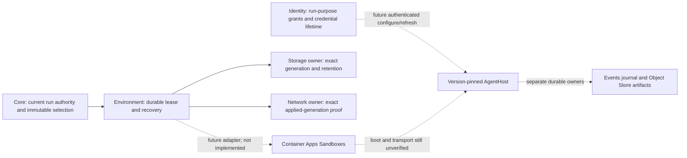

# Container Apps Sandboxes: P3 compatibility evaluation

**Decision:** do not enable this provider with the current v1 runtime.
Keep it as a P3 research option behind Environment's exclusive Sandbox contract.
The documented microVM isolation is promising, but storage, network verification,
ownership recovery, and AgentHost integration need separate implementation and proof.

This evaluation addresses [#1899](https://github.com/sabbour/agentweaver/issues/1899).
It does not implement an adapter, authorize a cloud trial, or add a P1/P2 dependency.
It does not restore Container Apps as an Application Hosting provider.
AKS `agent-sandbox` remains the default Sandbox; Azure Files remains the default Storage.
Any implementation needs a separate issue and approval after these findings.

## Evidence and version boundary

Public documentation was inspected on **2026-10-08**. No SDK was installed and no
Azure resource, identity, role assignment, sandbox, or volume was created or deleted.
The 0.x source and tests below were inspected, not executed for this evaluation.
There is no Agentweaver compatibility, performance, durability, or cloud acceptance result.

Azure Container Apps **Sandboxes** uses hardware-isolated microVMs and
`Microsoft.App/sandboxGroups`. It is not the older **Dynamic Sessions** service,
which uses `Microsoft.App/sessionPools`. Dynamic Sessions limitations are not evidence
of Sandboxes limitations.

The inspected ARM Sandbox Group reference uses API version `2026-07-01`.
The published Python package metadata reports `azure-containerapps-sandbox` version
`0.1.0b4`, Python `>=3.10`, and a preview API warning.
The private-ingress guide still illustrates `2026-02-01-preview`.
A future adapter must select and verify exact control-plane, data-plane, and SDK
versions; these examples do not establish one stable combined contract.

| Evidence | Source and relevant fact |
| --- | --- |
| Service boundary | [Microsoft Learn overview](https://learn.microsoft.com/en-us/azure/container-apps/sandboxes-overview): microVMs, Sandbox Groups, custom images, volumes, and separate control/data planes. |
| ARM resource | [Sandbox Groups GET, 2026-07-01](https://learn.microsoft.com/en-us/rest/api/resource-manager/containerapps/sandbox-groups/get?view=rest-resource-manager-containerapps-2026-07-01): group identity and properties, not an Agentweaver lease or per-sandbox fence. |
| Preview SDK | [PyPI package](https://pypi.org/project/azure-containerapps-sandbox/) and [package metadata](https://pypi.org/pypi/azure-containerapps-sandbox/json): inspected version and preview warning; creation, execution, and ingress IP-policy examples. |
| Lifecycle and images | [Sandbox operations](https://sandboxes.azure.com/docs/sandboxes/sandboxes), [lifecycle](https://sandboxes.azure.com/docs/sandboxes/sandbox/lifecycle), and [disk images](https://sandboxes.azure.com/docs/sandboxes/disk-images): IDs, labels, Running/Stopped/Disabled states, automatic suspend/delete, and OCI-to-disk conversion. |
| Storage | [Volumes](https://sandboxes.azure.com/docs/sandboxes/volumes): group-scoped Blob, Blob BYO, and single-mounted Data Disk; filesystem and sharing limitations. |
| Egress | [Microsoft Learn policy semantics](https://learn.microsoft.com/en-us/azure/container-apps/sandboxes-egress-policies) and [policy API examples](https://sandboxes.azure.com/docs/sandboxes/sandbox/egress): ordered rules, inspection modes, set/get, and decision records. |
| Identity and routing | [Group identity](https://sandboxes.azure.com/docs/sandboxes/identity), [VNet egress](https://sandboxes.azure.com/docs/sandboxes/sandbox/vnet), and [private ingress](https://sandboxes.azure.com/docs/sandboxes/private-endpoints): group identities, selected VNet connections, and optional Express Environment linkage. |
| Recovery and capacity | [Snapshots](https://learn.microsoft.com/en-us/azure/container-apps/sandboxes-snapshots-state-management), [reliability](https://learn.microsoft.com/en-us/azure/reliability/reliability-container-apps-sandboxes), and [quotas](https://sandboxes.azure.com/docs/sandboxes/limits): snapshot restrictions, maintenance relocation, regional limits, and admission failures. |

The v1 comparison uses the admitted Sandbox, Storage, and Network source at
[`36cc9a7`](https://github.com/sabbour/agentweaver/tree/36cc9a78251a4adca1de4584ac7a7b29c5c1c393).
See the [Environment Sandbox guide](../environment-sandbox.md),
[Storage design](provider-seams.md#storage), and
[egress guide](../environment-egress.md).
AgentHost requirements also use the admitted source at
[`61820d0`](https://github.com/sabbour/agentweaver/tree/61820d03caf6d5b412178795a1139538afe39eaa), merged through
[#1933](https://github.com/sabbour/agentweaver/pull/1933), tracked by
[#1856](https://github.com/sabbour/agentweaver/issues/1856).
Source admission is not evidence of a released or deployed AgentHost.

## Compatibility matrix

**Documented** means the public service documentation describes a feature.
**Unverified** means it has not been proved against Agentweaver's contract.
**Rejected pairing** means the current compiled adapters cannot represent the combination.
An unknown service guarantee is not treated as either support or an absolute service limitation.

| Requirement | Documented service support or limitation | Agentweaver result |
| --- | --- | --- |
| VM isolation | Each sandbox has a hardware-isolated microVM boundary. | Documented match for the isolation category; verify the exact runtime configuration before advertising the capability. Generic container execution is insufficient. |
| Identity and grants | Entra data-plane access uses the Sandbox Group Data Owner role. Groups support system/user-assigned managed identities. Egress transforms can use group secrets or managed-identity tokens. | Unverified integration. Azure group access is not Projects authority or Identity's actor/project/run/purpose grant. Do not give untrusted AgentHost code ambient group credentials. |
| Owned lease and immutable pin | Sandboxes have service IDs, labels, and observable state. Group and resource scopes are distinct. | No inspected example proves an owner fence, conditional generation update/delete, or replay-safe create. Preserve Environment's durable owner tuple, selected versions, operation ID, and fences; labels alone cannot authorize an effect. |
| Provision/observe/release | SDK examples expose create pollers, list/get, stop/resume, and delete. | Basic operations are documented. Creation after an uncertain response, ID reuse, conditional release, and exact absence proofs remain unverified. Never retry create blindly or interpret a failed lookup as absence. |
| Late results and retirement | Automatic suspend/delete and maintenance moves can change compute state independently. Network traffic can resume a stopped sandbox. | Provider lifecycle observations must not complete or abandon a Core run. Late creates need Environment's separate fenced cleanup queue. Automatic delete/resume cannot replace current owner authorization and retirement reconciliation. |
| Capacity | Quota counts concurrent active cores; stopped sandboxes do not count. Exhaustion blocks creation or starting; API throttling can return `429`. | Documented capacity boundary, not a reservation. Negotiate available limits and retain uncertain operations. No subscription quota, regional availability, throughput, or startup target was measured. |
| Version-pinned AgentHost | A private disk image can be built from a remote OCI image and selected by disk ID. Public image versions can change without notice. | Unverified. Pin the approved AgentHost image digest and converted disk identity, and prove entrypoint, runtime/SDK versions, user, private files, workspace access, and native status. A public Copilot preset is not Agentweaver AgentHost. |
| Configure/refresh/A2A | Shell execution and exposed ports are available; ingress supports source-IP policy. Private ingress can use an Express Environment and Private Endpoint. | No inspected service example implements AgentHost's authenticated binding, idempotent configure/activate, refresh, A2A, or callback authority. HTTPS reachability and an IP allowlist are not those proofs. |
| Startup evidence | Service Running state and disk-image Ready state are observable. | These cannot substitute for scheduled, image-ready, started, configured, and dispatch-ready evidence tied to the exact resource, image, workspace, network generation, and current lease. Phase and total startup ceilings remain unverified. |
| Workspace attachment | Blob mounts support sharing for reads, with partial POSIX behavior. Data Disk is POSIX-compliant and allows one sandbox mount at a time. | Neither is the current Azure Files CSI/PVC protocol. Blob does not prove RWX writes or durable flush. Data Disk does not prove generation-fenced attach/detach or Agentweaver retention. See the pairing table. |
| Egress verification | Ordered host/path/method rules, readback, audit decisions, and runtime updates are documented. Full inspection blocks non-HTTP traffic; Partial permits non-HTTP traffic. In-flight requests are not reevaluated after a policy update. | No exact applied-generation or current Cilium selector proof. Map each required destination/protocol without weakening it; test propagation and revocation races before readiness. Full inspection cannot silently replace required TCP/UDP semantics, and Partial cannot silently allow extra traffic. |
| Recovery and retention | Memory/disk snapshots and maintenance relocation are documented. With a Data Disk volume attached, only Disk suspend mode is supported; Memory mode is unavailable. This does not prove that the volume is captured in the snapshot. Volumes and snapshots are separate group resources. | Restored memory can contain expired credentials and stale leases. Reauthorize, refresh, and verify current egress before effects. A compute snapshot is not an atomic journal, artifact, or workspace checkpoint. Separate owners retain their data independently. |
| Availability | The reliability guide documents regional operation without zone pinning, zone redundancy, or an SLA, and describes maintenance relocation/resume. | No approved-region deployment or failover proof. Do not infer availability in `eastus2euap` from another region's example, or count provider relocation as Core recovery. |

### Storage and Network pairings

There is **no currently supported Container Apps Sandboxes pairing in v1**.
The abstractions include a `FileMaterialization` protocol, but the present Environment
and AKS Sandbox composition requires the exact PVC and Cilium observations.
An abstract protocol name is not a compiled adapter or a successful negotiation.

| Sandbox / Storage / Network choice | Disposition | Reason |
| --- | --- | --- |
| Current AKS `agent-sandbox` / Azure Files CSI/PVC / Cilium | Existing v1 source pairing; not live-cloud proof. | The adapters share exact Kubernetes/PVC identities and verified policy generations. This evaluation does not change it. |
| Container Apps Sandboxes / current Azure Files CSI/PVC / Cilium | Rejected pairing. | No documented mount for the selected Kubernetes PVC UID, no Kubernetes Pod selector for Cilium, and no matching generation evidence. |
| Container Apps Sandboxes / managed Blob or Blob BYO / current PVC or RWX requirements | Rejected pairing. | Blob is not PVC attachment. Managed Blob lacks required shared-write visibility, hardlinks, cross-directory atomic rename, and full flush semantics. BYO behavior requires independent proof. |
| Container Apps Sandboxes / Data Disk / current PVC or shared-RWX requirements | Rejected pairing. | It is a separate single-mounted volume type, not Azure Files CSI or a shared-RWX attachment. |
| Container Apps Sandboxes / future single-owner Data Disk adapter / future managed-network adapter | Research candidate only. | Needs storage ownership/generation/retention negotiation and exact policy-generation enforcement. Restrict capability claims to proved semantics; an attached Data Disk permits only Disk suspend mode, not Memory mode. |
| Container Apps Sandboxes / future read-only materialization / future managed-network adapter | Research candidate only. | Possible only for selections that explicitly require those narrower semantics. It must not substitute for a selected durable writable volume or Cilium provider. |

The following is a **proposed evidence boundary**, not an implemented dispatch path:

VNet egress and private ingress are different features.
The selected group VNet connection is immutable for each sandbox.
Private ingress optionally links the group to an Express Container Apps Environment;
the documentation says that link cannot be undone or moved.
It also changes ingress FQDNs and requires Private DNS and separately approved access.
The link does not configure sandbox egress, supply A2A authentication, or authorize a run.
Private Endpoint charges and network-role grants need separate approval.

## Compatible 0.x behavior to preserve

The inspected reference is
[`013ba5e`](https://github.com/sabbour/agentweaver/tree/013ba5e12915b6a729763e04221c297438b1cd11).
No Container Apps Sandboxes adapter was found in the scoped released-source inspection.
Reuse the following invariants, not Kubernetes-specific transport or historical cleanup shortcuts.

| Actual reference | Required invariant for any future adapter |
| --- | --- |
| [`CurrentSandboxBindingVerifier`](https://github.com/sabbour/agentweaver/blob/013ba5e12915b6a729763e04221c297438b1cd11/apps/Agentweaver.Api/Sandbox/CurrentSandboxBindingVerifier.cs) and [`CurrentSandboxBindingTests`](https://github.com/sabbour/agentweaver/blob/013ba5e12915b6a729763e04221c297438b1cd11/tests/Agentweaver.Tests/CurrentSandboxBindingTests.cs) | Require current lease token/generation, exact resource-owner chain, source identity, and readiness. Reject historical placements, replaced IDs, missing leases, and rotation between reads. An ACA state or label is not equivalent attestation. |
| [`TerminalCoordinatorChildSandboxCleanup`](https://github.com/sabbour/agentweaver/blob/013ba5e12915b6a729763e04221c297438b1cd11/apps/Agentweaver.Api/Coordinator/TerminalCoordinatorChildSandboxCleanup.cs) and [its tests](https://github.com/sabbour/agentweaver/blob/013ba5e12915b6a729763e04221c297438b1cd11/tests/Agentweaver.Tests/Coordinator/TerminalCoordinatorChildSandboxCleanupTests.cs) | Reconcile all owned children/revisions after restart. Recheck parent, child, lifecycle generation, holder, and execution fence after asynchronous observation; retain active owners and previews. Stale generations, replaced holders, and reactivated parents must not release resources. |
| [`AgentHostReaperService`](https://github.com/sabbour/agentweaver/blob/013ba5e12915b6a729763e04221c297438b1cd11/apps/Agentweaver.Api/Sandbox/AgentHostReaperService.cs) and [`AgentHostReaperCredentialTests`](https://github.com/sabbour/agentweaver/blob/013ba5e12915b6a729763e04221c297438b1cd11/tests/Agentweaver.Tests/Preview/AgentHostReaperCredentialTests.cs) | Keep creation grace and preview retention separate from terminal execution. Retain failed credential-revocation work after placement disappears and retry it. Do not port lossy claim-name ownership or best-effort secret deletion into v1's fenced, audited owners. |

The current v1 Environment implementation is the stronger ownership boundary:
one current durable lease, immutable provider requests, authority rechecks,
exact release receipts, and separate late-result cleanup.
Provider auto-delete, lease age, failed credential refresh, or a stopped microVM
must not bypass that boundary.
The missing Core terminal/superseded-owner API remains a separate dependency for
automatic reclamation, not a flag supplied by the future adapter.

## Evidence required before a future implementation is enabled

The following scenarios are **unexecuted requirements**, not passing tests.
A future, separately approved issue must scope the adapter and exact supported pairing.
It must not turn this evaluation into automatic provider enablement.

| Gate | Required evidence |
| --- | --- |
| Immutable identity and recovery | Pinned API/SDK/image/disk/options versions; owner-scoped create replay and uncertain-result recovery; concurrent admission; stale-fence rejection; late result after release; exact release/absence; restart and reconciliation without duplicate compute or foreign deletion. |
| Capacity and lifecycle | Actual target-region availability and quota; create/start throttling and quota denial; no unbounded retries; suspend, maintenance relocation, auto-resume, and retirement under current Core/Environment authority. |
| AgentHost | Converted approved image boot; all observed startup phases and configured phase/total ceilings; authenticated configure/activate/refresh/A2A; expired or revoked credentials; exact current accepted selection and lease before each effect; no ambient cloud/model authority. |
| Storage | Exact owner/resource/data generations and pinned mount protocol; replace/release blocked while attached; detach receipt; declared consistency, access mode, flush, restart, and independent retention. Reject the unsupported pairings above before provisioning. |
| Network and transport | Exact requested/applied generation; allowed and denied HTTP plus required TCP/UDP/DNS/private destinations; propagation, in-flight requests, policy change, stale readback, and revocation races; private ingress DNS and authentication without credential-bearing URLs. |
| Journal, artifacts, and snapshots | Durable journal and artifact references survive compute retirement; no duplicate external effects after resume; snapshot scope, credentials, expiration, workspace data, and separately owned deletion/retention remain explicit. |

**Go/no-go:** no-go for current provider enablement or an unqualified drop-in adapter.
The service is suitable for a separately approved, bounded investigation of a
single-owner Storage pairing and managed Network adapter.
Only proved capabilities may be advertised.
If the selected contract cannot be represented or verified, reject the selection;
do not fall back to weaker isolation, ephemeral storage, broader egress, or a different provider.
