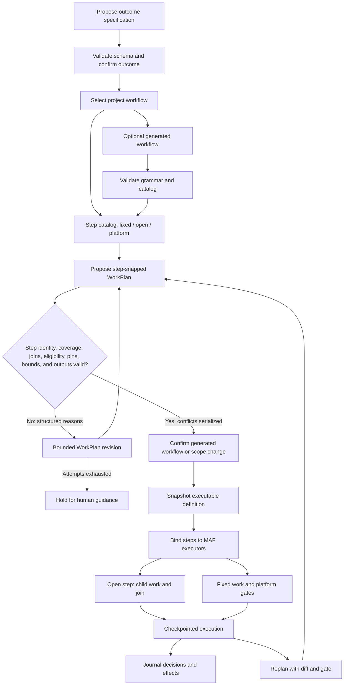

# Orchestration
> Part of [ADR 0001: Agentweaver 1.0 platform architecture](../decisions/0001-platform-architecture.md). **Status:** Proposed.

## Summary

- The Orchestrator owns a thin coordinator over Microsoft Agent Framework (MAF)
  workflows. The model proposes outcomes, workflow choices, and child work; code
  validates decisions and advances durable execution.
- Every workflow has a step catalog. Fixed steps create prescribed work, open steps
  allow bounded model-authored subtasks, and platform steps run gates that the model
  cannot impersonate.
- Every WorkPlan subtask names its workflow step. Required coverage, cardinality,
  roles, ordering, fan-out, policy, and gate ownership are checked before dispatch.
- Typed coordinator tools replace free-text reply parsing. Accepted decisions and the
  executable workflow snapshot are recorded for audit and recovery.
- Confirmation gates protect the outcome before decomposition and dispatch, generated
  workflows before first use, and scope-changing replans. Approval is a workflow
  transition, never an inference from message acknowledgment.
- Agentweaver's run page and surface panel reflect workflow state; they are not a
  second orchestration engine. There is no dynamic JavaScript workflow runtime.

## Today in 0.x

Paths refer to the 0.x code on the `dev` branch. Workflows already combine fixed
nodes (including Prompt, PeerReview, BuildTest, Check, FanOut/FanIn, OpenPullRequest,
and Merge) with `CoordinatorComposed` nodes that the coordinator decomposes at run
time (`apps/Agentweaver.Api/Workflows/WorkflowDefinition.cs`). In child workflows,
static branch nodes become ordered subtasks and a composed node's dynamic sub-plan
joins at its parent boundary
(`apps/Agentweaver.Api/Workflows/WorkflowChildWorkService.cs`).
This is a useful partial form of step snapping, not a blank slate of free-form work.

At the top level the selected workflow reaches the coordinator as guidance in a
prompt, not as an enforceable step catalog. The model returns JSON subtasks with
roles, phases, dependencies, and declared outputs, but no workflow-step identity.
Nothing verifies that the top-level WorkPlan covers the selected workflow's steps or
avoids duplicating them. Assembly still applies selected platform gates
independently (`apps/Agentweaver.Api/Coordinator/CoordinatorOrchestratorExecutor.cs`,
`apps/Agentweaver.Api/Coordinator/CoordinatorDispatchService.cs`).

Prompt instructions also carry procedure for confirmation, previews, tool scope, and
handoffs. Reply parsing strips model reasoning and scans for JSON in some selection
and outcome-spec paths. 1.0 preserves the useful workflow and child-work behavior,
not the reliance on prose to enforce it. The 0.x line continues to ship during the
1.0 rebuild.

## Workflow as an executable contract

A workflow is the selected, versioned MAF execution definition. The project supplies
its available workflows and a deterministic default if selection fails. The
coordinator may choose among them or propose a generated workflow. A generated
workflow must pass the grammar and step-catalog validators and receive human
confirmation before first use ([R11](../decisions/0001-platform-architecture.md#risk-register)).
This is an Orchestrator domain contract, not a provider seam.

Every workflow declares a step catalog; a definition without one is invalid. An
exploratory workflow can declare one open step and retain broad latitude without
losing an enforceable place for its work. The catalog is part of the executable
definition snapshot pinned to a run, so later edits to a project workflow cannot
silently change an active run.

### Step catalog

| Field | Meaning |
| --- | --- |
| `id`, purpose, and order | Stable step identity, the outcome it covers, and deterministic catalog ordering |
| Mode | `fixed`, `open`, or `platform`; determines who creates work and who may propose subtasks |
| Allowed roles and phase | Eligibility for work in the step, including planning versus execution or validation |
| Cardinality | Exactly one, one or more, optional, or any number of matching work items |
| Dependencies and ordering | Required preceding steps, join boundaries, and the step-order constraints on child work |
| Isolation and provider requirements | Allowed isolation choices and capability requirements checked against the run's pinned provider binding |

A **fixed** step carries its prescribed task, role, phase, isolation choice, and
declared outputs; the platform creates that work, as it does for a static branch in
0.x. An **open** step lets the coordinator propose bounded child work that assembles
at the step boundary. A **platform** step names a platform-owned gate; the
coordinator cannot fill it with a normal subtask or claim that its executor ran.
The catalog's version and ordered step definitions are snapshotted together.
Built-in workflows include an open implementation step so the existing flexibility
survives under a declared boundary.

Run validation also binds prescribed fixed work to the selected role's isolation
choice and the run's pinned Sandbox provider, rejecting work whose required
capabilities were not negotiated.

Platform steps can include build/test and preview, responsible AI (RAI),
rubber-ducking, review, opening a pull request, merge, Scribe, and application
publication where the workflow calls for them. They are not interchangeable with
agent-written "review" or "publish" subtasks. The publish gate binds an authorized
owner's approval to an exact revision and its test evidence before promotion to
`published`; the `live` and `preview` stages are described in
[Applications and surfaces](applications-and-surfaces.md).

A workflow may label exploratory work with `allowUnmappedWork`, but the label does
not waive step identity. Otherwise-unclassified work must be assigned to a declared
open step. If no such step exists, the WorkPlan is rejected. An empty optional open
step is valid; a broad exploratory step remains usable while retaining finite
cardinality and run-level item bounds. This is the strictness rule in
[R13](../decisions/0001-platform-architecture.md#risk-register), including for
generated workflows.

The pure `Agentweaver.Orchestrator.Core` domain library validates built-in and
generated catalogs before creating a versioned definition snapshot. It validates
typed outcome, selection, WorkPlan, and revision proposals against those snapshots;
invalid definitions and plans return structured reasons and no snapshot value.
Generated definitions remain marked for first-use confirmation. The Orchestrator
owner persists accepted definitions and decisions, exact-request gate state, workflow
position, and MAF checkpoints in its own PostgreSQL schema. The full dispatch engine
remains a separate slice.

The library also contains the source-only `AgtPolicyProvider`, an AGT 4.0.0
platform-singleton adapter backed by YAML policies, and `ExecutableActionGuard`. The
guard uses the Orchestrator-owned current-grant lookup and redacted receipt writer.
It matches the grant to the authenticated caller's HTTPS issuer and subject,
project/run/session/step, action, purpose, and execution fence before applying AGT
as an additional restriction. The caller's subject and project/run claims must share
one authenticated identity and issuer. Missing, duplicate, cross-issuer, stale, or
expired grants deny. Protected effects recheck current authority, grant state, and
fence after awaits. The current generic Sessions append path still rejects
PolicyEvaluation events; the reserved receipt-backed Events consumer is retained
work under #1846, so this source does not claim positive journal ingestion.

### Outcome, selection, and confirmation

1. The coordinator proposes an outcome specification with a typed tool. The schema
   validates required fields and the workflow holds the specification in a draft
   state. A material ambiguity goes to a question gate instead of being silently
   resolved by a model guess.
2. A human confirms the outcome before decomposition or dispatch. A coordinator may
   then select an eligible project workflow; invalid selection falls back to the
   project default rather than an ungated ad hoc route.
3. The selected definition exposes its step catalog to the planning tool. If a
   workflow was generated for this run, grammar and catalog validation precede its
   first-use human confirmation.
4. The coordinator proposes a WorkPlan against that catalog. Only a validated plan
   can reach dispatch. There is no path from an unconfirmed outcome or a rejected
   workflow definition into an executor.

The model can judge the user's intent, choose a workflow, and suggest appropriate
roles. It cannot bypass the schema, grants, policy, or transition preconditions.
Confirmation is a durable gate with a request id, not a favorable sentence in an
agent reply. The [coordination verbs](sessions-and-coordination.md#coordination-verbs)
route the request and record an explicit answer.

## Step-snapped WorkPlans

A WorkPlan is the proposed directed acyclic graph (DAG) of child work. Every subtask
includes `workflowStepId`, its assigned role and agent, phase, model and isolation
choice, dependencies, and declared outputs. The identifier generalizes the 0.x
`WorkflowBranchNodeId` from static branch work to all planned subtasks. Fixed steps
remain platform-created; model-authored subtasks belong to open steps. Platform
steps are never normal plannable subtasks.

The typed `propose_work_plan` schema contains the selected catalog version, rather than a
free-text hint. A proposal with no matching step is reassigned to a declared open
step by an explicit revision or rejected; it is never accepted as a step-less
subtask. A project workflow can grant broad exploration through its open step,
without making every workflow an unbounded plan.

### Validation before dispatch

The Orchestrator validates a candidate against the workflow grammar, WorkPlan schema,
and applicable project and platform policy:

1. **Coverage:** every required step is represented or is a platform-created step.
   Optional steps may be absent, but are not silently invented later by the model.
2. **Cardinality:** each step has exactly the permitted number of work items.
   Open-step fan-out remains subject to run limits.
3. **Eligibility:** every proposed role and phase are allowed by the step; model and
   isolation choices satisfy pinned bindings, authorization, and policy.
4. **Ordering:** subtask dependencies form a DAG consistent with catalog order, and
   each open-step join completes before its dependent step proceeds.
5. **Gate ownership:** no proposed subtask masquerades as a platform build/test,
   review, publish, merge, or other platform-owned gate.
6. **Resource and output bounds:** child count and declared-output count and path
   length stay within domain limits. Paths must be canonical repository-relative
   files; rooted paths and traversal are rejected.
7. **Run selections:** the model-selection reference and agent must be eligible for
   the assigned role in the immutable run-selection context. The selected isolation
   provider must match the run's pinned Sandbox binding, and required capabilities
   must be in its negotiated capability set. Model references are opaque;
   Orchestrator does not introduce a Model provider seam.
8. **Output conflicts:** exact, case-insensitive path, path-suffix, and bare-filename
   overlaps are conservatively serialized with deterministic dependency edges.
   Existing reverse dependencies are preserved rather than turned into cycles.
   Invalid output paths reject the plan; they never degrade into an empty output
   declaration.

A rejection returns structured reasons and the coordinator may revise a bounded
number of times. Exhausting that budget holds work for human guidance; it does not
turn an invalid plan into a dispatchable plan. Accepted plans and the reasons for
subsequent revisions are journaled. The grammar validator also applies to built-in
and generated workflow definitions.

This flowchart shows typed proposals passing deterministic validation into a
checkpointed MAF execution, with bounded revisions returning through a gate.

The accepted definition is snapshotted for the run, then bound to real MAF executors.
Child work within an open step fans out only within validated limits and joins at
that step's boundary. Checkpoints preserve the current step, pending children, and
gates. The journal preserves what was proposed, accepted, dispatched, and observed.
The [Sessions seam](provider-seams.md#sessions) supplies the authoritative journal;
its opaque Copilot conversation cache is only a resume aid
([Sessions and coordination](sessions-and-coordination.md#durable-history-and-resume-aids)).

## Typed coordinator actions

The coordinator prompt states its role, goal, selected schema and catalog, and
available verbs. It does not encode the operating procedure that the workflow must
enforce. Its grant contains decision and coordination tools only. Core Policy checks
the grant on every invocation; the Agent Governance Toolkit (AGT) denies an attempt
to act outside it. A coordinator cannot write code, run a build, conduct a review,
merge, or publish by declaring in prose that a step is done.

| Tool | Accepted effect or structured rejection |
| --- | --- |
| `propose_outcome_spec` | Validate fields; create a confirmable draft without dispatching |
| `select_workflow` | Choose an eligible project definition or return the default and validation reasons |
| `propose_work_plan` | Validate a catalog-bound DAG; return errors or a candidate for confirmation |
| `revise_work_plan` | Validate changes, compute a scope diff, and require confirmation when its gate applies |
| `dispatch` | Start ready child work only after confirmation, dependency, policy, and budget checks |
| `steer` | Address and fence a typed message; the receiving turn admits it at its boundary |
| `request_assembly` | Ask platform executors to collect completed work and gate evidence; do not perform a gate in the coordinator |

The coordinator also uses the typed spawn, status, question, approval, and messaging
verbs in [Sessions and coordination](sessions-and-coordination.md#coordination-verbs).
Each accepted action and its validation result is journaled. Structured tool calls
replace scanning free-text model replies for braces or reasoning blocks. A free-text
explanation can inform a human; it cannot mutate workflow state.

## Rules in code

The 0.x coordinator charter and runtime prompts mix enforceable procedure with
judgment. This audit assigns the procedural rules to validators, workflow transitions,
tool grants, message routing, and executor contracts. Representative 0.x sources are
`packages/Agentweaver.Squad/Catalog/Resources/agents/coordinator.agent.md`,
`apps/Agentweaver.Api/Coordinator/CoordinatorOrchestratorExecutor.cs`,
`apps/Agentweaver.Api/Coordinator/CopilotCoordinatorSpecDrafter.cs`, and
`apps/Agentweaver.Api/Coordinator/CoordinatorDispatchService.cs`.
The exact wording of a new prompt is not a substitute for a tested guard.

| Rule carried by 0.x prompt or executor | 1.0 enforcement point | Testable boundary or remaining judgment |
| --- | --- | --- |
| Ground planning in team memory and decisions | Knowledge context projection from the session tree and records | Projection is present; relevance remains model judgment |
| Produce a confirmable outcome specification | Typed schema validator and `draft → confirmed` transition | Missing fields or confirmation block progression |
| Ask rather than guess about material scope | Question gate and pending request id | Gate blocks when invoked; recognizing ambiguity remains judgment |
| Do not decompose or dispatch before confirmation | Hard workflow transition and dispatch precondition | Rejected before the confirmed state |
| Preserve the goal's breadth; invent no deliverables | Outcome schema check against the confirmed specification | Structural consistency is checked; intent fidelity remains judgment |
| Use capabilities only for feasibility and eligible roles | Allowed-role validator on each catalog step | Ineligible assignment is rejected |
| Declare role, model, isolation, dependencies, planning phase, and repo-relative outputs | Typed WorkPlan schema and DAG validator | Missing, malformed, or conflicting fields are rejected |
| Never propose platform-owned RAI, build/test, review, merge, or Scribe work | Platform catalog steps are not proposable | Gate-shaped subtasks cannot substitute for platform executors |
| Dispatch ready work in parallel subject to dependencies and file conflicts; advance only after terminal outcomes | Ready-frontier workflow transitions | Premature dispatch or advancement is rejected |
| Relay steering, questions, and approvals to the accountable human | Fenced message primitive with question and approval gates | Receipt alone cannot unblock a decision |
| Treat an approval wait as blocked work, not a stall; bound retries | Gate state machine and run limits | Pending approval stays pending; excess retries stop |
| Preview runnable artifacts first and include preview details in the handoff | Build/test and preview gate contract; assembly handoff schema | Missing required preview evidence blocks the handoff |
| Coordinator writes no code, tests, or docs and performs no RAI, review, merge, or Scribe pass | Meta-tool grant, AGT check, and workflow transitions | An ungranted operation is denied |
| For software run one build/test then human review; content-only work may omit build/test | Workflow classification and gate validator | Required gate count and order are checked |
| Include RAI, rubber-duck, and human review when warranted; never pick an ungated workflow | Workflow selection and gate validator | Ungated selection is rejected; applicability remains judgment |
| Use only Agentweaver meta tools, not shell or file tools | Coordinator tool grant | Shell and file access are absent from grant |
| Respect prompt, model, child, concurrency, cost, and wall-time bounds | Workflow-enforced run limits | Excess use blocks or stops the run at its limit |

The acceptance rule is that every procedural **must** or **never** has a code
enforcement point and a test. Judgments about scope, meaning, and whether a review
is warranted stay in the coordinator's reasoning, but they cannot bypass gates.
The coordinator's fresh prompt describes role, goal, catalog-backed proposal schema,
and available verbs instead of duplicating state-machine rules.

## Execution, gates, and replanning

The workflow grammar and step validator accept a definition before the
`RunWorkflowGraphBinder` and `NodeExecutorRegistry` attach its steps to MAF
executors. Platform executors own build/test and preview, RAI, rubber-duck,
independent review, opening a PR, merge, Scribe, and the publish gate where included.
A conservative fan-out policy limits child work. MAF checkpoints and recovery
continue the workflow without asking the coordinator to reconstruct procedural
state from a conversational transcript.

The selected gates remain visible in the executable snapshot and journal. For
software work, classification requires one build/test gate followed by human review;
content-only work can omit build/test where the workflow permits. Publication is a
platform step: an owner authorizes the exact, verified revision before the
application is promoted from `preview` to `published`. The [application lifecycle](applications-and-surfaces.md)
and its surface panel share these state transitions rather than creating a UI-only
publish path.

A running workflow may need to change its plan. The coordinator calls
`revise_work_plan`; the Orchestrator validates the candidate, computes a structured
diff against the previous immutable snapshot, and records the accepted version.
Changes to steps, eligibility, required capabilities, cardinality, fixed work, or
planned child items carry an explicit confirmation requirement. A catalog-version
change alone does not widen scope. Revising subtasks inside an existing open step
is still subject to catalog limits and run policy. Widening the agreed scope or
adding or removing steps changes the workflow contract and requires confirmation
before the changed work can dispatch
([R12](../decisions/0001-platform-architecture.md#risk-register)).
The coordinator cannot loop in its prompt to silently authorize a new stage. An
exhausted budget or invalid revision leaves a visible blocker for the operator.

Determinism here is about executable boundaries: given the pinned definition and
accepted decisions, code applies the same validators, transitions, and gates.
Model-generated subtasks and later tool results remain dynamic. Recorded playback
is exact; fork and re-execution need not reproduce those outcomes. The journal makes
the distinction inspectable rather than claiming identical model responses.

### Mapping to Agentweaver's UI

Agentweaver keeps its own run page, topology, approvals, chat, and surface panel.
The web application reads workflow state rather than implementing independent
scheduling rules:

| User-visible capability | Workflow source of truth |
| --- | --- |
| Topology and child sessions | Child work and session-tree parent, root, and detach links |
| Run status and blockers | Executor and WorkPlan stage, pending gate, interrupted state, and recovery effects |
| Confirming a plan | Outcome or WorkPlan confirmation gate with a request id |
| Answering a question | Durable question gate and an addressed answer by request id |
| Notify on idle | Subscription to terminal or idle workflow events |
| Chat and steering | Fenced addressed messages admitted at turn boundaries |
| Publish action and surface panel | Platform publish gate and typed surface action; no second publication state machine |

The [status snapshot](sessions-and-coordination.md#session-tree-and-status) carries the
run-state and recovery-effects acceptance from
[#1402](https://github.com/sabbour/agentweaver/issues/1402).
The [message primitive](sessions-and-coordination.md#one-coordination-message) retains
tracked acknowledgment and correlated replies from
[#1406](https://github.com/sabbour/agentweaver/issues/1406), but only gate transitions
approve work. User surface actions arrive as typed messages; the application and
surface model is specified in [Applications and surfaces](applications-and-surfaces.md).

Copilot SDK features such as modes, skills, custom agents, compaction, and ephemeral
research subagents can help inside a turn. They do not replace a durable child work
item when isolation, approval, independent gate execution, or merge is required.
Ephemeral harness subagents do not become nodes in the session tree.

## Alternatives considered

| Option | Why not |
| --- | --- |
| Free-form WorkPlans with only a workflow hint in the prompt | Required stages and platform-gate ownership cannot be checked at plan time |
| Make every workflow entirely fixed | The coordinator cannot adapt implementation subtasks to the confirmed outcome |
| Let the coordinator create its own gate subtasks | A model declaration cannot supply independent build, review, publish, or approval evidence |
| Enforce procedure solely through a larger coordinator prompt | Reply parsing, compliance, and recovery remain ambiguous without typed transitions |
| Run model-authored JavaScript workflows | Arbitrary script orchestration bypasses the MAF grammar, run limits, gates, and durable checkpoint contract |

## Phasing

- **P0 — Foundation:** versioned service contracts, Postgres state and outbox, Object
  Store, policy binding, and provider pinning supply durable execution primitives.
- **P1 — Core:** implement MAF step catalogs, grammar and WorkPlan validators,
  typed coordinator tools, thin prompt, executable snapshots, executor binding,
  checkpoints, run limits, child-work joins, journal, gates, and the session tree.
  Start persona harnesses against exact-SHA AKS deployments at the end of P1 and continue them through cutover.
- **P2 — Parity and cutover:** close the
  [#1405](https://github.com/sabbour/agentweaver/issues/1405) behavior-guarantee
  list, complete application `live`/`preview`/`published` stages and the publish
  gate, enforce budgets and all required surface actions, and pass API, UI, and MCP
  harnesses on an exact-SHA AKS deployment.
- **P3 — After cutover:** optional provider adapters can change backing systems,
  not the step catalog, confirmation gates, or coordinator's tool authority.

## Related risks

- [R9](../decisions/0001-platform-architecture.md#risk-register): typed decisions and
  cross-service messages use at-least-once outbox delivery with deduplication.
- [R11](../decisions/0001-platform-architecture.md#risk-register): per-run generated
  workflows require grammar, catalog validation, and human confirmation.
- [R12](../decisions/0001-platform-architecture.md#risk-register): bounded mid-run
  replanning cannot widen scope or change steps without confirmation.
- [R13](../decisions/0001-platform-architecture.md#risk-register): unmapped work needs
  a declared open step; built-in workflows provide one for implementation.
- [R23](../decisions/0001-platform-architecture.md#risk-register): exact-SHA AKS persona
  harnesses start at the end of P1 and must be green before cutover.
