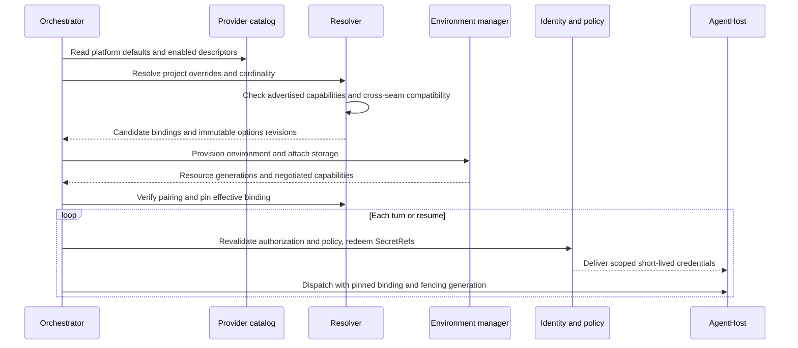
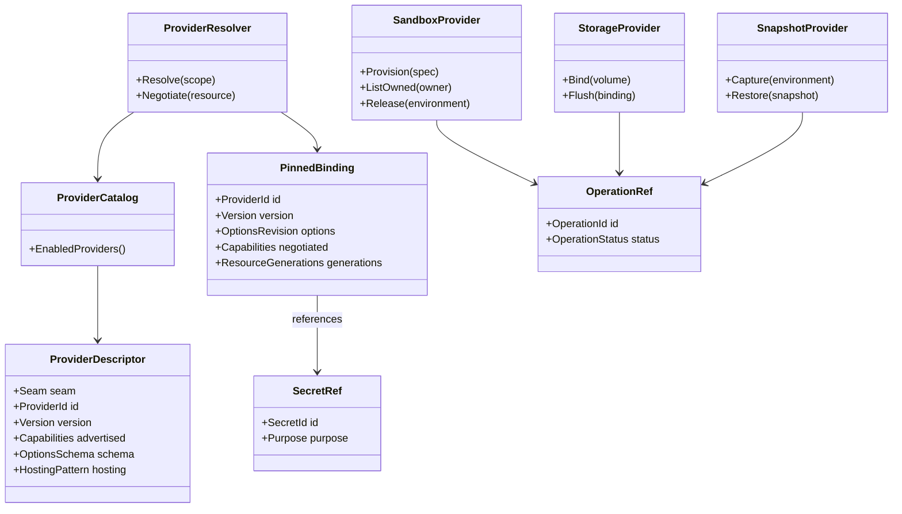
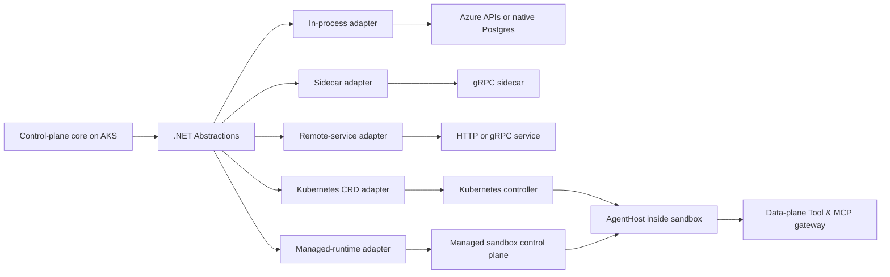
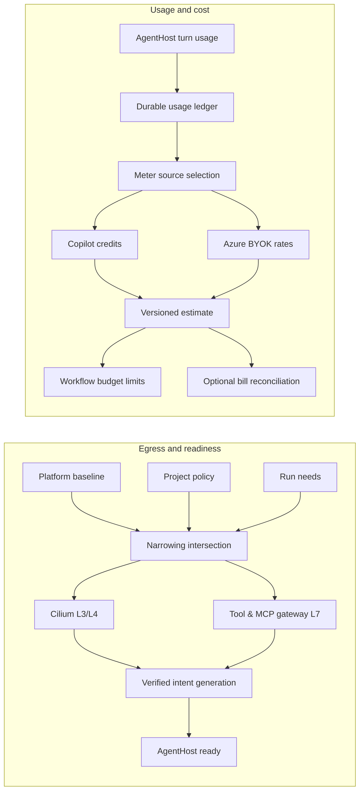

# Provider seams

> Part of [ADR 0001: Agentweaver 1.0 platform architecture](../decisions/0001-platform-architecture.md). **Status:** Proposed.

## Summary

- Agentweaver 1.0 exposes 15 provider seams through versioned .NET contracts; the core retains orchestration, authorization, fencing, and enforcement.
- Providers are in-repository adapters. Azure-backed adapters are the defaults, and optional providers must meet the same contracts and isolation requirements.
- Selection is not uniformly one-provider-per-run: seams are exclusive, ordered, platform-singleton, layered, keyed by meter source, or per application.
- A run pins provider identity, options revision, compatible resources, and negotiated capabilities. It never pins a credential or an authorization decision.
- A sandbox executes AgentHost; Storage holds the agent's workspace, while Object Store holds platform artifacts. Snapshots are optional and never substitute for a consistent run manifest.
- Network egress is generated from narrowing intent; cost accounting uses a durable usage ledger rather than telemetry counters.

## Today in 0.x

Paths refer to the 0.x code on the `dev` branch.

The 0.x API binds most operations to particular backends: Kubernetes sandbox resources, an Azure Files
shared persistent volume, Postgres memory, AGT policy, and GitHub. `SandboxExecutorFactory` selects local or
Kubernetes executors; the local paths do not carry into the cloud-only 1.0 platform. The AgentHost pod has
two regular containers and runs under `kata-vm-isolation` (`k8s/base/sandbox-template-agenthost.yaml`).

Runs, run events, and MAF checkpoints provide partial session state. `CopilotAIAgent` serializes the Copilot
SDK session into a checkpoint, whereas `AddressedMessageService` already persists addressed messages.
Deleting a fenced sandbox claim suspends placement but does not capture a VM snapshot. The common workspace
PVC is mounted by the API, worker, and AgentHost (`k8s/base/pvc-workspace.yaml`); it is not a per-run
isolation boundary.

Kubernetes and Cilium policies are static at deployment, not derived from project egress intent
(`k8s/base/networkpolicy-sandbox.yaml`, `k8s/base/cilium-network-policy-sandbox.yaml`). Usage is emitted as
`agentweaver.token.usage` to Azure Monitor. An earlier `token_usage_records` table lost its writer; **0.x
has no durable usage table today**. There is no spend-budget enforcement
(`packages/Agentweaver.AgentRuntime/CopilotAIAgent.cs`,
`apps/Agentweaver.Api/Metrics/AppInsightsMetricsService.cs`).

Azure Key Vault is the production secret store, reached through workload identity. The database keeps
credential references rather than BYOK and GitHub credentials. GitHub-specific interfaces exist, but no
general source-control contract exists. OpenTelemetry and Azure Monitor export telemetry; run events are
domain state, not an OpenTelemetry substitute.

## Provider model

### Boundaries and layering

The dependency direction is **clients → core services → `Agentweaver.Abstractions` → adapters → external
systems**. The web, API, and first-party MCP client reach the core; they do not pick a provider by talking
to its SDK. Core services own the session tree, MAF workflows, gates, run journal, tenancy checks, and
application publish decisions. They depend on provider-neutral interfaces and records in
`Agentweaver.Abstractions`.

Each implementation lives in an in-repository `Agentweaver.Providers.<Seam>.<Implementation>` package and
registers with .NET dependency injection (DI). **DI contracts are canonical**, even when an adapter talks to
a sidecar over gRPC, an external service over HTTP, or Kubernetes custom resources. Public contracts do not
expose provider SDK objects or version-sensitive MAF types. For example, `EnvironmentId`, `Placement`,
`EndpointDescriptor`, and `SnapshotRef` are Agentweaver terms; the adapter maps its own resource names.

A concept becomes part of a shared contract only when two implementations need it, including the default.
Otherwise it remains a versioned adapter option. Provider-specific resource names, router headers, and
placement mechanics belong in mappings, not the core. The GitHub Copilot SDK is the sole AgentHost model
harness; changing the sandbox does not change that harness.

### Selection and cardinality

Projects choose only from providers enabled in the platform catalog. Where an override is allowed,
resolution applies **platform default → project override**; platform policy can narrow the result. A run
cannot substitute another provider mid-flight because an endpoint is slow or unavailable.

| Cardinality | Seams | Resolution and binding |
| --- | --- | --- |
| Exclusive | Sessions, Sandbox, Storage, Memory, Source Control; Snapshots paired to Sandbox | One effective provider per applicable scope; pin its identity and options at run start. Snapshots may be `None`. For Sessions, one authoritative provider is pinned per run; a capture-only mirror may also observe journal entries but has no authority. |
| Ordered composite | Guardrails, Telemetry | Platform-enabled ordered set; a project may add, remove, or reorder only permitted entries. Pin the ordered set per run. |
| Platform-singleton | Policy, Secrets, Messaging, Object Store | One deployment-wide provider, fixed at service startup; projects cannot replace it. Project policy rules may only narrow. |
| Layered | Network Policy | One platform provider per enforcement layer: required L3/L4 and optional L7. Projects narrow egress intent, never select a provider. Pin the applied intent generation per run. |
| Keyed by meter source | Cost | The pinned model binding determines the pricing provider; unpriced usage remains recorded. |
| Per application | Application Hosting | Owner chooses a platform-enabled provider; pin it to each deployed revision, not to an agent run. |

The model resolver remains a separate existing concern. Its effective Copilot or bring-your-own-key (BYOK)
binding is pinned with the run and selects the Cost provider, but Model is not a new seam. A new run may
resolve new defaults; an existing run keeps its pinned choices.

### Descriptors and capability negotiation

An adapter registers a `ProviderDescriptor`: seam, stable provider ID, adapter version, advertised
capabilities, versioned options schema, and hosting pattern. The `ProviderCatalog` lists the enabled
descriptors and permitted project overrides. A resolver validates the options revision and cross-seam
compatibility before provisioning. A resource can negotiate fewer capabilities than its descriptor
advertises: a particular sandbox may not support snapshots, or a volume may not attach to a selected managed
runtime.

The core pins the **negotiated** resource capabilities after provisioning, including isolation class, image
digest, container/resource shape, storage attachment mode, and relevant resource generations. It rechecks
the capability before capture, restore, suspend, or other destructive operations. Unsupported operations
fail explicitly with `CapabilityUnavailable`; no implicit downgrade to a weaker mode. Descriptors enable
discovery, not an entitlement to bypass policy.

The resolution sequence includes per-turn revalidation; a pinned binding does not make yesterday's
authorization current.

### Contracts and core invariants

Interfaces use opaque IDs and immutable references. An `OperationRef` is a durable handle for an
asynchronous action, with `pending`, `ready`, or `failed` status that survives service restarts. Cancelling
a wait does not silently cancel the underlying action. Commands take idempotency keys and ownership/fencing
generations; callbacks and late completions must not resurrect a superseded run. Resource references never
contain filesystem paths, credentials, or provider authorization.

The contract relationships separate registration, selection, execution, and credentials.

All execution paths traverse core-owned enforcement gates: model invocation, tool registration and
invocation, MCP traffic, sandbox execution, secret redemption, and control-plane mutation. AGT decides
policy; Guardrails classify content and feed findings into that decision. Decorators around adapter calls
add telemetry and audit but are **not** a security boundary. Authorization and policy are revalidated at
every turn and resume; credentials are redeemed anew. Enforcement fails closed, even if an adapter or
gateway reports a permissive capability.

### Credentials and adapter hosting

A binding stores a `SecretRef`, never a token. The Identity service alone redeems or mints purpose-bound,
run-bound, short-lived credentials. It sends only the necessary scoped credential over authenticated
AgentHost configure/refresh channels, or injects one at the L7 gateway. Resume refreshes credentials that
may have survived in guest memory. A provider receives credentials only for its operation; neither project
options nor snapshot metadata carry their values.

Adapters have five deployment patterns. The contract and enforcement boundary remain the same even when the
implementation is outside the service process.

In-process libraries cover native state and Azure clients. A sidecar can host a non-.NET session
implementation. A remote service can host a Python memory adapter or OpenSandbox. Kubernetes controllers
implement agent-sandbox and, if adopted, pod snapshot/restore. Managed sandbox runtimes offer placement and
optional volume capabilities. AgentHost is **inside** the execution environment, not the Sandbox adapter;
its authenticated A2A endpoint and configure/refresh protocol survive placement changes. Control-plane
services run as AKS deployments; data-plane helpers may live in or beside a sandbox.

### Conformance and contract evolution

`Agentweaver.Abstractions.Testing` supplies per-seam contract suites and in-memory fakes. Every adapter must
pass the applicable suite, including fencing, idempotent retry, failed operations, capability
unavailability, owner scoping, credential non-disclosure, and recovery after restart. Each seam suite also
runs against at least two implementations or fakes to catch vocabulary biased toward one adapter. Cross-seam
tests exercise Snapshot/Sandbox pairing and Storage/Sandbox attach compatibility.

`Agentweaver.Abstractions` follows semantic versioning; experimental seams are marked `[Experimental]`.
Options schemas, adapter versions, and negotiated capabilities are recorded with bindings. A contract
upgrade cannot reinterpret a pinned option or reference silently. Service API and event compatibility is
tested separately as described in [Services and release](services-and-release.md).

## Seam catalog

The defaults below describe the cutover path. A later provider is an extension point, not a dependency for
cutover. The owner names the service responsible for the adapter lifecycle; core enforcement can involve
other services.

| Seam | Purpose | Owning service | Azure/default adapter in 1.0 | Later adapters | Cardinality |
| --- | --- | --- | --- | --- | --- |
| Sessions | Journal, playback, and optional capture | Events & Sessions | Native Postgres journal | agentsessions capture sidecar | Exclusive authority, with optional capture mirror |
| Snapshots | Capture and explicitly restore environments | Environment manager | `None` at cutover; gated AKS Blob-backed pod snapshots | OpenSandbox-native; managed-runtime snapshots after Azure support | Exclusive, paired |
| Sandbox | Provision, observe, fence, and release AgentHost environments | Environment manager | agent-sandbox on AKS | OpenSandbox; Agent Substrate after AKS proof | Exclusive |
| Storage | Durable agent workspace volumes and bindings | Environment manager | Azure Files CSI | Azure Elastic SAN CSI; future agent filesystem providers | Exclusive |
| Memory | Authoritative knowledge records and retrieval | Knowledge | Native Postgres | Cosmos memory service adapter | Exclusive |
| Policy | Decide permitted actions through AGT | Orchestrator | AGT .NET kernel, YAML rules | —; other rule languages configure AGT, not another adapter | Platform-singleton |
| Guardrails | Classify untrusted model inputs/results/output | Orchestrator | Azure AI Content Safety Prompt Shields for supported checks | Purview DLP; Llama Guard/Prompt Guard; NeMo Guardrails | Ordered composite |
| Network Policy | Materialize and verify egress intent | Environment manager | Cilium L3/L4/FQDN; own Tool & MCP gateway L7 | Plain Kubernetes NetworkPolicy where sufficient; agentgateway L7 | Layered |
| Cost | Price durable usage by meter source | Events & Sessions | Copilot AI-credit pricing; Azure BYOK pricing by P2 | Other source-specific rate cards | Keyed by meter source |
| Application Hosting | Serve durable preview and published revisions | Environment manager | AKS web runtime; Agentweaver shell for A2UI | Image-backed/owner-managed providers; Azure Container Apps | Per application |
| Secrets | Resolve credential references for trusted callers | Identity | Azure Key Vault with workload identity | None required for cutover | Platform-singleton |
| Source Control | Repository access, changes, PRs, and merge | Source Control & Merge | GitHub | Other Git repository and review systems | Exclusive |
| Telemetry | Export traces, metrics, and logs | Cross-service; Events & Sessions integration | OpenTelemetry to Azure Monitor | Other OTLP exporters | Ordered composite |
| Messaging | Carry durable cross-service events | Events & Sessions delivery; service-owned outboxes | Postgres transactional outbox and relay | Azure Service Bus transport | Platform-singleton |
| Object Store | Hold opaque platform blobs and artifacts | Events & Sessions integration; platform-wide | Azure Blob | — | Platform-singleton |

## Reviewed, not seams

These concerns have an existing resolver, an open protocol, one intentional backend, or an internal owner.
Adding a provider interface would duplicate a boundary without a second viable implementation.

| Candidate | Why it is not a provider seam |
| --- | --- |
| Model | The effective resolver already selects Copilot-hosted or project BYOK models (platform → project). Pin its output with the run; pricing belongs to Cost. User-level BYOK is out of scope ([R5](../decisions/0001-platform-architecture.md#risk-register)). |
| Context | Azure context caching is a deployment setting, not a client backend. Append prompt material from stable to volatile: base charter → skills → project memory → run context; record cached-input-token usage. The Copilot SDK controls the prefix, tool list, and compaction. |
| Tools | Custom tools are a small SDK registration set; external tools already use MCP. Permission metadata belongs on tools, not a new provider. MCP annotations are untrusted unless the server is trusted. |
| Skills | `SKILL.md` is an open format. Catalog, imports, uploads, and generation are configuration, not competing skill backends. |
| MCP Servers | MCP itself is the adapter protocol. The catalog accepts a configured MCP Registry API URL; enablement, OAuth, record-before-transmit, and gateway enforcement remain core-owned. |
| Image Registry | OCI Distribution is the protocol. An approved registry URL and credential reference are configuration; publication is a control-plane operation, not agent access. |
| State Store | Azure Database for PostgreSQL is fixed. Relational transactions, fencing, and the outbox are required; tests can use disposable Postgres containers. Large bytes go to Object Store. |
| Surfaces | A2UI and MCP Apps are open surface formats; Agentweaver owns the action contract and its own UI, not a renderer-provider market. |

## Sessions

**Owner:** Events & Sessions. **Cardinality:** exclusive authority, with an optional capture-only
mirror that observes journal entries but has no authority. The native Postgres adapter appends the
authoritative run journal and supplies ordered playback. Clients, audit, usage attribution, and context
rebuilding consume this journal. An optional agentsessions sidecar may mirror entries, verify a hash chain,
and play them back. It does not mediate model calls or claim deterministic re-execution; it ships only if it
adds value over the native journal ([R1](../decisions/0001-platform-architecture.md#risk-register)).

The Copilot SDK session snapshot is a **disposable conversation cache**, stored as an opaque blob in Object
Store at turn boundaries. The MAF workflow checkpoint tracks steps, children, and gates and references that
cache. If a cache is missing or incompatible with the harness version or pinned model binding, AgentHost
rebuilds context from the journal. The run does not depend on serializing a provider's private session
format. Playback is exact recorded history; a fork or re-execution may produce different results. See
[Sessions and coordination](sessions-and-coordination.md) for journal and manifest ownership.

## Snapshots

### Contract, pairing, and explicit restore

**Owner:** Environment manager. **Cardinality:** one optional Snapshot provider paired with the exclusive
Sandbox binding. `Capture(environment, scope, reason)` returns an opaque `SnapshotRef` and durable
`OperationRef`; `Restore(snapshot, environmentSpec)` creates a new environment; `Describe` and `Delete`
complete the lifecycle. A descriptor advertises `Full` (memory and guest filesystem) or `Data` scope,
isolation classes, storage backend, retention, and cross-node support. The core negotiates these per
resource and validates the same isolation class, image digest, container set, and resource shape before
restore.

The 1.0 cutover default is **no VM snapshot provider**. Suspend still fences turns, persists the Copilot
cache and MAF checkpoint, flushes the journal and workspace, and releases placement. Resume creates a new
environment from those durable records. `Capture` or `Restore` without the required capability returns
`CapabilityUnavailable`, rather than pretending that deleting a pod captured memory.

An AKS pod snapshot/restore capability with an Azure Blob store is the prospective default **after** its
adoption gate. Its CRD-hosted adapter creates a manual capture request and waits for a Ready condition. To
restore, it puts an **explicit** snapshot reference on the new sandbox template. Implicit "latest matching
template" restore is disabled: a matching template may belong to another run. OpenSandbox-native snapshots
can use the same contract if they meet the Azure durability and isolation requirements.

### Consistency and adoption gate

Snapshots preserve guest state, not the workspace PVC. The Orchestrator's consistency manifest records the
session cache, MAF checkpoint, journal position, storage generation or checkpoint/tree hash, snapshot
reference, network-intent generation, lifecycle state, and fencing generation separately. Resume verifies
each entry and re-applies network intent before dispatch. The protocol and its ordering are defined in
[Sessions and coordination](sessions-and-coordination.md). There is no atomic environment-plus-volume
snapshot ([R4](../decisions/0001-platform-architecture.md#risk-register)).

Adoption requires public preview, an Azure Blob end-to-end capture/restore, restore through warm-pool
sandbox claims rather than only direct pods, and capture/restore within the AgentHost startup budget. The
AgentHost moves to the Kata v2 RuntimeClass only after that gate: the capability depends on the supported VM
runtime and identical restore resources. The current two regular containers are compatible; init,
native-sidecar, and ephemeral containers must be excluded. After a restored guest receives a new address,
the authenticated A2A client reconnects, configure is idempotent, and Identity refreshes guest credentials.
None of this is a cutover prerequisite ([R3](../decisions/0001-platform-architecture.md#risk-register)).

## Sandbox

### AgentHost environment and lifecycle

**Owner:** Environment manager. **Cardinality:** exclusive. The Sandbox provider provisions an isolated
environment that runs the version-pinned AgentHost image and attaches the workspace; it does not replace
AgentHost or the Copilot SDK harness. The contract includes `Provision`, `Describe`, `ListOwned(owner)`,
`Suspend(mode)`, `Release`, lifecycle events, an `EndpointDescriptor`, and durable operation handles. It
delivers authenticated configure/refresh, readiness, A2A connectivity, and an ownership/fencing generation.

An environment has a stable logical ID separate from placement. The endpoint descriptor carries a URI,
transport hints, and opaque routing metadata. `RetainPlacement` and `ReleasePlacement` are negotiated
suspend modes, not provider resource names. Provider-initiated suspended, resumed, moved, or crashed events
are reconciled against the journal and fence; transparent moves cannot create duplicate active writers.
Clients reconnect on placement changes. AgentHost-mediated A2A is the main execution path; provider-native
exec is optional. Command isolation inside AgentHost is an implementation detail.

The default agent-sandbox adapter operates Kubernetes resources on AKS. Other adapters can call OpenSandbox
or a managed runtime. No provider may weaken the VM-level isolation requirement for a run that requires it.

### Retention, reclaim, and startup

A finished, failed, or superseded run retains its journal, artifacts, and volumes according to their
policies, **not a live environment**. If a live app preview is runnable, the system captures a revision and
moves it to the durable `preview` stage before releasing the sandbox. The reconciler uses `ListOwned(owner)`
and fencing to release abandoned environments. Admission checks capacity before provisioning so stale leases
cannot starve new runs; this addresses [#1688](https://github.com/sabbour/agentweaver/issues/1688).

The provider emits timed startup phases: `scheduled`, `image ready`, `started`, `configured`, and `ready`.
The AgentHost image has a size budget; phase telemetry identifies image pulls, placement, and configure
delays instead of hiding them in one timeout. Warm pools and, later, snapshot restore are optional
capabilities used to meet the startup budget. This makes the latency addressed by
[#1257](https://github.com/sabbour/agentweaver/issues/1257) measurable without requiring one backend.

### Managed-runtime contract check

Agent Substrate is a **neutrality test target**, not a required 1.0 backend. Its adapter must pass the
Sandbox conformance suite and an AKS proof with VM-level isolation before enablement. Its current snapshot
store lacks Azure Blob: its snapshot capability stays disabled while durable snapshot data would require GCS
or S3, with no compatibility gateway in between
([R8](../decisions/0001-platform-architecture.md#risk-register)). The adapter is a future implementation;
core does not acquire its vocabulary.

| Agent Substrate adapter term | Neutral contract meaning | Adapter responsibility |
| --- | --- | --- |
| `ateapi.Control` | Sandbox operations | Call gRPC through a generated C# client. |
| `actor` | Logical environment | Keep ID stable across placement changes. |
| `worker pool` | Placement configuration | Expose negotiated capacity, not an Agentweaver resource type. |
| `router header` | Endpoint routing metadata | Keep it opaque to the core. |
| `Pause` / `Suspend` | Negotiated suspend mode | Emit provider-initiated lifecycle events. |
| `tags` | Opaque `SnapshotRef` mapping | Never infer a "latest" snapshot for another run. |

This implementation can poll `Get`/`List` to synthesize lifecycle events if it has no watch stream. Its
present per-environment volumes do not satisfy shared RWX or existing-PVC attach; the Storage resolver must
reject those pairings. AKS availability of required certificate APIs and nested virtualization remains an
adoption test, not an assumption.

## Storage

### Workspace volumes and ownership

**Owner:** Environment manager. **Cardinality:** exclusive. Storage exposes volume-shaped **agent
workspace** semantics, not an Object Store for platform records. A `WorkspaceVolume` declares name, owner
(run, agent, or team within one project), binding mode (`environment` or `shared`), access (`RWO`, `RWX`,
`ROX`), provider class, capacity, advertised consistency mode, reclaim policy (`Delete`/`Retain`), and
owner-deletion policy (`Delete`/`Retain`/`Unbind`). Status includes phase, conditions, data generation, and
pinned protocol/driver version for placement.

`environment` creates one backing volume per environment and fences its single writer in Agentweaver, not
merely through a CSI access flag. `shared` binds a selected group with multi-writer semantics. Its selector
authorization denies undeclared agents and environments by default; sharing never crosses projects.
`VolumeBinding` records the environment, mount path, read-only flag, and opaque publish context for the
Sandbox adapter. Ownership and lifecycle follow the volume owner, not a pod or node, so data survives
suspension and relocation.

`Provision`, `Bind`/`Unbind`, `Attach(sandbox, mode)`, `Flush`, and `Release` take generations and
idempotency keys. Attach may mount a volume or materialize files when the sandbox permits it. `Flush`
returns the workspace generation for the consistency manifest. Bind compatibility is checked against the
Sandbox capabilities and pinned protocol/driver version; an unsupported attach fails before dispatch.

### Defaults, optional features, and limits

The cutover Azure provider uses Azure Files CSI for RWO or RWX workspaces. Azure Elastic SAN CSI joins in P2
for `environment` volumes only: it is RWO, never a substitute for a shared volume
([R15](../decisions/0001-platform-architecture.md#risk-register)). Future Blob-backed agent filesystem
providers can implement the same volume contract after product readiness. A managed sandbox can bind its own
durable volume if it satisfies the selected mode; otherwise the run must choose a compatible Sandbox/Storage
pair.

A mount manifest assembles declared sources, each read-only or read-write: repository checkout, skills,
optional read-only memory projection, shared team folder, and datasets. Knowledge records remain
authoritative; Git remains the source-control authority. Optional negotiated `Branch`,
`Checkpoint`/`Rewind`, `Search`, `AuditSink`, and `Clone` capabilities support parallel agents and non-Git
state without becoming prerequisites. Provider MCP tools for those operations still pass tool permission and
AGT gates. Their audit logs supplement Telemetry, not the run journal.

No contract promises atomic environment-plus-volume snapshots, application-level locking, or raw block
devices. Short-lived folder-scoped grants are issued by Identity, never put in a volume binding. The neutral
contract absorbs changes to future volume APIs
([R2](../decisions/0001-platform-architecture.md#risk-register),
[R14](../decisions/0001-platform-architecture.md#risk-register)).

## Memory

**Owner:** Knowledge. **Cardinality:** exclusive. Native Postgres records are authoritative for agent
memory, decisions, session context, and revisions. The contract reads, writes, searches, and versions
records within project and agent authorization; the Knowledge service composes prompt context. A later
Cosmos-based memory toolkit can run behind a remote Python service, but cannot own the session journal or
decisions in repository files. Read-only workspace projections are views, not another writable store. The
optional adapter is post-cutover because its upstream is not a cutover dependency
([R7](../decisions/0001-platform-architecture.md#risk-register)).

## Policy

**Owner:** Orchestrator, with gates in every calling core service. **Cardinality:** platform-singleton.
AGT's .NET kernel evaluates agent actions against platform rules and project rules that may only narrow the
result. YAML rules are the 1.0 baseline. Other rule languages are configuration of the same kernel only
after verified .NET parity, not an independent Policy provider
([R6](../decisions/0001-platform-architecture.md#risk-register)).

Decisions are checked at model invocation, tool registration and invocation, MCP invocation, sandbox exec,
secret redemption, and control-plane mutation. The core records the decision and rejects an action when
evaluation fails. Identity and tenancy permissions stay core-owned; admission controls for Kubernetes are
infrastructure, not agent-action policy. Tool permission metadata replaces a literal tool-name classifier,
and untrusted MCP tool annotations alone never grant authority.

## Guardrails

**Owner:** Orchestrator. **Cardinality:** ordered composite. Classifiers inspect user/model input, tool and
MCP results, and model output at core-owned gates, then send findings to AGT for the final decision. They
are not substitutes for Policy or for gateway enforcement. Descriptors state supported direction and content
classes; a stage requiring an unavailable check fails closed instead of implying that one classifier covers
every stage.

Azure AI Content Safety Prompt Shields is the default for supported prompt-injection checks on user input
and tool results. Later ordered checks can add Microsoft Purview DLP, Llama Guard/Prompt Guard, or NeMo
Guardrails. Projects can select or reorder only platform-enabled checks. The ordered result, versions, and
failures are journaled; classifier transport and credentials remain outside prompt content.

## Network Policy

### Egress intent and contract

**Owner:** Environment manager. **Cardinality:** layered. The core compiles one `EgressIntent` per
environment and run from **platform baseline ∩ project narrowing ∩ run needs**. It groups FQDN patterns,
CIDRs, ports, and protocols by purpose: pinned model endpoint, enabled MCP servers, source control, package
registries, Key Vault and Entra, preview ingress, and control-plane callbacks. Optional L7 rules name MCP
servers/tools, A2A peers, or HTTP methods/paths, plus gateway `SecretRef` credential injection and audit
level.

`Apply(environmentSelector, intent, generation)` returns the applied generation; `Verify` and `Revoke`
reconcile it. Capabilities advertise L3/L4, FQDN, MCP/A2A/model-aware L7, credential injection, rate limits,
token metrics, and audit export. Project administrators may narrow destinations but cannot broaden the
platform baseline. If a provider cannot enforce a required constraint, provisioning fails rather than
substituting a broad HTTPS allow rule.

### Enforcement and readiness

Cilium on AKS is the default L3/L4/FQDN adapter, generating policies per environment rather than applying
one static sandbox allowlist. Plain Kubernetes `NetworkPolicy` can implement a restricted fallback without
FQDN support where a deployment's requirements permit it. Sandbox-native egress allowlists are mapped in
Sandbox adapters, not trusted as tenancy boundaries. No environment becomes ready until policy generation is
confirmed; resume re-applies and verifies it before AgentHost dispatch. The verified generation enters the
consistency manifest.

The platform's own **Tool & MCP gateway** fills the default L7 data-plane slot at cutover. It handles
credential injection, permitted routes, rate limits, and audit for MCP, A2A, and model egress; agentgateway
is an optional later implementation. AGT decisions and record-before-transmit for outbound calls remain at
core gates. Cilium alone cannot make all public-address HTTPS egress FQDN-only; the remaining limitation is
explicit rather than treated as an authorization guarantee
([R16](../decisions/0001-platform-architecture.md#risk-register),
[R17](../decisions/0001-platform-architecture.md#risk-register)).

## Cost

### Durable usage and pricing

**Owner:** Events & Sessions for the ledger and Cost adapters; Orchestrator for budgets. **Cardinality:**
keyed by meter source. AgentHost emits per-turn usage with run, session, agent, pinned model binding, meter
source, input/output/cached/reasoning tokens, request count, provider-reported units, and duration. Events &
Sessions persists it in an append-only usage ledger with idempotent ingestion. Telemetry may export a
counter too, but Azure Monitor metrics are **not** the accounting record.

`Price(usage, binding)` returns an estimate with amount, unit (AI credits or currency), versioned rate card,
and `estimate`, `reconciled`, or `unpriced` status. `Quote(plannedWork)` permits pre-flight checks.
`Reconcile(period, scope)` is optional and cannot rewrite the underlying usage. The Copilot adapter prices
reported AI-credit units and model multipliers; each estimate stores its rate-card version, so a rate change
does not silently reprice history ([R18](../decisions/0001-platform-architecture.md#risk-register)).

The Azure BYOK adapter uses deployment token rates from Azure Retail Prices, allocates
provisioned-throughput capacity by usage share, and may reconcile estimates with Azure Cost Management
exports filtered by resource tags. Other meter sources provide their own pricing; unknown sources remain
`unpriced`, not zero-cost. Sandbox compute cost is a later meter source, not part of the 1.0 model-cost
contract.

### Budgets and combined data flow

Orchestrator applies project, run, and agent soft/hard budgets through workflow run limits. A soft limit
notifies; a hard limit stops new dispatch and pauses at the next turn boundary. A hard limit requires a
priced source, or run start is rejected. Enforcement uses estimates; reconciliation corrects reports and
**never retroactively stops a run** ([R19](../decisions/0001-platform-architecture.md#risk-register)).
Dashboards query the ledger instead of reconstructing cost from App Insights. Usage attribution uses the
pinned binding even if the project later changes its model.

The two lanes show how egress readiness and priced usage meet a run's enforcement boundaries without
treating telemetry as state.

## Application Hosting

**Owner:** Environment manager. **Cardinality:** chosen per application, pinned per deployed revision. A
live preview runs in the agent sandbox and has no hosting provider. Durable `preview` and `published` stages
serve an immutable, tested revision through a platform-enabled provider: the built-in AKS web runtime or
Agentweaver's shell for declarative A2UI. Image-backed AKS and owner-managed external providers join under
the same deployment contract when they meet the parity gate; Azure Container Apps is evaluated after
cutover. Publishing an image uses a control-plane registry credential, never one given to the agent.

The complete application lifecycle, viewer authorization at the Gateway/Identity edge, deployment
operations, and surface panel are specified in [Applications and
surfaces](applications-and-surfaces.md#application-hosting). Application Hosting runs the **agent's output**
beyond its run; Sandbox runs **the agent**. Agentweaver keeps its own UI.

## Secrets

**Owner:** Identity. **Cardinality:** platform-singleton. Azure Key Vault via AKS workload identity is the
1.0 backend. Core and adapters exchange `SecretRef`s and purpose-bound credential requests, not secret
values in provider descriptors, run bindings, Postgres state, workspace files, or snapshot manifests. The
trusted control plane redeems references and refreshes short-lived run credentials over authenticated
channels. The L7 gateway can inject scoped outbound credentials without exposing them inside the sandbox.
Kubernetes Secrets are not the credential store. This generalizes 0.x Key Vault-backed BYOK and GitHub
references (`apps/Agentweaver.Api/Auth/UserModelProviderSettingsService.cs`,
`apps/Agentweaver.Api/Auth/GitHubConnectionsCredentialVault.cs`).

The current `Agentweaver.Abstractions` contract supplies `SecretRef` (opaque ID
and explicit version), `SecretRedemptionRequest` (purpose and run ID),
`ISecretRedemption` (trusted Identity/control-plane implementation with cancellation),
and `SecretCredential` (explicit value access, expiry and invalidation). Identifiers
are nonempty, at most 256 ASCII characters, and limited to letters, digits, `.`,
`_`, `-`, `:`. The value is not a public property and is absent from default JSON,
`ToString()` and contract validation exceptions. Callers must not serialize the
string returned by `GetValue`; invalidation drops this object's reference but
cannot erase copies of an immutable .NET string. Authenticated delivery, purpose
policy, secure storage and refresh belong to future trusted service implementations;
neither these data contracts nor a provider adapter grant access on their own.

`Agentweaver.Identity` now supplies a trusted authorization wrapper around
`ISecretRedemption`. The host supplies an authenticated actor/project/run context;
the authority supplies an immutable active, unexpired grant for the exact
actor/project/run/purpose and `SecretRef` ID and version. Missing, ambiguous,
revoked, expired or mismatched grants deny before backend access. The wrapper
re-reads the authority after asynchronous acquisition, invalidates acquired
credentials on denial, and clamps credential expiry to the grant. It does not
implement a grant store, network authentication, or a deployed Identity service.

`Agentweaver.Secrets.AzureKeyVault` implements redemption for the trusted control
plane with the Azure Key Vault SDK. The configured vault URI is validated; callers
inject a workload-identity-capable `TokenCredential` or an already configured
`SecretClient`, or explicitly compose Azure Identity's
`WorkloadIdentityCredential` from a tenant, client, and projected token-file path
inside the adapter library. The adapter fetches the exact referenced version and
returns a credential that expires within five minutes (sooner if the vault secret
expires). Azure Identity manages token caching and projected-file refresh; the
adapter has no file watcher or immediate-rotation guarantee. SDK transport tests
cover both OAuth exchange and Key Vault requests without contacting Azure. This
does not implement Identity authorization or prove an AKS deployment.

## Source Control

**Owner:** Source Control & Merge. **Cardinality:** exclusive. The GitHub adapter owns repository identity
and access, short-lived checkout credentials, issue/PR interaction, webhooks, review state, and merge
integration. The core keeps worktree isolation, merge locking, authorization, and workflow gates independent
of a forge. An additional repository/review-system adapter must implement those capabilities or declare them
unavailable; it cannot fabricate a PR.

0.x has **only narrow GitHub-specific interfaces**, such as `IGitHubPullRequestClient` and token-provider
contracts, alongside `GitHubCapabilityBroker` and `WorktreeManager`. It does not have a general
source-control abstraction (`packages/Agentweaver.Domain`,
`apps/Agentweaver.Api/Sandbox/RunRepositoryCredentialRegistry.cs`). The new seam is a contract redesign, not
a claim that another forge already works.

## Telemetry

**Owner:** each instrumented service; Events & Sessions integrates exporters. **Cardinality:** ordered
composite. OpenTelemetry records traces, metrics, and logs, exporting to Azure Monitor by default and
optionally other OTLP sinks. Trace context propagates through provider routing hops, AgentHost, and the Tool
& MCP gateway. AGT audit and provider storage audit can enrich these signals. The run journal, delivery
state, and usage ledger remain durable domain records even when exporters are down. Telemetry exporters
never decide whether a turn is authorized or accounted for.

The lower-layer [OpenTelemetry foundation](../../../packages/Agentweaver.Telemetry/README.md)
registers native .NET ActivitySource, Meter, and logging providers with a service
resource identity. It has no built-in exporter or network call. The dependent
[Azure Monitor integration](../../../packages/Agentweaver.Telemetry.AzureMonitor/README.md)
composes the three supported signal exporters through the Azure SDK with explicit
configuration and an optional injected credential. OTLP sinks remain caller
composition; transport-specific context propagation remains service integration
work. Neither successful export nor exporter availability changes durable state.

## Messaging

**Owner:** Events & Sessions for message delivery state; each originating service owns its outbox.
**Cardinality:** platform-singleton. Postgres transactions write state and outbox records together; a relay
delivers events at least once, and consumers deduplicate by idempotency key. Per-thread sequence numbers
preserve addressed-message ordering without promising exactly-once transport
([R9](../decisions/0001-platform-architecture.md#risk-register)). Azure Service Bus may later carry
delivery, but the transaction, acknowledgment, and session message semantics stay in core. A transport
acknowledgment means receipt, not approval or completed work.

## Object Store

**Owner:** platform-wide shared adapter; Events & Sessions owns run artifact references. **Cardinality:**
platform-singleton. Azure Blob holds large opaque platform objects: Copilot session caches, MAF checkpoint
payloads, snapshot manifests/artifacts, run artifacts, and large logs. Postgres retains authoritative
identities, journal positions, references, and retention decisions. The sandbox does not see an Object Store
container as its workspace. Storage is for agent-visible files and mount bindings; Object Store is for
records the agent must not edit. A future agent filesystem implementation may also use Azure Blob
internally, but that does not collapse the two authorization boundaries.
The P0 `IObjectStore` contract uses validated relative opaque keys and caller-owned input
streams; reads return caller-disposable streams and content lengths. Azure Blob implements
atomic create-only writes (`If-None-Match: *`), read, and delete against one injected,
platform-owned container. Missing blobs return null/false; conflicts and service errors
propagate. Postgres still owns references and retention; this library does not schedule
deletion or grant agent access to its container.

## Not ported (cloud-only)

The 1.0 runtime does not port the 0.x local executor factory or its `MxcSandboxExecutor`,
`WslMxcSandboxExecutor`, `LinuxBwrapExecutor`, `LinuxNativeMxcSandboxExecutor`, and `PassthroughExecutor`
variants. It does not use environment-variable runtime detection. The local filesystem workspace provider,
file checkpoint path, `SqliteDb`, SQL Server/SQLite runtime branches, SQLite-to-Postgres migrator, and
legacy SQLite PVC migration path are also dropped. Their **cloud behaviors** are rebuilt through Azure
volumes and Postgres-backed state, not by retaining dual local/cloud code paths.

## Alternatives considered

| Option | Why not |
| --- | --- |
| Make every seam project-selectable | Policy, Secrets, outbox, and Object Store establish platform trust and consistency boundaries; arbitrary project selection breaks them. |
| Put HTTP/gRPC/CRD shapes in core | Ties domain types to one adapter and makes provider replacement a service rewrite. |
| Treat a pod deletion or SDK session cache as a full snapshot | Neither captures a consistent environment and workspace; explicit manifest validation is required. |
| Use telemetry metrics as the usage ledger | Metrics can aggregate or disappear and cannot support accurate budgets or bill reconciliation. |
| Require a preview provider for cutover | Optional upstream maturity and Azure Blob/isolation gates must not block journal-backed suspend/resume. |
| Copy the local execution and database variants | 1.0 is intentionally cloud-only; their behavior has cloud-native equivalents. |

## Phasing

| Phase | Provider work |
| --- | --- |
| P0 Foundation | DI contracts, catalog/resolvers/pinning, conformance kit, Postgres schemas and outbox, Blob Object Store, Key Vault/workload identity, OpenTelemetry/Azure Monitor. |
| P1 Core and defaults | Native Sessions/Memory, agent-sandbox, Azure Files, Cilium intent, AGT, GitHub, Copilot cost ledger; AgentHost startup phases, retention, reclaim, and run fencing. |
| P2 Parity and cutover | Manifest-based suspend/resume, Guardrails, permission metadata, own Tool & MCP gateway and MCP catalog, Elastic SAN, Azure BYOK pricing/budgets, application stages/hosting, context ordering and cache telemetry; exact-SHA AKS persona harnesses and parity-map acceptance. |
| P3 After cutover | Gated AKS snapshot/restore; OpenSandbox and Agent Substrate proofs; agentsessions and Cosmos memory; agent filesystem providers; agentgateway and Azure Container Apps experiments. |

No P2 requirement depends on an optional P3 provider. The active 0.x line supplies behavioral parity
evidence until cutover.

## Related risks

- [R1](../decisions/0001-platform-architecture.md#risk-register): the capture-only sessions adapter must justify itself against the native journal.
- [R2](../decisions/0001-platform-architecture.md#risk-register): agent filesystem providers are not ready for the cutover path.
- [R3](../decisions/0001-platform-architecture.md#risk-register): AKS pod snapshots require a public-preview, Azure Blob, warm-pool, and latency gate.
- [R4](../decisions/0001-platform-architecture.md#risk-register): the consistency manifest accounts for volume data outside snapshots.
- [R5](../decisions/0001-platform-architecture.md#risk-register): BYOK resolution stops at platform and project scope.
- [R6](../decisions/0001-platform-architecture.md#risk-register): AGT's .NET YAML kernel is the baseline until other rule languages reach parity.
- [R7](../decisions/0001-platform-architecture.md#risk-register): preview memory and session adapters are optional after cutover.
- [R8](../decisions/0001-platform-architecture.md#risk-register): the managed-runtime adapter needs an AKS VM-isolation proof and Azure snapshot durability.
- [R9](../decisions/0001-platform-architecture.md#risk-register): messaging uses at-least-once delivery, idempotency, and sequence numbers.
- [R14](../decisions/0001-platform-architecture.md#risk-register): neutral volume contracts absorb upstream API changes.
- [R15](../decisions/0001-platform-architecture.md#risk-register): Elastic SAN attaches only to single-environment volumes.
- [R16](../decisions/0001-platform-architecture.md#risk-register): Cilium's public HTTPS/FQDN limit requires a separate L7 gate.
- [R17](../decisions/0001-platform-architecture.md#risk-register): the own Tool & MCP gateway is the default; agentgateway is optional.
- [R18](../decisions/0001-platform-architecture.md#risk-register): versioned credit rates preserve historical cost interpretations.
- [R19](../decisions/0001-platform-architecture.md#risk-register): budget checks use estimates, while reconciliation changes reports only.
- [R24](../decisions/0001-platform-architecture.md#risk-register): hosting choice, viewer authorization, and external adapters have explicit adoption boundaries.
