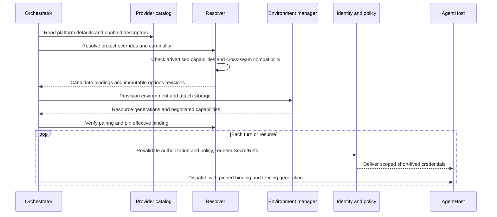
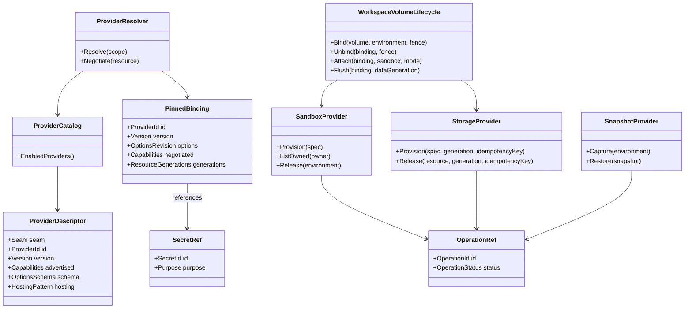
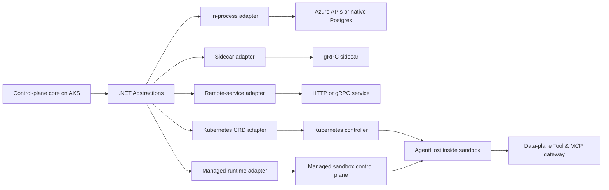
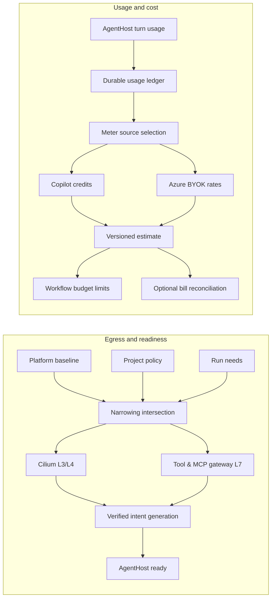

# Provider seams

> Part of [ADR 0001: Agentweaver 1.0 platform architecture](../decisions/0001-platform-architecture.md). **Status:** Proposed.

## Summary

- Agentweaver 1.0 plans 16 provider seams through versioned .NET contracts; the core retains orchestration, authorization, fencing, and enforcement.
- Providers are in-repository adapters. Azure-backed adapters are the defaults, and optional providers must meet the same contracts and isolation requirements.
- Selection is not uniformly one-provider-per-run: seams are exclusive, ordered, platform-singleton, layered, keyed by meter source, or per application.
- A run pins provider identity, options revision, compatible resources, and negotiated capabilities. It never pins a credential or an authorization decision.
- A sandbox executes AgentHost; Storage holds the agent's workspace, while Object Store holds platform artifacts. Snapshots are optional and never substitute for a consistent run manifest.
- Network egress is generated from narrowing intent; cost accounting uses a durable usage ledger rather than telemetry counters.
- Canvas is a P2 rendering seam beside Application Hosting. The current source catalog still names 15 seams; Canvas is not implemented.

## Today in 0.x

Paths refer to the 0.x code on the `dev` branch.

The 0.x API binds most operations to particular backends: Kubernetes sandbox resources, an Azure Files
shared persistent volume, Postgres memory, AGT policy, and GitHub. `SandboxExecutorFactory` selects local or
Kubernetes executors; the local paths do not carry into the cloud-only 1.0 platform. The AgentHost pod has
two regular containers and runs under `kata-vm-isolation` (`k8s/base/sandbox-template-agenthost.yaml`).

Runs, run events, and MAF checkpoints provide partial session state. `CopilotAIAgent` serializes the Copilot
SDK session into a checkpoint, whereas `AddressedMessageService` already persists addressed messages.
Deleting a fenced sandbox claim suspends placement but does not capture a VM snapshot. The common workspace
PVC is mounted by the API, worker, and AgentHost (`k8s/base/pvc-workspace.yaml`); it is not a per-run
isolation boundary.

Kubernetes and Cilium policies are static at deployment, not derived from project egress intent
(`k8s/base/networkpolicy-sandbox.yaml`, `k8s/base/cilium-network-policy-sandbox.yaml`). Usage is emitted as
`agentweaver.token.usage` to Azure Monitor. An earlier `token_usage_records` table lost its writer; **0.x
has no durable usage table today**. There is no spend-budget enforcement
(`packages/Agentweaver.AgentRuntime/CopilotAIAgent.cs`,
`apps/Agentweaver.Api/Metrics/AppInsightsMetricsService.cs`).

Azure Key Vault is the production secret store, reached through workload identity. The database keeps
credential references rather than BYOK and GitHub credentials. GitHub-specific interfaces exist, but no
general source-control contract exists. OpenTelemetry and Azure Monitor export telemetry; run events are
domain state, not an OpenTelemetry substitute.

## Provider model

### Boundaries and layering

The dependency direction is **clients → core services → `Agentweaver.Abstractions` → adapters → external
systems**. The web, API, and first-party MCP client reach the core; they do not pick a provider by talking
to its SDK. Core services own the session tree, MAF workflows, gates, run journal, tenancy checks, and
application publish decisions. They depend on provider-neutral interfaces and records in
`Agentweaver.Abstractions`.

Each implementation lives in an in-repository `Agentweaver.Providers.<Seam>.<Implementation>` package and
registers with .NET dependency injection (DI). **DI contracts are canonical**, even when an adapter talks to
a sidecar over gRPC, an external service over HTTP, or Kubernetes custom resources. Public contracts do not
expose provider SDK objects or version-sensitive MAF types. For example, `EnvironmentId`, `Placement`,
`EndpointDescriptor`, and `SnapshotRef` are Agentweaver terms; the adapter maps its own resource names.

A concept becomes part of a shared contract only when two implementations need it, including the default.
Otherwise it remains a versioned adapter option. Provider-specific resource names, router headers, and
placement mechanics belong in mappings, not the core. The GitHub Copilot SDK is the sole AgentHost model
harness; changing the sandbox does not change that harness.

### Selection and cardinality

Projects choose only from providers enabled in the platform catalog. Where an override is allowed,
resolution applies **platform default → project override**; platform policy can narrow the result. A run
cannot substitute another provider mid-flight because an endpoint is slow or unavailable.

| Cardinality | Seams | Resolution and binding |
| --- | --- | --- |
| Exclusive | Sessions, Sandbox, Storage, Memory, Source Control; Snapshots paired to Sandbox | One effective provider per applicable scope; pin its identity and options at run start. Snapshots may be `None`. For Sessions, one authoritative provider is pinned per run; a capture-only mirror may also observe journal entries but has no authority. |
| Ordered composite | Guardrails, Telemetry | Platform-enabled ordered set; a project may add, remove, or reorder only permitted entries. Pin the ordered set per run. |
| Platform-singleton | Policy, Secrets, Messaging, Object Store | One deployment-wide provider, fixed at service startup; projects cannot replace it. Project policy rules may only narrow. |
| Layered | Network Policy | One platform provider per enforcement layer: required L3/L4 and optional L7. Projects narrow egress intent, never select a provider. Pin the applied intent generation per run. |
| Keyed by meter source | Cost | The pinned model binding determines the pricing provider; unpriced usage remains recorded. |
| Per application | Application Hosting | Owner chooses a platform-enabled provider; pin it to each deployed revision, not to an agent run. |
| Per canvas | Canvas (P2) | Choose an enabled renderer and pin its adapter, format version, and catalog to the canvas revision. Core retains surface lifecycle and action authorization. |

The model resolver remains a separate existing concern. Its effective Copilot or bring-your-own-key (BYOK)
binding is pinned with the run and selects the Cost provider, but Model is not a new seam. A new run may
resolve new defaults; an existing run keeps its pinned choices.

### Descriptors and capability negotiation

An adapter registers a `ProviderDescriptor`: seam, stable provider ID, adapter version, advertised
capabilities, versioned options schema, and hosting pattern. The `ProviderCatalog` lists the enabled
descriptors and permitted project overrides. A resolver validates the options revision and cross-seam
compatibility before provisioning. A resource can negotiate fewer capabilities than its descriptor
advertises: a particular sandbox may not support snapshots, or a volume may not attach to a selected managed
runtime.

The core pins the **negotiated** resource capabilities after provisioning, including isolation class, image
digest, container/resource shape, storage attachment mode, and relevant resource generations. It rechecks
the capability before capture, restore, suspend, or other destructive operations. Unsupported operations
fail explicitly with `CapabilityUnavailable`; no implicit downgrade to a weaker mode. Descriptors enable
discovery, not an entitlement to bypass policy.

The resolution sequence includes per-turn revalidation; a pinned binding does not make yesterday's
authorization current.

### Contracts and core invariants

Interfaces use opaque IDs and immutable references. An `OperationRef` is a durable handle for an
asynchronous action, with `pending`, `ready`, or `failed` status that survives service restarts. Cancelling
a wait does not silently cancel the underlying action. Commands take idempotency keys and ownership/fencing
generations; callbacks and late completions must not resurrect a superseded run. Resource references never
contain filesystem paths, credentials, or provider authorization.

The contract relationships separate registration, selection, execution, and credentials.

All execution paths traverse core-owned enforcement gates: model invocation, tool registration and
invocation, MCP traffic, sandbox execution, secret redemption, and control-plane mutation. AGT decides
policy; Guardrails classify content and feed findings into that decision. Decorators around adapter calls
add telemetry and audit but are **not** a security boundary. Authorization and policy are revalidated at
every turn and resume; credentials are redeemed anew. Enforcement fails closed, even if an adapter or
gateway reports a permissive capability.

### Credentials and adapter hosting

A binding stores a `SecretRef`, never a token. The Identity service alone redeems or mints purpose-bound,
run-bound, short-lived credentials. It sends only the necessary scoped credential over authenticated
AgentHost configure/refresh channels, or injects one at the L7 gateway. Resume refreshes credentials that
may have survived in guest memory. A provider receives credentials only for its operation; neither project
options nor snapshot metadata carry their values.

Adapters have five deployment patterns. The contract and enforcement boundary remain the same even when the
implementation is outside the service process.

In-process libraries cover native state and Azure clients. A sidecar can host a non-.NET session
implementation. A remote service can host a Python memory adapter or OpenSandbox. Kubernetes controllers
implement agent-sandbox and, if adopted, pod snapshot/restore. Managed sandbox runtimes offer placement and
optional volume capabilities. AgentHost is **inside** the execution environment, not the Sandbox adapter;
its authenticated A2A endpoint and configure/refresh protocol survive placement changes. Control-plane
services run as AKS deployments; data-plane helpers may live in or beside a sandbox.

### Conformance and contract evolution

`Agentweaver.Abstractions.Testing` supplies per-seam contract suites and in-memory fakes. Every adapter must
pass the applicable suite, including fencing, idempotent retry, failed operations, capability
unavailability, owner scoping, credential non-disclosure, and recovery after restart. Each seam suite also
runs against at least two implementations or fakes to catch vocabulary biased toward one adapter. Cross-seam
tests exercise Snapshot/Sandbox pairing and Storage/Sandbox attach compatibility.

`Agentweaver.Abstractions` follows semantic versioning; experimental seams are marked `[Experimental]`.
Options schemas, adapter versions, and negotiated capabilities are recorded with bindings. A contract
upgrade cannot reinterpret a pinned option or reference silently. Service API and event compatibility is
tested separately as described in [Services and release](services-and-release.md).

## Seam catalog

The defaults below describe the cutover path. A later provider is an extension point, not a dependency for
cutover. The owner names the service responsible for the adapter lifecycle; core enforcement can involve
other services.

| Seam | Purpose | Owning service | Azure/default adapter in 1.0 | Later adapters | Cardinality |
| --- | --- | --- | --- | --- | --- |
| Sessions | Journal, playback, and optional capture | Events & Sessions | Native Postgres journal | agentsessions capture sidecar | Exclusive authority, with optional capture mirror |
| Snapshots | Capture and explicitly restore environments | Environment manager | `None` at cutover; gated AKS Blob-backed pod snapshots | OpenSandbox-native; managed-runtime snapshots after Azure support | Exclusive, paired |
| Sandbox | Provision, observe, fence, and release AgentHost environments | Environment manager | agent-sandbox on AKS | OpenSandbox; Agent Substrate after AKS proof; Container Apps Sandboxes (P3 evaluation) | Exclusive |
| Storage | Durable agent workspace volumes and bindings | Environment manager | Azure Files CSI | Elastic SAN deferred outside P2; future agent filesystem providers | Exclusive |
| Memory | Authoritative knowledge records and retrieval | Knowledge | Native Postgres | Cosmos and Redis providers (P2) | Exclusive |
| Policy | Decide permitted actions through AGT | Orchestrator | AGT .NET kernel, YAML rules | —; other rule languages configure AGT, not another adapter | Platform-singleton |
| Guardrails | Classify untrusted model inputs/results/output | Orchestrator | Azure AI Content Safety Prompt Shields for supported checks | Purview DLP; Llama Guard/Prompt Guard; NeMo Guardrails | Ordered composite |
| Network Policy | Materialize and verify egress intent | Environment manager | Cilium L3/L4/FQDN; own Tool & MCP gateway L7 | Plain Kubernetes NetworkPolicy where sufficient; agentgateway L7 | Layered |
| Cost | Price durable usage by meter source | Events & Sessions | Copilot AI-credit pricing; Azure BYOK pricing by P2 | Other source-specific rate cards | Keyed by meter source |
| Application Hosting | Serve durable web preview and published revisions | Environment manager | Built-in AKS web runtime (P2) | No other implementations in the current plan | Per application |
| Canvas | Render interactive content and supply a typed host bridge | Web frontend / Applications | A2UI renderer (P2) | GitHub Canvas compatibility research and reverse engineering (P2) | Per canvas |
| Secrets | Resolve credential references for trusted callers | Identity | Azure Key Vault with workload identity | None required for cutover | Platform-singleton |
| Source Control | Repository access, changes, PRs, and merge | Source Control & Merge | GitHub | Other Git repository and review systems | Exclusive |
| Telemetry | Export traces, metrics, and logs | Cross-service; Events & Sessions integration | OpenTelemetry to Azure Monitor | Other OTLP exporters | Ordered composite |
| Messaging | Carry durable cross-service events | Events & Sessions delivery; service-owned outboxes | Postgres transactional outbox and relay | Azure Service Bus transport | Platform-singleton |
| Object Store | Hold opaque platform blobs and artifacts | Events & Sessions integration; platform-wide | Azure Blob | — | Platform-singleton |

## Reviewed, not seams

These concerns have an existing resolver, an open protocol, one intentional backend, or an internal owner.
Adding a provider interface would duplicate a boundary without a second viable implementation.

| Candidate | Why it is not a provider seam |
| --- | --- |
| Model | The effective resolver already selects Copilot-hosted or project BYOK models (platform → project). Pin its output with the run; pricing belongs to Cost. User-level BYOK is out of scope ([R5](../decisions/0001-platform-architecture.md#risk-register)). |
| Context | Azure context caching is a deployment setting, not a client backend. Append prompt material from stable to volatile: base charter → skills → project memory → run context; record cached-input-token usage. The Copilot SDK controls the prefix, tool list, and compaction. |
| Tools | Custom tools are a small SDK registration set; external tools already use MCP. Permission metadata belongs on tools, not a new provider. MCP annotations are untrusted unless the server is trusted. |
| Skills | `SKILL.md` is an open format. Catalog, imports, uploads, and generation are configuration, not competing skill backends. |
| MCP Servers | MCP itself is the adapter protocol. The catalog accepts a configured MCP Registry API URL; enablement, OAuth, record-before-transmit, and gateway enforcement remain core-owned. |
| Image Registry | OCI Distribution is the protocol. An approved registry URL and credential reference are configuration; publication is a control-plane operation, not agent access. |
| State Store | Azure Database for PostgreSQL is fixed. Relational transactions, fencing, and the outbox are required; tests can use disposable Postgres containers. Large bytes go to Object Store. |
| Surfaces | Core owns surface identity, lifecycle, and action authority. Canvas is the separate renderer seam; MCP Apps remains an open protocol, not another seam. |

## Sessions

**Owner:** Events & Sessions. **Cardinality:** exclusive authority, with an optional capture-only
mirror that observes journal entries but has no authority. The native Postgres adapter appends the
authoritative run journal and supplies ordered playback. Clients, audit, usage attribution, and context
rebuilding consume this journal. An optional agentsessions sidecar may mirror entries, verify a hash chain,
and play them back. It does not mediate model calls or claim deterministic re-execution; it ships only if it
adds value over the native journal ([R1](../decisions/0001-platform-architecture.md#risk-register)).

The initial native host candidate resolves and negotiates the PostgreSQL Sessions provider
through the shared provider catalog, then persists the exact pin for the project/run when
its first session is created. Later journal operations verify that same provider,
options revision, resource generation, and capabilities instead of resolving a replacement.
This source slice is not a deployed service; see the [journal reference](../../architecture/events-sessions.md).

The Copilot SDK session snapshot is a **disposable conversation cache**, stored as an opaque blob in Object
Store at turn boundaries. The MAF workflow checkpoint tracks steps, children, and gates and references that
cache. If a cache is missing or incompatible with the harness version or pinned model binding, AgentHost
rebuilds context from the journal. The run does not depend on serializing a provider's private session
format. Playback is exact recorded history; a fork or re-execution may produce different results. See
[Sessions and coordination](sessions-and-coordination.md) for journal and manifest ownership.

## Snapshots

### Contract, pairing, and explicit restore

**Owner:** Environment manager. **Cardinality:** one optional Snapshot provider paired with the exclusive
Sandbox binding. `Capture(environment, scope, reason)` returns an opaque `SnapshotRef` and durable
`OperationRef`; `Restore(snapshot, environmentSpec)` creates a new environment; `Describe` and `Delete`
complete the lifecycle. A descriptor advertises `Full` (memory and guest filesystem) or `Data` scope,
isolation classes, storage backend, retention, and cross-node support. The core negotiates these per
resource and validates the same isolation class, image digest, container set, and resource shape before
restore.

The 1.0 cutover default is **no VM snapshot provider**. Suspend still fences turns, persists the Copilot
cache and MAF checkpoint, flushes the journal and workspace, and releases placement. Resume creates a new
environment from those durable records. `Capture` or `Restore` without the required capability returns
`CapabilityUnavailable`, rather than pretending that deleting a pod captured memory.

An AKS pod snapshot/restore capability with an Azure Blob store is the prospective default **after** its
adoption gate. Its CRD-hosted adapter creates a manual capture request and waits for a Ready condition. To
restore, it puts an **explicit** snapshot reference on the new sandbox template. Implicit "latest matching
template" restore is disabled: a matching template may belong to another run. OpenSandbox-native snapshots
can use the same contract if they meet the Azure durability and isolation requirements.

### Consistency and adoption gate

Snapshots preserve guest state, not the workspace PVC. The Orchestrator's consistency manifest records the
session cache, MAF checkpoint, journal position, storage generation or checkpoint/tree hash, snapshot
reference, network-intent generation, lifecycle state, and fencing generation separately. Resume verifies
each entry and re-applies network intent before dispatch. The protocol and its ordering are defined in
[Sessions and coordination](sessions-and-coordination.md). There is no atomic environment-plus-volume
snapshot ([R4](../decisions/0001-platform-architecture.md#risk-register)).

Adoption requires public preview, an Azure Blob end-to-end capture/restore, restore through warm-pool
sandbox claims rather than only direct pods, and capture/restore within the AgentHost startup budget. The
AgentHost moves to the Kata v2 RuntimeClass only after that gate: the capability depends on the supported VM
runtime and identical restore resources. The current two regular containers are compatible; init,
native-sidecar, and ephemeral containers must be excluded. After a restored guest receives a new address,
the authenticated A2A client reconnects, configure is idempotent, and Identity refreshes guest credentials.
None of this is a cutover prerequisite ([R3](../decisions/0001-platform-architecture.md#risk-register)).

## Sandbox

### Environment-owned Sandbox lifecycle

**Owner:** Environment manager. **Cardinality:** exclusive. The current v1 source candidate adds
`Provision`, `Describe`, `ListOwned(owner)`, and `Release` provider operations and Environment routes for
provision, inspect, explicit abandon, and reconciliation. Each Environment has a stable owner tuple and
lifecycle fence; each Sandbox lease persists its immutable selected provider/options, operation ID, resource
generation, provider fence, current retirement fence, and resource binding. Admission allows one current
Sandbox lease per Environment before provider dispatch. Provider IDs, resource references, endpoints, and
placements remain distinct; the public endpoint and placement values are opaque references.

The default `agent-sandbox` adapter writes a `SandboxTemplate`, zero-replica `SandboxWarmPool`, and
`SandboxClaim` in Kubernetes. The claim uses the admitted v1beta1 `warmPoolRef` schema and
`DeleteForeground` policy. The adapter validates the exact claim/template/pool owner labels, resource UIDs,
RuntimeClass handler, PVC UID and owner-generation annotations, and actual Pod owner, mount, and egress
selector. The immutable run selection must contain exactly one matching Sandbox candidate; provider ID,
adapter version, schema, options revision, and capabilities must match the configured adapter. Missing or
mismatched selection is denied without fallback.

This source slice does not yet implement suspend/resume, provider lifecycle events, authenticated AgentHost
configuration, A2A connectivity, an endpoint URI, or a Core run provider pin. It does not start or dispatch
a model run. Those remain wider platform contract work. No provider may weaken VM isolation when the
selection requires it.

The current lease source stores the full Environment owner tuple, lifecycle generation,
resource generation, provider/current fencing generations, lease revision, and expiry.
Its placement getter retains the lease lock during the final authorization callback.
The resource ID can be a planned claim identity; it is not relabeled as a physical
Kubernetes UID. Registered runtime profiles match the complete provider reference.
The profile callback returns the existing Orchestrator owner context under that lock.
This lookup does not reserve authority after the HTTP response.

### Readiness, retirement, and retention

`ReadyForDispatch` requires an active exact Environment fence, current `WriteProjects` and separate
`ReadRunSelection` authority, the exact owner-bound Workspace PVC generation, observed VM RuntimeClass
and Pod isolation, the exact attached PVC, and a fresh readback of the requested verified Cilium policy
generation before and after provider observation. Environment reserves the exact Workspace generation as
attached before provider dispatch and detaches it only after exact Sandbox placement retirement; Workspace
replace and release therefore cannot race a live mount. Kubernetes Sandbox and container Ready conditions
do not imply Environment or AgentHost readiness. The adapter reports observed `scheduled`, `image ready`,
and `started` phases; it does not report `configured` or dispatch `ready` because this slice has no AgentHost
configure/ready handshake. Policy-object verification is not datapath proof.

An exact `Finished=True` Agent Sandbox condition with a supported reason and current observed generation can
retire Sandbox placement only. An explicit abandon also requires fresh Projects authority and a durable
owner CAS that fences the provider generation. A timeout, scheduling/image failure, stale credential,
provider lookup error, or missing status is not proof of abandonment. No background orphan reaper or Core
terminal/superseded run-status API is included; automatic run-status reclamation remains unavailable until
its owning contract exists.

Release uses the original provider binding, exact current lease/resource/fences, and UID-preconditioned
foreground deletion, then verifies the claim and its Sandbox/Pod children are absent before removing its
owner-specific pool and template. `KnownOwnedAbsent` means a successful exact lookup found no claim or
children; transient or unauthorized lookup failures remain errors. Sandbox placement cleanup never releases
or erases Workspace Storage. Storage reclaim/retention remains controlled by its own owner lifecycle.

A differing valid provider result that arrives after terminal release is recorded in a separate,
owner-scoped cleanup queue. The terminal lease's resource and partial-release evidence are preserved.
Current-owner reconciliation claims at most one queued resource, uses the original lease fence and provider
binding for release, and stores the validated receipt under a current-fence CAS. Expiring claim tokens avoid
concurrent deletion and allow retry after a reconciler stops.

The complete current behavior, configuration, API boundaries, and test limits are in the
[Environment Sandbox lifecycle guide](../environment-sandbox.md) and
[Sandbox testing guide](../../guide/environment-sandbox-testing.md).

### Managed-runtime contract check

Agent Substrate is a **neutrality test target**, not a required 1.0 backend. Its adapter must pass the
Sandbox conformance suite and an AKS proof with VM-level isolation before enablement. Its current snapshot
store lacks Azure Blob: its snapshot capability stays disabled while durable snapshot data would require GCS
or S3, with no compatibility gateway in between
([R8](../decisions/0001-platform-architecture.md#risk-register)). The adapter is a future implementation;
core does not acquire its vocabulary.

| Agent Substrate adapter term | Neutral contract meaning | Adapter responsibility |
| --- | --- | --- |
| `ateapi.Control` | Sandbox operations | Call gRPC through a generated C# client. |
| `actor` | Logical environment | Keep ID stable across placement changes. |
| `worker pool` | Placement configuration | Expose negotiated capacity, not an Agentweaver resource type. |
| `router header` | Endpoint routing metadata | Keep it opaque to the core. |
| `Pause` / `Suspend` | Negotiated suspend mode | Emit provider-initiated lifecycle events. |
| `tags` | Opaque `SnapshotRef` mapping | Never infer a "latest" snapshot for another run. |

This implementation can poll `Get`/`List` to synthesize lifecycle events if it has no watch stream. Its
present per-environment volumes do not satisfy shared RWX or existing-PVC attach; the Storage resolver must
reject those pairings. AKS availability of required certificate APIs and nested virtualization remains an
adoption test, not an assumption.

Container Apps Sandboxes is another P3 evaluation under the existing Sandbox contract,
not an Application Hosting implementation. Before enablement, its adapter must prove
the selected isolation, authenticated AgentHost configure/refresh and A2A channels,
compatible workspace attachment, egress enforcement, leases, fencing, and release.
Unsupported capabilities fail explicitly. This plan does not claim that the service
already meets those requirements or authorize provisioning it.

## Storage

### Workspace volumes and ownership

**Owner:** Environment manager. **Cardinality:** exclusive. Storage exposes volume-shaped **agent
workspace** semantics, not an Object Store for platform records. A `WorkspaceVolume` declares name, owner
(run, agent, or team within one project), binding mode (`environment` or `shared`), access (`RWO`, `RWX`,
`ROX`), provider class, capacity, advertised consistency mode, reclaim policy (`Delete`/`Retain`), and
owner-deletion policy (`Delete`/`Retain`/`Unbind`). Status includes phase (`Requested`, `Provisioning`, `Ready`,
`Bound`, `Attached`, `Releasing`, `Released`, or `Failed`), conditions, transition revision, resource generation,
data generation, and pinned protocol/driver version for placement.

Environment persists each immutable volume specification and its current status in its owner schema. Typed
volume operations compare `TransitionRevision` under the full `EnvironmentGenerationFence`; external effects
are reserved, then completed with exact resource verification or marked for owner reconciliation. The
provider is an adapter, not the lifecycle authority.

`environment` creates one backing volume per environment and fences its single writer in Agentweaver, not
merely through a CSI access flag. `shared` binds a selected group with multi-writer semantics. Its selector
authorization denies undeclared agents and environments by default; sharing never crosses projects.
`VolumeBinding` records the environment, mount path, read-only flag, and opaque publish context for the
Sandbox adapter. Ownership and lifecycle follow the volume owner, not a pod or node, so data survives
suspension and relocation.

`Provision`, `Bind`/`Unbind`, `Attach(sandbox, mode)`, `Flush`, and `Release` take generations and
idempotency keys. Attach may mount a volume or materialize files when the sandbox permits it. `Flush`
returns the workspace generation for the consistency manifest. Bind compatibility is checked against the
Sandbox capabilities and pinned protocol/driver version; an unsupported attach fails before dispatch.
Environment persists the exact Storage provider reference beside separate transition, resource, and data
generations. Provision and replacement advance the resource generation only after verifying the returned
provider reference; bind, attach, flush, and their inverse operations must continue using that same reference.
Only a verified durable flush advances the data generation. Release clears the active provider reference but
retains the last resource generation in its tombstone.
`TransitionRevision` is the owner-side CAS revision and advances for each completed lifecycle transition.
`ResourceGeneration` identifies the exact provider resource; `Create` keeps it at 0 with no resource, while
`Provision` from 0 or `Replace` from an existing generation advances it exactly once after owner-verified
success. Bind/Unbind/Attach/Detach/Flush/Release preserve the pinned resource generation, including a
released tombstone. `DataGeneration` starts at 0 and advances only after an owner-verified durable flush.
Operations carry the full Environment owner fence and an idempotency key. After a provider effect succeeds,
Environment completes the owner transition with a non-cancelable commit; cancellation during an uncertain
provider call is recorded for reconciliation.

The Azure Files CSI adapter implements only the Storage provider's generation-scoped provision/release
boundary. It derives a stable PVC name from project, Environment identity (for Environment-bound volumes),
volume ID, and generation, and validates the matching owner annotations and requested capacity/access mode.
Each generation pins a non-secret identity for the Kubernetes API target so a later service configuration
cannot release resources through a different cluster endpoint. It verifies the bound PV's claim UID and
uses UID preconditions when changing reclaim policy or deleting a claim. Its StorageClass must use the
approved `uid=1000`, `gid=1000`, file/dir modes, `mfsymlinks`, strict cache, and `actimeo=30` options.
The requested StorageClass must match the provider's configured class or provisioning fails before
Kubernetes calls. The PV uses `Delete` only when an environment-bound volume requests `Delete` for both its
reclaim and owner-deletion policies; all other combinations use `Retain`.
Environment pins the adapter version, options schema and revision, non-secret options snapshot, cluster
target identity, and exact claim/PV release descriptor with each provisioned generation. Release receipts bind the exact provider
resource and idempotency key. `Retained` requires a read-back of the exact PV's `Retain` policy. `Released`
requires either a UID-preconditioned claim delete followed by reads confirming both claim absence and
absence of the exact saved PV, or a retry that confirms those same identities are already absent. A missing
claim alone is not proof of release. The receipt confirms Kubernetes control-plane removal; it does not
promise Azure Files data erasure or completion of asynchronous CSI backend cleanup. Environment validates
the receipt before recording owner-side release completion. `AlreadyAbsent` is not accepted as a release
receipt for either reclaim policy. An uncertain Release can be retried by replaying the same idempotency key;
the provider rechecks the pinned claim/PV identities before the owner records completion.
The owner rejects Release while the volume is Bound or Attached; callers must first Unbind and Detach it.
Provider rejections known to occur before a Kubernetes mutation fail that operation without requiring
reconciliation, while ambiguous failures remain recorded for reconciliation. Deterministic volume and
StorageClass preflight rejections return their specific code with HTTP 422; replaying a failed transition
does not return success, and an unresolved or cleanup-pending transition returns HTTP 202.

A Replace cleanup work item is inserted atomically with the owner CAS that pins the verified target. It
preserves the exact old resource reference and generation, original provider binding/options snapshot and
release descriptor from completed owner history, both reclaim and owner-deletion policies, source-operation
proof, and stable idempotency key. The old reference is kept only in that durable cleanup work; it is not
available through the current volume snapshot for rebinding. The Environment owner claims pending work under
the current lifecycle fence and expected lease revision, with a database-time expiry and unique lease ID.
Before cleanup, the owner prevents deleting the current generation; `shared` plus `Delete` stays blocked
because there is no authoritative cross-owner reference registry. The worker uses the original pinned
binding, rechecks current authorization around the provider call, and can complete only with the matching
unexpired lease and exact `Released` receipt. `Retained` records preservation and leaves cleanup blocked;
an `AlreadyAbsent` disposition cannot close work. Failures and expired leases remain durably retryable, and
Environment release is blocked while any cleanup is incomplete. The provider receipt cannot attest
owner-side sharing or data erasure.
The adapter does not advertise Sandbox attachment or durable-flush capability: a provisioned PVC is not
proof that a selected Sandbox can attach it or provide the requested flush semantics. The Environment
lifecycle must negotiate those capabilities and the actual resources before dispatch or immutable pinning.

[Full-size diagram](../../diagrams/flagship/v1-storage-volume-provisioning.png) ·
[Editable draw.io source](../../diagrams/drawio/generated/flagship/v1-storage-volume-provisioning.drawio)

### Defaults, optional features, and limits

The cutover Azure provider uses Azure Files CSI for RWO or RWX workspaces.
Elastic SAN is deferred outside P2 and is not a cutover requirement. If reconsidered,
its RWO constraint limits it to `environment` volumes, never a substitute for a shared volume
([R15](../decisions/0001-platform-architecture.md#risk-register)). Future Blob-backed agent filesystem
providers can implement the same volume contract after product readiness. A managed sandbox can bind its own
durable volume if it satisfies the selected mode; otherwise the run must choose a compatible Sandbox/Storage
pair.

A mount manifest assembles declared sources, each read-only or read-write: repository checkout, skills,
optional read-only memory projection, shared team folder, and datasets. Knowledge records remain
authoritative; Git remains the source-control authority. Optional negotiated `Branch`,
`Checkpoint`/`Rewind`, `Search`, `AuditSink`, and `Clone` capabilities support parallel agents and non-Git
state without becoming prerequisites. Provider MCP tools for those operations still pass tool permission and
AGT gates. Their audit logs supplement Telemetry, not the run journal.

No contract promises atomic environment-plus-volume snapshots, application-level locking, or raw block
devices. Short-lived folder-scoped grants are issued by Identity, never put in a volume binding. The neutral
contract absorbs changes to future volume APIs
([R2](../decisions/0001-platform-architecture.md#risk-register),
[R14](../decisions/0001-platform-architecture.md#risk-register)).

## Memory

**Owner:** Knowledge. **Cardinality:** exclusive. Native Postgres remains the default.
Cosmos and Redis providers join in P2 behind the same Memory contract. Each selected
provider owns its authoritative memory records, decisions, session context, and revisions;
Knowledge keeps the authorization, context composition, and provider-binding boundary.
The Sessions journal and transactional control-plane state remain in PostgreSQL.

The contract reads, writes, searches, and versions records within project and agent
authorization. Every adapter must preserve revision checks, idempotency, proposal
promotion, scope isolation, and durable retention before enablement. Redis is a Memory
provider, not merely a cache in front of PostgreSQL; its persistence and eviction policy
must not discard authoritative records. No run silently switches providers after a failure.
Read-only workspace projections remain views, not another writable store. No particular
preview toolkit or remote Python service is required
([R7](../decisions/0001-platform-architecture.md#risk-register)).

## Policy

**Owner:** Orchestrator, with gates in every calling core service. **Cardinality:** platform-singleton.
The Orchestrator Core source includes the in-process `agt.dotnet-yaml` adapter, which resolves and pins
through the shared provider catalog. AGT's .NET kernel evaluates agent actions against platform rules and
project rules that may only narrow the result. YAML rules are the 1.0 baseline. Other rule languages are
configuration of the same kernel only after verified .NET parity, not an independent Policy provider
([R6](../decisions/0001-platform-architecture.md#risk-register)).

The adapter requires at least one valid platform policy with `default_action: deny`, and accepts only
unambiguous `allow` and `deny` rules. Deny-overrides applies to matching rules within each document, and
every configured document must independently allow. Platform and project document sets are evaluated
separately, and both sets must allow; a project rule can never broaden the platform decision. AGT receives
a fixed service identity while the bounded, authenticated Agentweaver actor is passed as `actor_id`
context. Invalid policy, context, or evaluation returns a typed error; the adapter does not itself grant
action authority or wire protected-effect call sites.

The source-only `ExecutableActionGuard` requires an injected current grant-owner lookup and compares its
validated descriptor against the authenticated HTTPS issuer and subject, project/run/session/step, exact
action catalog ID, purpose, grant reference/revision, expiry, and execution fence. The subject and
project/run claims must come from one authenticated identity and share the same issuer; missing, duplicate,
or cross-issuer bindings deny. Unknown, revoked, expired, stale, mismatched, or unavailable grants fail
closed. The owner lookup remains responsible for current tenant membership and grant authority; a tenant
claim in the bearer token is not required. AGT is an additional narrowing decision; it cannot supply a grant.
Identity and tenancy permissions stay core-owned; admission controls for Kubernetes are infrastructure, not
agent-action policy. Tool permission metadata replaces a literal tool-name classifier, and untrusted MCP
tool annotations alone never grant authority.

Before a protected effect, the guard requires a durable append through the native Sessions journal. The
typed, redacted `PolicyEvaluation` evidence binds the action, actor/tenant/project/run/session/step, purpose,
grant reference/revision, fence, and policy/provider/options identities and versions. It excludes rule
text, tool arguments, credentials, and free-form error details. The generic run-scoped append endpoint
currently rejects every `PolicyEvaluation` payload because actor equality does not establish trusted
Orchestrator Core writer provenance. No trusted grant owner or writer is wired in this source slice, so a
missing dependency or append rejection prevents the callback; this is not a positive protected-effect path
or an authorization grant.

## Guardrails

**Owner:** Orchestrator. **Cardinality:** ordered composite. Classifiers inspect user/model input, tool and
MCP results, and model output at core-owned gates, then send findings to AGT for the final decision. They
are not substitutes for Policy or for gateway enforcement. Descriptors state supported direction and content
classes; a stage requiring an unavailable check fails closed instead of implying that one classifier covers
every stage.

Azure AI Content Safety Prompt Shields is the default for supported prompt-injection checks on user input
and tool results. Later ordered checks can add Microsoft Purview DLP, Llama Guard/Prompt Guard, or NeMo
Guardrails. Projects can select or reorder only platform-enabled checks. The ordered result, versions, and
failures are journaled; classifier transport and credentials remain outside prompt content.

## Network Policy

### Egress intent and contract

**Owner:** Environment manager. **Cardinality:** layered. The core compiles one `EgressIntent` per
environment and run from **platform baseline ∩ project narrowing ∩ run needs**. It groups FQDN patterns,
CIDRs, ports, and protocols by purpose: pinned model endpoint, enabled MCP servers, source control, package
registries, Key Vault and Entra, preview ingress, and control-plane callbacks. Optional L7 rules name MCP
servers/tools, A2A peers, or HTTP methods/paths, plus gateway `SecretRef` credential injection and audit
level.

`Apply(environmentSelector, intent, generation)` returns the applied generation; `Verify` and `Revoke`
reconcile it. Capabilities advertise L3/L4, FQDN, MCP/A2A/model-aware L7, credential injection, rate limits,
token metrics, and audit export. Project administrators may narrow destinations but cannot broaden the
platform baseline. If a provider cannot enforce a required constraint, provisioning fails rather than
substituting a broad HTTPS allow rule.

### Enforcement and readiness

Cilium on AKS is the default L3/L4/FQDN adapter, generating policies per environment rather than applying
one static sandbox allowlist. Plain Kubernetes `NetworkPolicy` can implement a restricted fallback without
FQDN support where a deployment's requirements permit it. Sandbox-native egress allowlists are mapped in
Sandbox adapters, not trusted as tenancy boundaries. No environment becomes ready until policy generation is
confirmed; resume re-applies and verifies it before AgentHost dispatch. The verified generation enters the
consistency manifest.

The unpublished `Agentweaver.Environment` candidate compiles typed purpose-grouped rules from the
platform/project/run intersection, rechecks Projects & Config authorization on each operation, and uses
Kubernetes resource-version and intent-generation fences before pinning the verified L3/L4 binding. Its
readback proves the exact Cilium policy object only, not enforcement in the datapath. It does not yet wire
selector labels into Sandbox claims/templates or include deployed Kubernetes identity/RBAC. See
[Environment egress](../environment-egress.md) for the source and test boundary.

The platform's own **Tool & MCP gateway** fills the default L7 data-plane slot at cutover. It handles
credential injection, permitted routes, rate limits, and audit for MCP, A2A, and model egress; agentgateway
is an optional later implementation. AGT decisions and record-before-transmit for outbound calls remain at
core gates. Cilium alone cannot make all public-address HTTPS egress FQDN-only; the remaining limitation is
explicit rather than treated as an authorization guarantee
([R16](../decisions/0001-platform-architecture.md#risk-register),
[R17](../decisions/0001-platform-architecture.md#risk-register)).

## Cost

### Durable usage and pricing

**Owner:** Events & Sessions for the ledger and Cost adapters; Orchestrator for budgets. **Cardinality:**
keyed by meter source. AgentHost emits per-turn usage with run, session, agent, pinned model binding, meter
source, input/output/cached/reasoning tokens, request count, provider-reported units, and duration. Events &
Sessions persists it in an append-only usage ledger with idempotent ingestion. Telemetry may export a
counter too, but Azure Monitor metrics are **not** the accounting record.

`Price(usage, binding)` returns an estimate with amount, unit (AI credits or currency), versioned rate card,
and `estimate`, `reconciled`, or `unpriced` status. `Quote(plannedWork)` permits pre-flight checks.
`Reconcile(period, scope)` is optional and cannot rewrite the underlying usage. The Copilot adapter prices
reported AI-credit units and model multipliers; each estimate stores its rate-card version, so a rate change
does not silently reprice history ([R18](../decisions/0001-platform-architecture.md#risk-register)).

The current source implements meter-keyed candidate selection through the existing
`ProviderCatalog` and `ProviderResolver.ResolveCost`. The catalog owner supplies
one enabled provider per source; Projects & Config's native run-selection routes
persist the key and checked adapter/options versions, revision and capabilities.
Projects persists candidates, not negotiated resource bindings.
Separate source primitives add `PinCost`/`VerifyCost`, the Copilot Cost adapter,
and an append-only PostgreSQL ledger. They do not establish effective SDK
model/source provenance or authorize a usage producer.

The separate runtime pipeline supplies that authority through a current registration,
validated bearer, purpose-bound observe credential, and actual SDK facts.
Orchestrator commits immutable source receipts after current owner and grant checks.
Events accepts only receipt references and prices them through the existing keyed resolver.
No parallel Cost resolver or model provider seam is introduced.

The Copilot adapter divides reported `nano_aiu` by `1_000_000_000` to return AIC.
Reported units already include model weighting. Quotes apply a model multiplier
only to explicitly unweighted AI credits. Each entry retains an immutable rate-card
version. Missing measurements or unsupported sources remain unpriced.
The optional HTTP consumer accepts only immutable source receipt references.

The Azure BYOK adapter uses deployment token rates from Azure Retail Prices, allocates
provisioned-throughput capacity by usage share, and may reconcile estimates with Azure Cost Management
exports filtered by resource tags. Other meter sources provide their own pricing; unknown sources remain
`unpriced`, not zero-cost. Sandbox compute cost is a later meter source, not part of the 1.0 model-cost
contract.

### Budgets and combined data flow

Orchestrator applies project, run, and agent soft/hard budgets through workflow run limits. A soft limit
notifies; a hard limit stops new dispatch and pauses at the next turn boundary. A hard limit requires a
priced source, or run start is rejected. Enforcement uses estimates; reconciliation corrects reports and
**never retroactively stops a run** ([R19](../decisions/0001-platform-architecture.md#risk-register)).
Dashboards query the ledger instead of reconstructing cost from App Insights. Usage attribution uses the
pinned binding even if the project later changes its model.

The two lanes show how egress readiness and priced usage meet a run's enforcement boundaries without
treating telemetry as state.

## Application Hosting

**Owner:** Environment manager. **Cardinality:** chosen per application, pinned per deployed revision. A
live preview runs in the agent sandbox and has no hosting provider. Durable `preview` and `published` stages
serve an immutable, tested web revision through the built-in AKS runtime. It is the only
Application Hosting implementation in the current plan. Image-backed, owner-managed,
and Container Apps hosting adapters are removed from this plan for now.
A2UI rendering belongs to Canvas, not Application Hosting. Publishing an image uses
a control-plane registry credential, never one given to the agent.

The complete application lifecycle, viewer authorization at the Gateway/Identity edge, deployment
operations, and surface panel are specified in [Applications and
surfaces](applications-and-surfaces.md#application-hosting). Application Hosting runs the **agent's output**
beyond its run; Sandbox runs **the agent**. Agentweaver keeps its own UI.

## Canvas

**Owner:** Web frontend / Applications. **Cardinality:** selected per canvas and pinned
per canvas revision. This P2 seam is separate from Application Hosting: it renders
interactive content within Agentweaver's surface panel rather than operating an
application server or an agent sandbox.

The planned adapters are A2UI and a GitHub Canvas-compatible adapter. P2 includes
research and reverse engineering of the GitHub Canvas protocol behind this boundary.
Compatibility is not claimed until the adapter has evidence. Both adapters use
versioned content and action schemas, negotiated rendering capabilities, and a pinned
renderer version. A2UI also pins its component catalog.

Core owns surface instances, viewer authorization, workflow gates, and typed
`surface_*` actions. A renderer cannot authorize work or mint credentials.
The [Canvas design](applications-and-surfaces.md#canvas-provider) defines the host
bridge and the relationship to applications, A2UI, and MCP Apps.
The current source enum and resolver do not yet implement this sixteenth seam.

## Secrets

**Owner:** Identity. **Cardinality:** platform-singleton. Azure Key Vault via AKS workload identity is the
1.0 backend. Core and adapters exchange `SecretRef`s and purpose-bound credential requests, not secret
values in provider descriptors, run bindings, Postgres state, workspace files, or snapshot manifests. The
trusted control plane redeems references and refreshes short-lived run credentials over authenticated
channels. The L7 gateway can inject scoped outbound credentials without exposing them inside the sandbox.
Kubernetes Secrets are not the credential store. This generalizes 0.x Key Vault-backed BYOK and GitHub
references (`apps/Agentweaver.Api/Auth/UserModelProviderSettingsService.cs`,
`apps/Agentweaver.Api/Auth/GitHubConnectionsCredentialVault.cs`).

The current `Agentweaver.Abstractions` contract supplies `SecretRef` (opaque ID
and explicit version), `SecretRedemptionRequest` (purpose and run ID),
`ISecretRedemption` (trusted Identity/control-plane implementation with cancellation),
and `SecretCredential` (explicit value access, expiry and invalidation). Identifiers
are nonempty, at most 256 ASCII characters, and limited to letters, digits, `.`,
`_`, `-`, `:`. The value is not a public property and is absent from default JSON,
`ToString()` and contract validation exceptions. Callers must not serialize the
string returned by `GetValue`; invalidation drops this object's reference but
cannot erase copies of an immutable .NET string. Authenticated delivery, purpose
policy, secure storage and refresh belong to future trusted service implementations;
neither these data contracts nor a provider adapter grant access on their own.

`Agentweaver.Identity` is an **implemented CANDIDATE** authorization wrapper around
`ISecretRedemption`. The host supplies an authenticated actor/project/run context;
the authority supplies an immutable active, unexpired grant for the exact
actor/project/run/purpose and `SecretRef` ID and version. Missing, ambiguous,
revoked, expired or mismatched grants deny before backend access. The wrapper
re-reads the authority after asynchronous acquisition, invalidates acquired
credentials on every post-acquisition failure, and compares the original grant
ID, revision and expiry as well as its bindings. It limits expiry metadata on
the original credential through `SecretCredential.LimitLifetime`, without
reading or copying a value; backend invalidation remains effective. It does not
implement a grant store, network authentication, or a deployed Identity service.

`Agentweaver.Secrets.AzureKeyVault` implements redemption for the trusted control
plane with the Azure Key Vault SDK. The configured vault URI is validated; callers
inject a workload-identity-capable `TokenCredential` or an already configured
`SecretClient`, or explicitly compose Azure Identity's
`WorkloadIdentityCredential` from a tenant, client, and projected token-file path
inside the adapter library. The adapter fetches the exact referenced version and
returns a credential that expires within five minutes (sooner if the vault secret
expires). Azure Identity manages token caching and projected-file refresh; the
adapter has no file watcher or immediate-rotation guarantee. SDK transport tests
cover both OAuth exchange and Key Vault requests without contacting Azure. This
does not implement Identity authorization or prove an AKS deployment.

## Source Control

**Owner:** Source Control & Merge. **Cardinality:** exclusive. The GitHub adapter owns repository identity
and access, short-lived checkout credentials, issue/PR interaction, webhooks, review state, and merge
integration. The core keeps worktree isolation, merge locking, authorization, and workflow gates independent
of a forge. An additional repository/review-system adapter must implement those capabilities or declare them
unavailable; it cannot fabricate a PR.

0.x has **only narrow GitHub-specific interfaces**, such as `IGitHubPullRequestClient` and token-provider
contracts, alongside `GitHubCapabilityBroker` and `WorktreeManager`. It does not have a general
source-control abstraction (`packages/Agentweaver.Domain`,
`apps/Agentweaver.Api/Sandbox/RunRepositoryCredentialRegistry.cs`). The new seam is a contract redesign, not
a claim that another forge already works.

The unpublished v1 candidate implements the neutral contracts in `Agentweaver.Abstractions` and the
`Agentweaver.SourceControl` package. Its GitHub adapter negotiates the configured physical repository,
supports issue and pull-request operations, reads review and exact-commit merge-check evidence, and sends
merge requests with the expected head SHA. Effective branch rules and required checks fail closed when
unknown or unsupported. The expected base SHA is a fresh preflight under the retained PostgreSQL
repository lock; GitHub's merge request does not provide an atomic expected-base comparison.
Required checks combine repository rulesets and classic branch protection. Check-run responses are parsed
from GitHub's wrapper and item schemas, and only evidence for the exact pinned head SHA is accepted.
Issue-write capability is negotiated only when GitHub reports that issues are enabled for the repository.
Open pull-request list entries may omit the `merged` field; reuse still requires one exact repository,
head branch, and base match. Repository owner and name comparisons are case-insensitive, while the provider
repository ID remains exact.
Authority or grant revocation before the merge request becomes a persisted conflict with
no merge write, including a failed recheck after `merge_started`. Once the provider
accepts the merge, Orchestrator retains the true merged state and SHA even if authority
changes afterward or the request caller disconnects; bounded owner-controlled settlement persists the
merge result independently of request cancellation, and replay from another host reads the persisted
result without issuing another merge request.

If an approved intent's fence becomes stale while execution waits for the repository lock,
the execution path rechecks current Projects authority, Core decision state, and the exact
grant through the current-grant lookup. A scoped owner-store compare-and-swap records
`source_control_run_binding_changed` only when the accepted selection and revisions are
unchanged, the run and session fences agree at a newer value, the typed approval version is
superseded, and the original grant is superseded and not current. This handling is limited
to merge execution; ordinary intent reads do not expose stale intents, and no merge request
is sent.

Projects stores only a repository identity and versioned API, checkout, and webhook `SecretRef`s. After an
authorized caller requests a run pin, Orchestrator resolves the exact provider from the accepted run
selection, redeems the API reference through Identity.Broker, negotiates the repository, rechecks current
Projects and Core authority, and persists the provider/resource generation and negotiated capabilities
against the accepted selection hash and execution fence. Secret values are operation-scoped and invalidated;
the default Orchestrator audience remains unchanged, while Broker redemption separately requires both
audiences.

The authenticated run-scoped Orchestrator API exposes issue creation, exact-head/base pull-request
create-or-reuse, review reads, workspace preparation/diff, typed merge intents, and the relay endpoint.
Each operation loads the persisted pin, checks the current accepted selection and run fence, redeems the
specific API or checkout `SecretRef` purpose, and rechecks authority around provider calls. Workspace
manifests bind run, repository, resource generation, base SHA, and branch; they contain no credentials.
Short-lived checkout values are invalidated after each operation and redacted from Git diagnostics.
Set `SourceControl:WorkspaceRoot` to an absolute path shared with the trusted run caller to enable
workspace routes. If it is absent, those routes return unavailable rather than using an implicit host
directory. Workspace diffs are bounded; absolute workspace paths are returned only to the authenticated
run-scoped caller and are not persisted in owner records.

The authenticated run-bound webhook relay accepts raw payloads up to 1 MiB plus GitHub delivery, event,
and signature headers. It verifies HMAC over those exact bytes, matches the repository name and provider ID
to the immutable pin, refreshes Projects/Core authority, and records a durable repository-scoped delivery
identity. Identical delivery replays are idempotent; changed payload or foreign binding conflicts. This
route-specific limit does not change the default 64 KiB limit on other routes. The relay records the
delivery only; it does not start a workflow. The public GitHub POST path is denied
because the base has no trusted relay identity; deployment and direct GitHub delivery remain unavailable
until such a relay is separately approved and deployed.

The pin, webhook, and merge owner flow is summarized below. It describes the unpublished source candidate,
not a deployed service or public webhook endpoint.

  

<a href="../../diagrams/flagship/v1-source-control-owner-flow.png">Open full-size PNG</a> · <a href="../../diagrams/drawio/generated/flagship/v1-source-control-owner-flow.drawio">Open editable draw.io source</a>

## Telemetry

**Owner:** each instrumented service; Events & Sessions integrates exporters. **Cardinality:** ordered
composite. OpenTelemetry records traces, metrics, and logs, exporting to Azure Monitor by default and
optionally other OTLP sinks. Trace context propagates through provider routing hops, AgentHost, and the Tool
& MCP gateway. AGT audit and provider storage audit can enrich these signals. The run journal, delivery
state, and usage ledger remain durable domain records even when exporters are down. Telemetry exporters
never decide whether a turn is authorized or accounted for.

The lower-layer [OpenTelemetry foundation](../../../packages/Agentweaver.Telemetry/README.md)
registers native .NET ActivitySource, Meter, and logging providers with a service
resource identity. It has no built-in exporter or network call. The dependent
[Azure Monitor integration](../../../packages/Agentweaver.Telemetry.AzureMonitor/README.md)
composes the three supported signal exporters through the Azure SDK with explicit
configuration and an optional injected credential. OTLP sinks remain caller
composition; transport-specific context propagation remains service integration
work. Neither successful export nor exporter availability changes durable state.

## Messaging

**Owner:** Events & Sessions for message delivery state; each originating service owns its outbox.
**Cardinality:** platform-singleton. Postgres transactions write state and outbox records together; a relay
delivers events at least once, and consumers deduplicate by idempotency key. Per-thread sequence numbers
preserve addressed-message ordering without promising exactly-once transport
([R9](../decisions/0001-platform-architecture.md#risk-register)). Azure Service Bus may later carry
delivery, but the transaction, acknowledgment, and session message semantics stay in core. A transport
acknowledgment means receipt, not approval or completed work.
The Postgres foundation now includes a bounded, caller-invoked `OutboxRelay`:
it publishes through an injected `IOutboxPublisher` before fenced acknowledgment
and reports publish failure or a stale acknowledgment explicitly. This library
primitive does not run a relay service, provision a broker, or guarantee exactly-once
delivery.

## Object Store

**Owner:** platform-wide shared adapter; Events & Sessions owns run artifact references. **Cardinality:**
platform-singleton. Azure Blob holds large opaque platform objects: Copilot session caches, MAF checkpoint
payloads, snapshot manifests/artifacts, run artifacts, and large logs. Postgres retains authoritative
identities, journal positions, references, and retention decisions. The sandbox does not see an Object Store
container as its workspace. Storage is for agent-visible files and mount bindings; Object Store is for
records the agent must not edit. A future agent filesystem implementation may also use Azure Blob
internally, but that does not collapse the two authorization boundaries.
The P0 `IObjectStore` contract uses validated relative opaque keys and caller-owned input
streams; reads return caller-disposable streams and content lengths. Azure Blob implements
atomic create-only writes (`If-None-Match: *`), read, and delete against one injected,
platform-owned container. Missing blobs return null/false; conflicts and service errors
propagate. Postgres still owns references and retention; this library does not schedule
deletion or grant agent access to its container.

Events stores journal entries and artifact references in PostgreSQL; the Object Store
adapter stores the referenced bytes in Blob. A trusted owner writes bytes before
committing a reference and serves authorized reads without granting AgentHost direct
container access. These are separate operations, not one Blob/PostgreSQL transaction.
See [Events and Blob have different jobs](../persistence-objects.md#events-and-blob-have-different-jobs)
for the planned flow and the current missing service composition.

## Not ported (cloud-only)

The 1.0 runtime does not port the 0.x local executor factory or its `MxcSandboxExecutor`,
`WslMxcSandboxExecutor`, `LinuxBwrapExecutor`, `LinuxNativeMxcSandboxExecutor`, and `PassthroughExecutor`
variants. It does not use environment-variable runtime detection. The local filesystem workspace provider,
file checkpoint path, `SqliteDb`, SQL Server/SQLite runtime branches, SQLite-to-Postgres migrator, and
legacy SQLite PVC migration path are also dropped. Their **cloud behaviors** are rebuilt through Azure
volumes and Postgres-backed state, not by retaining dual local/cloud code paths.

## Alternatives considered

| Option | Why not |
| --- | --- |
| Make every seam project-selectable | Policy, Secrets, outbox, and Object Store establish platform trust and consistency boundaries; arbitrary project selection breaks them. |
| Put HTTP/gRPC/CRD shapes in core | Ties domain types to one adapter and makes provider replacement a service rewrite. |
| Treat a pod deletion or SDK session cache as a full snapshot | Neither captures a consistent environment and workspace; explicit manifest validation is required. |
| Use telemetry metrics as the usage ledger | Metrics can aggregate or disappear and cannot support accurate budgets or bill reconciliation. |
| Require a preview provider for cutover | Optional upstream maturity and Azure Blob/isolation gates must not block journal-backed suspend/resume. |
| Copy the local execution and database variants | 1.0 is intentionally cloud-only; their behavior has cloud-native equivalents. |

## Phasing

| Phase | Provider work |
| --- | --- |
| P0 Foundation | DI contracts, catalog/resolvers/pinning, conformance kit, Postgres schemas and outbox, Blob Object Store, Key Vault/workload identity, OpenTelemetry/Azure Monitor. |
| P1 Core and defaults | Native Sessions/Memory, agent-sandbox, Azure Files, Cilium intent, AGT, GitHub, Copilot cost ledger; AgentHost startup phases, retention, reclaim, and run fencing. |
| P2 Parity and cutover | Manifest-based suspend/resume, Guardrails, permission metadata, own Tool & MCP gateway and MCP catalog, Cosmos and Redis Memory providers, Azure BYOK pricing/budgets, built-in AKS Application Hosting, [Canvas and A2UI #1878](https://github.com/sabbour/agentweaver/issues/1878) with planned [GitHub Canvas research #1901](https://github.com/sabbour/agentweaver/issues/1901), context ordering and cache telemetry; exact-SHA AKS persona harnesses and parity-map acceptance. No Elastic SAN or additional hosting adapters. |
| P3 After cutover | Gated AKS snapshot/restore; OpenSandbox, Agent Substrate, and Container Apps Sandboxes evaluation; agentsessions; agent filesystem providers; agentgateway. Elastic SAN has no committed delivery phase. |

No P2 requirement depends on an optional P3 provider. The active 0.x line supplies behavioral parity
evidence until cutover.

## Related risks

- [R1](../decisions/0001-platform-architecture.md#risk-register): the capture-only sessions adapter must justify itself against the native journal.
- [R2](../decisions/0001-platform-architecture.md#risk-register): agent filesystem providers are not ready for the cutover path.
- [R3](../decisions/0001-platform-architecture.md#risk-register): AKS pod snapshots require a public-preview, Azure Blob, warm-pool, and latency gate.
- [R4](../decisions/0001-platform-architecture.md#risk-register): the consistency manifest accounts for volume data outside snapshots.
- [R5](../decisions/0001-platform-architecture.md#risk-register): BYOK resolution stops at platform and project scope.
- [R6](../decisions/0001-platform-architecture.md#risk-register): AGT's .NET YAML kernel is the baseline until other rule languages reach parity.
- [R7](../decisions/0001-platform-architecture.md#risk-register): Cosmos and Redis Memory providers target P2; optional preview libraries are not prerequisites, and agentsessions remains P3.
- [R8](../decisions/0001-platform-architecture.md#risk-register): the managed-runtime adapter needs an AKS VM-isolation proof and Azure snapshot durability.
- [R9](../decisions/0001-platform-architecture.md#risk-register): messaging uses at-least-once delivery, idempotency, and sequence numbers.
- [R14](../decisions/0001-platform-architecture.md#risk-register): neutral volume contracts absorb upstream API changes.
- [R15](../decisions/0001-platform-architecture.md#risk-register): Elastic SAN is deferred outside P2 and cannot substitute for shared workspace volumes.
- [R16](../decisions/0001-platform-architecture.md#risk-register): Cilium's public HTTPS/FQDN limit requires a separate L7 gate.
- [R17](../decisions/0001-platform-architecture.md#risk-register): the own Tool & MCP gateway is the default; agentgateway is optional.
- [R18](../decisions/0001-platform-architecture.md#risk-register): versioned credit rates preserve historical cost interpretations.
- [R19](../decisions/0001-platform-architecture.md#risk-register): budget checks use estimates, while reconciliation changes reports only.
- [R24](../decisions/0001-platform-architecture.md#risk-register): hosting choice, viewer authorization, and external adapters have explicit adoption boundaries.
