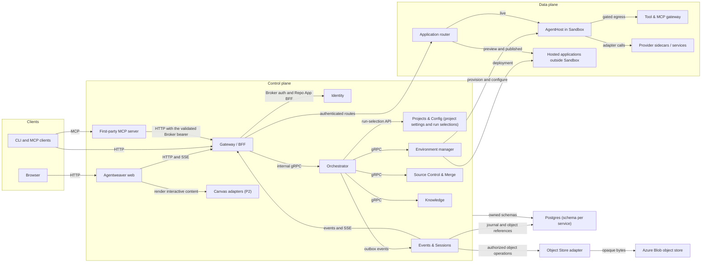
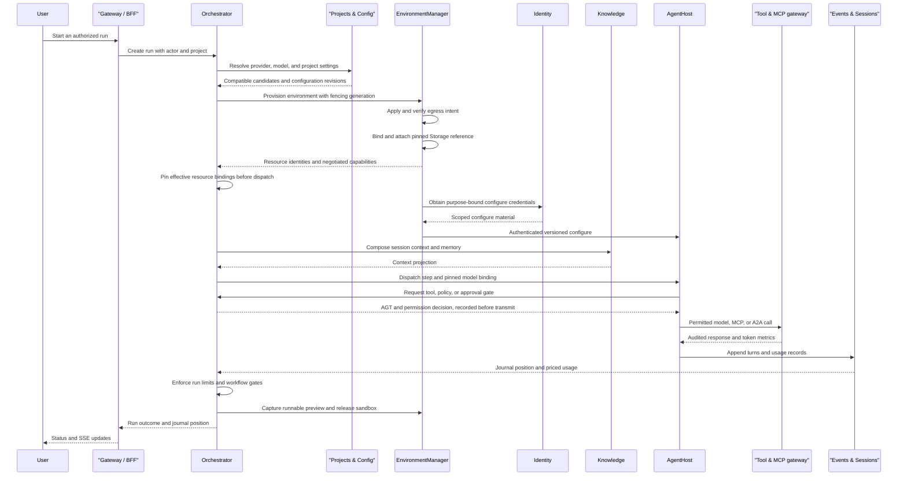

# Services and release

> Part of [ADR 0001: Agentweaver 1.0 platform architecture](../decisions/0001-platform-architecture.md). **Status:** Proposed.

## Summary

- Agentweaver 1.0 separates roughly ten coarse control-plane services from the AgentHost and other
  data-plane components. It ports behavior from 0.x instead of extracting a shared database and
  process into smaller deployments.
- Stateful services own separate Postgres schemas. Internal request/response traffic uses gRPC, edge
  traffic uses HTTP, and durable cross-service changes use an outbox with at-least-once delivery.
- The Orchestrator leads run and environment sagas. Idempotent commands, consumer deduplication, and
  fencing replace shared transactions and process-local coordination.
- An AgentHost environment runs the GitHub Copilot SDK harness inside a sandbox. A separate Tool &
  Model Context Protocol (MCP) gateway handles outbound Layer 7 (L7) controls; the app router serves application stages
  through an authenticated edge.
- The monorepo retains independent service images, charts, and semantic versions. A platform release
  manifest pins one tested combination, with N-1 internal API and event-envelope compatibility.
- 0.x remains active on `dev` while a parity map and exact-SHA AKS persona validation gate the 1.0
  cutover. The 1.0 line is cloud-only and has no migration tooling.

## Today in 0.x

Paths refer to the 0.x code on the `dev` branch. Modules share Entity Framework transactions on one
`MemoryDbContext`, and some modules reach directly into another module's context
(`apps/Agentweaver.Api/Workflows/WorkflowChildWorkService.cs`,
`apps/Agentweaver.Api/Backlog/BacklogPromotionService.cs`,
`apps/Agentweaver.Api/Coordinator/CoordinatorOrchestratorExecutor.cs`). A per-module service split
cannot retain those atomic cross-module writes as-is.

The API, worker, and AgentHost mount one read-write-many workspace PVC
(`k8s/base/api-deployment.yaml`, `k8s/base/worker-deployment.yaml`,
`k8s/base/sandbox-template-agenthost.yaml`). Process-local run options, approval gates, caches, and
credential registries add replica-sensitive state (`apps/Agentweaver.Api/Program.cs`,
`apps/Agentweaver.Api/Sandbox/RunRepositoryCredentialRegistry.cs`). A repository-wide `VERSION` is
consumed by release automation, images, and runtime reporting
(`apps/Agentweaver.Api/Infrastructure/AppVersionProvider.cs`,
`.github/workflows/publish-images.yml`). None of these are suitable cross-service ownership
boundaries.

The 0.x API and AgentHost already emit OpenTelemetry signals to Azure Monitor
(`apps/Agentweaver.Api/Infrastructure/AzureMonitorBootstrap.cs`,
`apps/Agentweaver.AgentHost/AzureMonitorBootstrap.cs`), including AgentHost turn and tool traces
(`packages/Agentweaver.AgentRuntime/CopilotAIAgent.cs`). AgentHost's one-time `/configure` receives
run and user identity, credentials, repository and MCP broker tokens, permissions, and source
metadata; it validates the bindings and holds credentials in memory
(`apps/Agentweaver.AgentHost/Program.cs`, `apps/Agentweaver.AgentHost/AgentHostRuntimeState.cs`).
These are behaviors to preserve behind versioned service contracts, not a design to copy wholesale.

0.x remains an active shipping line. The 1.0 design starts on a separate blank slate, so this
section describes constraints and parity evidence rather than a migration sequence for its database
or pods.

## Service boundaries

The control plane owns durable identity, policy, coordination, decisions, and environment intent.
The Gateway serves as a backend-for-frontend (BFF).
The checked-in `Agentweaver.Gateway` host exposes a finite `/api/v1` REST/SSE surface
and live `/openapi/v1.json` discovery. It validates the Broker issuer/audience and
delegates each route to its configured HTTPS owner, forwarding the bearer token and
optional tenant selector without replacing owner authorization. It preserves owner
statuses and bodies; `202 Accepted` is not downstream completion. Run-event SSE reads
committed Events journal pages and rechecks exact run-bound Projects read authority
before each event write.
The data plane executes agents, enforces outbound traffic, and serves applications. Core service
code depends on the versioned .NET contracts in `Agentweaver.Abstractions`; adapters implement those
contracts and may communicate with managed services, sidecars, or Kubernetes resources. Clients do
not pick a provider by reaching directly into an adapter. See [Provider
seams](provider-seams.md#boundaries-and-layering).
The Orchestrator Core source includes the platform-singleton AGT YAML Policy adapter;
it uses the shared catalog and resolver but remains separate from trusted grant
issuance and the still-distinct protected-effect guard.

This topology separates owned Postgres schemas from data-plane environments. HTTP and server-sent
events (SSE) serve the edge, gRPC handles internal requests, and an outbox carries durable events.

### Control plane

| Component | Owns | Does not own |
| --- | --- | --- |
| Gateway/BFF | HTTP REST and server-sent events (SSE) for web and CLI; authentication entry, finite route dispatch, and authorized projections, including explicit Repo App and Copilot connection BFF routes. | Agent execution, arbitrary upstream proxying, or an application provider's viewer identity decisions. |
| Identity | OpenIddict broker, MCP OAuth, purpose-bound run tokens, `SecretRef` redemption, scoped gateway credential injection, owner-held Repo App and Copilot credentials, stable opaque connection references, OAuth/install callbacks, and run-bound token-mint routes. This is the trust boundary. | Long-lived agent secrets or provider tokens in a run database or image, or provider credentials in browser responses. |
| Projects & Config | Project lifecycle and revisioned configuration, casting/charters, blueprint/workflow references, skill settings, model-selection references, project provider overrides, platform runtime defaults, egress narrowing, validated run limits, and its own tenant memberships, resource-role assignments, and authorization audit. | Identity issuance, provider catalog registrations, repository/workflow materialization, raw credentials, or final provisioned-resource pins. |
| Orchestrator | Runs, Microsoft Agent Framework (MAF) workflows, session tree and coordination verbs, typed coordinator decisions, OutcomeSpec and WorkPlan, approval and question gates, immutable accepted-run Sandbox and Source Control owner bindings, source-specific merge intents and narrow action grants, checkpoints, recovery, consistency manifest, run-limit budget enforcement, and the current session/work-item/turn context and runtime-registration source. | The run journal's storage, Sandbox resource provisioning, direct cross-schema updates, complete runtime delivery, or usage accounting. |
| Environment manager | Sandbox, Snapshots, Storage, Network Policy, and Application Hosting adapters; leases and fencing; egress verification; startup phases; retention, reclaim, application deployments, and control-plane image publication. | Viewer authentication or a workflow's publish decision. |
| Source Control & Merge | Git workspace preparation, diff and assembly, merge locks, pull requests, webhooks, backlog intake, and the Source Control provider seam. | Platform-wide project identity. |
| Knowledge | Memory and session-context records, decisions and proposals, prompt composition, and Memory adapters: native PostgreSQL by default, with Cosmos and Redis in P2. | Repository files as an authoritative memory database or the Sessions journal. |
| Events & Sessions | Run journal, message contents and delivery state, SSE fan-out, Sessions adapters, durable usage ledger, and Cost adapters. | Orchestrator workflow transitions or approval policy. |
| First-party MCP server | Native MCP tools sourced from the Gateway's finite OpenAPI catalog; validates Broker tokens and forwards the same bearer to Gateway. | Independent authorization, caller-supplied actor identity, or a second orchestration state machine. |
| Web frontend / Applications | Agentweaver's own run/chat interface, surface panel, Canvas adapters and host bridge, including A2UI and GitHub Canvas compatibility work in P2, plus MCP Apps integration. | Workflow authority, agent execution, web serving capacity, or a replacement Copilot application UX. |

Projects & Config owns a PostgreSQL schema for configuration and authorization. It resolves the validated issuer and local subject to an active membership and current resource roles; tokens and checked tenant selectors do not grant roles. Runtime database credentials can read authority records but cannot mutate them. A separate privileged source path provisions memberships and roles and revokes them with revision checks, immutable audit, and a last-Owner invariant. Privileged resource services obtain fresh, effective caller permissions from `GET /api/authorization/context` for each operation; they do not maintain separate membership/role records, caches, or authorization pins. The Orchestrator supplies a trusted, revisioned run-selection context; the service checks project and platform revisions, resolves project model settings before platform defaults without fallback from an unavailable explicit setting, resolves provider candidates through the provider catalog contract, and enforces egress and run-limit narrowing. The returned immutable snapshot records candidates and selection revisions, not provisioned resources or authorization. Consumers pin final resource identity and negotiated capabilities only after provisioning.

For typed coordinator plans, the registered Sandbox adapter resolves an already
existing resource; it does not create or release one. After fresh Projects authority
and owner selection/fence checks, the immutable binding is committed in the same
transaction as the CAS-winning plan decision and its gate, grant, and outbox state.

The Source Control code is also an unpublished candidate: the Orchestrator currently
owns run-bound repository pins, pre-approval merge intents, typed approval-linked
merge grants, and authenticated webhook-relay admission, while
`Agentweaver.SourceControl` supplies the GitHub adapter and isolated Git workspace
library. With GitHub App auth, Identity owns account/installation setup and current
authorization; the Orchestrator obtains a temporary token for one repository per API
or checkout operation. Access tokens and App private-key values are not persisted,
and permission and expiry metadata come from GitHub. The source does not deploy a
Source Control service or a trusted unattended webhook relay. Direct GitHub POST is
intentionally rejected until that relay is separately provided.

The Orchestrator owns the session tree, coordination verbs, and gates; Events & Sessions owns
journal append, addressed-message records, and delivery state. Their collaboration uses versioned
commands and events, not a shared context transaction. This preserves the product's [session and
message semantics](sessions-and-coordination.md) while removing 0.x cross-module database access.
Runs and coordinator decisions remain together inside the Orchestrator because separating their
shared transitions would reproduce the transaction problem.

Mapped child spawning checks the latest root decision while holding the root-session owner lock.
The decision envelope must still match the actor, tenant, run, accepted-selection hash, and
execution fence; dispatch must remain enabled with the requested confirmed WorkPlan item and no
pending gate. Registration and spawn recheck live Projects & Config authority immediately before
committing owner state. The read-only runtime-owner-context route rechecks the child owner row,
latest root decision, confirmed item and current authority before returning its agent/model/turn
metadata; a stale decision or gate produces a conflict. This metadata path does not provide an
AgentHost scheduler or complete runtime delivery.

The current v1 source includes unpublished `Agentweaver.EventsAndSessions` and
`Agentweaver.Orchestrator` host candidates. Events & Sessions provides the PostgreSQL run
journal, ordered replay across sessions, durable session-provider pins, and addressed-message
delivery state. The Orchestrator owns root/child session relationships, current Projects &
Config authorization checks, a durable owner message outbox, explicit turn-boundary
operations, parent notifications, typed decision/gate persistence, and MAF checkpoints.
It also owns current executable-grant lookup and redacted PolicyEvaluation receipt
production. Admission validates the exact owner outbox message and current session
relationship and fences; acknowledging a correlated reply exposes input without approving
a gate. Events & Sessions consumes PolicyEvaluation evidence only by receipt ID, validates
current Orchestrator admission before and inside the journal transaction, and commits the
event with its native inbox, position, and outbox state. The Orchestrator receipt writer
rechecks the actual actor and current Core write authority/accepted selection immediately
before owner commit; Allow additionally rechecks its exact current grant, expiry, and
fence. The Core guard waits for the durable Events acknowledgment and rechecks authority
before its protected callback. The services connect through protected HTTP contracts,
not a shared transaction. AgentHost wires guarded model turns and registered tools to this record-before-effect boundary.
There is no background message relay, automatic AgentHost scheduler, or full dispatch engine.
The runtime library commits authorized SDK observations to immutable Orchestrator receipts.
Events fetches those receipts through a reference-only route and uses the existing keyed Cost resolver.
Its append-only ledger preserves exact totals and immutable rate-card history.
Gateway source and authenticated AgentHost routes exist.
Deployment, automatic scheduling, and cloud acceptance remain separate work.

The Gateway and Identity boundary makes viewer authorization independent of the chosen [Application
Hosting](applications-and-surfaces.md#application-hosting) provider. The first-party MCP server uses
core APIs for the same authorization path as web and CLI callers. MCP catalog and remote MCP
requirements from [#1229](https://github.com/sabbour/agentweaver/issues/1229),
[#1407](https://github.com/sabbour/agentweaver/issues/1407),
[#1427](https://github.com/sabbour/agentweaver/issues/1427), and
[#1428](https://github.com/sabbour/agentweaver/issues/1428) have owners in this split: catalog and
outbound mediation at the Tool & MCP gateway, surface tools in the MCP server, and rendering in web.
These issues are parity inputs, not an excuse to create a second UI.
P1 frontend work retains most of the existing Agentweaver UI and adapts its API wiring; redesign
requires an explicit user request.

### Data plane

| Component | Role and boundary |
| --- | --- |
| AgentHost environment | The sole Copilot SDK harness runs in a Sandbox environment with tools, core enforcement gates, and an execution sidecar. Its image and binding are pinned per run. Authenticated, versioned `/configure`, refresh, and agent-to-agent (A2A) contracts carry run identity and only the credentials needed for that purpose. |
| Tool & MCP gateway | The default L7 Network Policy implementation mediates outbound model, MCP, and A2A traffic; it applies permitted routes, rate limits, audit, scoped credential injection, and token metrics. It does not replace core Agent Governance Toolkit (AGT) decisions or record-before-transmit gates. |
| Application router | An authenticated route model reaches `live` applications in a sandbox and durable `preview` and `published` applications from hosting providers. It is an edge component, not a reason to retain an AgentHost. |
| Hosted applications | Immutable verified web previews and published revisions use the built-in AKS Application Hosting runtime outside the AgentHost sandbox. Canvas renders declarative content in the existing web surface panel without an application server. |
| Provider sidecars/services | Optional provider integrations such as a session-capture host or Python memory service, plus BuildKit as an isolated image builder. Sandbox backends themselves remain external implementations. |

AgentHost startup emits the `scheduled`, `image ready`, `started`, `configured`, and `ready` phases
with configured time budgets. It measures compressed pull bytes for the selected platform image
and optimizes download time without a hard image-size ceiling, making
[#1257](https://github.com/sabbour/agentweaver/issues/1257) visible instead of hiding it in one timeout.
The Environment manager does not mark the environment
ready before egress intent has been applied and verified. The selected
[Sandbox](provider-seams.md#sandbox), [Storage](provider-seams.md#storage), and [Network
Policy](provider-seams.md#network-policy) adapters must agree on attach and placement capabilities
before dispatch.

The [AgentHost source candidate](../agenthost.md) implements the versioned HTTPS routes, native turns/tools, and readiness receipt.
Environment supplies the first three startup observations under the retained lease.
AgentHost adds its actual authenticated `configured` and `ready` timestamps.
Missing or stale evidence fails readiness.
The unpublished CI image receipt measures compressed OCI bytes and runs the exact pinned native runtime without a model call.
Neither source checks nor image checks prove live AKS placement.

For image-backed applications, BuildKit produces isolated output, but only the trusted control plane
publishes the approved image digest with registry credentials
([#761](https://github.com/sabbour/agentweaver/issues/761)). No registry credential enters the run.
The default registry is configuration rather than a provider seam.

Cilium on AKS enforces the default network policy at Layer 3/4 with fully qualified domain name
(FQDN) handling. That alone cannot
make all public-address HTTPS egress FQDN-only. The platform's own Tool & MCP gateway is the cutover
default for L7 model/MCP/A2A controls; an alternative gateway remains a P3 option. AGT decisions and
record-before-transmit for outbound calls stay in core even when an L7 provider audits them
([#1229](https://github.com/sabbour/agentweaver/issues/1229)). See [Network Policy
enforcement](provider-seams.md#enforcement-and-readiness).

## Run lifecycle across services

The Orchestrator is the durable run leader. It resolves platform defaults and project overrides
into candidates and checks advertised capabilities and compatibility.
The Environment manager provisions resources, attaches the workspace, and verifies
the exact egress generation. The Orchestrator then pins negotiated resource bindings before dispatch.
The Knowledge service composes context; the AgentHost then runs turns
behind core gates. The journal and usage ledger are domain records rather than a best-effort
telemetry side effect.

This sequence shows a run progressing from a user request to verified execution and an environment
release.

The diagram compresses provider calls: the Environment manager uses the Sandbox, Storage, Network
Policy, and optional Snapshot contracts, while Events & Sessions delegates pricing to the Cost
adapter. Session messages and gate requests use [Sessions and
coordination](sessions-and-coordination.md). The Orchestrator's fixed and open workflow steps, typed
decisions, Build/Test, review, publication, and merge gates are defined in
[Orchestration](orchestration.md). A run need not publish an application; when it does, capture and
publication follow [Applications and
surfaces](applications-and-surfaces.md#one-application-three-stages).

Events and Blob have different jobs. Events commits ordered journal entries,
usage, and run artifact references in its PostgreSQL schema.
The shared Object Store adapter writes and reads large opaque bytes in Azure Blob.
Blob does not store the authoritative journal or authorize callers.
The typed trusted-owner content path connects the two without giving AgentHost direct container access.
Events implements bounded `TurnContent` and `SdkCache` writes and authorized historical reads through the existing Blob adapter.
It stores bytes before references and checks current authority, length, and digest before disclosure.
See [PostgreSQL and Blob](../persistence-objects.md#events-and-blob-have-different-jobs)
for upload ordering, authorized reads, and the current boundary.

### Configuration and credential boundary

Identity mints purpose-bound tokens and redeems `SecretRef`s for authenticated control-plane and
gateway calls. AgentHost validates run ID, actor and permission binding, token purpose, and the
selected Copilot credential or optional project bring-your-own-key (BYOK) configuration
before beginning work. It holds its configure
credentials in memory; descriptors, run bindings, and journal records carry references rather than
secret values. The Tool & MCP gateway can inject scoped credentials for outbound destinations
without handing a registry key or unrelated credential to the sandbox.

The `Agentweaver.Identity` library is an **implemented CANDIDATE** redemption authorization boundary,
not the running broker: a host-established actor context and server-owned grant bind
actor, project, run, purpose and exact secret version. Every redemption checks the
grant before backend access and again after asynchronous acquisition, invalidating
credentials on every post-acquisition failure. Immutable grant identity,
revision and expiry must agree between reads even when request bindings match.
Credential lifetime is narrowed in place without reading its value, preserving
backend invalidation. Hosts supply coherent snapshots with a new revision on
every authority change; this library does not make those reads transactional or
provide a durable authority.

The [#1779 broker candidate](../../specs/1779-identity-broker.md) supplies native
.NET/OpenIddict authentication, owned PostgreSQL stores, authenticated consent,
code/PKCE, permanent grants, resource audiences, and refresh-token handling.
The #1783 P0 composition adds `POST /secrets/redeem`, which requires an
OpenIddict-validated bearer for the configured audience and exactly one `sub`,
`project_id`, and `run_id` claim. Request data contains only a run-bound
purpose and exact SecretRef; caller identity is never accepted from a body or
header. The broker's own `identity_broker` schema stores immutable grant
snapshots and an atomically advanced revision head; compare-and-swap updates,
durable idempotency receipts, and revocation all run in PostgreSQL transactions.
Optional authorize project/run selectors persist through login and consent, then
must match an active, unexpired grant for the authenticated local subject before
they enter access-token claims. Token exchange and refresh repeat that binding
check; redemption separately re-reads the current grant for its exact purpose
and SecretRef.
The endpoint composes `AuthorizedSecretRedemption` with the existing exact-version
Key Vault adapter configured for workload identity. Secret values are returned
only on successful redemption and are never persisted or logged. The candidate
remains unpublished and undeployed; local integration tests do not prove
workload identity, Key Vault RBAC, or Azure acceptance.

The configure, refresh, and A2A contracts are versioned internal APIs, not unstructured side
channels. The AgentHost image is pinned for the run, so a service rollout cannot silently replace it
mid-flight. Trace context passes through AgentHost, provider routing hops, and the outbound gateway;
[Telemetry](provider-seams.md#telemetry) exports signals to Azure Monitor by default without making
that exporter the source of truth for a run.

## Consistency without a shared database

### Owned schemas and requests

Each stateful control-plane service owns its Postgres schema and migrations. Other services read its
versioned API or projections, never cross-schema joins or direct writes. The web frontend remains a
client rather than acquiring a private transactional copy of Orchestrator state. Services keep
coarse ownership; they do not split an EF transaction into several network calls that pretend to be
atomic.

Synchronous internal gRPC calls answer bounded commands and queries. HTTP is the public-facing path
for browser, CLI, and MCP ingress through the Gateway/BFF. A response means the receiving service
accepted or completed the stated operation; it does not imply downstream asynchronous effects have
completed. Long-running operations expose status instead of holding a transaction across services.

### Sagas, outbox, and fencing

The Orchestrator leads multi-service run sagas: it records its transition and intent, sends
idempotent commands, and observes durable results. The Environment manager owns the environment's
lease, fencing generation, and reconciliation of provider operations. A retry or provider callback
with an obsolete generation cannot create a second active writer or revive a released sandbox.
Reconciliation, not a process-local singleton, resolves stalled or superseded operations.

An originating service commits its own state change and outbox entry in one local Postgres
transaction. The relay delivers at least once; consumers deduplicate by idempotency key. Per-thread
sequence numbers preserve addressed-message order without claiming exactly-once transport
([R9](../decisions/0001-platform-architecture.md#risk-register)). A transport acknowledgment is not
a workflow approval. In the target design, the Sessions domain owns durable delivery and
acknowledgment state; the Orchestrator owns the gates and run transitions that consume
those messages.

The Postgres persistence library supplies a consumer-scoped receipt primitive for this
deduplication: a consumer admits a stable message identity before its local domain work,
and commits receipt, domain work and any outgoing event together in one service-owned
schema transaction. A duplicate skips local effects. This is a foundation, not a
cross-service transaction or exactly-once transport guarantee; external effects and
transport acknowledgment remain outside the local commit.
The same persistence library includes a bounded, caller-driven outbox relay
primitive: it claims, publishes through an injected publisher, and acknowledges
only with the still-valid lease. Failed publication and fenced acknowledgment
have distinct outcomes; the primitive does not start a service, background
loop, or broker.

Snapshots and storage generations enter the run's consistency manifest. A sandbox move or resume
re-verifies egress generation, volume binding, and the active writer before dispatch. Optional
snapshot providers are not required for basic run consistency. These mechanics are specified in
[Sessions and coordination](sessions-and-coordination.md) and the [provider Snapshot
contract](provider-seams.md#snapshots).

### Journal, usage, and observability

AgentHost turn and tool events append to the run journal through Events & Sessions. Usage is
recorded durably and priced by the selected Cost adapter; the Orchestrator enforces run limits on
estimates. Optional price reconciliation corrects reporting rather than retroactively stopping a
completed run. OpenTelemetry traces, metrics, and logs remain operational signals; losing an
exporter cannot erase an approval, session message, or billable usage record.

The Gateway/BFF fans out SSE from recorded events while durable journal positions support replay
after reconnect. The Tool & MCP gateway exports audit and token measurements, but core AGT decisions
and record-before-transmit remain required before an outbound call. Source Control & Merge and
application publication similarly record outcomes through their owning services and the run journal;
neither a webhook nor a metric becomes the sole evidence of completion.

## Repository, versions, and delivery

### Monorepo and build boundaries

The blank-slate 1.0 monorepo keeps a `services/<name>` home for each independently deployable
service, with its Dockerfile, chart, and service version. Shared .NET contracts live in versioned
`Agentweaver.Abstractions`; in-repo provider adapters are separate packages. Package changesets and
CI path filters limit unrelated builds without weakening integration checks on the tested release
set.

The `services/orchestrator/Agentweaver.Orchestrator.Core` component remains a pure
domain library for typed decision and workflow validation, not an executable service.
The Orchestrator host now supplies typed decision/gate APIs, current grant and receipt
ownership, and durable MAF checkpoints. The full dispatch runtime remains owned
integration work.

The AgentHost, Tool & MCP gateway, app router, and other versioned data-plane images participate in
the same release composition. A hosted application is output of a workflow, not a platform release
image. Provider sidecars may have their own compatible versions, but none reintroduces a single
repository-wide `VERSION` as authority over every service.

The P0 CI path is cloud-only. Tests use fakes and Testcontainers Postgres; integration deploys an
exact source SHA to AKS and runs API, UI, and MCP persona harnesses from the end of P1. A successful
package build does not replace a validated deployment of the exact integrated candidate.

### Independently versioned services

Each service follows semantic versioning for its independently published image and chart. The
**platform release manifest** pins the service, data-plane, and contract versions that passed
together, rather than inferring a platform release from one `VERSION` file. A service can advance
alone only while the manifest still describes a compatible and tested combination. The release
record links the exact source SHA to the deployed versions and required persona evidence.

Internal gRPC/HTTP contracts and outbox event envelopes support N-1 peers during rollout.
Consumer-driven contract tests in CI exercise both the new producer with the previous consumer
contract and the new consumer with the previous producer envelope where applicable. `/configure`,
refresh, and A2A are included in those versioned boundaries; a pinned in-flight AgentHost must
remain compatible with its control plane. Events retain explicit versions and idempotency semantics;
an additive field must not silently change the meaning of an older consumer's decision.

Each service owns its own schema evolution. Rollout coordination follows the compatibility window,
then the platform manifest selects the final set. There is no cross-service migration that requires
all service schemas to switch in a single database transaction. A breaking internal contract needs a
versioned rollout path before its old counterpart is retired.

### Fresh release tooling

The 1.0 line builds release planning, changesets, and publication against independent service
versions. It starts with standard Helm/Kustomize image handling and CI caching; custom delivery
logic is added only where the delivery-simplification evidence in
[#1429](https://github.com/sabbour/agentweaver/issues/1429) and
[#1430](https://github.com/sabbour/agentweaver/issues/1430) warrants it. The release-plan equivalent
checks the manifest and source alignment rather than copying the 0.x global-version workflow
unchanged.

The #1778 candidate provides dependency-free source-bound plan, apply, and pack commands.
Component records select independent semver intent without manual version edits.
Apply preserves project mirrors and explicit compatibility declarations.
Every new dependency version requires a declaration backed by consumer compatibility evidence.
No patch, minor, or major version receives inferred compatibility.

Draft services can omit image digests until actual publication.
Preparation uses checked-in .NET lock files and immutable container base-image digests.
Source-bound provenance describes prepared packages and local image archives.
A separate manual workflow can publish those artifacts and record registry digests.
Partial-publication receipts do not prove completed publication.
The separately approved Probe recovery consumes one new permanent attempt and reuses the original frozen image.
Its image-source SHA remains separate from the admitted publisher helper SHA.
Historical claims and receipts remain unchanged. A partial recovery cannot authorize another push.
Preparation does not carry existing release/deployment evidence across version changes.
See the [command contract](../../../releases/README.md#release-planning-and-package-preparation).

This candidate does not publish artifacts, release a platform composition, or deploy to Azure.
The existing released-composition requirement still includes actual immutable images and exact-source API/UI/MCP deployment proof.

The existing 0.x release guidance remains in force for 0.x releases while that line continues. The
new release model does not imply that 0.x stops shipping or that 1.0 gains data migration tooling.
Platform versioning describes the tested deployment set; provider compatibility and per-run pinning
still control which environment and AgentHost implementation a run may use.

### Parity and cutover

Every post-fork 0.x change enters a parity map with a 1.0 owner and a disposition: rebuild,
redesign, drop, or defer. The map includes existing specs, API behavior, and open roadmap issues;
verified behavior guarantees become acceptance conditions. A 0.x release never waits for 1.0. When
the parity map is complete, a declared cut line moves later 0.x changes into the 1.0 backlog rather
than indefinitely delaying cutover
([R22](../decisions/0001-platform-architecture.md#risk-register)).

Cutover requires the parity map closed and API, UI, and MCP persona harnesses green against an
exact-SHA AKS deployment. The final 0.x version is tagged on `dev`, and `release/0.x` remains for
patches. The old `dev` history is joined to `v1` with an unrelated-history merge that keeps the `v1`
tree, then `dev` fast-forwards to `v1`; neither history is discarded and no force push is needed
([R21](../decisions/0001-platform-architecture.md#risk-register)). A 1.0 installation starts fresh
without data migration.

## Alternatives considered

| Option | Why not |
| --- | --- |
| Split the 0.x API by moving modules into processes unchanged | Shared EF transactions, cross-module context use, one RWX PVC, and process-local state do not become service boundaries by deployment alone. |
| Keep one shared Postgres schema and direct joins | Restores the same cross-service transaction and migration coupling under new process names. |
| Use synchronous calls for every cross-service effect | Long environment operations and event delivery need durable idempotency, retries, and reconciliation; HTTP/gRPC alone cannot provide them. |
| Make the L7 gateway the sole policy decision-maker | Core AGT and record-before-transmit gates still own authorization; the gateway enforces and audits outbound traffic. |
| Keep a single global `VERSION` | Cannot express independent service rollout and a tested composition; per-service versions and a pinned release manifest do. |
| Treat 0.x as stopped until 1.0 lands | 0.x remains active; parity rows and an explicit cut line handle moving scope. |

## Phasing

- **P0 — foundation:** Establish service layout and cloud-only CI, separate Postgres schemas,
  outbox, Azure Blob Object Store, Identity and Key Vault with workload identity, OpenTelemetry to
  Azure Monitor, provider resolution and pinning, conformance kit, and the first platform release
  manifest.
- **P1 — core and defaults:** Deliver Orchestrator, Projects & Config, Gateway/BFF and web, MCP
  server, Knowledge, Events & Sessions journal and message delivery, Source Control & Merge,
  Environment manager, AgentHost, and default Azure/AKS adapters, including the Copilot cost
  ledger. Instrument
  AgentHost startup phases for [#1257](https://github.com/sabbour/agentweaver/issues/1257) and
  reclaim sandboxes for [#1688](https://github.com/sabbour/agentweaver/issues/1688). At the end of
  P1, start persona harnesses against exact-SHA AKS deployments.
- **P2 — parity and cutover:** Complete suspend/resume, guardrails, the Tool & MCP gateway, MCP
  catalog and remote MCP ([#1229](https://github.com/sabbour/agentweaver/issues/1229)), Azure BYOK
  pricing and budgets, Cosmos and Redis Memory providers, provider options,
  image publication ([#761](https://github.com/sabbour/agentweaver/issues/761)),
  built-in AKS Application Hosting, Canvas with A2UI and GitHub Canvas compatibility
  research and reverse engineering, applications and surfaces, release tooling informed by
  [#1429](https://github.com/sabbour/agentweaver/issues/1429) and
  [#1430](https://github.com/sabbour/agentweaver/issues/1430), the parity map, and all three
  harnesses before cutover. Elastic SAN and additional hosting adapters are outside this scope.
- **P3 — after cutover:** Evaluate optional providers and data-plane alternatives, including an
  alternative L7 gateway and Container Apps Sandboxes, against the existing service contracts
  rather than adding a second core.

## Related risks

- [R9](../decisions/0001-platform-architecture.md#risk-register): Outbox delivery is at least once;
  idempotency, deduplication, and per-thread sequence numbers preserve message effects.
- [R16](../decisions/0001-platform-architecture.md#risk-register): Public-address HTTPS cannot be
  made FQDN-only by Cilium alone; model, MCP, and A2A egress uses the L7 gateway.
- [R17](../decisions/0001-platform-architecture.md#risk-register): Agentweaver's Tool & MCP gateway is the
  default L7 implementation; an alternative is optional in P3.
- [R21](../decisions/0001-platform-architecture.md#risk-register): Cutover preserves both histories,
  keeps a 0.x patch branch, and fast-forwards `dev` without force pushing.
- [R22](../decisions/0001-platform-architecture.md#risk-register): A declared parity cut line bounds
  the moving 0.x target while allowing 0.x to continue shipping.
- [R23](../decisions/0001-platform-architecture.md#risk-register): Exact-SHA AKS API/UI/MCP harness
  validation begins by the end of P1 and gates cutover.
- [R24](../decisions/0001-platform-architecture.md#risk-register): Hosting providers never replace
  Gateway/Identity viewer authorization. Built-in AKS is the only planned hosting implementation;
  Container Apps Sandboxes is later Sandbox work.
