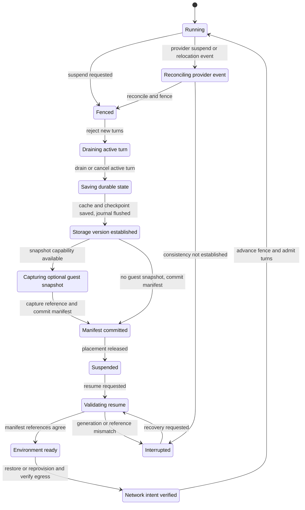
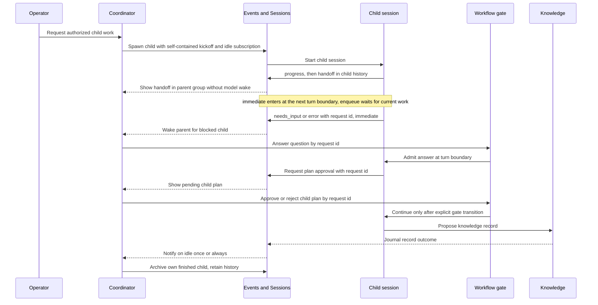

# Sessions and coordination
> Part of [ADR 0001: Agentweaver 1.0 platform architecture](../decisions/0001-platform-architecture.md). **Status:** Proposed.

## Summary

- The Agentweaver run journal is the record of truth for playback, audit, usage, UI state,
  and rebuilding agent context. A Copilot SDK conversation cache and a Microsoft Agent
  Framework (MAF) checkpoint are separate resume aids, not competing histories.
- Suspend fences work and commits a consistency manifest tying the journal, checkpoint,
  workspace generation, optional environment snapshot, and network intent together.
  Resume verifies that manifest before admitting another turn.
- A durable session tree relates runs, coordinators, child work, Scribe passes, and
  operator chats. One status snapshot exposes activity, blockers, and recovery effects.
- One addressed-message primitive carries steering, questions, approvals, progress,
  handoffs, and errors. Receipt acknowledgment is neither task completion nor approval.
- Coordination verbs are typed API and first-party MCP operations. Knowledge and agent
  configuration are records, not files that must be committed or reconciled.
- Agentweaver keeps its own run page, topology, approvals, chat, and surface panel. It
  borrows coordination primitives, not the Copilot app's UX.

## Current v1 source slice

The repository contains unpublished Events & Sessions and Orchestrator service
candidates. Events & Sessions supplies provider-neutral versioned event contracts, an
authoritative PostgreSQL run journal with transactional append, one ordered position
across every session in a project/run, bounded run or session replay, reconnectable
live cursors, immutable native Sessions provider pins, and addressed-message storage.
The Orchestrator owns root/child session relationships, execution fences, typed
decision and gate state, workflow position, MAF checkpoints, parent notifications,
turn-boundary operations, and the durable owner outbox. It checks current Projects &
Config authority and accepted run selection; Events validates message admission
against the exact owner outbox record and rechecks owner bindings for claim,
presentation, and acknowledgment.

The owner persists accepted definitions, decisions, pending gate request IDs, step
position, and child references in its PostgreSQL schema. Its MAF checkpoint refers to
an opaque Object Store SDK cache blob with SDK version and pinned-model metadata; a
missing or incompatible cache triggers explicit journal-based context rebuilding,
never external-effect replay. A valid correlated reply makes request input available
without approving its gate, and acknowledgment remains receipt-only. Automatic
AgentHost scheduling, a background delivery relay, consistency manifests, Knowledge
records, the full dispatch engine, and product UI/MCP integration remain outside this
slice. The Orchestrator also owns current grant and redacted PolicyEvaluation receipt
production; the positive receipt consumer in Events & Sessions remains #1846 work
after #1848 admission. See the
[implemented journal and owner contract](../../architecture/events-sessions.md).

When a non-empty or fixed-work plan needs isolation, the Orchestrator persists the
accepted Sandbox candidate and adapter-returned negotiation as an immutable
project/run context bound to the selection hash, configuration revisions, and
execution fence in the same owner transaction as the CAS-winning plan decision,
gate, grants, and outbox. The registered adapter resolves an already existing resource;
this Orchestrator boundary does not provision or release Sandbox resources. A
restored decision envelope cannot supply its own pin: the new host reloads that
tuple, checks the accepted selection and role context, and rebuilds the binding
through the current catalog and `ProviderResolver.Pin` without calling the adapter
again. Projects authority is refreshed after provider/context waits and before the
owner writes; stale or revoked requests leave no new binding. If no registered
adapter can provide the first negotiation, the plan request returns `503`; no
synthetic resource or generation is created.

## Today in 0.x

Paths refer to the 0.x code on the `dev` branch. In 0.x, an AgentHost agent turn is a
conversation in the Copilot SDK/CLI process. `CopilotAIAgent` uses the session identifier
`agentweaver-run-{runId}`. The SDK's separate on-disk session store and infinite sessions
are disabled. At a MAF workflow checkpoint, the agent serializes the SDK session into
that checkpoint; the Postgres checkpoint store persists it. A revision can resume the
same SDK session. Agentweaver does not interpret the serialized SDK data: its private
format belongs to the SDK and MAF. The run event journal separately records turns, tool
calls, and messages (`packages/Agentweaver.AgentRuntime/CopilotAIAgent.cs`).

0.x already persists idempotent addressed messages with claim, delivery,
acknowledgment, expiration, and undeliverable states
(`apps/Agentweaver.Api/Memory/AddressedMessageService.cs`).
[#1406](https://github.com/sabbour/agentweaver/issues/1406) extends that path with
tracked acknowledgment and correlated replies; 1.0 builds on it rather than inventing
addressed delivery. Steering directives instead use a separate `SteeringDirectives` table
(`apps/Agentweaver.Api/Coordinator/CoordinatorSteeringService.cs`). Question and tool
approval gates have their own durable paths. Child work is tracked by dispatch and
workflow-child services rather than by a single queryable session tree. The 0.x line
continues to ship while 1.0 is built.

## Durable history and resume aids

The Events & Sessions service owns the journal and the current internal addressed-message
storage primitive. The Orchestrator owns workflow and session-tree transitions; its MAF
checkpoint records where execution can continue. A sandbox never writes directly to
the checkpoint store.

| Record | Purpose | Durability and owner |
| --- | --- | --- |
| Run journal | Ordered run events and decisions for playback, audit, cost attribution, UI, and context rebuilding | Authoritative native Postgres Sessions record, owned by Events & Sessions |
| Addressed message | Idempotent, sequenced message, journal reference, owner and Events outbox records | Events & Sessions stores delivery state; the Orchestrator validates the owner outbox, session relationship, current permission, and fences. Admission is synchronous; there is no background relay. |
| Copilot conversation cache | Opaque SDK serialization to continue the next agent turn without resending history | Disposable Object Store blob referenced by run/session; captured at turn boundaries |
| MAF workflow checkpoint | Current step, pending child work, gates, and the conversation-cache reference | Durable Orchestrator state; checkpoint payload may use Object Store, with identity and references in Postgres |
| Consistency manifest | Pairing and generations that authorize resuming an environment and its workspace | Atomically committed control-plane record, owned by the Orchestrator |

The native [Sessions seam](provider-seams.md#sessions) is exclusive and supplies ordered
playback. An optional agentsessions adapter can mirror events, verify a hash chain, and
play them back after cutover. It does not mediate Copilot model calls or make
re-execution deterministic. If it adds no value beyond the native journal, it is not
enabled ([R1](../decisions/0001-platform-architecture.md#risk-register)).

### The Copilot conversation cache

"Copilot session state" is the serialized conversation state held by the Copilot SDK for
an AgentHost turn. It can help a subsequent revision or resumed turn continue in the
same conversation. It is not a readable Agentweaver event stream, an agent workspace,
or the workflow's step position.

In 1.0 AgentHost saves it as an opaque blob in the [Object Store
seam](provider-seams.md#object-store) at a turn boundary. The reference records the SDK
version and the pinned model binding. Agentweaver never parses it, presents it in the
UI, or transfers it to another provider. The MAF checkpoint refers to that blob instead
of embedding the SDK serialization in a Postgres checkpoint row. Retention deletes the
blob with the run.

On resume, a compatible cache can avoid reconstructing a conversation. If the blob is
missing or incompatible after an SDK upgrade or model-binding change, AgentHost starts
an SDK session and rebuilds context from the journal. A run does not fail solely because
its cache is unavailable. A compatible whole-environment snapshot may restore the live
Copilot process, in which case the separate cache is not needed. The [Snapshots
seam](provider-seams.md#snapshots) is optional; the cache-and-checkpoint path is the
cutover default.

### Playback, resume, and fork

| Operation | What it does | What it does not promise |
| --- | --- | --- |
| Playback | Reads recorded journal events in order | It does not invoke the model again |
| Resume | Continues MAF state from the checkpoint and an eligible SDK cache, or rebuilds model context from the journal | It does not silently replay uncommitted external effects |
| Fork or re-execution | Starts a new branch of work from an explicit journal event through the Sessions `Fork` operation | It does not reproduce the same model output or tool effects |

The journal records accepted coordinator decisions alongside effects. A repeated
execution can encounter changed external state even with the same accepted decisions;
"replayable" means the accepted path and recorded events are inspectable, not that a new
model call is bit-for-bit deterministic.

## Suspend and resume

Suspend/resume is a workflow transition, not a request to delete a sandbox. A manifest
pairs its control-plane and workspace versions; no environment snapshot implicitly
includes volume data. This protocol fulfills the 1.0 design of
[#1410](https://github.com/sabbour/agentweaver/issues/1410) without requiring a VM
snapshot provider at cutover.

This state diagram shows a requested suspension, an optional guest snapshot, and the
same validation gate for provider-initiated lifecycle events.

### Consistency manifest

| Entry | Why resume validates it |
| --- | --- |
| Run and session identity; manifest identity | Prevent another run or child session from taking ownership of this state |
| Copilot-cache reference, SDK version, and pinned model binding | Use only a compatible cache; otherwise rebuild conversation context from the journal |
| MAF checkpoint reference and workflow position | Continue at the recorded step, child join, or gate |
| Flushed journal position | Establish which turns and decisions are durable before recovery |
| Pinned workspace resource generation and provider reference | Identify the exact backing volume independently of guest snapshots |
| Flushed workspace data generation and tree hash, or a provider checkpoint identifier | Pair durable workspace contents with the recorded run state |
| Optional explicit guest snapshot reference and lifecycle generation | Restore only the intended environment version, not a latest-looking template |
| Network-intent generation | Reapply and verify the intended egress rules before dispatch |
| Fencing generation and lifecycle state | Reject an obsolete worker or provider lifecycle report |

The [Storage](provider-seams.md#storage) and [Snapshots](provider-seams.md#snapshots)
seams remain distinct: the latter preserves guest state when available, not the
workspace volume. The separate storage entry mitigates
[R4](../decisions/0001-platform-architecture.md#risk-register).

### Ordered transition

1. The Orchestrator advances the run's fence and stops admitting new turns. A stale
   AgentHost or late delivery cannot authorize another turn under the previous fence.
2. It drains or cancels the active turn. It saves a compatible Copilot cache at the
   boundary and persists the MAF checkpoint. It flushes journal events and workspace
   writes before treating their positions as durable.
3. It obtains the workspace generation and tree hash, or the storage provider's own
   checkpoint identifier when available. The volume is not assumed to share the guest
   environment's snapshot transaction.
4. If the paired Snapshot provider is available, it captures the guest and records the
   explicit snapshot reference. Otherwise the default path skips guest capture and
   retains the checkpoint, cache, journal, and workspace for a new environment.
5. It atomically commits the consistency manifest only after all required references
   exist, then releases placement. An incomplete transition remains interrupted, not
   falsely suspended.
6. Resume checks identities, journal and checkpoint references, storage and lifecycle
   generations, and the current fence. An incompatible conversation cache takes the
   journal-rebuild path; a mismatched storage or environment generation blocks dispatch.
7. It restores an eligible guest or provisions a new one, reapplies and verifies network
   intent, then advances the fence and resumes at the recorded workflow boundary.

A provider can suspend or move an environment without a prior Agentweaver request.
Its lifecycle event enters reconciliation under the same fence. If the required
versions cannot be established, the run remains interrupted until an explicit
recovery path passes manifest validation. The status snapshot exposes which records
are preserved and which in-flight action might repeat. It does not infer safety from
pod state or treat a message acknowledgment as a completed command.

A guest-snapshot adapter is enabled only after a public-preview Azure Blob capture and
restore, warm-pool claim restore, and startup-budget checks. It is not a 1.0 cutover
prerequisite ([R3](../decisions/0001-platform-architecture.md#risk-register)).

## Session tree and status

Every run, coordinator, workflow child work item, Scribe pass, and operator chat is a
session node with a stable identity, parent, root, kind, and `detached` flag. A run
spawned from operator chat appears beneath that chat if the operator has run-start
permission ([R10](../decisions/0001-platform-architecture.md#risk-register)).
A detached node remains a session but no longer follows its former parent for
coordination. The Orchestrator owns parent/child transitions; Events & Sessions owns
ordered history and delivery state.

A single status snapshot is computed from executor, WorkPlan, gate, and session state.
It is a query, not a second state machine maintained by the web client. Its activity
and blocker fields can coexist:

| Status field | Meaning for a coordinator or operator |
| --- | --- |
| Busy or idle | Whether a turn or workflow operation is active; idle may trigger a subscribed notification |
| Awaiting input | The blocked question, allowed choices, and request id needed to answer it |
| Awaiting plan approval | The pending plan and request id needed to approve or reject it |
| Interrupted | The fence, failed transition, and recovery effects that must be resolved |
| Finished or archived | Terminal work versus retained history hidden from active views |

The run page answers "what is happening?", "what needs my action?", and "what will the
next action repeat or preserve?" using that snapshot. Recovery effects come from
workflow transitions and the manifest, not a guess from the UI. This carries forward
the run-state and blocker work in
[#1402](https://github.com/sabbour/agentweaver/issues/1402).
Harness subagents used only inside a Copilot turn remain ephemeral and are not session
tree nodes; durable, isolated workflow child work is.

## One coordination message

1.0 unifies existing addressed delivery with the separately stored steering directives,
question requests, approval requests, and handoffs. The primitive carries an addressed
payload and delivery metadata; the workflow gate still owns the decision. The
[Messaging seam](provider-seams.md#messaging) transports it, but coordination semantics
belong to the Orchestrator and Events & Sessions.

| Field | Contract |
| --- | --- |
| Sender, recipient session, thread, reply-to | Explicit routing and correlated replies, including a coordinator's parent/child relationship |
| Idempotency key and per-thread sequence | Deduplicate at-least-once delivery and preserve thread order |
| Fencing generation | Reject a message from an obsolete run generation |
| Delivery mode | `immediate` or `enqueue`, with admission at defined boundaries |
| Purpose and kind | `progress`, `handoff`, `needs_input`, `error`, or a typed steering, question, approval, or proposal payload |
| Request id and reply correlation | Bind an answer or approval to the exact pending gate; never infer a decision from receipt |
| User quote and coordinator instructions | Keep user-directed changes distinguishable from a coordinator's own directions |

The proposed delivery protocol progresses through claim, presentation at the recipient's turn boundary,
delivery, and acknowledgment. `immediate` is admitted at the next turn boundary ahead
of queued messages and can interrupt a blocking wait, but never a running command.
`enqueue` waits until current work finishes. The originating service commits an outbox
record with its state change; a relay delivers at least once. Consumers deduplicate by
idempotency key and apply per-thread ordering. There is no exactly-once transport
([R9](../decisions/0001-platform-architecture.md#risk-register)).
Acknowledgment means "received", not "approved" or "completed". The plan gate accepts
an explicit approve/reject verb; the question gate accepts an explicit answer. This
preserves the addressed-message distinction from
[#1406](https://github.com/sabbour/agentweaver/issues/1406).

The current v1 source implements a minimal Orchestrator owner for accepted root and
child sessions, fenced turn state, pending requests, parent notifications, and a
durable owner outbox. It synchronously validates owner messages before Events
admission; Events commits the message, journal reference, and its outbox atomically.
Claim and presentation require the owner's `presenting` turn state. Delivery is
at-least-once with sender-run/session idempotency, and an omitted reply thread resolves
from the correlated message. This source slice does not include the wider AgentHost
scheduler, a background delivery relay, gate approval decisions, MAF checkpoints,
consistency manifests, Knowledge records, or product UI/MCP integration.

A `progress` message remains in the child's history. A `handoff` is retained and shown
in the parent's group without waking the parent model. `needs_input` and `error` wake
the parent. Stop, redirect, and amend are typed steering messages rather than writes to
a second directives table. No agent sends an acknowledgment-only message merely to
simulate coordination.

This sequence shows child work, both delivery modes, explicit gate answers, a knowledge
record, and archive without making Agentweaver's UI another coordinator.

### Coordination verbs

The Orchestrator exposes these as typed API actions and first-party MCP tools for
agents. Authorization, fencing, and pending request ids are checked at the action
boundary, not inferred from chat prose.

| Verb | Effect and guard |
| --- | --- |
| Spawn child | Create a node with a self-contained kickoff; optional model, agent, mode, and `coordinate_with_creator`; an operator chat needs run-start permission to spawn a run |
| Subscribe to idle | Notify `once` or `always` from workflow events; no status polling loop is needed |
| Read status snapshot | Read activity, pending blocker, plan, interruption, and recovery effects in one query |
| Approve or reject plan | Supply the pending request id and optional rejection feedback to the gate |
| Answer blocked question | Supply the pending request id and a valid choice or allowed free-form answer |
| Steer | Send, redirect, amend, or stop through an addressed, fenced message |
| Archive | Hide an owned child from active views while retaining its journal history |
| Fork | Create new work from an explicit journal event; do not claim deterministic re-execution |

Agents cap round trips on one topic; kickoff prompts carry enough context to stand
alone. Relayed user directions are labeled as user directions. When a decision needs a
human, a message routes the request while a durable gate holds the work.

## Knowledge records instead of repository files

Knowledge owns memory, decisions, proposals promoted to decisions, and session context.
Projects & Config owns agent charters. The old inbox becomes typed `proposal` messages
to Scribe or the coordinator, with accepted outcomes stored as decision records.
Prompt composition reads records through Knowledge; it never depends on a worktree
commit to make a decision visible. See the [Memory seam](provider-seams.md#memory).

| 0.x repository path or behavior | 1.0 owner and replacement |
| --- | --- |
| `.squad/decisions.md` and `.squad/decisions/inbox/*.md` | Knowledge decision records and proposals, without inbox-file reconciliation |
| `.squad/agents/*/history.md`, `.squad/identity/now.md`, and `.squad/sessions/*` | Memory and session-context records backed by the journal |
| `.agentweaver/context/*` | Knowledge context records and composed prompt projections |
| `.squad/agents/*/charter.md` | Projects & Config charter records; files are import/export format only |
| Pre-commit ledger mirroring and post-run file export | Explicit user-requested import or export/projection, not automatic synchronization |

The one-time Squad-repository import and export to files are explicit user actions.
A read-only file projection may be mounted for agent consumption; it does not create a
second writable memory store. `MemoryContextCompiler`-style prompt composition consumes
records. Inbound reconciliation (`SquadStateConsolidationService`), pre-commit memory
mirroring (`WorktreeOperationsAdapter.CommitChanges`), and automatic post-run export
(`PostRunScribeService`) do not carry forward. Removing those writable mirrors also
removes their merge-conflict class.

The Orchestrator owns session-tree and gate-request transitions. Events & Sessions owns
the journal and addressed-message delivery state; the two services are connected by
owner-validated internal routes. Admitting a valid correlated reply can expose request
input, but receipt acknowledgment does not decide or approve a gate. Knowledge owns
durable memory and decisions.
Agentweaver's run page, topology, approvals, chat, and [surface
panel](applications-and-surfaces.md) are views and typed actions over this state.
A user action in a surface arrives as a typed message, not as an untracked UI command.

## Alternatives considered

| Option | Why not |
| --- | --- |
| Treat serialized Copilot sessions as the run history | The SDK format is opaque and version-sensitive; journal playback and audit must survive a lost cache |
| Embed the Copilot cache in every MAF checkpoint | It couples workflow recovery to a private conversation format and large checkpoint payloads |
| Assume an environment snapshot includes workspace files | Workspace volumes have separate generations; a guest restore alone cannot prove consistency |
| Keep steering, questions, approvals, and addressed messages as separate transports | Multiple queues obscure ordering, correlation, and fencing; gates still decide independently of delivery |
| Keep repository files as writable memory | Commit mirrors, inbox reconciliation, and exports create conflicting copies of durable knowledge |

## Phasing

- **P0 — Foundation:** native Postgres identities, service schemas and outbox, Object
  Store references, and provider contracts support the journal and future manifest.
- **P1 — Core:** journal, MAF checkpoints, cache references, session tree, addressed
  messages, Knowledge records, coordination verbs, status snapshot
  ([#1402](https://github.com/sabbour/agentweaver/issues/1402)), and tracked message
  acknowledgment ([#1406](https://github.com/sabbour/agentweaver/issues/1406)) ship with
  the native providers. The UI and MCP server read the same workflow state.
- **P2 — Parity and cutover:** suspend/resume with manifest
  ([#1410](https://github.com/sabbour/agentweaver/issues/1410)), explicit Squad
  import/export, surface messages, and the parity acceptance list from
  [#1405](https://github.com/sabbour/agentweaver/issues/1405) are verified on an
  exact-SHA AKS deployment before cutover. VM snapshots are not required.
- **P3 — After cutover:** consider a gated AKS guest-snapshot adapter and optional
  agentsessions and Cosmos memory adapters. None changes the authoritative journal or
  requires rewriting knowledge into repository files.

## Related risks

- [R1](../decisions/0001-platform-architecture.md#risk-register): agentsessions is a
  capture-only, optional mirror, not a re-execution promise.
- [R3](../decisions/0001-platform-architecture.md#risk-register): guest snapshots are
  gated and not needed for suspend/resume at cutover.
- [R4](../decisions/0001-platform-architecture.md#risk-register): the manifest separately
  pairs workspace data with any guest snapshot.
- [R9](../decisions/0001-platform-architecture.md#risk-register): outbox delivery is at
  least once with deduplication and ordered threads.
- [R10](../decisions/0001-platform-architecture.md#risk-register): authorized operator
  chat may spawn a run as its child.
- [R23](../decisions/0001-platform-architecture.md#risk-register): exact-SHA AKS persona
  harnesses verify the session and recovery behavior before cutover.
