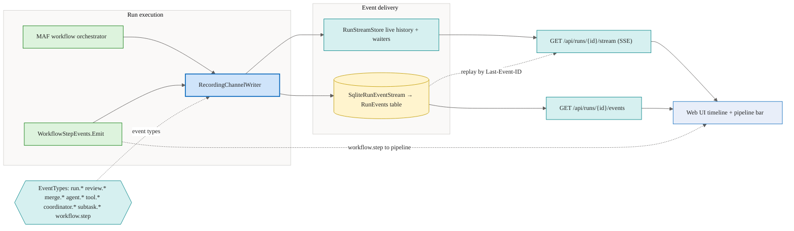

# Events

Run events are the primary mechanism for communicating progress from the agent to clients. Events are persisted durably and also delivered to SSE subscribers in real time.

## Architecture at a glance

A run emits events from the workflow orchestrator. Every event is written through to a durable log and fanned out to the live in-memory stream, then delivered to the UI over Server-Sent Events. The `workflow.step` event is emitted by the pipeline tracker and consumed as internal orchestration state that drives the stage pipeline.

## Two layers: durable write-through + live fan-out

Event delivery is split across two cooperating components:

- **`SqliteRunEventStream`** (`IRunEventStream`) is the durable layer. Every event is written through to a `RunEvents` table before it is fanned out to in-process subscribers via a `Channel<RunEvent>`. The `RunEvents` table lives in the EF Core memory database (`memory.db` / `MemoryDbContext`), so the per-event log survives a process restart.
- **`RunStreamStore`** holds a `RunStreamEntry` per run for low-latency live streaming. Each entry records events into an in-memory `_history` list, allocates a monotonic `sequence` at write time, and signals blocked SSE waiters the moment a new event arrives.

The orchestrator writes events through a `RecordingChannelWriter` that records to the run's `RunStreamEntry` and persists to the durable stream.

## Live fan-out

When a client connects to `GET /api/runs/{id}/stream`, the endpoint authorizes the caller as the run owner and reads the live `RunStreamEntry` from `RunStreamStore`. While the entry exists it enters a poll loop:

1. Call `GetSnapshotSince(lastSeen)` which returns new events and the completion flag atomically under a single lock.
2. Write each event as an SSE frame.
3. If the run is not yet complete, call `WaitForChangeAsync` which blocks until the next event is recorded, completion is signaled, or a one-second timeout elapses.
4. Repeat until the run completes, reaches the review gate, or the client disconnects.

Each `Record()` call wakes all blocked waiters immediately, so event delivery is prompt — not polling-interval-limited. The loop closes the stream at the review gate: when the entry reports `IsAwaitingReview` and a `review.requested` event has been seen.

Completed entries are retained in memory for up to 256 finished runs (`MaxRetainedCompleted`); older completed entries are evicted as new runs finish.

## SSE resume cursor

The SSE endpoint exposes each event's `sequence` as the SSE `id`. Clients can reconnect with `Last-Event-ID` set to the last sequence they received. While the live entry still exists the endpoint resumes from that point in the in-memory history; otherwise it replays the persisted events from the durable stream (`IRunEventStream.SubscribeAsync`) starting after the supplied cursor.

Delivery is at least once; clients should deduplicate by `sequence`.

## Process restart behavior

On startup, `WorkflowRestartService` reconciles runs that were interrupted by the restart:

- Runs still recorded as `InProgress` are marked `Failed` (coordinator parent runs are deferred rather than failed).
- Runs in `AwaitingReview` are revalidated against their worktree/tree hash; a stale review (no checkpoint, older than 24h) is failed, otherwise a synthetic `review.requested` is re-emitted so the review gate can be resumed.

Because the `RunEvents` table is durable, the granular event history can be replayed after a restart through the durable stream and the `GET /api/runs/{id}/events` endpoint. As a legacy fallback, if a stream has no replayable events but the run has a persisted `result`, the `/stream` endpoint emits that result as a single `agent.message` event followed by a `done` frame.

## Persistence

Two SQLite stores back the run lifecycle:

- The `runs` table (main DB, `SqliteDb`) stores run metadata, status, and the final `result` text.
- The `RunEvents` table (memory DB, `MemoryDbContext`) stores the append-only per-event log written by `SqliteRunEventStream`. `GET /api/runs/{id}/events` returns these rows ordered by `sequence`.

## Review and merge events

The event log spans the full lifecycle from submission through merge or decline, and the review workflow is implemented today. The review endpoint (`POST /api/runs/{id}/review`) drives approve / request-changes / decline branching, and the watch loop and commit/merge paths emit `review.requested`, `review.approved`, `review.declined`, `merge.started`, `merge.completed`, and `merge.failed` (or `merge.conflicted`) on the same per-run stream.
