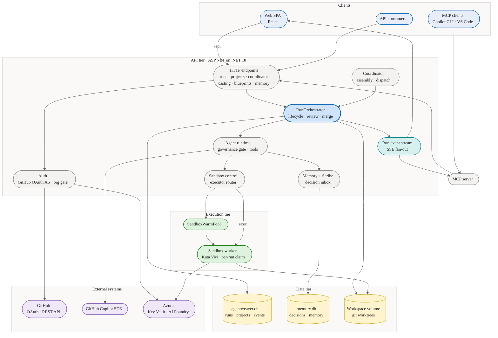
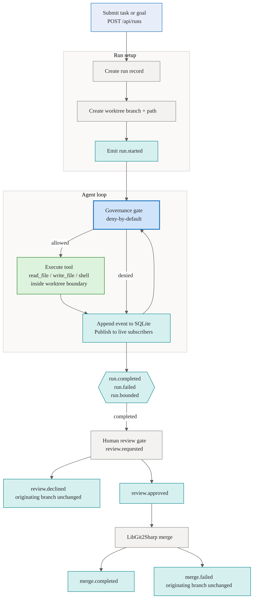

# Architecture overview

Agentweaver runs as a single ASP.NET Core process. The API, run orchestration, event persistence, live streaming, and agent runtime all live in the same host, so the backend stays the single source of truth for every run.

The `RunOrchestrator` provisions a per-run git worktree, persists run state, and launches the agent loop as hosted background work inside the process. The agent loop uses the shared runtime, evaluates every tool call through a deny-by-default governance gate before it executes, applies content safety, and writes every event to the durable log before publishing it live.

SQLite stores both mutable run state and the append-only event log. The durable `SqliteRunEventStream` writes each event to a `RunEvents` table and fans it out to in-process subscribers through a `Channel<RunEvent>`, while `RunStreamStore` keeps a per-run in-memory entry for low-latency live streaming. The MCP server and web UI subscribe to the same stream without owning any run logic. When the run finishes, the orchestrator commits the worktree, requests human review, and lets `LibGit2Sharp` merge only after approval.

## System architecture

The diagram below shows the overall system: client entry points reach the ASP.NET API tier, which orchestrates runs, drives the agent runtime, controls sandbox workers for the execution tier, persists state to the data tier, and integrates with external systems.

## End-to-end flow

## Main components

| Component | Responsibility |
| --- | --- |
| ASP.NET Core API | Accepts requests, authorizes users, and exposes run endpoints |
| `RunOrchestrator` | Owns run lifecycle, review gate, and merge decisions |
| Agent runtime | Executes the single-agent loop with provider selection, content safety, and run bounds |
| Governance gate | Per-run AGT kernel that evaluates every tool call against a deny-by-default policy and path-containment backend before execution |
| `SandboxedFileTools` | Defense-in-depth file reads and writes inside the run worktree; validates and re-verifies every path after open |
| SQLite stores | Persist `runs`, the durable `RunEvents` log, and operational records |
| `RunStreamStore` / `SqliteRunEventStream` | Fan events out to live subscribers (in-memory entries) and persist them durably |
| MCP server and web UI | Thin clients that submit runs, watch events, and record review decisions |

## Review and merge model

A completed run does not merge automatically. The orchestrator commits the worktree state, emits `review.requested`, and waits for the run owner to approve or decline. On approval, the merge step verifies that the approved tree hash still matches the worktree branch, then fast-forwards or creates a merge commit through `LibGit2Sharp`. On conflict or any merge failure, the originating branch stays unchanged and the worktree remains available for inspection.
