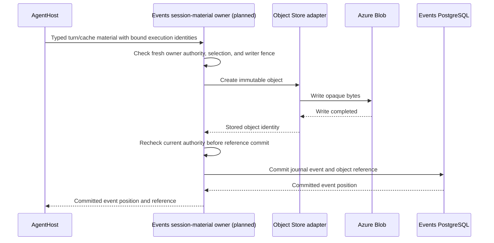

# PostgreSQL and Blob

`Agentweaver.Persistence.Postgres` stores outbox events and consumer inbox receipts in a service-owned schema. It does not create domain tables or a relay service.

The separate `Agentweaver.EventsAndSessions` service owns its `events_sessions` schema
by default, including the journal, session/provider bindings, and object-reference
retention records. Its explicit migration composes the outbox/inbox schema with those
domain tables; ordinary service startup verifies the schema and does not migrate it.
The journal reference describes append, replay, live cursors, and the migration
boundary in detail.

<figure class="aw-diagram" tabindex="0">
  
  <figcaption>Separate producer and consumer transactions couple local state to outbox writes and inbox admission. The host-driven relay is shown separately; transport delivery remains at least once.</figcaption>
</figure>

<a :href="'/agentweaver/v1/diagrams/flagship/v1-outbox-inbox.png'">Open full-size PNG</a> · <a :href="'/agentweaver/v1/diagrams/flagship/v1-outbox-inbox.drawio'">Open editable draw.io source</a>

<figure class="aw-diagram" tabindex="0">
  
  <figcaption>The library does not start a daemon. The targeted owner claim and caller-driven batch relay use the same fenced lease; relay acknowledgment follows confirmed publication and is distinct from a consumer acknowledging delivery after its transaction commits.</figcaption>
</figure>

<a :href="'/agentweaver/v1/diagrams/flagship/v1-outbox-relay.png'">Open full-size PNG</a> · <a :href="'/agentweaver/v1/diagrams/flagship/v1-outbox-relay.drawio'">Open editable draw.io source</a>

Call `EnqueueAsync` with the same open connection and transaction as the domain state change. PostgreSQL assigns stream sequence numbers and enforces stable event IDs and idempotency keys.

`ClaimAsync` leases the earliest undelivered event per stream. `ClaimOneAsync` leases a
requested event only when it is next in its stream and its prior lease is absent or
expired; it returns `null` when the event cannot be claimed. Both return a lease token,
and `AcknowledgeAsync` accepts only a current, unexpired token. The Orchestrator uses
the single-event claim for synchronous admission of its selected owner-outbox message;
it does not add a background relay.

`OutboxRelay` publishes through an injected `IOutboxPublisher`, then acknowledges only confirmed publishes with the current lease token. A failed, cancelled, or fenced publish remains unacknowledged and can be reclaimed; a publish may still have completed externally before a failure. The host calls `RelayOnceAsync`. The library does not start a daemon or provide exactly-once delivery.

Call `AdmitAsync` with the same transaction as consumer state and any new outbox event. Apply effects only for `InboxAdmission.Admitted`. Skip effects for `InboxAdmission.Duplicate`. Acknowledge delivery after commit.

Delivery remains at least once. The inbox prevents duplicate committed local effects when the consumer gates all effects on the receipt and transaction.

`Agentweaver.ObjectStore.AzureBlob` implements `IObjectStore` for opaque platform objects. It does not provide agent workspace storage, create a container, authorize callers, or fall back to disk.

The Blob container exists before adapter use. The caller owns authorization, authoritative references, retention, and upload-stream lifetime. Blob writes do not commit PostgreSQL references.

Session event payloads store large content as typed opaque `ObjectKey` references with
purpose and optional byte length; the journal stores and returns references and
retention metadata, not the referenced bytes. Object upload, authorization, and blob
deletion are outside this service slice. See [Events & Sessions](events-sessions.md).

## Events and Blob have different jobs

**Events & Sessions is the journal service. Azure Blob is the large-object backend.**
They are not competing event stores.

| Location | Stores | Authority |
| --- | --- | --- |
| Events PostgreSQL schema | Ordered events, session identity, usage, object keys, purpose, length, and retention references | Events owns journal order and run artifact references. |
| Azure Blob through `IObjectStore` | Opaque conversation caches, large logs, and run artifacts | Blob stores bytes. The trusted owner controls access and lifetime. |
| Orchestrator PostgreSQL schema | MAF checkpoint identity, workflow position, and optional cache references | Orchestrator owns workflow recovery, not the Events journal. |
| Azure Files through Storage | Agent-visible repository and workspace files | Environment owns volume bindings. These are not platform object blobs. |

For example, a journal entry can record that a turn completed and refer to an object
containing its large output. PostgreSQL answers what happened and in which order.
Blob supplies the referenced bytes when an authorized caller requests them.
A normal small event does not require a Blob object.

The approved source scope is a minimum typed interface inside the existing Events owner.
It accepts only `TurnContent` and `SdkCache` material with bound operation, event, session,
runtime revision, and fence identities. It is not a generic raw-content or Azure proxy API.
Events generates the scoped object identity and records its kind, digest, length, revisions,
and SDK/model binding. Caller-supplied references do not prove stored content or authority.

Writes require fresh authenticated owner context, the current accepted selection, and
Orchestrator runtime registration, turn fence, and writer eligibility.
An Observe-purpose credential is insufficient. Events rechecks authority after storage
and database waits and on retries. The same operation and material return the original
acknowledgment; changed material conflicts.

The planned upload path writes an immutable object before committing its journal
reference. A failed journal commit does not make that upload a committed event.
The owner must report the failure and reconcile only its own unreferenced objects.
PostgreSQL and Blob do not share an atomic transaction.

Reads resolve owner-recorded material by event, session, and kind, not arbitrary keys,
paths, URLs, or containers. Historical read authorization is separate from current
execution-bound write authority. Events checks current authority and integrity after
retrieval, before disclosing content. Cache restore also requires current runtime and
model compatibility. AgentHost receives permitted content, not Blob account credentials
or direct container access.
Retention follows owner records; the Blob adapter does not decide which run data to delete.

The current source has the Blob adapter and journal-reference contracts.
It does **not** yet have this typed Events interface or production Blob composition.
The diagram describes approved source work, not an implemented or deployed route.
[#1903](https://github.com/sabbour/agentweaver/issues/1903) tracks the bounded integration
inside the original AgentHost and orchestration criteria, not a new blanket P1 prerequisite.
`IObjectStore` is a shared adapter, not a requirement to introduce another service.
A cache must come from actual SDK-supported serialization and be safe to persist.
Do not rewrite an opaque SDK payload to fabricate safety or claim portable restore without SDK support.
Missing, incompatible, or unpersistable cache requires actual journal-context rebuilding,
without model or external-effect replay. Session IDs and blob-existence checks do not prove recovery.
A missing required artifact remains an explicit error, not an empty successful read.
