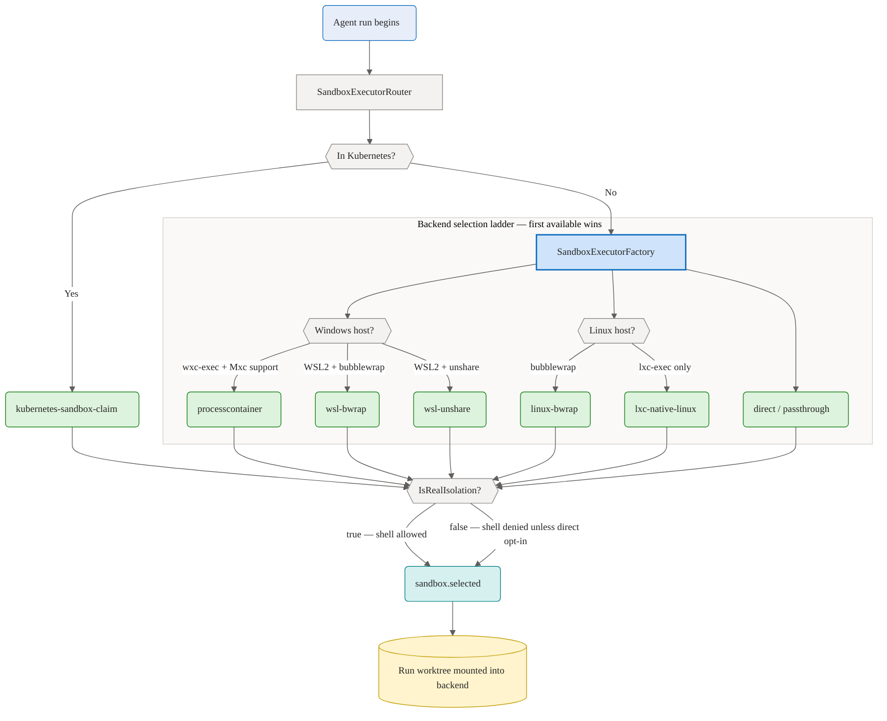

# Sandbox

The agent can act only inside its assigned per-run git worktree. Enforcement is in the backend, not in the model prompt, so the same rules apply regardless of which client starts the run and regardless of whether the provider is GitHub Copilot or Microsoft Foundry.

## How a run gets its sandbox

Every run is bound to an isolated execution environment. The `SandboxExecutorRouter` first checks for an in-cluster deployment; otherwise `SandboxExecutorFactory` probes the host and returns the first available backend. The selected backend's `IsRealIsolation` flag gates whether shell commands run at all, and the choice is published as a `sandbox.selected` event.

## Governance middleware

Every tool call the agent attempts is evaluated by a per-run governance kernel from the Agent Governance Toolkit (AGT) before it can execute. The kernel is constructed at run start and disposed when the run ends. It loads a deny-by-default containment policy and registers a path-containment backend. If the loaded policy's default action is not Deny, the backend refuses to start the run.

This page focuses on the in-process **file** containment that applies to all runs. Sandboxed **shell** execution (the `run_command` tool) layers an additional executor gate on top of the same governance kernel — see [sandboxed-execution.md](./sandboxed-execution.md).

## Two-layer evaluation

A tool call must be allowed by both layers. If either denies, the call is blocked.

**Layer A — tool-name policy.** The AGT kernel evaluates the call against a deny-by-default YAML policy (`defaultAction: Deny`, no allow rules). The recognized file tools — `read_file`, `list_directory`, `write_file`, `edit_file`, `create`, `str_replace_editor`, `apply_patch`, `grep_search`, `file_search` — plus the `run_command` shell tool are allowed through the `SandboxPolicyBackend` allow-list; every other tool name (MCP tools, network/URL fetches, and any unrecognized name) is denied. The policy is embedded and not user-configurable.

**Layer B — path containment.** The path-containment backend evaluates the call independently and unconditionally, even when Layer A has already allowed it. It checks that the target path resolves inside the worktree root, and it also denies any tool name it does not recognize as a file tool and any call that carries no identifiable path argument.

When the provider passes an absolute path — as the GitHub Copilot SDK does — the backend routes it through absolute-path containment. When the path is relative, the backend routes it through the relative-path validator.

## Path validation model

For relative paths, `SandboxPathValidator` applies five steps:

1. Reject absolute paths.
2. Reject any `..` segment before the path is combined with the worktree root.
3. Normalize the candidate path with `Path.GetFullPath` against the worktree root.
4. Check that the normalized path starts with `(worktree root + separator)` OR equals the worktree root exactly. The OR branch allows `"."` and `"./"` to resolve to the root itself for directory listing. The separator requirement on the prefix branch prevents `work` from matching `work-evil`.
5. Walk existing ancestors inside the worktree and reject any reparse point, including symlinks and junctions.

For absolute paths supplied by the provider, the validator additionally rejects device paths (`\\?\`, `\\.\`), UNC paths, and drive-relative paths before applying normalization and the same lexical prefix and reparse-point checks.

## Open then verify

The runtime does not trust a lexical path check alone. After opening a file handle, it resolves the final path from the handle and checks that path against the worktree root again. The handle check also uses the OR-equality pattern so that a handle resolving exactly to the root (for directory operations) passes correctly.

- On Windows, it uses `GetFinalPathNameByHandle`.
- On Linux, it resolves `/proc/self/fd/<fd>`.

A handle that resolves outside the worktree is rejected before any bytes are read or written.

## Root integrity

At construction time, `SandboxedFileTools` asserts the sandbox root itself is not a reparse point (symlink or junction). If it is, the runtime refuses to operate. This prevents an attacker from pointing the worktree root at an arbitrary location before the agent starts.

## Provider integration

Both providers use the same governance kernel, the same embedded policy, and the same path-containment backend.

**GitHub Copilot.** The deny-by-default `OnPermissionRequest` handler is the authoritative enforcement point for the Copilot provider. The SDK (github.copilot.sdk 1.0.0-beta.2) uses native tool names (e.g. `view`) that do not correspond to the logical names used in the governance policy. The handler fires for every native tool invocation, maps the native tool to a logical tool name (`read_file`, `list_directory`, `write_file`, `edit_file`), and routes through the dual-layer governance evaluation before approving or rejecting. The permission handler is fail-closed: any exception during evaluation denies the request. For observability, the Copilot runner also reads the SDK's tool-execution lifecycle, which flows inline through the streaming response, and surfaces a `tool.call`, then a `tool.result` (with the approved tool's content) or a `tool.error`, at parity with the Foundry runner.

**Microsoft Foundry.** The runner evaluates governance as a pre-execution check in its tool dispatch loop. Before invoking any tool, it runs the dual-layer evaluation and, if denied, returns a structured denial to the model without executing the tool. Tool arguments arrive as `System.Text.Json.JsonElement`; the `SandboxPolicyBackend` coerces these to their underlying string values so path containment is evaluated correctly. `SandboxedFileTools` performs an additional validate-and-open-then-verify pass when the tool executes, providing defense in depth.

## Fail-closed

Any exception inside the governance evaluation — in the AGT kernel, the path-containment backend, or the path validator — produces a deny result. The call does not proceed.

## Audit

Every allow and every deny decision is recorded through the AGT audit emitter, which is wired to the run's logger at construction. Allow entries include the resolved path. Deny entries include the reason and which layer denied.

## What the agent can do

Inside the worktree, the agent can:

- Read existing text files
- List directory contents (immediate children only; `"."` lists the worktree root)
- Create directories as needed for a write
- Create or overwrite text files
- Retry within the sandbox when a path is missing or rejected

Both the Foundry runner and the Copilot runner expose `list_directory` as an available tool. The Foundry runner registers it directly. The Copilot runner disambiguates read requests into `read_file` or `list_directory` based on whether the target is a directory.

## What the agent cannot do

The agent cannot:

- Run shell commands unless sandboxed execution is enabled and a real isolation backend (or explicit `direct` mode) is available — see [sandboxed-execution.md](./sandboxed-execution.md)
- Fetch URLs or make network requests
- Call MCP tools or any tool outside the recognized file and `run_command` tools
- Traverse out of the worktree with `..`
- Follow a symlink or junction outside the worktree
- Read or write files outside the assigned worktree
- Swap a path target after validation (open-then-verify closes that gap)

## Failure model

The sandboxed file tools never throw policy failures into the agent loop. They return structured failures instead, which the runtime surfaces as `tool.error` — for both policy denials and ordinary execution failures such as missing files or access errors. The `errorMessage` distinguishes a sandbox denial from a not-found or I/O error.
