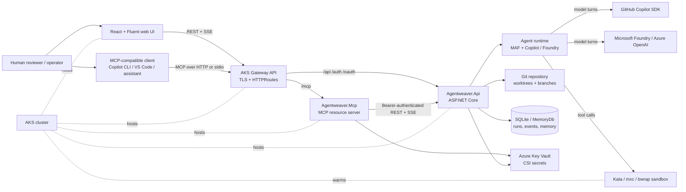
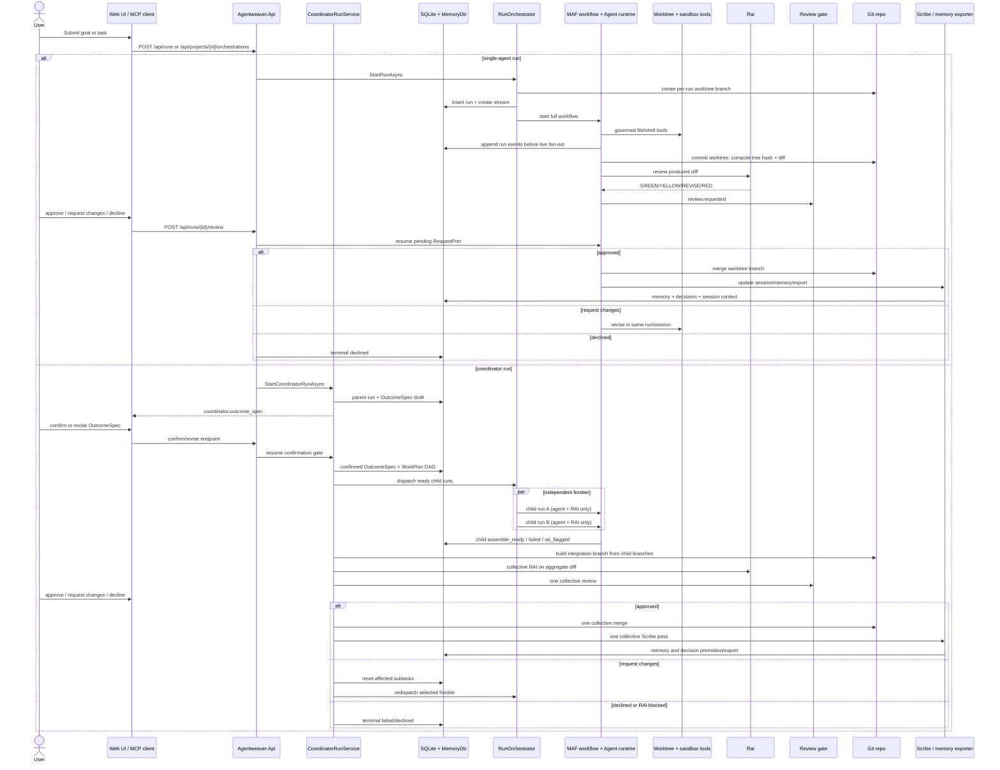

# System Overview — Deep Dive

## Purpose & Scope

Agentweaver is a self-hosted orchestration platform for AI-assisted project work. At its narrowest, it takes a natural-language task, creates an isolated git worktree, runs an agent, streams every step, and keeps the produced diff behind a human review gate before merge (`README.md:3`, `apps/Agentweaver.Api/README.md:7`). At its broadest, it runs a coordinator-led team: the coordinator drafts an `OutcomeSpec`, waits for confirmation, decomposes a `WorkPlan` into a dependency graph, launches child runs, assembles their branches, performs RAI review, gates the integrated diff, merges once, and records team memory (`docs/index.md:24-36`, `apps/Agentweaver.Api/Coordinator/CoordinatorAssemblyService.cs:29-52`).

This page is the top-level map. It covers:

- deployed entry points: web UI, REST API, and MCP server;
- core backend orchestration and persistence;
- agent runtime, tools, sandboxing, and provider integration;
- AKS topology and deployment assets;
- the end-to-end single-run and coordinator-run lifecycles.

For detailed subsystem treatment, see the sibling deep dives linked from `docs/deep-dive/README.md`.

## System Context



Key context facts:

- The web UI is deliberately thin: it submits runs, streams steps, renders review screens, and calls the backend API for all behavior (`apps/web/README.md:3-6`).
- The MCP server is also a thin facade: it exposes Agentweaver capabilities to MCP clients and forwards authenticated calls to the API (`apps/Agentweaver.Mcp/README.md:3`, `apps/Agentweaver.Mcp/AgentweaverApiClient.cs:15-24`).
- The API is the source of truth for orchestration, events, persistence, auth, worktrees, and merges (`docs/architecture/overview.md:3-8`, `apps/Agentweaver.Api/Program.cs:62-86`).
- Models are provider-selectable. The dispatcher sends `ModelSource.GitHubCopilot` to the Copilot runner and `ModelSource.MicrosoftFoundry` to the Foundry runner (`packages/Agentweaver.AgentRuntime/AgentRunnerDispatcher.cs:17-31`).
- On AKS, the gateway routes `/api`, `/auth`, and OAuth discovery/token paths to the API, `/mcp` to the MCP service, and everything else to the frontend (`k8s/httproute-api.yaml:1-15`, `k8s/mcp-httproute.yaml:40-46`, `k8s/httproute-frontend.yaml:1-14`).

## Component Inventory

| Component | Path | Language / runtime | Responsibility |
| --- | --- | --- | --- |
| Root solution | `agentweaver.sln` | .NET solution | Groups the API, MCP app, tests, and packages; the solution currently includes `Agentweaver.Api`, `Agentweaver.Mcp`, and six package projects (`agentweaver.sln:8-27`). |
| Shared .NET build policy | `Directory.Build.props` | MSBuild | Enables nullable references, implicit usings, latest analysis, and warnings-as-errors for .NET projects (`Directory.Build.props:1-7`). |
| API host | `apps/Agentweaver.Api` | ASP.NET Core on .NET 10 | Main service: REST endpoints, auth, run orchestration, SQLite stores, workflow services, memory DB, project/casting/blueprint/workflow services, sandbox routing, and hosted recovery/heartbeat jobs (`apps/Agentweaver.Api/README.md:1-15`, `apps/Agentweaver.Api/Program.cs:62-245`). |
| Projects & workspaces | `apps/Agentweaver.Api/Projects` | ASP.NET Core application services + LibGit2Sharp | Project lifecycle service for blank projects, GitHub-backed projects, provider defaults, relinking moved workspaces, and read-only project workspace browsing (`apps/Agentweaver.Api/Projects/ProjectService.cs:11-16`, `apps/Agentweaver.Api/Projects/ProjectService.cs:48-90`, `apps/Agentweaver.Api/Projects/ProjectService.cs:117-200`, `apps/Agentweaver.Api/Projects/ProjectService.cs:231-280`, `apps/Agentweaver.Api/Projects/ProjectWorkspaceService.cs:45-52`). |
| Team & casting engine | `packages/Agentweaver.Squad`, `apps/Agentweaver.Api/Casting`, `apps/Agentweaver.Api/Blueprints` | .NET class libraries + API services + Copilot-assisted generation | Catalog/blueprint/team engine for universes, naming, role selection, charter compilation, proposals, `.squad/` persistence, blueprint validation/generation, and memory import/export (`apps/Agentweaver.Api/Casting/CastingService.cs:16-20`, `apps/Agentweaver.Api/Casting/CastingService.cs:100-190`, `apps/Agentweaver.Api/Casting/CastingService.cs:420-588`, `apps/Agentweaver.Api/Casting/CastingService.cs:795-824`, `apps/Agentweaver.Api/Blueprints/BlueprintService.cs:17-24`, `packages/Agentweaver.Squad/Catalog/CatalogReader.cs:8-13`, `packages/Agentweaver.Squad/Memory/SquadMemoryExporter.cs:6-10`). |
| MCP host | `apps/Agentweaver.Mcp` | ASP.NET Core + ModelContextProtocol on .NET 10 | MCP server for backlog, blueprints, catalog, coordinator, diagnostics, GitHub auth, memory, projects, runs, sandbox policy, teams, workflows, and workspace tools; supports stdio and HTTP transports (`apps/Agentweaver.Mcp/README.md:44-197`, `apps/Agentweaver.Mcp/Program.cs:59-105`). |
| Static frontend host | `apps/Agentweaver.Web` | ASP.NET Core on .NET 10 | Production static-file host for the built React SPA and generated docs, including SPA fallback and VitePress clean-URL handling (`apps/Agentweaver.Web/Program.cs:1-73`, `apps/Agentweaver.Web/Agentweaver.Web.csproj:8-9`). |
| Web UI source | `apps/web` | React 19, TypeScript, Vite, Fluent 2 | Browser client for submit/watch/review flows, project/casting/coordinator screens, and API access through `src/api/client.ts` (`apps/web/README.md:1-7`, `apps/web/package.json:6-26`). |
| Sandbox base image | `apps/agentweaver-sandbox` | Ubuntu container image | Base image for sandbox pods; includes git, build tools, Python, Node/npm, .NET, runs as UID 1000, and sleeps for command exec (`apps/agentweaver-sandbox/Dockerfile:1-36`). |
| Domain package | `packages/Agentweaver.Domain` | .NET class library | Core records/enums/interfaces for runs, projects, model source, sandbox policy, backlog, auth token stores, approval/question gates, and project workspace abstractions (`packages/Agentweaver.Domain/Run.cs:3-64`, `packages/Agentweaver.Domain/Project.cs:3-69`, `packages/Agentweaver.Domain/SandboxPolicy.cs:7-90`). |
| Agent runtime | `packages/Agentweaver.AgentRuntime` | .NET class library + MAF + Copilot SDK + Microsoft.Extensions.AI | Registers provider runners, workflow agents, RAI/Scribe executors, sandbox governance, loopback Agentweaver tools, and model-provider dispatch (`packages/Agentweaver.AgentRuntime/AgentRuntimeServiceCollectionExtensions.cs:16-36`, `packages/Agentweaver.AgentRuntime/AgentRunnerDispatcher.cs:6-33`). |
| Agent tools | `packages/Agentweaver.AgentTools` | .NET class library | Builds sandboxed `AIFunction` tools: file read/search/edit/create/patch, shell command, intent/outcome reporting, and question escalation (`packages/Agentweaver.AgentTools/SandboxToolRegistry.cs:15-44`). |
| Sandbox filesystem | `packages/Agentweaver.SandboxFs` | .NET class library + Agent Governance Toolkit backend | Path containment, symlink/junction rejection, open-then-verify file I/O, and AGT external policy backend (`packages/Agentweaver.SandboxFs/SandboxPathValidator.cs:9-16`, `packages/Agentweaver.SandboxFs/SandboxPolicyBackend.cs:6-14`, `packages/Agentweaver.SandboxFs/SandboxedFileTools.cs:5-10`). |
| Sandbox execution | `packages/Agentweaver.SandboxExec` | .NET class library + mxc/bwrap/LXC integrations | Selects command-execution backends by platform and exposes `ISandboxExecutor`; local order is Windows process container, WSL, Linux bwrap, Linux LXC, then direct fallback (`packages/Agentweaver.SandboxExec/SandboxExecutorFactory.cs:6-14`, `packages/Agentweaver.SandboxExec/Agentweaver.SandboxExec.csproj:7-36`). |
| Squad package | `packages/Agentweaver.Squad` | .NET class library + embedded resources | Team/casting/blueprint catalog, `.squad/` reader/writer, charter/history files, memory import/export, and project signal scanning (`packages/Agentweaver.Squad/Catalog/CatalogReader.cs:8-13`, `packages/Agentweaver.Squad/Squad/SquadReader.cs:14-18`, `packages/Agentweaver.Squad/Memory/SquadMemoryExporter.cs:6-10`). |
| Kubernetes manifests | `k8s` | Kubernetes YAML | Namespace, services, deployments, Gateway/HTTPRoutes, PVCs, CSI Key Vault secret providers, network policies, RBAC, backup cronjob, sandbox templates, and sandbox warm pool (`k8s/api-deployment.yaml:1-203`, `k8s/gateway.yaml:1-39`, `k8s/sandbox-template.yaml:1-56`). |
| AKS scripts | `scripts/aks` | Bash + Azure CLI + kubectl | Provision cluster/ACR, set identity, build/push four images, render/apply manifests, and verify pods/routes/secrets/sandbox CRDs (`scripts/aks/10-create-cluster.sh:4-11`, `scripts/aks/20-build-push-images.sh:4-11`, `scripts/aks/30-deploy.sh:42-170`, `scripts/aks/40-verify.sh:21-117`). |

## Runtime Topology on AKS

```mermaid
flowchart TB
    Internet[Users and MCP clients] --> Gw[Gateway: agentweaver-gateway<br/>HTTPS :443]

    Gw --> ApiRoute[HTTPRoute: /api /auth /.well-known /oauth]
    Gw --> McpRoute[HTTPRoute: /mcp and MCP metadata]
    Gw --> FrontRoute[HTTPRoute: /]

    ApiRoute --> ApiSvc[Service: agentweaver-api :8080]
    McpRoute --> McpSvc[Service: agentweaver-mcp :8080]
    FrontRoute --> FrontSvc[Service: agentweaver-frontend :80 -> :8080]

    ApiSvc --> ApiPod[API pod<br/>1 replica, Recreate]
    McpSvc --> McpPod[MCP pod<br/>1 replica]
    FrontSvc --> FrontPods[Frontend pods<br/>2 replicas]

    ApiPod --> DataPVC[(agentweaver-data PVC<br/>RWO 10Gi)]
    ApiPod --> WorkspacePVC[(agentweaver-workspace PVC<br/>RWX 50Gi)]
    ApiPod --> CSI[Secrets Store CSI<br/>agentweaver-secrets]
    McpPod --> McpCSI[Secrets Store CSI<br/>agentweaver-mcp-secrets]

    ApiPod --> SandboxClaim[SandboxClaim<br/>run-{runId}]
    SandboxClaim --> WarmPool[SandboxWarmPool<br/>3 warm sandboxes]
    WarmPool --> SandboxPod[Kata VM sandbox pod<br/>agentweaver-sandbox]
    SandboxPod --> WorkspacePVC

    ApiPod --> GitHub[GitHub / Copilot / OAuth]
    ApiPod --> OTel[OTLP collector]
    McpPod --> ApiSvc
```

Topology notes:

- The public entry point is `agentweaver-gateway`, an Application Routing/Istio Gateway with a single HTTPS listener and managed TLS secret (`k8s/gateway.yaml:1-39`).
- API, MCP, and frontend are separate Deployments and ClusterIP Services. The API is one replica with `Recreate` because SQLite is single-writer on an RWO PVC (`k8s/api-deployment.yaml:10-14`, `k8s/api-service.yaml:1-18`); frontend runs two replicas (`k8s/frontend-deployment.yaml:9-31`); MCP runs one replica (`k8s/mcp-deployment.yaml:9-47`).
- The API mounts `/data` from `agentweaver-data` and `/workspace` from `agentweaver-workspace`; workspace provider is configured as `persistent-volume`, and sandbox backend as `kubernetes` (`k8s/api-deployment.yaml:90-114`, `k8s/pvc-data.yaml:1-12`, `k8s/pvc-workspace.yaml:1-12`).
- Secrets come from Azure Key Vault via CSI. The API secret provider exposes API key, GitHub OAuth credentials, and the MCP OAuth signing key; the MCP secret provider exposes MCP auth/user secrets (`k8s/secret-provider-class.yaml:1-42`, `k8s/secretprovider-mcp.yaml:1-37`).
- The sandbox warm pool is a first-class CRD resource. The template uses `runtimeClassName: kata-vm-isolation`, a read-only root filesystem, non-root UID 1000, and the shared workspace PVC (`k8s/sandbox-template.yaml:1-56`, `k8s/sandbox-warmpool.yaml:1-12`). Per run, `KubernetesSandboxExecutor` creates a `SandboxClaim` from `sandbox-claim-template.yaml` with a 600-second TTL (`k8s/sandbox-claim-template.yaml:1-11`).
- Network policy starts from default deny for app pods and sandbox pods, then opens targeted DNS, app-internal, gateway, GitHub HTTPS, and MCP-to-API paths (`k8s/networkpolicy-default-deny.yaml:1-197`, `k8s/networkpolicy-sandbox.yaml:1-50`).

## End-to-End Run Lifecycle



### Single-agent lifecycle

1. `POST /api/runs` validates `task`, `repository_path`, `originating_branch`, and `model_source`, canonicalizes the repository path, creates a `Run` in `Pending`, seeds run options, and calls `RunOrchestrator.StartRunAsync` (`apps/Agentweaver.Api/Endpoints/RunEndpoints.cs:33-98`).
2. `RunOrchestrator` creates a git worktree, resolves an agent charter from `.squad/agents/{name}/charter.md` when present, inserts the run, creates a live stream entry, builds memory context, and starts the MAF workflow (`apps/Agentweaver.Api/Runs/RunOrchestrator.cs:76-147`, `apps/Agentweaver.Api/Runs/RunOrchestrator.cs:444-549`).
3. `RunWorkflowFactory` builds the default full pipeline around an agent turn, RAI, human review, merge, and Scribe (`apps/Agentweaver.Api/Workflows/DefaultWorkflowTemplate.cs:31-41`, `apps/Agentweaver.Api/Runs/RunWorkflowFactory.cs:350-803`).
4. `AgentTurnExecutor` sets up the agent, runs the turn, commits worktree changes, computes the diff and tree hash, and returns `AgentTurnOutput` (`packages/Agentweaver.AgentRuntime/Workflow/AgentTurnExecutor.cs:64-153`).
5. `RaiTurnExecutor` reviews the diff and can pass, request revision, or mark content safety failed; RED maps to `ContentSafetyFlagged` (`packages/Agentweaver.AgentRuntime/Workflow/RaiTurnExecutor.cs:11-18`, `packages/Agentweaver.AgentRuntime/Workflow/RaiTurnExecutor.cs:117-194`).
6. Human review is owner-scoped and at-most-once. The endpoint consumes a pending RequestPort entry, sends the decision back into the workflow, emits visible review/merge/revision events, or uses a direct fallback after restart (`apps/Agentweaver.Api/Endpoints/RunEndpoints.cs:685-850`).
7. Merge uses `MergeCoordinator`, which acquires a repository merge lock, CAS-transitions the run to merging, invokes `IWorktreeOperations.MergeWorktree`, records success/conflict/failure, and removes the worktree after a successful merge (`apps/Agentweaver.Api/Runs/MergeCoordinator.cs:11-27`, `apps/Agentweaver.Api/Runs/MergeCoordinator.cs:77-180`).
8. Scribe runs best-effort after terminal states. It sees memory tools (`list_inbox`, `merge_inbox_entry`, `update_session`, `export_memory`) and must not fail the workflow if it crashes (`packages/Agentweaver.AgentRuntime/Workflow/ScribeTurnExecutor.cs:10-16`, `packages/Agentweaver.AgentRuntime/Workflow/ScribeTurnExecutor.cs:42-56`, `packages/Agentweaver.AgentRuntime/Workflow/ScribeTurnExecutor.cs:158-203`).

### Coordinator lifecycle

1. `CoordinatorRunService.StartCoordinatorRunAsync` creates a parent run with `AgentName = "Coordinator"`, persists it, and activates the coordinator workflow (`apps/Agentweaver.Api/Coordinator/CoordinatorRunService.cs:95-143`).
2. The coordinator spec phase drafts and persists an `OutcomeSpec` with states `drafting`, `awaiting_confirmation`, `confirmed`, or `declined`; confirmation/revision resumes a pending RequestPort (`apps/Agentweaver.Api/Memory/OutcomeSpec.cs:5-19`, `apps/Agentweaver.Api/Coordinator/CoordinatorRunService.cs:302-386`).
3. When a confirmed run has a persisted work plan with subtasks, the coordinator does not finalize. It abandons the spec-phase workflow and hands off to dispatch/observe (`apps/Agentweaver.Api/Coordinator/CoordinatorRunService.cs:471-536`).
4. `CoordinatorDispatchService` loads the `WorkPlan`, marks it dispatching, emits topology, dispatches ready subtasks in parallel when scopes do not conflict, observes each child stream, and hands off to assembly when all subtasks are terminal (`apps/Agentweaver.Api/Coordinator/CoordinatorDispatchService.cs:37-64`, `apps/Agentweaver.Api/Coordinator/CoordinatorDispatchService.cs:161-260`).
5. Child runs intentionally share the coordinator worktree and use a trimmed pipeline: agent + RAI, then `AssembleReady`; they skip per-child review, merge, and Scribe because review happens on the integrated output (`apps/Agentweaver.Api/Runs/RunOrchestrator.cs:149-223`, `apps/Agentweaver.Api/Runs/RunWorkflowFactory.cs:720-752`, `packages/Agentweaver.Domain/RunStatus.cs:25-32`).
6. `CoordinatorAssemblyService` runs one collective pipeline: eligibility gate, integration branch, collective RAI, one human review, one merge, and one Scribe (`apps/Agentweaver.Api/Coordinator/CoordinatorAssemblyService.cs:29-52`, `apps/Agentweaver.Api/Coordinator/CoordinatorAssemblyService.cs:225-315`, `apps/Agentweaver.Api/Coordinator/CoordinatorAssemblyService.cs:345-433`).
7. On approval, assembly merges once, runs collective Scribe, promotes coordinator-endorsed architectural/scope decisions, marks the plan complete, terminalizes the run, and completes the stream (`apps/Agentweaver.Api/Coordinator/CoordinatorAssemblyService.cs:439-555`). On request changes, it resets inferred subtasks and re-dispatches (`apps/Agentweaver.Api/Coordinator/CoordinatorAssemblyService.cs:612-647`).

## Core Architecture Themes

### API as orchestration boundary

The API registers concrete stores, orchestration services, recovery services, coordinator services, runtime services, project/casting/blueprint/workflow services, and endpoint groups in one host (`apps/Agentweaver.Api/Program.cs:62-245`, `apps/Agentweaver.Api/Program.cs:263-384`). Existing architecture docs explicitly describe this as a single ASP.NET Core process and the single source of truth for run state (`docs/architecture/overview.md:3-8`).

### Event stream: durable write-through plus live fan-out

Every run event is both persisted and fanned out. `SqliteRunEventStream` is the durable layer and `RunStreamStore` is the low-latency in-memory live layer (`docs/architecture/events.md:3-12`). The SSE endpoint resumes from `Last-Event-ID` against the live stream when possible, otherwise replays from the durable `RunEvents` table, and the REST `/events` endpoint exposes persisted event rows (`apps/Agentweaver.Api/Endpoints/RunEndpoints.cs:314-500`, `apps/Agentweaver.Api/Endpoints/RunEndpoints.cs:502-546`).

### Memory and decision flywheel

The memory database stores decisions, decision inbox entries, agent memory, sessions, run events, coordinator specs/plans/subtasks/dependencies, steering directives, and MCP OAuth records (`apps/Agentweaver.Api/Memory/MemoryDbContext.cs:7-22`). Worker prompts include a concise memory protocol instructing agents to record significant reusable learnings and submit important decisions (`apps/Agentweaver.Api/Runs/RunOrchestrator.cs:35-52`). The runtime injects loopback API tools including `submit_decision`, `record_memory`, `list_decisions`, `get_memory`, `merge_inbox_entry`, and `export_memory` (`packages/Agentweaver.AgentRuntime/AgentweaverApiTools.cs:18-38`, `packages/Agentweaver.AgentRuntime/AgentweaverApiTools.cs:57-189`). Export writes `.squad/decisions.md`, pending inbox markdown, agent histories, `.squad/identity/now.md`, and `.agentweaver/context/` boundary/pattern files (`packages/Agentweaver.Squad/Memory/SquadMemoryExporter.cs:30-44`, `packages/Agentweaver.Squad/Memory/SquadMemoryExporter.cs:46-163`).

### Sandbox and governance

Tool execution is fail-closed and layered:

1. `SandboxGovernance` loads an AGT policy with `defaultAction: Deny` and asserts that property at run start (`packages/Agentweaver.AgentRuntime/SandboxGovernance.cs:18-29`, `packages/Agentweaver.AgentRuntime/SandboxGovernance.cs:56-101`).
2. `SandboxPolicyBackend` independently recognizes only known file/search/shell/prevalidated tools and denies unknown tools or missing path arguments (`packages/Agentweaver.SandboxFs/SandboxPolicyBackend.cs:14-52`, `packages/Agentweaver.SandboxFs/SandboxPolicyBackend.cs:60-80`, `packages/Agentweaver.SandboxFs/SandboxPolicyBackend.cs:147-199`).
3. `run_command` must also pass the executor gate: real isolation is required unless the operator explicitly selected `direct` (`packages/Agentweaver.AgentRuntime/SandboxGovernance.cs:110-148`).
4. File tools perform path validation and open-then-verify to defeat traversal and reparse-point escapes (`packages/Agentweaver.SandboxFs/SandboxPathValidator.cs:9-16`, `packages/Agentweaver.SandboxFs/SandboxPathValidator.cs:23-50`, `packages/Agentweaver.SandboxFs/SandboxPathValidator.cs:143-163`).

On AKS, `SandboxExecutorRouter` selects `KubernetesSandboxExecutor` when configured or in-cluster and refuses to fall back to local execution if Kubernetes initialization fails (`apps/Agentweaver.Api/Sandbox/SandboxExecutorRouter.cs:8-15`, `apps/Agentweaver.Api/Sandbox/SandboxExecutorRouter.cs:30-83`).

### Providers and tools

The current production MAF agent path centers on `CopilotAIAgent`, which wraps the GitHub Copilot SDK, persists SDK session state into workflow checkpoints, disables config discovery, registers Agentweaver/sandbox tools, and uses a deterministic `agentweaver-run-{runId}` session id (`packages/Agentweaver.AgentRuntime/CopilotAIAgent.cs:18-40`, `packages/Agentweaver.AgentRuntime/CopilotAIAgent.cs:238-264`, `packages/Agentweaver.AgentRuntime/CopilotAIAgent.cs:291-352`). The legacy `GitHubCopilotAgentRunner` and the Foundry runner both still implement `IAgentRunner`; the dispatcher can route by `ModelSource` (`packages/Agentweaver.AgentRuntime/GitHubCopilotAgentRunner.cs:16-28`, `packages/Agentweaver.AgentRuntime/FoundryAgentRunner.cs:13-31`, `packages/Agentweaver.AgentRuntime/AgentRunnerDispatcher.cs:17-31`).

Unverified: the coordinator code currently creates coordinator and child runs with `ModelSource.GitHubCopilot` (`apps/Agentweaver.Api/Coordinator/CoordinatorRunService.cs:116-132`). Microsoft Foundry support exists for direct `IAgentRunner` dispatch, but this overview did not verify a coordinator path that selects Foundry for coordinator turns.

## Tech Stack

| Layer | Technology | Evidence |
| --- | --- | --- |
| Backend runtime | .NET 10, ASP.NET Core | API, MCP, and frontend host target `net10.0` (`apps/Agentweaver.Api/Agentweaver.Api.csproj:34-38`, `apps/Agentweaver.Mcp/Agentweaver.Mcp.csproj:1-14`, `apps/Agentweaver.Web/Agentweaver.Web.csproj:1-12`). |
| Workflow engine | Microsoft Agents AI Workflows / MAF | API and runtime reference `Microsoft.Agents.AI.Workflows`, and `RunWorkflowFactory` builds/starts streaming workflows (`apps/Agentweaver.Api/Agentweaver.Api.csproj:19`, `packages/Agentweaver.AgentRuntime/Agentweaver.AgentRuntime.csproj:14`, `apps/Agentweaver.Api/Runs/RunWorkflowFactory.cs:21-24`). |
| Model providers | GitHub Copilot SDK; Microsoft.Extensions.AI / Azure.AI.OpenAI / Foundry | Runtime references Copilot SDK, Microsoft Agents AI GitHub Copilot, Azure OpenAI, and Microsoft.Extensions.AI (`packages/Agentweaver.AgentRuntime/Agentweaver.AgentRuntime.csproj:11-18`). |
| Git operations | LibGit2Sharp | API and Squad package reference LibGit2Sharp; merge/worktree code calls `WorktreeManager` and `MergeWorktree` (`apps/Agentweaver.Api/Agentweaver.Api.csproj:11`, `packages/Agentweaver.Squad/Agentweaver.Squad.csproj:10`, `apps/Agentweaver.Api/Runs/MergeCoordinator.cs:92-104`). |
| Persistence | SQLite by default, EF Core MemoryDb with SQL Server/PostgreSQL options | API references EF Core SQLite/SQL Server/PostgreSQL and Microsoft.Data.Sqlite; MemoryDb provider switch supports sqlite, sqlserver/azuresql, and postgres/postgresql (`apps/Agentweaver.Api/Agentweaver.Api.csproj:12-20`, `apps/Agentweaver.Api/Program.cs:213-239`). |
| Web UI | React 19, TypeScript, Vite 8, Fluent UI v9, React Router | `apps/web/package.json:6-26` and `apps/web/README.md:1-7`. |
| Docs site | VitePress | Frontend Dockerfile builds docs with `npx vitepress build .` (`apps/web/Dockerfile:10-17`). |
| MCP | ModelContextProtocol.AspNetCore | MCP csproj references `ModelContextProtocol.AspNetCore` and Program maps MCP transport (`apps/Agentweaver.Mcp/Agentweaver.Mcp.csproj:9-13`, `apps/Agentweaver.Mcp/Program.cs:59-105`). |
| Sandbox governance | Microsoft Agent Governance Toolkit + custom backend | Runtime and SandboxFs reference `Microsoft.AgentGovernance`, and `SandboxGovernance` creates a `GovernanceKernel` with custom backend (`packages/Agentweaver.AgentRuntime/Agentweaver.AgentRuntime.csproj:12`, `packages/Agentweaver.SandboxFs/Agentweaver.SandboxFs.csproj:8-10`, `packages/Agentweaver.AgentRuntime/SandboxGovernance.cs:67-101`). |
| Sandbox execution | mxc, WSL/bwrap/LXC, Kubernetes Sandbox Claims, Kata VM | SandboxExec references `Sabbour.Mxc.Sdk` and bundles executor binaries; local factory and AKS manifests document selection/runtime (`packages/Agentweaver.SandboxExec/Agentweaver.SandboxExec.csproj:7-36`, `packages/Agentweaver.SandboxExec/SandboxExecutorFactory.cs:6-14`, `k8s/sandbox-template.yaml:16-56`). |
| AKS ingress | Gateway API + Application Routing Istio | `k8s/gateway.yaml:1-39`, `scripts/aks/10-create-cluster.sh:4-11`. |
| Secrets | Azure Key Vault Secrets Store CSI + Workload Identity | `k8s/api-deployment.yaml:23-28`, `k8s/secret-provider-class.yaml:1-42`, `scripts/aks/10-create-cluster.sh:8-10`. |
| Observability | OTLP env vars, durable events, diagnostics endpoints | API deployment exports OTLP settings (`k8s/api-deployment.yaml:134-141`), and Program maps diagnostics/metrics endpoints (`apps/Agentweaver.Api/Program.cs:380-381`). |

## Glossary

| Term | Meaning |
| --- | --- |
| Agentweaver | The platform as a whole: API, MCP server, web UI, runtime, sandboxing, team memory, and AKS deployment. |
| Run | A persisted unit of agent execution with repository, branch, task, status, worktree branch/path, diff/tree hash, reviewer, and optional parent/subtask metadata (`packages/Agentweaver.Domain/Run.cs:3-64`). |
| Single-agent run | A run started directly from a task; it creates its own worktree and uses the full workflow: agent, RAI, human review, merge, Scribe. |
| Coordinator run | A parent run with `AgentName = "Coordinator"` that drafts an OutcomeSpec, creates a WorkPlan, dispatches child runs, and manages collective assembly (`apps/Agentweaver.Api/Coordinator/CoordinatorRunService.cs:95-143`). |
| OutcomeSpec | Persisted coordinator contract containing goal, desired outcome, scope, assumptions, optional clarifying questions, and status (`apps/Agentweaver.Api/Memory/OutcomeSpec.cs:5-19`). |
| WorkPlan | Persisted decomposition attached to an OutcomeSpec; stores selected workflow, status, assembly stage, isolation summary, and integration branch (`apps/Agentweaver.Api/Memory/WorkPlan.cs:5-35`). |
| Subtask | A WorkPlan node assigned to an agent with scope, phase, isolation hint, status, child run id, optional bespoke charter, and recovery guidance (`apps/Agentweaver.Api/Memory/Subtask.cs:5-54`). |
| DAG / frontier | The dependency graph of subtasks and the currently ready pending nodes. `CoordinatorDispatchService` dispatches ready frontier nodes while respecting declared dependency and file-scope conflicts (`apps/Agentweaver.Api/Coordinator/CoordinatorDispatchService.cs:222-243`). |
| AssembleReady | Terminal status for coordinator child runs after agent+RAI; it hands the child branch/tree/diff to collective assembly and deliberately skips child-level review/merge/Scribe (`packages/Agentweaver.Domain/RunStatus.cs:25-32`). |
| Collective assembly | Coordinator-owned pipeline over all child outputs: eligibility, integration branch, aggregate RAI, one human review, one merge, one Scribe (`apps/Agentweaver.Api/Coordinator/CoordinatorAssemblyService.cs:29-52`). |
| Sandbox | The per-run execution boundary. Locally it is mxc/WSL/bwrap/LXC/direct depending on host; on AKS it is a per-run SandboxClaim into Kata VM sandbox pods (`packages/Agentweaver.SandboxExec/SandboxExecutorFactory.cs:6-14`, `k8s/sandbox-template.yaml:1-56`). |
| Worktree | Git worktree created for a run or shared by coordinator children; all file tools and commits operate inside it (`apps/Agentweaver.Api/Runs/RunOrchestrator.cs:76-147`, `apps/Agentweaver.Api/Runs/RunOrchestrator.cs:149-223`). |
| Blueprint | Catalog-defined project/team template with roster, workflows, review policy, and sandbox profile (`packages/Agentweaver.Squad/Catalog/CatalogReader.cs:111-160`). |
| Casting | The `.squad/` team selection and role/charter system; SquadReader/Writer read/write canonical casting, team, charter, history, and routing artifacts (`packages/Agentweaver.Squad/Squad/SquadReader.cs:14-18`, `packages/Agentweaver.Squad/Squad/SquadWriter.cs:8-14`). |
| Charter | Markdown instructions for a named agent, usually read from `.squad/agents/{name}/charter.md` and injected into the run system prompt (`apps/Agentweaver.Api/Runs/RunOrchestrator.cs:444-466`). |
| MCP | Model Context Protocol facade exposing Agentweaver tools to assistants; HTTP mode validates inbound bearer tokens and forwards the caller token to the API (`apps/Agentweaver.Mcp/README.md:29-42`, `apps/Agentweaver.Mcp/Program.cs:59-105`). |
| RAI | Responsible AI reviewer agent that inspects produced diffs and returns GREEN/YELLOW/REVISE/RED (`packages/Agentweaver.AgentRuntime/Workflow/RaiTurnExecutor.cs:11-18`, `packages/Agentweaver.AgentRuntime/Workflow/RaiTurnExecutor.cs:128-136`). |
| Scribe | Post-run memory keeper that merges inbox entries, updates session summary, exports memory, and is best-effort (`packages/Agentweaver.AgentRuntime/Workflow/ScribeTurnExecutor.cs:10-16`, `packages/Agentweaver.AgentRuntime/Workflow/ScribeTurnExecutor.cs:166-174`). |
| Decision inbox | Pending decision/memory entries stored in MemoryDb and exported to `.squad/decisions/inbox`; Scribe/Coordinator promote entries into decisions (`apps/Agentweaver.Api/Memory/MemoryDbContext.cs:9-17`, `packages/Agentweaver.Squad/Memory/SquadMemoryExporter.cs:46-79`). |
| Review gate | Human-in-the-loop gate for single-agent output or collective assembly. Single runs use a MAF RequestPort; collective assembly uses `AssemblyReviewGate` keyed by coordinator run id (`apps/Agentweaver.Api/Endpoints/RunEndpoints.cs:685-850`, `apps/Agentweaver.Api/Coordinator/AssemblyReviewGate.cs:5-13`). |

## Gaps and Unverified Areas

- Unverified: Foundry support is present in `IAgentRunner` dispatch and `FoundryAgentRunner`, but the current coordinator path observed here hard-codes GitHub Copilot for coordinator runs.
- Unverified: The docs homepage says seven built-in YAML workflows exist (`docs/index.md:31-32`), while the code path read for this overview exposes a code-embedded default workflow and project-authored workflows. This overview does not enumerate all embedded catalog workflow resources.
- The architecture docs still describe a "single ASP.NET Core process" backend (`docs/architecture/overview.md:3`), while AKS runs API, MCP, and frontend as separate processes. Reconciled interpretation: API/run orchestration remains single-hosted inside `Agentweaver.Api`; clients are separate thin processes.
