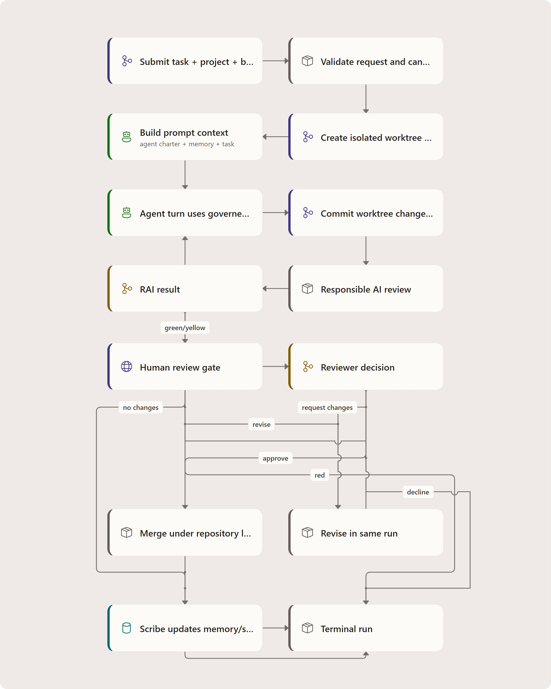
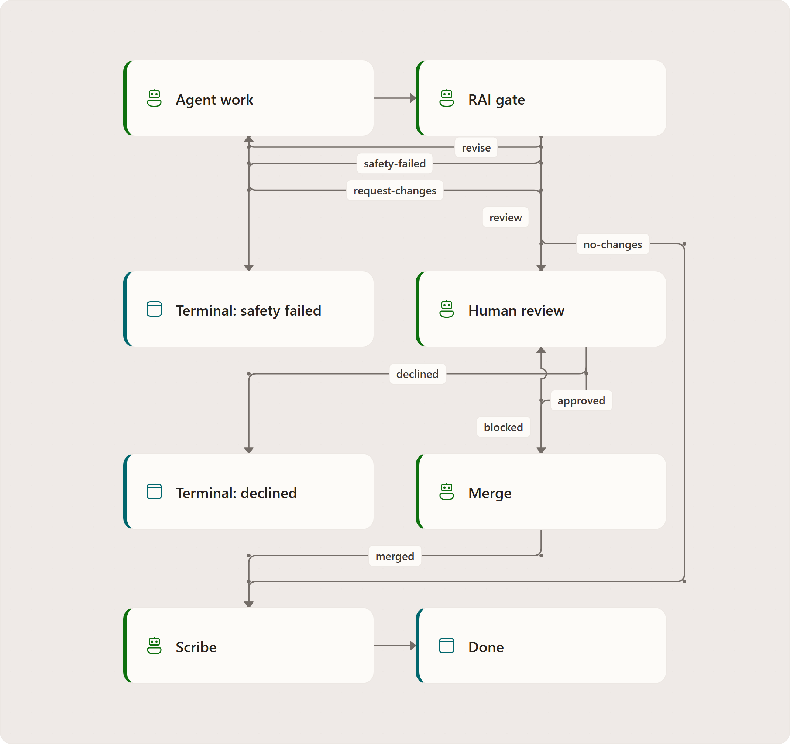
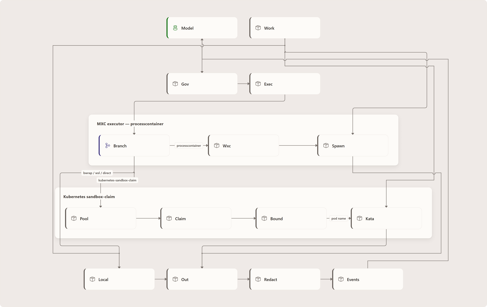

# System Overview — Conceptual Deep Dive

## Purpose and Mental Model

Agentweaver is a platform for running teams of AI agents on infrastructure the operator controls. It turns described work into a governed execution model. The platform generates or reuses roles, skills, and workflows. It isolates the work, records events, evaluates results, stops at configured gates, and preserves reusable learning. Software delivery has the deepest repository integration. The workflow model also supports content, product, operations, and organization-specific processes.

The easiest way to understand the system is to separate three concerns:

1. **Intent plane** — humans, the web UI, and MCP clients describe goals, inspect progress, answer questions, and approve or reject outcomes.
2. **Control plane** — the API owns durable state, workflow orchestration, permissions, events, review gates, recovery, merge coordination, and memory.
3. **Execution plane** — agent runtimes, model providers, git worktrees, and sandboxes do the actual work under policies chosen by the control plane.

This separation is deliberate. Models are useful but non-deterministic, so Agentweaver puts workflow authority in deterministic services. Persistent stores define truth. Workflow state determines the next eligible step. Review gates define who can approve. Merge locks control repository changes. Sandbox policy controls tool access. The platform governs the route toward an outcome. It does not claim that model outputs are deterministic.

<!-- Editable source: ../diagrams/src/00-system-overview-fig1.drawio.
     Export with pinned draw.io Desktop 31.4.5 using --spec 00-system-overview-fig1.
     Review lineage: ../diagrams/reviews/00-system-overview-fig1/iteration-manifest.json. -->

Repository workflows have identity, state, events, an isolated workspace, and review boundaries. Operator conversations are a distinct run type: they reuse durable identity/events but do not create a repository worktree or review/merge graph.

MCP clients reach a separately authenticated MCP resource server, which forwards broker-authorized
requests to the API. API web-role processes, worker-role processes, and remote AgentHost execution
are separate deployment boundaries; the static web host is not an API proxy.

## Architectural Responsibilities

### Thin clients, thick control plane

The web UI and MCP server are intentionally thin. They adapt user interactions into API calls, render state, and stream events, but they do not decide run state, workflow progression, or merge behavior. This keeps all clients consistent: approving a review through the browser and approving through an MCP tool should affect the same durable gate in the same way.

The API is the authority because it can combine information that no client should own alone: project configuration, run status, reviewer identity, workflow checkpoints, persistent events, worktree paths, merge locks, memory, and recovery jobs. If a process restarts, the API can reconstruct enough state to continue or safely expose a fallback decision path.

### Isolation before execution

Agentweaver assumes generated changes are untrusted until reviewed. A run therefore works in an isolated git worktree instead of directly on the target branch. The model sees tools that are scoped to that worktree, and command execution passes through a sandbox executor. This gives the system a clean unit of work: the diff between the original branch state and the worktree result.

This design has several advantages:

- The original branch remains untouched while the agent explores and edits.
- The review artifact is concrete: a diff, tree hash, and branch/worktree output.
- Failed or declined work can be discarded without contaminating the main workspace.
- Merge conflicts become explicit workflow states rather than hidden side effects.

The trade-off is operational complexity. Worktrees, locks, sandboxes, cleanup, and recovery all have to be managed. Agentweaver accepts that complexity because it is the price of making model-written repository changes auditable and reversible.

### Durable events plus live fan-out

A run is both a state machine and a story. Operators need the live story while it is happening, and recovery needs the durable story after restarts. Agentweaver therefore treats events as write-through: first persist the event, then fan it out to live subscribers.

The invariant is that the durable event log is the source of truth. The in-memory stream is a same-replica optimization; cross-replica watchers read from the shared `RunEvents` table by `Last-Event-ID` cursor. Source: `apps/Agentweaver.Api/Infrastructure/EfRunEventStream.cs:15`, `apps/Agentweaver.Api/Infrastructure/EfRunEventStream.cs:77`, `apps/Agentweaver.Api/Endpoints/RunEndpoints.cs:423`, `apps/Agentweaver.Api/Endpoints/RunEndpoints.cs:429`.

<!-- Shared editable source: ../diagrams/src/canonical-durable-event-stream-sequence.drawio.
     Exported by draw.io Desktop 31.4.5; shared owner maintains its review lineage. -->

This sequence describes the EF durable subscription. A replica with a local `RunStreamStore`
entry can instead serve an atomic snapshot and wait for local changes; it is not a universal
channel-publish phase inside `EfRunEventStream`.

### Human gates protect irreversible actions

Agentweaver distinguishes between reversible agent work and irreversible repository changes. Editing inside a worktree is reversible. Merging into the target branch is not. The workflow therefore stops at a human review gate before merge.

The review gate is not just a UI screen. Conceptually it is a resumable workflow port with a single pending decision. A valid reviewer can approve, request changes, or decline. The workflow consumes that decision exactly once and then moves forward. This prevents duplicated approvals, stale decisions, and accidental merges after restarts.

### Team memory closes the loop

Each run can teach the system something: a pattern, a decision, a constraint, a session summary, or a caution for future agents. Agentweaver stores those facts in a structured memory database and exports selected views into project-local `.squad` and context files. Future prompts can then include concise, project-specific knowledge instead of relying on model memory or chat history.

The important distinction is between **draft knowledge** and **accepted knowledge**. Agents can submit candidate decisions into an inbox. A Scribe or coordinator can later promote, reject, or export them. That gives the system a learning loop without letting every transient model observation become permanent project policy.

Where this lives: `apps/Agentweaver.Api`, `apps/Agentweaver.Mcp`, `apps/web`, `packages/Agentweaver.AgentRuntime`, `packages/Agentweaver.AgentTools`, `packages/Agentweaver.SandboxFs`, `packages/Agentweaver.SandboxExec`, `packages/Agentweaver.Squad`.

## Major Subsystems and How They Fit

| Subsystem | Problem it solves | Design logic |
| --- | --- | --- |
| API host | Centralizes orchestration, authorization, persistence, streaming, projects, memory, review, and merge behavior. | Keep authoritative state in one backend boundary so every client observes the same run lifecycle. |
| Web UI | Lets humans start work, watch progress, manage projects/teams, and review outcomes. | Keep presentation separate from orchestration; the UI renders backend truth rather than inventing its own workflow. |
| MCP host | Exposes Agentweaver capabilities to assistants and developer tools. | Make the same backend available to agentic clients without duplicating business logic. |
| Agent runtime | Converts workflow steps into model turns and governed tool calls. | Encapsulate model-provider mechanics behind a workflow interface so orchestration can reason in steps, gates, and outputs. |
| Agent tools | Provide file, search, edit, patch, shell, reporting, and escalation functions. | Give agents useful capabilities while keeping each capability policy-checkable. |
| Sandbox filesystem and execution | Prevent tool calls from escaping the intended workspace or running with unintended authority. | Layer policy checks: tool allowlists, path containment, symlink/reparse protection, and executor isolation. |
| Git/worktree services | Isolate changes and merge them safely. | Treat a run's output as a branchable, reviewable artifact with explicit merge coordination. |
| Team/casting engine | Creates and persists named agents, charters, blueprints, and team context. | Make roles explicit so multi-agent work is reproducible rather than ad hoc. |
| Memory and decisions | Stores reusable knowledge, current session context, and decision records. | Separate transient run output from durable project intelligence. |
| AKS deployment | Runs the platform with ingress, persistent storage, secrets, and isolated sandbox pods. | Split public services from execution sandboxes and externalize credentials/storage through cloud-native primitives. |

A rebuild should preserve the boundaries more than the exact classes. The crucial pattern is that external clients never directly operate on worktrees, memory files, or model sessions. They request intent changes from the API, and the API coordinates deterministic services around probabilistic model work.

## Single-Agent Run Lifecycle

This is the representative **full single-agent workflow**, not the public submission contract or the
trimmed coordinator-child graph. Public `POST /api/runs` is retired (410); new submissions use the
coordinator. The full graph can end merged, declined, failed, safety-flagged, or with no changes.

<!-- Editable source: ../diagrams/src/00-system-overview-fig2.drawio.
     Export with pinned draw.io Desktop 31.4.5 using --spec 00-system-overview-fig2.
     Review lineage: ../diagrams/reviews/00-system-overview-fig2/iteration-manifest.json. -->

### What each stage is for

1. **Submission and validation** make the task explicit and bind it to a repository, branch, project, requester, model source, and run options. This is the moment an ambiguous user intent becomes a durable run.
2. **Worktree creation** creates a private editing surface. From this point forward, agent file changes are isolated from the branch being protected.
3. **Context construction** gives the model only the operating instructions it needs: the task, optional named-agent charter, relevant memory, sandbox policy, and workflow expectations.
4. **Agent execution** lets the model inspect, edit, run commands, and ask questions through governed tools. The model does not get raw host authority; it gets mediated capabilities.
5. **Commit and diff production** freeze the agent's output into a reviewable artifact. A diff is easier to review, test, merge, and audit than a stream of individual edits.
6. **RAI review** acts as an automated quality and safety checkpoint. It can pass, require revision, or stop the run if the output is unacceptable.
7. **Human review** preserves human authority over repository changes. Even a passing RAI result does not merge by itself.
8. **Merge coordination** serializes writes to the target repository and turns conflicts into workflow outcomes instead of race conditions.
9. **Scribe** captures durable lessons after the outcome is known. It is best-effort because memory updates should enrich the system, not invalidate a completed merge.

### Key invariants

- A run should have one durable identity and one ordered event stream.
- Agent edits should happen inside the run workspace, not directly on the protected branch.
- The produced diff should be reviewed before merge.
- Review decisions should be consumed at most once.
- Merges should be serialized per repository.
- Memory/Scribe failures should not retroactively fail an otherwise completed run.

Where this lives: `apps/Agentweaver.Api/Runs`, `apps/Agentweaver.Api/Endpoints`, `apps/Agentweaver.Api/Workflows`, `packages/Agentweaver.AgentRuntime/Workflow`.

## Coordinator Run Lifecycle

A coordinator run exists for work that is too broad for one linear agent pass. It adds planning, dependency management, parallel child execution in isolated child worktrees, and collective assembly.

The key idea is to move from a vague goal to a confirmed contract before agents start editing. The coordinator first drafts an **OutcomeSpec**: desired outcome, scope, assumptions, and clarifying questions. A human can revise or confirm that spec. Only after confirmation does the system decompose work into a **WorkPlan**: subtasks, dependencies, assigned agents, isolation hints, and assembly strategy.

<!-- Exported from ../diagrams/src/canonical-coordinator-architecture.drawio with the
     Fluent draw.io template. Edit the source, invoke `docs-diagram-iterate`, then
     commit the regenerated PNG + .hash.txt. -->

### Why coordinator children do not each merge

Child runs are workers, not final approvers. They produce candidate branches and diffs, then stop at assemble-ready. They intentionally skip per-child RAI, human review, merge, and Scribe. The coordinator then assembles all child outputs into one integration branch and asks for one review of the whole change.

That design prevents a common multi-agent failure mode: independently "correct" child changes that conflict or form an incoherent whole. By reviewing and merging once, Agentweaver treats the user-visible outcome as the unit of approval.

### Dependency frontier model

The WorkPlan is a DAG. A subtask can run when all of its dependencies are done and its declared scope does not conflict with other subtasks being launched in the same frontier. This allows safe parallelism without pretending every task is independent.

The frontier model gives three useful properties:

- **Deterministic recovery** — after a restart, the system can recompute which subtasks are pending, running, failed, or ready for assembly.
- **Bounded parallelism** — only dependency-ready, non-conflicting work launches together.
- **Targeted rework** — if review requests changes, the coordinator can reset affected subtasks instead of discarding the entire plan.

### Coordinator invariants

- No child work starts until the OutcomeSpec is confirmed or unattended policy explicitly allows confirmation.
- A WorkPlan should be persisted before dispatch so recovery can resume from durable intent.
- Child runs should finish in assembly-ready states, not merge independently.
- Collective assembly should run RAI and human review on the aggregate diff.
- The coordinator should produce at most one final merge for the plan.

Where this lives: `apps/Agentweaver.Api/Coordinator`, `apps/Agentweaver.Api/Memory`, `apps/Agentweaver.Api/Runs`, `packages/Agentweaver.Domain`.

## Workflow Model

Agentweaver represents work as workflows rather than hard-coded endpoint scripts. Conceptually, a workflow is a graph of named nodes: agent turns, RAI checks, human gates, merge steps, Scribe steps, and terminals. Edges define how outputs move through the graph.

The default full workflow is intentionally conservative:

<!-- Shared editable source: ../diagrams/src/canonical-default-workflow.drawio.
     Follow the shared owner's review lineage; do not regenerate a competing copy. -->

The workflow abstraction matters because it gives project authors and future features a vocabulary for changing process without rewriting orchestration primitives. However, Agentweaver does not blindly execute arbitrary graph nodes. Runtime binding classifies nodes by supported type and gate semantics, then maps them to known executors. Unsupported nodes fail closed. That preserves extensibility without allowing a malformed workflow to bypass review, RAI, or merge policy.

Trade-off: workflow graphs add indirection. The payoff is that single-agent runs, coordinator child runs, and future project-authored workflows can share the same execution concepts while choosing different pipelines. For example, coordinator child runs use a trimmed agent-only pipeline because RAI, review, and merge happen later at collective assembly.

Where this lives: `apps/Agentweaver.Api/Workflows`, `apps/Agentweaver.Api/Runs`, `packages/Agentweaver.AgentRuntime/Workflow`.

## Data, State, and Recovery

Agentweaver stores several kinds of state because each answers a different recovery question.

| State kind | Question it answers | Conceptual owner |
| --- | --- | --- |
| Run rows | What work exists, who requested it, where is its workspace, and what is its current status? | Run store |
| Run events | What happened, in what order, and what should clients replay? | Event stream |
| Workflow checkpoints | If a workflow paused or the process restarted, where can execution resume? | Workflow runtime / API |
| Request ports / review gates | Is the system waiting for a human decision, and who may provide it? | Workflow gate services |
| Memory and decisions | What project knowledge should survive beyond this run? | Memory database |
| Coordinator specs/plans/subtasks | What was promised, how was it decomposed, and which work remains? | Coordinator persistence |
| Project/workspace records | Which repositories and defaults are known to the system? | Project services |

The recovery strategy follows from the separation of live and durable state. Live streams, in-memory workflow registrations, and active process handles are useful while the service is running, but the durable records must be sufficient to avoid lying to users after a restart. When the process comes back, recovery services can inspect run statuses, pending gates, child run outcomes, and persisted plans to decide whether to resume, expose a fallback action, or mark a run failed.

The most important invariant is monotonicity: once a durable event or state transition is recorded, clients should not observe a contradictory story later. Recovery may add compensating events, but it should not pretend earlier events never happened.

## Memory and Decision Flywheel

Agentweaver's memory system is a structured feedback loop:

<!-- Editable source: ../diagrams/src/00-system-overview-fig5.drawio.
     Export with pinned draw.io Desktop 31.4.5 using --spec 00-system-overview-fig5.
     Review lineage: ../diagrams/reviews/00-system-overview-fig5/iteration-manifest.json. -->

This loop separates three categories of knowledge:

- **Session context** — what is currently being worked on and what matters right now.
- **Agent memory** — reusable observations, patterns, and learnings scoped to an agent or shared through tags.
- **Decisions** — durable architectural, process, scope, or technical choices that should constrain future work.

The inbox is the safety valve. Low-risk, run-provenanced learning/pattern/update entries can be
promoted automatically by the post-run Scribe. Architectural and scope proposals remain pending
review. The context compiler applies trust filters and budgets; an exported file is not automatically
trusted policy.

Exports make memory portable. Instead of burying all context in a database, Agentweaver regenerates human-readable project artifacts such as decisions, pending inbox entries, agent history, current session context, and boundary/pattern files. A rebuild should preserve this bidirectional shape: structured database for correctness and queryability; file exports for transparency, review, and prompt context.

Where this lives: `apps/Agentweaver.Api/Memory`, `packages/Agentweaver.Squad/Memory`, `.squad`, `.agentweaver/context`.

## Sandbox and Tool Governance

Agentweaver treats every model tool call as a request, not a right. The governance stack is layered so a single missed check is less likely to become a workspace escape.

<!-- Generated from ../diagrams/src/canonical-sandbox-boundary.drawio as editable draw.io XML,
     then exported by the official draw.io Desktop CLI, replacing a Mermaid flowchart.
     Edit the JSON, then run `npm run docs:render-diagrams` and commit the
     regenerated PNG + .hash.txt. -->

Key concepts:

- **Default deny**: if a tool or operation is not recognized, it should not run.
- **Capability-specific validation**: file reads, searches, edits, patches, and shell commands need different checks.
- **Path containment**: paths must resolve inside the intended workspace, including protection against symlinks, junctions, and time-of-check/time-of-use tricks.
- **Executor isolation**: shell commands should run in a real sandbox unless the operator explicitly selected direct local execution.
- **AKS sandbox claims**: in Kubernetes, runs claim isolated sandbox capacity rather than executing commands inside the API container.

The trade-off is that some legitimate commands may need extra configuration or policy support. Agentweaver prefers that friction over silent privilege expansion.

Where this lives: `packages/Agentweaver.AgentTools`, `packages/Agentweaver.SandboxFs`, `packages/Agentweaver.SandboxExec`, `apps/Agentweaver.Api/Sandbox`, `k8s/base/sandbox-*`.

## Model Providers and Agent Roles

Agentweaver distinguishes between **workflow orchestration** and **model execution**. Workflow orchestration decides when an agent turn should happen, what context it receives, which tools are available, and what to do with its output. Model execution is the provider-specific mechanism for producing that turn.

The production worker path centers on a Copilot-backed workflow agent that can persist
session state, use registered tools, and stream progress. One-shot execution uses the
same GitHub Copilot SDK runner. Custom providers are configured through that SDK rather
than a separate provider-specific runner.

Named agents add another layer above providers. A role such as reviewer, planner, or specialist is defined by charter, memory, and assignment. The same model provider can behave differently depending on that role context. This is why casting and charters are first-class: they make team behavior reproducible.

## AKS Runtime Topology

In AKS, Agentweaver separates public services, persistent state, secrets, and sandbox execution.

The [shared AKS component map](../diagrams/canonical-aks-components.png) is the stable
replacement target. Its legacy image is not embedded here while the shared owner completes
publication approval. The obsolete API-single-writer/Data-PVC overview image is also withheld.
The deployment facts below, grounded in the current manifests, remain authoritative.

<!-- Pending shared canonical promotion: canonical-aks-components.
     Do not restore the retired overview embed or edit the foreign canonical here. -->

### Why the topology looks this way

- **Gateway routing** gives one public HTTPS entry point while keeping API, MCP, and frontend as independently deployable services.
- **PostgreSQL and durable leasing** let API and worker replicas scale without double-dispatching a run.
- **PostgreSQL plus a shared workspace volume** separate durable application rows from repository files; production application state is not a Data PVC.
- **Key Vault CSI** keeps secrets out of images and manifests while making them available to pods at runtime.
- **Warm sandbox capacity** reduces run startup latency while preserving per-run isolation.
- **Network policy** should start from deny-by-default and then open only DNS, ingress, app-internal, GitHub/provider, and MCP-to-API paths required for operation.

The production deployment uses PostgreSQL, two rolling API replicas, and two worker replicas. Worker autoscaling ranges from two to three replicas. Workspace PVC throughput, sandbox pool capacity, and model-provider rate limits remain the main scaling pressure points.

Where this lives: `k8s`, `scripts/azure`, `apps/Agentweaver.AgentHost`.

## Tech Stack Rationale

| Layer | Technology | Why it fits Agentweaver |
| --- | --- | --- |
| Backend services | .NET / ASP.NET Core | Strong fit for long-lived services, dependency injection, streaming endpoints, hosted recovery jobs, and typed domain models. |
| Workflow runtime | Microsoft Agents / MAF-style workflows | Provides a resumable graph model for agent turns, request ports, gates, and streaming execution. |
| Model providers | GitHub Copilot SDK | Supports GitHub-native agent work and custom-provider configuration through one governed runtime. |
| Persistence | PostgreSQL and provider-aware EF Core stores | Production uses PostgreSQL for durable, replica-safe state. SQLite remains available for local development. |
| Git operations | LibGit2Sharp-style repository APIs | Enables programmatic worktree, branch, diff, and merge operations without shelling out for every repository action. |
| Web UI | React, TypeScript, Vite, Fluent UI | Good fit for a live operational UI with review forms, timelines, project screens, and reusable Microsoft-style components. |
| MCP | Model Context Protocol over stdio/HTTP | Lets external assistants use Agentweaver as a tool surface while reusing API authorization and orchestration. |
| Sandbox governance | Agent Governance Toolkit plus custom policy backend | Combines a default-deny policy engine with Agentweaver-specific file and command semantics. |
| Sandbox execution | Local executors and Kubernetes sandbox claims | Supports developer machines and production AKS without changing the conceptual run contract. |
| AKS ingress and secrets | Gateway API, workload identity, Key Vault CSI | Uses cloud-native primitives for routing and secret delivery rather than embedding deployment-specific secrets in code. |
| Observability | Durable events, diagnostics endpoints, Azure Monitor | Makes the run timeline both user-visible and operator-debuggable. |

The common theme is pragmatic layering. Agentweaver uses simple local-first primitives where they reduce setup cost, then wraps them in boundaries that can be replaced when scale or deployment requirements grow.

## Glossary

| Term | Meaning |
| --- | --- |
| Agentweaver | The whole platform: API, web UI, MCP host, runtime, tools, sandboxing, memory, and deployment assets. |
| Run | Durable execution/conversation identity, status, and events; repository runs additionally carry worktree and output metadata. |
| Single-agent run | A full workflow with worktree, agent, RAI, human review, merge, and Scribe; not a promise of a public direct-submit route. |
| Coordinator run | A parent run that turns a goal into a confirmed OutcomeSpec, WorkPlan, child runs, assembly, review, merge, and Scribe. |
| OutcomeSpec | The human-confirmed contract for a coordinator run: desired outcome, scope, assumptions, and clarification state. |
| WorkPlan | The persisted DAG of coordinator subtasks, dependencies, assignments, isolation hints, and assembly status. |
| Subtask | One node in a WorkPlan, assigned to an agent and eventually represented by a child run. |
| DAG / frontier | The dependency graph and the set of currently runnable subtasks whose prerequisites are complete. |
| AssembleReady | The child-run terminal state meaning the child output is ready for collective coordinator assembly, not independently merged. |
| Collective assembly | The coordinator phase that integrates child outputs, reviews the aggregate diff, asks for one human decision, and merges once. |
| Worktree | An isolated git working directory for a run's changes. It protects the target branch until review and merge. |
| Sandbox | The execution boundary for model tools, including file containment and command isolation. |
| Blueprint | A reusable project/team template that can define roster, workflow, review, and sandbox expectations. |
| Casting | The process of selecting and persisting named agents, roles, charters, and team context for a project. |
| Charter | Role-specific instructions for a named agent, injected into that agent's run context. |
| MCP | Model Context Protocol surface that lets external assistants call Agentweaver capabilities. |
| RAI | Responsible AI review step that evaluates produced diffs and can pass, request revision, or block. |
| Scribe | Best-effort post-run memory keeper that updates session context, promotes or records learnings, and exports memory artifacts. |
| Decision inbox | Holding area for proposed decisions before they become accepted project memory. |
| Review gate | Human-in-the-loop workflow pause where an authorized reviewer approves, requests changes, or declines. |
| Memory export | Regeneration of human-readable project context files from structured memory and decision records. |

## Known limitations and scope

- Agentweaver ships a default embedded workflow and loads additional catalog and project workflows separately. The workflow model and the default pipeline are documented here; individual embedded catalog workflow resources are defined alongside their projects.
- The control plane is a single authoritative backend even though AKS deploys API, MCP, and frontend as separate processes. API and run orchestration remain the single source of truth; MCP and frontend are thin client-facing processes that render and forward backend state.

<!-- diagram-context:canonical-default-workflow:start -->

Diagram details and constraints

<table><thead><tr><th>Element</th><th>Contract</th></tr></thead><tbody>
<tr><td>title</td><td>Generic default workflow</td></tr>
<tr><td>subtitle</td><td>Built-in template • merge → PR publication → Scribe</td></tr>
<tr><td>returns-heading</td><td>SOURCE / RETURN</td></tr>
<tr><td>outcomes-heading</td><td>OUTCOMES</td></tr>
<tr><td>footer</td><td>PR action can skip / fail and still reach Scribe. No-changes also reaches Scribe.</td></tr>
<tr><td>Agent work</td><td>Agent</td></tr>
<tr><td>Agent work</td><td>Agent task</td></tr>
<tr><td>Agent work</td><td>agent</td></tr>
<tr><td>RAI gate</td><td>Rai</td></tr>
<tr><td>RAI gate</td><td>Verdict routing</td></tr>
<tr><td>RAI gate</td><td>rai</td></tr>
<tr><td>Human review</td><td>Review</td></tr>
<tr><td>Human review</td><td>human-review</td></tr>
<tr><td>Merge</td><td>Merge</td></tr>
<tr><td>Merge</td><td>Merge outcome routing</td></tr>
<tr><td>Merge</td><td>merge</td></tr>
<tr><td>Publish / reuse PR</td><td>Publish / reuse PR</td></tr>
<tr><td>Publish / reuse PR</td><td>Create / reuse; not git push</td></tr>
<tr><td>Publish / reuse PR</td><td>action</td></tr>
<tr><td>Scribe</td><td>Scribe</td></tr>
<tr><td>Scribe</td><td>Record the run outcome</td></tr>
<tr><td>Scribe</td><td>scribe</td></tr>
<tr><td>Safety failed</td><td>Safety failed</td></tr>
<tr><td>Safety failed</td><td>Workflow endpoint</td></tr>
<tr><td>Declined</td><td>Declined</td></tr>
<tr><td>Done</td><td>Done</td></tr>
<tr><td>edge-02-label</td><td>revise</td></tr>
<tr><td>edge-03-label</td><td>safety- failed</td></tr>
<tr><td>edge-04-label</td><td>no- changes</td></tr>
<tr><td>edge-05-label</td><td>review</td></tr>
<tr><td>edge-06-label</td><td>approved</td></tr>
<tr><td>edge-07-label</td><td>request-changes</td></tr>
<tr><td>edge-08-label</td><td>declined</td></tr>
<tr><td>edge-09-label</td><td>merged</td></tr>
<tr><td>edge-10-label</td><td>blocked</td></tr>
</tbody></table>

<!-- diagram-context:canonical-default-workflow:end -->

<!-- diagram-context:00-system-overview-fig1:start -->

Diagram details and constraints

<table><thead><tr><th>Element</th><th>Contract</th></tr></thead><tbody>
<tr><td>title</td><td>Agentweaver · boundaries, not one process</td></tr>
<tr><td>takeaway</td><td>Intent enters through API or MCP; execution and durable state have separate owners.</td></tr>
<tr><td>group-0-title</td><td>INTENT / CONTROL</td></tr>
<tr><td>group-1-title</td><td>EXECUTION / STATE</td></tr>
<tr><td>Browser / Web host</td><td>Browser / Web host</td></tr>
<tr><td>Browser / Web host</td><td>SPA assets and API requests</td></tr>
<tr><td>Browser / Web host</td><td>Web serves files; /docs redirects externally</td></tr>
<tr><td>Browser / Web host</td><td>Web/Program.cs:39–65</td></tr>
<tr><td>API web role</td><td>API web role</td></tr>
<tr><td>API web role</td><td>Endpoint-classified authority</td></tr>
<tr><td>API web role</td><td>Entra / broker auth + resource-specific roles</td></tr>
<tr><td>API web role</td><td>Program.cs:1274–1295</td></tr>
<tr><td>MCP host</td><td>MCP host</td></tr>
<tr><td>MCP host</td><td>Validate broker JWT</td></tr>
<tr><td>MCP host</td><td>Tool calls forward the same accepted bearer</td></tr>
<tr><td>MCP host</td><td>McpBrokerAuthenticationHandler</td></tr>
<tr><td>Worker role</td><td>Worker role</td></tr>
<tr><td>Worker role</td><td>Shared application code</td></tr>
<tr><td>Worker role</td><td>Probes only; registrations are not all role-gated</td></tr>
<tr><td>Worker role</td><td>Program.cs:1255–1264</td></tr>
<tr><td>Run orchestration</td><td>Run orchestration</td></tr>
<tr><td>Run orchestration</td><td>MAF graphs + service drivers</td></tr>
<tr><td>Run orchestration</td><td>Full runs, trimmed children and collective phase</td></tr>
<tr><td>Run orchestration</td><td>RunWorkflowFactory / Coordinator</td></tr>
<tr><td>AgentHost leaf</td><td>AgentHost leaf</td></tr>
<tr><td>AgentHost leaf</td><td>Governed remote agent execution</td></tr>
<tr><td>AgentHost leaf</td><td>One-shot work; Operator uses per-turn broker</td></tr>
<tr><td>AgentHost leaf</td><td>RemoteOperatorAssistantAgent</td></tr>
<tr><td>PostgreSQL</td><td>PostgreSQL</td></tr>
<tr><td>PostgreSQL</td><td>Shared EF operational state</td></tr>
<tr><td>PostgreSQL</td><td>Events, checkpoints and CAS leases</td></tr>
<tr><td>PostgreSQL</td><td>Program.cs:1026–1075</td></tr>
<tr><td>Workspace + worktrees</td><td>Workspace + worktrees</td></tr>
<tr><td>Workspace + worktrees</td><td>Files are not the database</td></tr>
<tr><td>Workspace + worktrees</td><td>Each child owns its branch and Git index</td></tr>
<tr><td>Workspace + worktrees</td><td>RunOrchestrator.cs:277–317</td></tr>
<tr><td>Browser / Web host</td><td>REST / SSE</td></tr>
<tr><td>MCP host</td><td>broker</td></tr>
<tr><td>API web role</td><td>delegate</td></tr>
<tr><td>Run orchestration</td><td>execute</td></tr>
<tr><td>Run orchestration</td><td>persist</td></tr>
<tr><td>AgentHost leaf</td><td>worktree</td></tr>
<tr><td>scope</td><td>Deployment roles ≠ exclusive orchestration ownership. Operator history is not a MAF run graph.</td></tr>
<tr><td>groups</td><td>INTENT / CONTROL; EXECUTION / STATE</td></tr>
</tbody></table>

<!-- diagram-context:00-system-overview-fig1:end -->

<!-- diagram-context:00-system-overview-fig2:start -->

Diagram details and constraints

<table><thead><tr><th>Element</th><th>Contract</th></tr></thead><tbody>
<tr><td>title</td><td>Full single-agent run · representative lifecycle</td></tr>
<tr><td>takeaway</td><td>Safety, review and merge outcomes branch; coordinator children use a trimmed graph.</td></tr>
<tr><td>group-0-title</td><td>EXECUTION + SAFETY</td></tr>
<tr><td>group-1-title</td><td>REVIEW + OUTCOME</td></tr>
<tr><td>Accepted run</td><td>Accepted run</td></tr>
<tr><td>Accepted run</td><td>Provider / capability validation</td></tr>
<tr><td>Accepted run</td><td>Create worktree, persist InProgress and charter</td></tr>
<tr><td>Accepted run</td><td>RunOrchestrator:164–255</td></tr>
<tr><td>Agent turn</td><td>Agent turn</td></tr>
<tr><td>Agent turn</td><td>Project context + task</td></tr>
<tr><td>Agent turn</td><td>Compose AgentTurnInput; execute workflow</td></tr>
<tr><td>Rai safety</td><td>Rai safety</td></tr>
<tr><td>Rai safety</td><td>Inspect the successful turn</td></tr>
<tr><td>Rai safety</td><td>Revision required below cap → agent again</td></tr>
<tr><td>Rai safety</td><td>GraphBinder:335–426</td></tr>
<tr><td>Human review</td><td>Human review</td></tr>
<tr><td>Human review</td><td>Nonempty diff, no further Rai revision</td></tr>
<tr><td>Human review</td><td>Approve / request changes / decline</td></tr>
<tr><td>Empty diff result</td><td>Empty diff result</td></tr>
<tr><td>Empty diff result</td><td>Flagged versus unflagged</td></tr>
<tr><td>Empty diff result</td><td>Flagged → safety-failed; unflagged → Scribe</td></tr>
<tr><td>Merge attempt</td><td>Merge attempt</td></tr>
<tr><td>Merge attempt</td><td>Approval uses saved merge data</td></tr>
<tr><td>Merge attempt</td><td>Blocked → review; any nonblocked → Scribe</td></tr>
<tr><td>Scribe</td><td>Scribe</td></tr>
<tr><td>Scribe</td><td>Record nonblocked outcome</td></tr>
<tr><td>Scribe</td><td>Includes terminal merge failure; append memory</td></tr>
<tr><td>Watch loop / terminal</td><td>Watch loop / terminal</td></tr>
<tr><td>Watch loop / terminal</td><td>Output determines persisted state</td></tr>
<tr><td>Watch loop / terminal</td><td>Decline and safety-failed bypass Scribe</td></tr>
<tr><td>Watch loop / terminal</td><td>RunWatchLoopService:595–681</td></tr>
<tr><td>Accepted run</td><td>launch</td></tr>
<tr><td>Agent turn</td><td>turn output</td></tr>
<tr><td>Rai safety</td><td>no revision</td></tr>
<tr><td>Rai safety</td><td>empty</td></tr>
<tr><td>Human review</td><td>approve</td></tr>
<tr><td>Empty diff result</td><td>unflagged</td></tr>
<tr><td>Merge attempt</td><td>nonblocked</td></tr>
<tr><td>Scribe</td><td>output</td></tr>
<tr><td>scope</td><td>Branch labels inside cards are explicit exits, not hidden arrows. POST /api/runs is retired (410).</td></tr>
<tr><td>groups</td><td>EXECUTION + SAFETY; REVIEW + OUTCOME</td></tr>
</tbody></table>

<!-- diagram-context:00-system-overview-fig2:end -->

<!-- diagram-context:00-system-overview-fig5:start -->

Diagram details and constraints

<table><thead><tr><th>Element</th><th>Contract</th></tr></thead><tbody>
<tr><td>title</td><td>Memory · promotion before reuse</td></tr>
<tr><td>takeaway</td><td>Only eligible, approved context returns to prompts; exported files are mirrors, not policy.</td></tr>
<tr><td>group-0-title</td><td>CAPTURE / PROMOTION</td></tr>
<tr><td>group-1-title</td><td>COMMITTED STATE / USE</td></tr>
<tr><td>Agent observation</td><td>Agent observation</td></tr>
<tr><td>Agent observation</td><td>Submit pending decision</td></tr>
<tr><td>Agent observation</td><td>Attach project, agent and run provenance</td></tr>
<tr><td>Agent observation</td><td>DecisionsEndpoints:125–143</td></tr>
<tr><td>Decision inbox</td><td>Decision inbox</td></tr>
<tr><td>Decision inbox</td><td>Unapproved observation</td></tr>
<tr><td>Decision inbox</td><td>No automatic authority from submission</td></tr>
<tr><td>Post-run Scribe</td><td>Post-run Scribe</td></tr>
<tr><td>Post-run Scribe</td><td>Select eligible run entries</td></tr>
<tr><td>Post-run Scribe</td><td>Same project + agent + run + time window</td></tr>
<tr><td>Post-run Scribe</td><td>PostRunScribeService:25–150</td></tr>
<tr><td>Approved active state</td><td>Approved active state</td></tr>
<tr><td>Approved active state</td><td>Low-risk learning / pattern / update</td></tr>
<tr><td>Approved active state</td><td>Auto-promotion; architecture / scope stay pending</td></tr>
<tr><td>Current open session</td><td>Current open session</td></tr>
<tr><td>Current open session</td><td>Append the run summary</td></tr>
<tr><td>Current open session</td><td>Session continuity, not blanket policy adoption</td></tr>
<tr><td>Context compiler</td><td>Context compiler</td></tr>
<tr><td>Context compiler</td><td>Trust filters + memory budgets</td></tr>
<tr><td>Context compiler</td><td>Approved architecture/scope + eligible memories</td></tr>
<tr><td>Context compiler</td><td>MemoryContextCompiler:55–160</td></tr>
<tr><td>Workspace mirrors</td><td>Workspace mirrors</td></tr>
<tr><td>Workspace mirrors</td><td>Exporter refreshes committed memory</td></tr>
<tr><td>Workspace mirrors</td><td>One-way export; not an automatic trust input</td></tr>
<tr><td>Subsequent prompt</td><td>Subsequent prompt</td></tr>
<tr><td>Subsequent prompt</td><td>Include selected context</td></tr>
<tr><td>Subsequent prompt</td><td>Child prompts use the decisions-only variant</td></tr>
<tr><td>Agent observation</td><td>submit</td></tr>
<tr><td>Decision inbox</td><td>eligible</td></tr>
<tr><td>Post-run Scribe</td><td>low-risk only</td></tr>
<tr><td>Post-run Scribe</td><td>append</td></tr>
<tr><td>Approved active state</td><td>approved</td></tr>
<tr><td>Current open session</td><td>session</td></tr>
<tr><td>Current open session</td><td>export</td></tr>
<tr><td>Context compiler</td><td>compile</td></tr>
<tr><td>scope</td><td>Architecture and scope proposals require coordinator review. An observation alone is never trusted policy.</td></tr>
<tr><td>groups</td><td>CAPTURE / PROMOTION; COMMITTED STATE / USE</td></tr>
</tbody></table>

<!-- diagram-context:00-system-overview-fig5:end -->

<!-- diagram-context:canonical-aks-components:start -->

Diagram details and constraints

<table><thead><tr><th>Element</th><th>Contract</th></tr></thead><tbody>
<tr><td>title</td><td>AKS separates control from execution</td></tr>
<tr><td>takeaway</td><td>Replicated API and workers share durable services; AgentHost pods execute isolated turns.</td></tr>
<tr><td>group-title0</td><td>APPLICATION CONTROL</td></tr>
<tr><td>group-title1</td><td>EXECUTION / DURABLE STATE</td></tr>
<tr><td>Application ingress</td><td>Application ingress</td></tr>
<tr><td>Application ingress</td><td>Frontend deployment</td></tr>
<tr><td>Application ingress</td><td>AKS App Routing Gateway</td></tr>
<tr><td>Application ingress</td><td>Frontend: 2 replicas</td></tr>
<tr><td>Application ingress</td><td>Preview gateway separate</td></tr>
<tr><td>API deployment</td><td>API deployment</td></tr>
<tr><td>API deployment</td><td>Request and run control</td></tr>
<tr><td>API deployment</td><td>2 API replicas</td></tr>
<tr><td>API deployment</td><td>Postgres + CSI secrets</td></tr>
<tr><td>API deployment</td><td>Shared workspace mount</td></tr>
<tr><td>MCP deployment</td><td>MCP deployment</td></tr>
<tr><td>MCP deployment</td><td>Broker-authenticated tools</td></tr>
<tr><td>MCP deployment</td><td>1 MCP replica</td></tr>
<tr><td>MCP deployment</td><td>Forwards requests to API</td></tr>
<tr><td>MCP deployment</td><td>No CSI secret mount</td></tr>
<tr><td>Worker deployment</td><td>Worker deployment</td></tr>
<tr><td>Worker deployment</td><td>Background orchestration</td></tr>
<tr><td>Worker deployment</td><td>2 baseline replicas</td></tr>
<tr><td>Worker deployment</td><td>HPA scales from 2 to 3</td></tr>
<tr><td>AgentHost pods</td><td>AgentHost pods</td></tr>
<tr><td>AgentHost pods</td><td>SandboxClaim warm pool</td></tr>
<tr><td>AgentHost pods</td><td>Per-run /configure</td></tr>
<tr><td>AgentHost pods</td><td>Kata-isolated agent turns</td></tr>
<tr><td>AgentHost pods</td><td>No ambient user secrets</td></tr>
<tr><td>Durable services</td><td>Durable services</td></tr>
<tr><td>Durable services</td><td>Postgres + Azure Files</td></tr>
<tr><td>Durable services</td><td>Run state / events in DB</td></tr>
<tr><td>Durable services</td><td>RWX project workspace</td></tr>
<tr><td>Durable services</td><td>Key Vault via API/worker CSI</td></tr>
<tr><td>relation-0</td><td>1 HTTPS</td></tr>
<tr><td>relation-1</td><td>2 API tools</td></tr>
<tr><td>relation-2</td><td>3 persist / mount</td></tr>
<tr><td>relation-3</td><td>4 persist / mount</td></tr>
<tr><td>relation-4</td><td>5 claim + dispatch</td></tr>
<tr><td>assurance</td><td>Application and preview Gateways are separate. AgentHost has no Key Vault-role identity or CSI secret mount.</td></tr>
<tr><td>assurance-0-label</td><td>Azure AKS environment</td></tr>
<tr><td>assurance-0-fact</td><td>GatewayClass: approuting-istio.</td></tr>
<tr><td>assurance-0-source</td><td>gateway.yaml</td></tr>
<tr><td>assurance-1-label</td><td>Manifest facts</td></tr>
<tr><td>assurance-1-fact</td><td>Worker HPA is CPU-based, 2–3.</td></tr>
<tr><td>assurance-1-source</td><td>worker-hpa.yaml</td></tr>
<tr><td>assurance-2-label</td><td>Distinct identities</td></tr>
<tr><td>assurance-2-fact</td><td>AgentHost has no Key Vault role.</td></tr>
<tr><td>assurance-2-source</td><td>serviceaccount-agenthost.yaml</td></tr>
<tr><td>n0</td><td>AKS App Routing Gateway; Frontend: 2 replicas</td></tr>
<tr><td>n1</td><td>2 API replicas; Postgres + CSI secrets</td></tr>
<tr><td>n2</td><td>1 MCP replica; Forwards requests to API</td></tr>
<tr><td>n3</td><td>2 baseline replicas; HPA scales from 2 to 3</td></tr>
<tr><td>n4</td><td>Per-run /configure; Kata-isolated agent turns</td></tr>
<tr><td>n5</td><td>Run state / events in DB; RWX project workspace</td></tr>
<tr><td>groups</td><td>APPLICATION CONTROL; EXECUTION / DURABLE STATE</td></tr>
</tbody></table>

<!-- diagram-context:canonical-aks-components:end -->

<!-- diagram-context:canonical-durable-event-stream-sequence:start -->

Diagram details and constraints

<table><thead><tr><th>Element</th><th>Contract</th></tr></thead><tbody>
<tr><td>notes</td><td>LOOP · repeat durable reads; idle wait = 250 ms; Drain the whole batch before terminal close. Retryable assembly_blocked is not terminal.; Explicit-sequence reuse is idempotent only for matching type/payload. SQLite live channels are a separate lane.</td></tr>
</tbody></table>

<!-- diagram-context:canonical-durable-event-stream-sequence:end -->

<!-- diagram-context:canonical-sandbox-boundary:start -->

Diagram details and constraints

<table><thead><tr><th>Element</th><th>Contract</th></tr></thead><tbody>
<tr><td>title</td><td>Several checks contain each action</td></tr>
<tr><td>takeaway</td><td>Native shell is denied; governed tools combine AGT policy, direct containment and execution isolation.</td></tr>
<tr><td>group-title0</td><td>TOOL SELECTION / POLICY</td></tr>
<tr><td>group-title1</td><td>POINT-OF-USE CONTAINMENT</td></tr>
<tr><td>Model tool request</td><td>Model tool request</td></tr>
<tr><td>Model tool request</td><td>Permission dispatch</td></tr>
<tr><td>Model tool request</td><td>Native shell: always denied</td></tr>
<tr><td>Model tool request</td><td>URL approvals handled apart</td></tr>
<tr><td>Model tool request</td><td>Custom reporting bypass</td></tr>
<tr><td>Governance</td><td>Governance</td></tr>
<tr><td>Governance</td><td>Deny-by-default policy</td></tr>
<tr><td>Governance</td><td>AGT policy must allow</td></tr>
<tr><td>Governance</td><td>Direct backend must allow</td></tr>
<tr><td>Governance</td><td>Both checks, not either</td></tr>
<tr><td>Registered tools</td><td>Registered tools</td></tr>
<tr><td>Registered tools</td><td>Explicit capability surface</td></tr>
<tr><td>Registered tools</td><td>Files revalidate at use</td></tr>
<tr><td>Registered tools</td><td>run_command gates shell</td></tr>
<tr><td>Registered tools</td><td>Unknown tools denied</td></tr>
<tr><td>Workspace boundary</td><td>Workspace boundary</td></tr>
<tr><td>Workspace boundary</td><td>Sandbox filesystem</td></tr>
<tr><td>Workspace boundary</td><td>Lexical + real-path checks</td></tr>
<tr><td>Workspace boundary</td><td>Reject symlink escapes</td></tr>
<tr><td>Workspace boundary</td><td>Bounded / redacted output</td></tr>
<tr><td>Execution boundary</td><td>Execution boundary</td></tr>
<tr><td>Execution boundary</td><td>Selected isolation backend</td></tr>
<tr><td>Execution boundary</td><td>Shell policy + approval</td></tr>
<tr><td>Execution boundary</td><td>Kata pod in AKS</td></tr>
<tr><td>Execution boundary</td><td>Direct mode is opt-in</td></tr>
<tr><td>Credential handling</td><td>Credential handling</td></tr>
<tr><td>Credential handling</td><td>Current implementation</td></tr>
<tr><td>Credential handling</td><td>Host + tool options hold token</td></tr>
<tr><td>Credential handling</td><td>Direct git status / allowed gh</td></tr>
<tr><td>Credential handling</td><td>No blanket shell injection</td></tr>
<tr><td>relation-0</td><td>1 governed calls</td></tr>
<tr><td>relation-1</td><td>2 both allow</td></tr>
<tr><td>relation-2</td><td>3 file operation</td></tr>
<tr><td>relation-3</td><td>4 run_command</td></tr>
<tr><td>relation-4</td><td>5 eligible git / gh</td></tr>
<tr><td>assurance</td><td>Current code delivers repository credentials into Host/tool options; the normative no-credential contract is NOT met.</td></tr>
<tr><td>assurance-0-label</td><td>Dispatch exceptions</td></tr>
<tr><td>assurance-0-fact</td><td>Native shell denied; URL path separate.</td></tr>
<tr><td>assurance-0-source</td><td>CopilotAIAgent.cs</td></tr>
<tr><td>assurance-1-label</td><td>Execution isolation</td></tr>
<tr><td>assurance-1-fact</td><td>Sidecar: separate PID namespace.</td></tr>
<tr><td>assurance-1-source</td><td>sandbox-template-agenthost.yaml</td></tr>
<tr><td>assurance-2-label</td><td>Credential reality</td></tr>
<tr><td>assurance-2-fact</td><td>No blanket shell credential inheritance.</td></tr>
<tr><td>assurance-2-source</td><td>RunCommandTool.cs</td></tr>
<tr><td>n0</td><td>Native shell: always denied; URL approvals handled apart</td></tr>
<tr><td>n1</td><td>AGT policy must allow; Direct backend must allow</td></tr>
<tr><td>n2</td><td>Files revalidate at use; run_command gates shell</td></tr>
<tr><td>n3</td><td>Lexical + real-path checks; Reject symlink escapes</td></tr>
<tr><td>n4</td><td>Shell policy + approval; Kata pod in AKS</td></tr>
<tr><td>n5</td><td>Host + tool options hold token; Direct git status / allowed gh</td></tr>
<tr><td>groups</td><td>TOOL SELECTION / POLICY; POINT-OF-USE CONTAINMENT</td></tr>
</tbody></table>

<!-- diagram-context:canonical-sandbox-boundary:end -->
