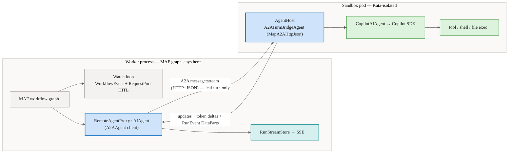
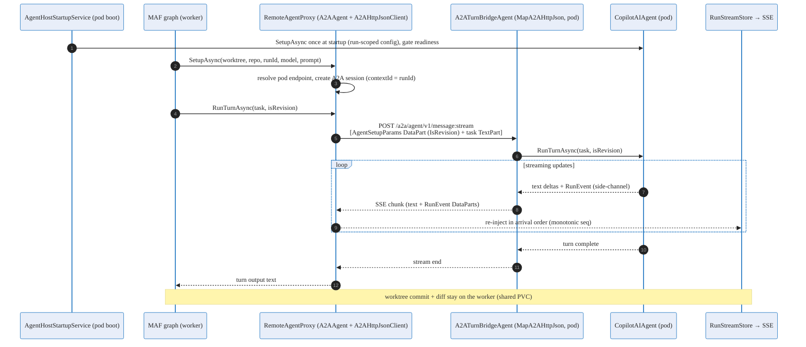
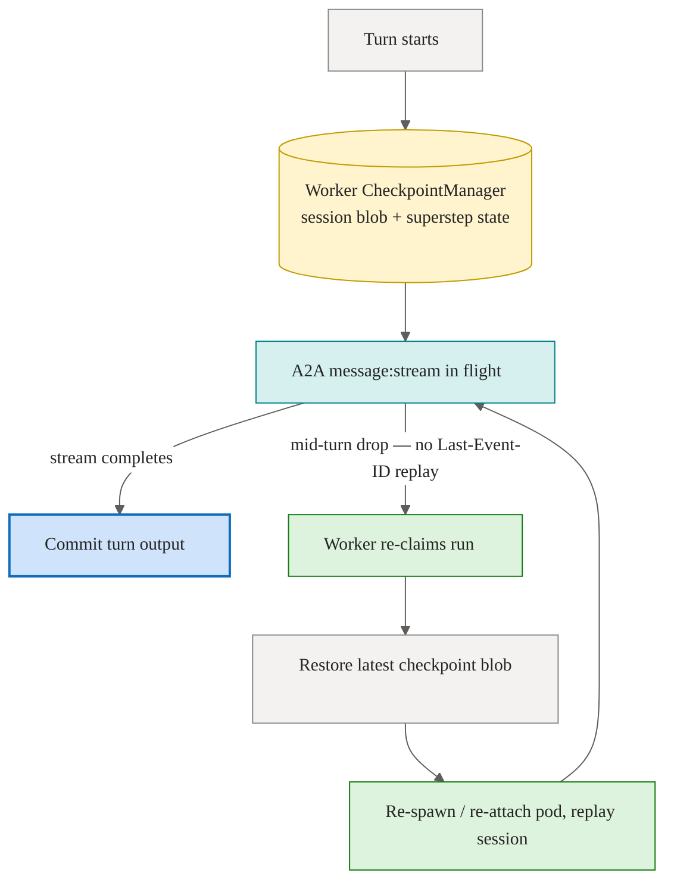

# A2A Transport & the MAF Bridge — Conceptual Deep Dive

::: warning Experimental
The A2A transport runs on the `Microsoft.Agents.AI.A2A` / `Microsoft.Agents.AI.Hosting.A2A` package line, which is `-preview` at every published version. It sits on the agent-execution hot path, mitigated by exact version+hash pinning and an instant rollback flag (`Sandbox:AgentExecutionMode=in-api`). Treat the surface as subject to change until the A2A line reaches GA.
:::

This deep dive explains how Agentweaver moves a single agent **turn** out of the worker process and into an isolated sandbox pod without changing how the rest of the system thinks about that turn. The goal is to describe the design as rebuildable ideas: an engineer who has never seen Agentweaver should be able to reconstruct the same behavior from reasoning alone.

The transport is **A2A** (Agent2Agent), the .NET Agent Framework's standardized agent-to-agent protocol. The bridge that uses it is deliberately thin, and most of its power comes from *where* it cuts the system, not from any clever protocol work.

For the surface-level catalogue (endpoints, package names, the H1–H7 security gates), see the [A2A reference](../reference/a2a.md). For how distributed execution feels to a user or operator, see [Distributed agents over A2A](../experience/a2a-distributed-agents.md). For the pod lifecycle around the bridge, see [Sandbox pod execution](./sandbox-pod-execution.md) and its [reference](../reference/sandbox-pods.md). For the broader east-west picture, see [Agent communication](./agent-communication.md).

## 1. The mental model: cut at the leaf, not the graph

Agentweaver runs a MAF (Microsoft Agent Framework) **workflow graph** for every run. The graph is the orchestration: it sequences executors, raises events, and suspends on human-in-the-loop gates. At the bottom of that graph is a single **leaf**: the agent turn — one `AIAgent` doing one unit of model work (the `CopilotAIAgent` wrapping the GitHub Copilot SDK session).

The central design choice is **where to introduce the process boundary**. There are two candidates:

- **Remote the graph.** Ship the whole MAF workflow — events, gates, supersteps — across the wire. This forces a translation layer between MAF's typed event model and whatever the transport understands.
- **Remote the leaf.** Keep the entire graph in the worker. Replace only the leaf `AIAgent` with a proxy that forwards a single turn to a pod and streams the result back.

Agentweaver remotes the **leaf**. This is the decision that makes everything else simple. Because the cut is at the `AIAgent` seam:

- The MAF workflow graph — and **all** of its `WorkflowEvent` and `RequestPort` logic (the review/HITL gates) — stays entirely in the worker.
- Those typed events (executor-invoked, executor-completed, request-info) are emitted by the graph *around* the leaf, so they **never cross the wire**.
- There is therefore **no MAF↔A2A translation layer**. A2A's task state machine (`submitted` / `working` / `input-required` / `completed`) is simply not in the path, because only the leaf's chat-style streaming response travels.

The crux question for any remoting design — "does the transport flatten our rich, typed event stream?" — is **avoided by construction**. Only the leaf agent's `AgentRunResponseUpdate` stream crosses, and that is exactly what A2A's streaming message surface carries natively.

## 2. The two halves of the bridge

The bridge is a pair of components on either side of the A2A wire.

### RemoteAgentProxy (worker side)

`RemoteAgentProxy` is an `AIAgent`. It is a **drop-in replacement** for the concrete leaf agent the worker's turn executor used to hold directly. The executor still calls the same surface — set up the agent, run the turn, stream updates — and never learns that the agent is now remote. Instead of holding a heavy Copilot SDK session, the proxy forwards each call over A2A and **re-emits** the pod's event and token-delta stream locally, so the rest of the worker graph (and the SSE relay to the browser) is unchanged.

In code this proxy is `RemoteAgentProxy : IWorkflowTurnAgent`. It is realized by the framework-native A2A client — a `Microsoft.Agents.AI.A2A.A2AAgent` wrapping an `A2AHttpJsonClient` — rather than a bespoke HTTP proxy. The transport is A2A's **HTTP+JSON** profile (`MapA2AHttpJson` on the host, `A2AHttpJsonClient` on the worker), **not** JSON-RPC: the two A2A client transports are not interchangeable, and the JSON-RPC `A2AClient` would 404 against the HTTP+JSON routes. The only thing Agentweaver writes is a thin adapter that maps its turn-setup parameters (`AgentSetupParams`: worktree, repo, run id, model id, system prompt, project/agent identity, API broker URL/key, user id, and the per-turn `IsRevision` flag) onto the A2A message — encoded as the first `DataContent` part of the turn message, not a separate init call. `RemoteWorkflowAgentFactory` returns a `RemoteAgentProxy` for **all four** workflow roles (worker, RAI, Rubberduck, Scribe); the proxy holds **no** `ICheckpointStore` and the pod has **no** database connection.

### AgentHost (server side, in-pod)

`Agentweaver.AgentHost` is a minimal per-run process baked into the sandbox image. It does **not** run a MAF graph. It hosts a singleton `CopilotAIAgent`, but it does not expose it directly: the agent registered with the A2A server is `A2ATurnBridgeAgent` (a `DelegatingAIAgent` whose MAF name is `agentweaver-pod`), wired via `builder.AddAIAgent(name, factory, Singleton).AddA2AServer(...)` and mounted with `app.MapA2AHttpJson(builder, A2APath)`. The default path is `/a2a/agent`, so it exposes exactly two HTTP endpoints — `POST /a2a/agent/v1/message:stream` and `GET /a2a/agent/v1/card` — on port `8088` by default.

The bridge exists to close two gaps a direct `CopilotAIAgent` registration would leave open:

- **Inbound:** it decodes the inbound message's first `AgentSetupParams` `DataPart` and forwards its `IsRevision` flag into `CopilotAIAgent.RunTurnAsync`, so a revision turn resumes the session instead of starting fresh.
- **Outbound:** it installs a per-turn channel as the runner's stream writer and re-emits each pod-side `RunEvent` back over A2A as a `DataContent` part, interleaved with the assistant text.

The **run-scoped** setup — provisioning the real Copilot session, governance, and working directory — runs **once at pod startup**: `AgentHostStartupService` reads `AgentHostOptions` (injected as env vars at claim time), calls `CopilotAIAgent.SetupAsync` to completion, and only then flips a readiness flag. Until that flag is set, the listener returns `503` (with a `/healthz` liveness probe). The bridge never re-runs `SetupAsync`; it only swaps the per-turn stream writer and passes the per-turn `isRevision`. All tool, shell, and file execution happens **inside** the pod, where it is already Kata-isolated.

MAF therefore stays **in-process on the worker only**. The pod is just a hosted leaf agent behind a thin bridge.

## 3. What actually crosses the wire

Only two things travel from worker to pod and back:

1. **The turn input** — forwarded onto an A2A streaming message.
2. **The agent's output** — its streaming updates and token deltas, returned over the same stream.

There is one subtlety. Agentweaver's agent emits **rich `RunEvent`s** through a *side-channel* (a recording writer), not through the `AIAgent` return stream. Those events are what populate the run timeline. They are encoded as A2A **`DataContent` parts** (media type `application/x-agentweaver-run-event+json`) on the streaming message by the pod and decoded back into `RunEvent`s on the worker, where they flow into the run stream store and out to the browser as SSE. Both ends share one codec, `RunEventDataPartCodec`. (The per-turn `AgentSetupParams` payload uses a sibling media type, `application/x-agentweaver-agent-setup+json`.)

This `RunEvent` codec is the **only shim the bridge owns** — and it is required by *any* transport. Even a hand-rolled HTTP/2+SSE design would have to serialize the same side-channel across the process boundary. A2A is not adding a translation tax here; it is supplying a standard envelope (`DataPart`) for a serialization that has to happen regardless. Because Agentweaver owns both ends — same team, same framework, same language — the encoding is lossless.

> **Honest scope note.** Today the side-channel `RunEvent`s are forwarded **in-band** as A2A `DataPart`s on the same `message:stream` — the simplest path, and the one the worker decoder already supports with no new infrastructure. Fanning RunEvents out over an external bus (Event Hub / Service Bus / Redis pub-sub) for higher scale is a deliberate future option, not what ships today.

Note what does **not** appear in that sequence: no MAF event ever crosses, no HITL gate crosses, and the worktree commit and diff stay on the worker side because the worktree lives on the shared workspace PVC that both tiers mount. The run record is written where the graph runs.

## 4. Ordering and the streaming contract

The frontend contract is "events arrive in a stable, monotonic order." The worker preserves this with a single monotonic sequence allocator under lock. The bridge must therefore deliver events **in order** within a turn — one stream per turn — so that re-injection assigns sequence numbers in arrival order. A2A `message:stream` is a single ordered SSE stream per turn, which fits this requirement directly. There is no fan-in, no reordering buffer, and no second channel competing for sequence numbers.

## 5. Message-mode only: no task-model tax

A2A defines two ways to interact:

- A **task model** — long-running, with a server-managed task lifecycle (`submitted` → `working` → `input-required` → `completed`) and durable continuation tokens.
- A **message model** — plain streaming chat over `message:stream`.

Agentweaver uses **message-mode only**. It never opens an A2A task. This is deliberate and it is what keeps the bridge cheap:

- No long-running A2A task means **no task-model tax** — no task IDs to track, no `input-required` round-trips over the wire, no continuation-token bookkeeping.
- `input-required` would be the natural place for an HITL gate to live *if* the gate crossed the wire. It does not. The review/confirm gate is a MAF `RequestPort` that suspends the **worker graph**; it is a graph construct, not an agent turn. So message-mode is sufficient — there is nothing for a task to wait on.

The win from A2A, stated honestly, is **"standardized Option C," not "interop we needed."** Agentweaver crosses only a *process* boundary (worker → pod), same team and framework on both ends — so A2A's headline value (cross-framework, cross-organization interop) does not apply. What A2A buys is a maintained .NET host **and** client, a standard HTTP+SSE framing, agent-card discovery, and a security-scheme model — so the team deletes bespoke transport, schema, and auth code instead of hand-rolling it. A2A is the **standardized realization of "Option C"** (the prior hand-rolled HTTP/2+SSE design) and supersedes it for free.

## 6. Durable resume lives on Agentweaver's checkpoint store, not on A2A

This is the most important honesty in the design.

A2A maintains a server-side conversation history keyed by `contextId`. That history is **ephemeral by design** — it lives in the pod's memory and dies with the pod. It is **not** durable resume. Agentweaver **deliberately bypasses it**.

Durable resume stays where it has always been: on the worker's **`CheckpointManager`** (file-backed in P1, DB-backed in P2), plus the **serialized `CopilotAIAgent` session blob**. The reasoning:

- The Copilot session already produces a serializable session blob. The pod forwards that blob to the worker, which persists it through a brokered, DB-backed checkpoint store — never on one pod's local disk.
- Any worker can then read the same checkpoint. On pod death, the worker re-claims the run, restores the latest checkpoint blob, re-attaches or re-spawns a pod, and replays the session by deserializing it.
- A checkpoint carries the serialized session blob **and** MAF superstep state, including the correlation id of any suspended external request, so a run can be released on suspension and rehydrated exactly.

This separation is clean: **A2A handles *live* per-turn streaming; Agentweaver handles *durable* resume.** Relying on A2A `contextId` history for durability would tie run survival to pod survival — exactly the coupling the pod-per-run, release-on-suspend model is designed to avoid. See [Agent runtime](./agent-runtime.md) and [Orchestration](./orchestration.md) for how checkpoints and the graph fit the larger run lifecycle.

### Mid-turn drop: re-drive from the last checkpoint

A2A `message:stream` has **no Last-Event-ID replay**. If the stream drops mid-turn, A2A cannot resume the partial stream from where it left off — reconnection is beginning-only.

Agentweaver's answer is not to ask A2A for replay it cannot give. Instead, on a mid-turn drop the worker **re-drives the whole turn from the last checkpoint**. Because checkpoints are durable and the session blob is serialized, re-driving is well-defined: restore, re-spawn, replay. Re-injection of the side-channel `RunEvent`s is sequence-based and idempotent, so re-driving a turn does not duplicate timeline entries. The turn is the unit of retry; the checkpoint is the recovery point.

## 7. The honest cost: a preview library on the hot path

The design carries one residual risk, stated plainly: an **A2A `-preview` library on the agent-execution hot path, with no alternate wire transport.** Agentweaver chose A2A as the **sole** wire transport — there is no second protocol behind it.

The mitigations are concrete and they are the reason the design is acceptable:

1. **Pin** an exact, known-good A2A build (by version and hash) aligned with Agentweaver's package line.
2. **Roll back with a flag, not a protocol.** The degraded/rollback path is `Sandbox:AgentExecutionMode=in-api`, which reverts to today's in-process execution — the instant, fully-tested fallback for any A2A defect or outage. Switching back needs no second wire and no redeploy of a different transport.
3. **Track the A2A line to GA** and advance the pin only after validation.

A `kube-exec-stdio` path remains available strictly as a **degraded-mode fallback**, not as a wire transport for agent turns. The default execution mode stays `in-api` until the pod-per-run path completes soak, precisely because of this residual risk.

A2A is a cross-vendor standard, which makes standardizing on it strategically sound rather than just convenient. The MCP server, by contrast, is Agentweaver's *inbound* tool door and is documented separately in the [MCP server deep dive](./mcp-server.md); A2A is the *east-west* agent transport, a different seam entirely.

## 8. Invariants to preserve when rebuilding

- The MAF workflow graph and every HITL `RequestPort` gate stay in the **worker**. Only the leaf `AIAgent` turn is remoted.
- No MAF event crosses the wire; therefore no MAF↔A2A translation layer exists.
- Use A2A **message-mode only** — never open an A2A task.
- The `RunEvent` side-channel codec (encode as `DataPart`, decode back) is the only owned shim, and it is transport-independent.
- Durable resume is the worker's `CheckpointManager` (file-backed in P1, DB-backed in P2) plus the serialized session blob. A2A `contextId` history is ephemeral and bypassed.
- A mid-turn drop re-drives the turn from the last checkpoint; re-injection is idempotent and sequence-based.
- A2A is the sole wire transport. The rollback is the `in-api` flag, not a second protocol.
- The preview dependency is pinned by version+hash and gated behind the execution-mode flag.
