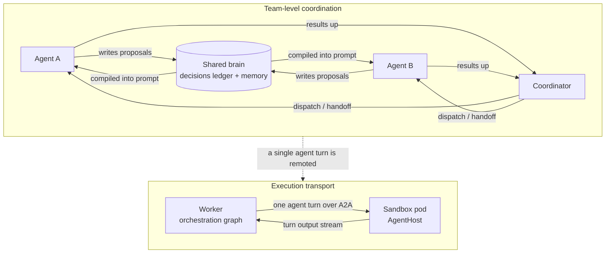
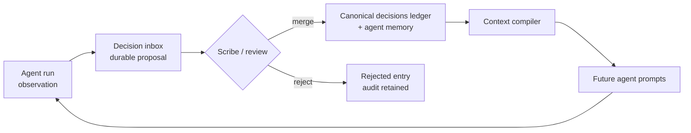
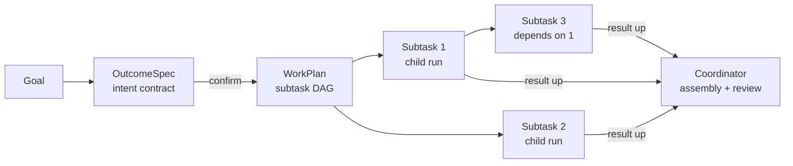
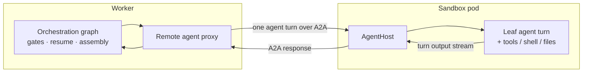
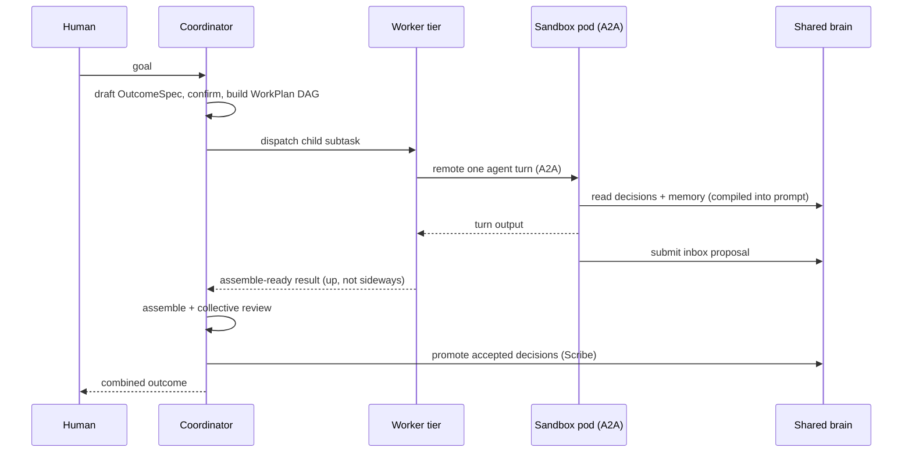

# Agent Communication — Conceptual Deep Dive

## Purpose and mental model

A team in Agentweaver is many agents working toward one outcome, but the agents
never sit in a chat room talking to each other. There is no free-form
agent-to-agent conversation, no message bus where one specialist pings another,
no negotiation loop. Coordination is deliberately **indirect and structured**.

The mental model is a **shared workshop**, not a group chat:

- There is a **shared brain** every agent reads from and writes to — the
  decisions ledger and the cross-agent memory.
- There is a **foreman** — the coordinator — who breaks a goal into bounded jobs,
  hands each to one agent, and assembles the pieces back together.
- There is a **delivery mechanism** that carries a single agent's turn to wherever
  it physically runs — the A2A transport between the worker and a sandbox pod.

These are three different channels with three different jobs. The first two are
how the *team* coordinates. The third is how a *single* agent turn is *executed*.
Keeping them distinct is the most important idea in this document: **A2A is
execution transport, not a way for two agents to talk.**

## The three channels

| Channel | What it coordinates | Direction | Carrier |
| --- | --- | --- | --- |
| Indirect / shared-state | The whole team's accepted truth and learnings | Read at spawn and mid-run; write via inbox | Decisions ledger + cross-agent memory |
| Coordinator-mediated handoff | One goal decomposed into bounded subtasks | Coordinator → children; results flow up | WorkPlan / subtask DAG |
| Direct transport (A2A) | A single agent turn's execution | Worker ↔ sandbox pod | A2A wire protocol |

The rest of this document explains each channel, then explains **why** the team
coordinates through a shared blackboard instead of direct chat.

---

## Channel A — Indirect coordination through shared state

This is the primary way agents influence each other, and it borrows the classic
**blackboard** pattern: contributors never address one another directly; they
read from and write to a shared, durable surface, and a curator keeps it
coherent. In Agentweaver that surface is the
[decisions ledger and cross-agent memory](./memory-decisions.md), and the curator
is the **Scribe**.

### The shared brain has two parts

- **Decisions** are accepted team boundaries — architectural and scope rules the
  whole team must respect. They are the highest-authority artifact.
- **Memory** is reusable context — core facts, learnings, and patterns. Memory
  *informs* an agent; decisions *constrain* the team. Memory never overrides a
  decision.

Both are scoped to a project, and both are described in depth in the
[Memory & Decisions deep dive](./memory-decisions.md) and the
[Memory reference](../reference/memory.md).

### Reading: agents start from, and stay synced with, the shared state

Before every turn, the context compiler assembles a structured block from four
priority-ordered layers — decisions first, then core context, then
high-importance learnings and patterns (including anything tagged `cross-team`),
then the current session — and injects it into the agent's prompt. An agent
therefore begins each turn already knowing the team's accepted boundaries and the
relevant accumulated knowledge, without anyone having to *tell* it. The full
layering logic lives in the [Memory reference](../reference/memory.md).

Reads are not limited to spawn time. Agents can also pull the latest decisions
and memory **mid-run**, so a long-running agent picks up boundaries that were
promoted after it started rather than working from a stale snapshot. This keeps
the blackboard live: a constraint accepted while an agent is mid-flight becomes
visible to it on its next read.

### Writing: agents propose, they do not publish

Agents do not write team law directly. When an agent discovers something worth
keeping — a learning, a reusable pattern, a correction, or a candidate boundary —
it **drops a proposal into the decision inbox**. The inbox is a durable,
reviewable drop-box in front of the canonical ledger. Proposing is not the same
as deciding.

### Curating: the Scribe merges, conflict-free

After a run completes, the **Scribe** step reviews the inbox and **promotes**
accepted entries into the ledger or memory, leaving an audit trail behind. Lower
-risk learnings, patterns, and updates can auto-merge; higher-impact architectural
and scope proposals are left for coordinator or human review. Rejected entries
are retained, not deleted, so the record explains not just what the team accepted
but what it declined.

Because merges **add facts and change status** rather than rewriting history,
independent agents can contribute concurrently without clobbering each other.
Two agents proposing under the same natural name are de-collided into two
distinct entries; a rejection is a status transition, not a delete; a promotion
links the source proposal to the decision it created. The
[Memory & Decisions deep dive](./memory-decisions.md) calls this the
**conflict-free merge model**, and it is exactly what makes indirect coordination
safe at scale: no agent has to lock the blackboard to write to it.

### Coordinator children read decisions only

A coordinator child run is a focused worker with a tight charter. It receives the
team's **active architectural and scope decisions** plus its charter — but not the
full memory stack, which would duplicate its charter and reference paths absent
from its worktree. Decisions are the non-negotiable boundaries, so they are the
one part of the shared brain that always reaches the agents doing the actual work.
This carve-out is detailed in the [Memory reference](../reference/memory.md).

---

## Channel B — Coordinator-mediated handoffs

The second channel is how a single goal becomes parallel work without any agent
having to coordinate with a peer. The [coordinator](./coordinator-internals.md)
sits between the human goal and the workers and owns all cross-agent structure.

### Decompose: goal → OutcomeSpec → WorkPlan DAG

The coordinator first drafts an **OutcomeSpec** — the intent contract — capturing
the goal, desired outcome, scope, and assumptions, and suspends at a confirmation
gate. Nothing is dispatched until the spec is confirmed. Once confirmed, it
produces a **WorkPlan**: the execution contract. The WorkPlan decomposes the goal
into the minimum set of independently dispatchable **subtasks**, each owned by one
agent, each bounded, ordered by explicit **dependency edges** that form a DAG. The
full decomposition logic is in the
[Orchestration deep dive](./orchestration.md) and
[Coordinator Internals](./coordinator-internals.md).

### Dispatch: children run independently, in parallel where safe

For each subtask whose dependencies are satisfied — the **ready frontier** — the
coordinator dispatches a **child run**, tagged with a `ParentRunId` and its
`SubtaskId`. Independent subtasks run in parallel; dependent ones are serialized
behind their prerequisites. The DAG makes this parallelism deterministic: the same
plan advances the same way every time.

### Handoff: assemble-ready, not merge-independent

A child run is intentionally trimmed. It does its agent work and child-level
safety checks, then **stops at the assemble-ready boundary**. It does *not* run
human review, merge, or Scribe — those are the parent's job. "Assemble-ready"
means: *my fragment is finished and ready for the coordinator to integrate*, not
*my work is done and shipped*. Children are fragments of the parent outcome, so
they must not merge independently. The coordinator collects the assemble-ready
pieces, integrates them in dependency order, runs collective review, and records
the combined result.

### Children report up, never sideways

This is the structural rule that replaces peer chat. A child never messages
another child. When a child needs a clarifying answer or a tool approval, the
request is **re-emitted on the coordinator's stream**; the human (or, under
Autopilot, the coordinator) answers, and the answer is routed back to the
requesting child. The coordinator's view is the inbox; the child remains the owner
of its own request. Information flows **up to the coordinator and back down to the
originating child** — never laterally between siblings. **Steering** works the
same way: an operator steers through the coordinator (`stop`, `redirect`,
`amend`), which relays direction to the targeted child at its next turn boundary.
The full handoff and steering model is in the
[Coordinator Internals deep dive](./coordinator-internals.md).

---

## Channel C — Direct transport (A2A)

The third channel is the one most easily confused with "agents talking," so be
precise: **A2A (Agent2Agent) is the wire transport that remotes a single agent
turn**. It is execution plumbing, not a coordination protocol.

When an agent turn runs in a distributed deployment, the **worker** keeps the
entire orchestration graph — the workflow, the human-in-the-loop gates, the
resume logic — in process. Only the **leaf agent turn** is sent over A2A to an
**AgentHost** running inside a **sandbox pod**, which executes the model turn and
its tools, then streams the turn's output back. The orchestration graph never
crosses the boundary; A2A carries one turn's chat/output stream and nothing more.
A2A is the sole worker→AgentHost wire transport for that seam.

Why this is **not** Channel A or B:

- It moves **one turn of one agent** to where it physically executes. It does not
  let two agents converse.
- The thing on each end of the A2A link is a worker and a pod, **not two
  collaborating agents**.
- Team coordination — shared decisions, memory, handoffs — happens entirely in the
  worker tier, above this transport, regardless of whether a turn runs locally or
  in a remote pod.

In other words, A2A could carry every agent turn in the system and the *team*
would still coordinate the same way, through the blackboard and the coordinator.
The conceptual model of the transport lives in the
[A2A bridge deep dive](./a2a-bridge.md); its surfaces are in the
[A2A reference](../reference/a2a.md). For the distributed execution rationale,
see the [distributed-execution spec](../../specs/018-distributed-agent-execution-scaling/spec.md).

---

## Why indirect coordination instead of direct chat

The team channels deliberately avoid agent-to-agent conversation. The reasons are
the heart of the design.

### Auditability

Every coordination event is a durable artifact. A proposal sits in the inbox; a
promotion creates a linked decision; a rejection is retained; a handoff is a
WorkPlan edge; an assembled outcome carries a collective review. You can answer
"why did the team do this?" by reading state, not by replaying a transcript.
Free-form chat leaves only an unstructured log that is hard to audit and easy to
contradict.

### Determinism

A subtask DAG advances the same way every time: ready subtasks dispatch, results
flow up, the coordinator assembles. There is no emergent, order-dependent
back-and-forth between agents whose outcome depends on who spoke first.
Determinism is what makes orchestration reproducible and recoverable from
persisted state rather than from chat history.

### Conflict-free merge

The blackboard merges by **adding facts and changing status**, never by rewriting
history. Independent agents contribute concurrently — de-collided proposals,
status-transition rejections, link-preserving promotions — without locking or
overwriting each other. A chat model has no equivalent: two agents asserting
conflicting things in a conversation produce a contradiction someone must resolve
by hand.

### No chat-loop nondeterminism

Direct agent-to-agent chat invites loops: A asks B, B asks A, neither converges,
tokens burn, and the outcome depends on arbitrary turn ordering. Routing all
cross-agent questions **up to the coordinator** removes the loop entirely. There
is exactly one place a question can be answered, exactly one owner per request,
and a bounded, observable resolution path.

### One authority layer

Memory informs; decisions govern; only promoted decisions bind the team. Because
agents *propose* rather than *publish*, no single agent's transient opinion
becomes team policy by being asserted loudly in a conversation. The review buffer
is the price of keeping policy deliberate.

---

## Putting it together

The three channels never blur:

- The **shared brain** (Channel A) is how knowledge and boundaries reach every
  agent and how agents feed knowledge back — indirectly, durably, conflict-free.
- The **coordinator** (Channel B) is how one goal becomes many bounded jobs and
  how their results come back together — top-down handoff, bottom-up results.
- **A2A** (Channel C) is how a single agent turn is physically executed somewhere
  else — transport, not conversation.

If you remember one distinction, remember this: **agent coordination is the
team-level blackboard plus coordinator handoffs; A2A is a single agent turn
remoted to a pod.** They solve different problems and must not be conflated.

## Related reading

- [Memory & Decisions deep dive](./memory-decisions.md) — the shared ledger,
  inbox→promotion, and conflict-free merge.
- [Memory reference](../reference/memory.md) — four-layer context build and the
  Scribe's role.
- [Orchestration deep dive](./orchestration.md) and
  [Coordinator Internals](./coordinator-internals.md) — WorkPlan/subtask DAG,
  dispatch, and assemble-ready handoff.
- [A2A bridge deep dive](./a2a-bridge.md) and [A2A reference](../reference/a2a.md)
  — the worker↔pod execution transport.
- [Agent Communication reference](../reference/agent-communication.md) — the
  concrete MCP tools and API endpoints behind each channel.
- [Agent Communication experience](../experience/agent-communication.md) — what
  coordination looks like to a user watching a team work.
