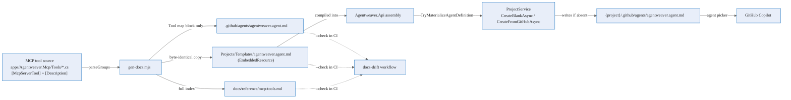

# Agent definition — Deep Dive

Agentweaver ships a **GitHub Copilot agent** that knows how to drive the whole platform through its MCP
tools. That agent lives in a single markdown file — `.github/agents/agentweaver.agent.md` — with YAML
frontmatter, a mental model, operating principles, a **Tool map**, and playbooks. The hard part is keeping
its Tool map honest: the MCP server exposes dozens of tools and that set changes as the product grows. A
hand-maintained list silently rots.

This page explains how Agentweaver solves that end to end: the file's **Tool map is generated** from the
real MCP tool source, the generated copy is **embedded into the API**, and the same file is **materialized
into every new project** so a fresh project comes with a working Copilot agent out of the box — without ever
drifting from the actual tool set.

> The agent definition is **code-grounded, not hand-listed.** The hand-written prose (mental model,
> principles, playbooks) is preserved verbatim; only the region between the
> `<!-- BEGIN GENERATED:tool-map -->` / `<!-- END GENERATED:tool-map -->` markers is regenerated from the
> MCP server source. See the [MCP tool index](../reference/mcp-tools.md), which is generated by the same
> script.

## Why a generated, always-in-sync agent file

- **One source of truth.** The MCP tools are defined once, in `apps/Agentweaver.Mcp/Tools/*.cs` via
  `[McpServerTool]` + `[Description]` attributes. The agent's Tool map and the public
  [MCP tool index](../reference/mcp-tools.md) are both derived from those attributes by one generator, so
  they can never disagree about which tools exist.
- **Drift is a build break, not a surprise.** CI re-runs the generator in `--check` mode; a stale committed
  file fails the build. The agent file cannot quietly fall behind the tools it documents.
- **Every project gets a working agent.** The same definition is embedded in the API and written into each
  new project's `.github/agents/` directory at creation time, so opening a brand-new project in GitHub
  Copilot immediately offers an Agentweaver-aware agent.
- **User edits are safe.** Materialization is non-clobbering — if a project already has the file (the user
  customized it, or a cloned repo shipped its own), it is never overwritten.

## End-to-end flow

1. **Source.** Each MCP tool is a method annotated with `[McpServerTool(Name = ...)]` and `[Description(...)]`
   in `apps/Agentweaver.Mcp/Tools/*.cs`. One `Tools.cs` file per category (Backlog, Project, Run, …).
2. **Generate.** `scripts/gen-docs.mjs` parses those files once (`parseGroups()`, `gen-docs.mjs:115`) into
   the same category groups used by the tool index, then emits three targets (`computeTargets()`,
   `gen-docs.mjs:208`):
   - the full **MCP tool index** `docs/reference/mcp-tools.md`;
   - the **Tool map block** of `.github/agents/agentweaver.agent.md` — only the bytes between the
     `<!-- BEGIN GENERATED:tool-map -->` / `<!-- END GENERATED:tool-map -->` markers are replaced
     (`applyToolMapBlock()`, `gen-docs.mjs:192`); all surrounding prose is read back from the file itself
     and preserved verbatim;
   - a **byte-identical copy** at `apps/Agentweaver.Api/Projects/Templates/agentweaver.agent.md`.
3. **Embed.** That copy is compiled into the API as an `EmbeddedResource`
   (`apps/Agentweaver.Api/Agentweaver.Api.csproj:55`) and read at runtime by `AgentDefinitionTemplate`
   (`AgentDefinitionTemplate.cs:33`) via `GetManifestResourceStream`. Keeping it a *generated* copy means
   the repo file and the runtime template can never diverge.
4. **Materialize.** On project creation, `ProjectService` calls `TryMaterializeAgentDefinition`
   (`ProjectService.cs:485`) from **both** `CreateBlankAsync` (`ProjectService.cs:90`) and
   `CreateFromGitHubAsync` (`ProjectService.cs:183`). It writes the embedded template to
   `{project.WorkingDirectory}/.github/agents/agentweaver.agent.md` — creating the `.github/agents/`
   directories as needed — but only if that file does not already exist (`AgentDefinitionTemplate.cs:50`).
5. **Use.** GitHub Copilot discovers the materialized file under `.github/agents/` and offers the
   **Agentweaver Driver** agent, which drives the project through the `agentweaver-*` MCP tools.
6. **Guard.** CI re-runs `node scripts/gen-docs.mjs --check`, which validates all three generated targets and
   exits non-zero on any drift (`.github/workflows/docs-drift.yml:37`).

## The materialized file

The agent definition is a Copilot agent file: YAML frontmatter (`description:` that tells Copilot when to
invoke it) followed by prose sections — **Mental model**, **Operating principles**, the generated
**Tool map (agentweaver-\*)**, **Common playbooks**, a catalog snapshot, and model-selection guidance. The
Tool map groups every `agentweaver-*` tool by category (the same 13 categories as the
[MCP tool index](../reference/mcp-tools.md)). When tools are added or renamed, regenerating updates only that
block.

## Why best-effort and non-clobbering

Materialization mirrors the existing review-policy / workflow template pattern (`TryMaterialize` next to
`DefaultReviewPolicyTemplate`): it is wrapped so that a write failure **never fails project creation**, and
it **skips the write when the file already exists** so it never clobbers a user's edits or a repo that ships
its own agent definition. The method catches only `IOException` / `UnauthorizedAccessException` /
`SecurityException`, records the outcome to the log, and returns (`AgentDefinitionTemplate.cs:50`,
`ProjectService.cs:485`).

## Drift guards

Two layers keep the three copies aligned:

- **CI `--check`.** `docs-drift.yml` runs the generator in check mode on every PR; a stale
  `mcp-tools.md`, `.github/agents/agentweaver.agent.md`, or embedded template fails the job
  (`.github/workflows/docs-drift.yml:37`).
- **Unit tests.** `AgentDefinitionTemplateTests` asserts the embedded API template equals the committed
  `.github` file (so the two copies never diverge) and that `TryMaterialize` is idempotent and
  non-clobbering; `ProjectServiceCreateTests` (PC-11) asserts a freshly created project contains the
  materialized file.

## Source

| Concern | Where |
|---|---|
| MCP tool source (the single source of truth) | `apps/Agentweaver.Mcp/Tools/*.cs` (`[McpServerTool]` + `[Description]`) |
| Generator: parse + emit 3 targets + `--check` | `scripts/gen-docs.mjs` (`parseGroups` `:115`, `applyToolMapBlock` `:192`, `computeTargets` `:208`) |
| Generated agent definition (repo copy) | `.github/agents/agentweaver.agent.md` |
| Embedded copy compiled into the API | `apps/Agentweaver.Api/Projects/Templates/agentweaver.agent.md` |
| `EmbeddedResource` registration | `apps/Agentweaver.Api/Agentweaver.Api.csproj:55` |
| Load embedded template + `TryMaterialize` | `apps/Agentweaver.Api/Projects/AgentDefinitionTemplate.cs` (`LoadEmbedded` `:33`, `TryMaterialize` `:50`) |
| Materialize on create (blank + GitHub) | `apps/Agentweaver.Api/Projects/ProjectService.cs` (`:90`, `:183`, `TryMaterializeAgentDefinition` `:485`) |
| CI drift gate | `.github/workflows/docs-drift.yml:37` |
| Drift / idempotency tests | `tests/Agentweaver.Tests/Projects/AgentDefinitionTemplateTests.cs`, `ProjectServiceCreateTests.cs` (PC-11) |

## See also

- [Agent definition — Reference](../reference/agent-definition.md) — the generation contract, regenerate
  command, `--check` gate, and materialization behavior.
- [Agent definition — User Guide](../experience/agent-definition.md) — what you get when you create a project
  and how to use it with Copilot.
- [MCP tool index](../reference/mcp-tools.md) — the generated list of all `agentweaver-*` tools the agent
  drives.
- [MCP server — Deep Dive](./mcp-server.md) — how the tools are served and authorized.
- [Projects & workspaces — Deep Dive](./projects.md) — the project-creation flow this materialization rides on.
- The generated-vs-curated split and the shared generator are described in `.github/DOCS_SYNC.md`.
