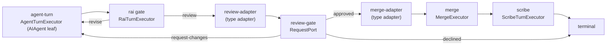
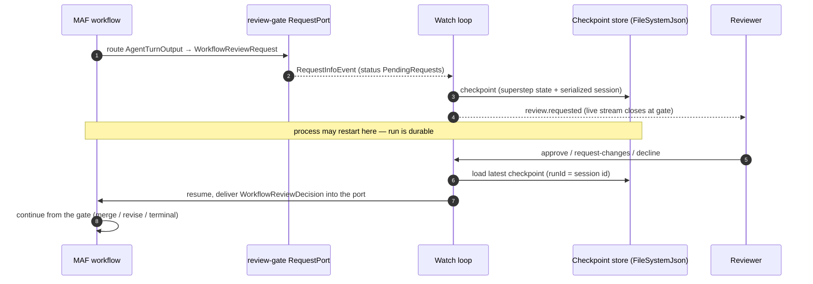
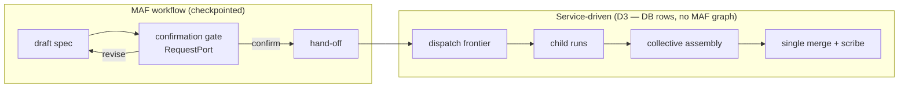

# Microsoft Agent Framework — Conceptual Deep Dive

## Purpose & Mental Model

Agentweaver does not own an orchestration engine. It builds on one: the **Microsoft Agent Framework** (MAF), shipped as `Microsoft.Agents.AI.Workflows` (with `Microsoft.Agents.AI.Workflows.Checkpointing`). Every run — a single-agent task or a coordinator-led collective — is a MAF **workflow**: a graph of typed executors that MAF schedules, checkpoints, suspends, and resumes.

The single most useful sentence for rebuilding this design is: **the run lifecycle is a MAF graph, the agent is a MAF leaf, and every "waits for your approval" gate is a MAF `RequestPort`.** Agentweaver's own code is mostly the nodes inside that graph, the translation of MAF's event stream into the live UI, and the human-facing seams around its suspend/resume points.

This deep dive answers two questions: **what** MAF gives Agentweaver, and **why** Agentweaver builds on it instead of a bespoke engine. For the wider picture, see the [system overview](./00-system-overview.md).

Why not a bespoke engine? Three properties are hard to get right and MAF supplies them as primitives:

- **Durable suspend/resume.** A run that pauses for a human must survive a process restart and pick up exactly where it stopped. MAF makes this a first-class operation (checkpoint + resume from a request port).
- **Typed graph composition with adapters.** Nodes have typed inputs and outputs; edges connect them; cross-type transitions are explicit adapters. This makes "fail closed when a node can't run" a structural property, not a runtime hope.
- **A standard agent leaf.** The `AIAgent` abstraction is the unit MAF schedules and the unit A2A remotes — so the same abstraction carries both in-process and distributed execution.

Building those three from scratch is the expensive part of an orchestration runtime. Agentweaver spends its effort on the *policy* (which graph, which gates, which agents) and lets MAF own the *mechanism*.

## The Workflow graph: typed executors and edges

A MAF workflow is a directed graph. Each node is an **executor** with a typed input and a typed output. Each **edge** carries a value of the producer's output type into a consumer that accepts it; when the types don't line up, an **adapter** executor sits on the edge to transform one into the other. MAF runs the graph in supersteps, delivering each executor its input, collecting its output, and routing along the edges whose (optional) predicate matches.

Agentweaver assembles a run's graph from a `WorkflowDefinition` (the declarative policy graph described in [workflow-engine.md](workflow-engine.md)). Binding turns each logical node into its own MAF executor:

- **agent-turn** node → an `AgentTurnExecutor` wrapping one `AIAgent`. This is the leaf unit of work.
- **peer-review** node → an AI reviewer executor that emits an approve / request-changes verdict.
- **merge** node → a `MergeExecutor` that applies the produced tree.
- **scribe** node → a recording executor that captures the outcome.
- **rai / human-review** gates → policy gates and request ports.

The binder mints a *distinct* executor per logical node, keyed by node id. This is why **chained turns each get their own node**: a workflow with three sequential agent turns produces three separate MAF executors, not one executor invoked three times. Distinct nodes are what make the topology graph legible and what let MAF emit a clean lifecycle event per step. Edges that cross types — `AgentTurnOutput` into a review request, a review decision into a merge input — are expanded into adapter executors so the typed contract is never violated. Binding **fails closed**: a node kind or edge with no executor mapping aborts the build instead of becoming a silent no-op.

## The AIAgent abstraction and CopilotAIAgent

The leaf unit of work in a MAF graph is an **`AIAgent`** — one object that takes a turn input and streams an agent response. Agentweaver's production leaf is **`CopilotAIAgent : AIAgent`**, which wraps a GitHub Copilot SDK session. The agent-turn executor holds the `AIAgent`; the rest of the graph never reaches inside it.

The decisive property is that the MAF **checkpoint manager can serialize the agent**. `CopilotAIAgent` exposes its Copilot SDK session as a serializable blob, so when MAF writes a checkpoint it persists *the agent's session* into that checkpoint alongside the workflow's superstep state. This is what makes a paused run truly durable: resuming restores not just "which node we stopped at" but the agent's own conversational state. A bespoke engine would have to invent and test this session-serialization contract; MAF makes the agent a serializable graph citizen for free.

A fresh worker agent is minted per run through an injectable factory seam (`IWorkflowAgentFactory`), so production builds a `CopilotAIAgent` while tests substitute a fake — without changing the graph. Auxiliary turns (RAI, scribe, peer-review) each construct their own ephemeral agents the same way.

## Executor lifecycle → live UI

MAF emits a typed event for every executor's lifecycle: `ExecutorInvokedEvent` when a node starts, `ExecutorCompletedEvent` when it finishes, and `ExecutorFailedEvent` when it throws. It also emits `RequestInfoEvent` when the graph reaches a request port and `WorkflowOutputEvent` at terminal output. These are the same `WorkflowEvent` stream MAF uses to drive execution.

The run watch loop subscribes to this stream and **translates** each lifecycle event into a `workflow.step` event on the run's own stream: invoked → `started`, completed → `completed`, failed → `failed`. Those `workflow.step` events are what drive the live topology graph in the UI — each node lights up as MAF invokes and completes its executor. The watch loop deliberately skips nodes that emit their own richer events (agent, rai, merge, scribe, review), so the timeline never double-reports. The result is that the browser's animated graph is a faithful projection of MAF's real scheduling, not a separately maintained model.

## RequestPort: the one HITL seam

Every human gate in Agentweaver is the *same* MAF mechanism: a **`RequestPort`**. A request port is an executor with a typed request and a typed response; when the graph routes a value into it, MAF emits a `RequestInfoEvent`, the workflow's status becomes **`PendingRequests`**, and execution **suspends**. It resumes only when a human supplies the matching response, which MAF feeds back into the graph as the port's output.

This single seam is behind every "waits for your approval" gate:

- **The run review gate** is `RequestPort.Create<WorkflowReviewRequest, WorkflowReviewDecision>("review-gate")`. The agent's output is adapted into a `WorkflowReviewRequest`, the run suspends, and the reviewer's approve / request-changes / decline becomes a `WorkflowReviewDecision`.
- **The coordinator's OutcomeSpec confirmation gate** is `RequestPort.Create<CoordinatorOutcomeSpecRequest, CoordinatorOutcomeSpecDecision>`. The drafted spec suspends the coordinator run until a human confirms or revises.
- **Per-node human-review gates** in catalog/generated workflows are minted the same way, one request port per `human-review` node.

Because all of these are the same primitive, the suspend/resume plumbing is written once. When the watch loop sees a `RequestInfoEvent` it records the pending request, marks the run awaiting review, and closes the live stream at the gate. When the human responds, the decision is sent back into the suspended workflow and execution continues from exactly that port. The merge-blocked retry path even *re-enters* the same review gate, so a transient block keeps the workflow alive instead of failing it.

## Checkpointing & durable resume

MAF persists workflow state through a checkpoint store. Agentweaver uses MAF's `FileSystemJsonCheckpointStore`, wrapped by a `ResilientCheckpointStore` that hardens startup so the API **always boots**. It guards against three distinct hazards (`apps/Agentweaver.Api/Infrastructure/ResilientCheckpointStore.cs`):

- **Corrupt index.** MAF parses the store's `index.jsonl` one JSON object per line at construction, so a single blank or partially-written line throws and would brick startup. The factory creates the checkpoint directory, sanitizes the index (dropping blank/unparseable lines after backing up the original), and quarantines an unrecoverable index instead of crash-looping. Genuine corruption is still logged loudly (error) and quarantined. Quarantine destinations are unique per pod and per call (`index.jsonl.corrupt.{podId}.{unixSeconds}.{guid}`, moved with overwrite), so rapid restarts within the same second can never collide with `IOException: already exists`.
- **Multi-writer lock contention.** `FileSystemJsonCheckpointStore` takes an **exclusive process lock** on the checkpoint directory. The API runs `replicas: 2` with `HOME` on a shared RWX Azure Files volume, so the checkpoint directory is shared — only one pod can hold the lock, and the second pod's constructor throws `"already in use by another process"`. `ResilientCheckpointStore` detects this (it is *not* corruption, so the index is never quarantined), retries the shared open a few times with short backoff to ride out transient mid-write locks during a rolling update, then falls back to a **per-pod checkpoint sub-directory** under the same volume — `{checkpoints}/replicas/{POD_NAME}` (pod identity from the `POD_NAME` downward-API env var, else `HOSTNAME`, else a GUID) — so the replica gets its own writable store and goes Ready. The absolute last resort is a unique per-pod temp directory; `Create` is guaranteed never to throw.
- **Shared-volume permission denial.** When the shared RWX volume is not readable/writable by a pod (e.g. an `UnauthorizedAccessException` / `IOException: Permission denied` reading or opening the index — which MAF surfaces wrapped as `InvalidOperationException("... Index corrupted") ---> UnauthorizedAccessException`), this is an **expected** environment condition, **not** index corruption. `ResilientCheckpointStore.IsAccessDenied` walks the inner-exception chain to recognise it, skips quarantine and the corruption path entirely, and falls back to the per-pod directory the same way as lock contention. Crucially this path is **quiet**: it emits **at most one concise `warn`** per store (no `fail`, no stacktrace — the diagnostic detail drops to `Debug`), so the previous startup log flood (a `warn` sanitize stacktrace + a `fail` "unrecoverable; quarantining" + a `fail` "already exists" + a `fail` "still failed after quarantine", per store, per replica, every boot) collapses to a single line such as `Shared checkpoint store {dir} not usable (permission denied); using per-pod directory {dir}. Checkpoints are durable for this pod but not shared across replicas (cross-replica resume needs a DB-backed store).`

> Cross-replica checkpoint resume was never actually available under the single-writer file lock; whether the underlying shared-volume permissions are fixed is an infra concern. The durable long-term fix for true cross-replica resume is a **DB-backed checkpoint store** (tracked as a follow-up).

The wrapped store is handed to a `CheckpointManager`, and the manager checkpoints around every suspension.

::: warning Shared cross-replica resume is a follow-up
The per-pod fallback means each replica checkpoints to its own directory, so a run suspended on pod A is resumed from pod A's checkpoints. Cross-replica resume was never actually available under the single-writer file lock (only one pod could ever open the shared store). The durable long-term fix is a **DB-backed checkpoint store** (the same brokered store the A2A/distributed design already assumes); the file store stays per-pod until then.
:::

Two facts make resume robust:

- **The runId is the MAF session id.** A run's id is used directly as MAF's session identifier, so a run's checkpoints live under a directory keyed by that id and the most recently written checkpoint file is the resume point. There is no separate mapping table to keep consistent.
- **A checkpoint carries both the superstep state and the serialized agent session**, including the correlation id of any suspended request port. Restoring a checkpoint rehydrates the graph *and* the agent, then continues from the gate.

On process restart, the `WorkflowRestartService` reconciles interrupted runs. A run recorded as awaiting review is resumed from its latest checkpoint: it rebuilds the workflow shape, calls MAF's resume-from-checkpoint, and restarts the watch loop so the run lands back at its suspended gate. If no checkpoint exists, a stale review is failed closed, while a still-valid one re-emits a synthetic `review.requested` after revalidating the worktree. Coordinator runs still in their spec phase are recovered the same way through the `CoordinatorWorkflowFactory`, which resumes the suspended confirmation gate from its own checkpoint.

## Where Agentweaver deliberately does NOT use MAF (decision D3)

MAF is the right tool for a graph that *pauses for humans and must survive restarts*. It is not the right tool for everything, and Agentweaver draws a deliberate boundary.

The coordinator's **spec/confirm phase is a MAF workflow**: `draft → RequestPort confirmation gate → confirm-terminal | revise-loop`. That phase needs exactly what MAF provides — it drafts an outcome spec, suspends on a human confirmation gate, and must resume that gate after a restart. So it is checkpointed and resumable just like the run review gate.

After the human confirms the spec, the coordinator **hands off to a service-driven engine** — *not* a MAF graph (decision **D3**). Subtask dispatch and collective assembly run as background services whose entire state lives in **database rows**: the WorkPlan, the subtask DAG and its dependency edges, child run rows, and assembly status. The assembly pipeline reuses the real executors (RAI, scribe, merge plumbing) but **invokes them directly**, passing a `NoOpWorkflowContext` — a stub `IWorkflowContext` that throws on state operations — precisely to prove these calls do not depend on a live workflow graph.

The reasoning is the core of D3: **MAF checkpoints exist to make in-memory graph state durable across suspension; the dispatch and assembly phases have no in-memory graph state worth checkpointing because their state is already durable in the DB.** A coordinator can dispatch ten children, observe them, and assemble their branches entirely from persisted rows. If the process dies, recovery re-reads those rows and re-arms dispatch — no checkpoint required. Forcing those phases into a MAF graph would add a second source of truth (checkpoint *and* DB rows) that must be kept consistent, for no durability gain. So the boundary is: **MAF where a run suspends on a human and resumes in-memory; service-driven where state is naturally relational and long-lived.**

Each **child run**, however, is itself an ordinary MAF run with its own graph — so MAF still orchestrates every leaf of real work. D3 is only about the *coordinator's* dispatch/assembly tier, not the workers it launches.

## A2A is also MAF

Distributed execution does not move the graph; it moves only the leaf. The worker↔pod transport, **A2A**, ships in the same .NET Agent Framework line and remotes at the `AIAgent` seam. The worker keeps the whole MAF graph — every executor, every `WorkflowEvent`, every `RequestPort`/HITL gate — and replaces only the leaf `AIAgent` with a proxy that forwards a single turn to a sandbox pod and streams the result back.

This is why the MAF-centric design here stays intact under distribution: no MAF event crosses the wire, no gate crosses the wire, and there is no MAF↔A2A translation layer, because only the leaf's streaming response travels. Checkpoints and the serialized session blob still live on the worker's checkpoint store, so durable resume is unchanged. The full reasoning — cut at the leaf not the graph, message-mode only, the `RunEvent` side-channel codec — is in the [A2A bridge deep dive](a2a-bridge.md).

## Invariants to preserve when rebuilding

- A run is a MAF `Microsoft.Agents.AI.Workflows` graph of typed executors and typed edges; cross-type transitions are explicit adapter executors.
- A `WorkflowDefinition` binds to one MAF executor per logical node; chained turns get distinct nodes; binding fails closed.
- The leaf is an `AIAgent`; production uses `CopilotAIAgent`, whose Copilot session the checkpoint manager serializes into the checkpoint.
- MAF lifecycle events (`ExecutorInvoked/Completed/Failed`) are translated by the watch loop into `workflow.step` events that drive the live topology graph.
- Every human gate is a `RequestPort`; reaching it emits a `RequestInfoEvent`, the workflow status becomes `PendingRequests`, and it suspends until a human responds.
- Checkpoints use `FileSystemJsonCheckpointStore` wrapped by `ResilientCheckpointStore`; runId is the MAF session id; restart recovery resumes a suspended run from its latest checkpoint at the gate. The store ctor takes an exclusive lock, so under `replicas: 2` on the shared volume the losing replica falls back to a per-pod checkpoint dir (`{checkpoints}/replicas/{POD_NAME}`) rather than crash-looping — a DB-backed store is the follow-up for true cross-replica resume.
- The coordinator's spec/confirm phase is MAF; dispatch and collective assembly (D3) are service-driven over DB rows, with no MAF graph and a `NoOpWorkflowContext` for direct executor calls.
- A2A remotes only the `AIAgent` leaf; the MAF graph and all `WorkflowEvent`/`RequestPort` logic stay in the worker.
