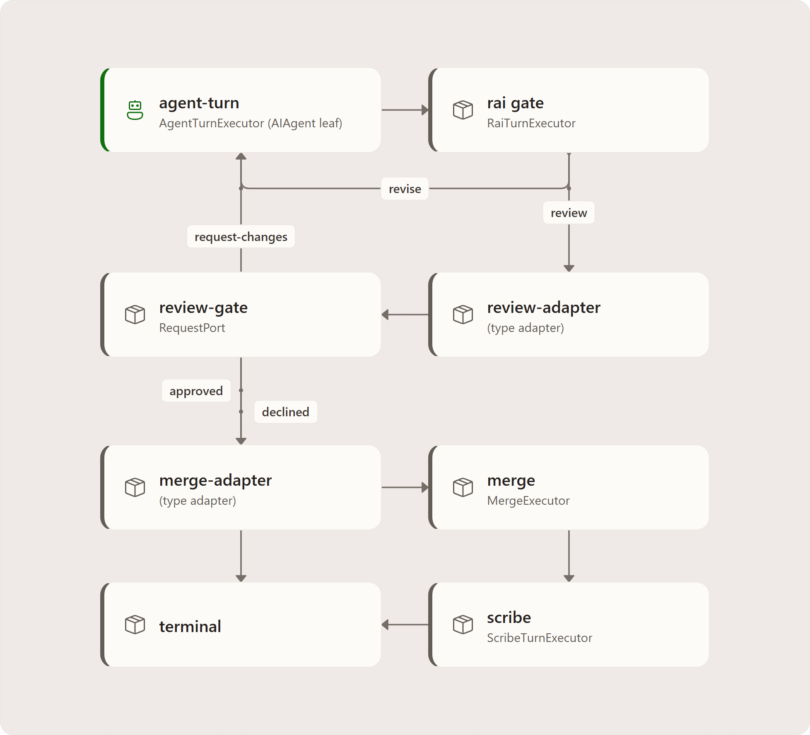
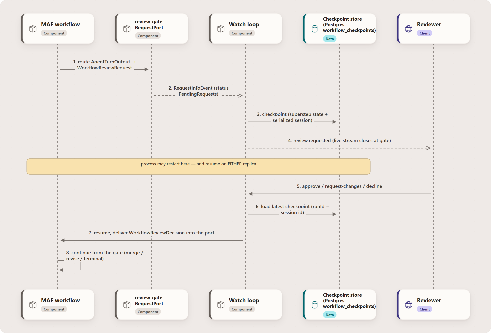
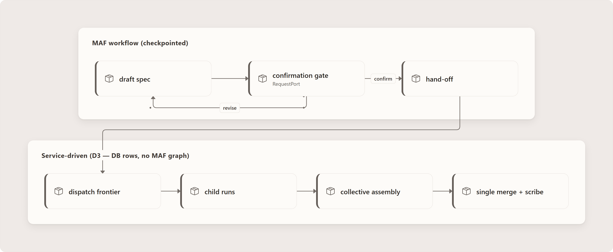

# Microsoft Agent Framework — Conceptual Deep Dive

## Purpose & Mental Model

Agentweaver uses the **Microsoft Agent Framework** (MAF), shipped as `Microsoft.Agents.AI.Workflows` (with checkpointing), for full/child workflow graphs and the coordinator's spec/confirmation phase. MAF schedules typed executors, checkpoints, suspends, and resumes those graphs. Service-driven dispatch/assembly and Operator conversations are deliberately different execution paths.

The useful boundary is: **workflow-bound work uses a MAF graph, agent execution is a leaf, and MAF human gates use `RequestPort`.** Collective assembly approval instead uses `AssemblyReviewGate` and durable service recovery. Operator conversations use their own durable event history rather than a review/merge graph.

This deep dive answers two questions: **what** MAF gives Agentweaver, and **why** Agentweaver builds on it instead of a bespoke engine. For the wider picture, see the [system overview](./00-system-overview.md).

Why not a bespoke engine? Three properties are hard to get right and MAF supplies them as primitives:

- **Durable suspend/resume.** A run that pauses for a human must survive a process restart and pick up exactly where it stopped. MAF makes this a first-class operation (checkpoint + resume from a request port).
- **Typed graph composition with adapters.** Nodes have typed inputs and outputs; edges connect them; cross-type transitions are explicit adapters. This makes "fail closed when a node can't run" a structural property, not a runtime hope.
- **A standard agent leaf.** The `AIAgent` abstraction is the unit MAF schedules and the unit A2A remotes — so the same abstraction carries both in-process and distributed execution.

Building those three from scratch is the expensive part of an orchestration runtime. Agentweaver spends its effort on the *policy* (which graph, which gates, which agents) and lets MAF own the *mechanism*.

## The Workflow graph: typed executors and edges

A MAF workflow is a directed graph. Each node is an **executor** with a typed input and a typed output. Each **edge** carries a value of the producer's output type into a consumer that accepts it; when the types don't line up, an **adapter** executor sits on the edge to transform one into the other. MAF runs the graph in supersteps, delivering each executor its input, collecting its output, and routing along the edges whose (optional) predicate matches.

Agentweaver assembles a run's graph from a `WorkflowDefinition` (the declarative policy graph described in [workflow-engine.md](workflow-engine.md)). Binding turns each logical node into its own MAF executor:

- **agent-turn** node → an `AgentTurnExecutor` wrapping one `AIAgent`. This is the leaf unit of work.
- **peer-review** node → an AI reviewer executor that emits an approve / request-changes verdict.
- **merge** node → a `MergeExecutor` that applies the produced tree.
- **scribe** node → a recording executor that captures the outcome.
- **rai / human-review** gates → policy gates and request ports.

The binder mints a *distinct* executor per logical node, keyed by node id. This is why **chained turns each get their own node**: a workflow with three sequential agent turns produces three separate MAF executors, not one executor invoked three times. Distinct nodes are what make the topology graph legible and what let MAF emit a clean lifecycle event per step. Edges that cross types — `AgentTurnOutput` into a review request, a review decision into a merge input — are expanded into adapter executors so the typed contract is never violated. Binding **fails closed**: a node kind or edge with no executor mapping aborts the build instead of becoming a silent no-op.

<!-- Editable source: ../diagrams/src/agent-framework-fig1.drawio.
     Export with pinned draw.io Desktop 31.4.5 using --spec agent-framework-fig1.
     Review lineage: ../diagrams/reviews/agent-framework-fig1/iteration-manifest.json. -->

## The AIAgent abstraction and CopilotAIAgent

The leaf unit of work in a MAF graph is an **`AIAgent`**. Hosted execution uses a remote AgentHost proxy at that seam; the pod-side agent wraps the SDK session. The graph remains in the orchestration process. `CopilotAIAgent` is the SDK-backed implementation, not a separate deployed orchestration service.

The decisive property is that the MAF **checkpoint manager can serialize the agent**. `CopilotAIAgent` exposes its Copilot SDK session as a serializable blob, so when MAF writes a checkpoint it persists *the agent's session* into that checkpoint alongside the workflow's superstep state. This is what makes a paused run truly durable: resuming restores not just "which node we stopped at" but the agent's own conversational state. A bespoke engine would have to invent and test this session-serialization contract; MAF makes the agent a serializable graph citizen for free.

A fresh worker agent is minted per run through an injectable factory seam (`IWorkflowAgentFactory`), so production builds a `CopilotAIAgent` while tests substitute a fake — without changing the graph. Auxiliary turns (RAI, scribe, peer-review) each construct their own ephemeral agents the same way.

## Executor lifecycle → live UI

MAF emits a typed event for every executor's lifecycle: `ExecutorInvokedEvent` when a node starts, `ExecutorCompletedEvent` when it finishes, and `ExecutorFailedEvent` when it throws. It also emits `RequestInfoEvent` when the graph reaches a request port and `WorkflowOutputEvent` at terminal output. These are the same `WorkflowEvent` stream MAF uses to drive execution.

The run watch loop subscribes to this stream and **translates** each lifecycle event into a `workflow.step` event on the run's own stream: invoked → `started`, completed → `completed`, failed → `failed`. Those `workflow.step` events are what drive the live topology graph in the UI — each node lights up as MAF invokes and completes its executor. The watch loop deliberately skips nodes that emit their own richer events (agent, rai, merge, scribe, review), so the timeline never double-reports. The result is that the browser's animated graph is a faithful projection of MAF's real scheduling, not a separately maintained model.

## RequestPort: the MAF human-gate seam

MAF-bound human gates use a **`RequestPort`** with typed request and response. Routing a value into the port emits `RequestInfoEvent`, enters **`PendingRequests`**, and suspends that graph until the matching response arrives. This does not describe collective assembly approval or Assistant tool approvals.

This seam implements the following graph gates:

- **The run review gate** is `RequestPort.Create<WorkflowReviewRequest, WorkflowReviewDecision>("review-gate")`. The agent's output is adapted into a `WorkflowReviewRequest`, the run suspends, and the reviewer's approve / request-changes / decline becomes a `WorkflowReviewDecision`.
- **The coordinator's OutcomeSpec confirmation gate** is `RequestPort.Create<CoordinatorOutcomeSpecRequest, CoordinatorOutcomeSpecDecision>`. The drafted spec suspends the coordinator run until a human confirms or revises.
- **Per-node human-review gates** in catalog/generated workflows are minted the same way, one request port per `human-review` node.

Because all of these are the same primitive, the suspend/resume plumbing is written once. When the watch loop sees a `RequestInfoEvent` it records the pending request, marks the run awaiting review, and closes the live stream at the gate. When the human responds, the decision is sent back into the suspended workflow and execution continues from exactly that port. The merge-blocked retry path even *re-enters* the same review gate, so a transient block keeps the workflow alive instead of failing it.

## Checkpointing & durable resume

MAF persists workflow state through a checkpoint store — any implementation of `ICheckpointStore<JsonElement>`, which MAF exposes as the `JsonCheckpointStore` base class. Agentweaver selects the store at startup based on `Database:Provider` via `ICheckpointStoreFactory` (`apps/Agentweaver.Api/Infrastructure/ICheckpointStoreFactory.cs`):

- **Production (Postgres) → a shared, concurrency-safe `PostgresJsonCheckpointStore`.** This is the default on hosted deployments and the correct fix for multi-replica operation. It derives from MAF's `JsonCheckpointStore` (so it plugs straight into `CheckpointManager.CreateJson(store)`) and persists every checkpoint as one row in the `workflow_checkpoints` table (`apps/Agentweaver.Api/Infrastructure/Ef/PostgresJsonCheckpointStore.cs`). Because each checkpoint is an **independent, unique-PK row**, the two API replicas write concurrently as plain `INSERT`s that never contend — there is **no exclusive lock** — and Postgres MVCC makes a committed checkpoint immediately visible to the other replica. That is genuine **cross-pod checkpoint sharing and resume**: a run suspended on pod A can be resumed from pod B.
- **Local / dev (SQLite or no database) → the file store.** MAF's `FileSystemJsonCheckpointStore`, wrapped by `ResilientCheckpointStore` (`apps/Agentweaver.Api/Infrastructure/ResilientCheckpointStore.cs`), which hardens single-node startup so the API **always boots**. This path is no longer the production default; it remains for the single-writer dev experience and as a defensive safety net.

### Why Postgres — the file store cannot be shared across replicas

`FileSystemJsonCheckpointStore` takes an **exclusive process lock** on its directory. The API runs `replicas: 2` with `HOME` on a shared RWX Azure Files volume, so only one pod could ever hold that lock; the other was forced to a per-pod directory and the two replicas **never shared checkpoints** — cross-replica resume was impossible no matter how the volume permissions were set. Quieting the resulting log noise or fixing permissions only treated symptoms; the architectural fix is to move checkpoints into the database the app already runs, where concurrent writers are a first-class operation. The `workflow_checkpoints` schema:

| Column | Purpose |
| --- | --- |
| `store_name` | Discriminator partitioning the two logical stores that were previously separate directories: `runs` (`RunWorkflowFactory`) and `coordinator` (`CoordinatorWorkflowFactory`). |
| `session_id` | MAF session id — the RunId for the runs store. |
| `checkpoint_id` | Unique GUID generated on create. |
| `parent_checkpoint_id`, `has_parent_metadata` | Mirror MAF's FileSystem index semantics so the parent-scoped index query behaves identically. |
| `payload` (`jsonb`) | The checkpoint document. |
| `created_at`, `updated_at` | Timestamps. |

Primary key `(store_name, session_id, checkpoint_id)`; index on `(store_name, session_id)`. Concurrency is guaranteed structurally: fresh-GUID checkpoint ids mean every create is a non-conflicting `INSERT`, so two replicas never collide and no global lock is needed. The store uses `IDbContextFactory<MemoryDbContext>` (a fresh context per call), so a single registered instance serves many concurrent runs. The migration is `Agentweaver.Api.Migrations.Postgres/Migrations/20260628140000_AddWorkflowCheckpoints.cs`, applied on startup by the same `MemoryDbContext.MigrateAsync()` as every other table.

### The file store's startup safety net (dev / fallback only)

When the file store is in use, `ResilientCheckpointStore` still guards three single-node hazards so the API never crash-loops:

- **Corrupt index.** MAF parses `index.jsonl` one JSON object per line at construction, so a blank or partially-written line throws. The factory sanitizes the index (dropping unparseable lines after backing up the original) and quarantines an unrecoverable index instead of crash-looping. Genuine corruption is logged loudly (error) and quarantined; quarantine destinations are unique per pod and per call (`index.jsonl.corrupt.{podId}.{unixSeconds}.{guid}`, moved with overwrite) so rapid restarts cannot collide with `IOException: already exists`.
- **Multi-writer lock contention** and **shared-volume permission denial.** If two processes share the directory or the volume is not writable, this is *not* corruption: `ResilientCheckpointStore` recognises it (walking the inner-exception chain for `IsAccessDenied`), skips quarantine, and falls back **quietly** (at most one concise `warn` per store, no `fail`/stacktrace) to a per-pod sub-directory so the node still boots. On Postgres these cases simply do not arise, because there is no shared file and no exclusive lock.

The selected store is handed to a `CheckpointManager`, and the manager checkpoints around every suspension.

::: tip Cross-replica resume is now real on Postgres
On the production Postgres path, both replicas read and write the same `workflow_checkpoints` rows, so a run suspended on one pod resumes on the other. The previous per-pod file fallback (where each replica checkpointed to its own directory and cross-replica resume was impossible) applies only to the SQLite/dev file store.
:::

Two facts make resume robust:

- **The runId is the MAF session id.** A run's id is used directly as MAF's session identifier, so a run's checkpoints are keyed by that id (the `session_id` column on Postgres, or a directory on the file store) and the most recent checkpoint is the resume point. There is no separate mapping table to keep consistent.
- **A checkpoint carries both the superstep state and the serialized agent session**, including the correlation id of any suspended request port. Restoring a checkpoint rehydrates the graph *and* the agent, then continues from the gate.

On process restart, the `WorkflowRestartService` reconciles interrupted runs. A run recorded as awaiting review is resumed from its latest checkpoint: it rebuilds the workflow shape, calls MAF's resume-from-checkpoint, and restarts the watch loop so the run lands back at its suspended gate. If no checkpoint exists, a stale review is failed closed, while a still-valid one re-emits a synthetic `review.requested` after revalidating the worktree. Coordinator runs still in their spec phase are recovered the same way through the `CoordinatorWorkflowFactory`, which resumes the suspended confirmation gate from its own checkpoint.

### Ordinary response versus process restoration

A live workflow receives the correlated decision through `SendResponseAsync`. A request arriving on another replica can persist a deferred decision for the owning watch loop. Process-loss recovery instead loads the selected checkpoint store, rebuilds the appropriate full/child graph, calls `ResumeStreamingAsync`, and restarts observation. Recovery revalidates durable state and worktree/tree identity; it is not unconditional success.

Postgres checkpoints are shared rows. File checkpoints are the SQLite/dev provider choice, not an automatic fallback when production Postgres fails.

<!-- Editable source: ../diagrams/src/agent-framework-fig3.drawio.
     Export with pinned draw.io Desktop 31.4.5 using --spec agent-framework-fig3.
     Review lineage: ../diagrams/reviews/agent-framework-fig3/iteration-manifest.json. -->

## Where Agentweaver deliberately does NOT use MAF (decision D3)

MAF is the right tool for a graph that *pauses for humans and must survive restarts*. It is not the right tool for everything, and Agentweaver draws a deliberate boundary.

The coordinator's **spec/confirm phase is a MAF workflow**: `draft → RequestPort confirmation gate → confirm-terminal | revise-loop`. That phase needs exactly what MAF provides — it drafts an outcome spec, suspends on a human confirmation gate, and must resume that gate after a restart. So it is checkpointed and resumable just like the run review gate.

After the human confirms the spec, the coordinator **hands off to a service-driven engine** — *not* a MAF graph (decision **D3**). Subtask dispatch and collective assembly run as background services whose entire state lives in **database rows**: the WorkPlan, the subtask DAG and its dependency edges, child run rows, and assembly status. The assembly pipeline reuses the real executors (RAI, scribe, merge plumbing) but **invokes them directly**, passing a `NoOpWorkflowContext` — a stub `IWorkflowContext` that throws on state operations — precisely to prove these calls do not depend on a live workflow graph.

The reasoning is the core of D3: **MAF checkpoints exist to make in-memory graph state durable across suspension; the dispatch and assembly phases have no in-memory graph state worth checkpointing because their state is already durable in the DB.** A coordinator can dispatch ten children, observe them, and assemble their branches entirely from persisted rows. If the process dies, recovery re-reads those rows and re-arms dispatch — no checkpoint required. Forcing those phases into a MAF graph would add a second source of truth (checkpoint *and* DB rows) that must be kept consistent, for no durability gain. So the boundary is: **MAF where a run suspends on a human and resumes in-memory; service-driven where state is naturally relational and long-lived.**

<!-- Editable source: ../diagrams/src/agent-framework-fig2.drawio.
     Export with pinned draw.io Desktop 31.4.5 using --spec agent-framework-fig2.
     Review lineage: ../diagrams/reviews/agent-framework-fig2/iteration-manifest.json. -->

Each **child run**, however, is itself an ordinary MAF run with its own graph — so MAF still orchestrates every leaf of real work. D3 is only about the *coordinator's* dispatch/assembly tier, not the workers it launches.

## A2A is also MAF

Distributed execution does not move the graph; it moves only the leaf. The worker↔pod transport, **A2A**, ships in the same .NET Agent Framework line and remotes at the `AIAgent` seam. The worker keeps the whole MAF graph — every executor, every `WorkflowEvent`, every `RequestPort`/HITL gate — and replaces only the leaf `AIAgent` with a proxy that forwards a single turn to a sandbox pod and streams the result back.

This is why the MAF-centric design here stays intact under distribution: no MAF event crosses the wire, no gate crosses the wire, and there is no MAF↔A2A translation layer, because only the leaf's streaming response travels. Checkpoints and the serialized session blob still live on the worker's checkpoint store, so durable resume is unchanged. The full reasoning — cut at the leaf not the graph, message-mode only, the `RunEvent` side-channel codec — is in the [A2A bridge deep dive](a2a-bridge.md).

## Invariants to preserve when rebuilding

- A workflow-bound run uses a MAF graph of typed executors/edges; Operator conversations and service-driven collective phases do not.
- A `WorkflowDefinition` binds to one MAF executor per logical node; chained turns get distinct nodes; binding fails closed.
- The leaf is an `AIAgent`; production uses `CopilotAIAgent`, whose Copilot session the checkpoint manager serializes into the checkpoint.
- MAF lifecycle events (`ExecutorInvoked/Completed/Failed`) are translated by the watch loop into `workflow.step` events that drive the live topology graph.
- MAF human gates are `RequestPort`s; collective assembly uses a service gate backed by durable recovery instead.
- Checkpoints use a provider-selected `ICheckpointStore<JsonElement>`: on Postgres the shared `PostgresJsonCheckpointStore` (rows in `workflow_checkpoints`, no lock, cross-replica resume), on SQLite/dev the `FileSystemJsonCheckpointStore` wrapped by `ResilientCheckpointStore`. The runId is the MAF session id; restart recovery resumes a suspended run from its latest checkpoint at the gate. On Postgres both `replicas: 2` read/write the same rows; the old per-pod file fallback (where the losing replica took its own directory and cross-replica resume was impossible) applies only to the file store.
- The coordinator's spec/confirm phase is MAF; dispatch and collective assembly (D3) are service-driven over DB rows, with no MAF graph and a `NoOpWorkflowContext` for direct executor calls.
- A2A remotes only the `AIAgent` leaf; the MAF graph and all `WorkflowEvent`/`RequestPort` logic stay in the worker.

<!-- diagram-context:agent-framework-fig1:start -->

Diagram details and constraints

<table><thead><tr><th>Element</th><th>Contract</th></tr></thead><tbody>
<tr><td>title</td><td>Typed MAF adapters · state completes the contract</td></tr>
<tr><td>takeaway</td><td>Review decisions carry approval; saved AgentTurnOutput supplies the merge data.</td></tr>
<tr><td>group-0-title</td><td>REVIEW / STATE</td></tr>
<tr><td>group-1-title</td><td>RESPONSE / MERGE</td></tr>
<tr><td>AgentTurnOutput</td><td>AgentTurnOutput</td></tr>
<tr><td>AgentTurnOutput</td><td>Repository / worktree / tree data</td></tr>
<tr><td>AgentTurnOutput</td><td>Successful turn provides the merge contract</td></tr>
<tr><td>AgentTurnOutput</td><td>RunWorkflowFactory:409–440</td></tr>
<tr><td>Review adapter</td><td>Review adapter</td></tr>
<tr><td>Review adapter</td><td>Save output in workflow state</td></tr>
<tr><td>Review adapter</td><td>Emit a WorkflowReviewRequest</td></tr>
<tr><td>Workflow state</td><td>Workflow state</td></tr>
<tr><td>Workflow state</td><td>Saved AgentTurnOutput</td></tr>
<tr><td>Workflow state</td><td>Decision alone cannot reconstruct merge input</td></tr>
<tr><td>RequestPort</td><td>RequestPort</td></tr>
<tr><td>RequestPort</td><td>Suspend for external reviewer</td></tr>
<tr><td>RequestPort</td><td>Correlate request with WorkflowReviewDecision</td></tr>
<tr><td>Approved decision</td><td>Approved decision</td></tr>
<tr><td>Approved decision</td><td>WorkflowReviewDecision</td></tr>
<tr><td>Approved decision</td><td>Approval authorizes merge, not its payload</td></tr>
<tr><td>Merge adapter</td><td>Merge adapter</td></tr>
<tr><td>Merge adapter</td><td>Read the saved output</td></tr>
<tr><td>Merge adapter</td><td>Combine approval + state into MergeInput</td></tr>
<tr><td>Blocked adapter</td><td>Blocked adapter</td></tr>
<tr><td>Blocked adapter</td><td>MergeOutput says blocked</td></tr>
<tr><td>Blocked adapter</td><td>Use saved output to request another review</td></tr>
<tr><td>Blocked adapter</td><td>RunWorkflowFactory:532–545</td></tr>
<tr><td>Merge executor</td><td>Merge executor</td></tr>
<tr><td>Merge executor</td><td>Consume typed MergeInput</td></tr>
<tr><td>Merge executor</td><td>Blocked is retriable, not a completed merge</td></tr>
<tr><td>AgentTurnOutput</td><td>turn output</td></tr>
<tr><td>Review adapter</td><td>save output</td></tr>
<tr><td>RequestPort</td><td>decision</td></tr>
<tr><td>Workflow state</td><td>read state</td></tr>
<tr><td>Approved decision</td><td>approved</td></tr>
<tr><td>Merge adapter</td><td>MergeInput</td></tr>
<tr><td>Merge executor</td><td>blocked</td></tr>
<tr><td>scope</td><td>Representative full-run adapters only. Collective assembly and Operator conversations are different paths.</td></tr>
<tr><td>groups</td><td>REVIEW / STATE; RESPONSE / MERGE</td></tr>
</tbody></table>

<!-- diagram-context:agent-framework-fig1:end -->

<!-- diagram-context:agent-framework-fig2:start -->

Diagram details and constraints

<table><thead><tr><th>Element</th><th>Contract</th></tr></thead><tbody>
<tr><td>title</td><td>Coordinator · MAF hands off to services</td></tr>
<tr><td>takeaway</td><td>Confirmed spec can start dispatch; later collective phases are relational and service-driven.</td></tr>
<tr><td>group-0-title</td><td>SPEC HANDOFF</td></tr>
<tr><td>group-1-title</td><td>SERVICE-DRIVEN COLLECTIVE</td></tr>
<tr><td>CoordinatorOutcome</td><td>CoordinatorOutcome</td></tr>
<tr><td>CoordinatorOutcome</td><td>Spec confirmed</td></tr>
<tr><td>CoordinatorOutcome</td><td>Check persisted work plan and subtasks</td></tr>
<tr><td>CoordinatorOutcome</td><td>CoordinatorRunService:1172–1250</td></tr>
<tr><td>StartDispatch</td><td>StartDispatch</td></tr>
<tr><td>StartDispatch</td><td>Auto-dispatch + nonempty plan</td></tr>
<tr><td>StartDispatch</td><td>Confirmation alone is insufficient</td></tr>
<tr><td>Release MAF state</td><td>Release MAF state</td></tr>
<tr><td>Release MAF state</td><td>Registry and checkpoints released</td></tr>
<tr><td>Release MAF state</td><td>Coordinator run + event stream remain active</td></tr>
<tr><td>Dispatch / assembly</td><td>Dispatch / assembly</td></tr>
<tr><td>Dispatch / assembly</td><td>Service drivers own later phases</td></tr>
<tr><td>Dispatch / assembly</td><td>Read and update relational phase state</td></tr>
<tr><td>Work plan + child runs</td><td>Work plan + child runs</td></tr>
<tr><td>Work plan + child runs</td><td>Relational durable coordination</td></tr>
<tr><td>Work plan + child runs</td><td>Subtasks retain artifact and phase information</td></tr>
<tr><td>Direct executor calls</td><td>Direct executor calls</td></tr>
<tr><td>Direct executor calls</td><td>Rai / rubberduck / build-test / Scribe</td></tr>
<tr><td>Direct executor calls</td><td>HandleAsync with NoOpWorkflowContext.Instance</td></tr>
<tr><td>Direct executor calls</td><td>CollectiveAssemblyPipeline</td></tr>
<tr><td>Restart recovery</td><td>Restart recovery</td></tr>
<tr><td>Restart recovery</td><td>Read persisted coordinator phase</td></tr>
<tr><td>Restart recovery</td><td>Re-arm services; only spec resumes MAF</td></tr>
<tr><td>Assembly review gate</td><td>Assembly review gate</td></tr>
<tr><td>Assembly review gate</td><td>Service-owned pending approval</td></tr>
<tr><td>Assembly review gate</td><td>TaskCompletionSource, not MAF RequestPort</td></tr>
<tr><td>Assembly review gate</td><td>AssemblyReviewGate:6–44</td></tr>
<tr><td>CoordinatorOutcome</td><td>handoff</td></tr>
<tr><td>CoordinatorOutcome</td><td>release</td></tr>
<tr><td>StartDispatch</td><td>start</td></tr>
<tr><td>Dispatch / assembly</td><td>persist</td></tr>
<tr><td>Dispatch / assembly</td><td>invoke</td></tr>
<tr><td>Work plan + child runs</td><td>persisted</td></tr>
<tr><td>Direct executor calls</td><td>service</td></tr>
<tr><td>Restart recovery</td><td>re-arm</td></tr>
<tr><td>scope</td><td>No checkpointed MAF assembly graph. Operator history/session handling is a separate exception.</td></tr>
<tr><td>groups</td><td>SPEC HANDOFF; SERVICE-DRIVEN COLLECTIVE</td></tr>
</tbody></table>

<!-- diagram-context:agent-framework-fig2:end -->

<!-- diagram-context:agent-framework-fig3:start -->

Diagram details and constraints

<table><thead><tr><th>Element</th><th>Contract</th></tr></thead><tbody>
<tr><td>title</td><td>Response delivery is not process restoration</td></tr>
<tr><td>takeaway</td><td>Live response, another-replica delivery and process recovery are distinct control paths.</td></tr>
<tr><td>group-0-title</td><td>RESPONSE DELIVERY</td></tr>
<tr><td>group-1-title</td><td>CHECKPOINT / PROCESS RECOVERY</td></tr>
<tr><td>Reviewer / API checks</td><td>Reviewer / API checks</td></tr>
<tr><td>Reviewer / API checks</td><td>Role, state and provider validation</td></tr>
<tr><td>Reviewer / API checks</td><td>Correlate the pending request identifier</td></tr>
<tr><td>Reviewer / API checks</td><td>RunEndpoints:887–964</td></tr>
<tr><td>Existing StreamingRun</td><td>Existing StreamingRun</td></tr>
<tr><td>Existing StreamingRun</td><td>Local workflow exists</td></tr>
<tr><td>Existing StreamingRun</td><td>SendResponseAsync continues suspended port</td></tr>
<tr><td>Existing StreamingRun</td><td>RunEndpoints:1052–1060</td></tr>
<tr><td>Durable deferred decision</td><td>Durable deferred decision</td></tr>
<tr><td>Durable deferred decision</td><td>No local workflow, pending request</td></tr>
<tr><td>Durable deferred decision</td><td>Persist decision for the owning replica</td></tr>
<tr><td>Owning watch loop</td><td>Owning watch loop</td></tr>
<tr><td>Owning watch loop</td><td>Poll pending decisions</td></tr>
<tr><td>Owning watch loop</td><td>Deliver via SendResponseAsync, not restore</td></tr>
<tr><td>Owning watch loop</td><td>RunWatchLoopService:164–227</td></tr>
<tr><td>CheckpointManager</td><td>CheckpointManager</td></tr>
<tr><td>CheckpointManager</td><td>MAF saves workflow checkpoint</td></tr>
<tr><td>CheckpointManager</td><td>Provider selection: shared PG rows or local files</td></tr>
<tr><td>CheckpointManager</td><td>Program.cs:1058–1065</td></tr>
<tr><td>Recovery service</td><td>Recovery service</td></tr>
<tr><td>Recovery service</td><td>Read latest checkpoint + run</td></tr>
<tr><td>Recovery service</td><td>Load persisted effective definition</td></tr>
<tr><td>Recovery service</td><td>RunWorkflowFactory:1561–1586</td></tr>
<tr><td>Rebuild full / child graph</td><td>Rebuild full / child graph</td></tr>
<tr><td>Rebuild full / child graph</td><td>Choose the correct persisted definition</td></tr>
<tr><td>Rebuild full / child graph</td><td>Missing worktree/tree mismatches can fail closed</td></tr>
<tr><td>Rebuild full / child graph</td><td>WorkflowRestartServiceTests</td></tr>
<tr><td>ResumeStreamingAsync</td><td>ResumeStreamingAsync</td></tr>
<tr><td>ResumeStreamingAsync</td><td>Restore process state</td></tr>
<tr><td>ResumeStreamingAsync</td><td>Restart watch loop; recover suspended gate</td></tr>
<tr><td>Reviewer / API checks</td><td>local</td></tr>
<tr><td>Reviewer / API checks</td><td>other</td></tr>
<tr><td>Durable deferred decision</td><td>poll decision</td></tr>
<tr><td>CheckpointManager</td><td>checkpoint</td></tr>
<tr><td>Recovery service</td><td>definition</td></tr>
<tr><td>Rebuild full / child graph</td><td>resume</td></tr>
<tr><td>scope</td><td>PostgreSQL failure does not select local files. Ordinary approval does not restore a checkpoint.</td></tr>
<tr><td>groups</td><td>RESPONSE DELIVERY; CHECKPOINT / PROCESS RECOVERY</td></tr>
</tbody></table>

<!-- diagram-context:agent-framework-fig3:end -->
