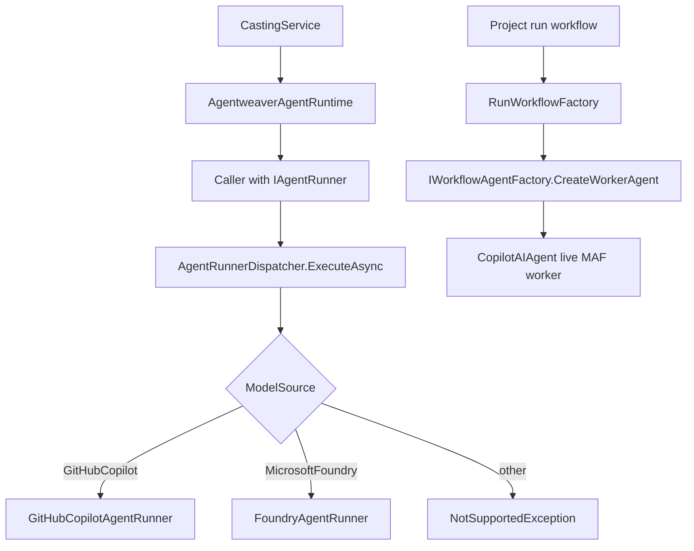
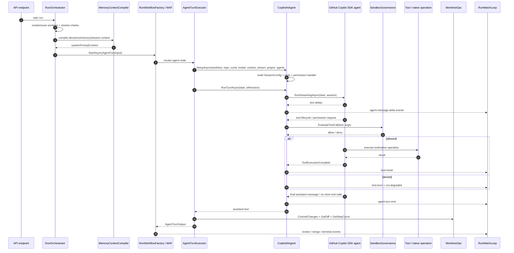

# Agent Runtime & Tools — Deep Dive

## Purpose & Scope

This document covers the runtime path that turns an Agentweaver run request into model execution, sandboxed tool activity, streamed run events, worktree commits, review/merge workflow outputs, and team-memory context.

Primary scope:

- `Agentweaver.AgentRuntime`: provider runners, the live workflow agent, workflow turn executors, sandbox governance wiring, and Agentweaver loopback API tools.
- `Agentweaver.AgentTools`: concrete `AIFunction` tools exposed to model providers and their string result contracts.

`Agentweaver.Squad` is intentionally only referenced at runtime integration points here. The dedicated deep dive for casting, catalog, naming, `.squad/` serialization, sync, and memory import/export is [Team Casting — Deep Dive](team-casting.md).

The runtime has two related execution seams:

1. **Legacy/one-shot `IAgentRunner` seam**: `AgentRunnerDispatcher` implements `IAgentRunner` and switches between `GitHubCopilotAgentRunner` and `FoundryAgentRunner` based on `ModelSource` (`packages/Agentweaver.Domain/IAgentRunner.cs:5-18`, `packages/Agentweaver.AgentRuntime/AgentRunnerDispatcher.cs:17-32`).
2. **Live MAF workflow seam**: project runs are built as Microsoft Agents Framework (MAF) workflows. The worker node is a `CopilotAIAgent` created through `IWorkflowAgentFactory`, not the dispatcher; `RunWorkflowFactory` explicitly retains `IAgentRunner` only for DI/test compatibility and creates a `CopilotAIAgent` worker (`apps/Agentweaver.Api/Runs/RunWorkflowFactory.cs:72-89`, `apps/Agentweaver.Api/Runs/RunWorkflowFactory.cs:136-150`, `apps/Agentweaver.Api/Runs/RunWorkflowFactory.cs:350-358`, `packages/Agentweaver.AgentRuntime/Workflow/WorkflowAgentFactory.cs:47-61`).

`GitHubCopilotAgentRunner` is still used by model-assisted casting: `CastingService` builds an `AgentweaverAgentRuntime` over `IAgentRunner`, and that runtime calls `ExecuteAsync` with `ModelSource.GitHubCopilot`, which dispatches to the GitHub Copilot runner (`apps/Agentweaver.Api/Casting/CastingService.cs:501-505`, `apps/Agentweaver.Api/Infrastructure/AgentweaverAgentRuntime.cs:29-41`, `packages/Agentweaver.AgentRuntime/AgentRunnerDispatcher.cs:27-30`).

## Package Map (AgentRuntime / AgentTools / Squad — responsibilities)

| Package | Responsibilities | Key evidence |
|---|---|---|
| `packages/Agentweaver.AgentRuntime` | Registers runtime services; builds provider clients; runs GitHub Copilot and Foundry provider loops; owns the live `CopilotAIAgent`; creates MAF worker/RAI/Scribe agents; emits run events; wires sandbox governance, approvals, questions, and Agentweaver API tools. | DI registers client factories, runners, dispatcher, approval/question stores, run options, and `WorkflowAgentFactory` (`packages/Agentweaver.AgentRuntime/AgentRuntimeServiceCollectionExtensions.cs:16-36`). `CopilotAIAgent` wraps the GitHub Copilot SDK, preserves governance/event emission, and is serializable/checkpointable (`packages/Agentweaver.AgentRuntime/CopilotAIAgent.cs:18-40`). |
| `packages/Agentweaver.AgentTools` | Defines `ISandboxTool`, per-run `SandboxToolContext`, tool options, and the canonical registry of model-callable sandbox functions. | `ISandboxTool` exposes a name and creates an `AIFunction` (`packages/Agentweaver.AgentTools/ISandboxTool.cs:5-17`). `SandboxToolRegistry.Build` instantiates tools and conditionally adds shell execution (`packages/Agentweaver.AgentTools/SandboxToolRegistry.cs:15-37`). |
| `packages/Agentweaver.Squad` | Runtime input provider for team membership, charters, and memory artifacts. Deep package details are covered in [Team Casting — Deep Dive](team-casting.md). | Project run submission validates `agent_name` through `SquadReader` and loads `.squad/agents/{name}/charter.md` before runtime launch (`apps/Agentweaver.Api/Endpoints/ProjectEndpoints.cs:530-548`). |

The API wires these packages together. `Program.cs` registers workflow services and orchestration services before `AddAgentRuntime()` (`apps/Agentweaver.Api/Program.cs:76-86`, `apps/Agentweaver.Api/Program.cs:193-201`) and also registers the casting services that provide team/charter inputs to runtime launches (`apps/Agentweaver.Api/Program.cs:247-251`).

## Runner Abstraction & Dispatch (interfaces, AgentRunnerDispatcher, which runner is used when)

`IAgentRunner` is the provider-neutral interface: it accepts task text, working directory, repository path, model source, run id, optional model id, optional stream writer, cancellation token, and optional system-prompt context (`packages/Agentweaver.Domain/IAgentRunner.cs:10-18`). The only valid provider enum values are `GitHubCopilot` and `MicrosoftFoundry` (`packages/Agentweaver.Domain/ModelSource.cs:3-11`).

`AgentRunnerDispatcher` chooses the concrete runner:

- `ModelSource.GitHubCopilot` -> `GitHubCopilotAgentRunner`.
- `ModelSource.MicrosoftFoundry` -> `FoundryAgentRunner`.
- Anything else throws `NotSupportedException` (`packages/Agentweaver.AgentRuntime/AgentRunnerDispatcher.cs:27-32`).

Important distinction:

- **Project run workflow path**: `RunOrchestrator` copies `Run.ModelSource` into `AgentTurnInput.ModelSource`, then calls `RunWorkflowFactory.StartAsync` (`apps/Agentweaver.Api/Runs/RunOrchestrator.cs:108-121`, `apps/Agentweaver.Api/Runs/RunOrchestrator.cs:276-289`, `apps/Agentweaver.Api/Runs/RunOrchestrator.cs:384-394`). `RunWorkflowFactory` builds a workflow node with `AgentTurnExecutor` and a worker from `_agentFactory.CreateWorkerAgent()` (`apps/Agentweaver.Api/Runs/RunWorkflowFactory.cs:350-373`). The production factory returns `new CopilotAIAgent(...)` for worker/rubberduck and specialized subclasses for RAI/Scribe (`packages/Agentweaver.AgentRuntime/Workflow/WorkflowAgentFactory.cs:47-61`). `AgentTurnExecutor` calls `_agent.SetupAsync(...)` and `_agent.RunTurnAsync(...)`; it does not dispatch on `input.ModelSource` (`packages/Agentweaver.AgentRuntime/Workflow/AgentTurnExecutor.cs:64-107`).
- **One-shot/casting path**: `AgentweaverAgentRuntime.RunAsync` calls `_agentRunner.ExecuteAsync(... ModelSource.GitHubCopilot ...)` (`apps/Agentweaver.Api/Infrastructure/AgentweaverAgentRuntime.cs:29-41`). This reaches `GitHubCopilotAgentRunner` through the dispatcher (`packages/Agentweaver.AgentRuntime/AgentRunnerDispatcher.cs:27-30`).
- **Foundry path**: `FoundryAgentRunner` is wired only behind the `IAgentRunner` dispatcher path: `AgentRunnerDispatcher.ExecuteAsync` routes `ModelSource.MicrosoftFoundry` to `_foundry.ExecuteAsync(...)` (`packages/Agentweaver.AgentRuntime/AgentRunnerDispatcher.cs:17-32`). When reached, `FoundryAgentRunner` creates an Azure OpenAI chat client through `FoundryClientFactory` and runs an explicit multi-turn tool loop with `MaxTurns = 30` (`packages/Agentweaver.AgentRuntime/FoundryAgentRunner.cs:72-82`, `packages/Agentweaver.AgentRuntime/FoundryAgentRunner.cs:121-161`, `packages/Agentweaver.AgentRuntime/FoundryAgentRunner.cs:167-235`; `packages/Agentweaver.AgentRuntime/Providers/FoundryClientFactory.cs:24-41`). The inspected app-level `IAgentRunner` callers pin `ModelSource.GitHubCopilot` (casting/runtime, blueprint generation, and workflow generation), so no app caller currently reaches the dispatcher with `ModelSource.MicrosoftFoundry` (`apps/Agentweaver.Api/Infrastructure/AgentweaverAgentRuntime.cs:33-41`, `apps/Agentweaver.Api/Blueprints/CopilotBlueprintGenerator.cs:133-142`, `apps/Agentweaver.Api/Workflows/CopilotWorkflowGenerator.cs:234-243`).

Verified: live project/coordinator runs do **not** go through `AgentRunnerDispatcher`, so a `microsoft-foundry` run request is persisted and carried as `AgentTurnInput.ModelSource` but still executes with the `CopilotAIAgent` worker. The standalone run endpoint accepts either API model source into `Run.ModelSource` (`apps/Agentweaver.Api/Endpoints/RunEndpoints.cs:44-52`, `apps/Agentweaver.Api/Endpoints/RunEndpoints.cs:65-76`), project runs resolve explicit/default provider and model id before reserving the `Run` (`apps/Agentweaver.Api/Endpoints/ProjectEndpoints.cs:498-517`, `apps/Agentweaver.Api/Endpoints/ProjectEndpoints.cs:550-567`), and `AgentTurnInput` carries `ModelSource` as a string (`packages/Agentweaver.AgentRuntime/Workflow/WorkflowMessages.cs:4-23`); however the workflow worker is selected solely by `IWorkflowAgentFactory.CreateWorkerAgent()` (`apps/Agentweaver.Api/Runs/RunWorkflowFactory.cs:350-358`, `packages/Agentweaver.AgentRuntime/Workflow/WorkflowAgentFactory.cs:47-49`). Coordinator-originated parent, pickup, and child runs hard-code `ModelSource.GitHubCopilot` before reaching the same workflow path (`apps/Agentweaver.Api/Coordinator/CoordinatorRunService.cs:116-128`, `apps/Agentweaver.Api/Coordinator/CoordinatorPickupService.cs:55-65`, `apps/Agentweaver.Api/Coordinator/CoordinatorDispatchService.cs:402-414`).

## Agent Turn Loop

The live agent loop is centered on `CopilotAIAgent`:

1. `RunOrchestrator` creates or reuses a worktree, resolves the agent charter, compiles memory context, constructs `AgentTurnInput`, starts the workflow, registers it, and starts a supervised watch loop (`apps/Agentweaver.Api/Runs/RunOrchestrator.cs:76-147`, `apps/Agentweaver.Api/Runs/RunOrchestrator.cs:468-548`).
2. `RunWorkflowFactory` creates a fresh worker `CopilotAIAgent`, creates `AgentTurnExecutor`, and wires review/merge/RAI/Scribe workflow nodes around it (`apps/Agentweaver.Api/Runs/RunWorkflowFactory.cs:350-373`, `apps/Agentweaver.Api/Runs/RunWorkflowFactory.cs:380-430`, `apps/Agentweaver.Api/Runs/RunWorkflowFactory.cs:507-530`).
3. `AgentTurnExecutor` merges inline node charters into system prompt context, calls `SetupAsync`, runs one turn, commits worktree changes, computes diff, and returns `AgentTurnOutput` (`packages/Agentweaver.AgentRuntime/Workflow/AgentTurnExecutor.cs:64-107`, `packages/Agentweaver.AgentRuntime/Workflow/AgentTurnExecutor.cs:135-152`).
4. `CopilotAIAgent.SetupAsync` loads sandbox policy, chooses direct vs sandbox executor, creates file/search tools, builds `SandboxToolContext`, builds session tools, and configures Copilot `SessionConfig` with working directory, disabled config discovery, deterministic session id, system message, tools, and model (`packages/Agentweaver.AgentRuntime/CopilotAIAgent.cs:192-239`, `packages/Agentweaver.AgentRuntime/CopilotAIAgent.cs:241-259`).
5. `RunTurnAsync` creates or resumes the SDK session and calls `ExecuteStreamingLoopAsync` (`packages/Agentweaver.AgentRuntime/CopilotAIAgent.cs:291-302`).
6. `ExecuteStreamingLoopAsync` emits sandbox/system/task/tool metadata, then streams the model call, retrying on token refresh or rate limit as needed (`packages/Agentweaver.AgentRuntime/CopilotAIAgent.cs:368-437`).
7. `StreamTurnOnceAsync` iterates `_inner.RunStreamingAsync`, emits token deltas, emits final message content when no deltas arrived, and translates SDK tool lifecycle objects into `tool.call`, `tool.result`, or `tool.error` run events (`packages/Agentweaver.AgentRuntime/CopilotAIAgent.cs:462-512`, `packages/Agentweaver.AgentRuntime/CopilotAIAgent.cs:606-663`).
8. The permission handler gates URL fetches, custom tools, MCP/native file/shell requests, and fail-closed errors before execution (`packages/Agentweaver.AgentRuntime/CopilotAIAgent.cs:675-942`).

For Foundry, the loop is explicit in `FoundryAgentRunner`: it sends `ChatMessage` history with `ChatOptions.Tools`, streams response updates, reconstructs the assistant message, executes any `FunctionCallContent` against registered `AIFunction`s, appends `FunctionResultContent` as a tool-role message, and repeats until no calls or `MaxTurns` is reached (`packages/Agentweaver.AgentRuntime/FoundryAgentRunner.cs:153-161`, `packages/Agentweaver.AgentRuntime/FoundryAgentRunner.cs:167-235`, `packages/Agentweaver.AgentRuntime/FoundryAgentRunner.cs:237-336`).

## Tool Catalog & Dispatch

### Registry and context

Every `AgentTools` tool implements `ISandboxTool` and creates a Microsoft.Extensions.AI `AIFunction` (`packages/Agentweaver.AgentTools/ISandboxTool.cs:5-17`). `SandboxToolContext` is the per-run dependency bundle: agent id, working directory, sandbox root, executor, file/search tools, redactor, options, logger, optional event emitter, run id, shell approval predicates, and optional question gate (`packages/Agentweaver.AgentTools/SandboxToolContext.cs:7-39`). `SandboxToolOptions` carries shell enablement, timeout, allowed repository roots, destructive command approval patterns, require-all-shell-approval, and network enablement (`packages/Agentweaver.AgentTools/SandboxToolOptions.cs:3-30`).

`SandboxToolRegistry.Build` constructs the canonical list and conditionally inserts `run_command` only when the executor has real isolation or direct mode and shell is enabled (`packages/Agentweaver.AgentTools/SandboxToolRegistry.cs:15-37`). `GetToolNames` exposes the canonical names for display/availability (`packages/Agentweaver.AgentTools/SandboxToolRegistry.cs:40-44`).

### Tool table

| Tool | Input/output contract | Handler |
|---|---|---|
| `run_command` | Inputs: `command`, optional `timeout_ms`. Requires HITL approval for all shell or destructive patterns, validates shell command, executes `SandboxCommand`, returns `stdout`, `stderr`, `exit_code`, and flags such as `timed_out` / `output_truncated`; denied/approval-required commands return explanatory strings. | `RunCommandTool` (`packages/Agentweaver.AgentTools/Tools/RunCommandTool.cs:12-18`, `packages/Agentweaver.AgentTools/Tools/RunCommandTool.cs:19-63`, `packages/Agentweaver.AgentTools/Tools/RunCommandTool.cs:65-86`) |
| `read_file` | Input: `path` relative to working directory. Returns file content or `Error: ...`. | `ReadFileTool` (`packages/Agentweaver.AgentTools/Tools/ReadFileTool.cs:10-19`) |
| `grep_search` | Inputs: `pattern`, optional `is_regex`, `include_pattern`, `max_results`. Returns `relativePath:line: content` lines or `No matches found.` | `GrepSearchTool` (`packages/Agentweaver.AgentTools/Tools/GrepSearchTool.cs:10-23`) |
| `file_search` | Inputs: glob `pattern`, optional `max_results`. Returns matching paths or `No files found.` | `FileSearchTool` (`packages/Agentweaver.AgentTools/Tools/FileSearchTool.cs:10-21`) |
| `str_replace_editor` | Inputs: `path`, unique `old_str`, `new_str`. Returns `ok`, `not replaced`, or `Error: ...`. | `StrReplaceEditorTool` (`packages/Agentweaver.AgentTools/Tools/StrReplaceEditorTool.cs:10-21`) |
| `apply_patch` | Input: `patch` in Copilot CLI patch grammar. Returns `Patch applied. ...` with per-hunk summary or `Error: ...`. | `ApplyPatchTool` (`packages/Agentweaver.AgentTools/Tools/ApplyPatchTool.cs:10-21`) |
| `create_file` | Inputs: `path`, `file_text`. Creates a new file and returns `ok` or `Error: ...`; fails if file exists. | `CreateFileTool` (`packages/Agentweaver.AgentTools/Tools/CreateFileTool.cs:10-20`) |
| `write_file` | Inputs: `path`, `content`. Creates or overwrites a file; returns `ok` or `Error: ...`. | `EditFileTool` (`packages/Agentweaver.AgentTools/Tools/EditFileTool.cs:10-20`) |
| `report_intent` | Input: `intent`. Tool function returns a reminder string; Copilot runtime suppresses raw tool lifecycle and emits `agent.intent` from permission/lifecycle handling. | `ReportIntentTool` (`packages/Agentweaver.AgentTools/Tools/ReportIntentTool.cs:10-19`), Copilot handling (`packages/Agentweaver.AgentRuntime/CopilotAIAgent.cs:622-640`, `packages/Agentweaver.AgentRuntime/CopilotAIAgent.cs:763-779`) |
| `report_outcome` | Inputs: `achieved`, `reason`. Tool function returns `Outcome recorded.`; Copilot runtime emits `run.outcome`. | `ReportOutcomeTool` (`packages/Agentweaver.AgentTools/Tools/ReportOutcomeTool.cs:10-19`), Copilot handling (`packages/Agentweaver.AgentRuntime/CopilotAIAgent.cs:781-803`) |
| `ask_question` | Input: `question`. Emits `agent.question_asked`, blocks on `IQuestionGate`, emits `agent.question_answered`, returns answer text or a best-judgement fallback on no gate/timeout. | `AskQuestionTool` (`packages/Agentweaver.AgentTools/Tools/AskQuestionTool.cs:8-15`, `packages/Agentweaver.AgentTools/Tools/AskQuestionTool.cs:29-64`) |

### Provider dispatch behavior

Copilot and Foundry consume the same tool definitions differently:

- **Copilot live workflow (`CopilotAIAgent`)** builds the full registry only to extract `report_intent`, `report_outcome`, and optionally `ask_question`, then appends Agentweaver API tools when `projectId` and `agentName` are set (`packages/Agentweaver.AgentRuntime/CopilotAIAgent.cs:1023-1060`). It deliberately does not register the full sandbox registry with Copilot because native file/shell tools are governed through the SDK permission handler; the older `GitHubCopilotAgentRunner` comment says registering only these functions avoids native-tool conflicts and keeps governance tight (`packages/Agentweaver.AgentRuntime/GitHubCopilotAgentRunner.cs:771-793`).
- **Copilot native and custom calls** are gated by `BuildPermissionHandler`. It handles URL fetch HITL approval, side-effect-free `report_intent` / `report_outcome`, Agentweaver API tools, custom external tools, native read/write/shell/MCP requests, fail-closed exceptions, and emits denial/degraded events (`packages/Agentweaver.AgentRuntime/CopilotAIAgent.cs:686-750`, `packages/Agentweaver.AgentRuntime/CopilotAIAgent.cs:753-883`, `packages/Agentweaver.AgentRuntime/CopilotAIAgent.cs:885-942`).
- **Foundry** registers the full `SandboxToolRegistry.Build` result as `ChatOptions.Tools`, maps common aliases like `edit` -> `write_file`, performs governance before invocation, calls `AIFunction.InvokeAsync`, and appends `FunctionResultContent` back to the chat history (`packages/Agentweaver.AgentRuntime/FoundryAgentRunner.cs:150-161`, `packages/Agentweaver.AgentRuntime/FoundryAgentRunner.cs:228-329`).
- **Agentweaver API tools** are runtime-owned tools, not part of `AgentTools`. They expose memory/decision/session tools for all project agents and additional project/run/coordinator tools only when `agentName == "Coordinator"` (`packages/Agentweaver.AgentRuntime/AgentweaverApiTools.cs:18-38`, `packages/Agentweaver.AgentRuntime/AgentweaverApiTools.cs:51-238`, `packages/Agentweaver.AgentRuntime/AgentweaverApiTools.cs:239-368`).

## Squad Touchpoints

This runtime uses Squad data as **inputs**, but does not own the Squad domain. For the deep dive on team casting, catalog, naming, model records, analysis, `.squad/` serialization/sync, and memory import/export, see [Team Casting — Deep Dive](team-casting.md).

Runtime-relevant touchpoints:

- Project run submission validates that `agent_name` is an active team member and loads the member charter from `.squad/agents/{name}/charter.md` before creating the run (`apps/Agentweaver.Api/Endpoints/ProjectEndpoints.cs:530-548`).
- `RunOrchestrator` resolves charters again defensively and injects the charter into `systemPromptContext` ahead of compiled memory context (`apps/Agentweaver.Api/Runs/RunOrchestrator.cs:444-466`, `apps/Agentweaver.Api/Runs/RunOrchestrator.cs:524-548`).
- Coordinator planning uses the current `Team` roster to assign real cast members to subtasks; dispatch then launches child runs through the same runtime path (`apps/Agentweaver.Api/Coordinator/CoordinatorOrchestratorExecutor.cs:27-35`, `apps/Agentweaver.Api/Coordinator/CoordinatorDispatchService.cs:37-64`).

## Integration with the API (how Runs/Coordinator drive the runtime)

### Service registration

At startup, the API registers event streaming, worktree, merge, workflow, watch-loop, restart, and orchestration services (`apps/Agentweaver.Api/Program.cs:70-86`), then calls `AddAgentRuntime()` (`apps/Agentweaver.Api/Program.cs:193-201`). `AddAgentRuntime()` registers:

- sandbox executor factory,
- Copilot/Foundry client factories,
- `GitHubCopilotAgentRunner`, `FoundryAgentRunner`, and `IAgentRunner -> AgentRunnerDispatcher`,
- shell/tool approval gates,
- question gate,
- run options store,
- `IWorkflowAgentFactory -> WorkflowAgentFactory` (`packages/Agentweaver.AgentRuntime/AgentRuntimeServiceCollectionExtensions.cs:16-36`).

### Standalone and project run endpoints

`POST /api/runs` validates task, repository, branch, and model source, creates a pending `Run`, seeds run options, and calls `RunOrchestrator.StartRunAsync` (`apps/Agentweaver.Api/Endpoints/RunEndpoints.cs:33-98`).

`POST /api/projects/{id}/runs` loads project settings, resolves model source/model id/base branch, validates `agent_name` as an active team member, loads the charter, reserves the run row, and starts `StartReservedProjectRunAsync` in a background task (`apps/Agentweaver.Api/Endpoints/ProjectEndpoints.cs:457-537`, `apps/Agentweaver.Api/Endpoints/ProjectEndpoints.cs:539-620`).

### Run orchestration

`RunOrchestrator` is a "thin launcher": it creates a worktree, persists/updates the run, opens the live stream, builds context, starts the MAF workflow, registers it, and starts a supervised watch loop (`apps/Agentweaver.Api/Runs/RunOrchestrator.cs:12-17`, `apps/Agentweaver.Api/Runs/RunOrchestrator.cs:76-147`). For child coordinator runs, it reuses the coordinator's shared worktree and starts the trimmed child workflow (`apps/Agentweaver.Api/Runs/RunOrchestrator.cs:149-223`).

Context assembly is a first-class step:

- `MemoryContextCompiler` orders context as decisions, core context, high-importance learnings/patterns, and current session (`apps/Agentweaver.Api/Memory/MemoryContextCompiler.cs:7-12`, `apps/Agentweaver.Api/Memory/MemoryContextCompiler.cs:54-116`).
- `RunOrchestrator.BuildContextAsync` injects child workers with only charter + active architectural/scope decisions + workspace boundary, while normal worker runs receive compiled memory plus charter and the memory protocol (`apps/Agentweaver.Api/Runs/RunOrchestrator.cs:468-548`, `apps/Agentweaver.Api/Runs/RunOrchestrator.cs:551-599`).

### Workflow execution, watching, and persistence

`RunWorkflowFactory` builds the MAF workflow, checkpoint manager, run graph metadata, agent/RAI/Scribe/merge/review nodes, and loopback API settings used by memory tools (`apps/Agentweaver.Api/Runs/RunWorkflowFactory.cs:21-24`, `apps/Agentweaver.Api/Runs/RunWorkflowFactory.cs:156-172`, `apps/Agentweaver.Api/Runs/RunWorkflowFactory.cs:175-201`, `apps/Agentweaver.Api/Runs/RunWorkflowFactory.cs:350-430`).

`RunWatchLoopService` watches MAF streaming events, translates executor lifecycle events into UI `workflow.step` events, records review gate requests, handles terminal outputs, abandons/cleans up completed runs, and fails runs on watch-loop errors/timeouts (`apps/Agentweaver.Api/Runs/RunWatchLoopService.cs:14-18`, `apps/Agentweaver.Api/Runs/RunWatchLoopService.cs:56-96`, `apps/Agentweaver.Api/Runs/RunWatchLoopService.cs:98-176`, `apps/Agentweaver.Api/Runs/RunWatchLoopService.cs:188-236`).

Run events are persisted/backfilled through `RunWorkflowFactory.PersistRunEventsAsync`, which mirrors in-memory stream history to the durable event stream or `RunEvents` table and completes the live channel (`apps/Agentweaver.Api/Runs/RunWorkflowFactory.cs:273-338`).

### Coordinator runtime

Coordinator runs are MAF workflows too. `CoordinatorWorkflowFactory` builds Phase 1 as draft -> confirmation gate -> finalize/revise loop, and its confirmed path calls `CoordinatorOrchestratorExecutor.OrchestrateAsync` to decompose and persist a work plan (`apps/Agentweaver.Api/Coordinator/CoordinatorWorkflowFactory.cs:17-31`, `apps/Agentweaver.Api/Coordinator/CoordinatorWorkflowFactory.cs:108-175`).

`CoordinatorRunService.ActivateAsync` seeds run options, creates the run stream, starts the coordinator workflow, registers it, and starts watching (`apps/Agentweaver.Api/Coordinator/CoordinatorRunService.cs:214-245`). Phase 2 dispatch is owned by `CoordinatorDispatchService`, which launches ready subtasks as child runs via `RunOrchestrator.StartChildRunAsync`, observes child run streams, and emits coordinator topology/subtask lifecycle events (`apps/Agentweaver.Api/Coordinator/CoordinatorDispatchService.cs:37-64`, `apps/Agentweaver.Api/Coordinator/CoordinatorDispatchService.cs:120-150`).

## Extension Points & Gotchas

### Adding a tool

1. Add an `ISandboxTool` implementation under `packages/Agentweaver.AgentTools/Tools/` with a canonical `Name` and `CreateFunction` returning an `AIFunction` (`packages/Agentweaver.AgentTools/ISandboxTool.cs:8-17`).
2. Add it to `SandboxToolRegistry.Build` and `GetToolNames` if it should be part of the canonical catalog (`packages/Agentweaver.AgentTools/SandboxToolRegistry.cs:15-44`).
3. If the tool is for Foundry, confirm governance can evaluate it before invocation; Foundry injects/normalizes args and calls `governance.EvaluateToolCall` before `InvokeAsync` (`packages/Agentweaver.AgentRuntime/FoundryAgentRunner.cs:262-318`).
4. If the tool is for Copilot live workflow, decide whether it should be:
   - a native SDK tool governed by `PermissionRequest` mapping (`packages/Agentweaver.AgentRuntime/CopilotAIAgent.cs:952-976`),
   - a custom session tool added in `BuildSessionConfigTools` (`packages/Agentweaver.AgentRuntime/CopilotAIAgent.cs:1023-1060`), or
   - an Agentweaver API tool added in `AgentweaverApiTools.Build` (`packages/Agentweaver.AgentRuntime/AgentweaverApiTools.cs:40-57`).
5. Emit stable string results. The model sees tool results as strings in both runners (`packages/Agentweaver.AgentRuntime/FoundryAgentRunner.cs:316-329`, `packages/Agentweaver.AgentRuntime/CopilotAIAgent.cs:565-577`).
6. For HITL tools, add stream events and an API answer/approval seam. Existing examples are shell approvals (`packages/Agentweaver.AgentTools/Tools/RunCommandTool.cs:19-63`), URL approvals (`packages/Agentweaver.AgentRuntime/CopilotAIAgent.cs:686-750`), and questions (`packages/Agentweaver.AgentTools/Tools/AskQuestionTool.cs:49-60`).

Gotchas:

- `run_command` is absent unless shell is enabled and execution is real-isolated or direct (`packages/Agentweaver.AgentTools/SandboxToolRegistry.cs:31-35`).
- Copilot `SessionConfig.EnableConfigDiscovery` is forced `false` to avoid loading external MCP/skills/config from disk (`packages/Agentweaver.AgentRuntime/CopilotAIAgent.cs:241-250`).
- Copilot live workflow does not register the full sandbox registry; native tool names are governed by permission requests, while only selected custom functions and API tools are registered (`packages/Agentweaver.AgentRuntime/CopilotAIAgent.cs:1023-1060`).
- Denied tool calls should be observable and non-silent. `CopilotAIAgent` emits `tool.error` and `run.degraded` for denied native/custom calls (`packages/Agentweaver.AgentRuntime/CopilotAIAgent.cs:854-860`, `packages/Agentweaver.AgentRuntime/CopilotAIAgent.cs:910-919`).

### Adding a runner/provider

1. Add the provider to `ModelSource` and API string conversion (`packages/Agentweaver.Domain/ModelSource.cs:7-27`).
2. Implement `IAgentRunner.ExecuteAsync` with the same stream/event semantics and result contract (`packages/Agentweaver.Domain/IAgentRunner.cs:10-18`).
3. Register the concrete runner in `AddAgentRuntime()` and update `AgentRunnerDispatcher` (`packages/Agentweaver.AgentRuntime/AgentRuntimeServiceCollectionExtensions.cs:26-35`, `packages/Agentweaver.AgentRuntime/AgentRunnerDispatcher.cs:27-32`).
4. Update API validators that currently accept only `github-copilot` or `microsoft-foundry` (`apps/Agentweaver.Api/Endpoints/RunEndpoints.cs:50-52`, `apps/Agentweaver.Api/Endpoints/ProjectEndpoints.cs:498-517`).
5. Decide whether the provider participates in the live MAF workflow. Today, the live worker seam is `IWorkflowTurnAgent`, and production creates `CopilotAIAgent`; adding a provider for live project runs requires a new `IWorkflowTurnAgent` implementation or a factory dispatch based on `AgentTurnInput.ModelSource` (`packages/Agentweaver.AgentRuntime/Workflow/IWorkflowTurnAgent.cs:18-42`, `packages/Agentweaver.AgentRuntime/Workflow/WorkflowAgentFactory.cs:47-61`, `packages/Agentweaver.AgentRuntime/Workflow/AgentTurnExecutor.cs:89-107`).

Gotchas:

- The live worker must support setup, turn execution, disposal, and preferably session serialization/checkpointing. `CopilotAIAgent` delegates session serialization/deserialization to the inner SDK agent so MAF checkpoints include Copilot session state (`packages/Agentweaver.AgentRuntime/CopilotAIAgent.cs:322-353`).
- `RaiAIAgent` and `ScribeAIAgent` are thin `CopilotAIAgent` subclasses that intentionally no-op serialization because they are ephemeral single-turn agents (`packages/Agentweaver.AgentRuntime/RaiAIAgent.cs:10-40`, `packages/Agentweaver.AgentRuntime/ScribeAIAgent.cs:10-39`).
- The base prompt is intentionally minimal; agent identity and working style should come from charter/system prompt context, not provider code (`packages/Agentweaver.AgentRuntime/AgentBasePrompt.cs:3-52`).
- `RunOrchestrator` always appends `WorkerMemoryProtocol` to worker/child prompts so new runners must preserve system-prompt context if they should use memory/decision tools (`apps/Agentweaver.Api/Runs/RunOrchestrator.cs:35-52`, `apps/Agentweaver.Api/Runs/RunOrchestrator.cs:551-559`).
