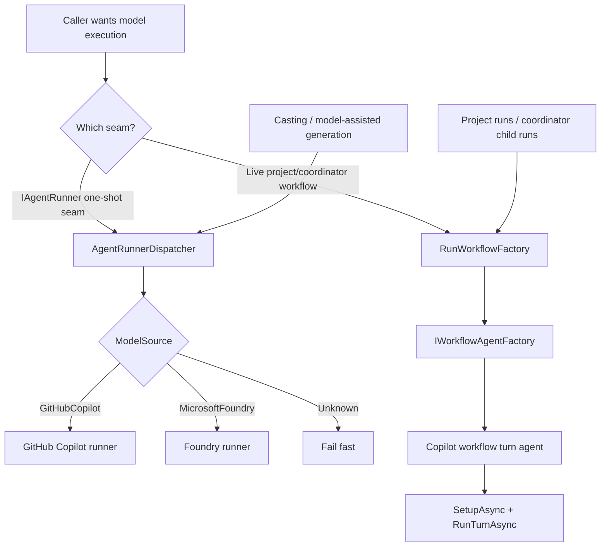
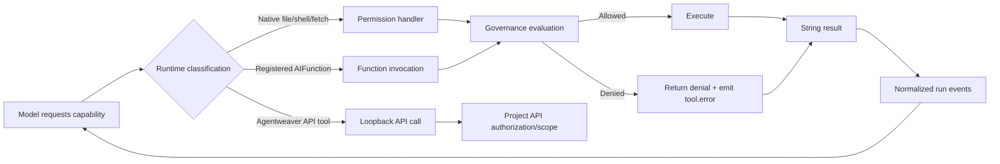

# Agent Runtime & Tools — Conceptual Deep Dive

## Purpose and scope

This document explains the runtime logic behind Agentweaver: how a human request becomes an agent turn, how tools are made available safely, how providers are selected, and how the system records what happened. It is written for an engineer who wants to rebuild the runtime from first principles, not for someone trying to follow source files line by line.

Primary scope:

- `Agentweaver.AgentRuntime`: the turn loop, provider seams, workflow agents, governance, RAI/Scribe touchpoints, and event emission.
- `Agentweaver.AgentTools`: the model-callable tool catalog and the per-run context that makes tools safe and reproducible.

`Agentweaver.Squad` is only a runtime input here. For casting, roster management, `.squad/` serialization, naming, and memory import/export, see [Team Casting — Deep Dive](team-casting.md).

## The runtime mental model

An Agentweaver run is not simply "send a prompt to a model." It is a controlled workflow around a model turn:

1. **Prepare an isolated workspace** so the agent can change files without directly mutating the source branch.
2. **Assemble identity and context** from the selected agent charter, task, project memory, active decisions, session context, and workspace boundaries.
3. **Create a provider-backed turn agent** that knows how to speak to a model provider and stream results.
4. **Expose tools through a governed tool plane** so the model can inspect, edit, ask questions, report intent, and record memory without bypassing policy.
5. **Stream normalized events** so the UI, persistence layer, watch loop, review gates, and coordinator can reason about the run without knowing provider internals.
6. **Persist the work and observations** by committing workspace changes, computing a diff, running review/RAI/Scribe steps, and exporting memory when appropriate.

The important design choice is that model execution is treated as one node inside a broader workflow. The model decides what to do next, but the runtime decides what context it receives, which tools exist, whether an action is allowed, how output is observed, and how the run advances.

## Package responsibilities

| Area | Conceptual responsibility |
|---|---|
| `Agentweaver.AgentRuntime` | Owns the live turn agents, provider adapters, workflow executors, sandbox governance, run-event emission, review/RAI/Scribe integration, and Agentweaver loopback API tools. |
| `Agentweaver.AgentTools` | Defines the canonical tool contracts as `AIFunction`s and the per-run context they need: workspace, sandbox root, executor, redactor, approvals, options, event hooks, and question gates. |
| `Agentweaver.Squad` | Supplies runtime inputs such as agent identity, charters, team membership, decisions, and memory artifacts. The runtime consumes these inputs but does not own team casting. |

The packages are intentionally separated so tool contracts can remain provider-neutral while the runtime decides how each provider sees and governs those tools.

Where this lives:

- `packages/Agentweaver.AgentRuntime`
- `packages/Agentweaver.AgentTools`
- `packages/Agentweaver.Squad`

## The life of a run

A run begins in the API layer, but its core shape is runtime-driven:

1. **Reserve the run.** The API validates the task, repository/project, branch, model preference, and optional `agent_name`. It creates a durable run record before work begins.
2. **Resolve the working area.** The orchestrator creates or reuses a worktree. Coordinator child runs can share a parent worktree so subtasks collaborate on one branch instead of creating isolated branches that later conflict.
3. **Resolve the agent identity.** Project runs validate that the requested agent exists in the team and load that agent's charter. The charter is part of the system context, not an implementation detail.
4. **Compile context.** Runtime context is ordered so durable decisions and memory precede the current task. Child worker runs receive narrower context to reduce leakage and keep subtasks focused.
5. **Start a workflow.** The workflow wraps the worker turn with surrounding nodes: review, merge, RAI, Scribe, and coordinator-specific paths when needed.
6. **Watch and persist.** A watch loop listens to workflow and runtime events, translates them into UI-visible status, persists history, and handles terminal states.

```mermaid
sequenceDiagram
    autonumber
    participant API as API endpoint
    participant OR as Run orchestrator
    participant CTX as Context compiler
    participant WF as Workflow
    participant EX as Agent turn executor
    participant AG as Turn agent
    participant SDK as Provider SDK
    participant TOOL as Tool/governance plane
    participant WT as Worktree operations
    participant WATCH as Watch loop / event stream

    API->>OR: Request run
    OR->>OR: Reserve run + prepare worktree
    OR->>CTX: Compile charter, decisions, memory, session context
    CTX-->>OR: System prompt context
    OR->>WF: Start workflow with AgentTurnInput
    WF->>EX: Invoke worker node
    EX->>AG: Setup run-scoped session, tools, permissions
    EX->>AG: Run one turn with task
    AG->>SDK: Stream model execution
    SDK-->>AG: Text deltas
    AG-->>WATCH: agent.message.delta
    SDK-->>AG: Tool or permission request
    AG->>TOOL: Evaluate policy and execute if allowed
    TOOL-->>AG: Result or denial
    AG-->>WATCH: tool.* / run.degraded / run.outcome
    SDK-->>AG: Final assistant response
    AG-->>WATCH: agent.turn.end
    AG-->>EX: Assistant text
    EX->>WT: Commit changes, compute diff, count steps
    EX-->>WF: AgentTurnOutput
    WF-->>WATCH: Review, merge, RAI, Scribe, terminal events
```

### Why this shape?

- **The run must be restartable.** Workflows and provider sessions can be checkpointed or reconstructed, so long-running runs survive process boundaries better than a single in-memory method call.
- **The model must not own policy.** The model can request a shell command or file edit, but governance, approvals, and sandbox boundaries are enforced outside the model.
- **The UI needs provider-neutral events.** A Copilot stream, a Foundry chat loop, a tool denial, and a review gate all become normalized run events.
- **Post-processing is part of correctness.** A useful agent run is not complete when the model stops talking; Agentweaver still needs a diff, commit, review state, RAI verdict, and memory pass.

Where this lives:

- `apps/Agentweaver.Api/Runs`
- `packages/Agentweaver.AgentRuntime/Workflow`
- `packages/Agentweaver.AgentRuntime/CopilotAIAgent.cs`

## Agent turn loop

A **turn** is one bounded attempt by an agent to satisfy a task in a workspace. The turn loop has five conceptual phases.

### 1. Setup: build the run-scoped execution environment

The turn agent is configured per run, not globally. Setup receives the working directory, repository root, run id, model id, stream writer, project id, agent name, system context, and cancellation token. From those inputs it builds:

- a provider session configuration;
- a deterministic session identity tied to the run;
- a system prompt containing the base runtime instructions plus charter/memory context;
- sandbox policy and the selected command executor;
- file/search/edit helper objects scoped to the workspace;
- tool context and tool catalog;
- a permission handler that mediates native provider operations;
- an event emitter that can write normalized `RunEvent`s.

This phase intentionally disables provider-side config discovery for the live Copilot path. The runtime wants a controlled tool surface; it should not accidentally load arbitrary local MCP servers, skills, or config from the repository.

**Invariant:** anything that can affect tool access, workspace location, prompt context, or event output must be derived during setup and reset between runs. A reused agent instance must not leak event state, permission state, or registered tool names from a previous run.

### 2. Start or resume the provider session

The live Copilot worker uses a provider SDK session. If a workflow resumes, the runtime can deserialize the provider session state; otherwise it creates a fresh session. This is why the live worker implements serialization hooks. Ephemeral built-in reviewers such as RAI and Scribe intentionally do not need durable session state because they run short, single-purpose turns.

**Trade-off:** preserving provider session state improves continuity and checkpointing, but it couples the live worker to provider-specific serialization. Agentweaver hides that coupling behind the workflow turn-agent interface.

### 3. Stream model execution

The runtime sends the task into the provider session and consumes streaming updates. During streaming it emits:

- configuration snapshots such as selected sandbox backend and registered tools;
- the task and effective system prompt metadata;
- assistant token deltas;
- tool call, result, and error events;
- special semantic events such as `agent.intent` and `run.outcome`;
- terminal turn events.

The runtime also retries known recoverable provider failures such as token refresh or rate-limit cases. It does not change the task semantics during retry; it simply attempts to complete the same turn.

**Invariant:** every observable action should produce stable, ordered events. Tool results must not appear before their call. Denials must not be silent. A degraded run must emit `run.degraded` before the run appears terminal to clients.

### 4. Mediate tool use

The model may request file reads, edits, shell commands, URL fetches, API tools, or custom functions. The runtime classifies the request, evaluates policy, and either allows execution or returns a denial.

For Copilot live runs, native provider operations are governed through the permission-request callback. This lets Agentweaver use provider-native file/shell capabilities while still applying Agentweaver policy. For registered custom functions, the runtime can decide whether to suppress raw tool lifecycle events and emit more meaningful domain events instead.

For Foundry, the runtime runs an explicit loop: send chat history and tool definitions, receive function calls, evaluate governance, invoke the matching function, append the function result to chat history, and continue until no calls remain or the turn limit is reached.

**Invariant:** the model only sees string-like tool results. This keeps the tool contract simple and portable across providers.

### 5. Close the turn and hand control back to the workflow

When the provider has no more work for the turn, the executor collects the assistant response, commits workspace changes, computes the diff, counts steps, and returns a structured turn output. The workflow then decides whether to proceed to review, ask for revision, merge, run RAI, run Scribe, or finish.

**Trade-off:** committing at the turn boundary creates a clear audit point and diff, but means each turn must be treated as an atomic unit of work. Multi-turn revision is modeled as additional workflow edges rather than hidden continuation inside the provider loop.

Where this lives:

- `packages/Agentweaver.AgentRuntime/CopilotAIAgent.cs`
- `packages/Agentweaver.AgentRuntime/Workflow/AgentTurnExecutor.cs`
- `packages/Agentweaver.AgentRuntime/Workflow/IWorkflowTurnAgent.cs`

## Runner selection and provider seams

Agentweaver has two provider seams that are easy to confuse.

### Seam 1: the legacy/one-shot runner dispatcher

`IAgentRunner` is a provider-neutral interface for "execute this task in this directory with this model source." The dispatcher chooses a concrete runner from `ModelSource`:

- `GitHubCopilot` routes to the GitHub Copilot runner.
- `MicrosoftFoundry` routes to the Foundry runner.
- unknown providers fail fast.

This seam is useful for one-shot model-assisted tasks and older runtime paths. Foundry is plumbed here and can run if a caller reaches this dispatcher with `MicrosoftFoundry`.

### Seam 2: the live workflow turn-agent seam

Project and coordinator runs are Microsoft Agents Framework workflows. The worker node is created through the workflow agent factory as a Copilot-backed workflow turn agent. The workflow executor calls `SetupAsync` and `RunTurnAsync` on that worker; it does not dispatch on `AgentTurnInput.ModelSource` to select Foundry.

This is the key nuance:

> The dispatcher can route to Foundry, but the live project/coordinator run path currently builds the Copilot workflow agent. Foundry is plumbed behind the dispatcher, but it is not active on the live run path.

### Why keep both seams?

- The dispatcher is simple and provider-neutral. It is a good adapter for operations that only need "prompt plus workspace plus result."
- The workflow turn-agent seam supports checkpointing, structured workflow edges, review loops, RAI/Scribe nodes, and provider session state.
- Keeping Foundry behind the dispatcher lets the project evolve toward provider choice without forcing the live workflow to support all provider-specific session behavior immediately.

### Foundry's conceptual loop

Foundry does not use the Copilot SDK's native permission callback. Its runner owns the tool loop directly:

1. Build chat history with the system prompt and user task.
2. Register the full sandbox tool catalog as chat tools.
3. Ask the model for the next assistant response.
4. If the response contains function calls, normalize aliases, evaluate governance, invoke allowed functions, and append results.
5. Repeat until the model stops calling tools or a maximum turn count is reached.

This makes Foundry easier to reason about as a classic tool-calling loop, but it means the runner must implement details that Copilot delegates to its SDK.

Unverified: no inspected app-level live run path currently selects Foundry through the workflow factory. External callers that directly use `IAgentRunner` could still exercise the Foundry dispatcher path.

Where this lives:

- `packages/Agentweaver.Domain/IAgentRunner.cs`
- `packages/Agentweaver.Domain/ModelSource.cs`
- `packages/Agentweaver.AgentRuntime/AgentRunnerDispatcher.cs`
- `packages/Agentweaver.AgentRuntime/FoundryAgentRunner.cs`
- `packages/Agentweaver.AgentRuntime/GitHubCopilotAgentRunner.cs`
- `packages/Agentweaver.AgentRuntime/Workflow`

## Tool model

Tools are the runtime's contract with the model. A tool is not just a method; it is a named capability with a schema, description, result contract, policy context, and event behavior.

### Why tool context is per-run

The same tool name can mean different concrete authority in different runs. `read_file` in one run must be scoped to that run's worktree, while `run_command` may be disabled, sandboxed, or approval-gated depending on run options. For that reason, tools are built from a `SandboxToolContext` rather than from global singletons.

A run-scoped tool context contains the facts a tool needs to make safe decisions:

- agent identity and run id;
- working directory and sandbox root;
- command executor and whether it provides real isolation;
- file/search/edit helpers restricted to allowed roots;
- output redaction;
- shell/network/destructive-command options;
- approval predicates and question gates;
- event hooks for user-visible progress.

**Invariant:** tools should not rediscover authority from process state. They should receive authority explicitly through context.

### Canonical sandbox tools

The canonical catalog covers a small set of capabilities:

| Capability | Conceptual purpose |
|---|---|
| `read_file` | Let the model inspect known files. |
| `file_search` | Let the model discover paths by glob-like patterns. |
| `grep_search` | Let the model find text without reading the whole repository. |
| `str_replace_editor` | Make precise edits when the old text is known. |
| `apply_patch` | Apply structured multi-file patches. |
| `create_file` / `write_file` | Create or overwrite files when the runtime allows it. |
| `run_command` | Execute commands through the selected sandbox/direct executor, subject to shell policy and approval. |
| `report_intent` | Let the agent announce what it is about to do in a UI-friendly way. |
| `report_outcome` | Let the agent declare whether the task was achieved and why. |
| `ask_question` | Let the agent request human input through a controlled gate instead of stalling silently. |

`run_command` is conditional. It only exists when shell execution is enabled and the selected executor mode is acceptable for the run. This avoids advertising a capability the runtime will never allow.

### Copilot live tool exposure

The live Copilot path intentionally does **not** register the entire sandbox catalog as custom functions. Instead:

- provider-native file/shell operations are allowed to exist, but every operation is mediated by the permission handler;
- selected custom functions such as intent/outcome/question are registered because they represent Agentweaver-specific semantics;
- Agentweaver API tools are registered when the run has project and agent identity;
- raw lifecycle events for some semantic tools are suppressed and replaced with higher-level events such as `agent.intent` or `run.outcome`.

This design avoids duplicate/conflicting file tools while keeping Agentweaver governance in front of native provider operations.

### Foundry tool exposure

Foundry receives the full canonical sandbox catalog as function tools. Because Foundry does not have the same native permission callback, the runner performs the whole loop explicitly: map the requested function name, check governance, invoke the function, convert the result to text, and append it to chat history.

### Agentweaver API tools

Agentweaver API tools are runtime-owned loopback tools, not sandbox file tools. They let agents interact with project state through the same API surface humans and MCP clients use.

Common project-agent tools include:

- submit a decision to the inbox;
- record memory;
- update the current session;
- list decisions and pending inbox entries;
- read memory;
- export memory artifacts.

Coordinator runs receive additional coordination tools because they manage plans and child work. Regular workers should not get coordinator-only authority.

**Trade-off:** loopback API tools make agents first-class participants in project memory, but they must be scoped by project id, agent name, API base URL, and API key. Without those boundaries, a tool call could affect the wrong project.

### Human-in-the-loop tools

Some actions require a human or external decision:

- shell commands may require approval globally or when they match destructive patterns;
- URL fetches can be approval-gated;
- `ask_question` can pause on a question gate and resume with the answer.

The tool should always produce a useful result even when the gate is unavailable or times out: either a denial, a fallback instruction to use best judgment, or an explicit explanation. Silent blocking is not acceptable.

Where this lives:

- `packages/Agentweaver.AgentTools`
- `packages/Agentweaver.AgentRuntime/AgentweaverApiTools.cs`
- `packages/Agentweaver.AgentRuntime/SandboxGovernance.cs`
- `packages/Agentweaver.AgentRuntime/InMemoryToolApprovalGate.cs`
- `packages/Agentweaver.AgentRuntime/InMemoryQuestionGate.cs`

## Governance and sandboxing

The runtime assumes model output is untrusted intent. A requested command or edit is not safe just because the model produced it.

Governance answers three questions:

1. **Is the capability available?** For example, shell execution may be disabled entirely.
2. **Is the target in bounds?** File operations should stay inside allowed repository/workspace roots.
3. **Does the action need approval or denial?** Destructive commands, broad shell access, URL fetches, and native tool requests can require explicit approval or fail closed.

The sandbox executor is the mechanical side of this policy. It determines where commands run and whether execution has real isolation. The governance layer is the decision side. The event stream is the observability side.

**Important invariant:** denial is a successful policy outcome, not an internal failure. The agent and UI should see that the attempted action was blocked, why it was blocked, and whether the run is now degraded.

**Trade-off:** stricter fail-closed behavior improves safety but can reduce agent autonomy. Agentweaver mitigates this by surfacing denials as context the agent can adapt to, rather than hiding them.

Where this lives:

- `packages/Agentweaver.AgentRuntime/SandboxGovernance.cs`
- `packages/Agentweaver.SandboxExec`
- `packages/Agentweaver.AgentTools/Tools/RunCommandTool.cs`
- `packages/Agentweaver.AgentRuntime/NativeToolExclusion.cs`

## Event emission

Events are the runtime's shared language. They decouple provider-specific streaming from the rest of Agentweaver.

A useful event stream must provide:

- **ordering:** sequence numbers increase monotonically for a run;
- **correlation:** tool results and errors refer back to tool calls;
- **semantic compression:** noisy provider internals can become domain events like `agent.intent`;
- **durability:** live streams can be mirrored into persistent history;
- **terminal clarity:** clients should know when a turn ended, when a run degraded, and when workflow nodes completed.

The Copilot live agent therefore emits both low-level and high-level events: token deltas, tool calls, tool results, tool errors, sandbox selections, warnings, system prompt metadata, task metadata, RAI verdicts, Scribe status, and run outcome signals.

The runtime is careful about event timing. If a tool denial happens near the end of a turn, `run.degraded` is flushed before the terminal turn/run events so a live client does not render a clean success while missing the warning.

Where this lives:

- `packages/Agentweaver.AgentRuntime/CopilotAIAgent.cs`
- `packages/Agentweaver.AgentRuntime/Workflow/WorkflowStepEvents.cs`
- `apps/Agentweaver.Api/Runs/RunWatchLoopService.cs`
- `apps/Agentweaver.Api/Runs/RunWorkflowFactory.cs`

## RAI and Scribe touchpoints

RAI and Scribe are built-in agents that reuse the same Copilot-based turn machinery but serve narrow workflow roles.

### RAI

RAI runs after the worker produces changes and before the work is treated as safe to ship. It receives the produced diff and reviews for security vulnerabilities, harmful content, PII exposure, and ethical concerns. Its verdict controls workflow behavior:

- **GREEN:** proceed.
- **YELLOW:** advisory warning; proceed with caution.
- **REVISE:** send actionable feedback back into the workflow so the worker can revise.
- **RED:** flag content safety and fail the RAI gate.

The verdict parser is intentionally defensive: it looks for explicit verdict markers rather than treating any mention of a word like "red" as a verdict. If RAI fails or returns an unparseable response, configuration decides whether to fail closed or proceed with an advisory warning.

### Scribe

Scribe runs after a project run reaches a terminal state. Its role is memory hygiene, not code generation. It reviews what happened, records durable learnings or patterns, updates session context, and exports memory artifacts. Scribe failures are non-fatal to the completed run; they should be visible, but they should not turn a finished worker run into a failed one.

Scribe uses the same loopback API tool model as other agents, but its charter narrows authority: manage memory, merge/archive/export as appropriate, and do not make product/design decisions on behalf of the worker.

Where this lives:

- `packages/Agentweaver.AgentRuntime/RaiAIAgent.cs`
- `packages/Agentweaver.AgentRuntime/ScribeAIAgent.cs`
- `packages/Agentweaver.AgentRuntime/Workflow/RaiTurnExecutor.cs`
- `packages/Agentweaver.AgentRuntime/Workflow/ScribeTurnExecutor.cs`

## Squad touchpoints

The runtime consumes Squad data as context and routing input:

- project run submission validates that `agent_name` belongs to the active team;
- the selected agent's charter is injected into the system context;
- project decisions and memories are compiled into prompt context;
- coordinator planning can assign work to real team members and dispatch child runs through the same runtime path.

The runtime should not know how to cast a team, name agents, or serialize the `.squad/` directory beyond consuming the artifacts it needs. Keep that domain in Squad. See [Team Casting — Deep Dive](team-casting.md).

Where this lives:

- `apps/Agentweaver.Api/Endpoints/ProjectEndpoints.cs`
- `apps/Agentweaver.Api/Runs/RunOrchestrator.cs`
- `apps/Agentweaver.Api/Coordinator`
- `packages/Agentweaver.Squad`

## Rebuilding the runtime: design checklist

If you were rebuilding Agentweaver's runtime, preserve these design invariants:

1. **Separate workflow orchestration from provider execution.** A model turn is a workflow node, not the whole run.
2. **Make provider selection explicit.** Do not assume a model source string affects live workflows unless the workflow factory dispatches on it.
3. **Build tools per run.** Tool authority must come from run context, not process globals.
4. **Govern before executing.** File, shell, network, native, and API actions must pass policy outside the model.
5. **Return stable tool strings.** Providers differ, but the model should receive simple, predictable tool results.
6. **Normalize events.** UI and persistence should depend on Agentweaver event types, not provider SDK objects.
7. **Make denials observable.** A blocked action should emit a tool error and, when appropriate, a degraded-run signal.
8. **Commit at boundaries.** The workflow needs durable worktree state and diffs after turns.
9. **Keep memory explicit.** Agents record decisions and memory through API tools; prompt context is compiled deliberately.
10. **Treat reviewers as agents with narrow charters.** RAI and Scribe reuse the runtime but have constrained responsibilities.

## Extension points and gotchas

### Adding a tool

To add a provider-neutral sandbox tool:

1. Define the tool name, input schema, description, and string result contract.
2. Decide what run-scoped authority it needs and add that to the tool context if necessary.
3. Add it to the canonical registry only if it should be generally available.
4. Decide how each provider should see it:
   - Foundry can receive it as a normal function tool.
   - Copilot live may be better served by native provider capabilities plus permission handling, or by a selected custom function if the tool has Agentweaver-specific semantics.
5. Add governance and event behavior before exposing it to the model.

Gotchas:

- Advertising a tool the runtime will deny every time trains the model badly. Prefer conditional registration.
- If the tool has side effects, denial and approval paths need first-class event output.
- Avoid returning complex provider-specific objects. Convert results into concise strings.

### Adding a provider

To add a provider for the one-shot seam, implement the runner interface, register it, and update the dispatcher/model-source conversion.

To add a provider for live project/coordinator runs, that is not enough. You also need a workflow turn-agent implementation that supports setup, turn execution, event normalization, tool governance, and ideally session serialization. Then update the workflow agent factory to select it based on run input.

Gotchas:

- Foundry support in the dispatcher does not imply Foundry support in live workflows.
- New providers must preserve system-prompt context, memory instructions, and event semantics.
- If the provider has no native permission callback, the runner must own the tool loop explicitly.

### Changing RAI or Scribe

RAI and Scribe are workflow safety/memory nodes, not general worker agents. Keep their charters narrow and their failure behavior explicit:

- RAI may block or request revision depending on verdict.
- Scribe should report failure but not invalidate an already-terminal worker run.
- Both should avoid long-lived session assumptions unless their workflow role changes.
