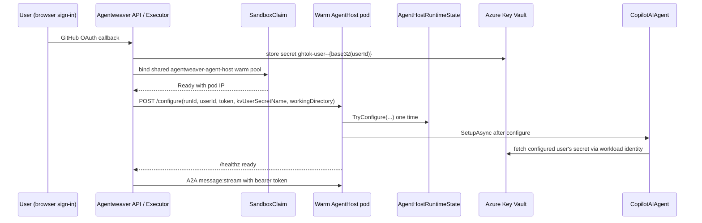

# Agent-host token delivery — Deep Dive

AgentHost pods act on behalf of the signed-in GitHub user that owns a run. They clone, push, and call GitHub APIs with that user's token. This page describes the current warm-pool delivery model.

The A2A turn endpoint has a separate per-run bearer token. `KubernetesSandboxExecutor` sends it in `POST /configure`, `RemoteAgentProxy` uses it as `Authorization: Bearer ...` on `message:stream`, and AgentHost rejects turns without the configured token.

## Delivery model

Each authenticated user's GitHub OAuth token is stored in Azure Key Vault under a per-user secret name (`ghtok-user--{base32(userId)}`). AgentHost pods no longer mount user tokens through CSI and no longer require per-run `SecretProviderClass` objects.

Instead, the AgentHost warm pool keeps two pods running in standby. At run launch the executor claims one warm pod and calls:

```http
POST /configure
Content-Type: application/json

{
  "runId": "...",
  "userId": "...",
  "turnBearerToken": "...",
  "kvUserSecretName": "ghtok-user--..."
}
```

`AgentHostRuntimeState` stores those values once. `KeyVaultUserTokenProvider` then uses `SecretClient` with `DefaultAzureCredential` to fetch only `KvUserSecretName` from the Key Vault URI configured before startup. The JSON format matches the old file-mounted token format, so downstream token-store behavior is unchanged. The token is cached in memory for the pod lifetime.

## End-to-end flow



## Components

- **`AgentHostRuntimeState`** — mutable singleton populated by `/configure` or by the backward-compatible env launch path. `TryConfigure(...)` uses `Interlocked.CompareExchange` so only the first configuration wins.
- **`AgentHostStartupService`** — enters standby when no `RunId` is present at startup, logs that it is waiting for `/configure`, and runs `SetupAsync` only after `ConfigureAsync(...)` is called. Env-launched pods with `RunId` still initialize immediately.
- **`POST /configure`** — accepts `runId`, `userId`, `turnBearerToken`, optional `kvUserSecretName`, and optional `workingDirectory`; returns `400` for missing `runId`, `409` if already configured, and is excluded from the readiness gate. `workingDirectory` is `Run.WorktreePath`, so setup and file tools root at the same shared worktree named by the system prompt.
- **`KeyVaultUserTokenProvider` / `KeyVaultGitHubTokenStore` / `RuntimeUserScopeProvider`** — fetch and serve the configured user's token from Key Vault using workload identity.

## Security trade-off

The old CSI model provided infrastructure-layer isolation: each pod mounted a filesystem projection containing only one user's token. The warm-pool model moves that boundary to the application layer: the pod identity can call Key Vault, but AgentHost fetches only the secret name delivered in the one-time `/configure` call and caches only that token.

Compensating controls:

| Property | Detail |
|---|---|
| One-time configuration | `AgentHostRuntimeState.TryConfigure` rejects reconfiguration with `409`. |
| `/configure` reachability | Not bearer-protected by design; NetworkPolicy restricts AgentHost ingress to API/worker pods. |
| Turn auth unchanged | `POST /a2a/agent/v1/message:stream` still requires the per-run bearer token. |
| Less etcd exposure | `TurnBearerToken` is no longer written into `SandboxClaim.spec.env`; it travels over in-cluster HTTP to the claimed pod. |
| No user-token CSI | No per-run SPC, CSI volume, or mounted user-token file exists on the pod. |
| Scoped KV fetch | AgentHost fetches only `KvUserSecretName`; no token is mirrored to `/workspace`. |

## Configuration reference

| Config key | Default | Notes |
|---|---|---|
| `AgentHost:KeyVaultUri` | *(unset)* | Enables runtime Key Vault token fetch for warm AgentHost pods. Injected before `/configure` because the pod needs the vault URI at startup. |
| `AgentHost:KvTokenMountPath` | *(unset)* | Local compatibility file path. Superseded in AKS by `AgentHost:KeyVaultUri`. |
| `AgentHost:UseSharedTokenStore` | `false` | Local compatibility only; production AKS does not mirror user tokens to shared storage. |

## Source

| Concern | File |
|---|---|
| Configure endpoint and runtime wiring | `apps/Agentweaver.AgentHost/Program.cs` |
| Runtime state | `apps/Agentweaver.AgentHost/AgentHostRuntimeState.cs` |
| Standby/configure lifecycle | `apps/Agentweaver.AgentHost/AgentHostStartupService.cs` |
| KV user-token provider/store/scope | `apps/Agentweaver.AgentHost/KeyVaultUserTokenProvider.cs` |
| Executor configure call | `apps/Agentweaver.Api/Sandbox/KubernetesSandboxExecutor.cs` |
| Warm pool | `k8s/sandbox-warmpool-agenthost.yaml` |
| AgentHost template | `k8s/sandbox-template-agenthost.yaml` |

## Related reading

- [Auth & Security](./auth-security.md) — overall credential model and `/configure` security.
- [Sandbox pod execution](./sandbox-pod-execution.md) — pod lifecycle, warm pool, reaper, and quota.
- [Sandbox pods reference](../reference/sandbox-pods.md) — flags, warm-pool sizing, token delivery, and security properties.
- [Infrastructure & deployment](./infra-deployment.md) — cluster topology and Key Vault setup.
