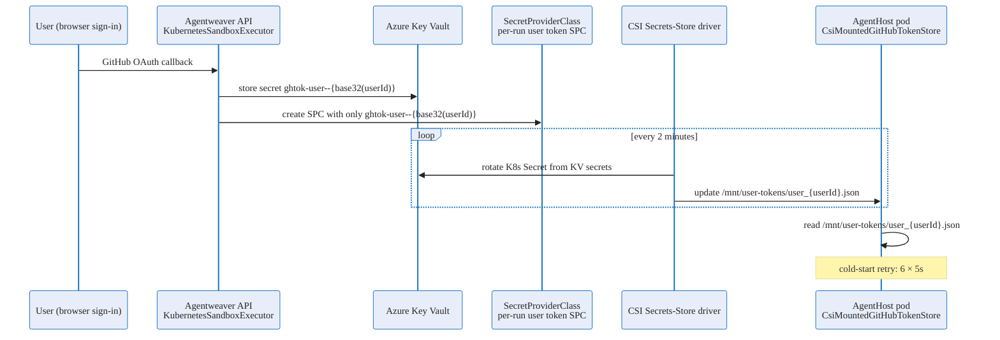

# Agent-host token delivery — Deep Dive

Agent-host pods must act on behalf of a specific signed-in GitHub user: they clone repositories, push branches, and call GitHub APIs. To do so, the pod needs a valid GitHub access token scoped to that user. This page explains how that per-user token is stored and delivered to the pod.

For the auth-security mental model and the overall credential design, see [Auth & Security](./auth-security.md). The CSI summary is also available there.

## Delivery model

Each authenticated user's GitHub OAuth token is stored in Azure Key Vault under a per-user key (`ghtok-user--{base32(userId)}`) and is never written to shared storage. The API stores OAuth callback results only in `GitHubTokenScope.ForUser(login)`. AgentHost pods receive only the matching user's token through a run-scoped Secrets Store CSI projection.

`AgentHostOptions.KvTokenMountPath` enables this CSI delivery path. `UseSharedTokenStore` remains a local/legacy compatibility switch for AgentHost, but the production API Key Vault store does not mirror OAuth tokens into the shared workspace PVC.

## CSI secrets-store from Azure Key Vault

Agentweaver stores the token in Azure Key Vault and delivers it to the pod via the [Secrets Store CSI Driver](https://secrets-store-csi-driver.sigs.k8s.io/). This is the supported AKS approach.

### Architecture

### Launch flow (API side)

When launching an AgentHost pod, `KubernetesSandboxExecutor`:

1. Resolves the run's submitting user.
2. Creates a run-scoped `SecretProviderClass` named `agentweaver-user-token-{runId}` with exactly one Key Vault object: `ghtok-user--{base32(userId)}` aliased to `user_{userId}.json`.
3. Clones the base AgentHost `SandboxTemplate`, replacing the CSI volume's `secretProviderClass` with the run-scoped SPC.
4. Creates a run-scoped `SandboxWarmPool` and `SandboxClaim` that bind to that cloned template.

The static `agentweaver-user-tokens` SPC is installation-only (it contains `ghtok-installation`) and is used only as the parameter template (client ID, vault name, tenant ID). It is not a shared user-token mount. `AgentHostUserTokenSyncService` has been removed; no service patches a shared SPC on sign-in.

### CSI rotation

The CSI Secrets-Store driver polls Key Vault for each `SecretProviderClass` mounted by a running pod and rotates the projected Kubernetes Secret every **2 minutes** (the `rotationPollInterval` configured on the SPC in `k8s/secret-provider-class.yaml`). The pod's CSI volume file at `/mnt/user-tokens/user_{userId}.json` is updated automatically without pod restart.

### Pod-side read (CsiMountedGitHubTokenStore)

`CsiMountedGitHubTokenStore` (in `apps/Agentweaver.AgentHost/`) reads from the CSI-mounted directory:

- Target path: `{KvTokenMountPath}/user_{userId}.json`
- The store implements a **cold-start retry** of up to **6 attempts with 5-second intervals**. This handles the window between pod start and the first CSI sync. After 6 failures (30 seconds), it returns a null token and the run fails with a clear error.

### Workload identity service account

The agent-host pod authenticates to Azure Key Vault using **workload identity**. The pod spec references the service account `agentweaver-agent-host` (`k8s/serviceaccount-agenthost.yaml`), which is federated with the Azure managed identity that has `get` and `list` access to the Key Vault secrets.

No secret is baked into the pod image. The OIDC token projected by Kubernetes is exchanged for an Azure AD access token at runtime.

### Security properties

| Property | Detail |
|---|---|
| **No token in network transit** | Token reaches the pod via Kubernetes Secret projection, not an HTTP call. |
| **Automatic rotation** | CSI driver rotates every 2 minutes; the pod reads the fresh file transparently. |
| **Scoped KV access** | Workload identity SA has get/list only — no write or delete access to KV. |
| **Per-user isolation** | Each user's token is a separate KV secret and a separate file in the run-scoped CSI mount. A sandboxed pod process cannot enumerate other users' files because only the relevant user's entry is projected. |
| **No shared storage copy** | OAuth tokens are not mirrored to `/workspace`, a shared PVC, or any other shared filesystem. |

## Configuration reference

| Config key | Default | Notes |
|---|---|---|
| `AgentHost:KvTokenMountPath` | *(unset)* | Set to `/mnt/user-tokens` to enable Key Vault CSI token delivery. Takes precedence over `UseSharedTokenStore`. |
| `AgentHost:UseSharedTokenStore` | `false` | Legacy/local compatibility only; production Key Vault token storage does not mirror tokens to the shared workspace PVC. |

## Source

| Concern | File |
|---|---|
| Run-scoped SPC/template creation | `apps/Agentweaver.Api/Sandbox/KubernetesSandboxExecutor.cs` |
| In-pod token reader | `apps/Agentweaver.AgentHost/CsiMountedGitHubTokenStore.cs` |
| Options model | `apps/Agentweaver.AgentHost/AgentHostOptions.cs` |
| Workload identity SA | `k8s/serviceaccount-agenthost.yaml` |
| SPC + rotation interval | `k8s/secret-provider-class.yaml` |
| CSI volume mount | `k8s/sandbox-template-agenthost.yaml` |

## Related reading

- [Auth & Security](./auth-security.md) — overall token-store architecture and the CSI summary.
- [Sandbox pod execution](./sandbox-pod-execution.md) — pod lifecycle, reaper, and quota.
- [Sandbox pods reference](../reference/sandbox-pods.md) — token injection, pod identity, and security properties.
- [Infrastructure & deployment](./infra-deployment.md) — cluster topology and Key Vault setup.
