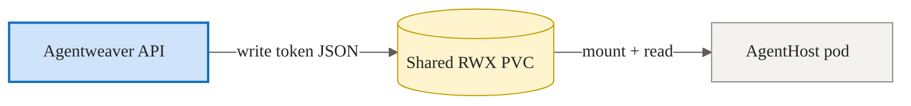
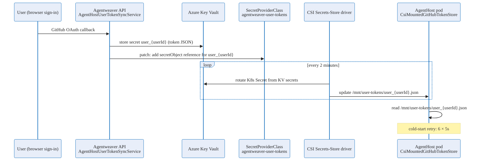

# Agent-host token delivery — Deep Dive

Agent-host pods must act on behalf of a specific signed-in GitHub user: they clone repositories, push branches, and call GitHub APIs. To do so, the pod needs a valid GitHub access token scoped to that user. This page explains how that token is delivered to the pod, why two delivery modes exist, and when to use each.

For the auth-security mental model and the overall credential design, see [Auth & Security](./auth-security.md). The CSI Option B summary is also available there.

## Two delivery modes

| Mode | Config key | Description |
|---|---|---|
| **Option A — Shared RWX filesystem** | `AgentHostOptions.UseSharedTokenStore = true` | The API writes the token to a PVC-backed `ReadWriteMany` volume. The agent-host pod mounts the same PVC and reads the file. |
| **Option B — CSI secrets-store (preferred)** | `AgentHostOptions.KvTokenMountPath = /mnt/user-tokens` | The token is stored in Azure Key Vault. A `SecretProviderClass` references the KV secret. The CSI driver projects it into the pod's filesystem. |

When `KvTokenMountPath` is set it **takes precedence** over `UseSharedTokenStore`. If neither is configured, no GitHub token is delivered to the pod.

## Option A — Shared RWX filesystem

Option A is the legacy approach. On user sign-in, the API writes a JSON token file to a shared PVC at a well-known path. The agent-host pod mounts the same PVC and reads the file directly.

**When to use:** Option A is suitable for single-node or small local deployments where a shared filesystem is already in use and Key Vault integration is not set up.

**Limitations:**
- Requires a `ReadWriteMany` (RWX) capable storage class (e.g. Azure Files) in AKS.
- Token rotation requires the API to write again; there is no automatic key-vault-driven rotation.
- The volume is a larger blast radius: if a pod escapes its sandbox, it can potentially read other users' token files.

## Option B — CSI secrets-store from Azure Key Vault (preferred)

Option B stores the token in Azure Key Vault and delivers it to the pod via the [Secrets Store CSI Driver](https://secrets-store-csi-driver.sigs.k8s.io/). This is the preferred approach for AKS deployments.

### Architecture

### Sign-in flow (API side)

On every GitHub OAuth callback, `AgentHostUserTokenSyncService.EnsureUserTokenInSpcAsync`:

1. Writes the token JSON blob as a Key Vault secret named `user-{userId}` (hyphen-normalized to satisfy KV naming rules).
2. Reads the current `agentweaver-user-tokens` `SecretProviderClass` manifest.
3. Appends a new `secretObjects` entry for `user_{userId}` if one does not already exist.
4. Patches the SPC back to the Kubernetes API server.

The SPC patch is idempotent: re-signing in with the same user updates the KV secret in place and does not duplicate the SPC entry.

### CSI rotation

The CSI Secrets-Store driver polls Key Vault for each `SecretProviderClass` mounted by a running pod and rotates the projected Kubernetes Secret every **2 minutes** (the `rotationPollInterval` configured on the SPC in `k8s/secret-provider-class.yaml`). The pod's CSI volume file at `/mnt/user-tokens/user_{userId}.json` is updated automatically without pod restart.

### Pod-side read (CsiMountedGitHubTokenStore)

`CsiMountedGitHubTokenStore` (in `apps/Agentweaver.AgentHost/`) reads from the CSI-mounted directory:

- Target path: `{KvTokenMountPath}/user_{userId}.json`
- The store implements a **cold-start retry** of up to **6 attempts with 5-second intervals**. This handles the window between pod start and the first CSI sync. After 6 failures (30 seconds), it returns a null token and the run fails with a clear error.

### Workload identity service account

The agent-host pod authenticates to Azure Key Vault using **workload identity**. The pod spec references the service account `agentweaver-agent-host` (`k8s/serviceaccount-agenthost.yaml`), which is federated with the Azure managed identity that has `get` and `list` access to the Key Vault secrets.

No secret is baked into the pod image. The OIDC token projected by Kubernetes is exchanged for an Azure AD access token at runtime.

### Security properties

| Property | Detail |
|---|---|
| **No token in network transit** | Token reaches the pod via Kubernetes Secret projection, not an HTTP call. |
| **Automatic rotation** | CSI driver rotates every 2 minutes; the pod reads the fresh file transparently. |
| **Scoped KV access** | Workload identity SA has get/list only — no write or delete access to KV. |
| **Per-user isolation** | Each user's token is a separate KV secret and a separate file in the CSI mount. A sandboxed pod process cannot enumerate other users' files because the file names are user-scoped and only the relevant user's entry is projected. |
| **No shared blast radius** | Unlike Option A, there is no shared RWX volume accessible to all pods. |

## Choosing between Option A and Option B

| Scenario | Recommendation |
|---|---|
| AKS deployment with Key Vault and workload identity configured | **Option B** |
| Local development or single-node without Key Vault | **Option A** |
| Testing or PoC environment | Either; Option A is simpler to set up |

## Configuration reference

| Config key | Default | Notes |
|---|---|---|
| `AgentHost:KvTokenMountPath` | *(unset)* | Set to `/mnt/user-tokens` to enable Option B. Takes precedence over `UseSharedTokenStore`. |
| `AgentHost:UseSharedTokenStore` | `false` | Set to `true` to enable Option A when `KvTokenMountPath` is unset. |

## Source

| Concern | File |
|---|---|
| Sign-in SPC patch | `apps/Agentweaver.Api/Auth/AgentHostUserTokenSyncService.cs` |
| In-pod token reader | `apps/Agentweaver.AgentHost/CsiMountedGitHubTokenStore.cs` |
| Options model | `apps/Agentweaver.AgentHost/AgentHostOptions.cs` |
| Workload identity SA | `k8s/serviceaccount-agenthost.yaml` |
| SPC + rotation interval | `k8s/secret-provider-class.yaml` |
| CSI volume mount | `k8s/sandbox-template-agenthost.yaml` |

## Related reading

- [Auth & Security](./auth-security.md) — overall token-store architecture and the CSI Option B summary.
- [Sandbox pod execution](./sandbox-pod-execution.md) — pod lifecycle, reaper, and quota.
- [Sandbox pods reference](../reference/sandbox-pods.md) — token injection, pod identity, and security properties.
- [Infrastructure & deployment](./infra-deployment.md) — cluster topology and Key Vault setup.
