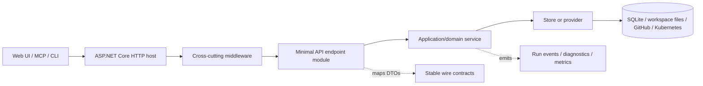
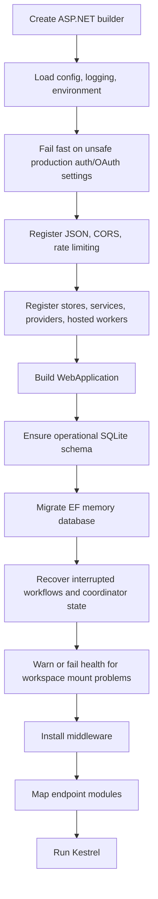
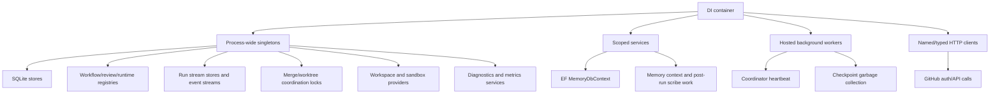
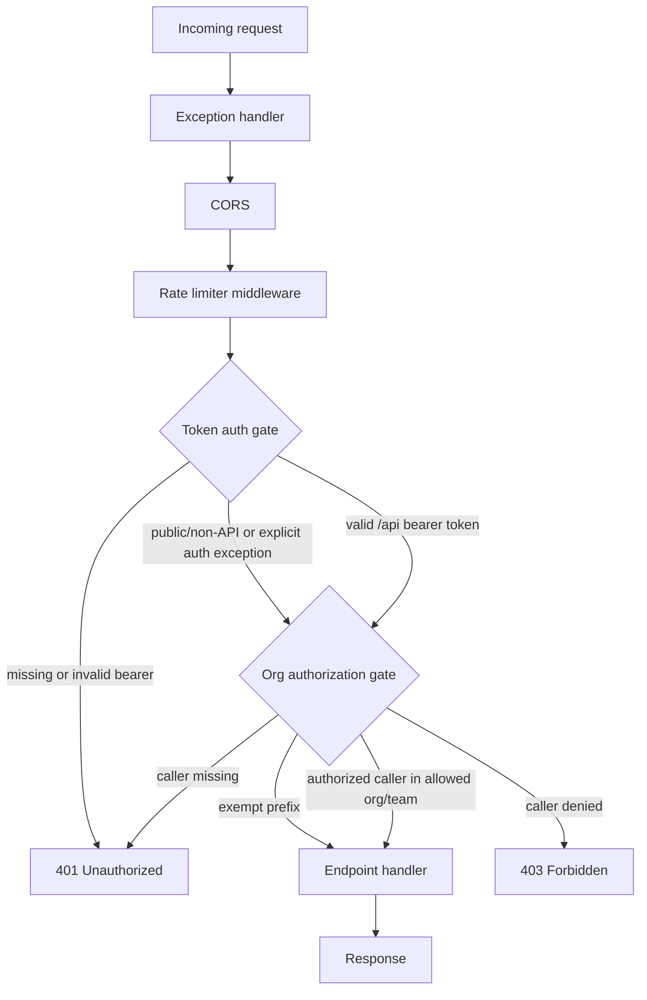
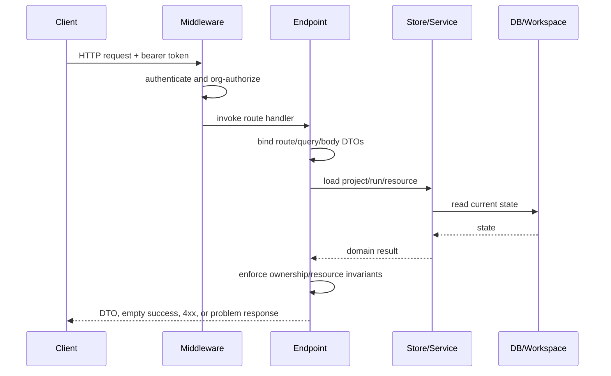
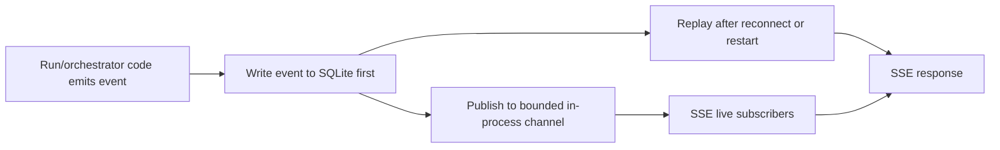
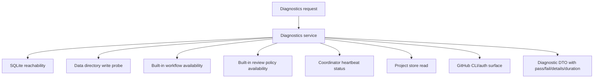

# API Host Core — Conceptual Deep Dive

## Purpose & Scope

The Agentweaver API host is the composition shell for the product. It does not own every domain algorithm; instead, it makes the system runnable and observable by wiring services together, enforcing cross-cutting policy, exposing HTTP capabilities, and preparing durable state before traffic is accepted.

This deep dive explains the concepts behind the API host so a competent engineer could rebuild the same architecture without reading the implementation. It focuses on:

- host bootstrap and readiness;
- dependency injection and service lifetimes;
- middleware and request authorization flow;
- the minimal API endpoint architecture;
- request/response contract principles;
- configuration selection;
- diagnostics and metrics;
- host-level invariants and extension seams.

Domain internals are intentionally out of scope. Auth/security, orchestration, sandboxing, memory/persistence, migrations, and Git workflows have their own deep dives. This file explains how the API core composes those domains, not how each domain works internally.

## The Host in One Picture

Agentweaver uses a **minimal API + endpoint modules + stores/services** architecture. The host is a thin, explicit composition root; endpoint modules are thin adapters; services and stores contain the actual behavior.

The important separation is:

- **Program startup** decides what exists: configuration, DI registrations, boot checks, middleware, and endpoint groups.
- **Endpoint modules** decide what HTTP surface exists: routes, verbs, request DTOs, response DTOs, and per-resource authorization checks.
- **Services** decide what a business operation means.
- **Stores/providers** decide how data and external resources are accessed.

This shape keeps the host easy to reason about. Adding a feature should usually mean adding a contract, a service/store if needed, and one endpoint registration module; it should not require changing middleware or unrelated route handlers.

## Why Minimal APIs Here

Agentweaver's API is a command-and-control surface with many focused operations: start a run, stream a run, approve a tool request, list project files, read diagnostics, update a review policy, and so on. Minimal APIs fit that shape because they make route registration direct and avoid controller ceremony.

The design only works because route registration is modularized. Each feature area exposes a method that maps its routes, and startup calls those methods explicitly. That gives the project most of the clarity of controllers without forcing every small route into a controller class.

The trade-off is discipline. Minimal APIs do not automatically prevent a handler from becoming a large blob of logic. Agentweaver's intended invariant is: **endpoint handlers adapt HTTP to the domain; they do not become the domain**. If a handler starts coordinating multiple stores, retry rules, or lifecycle transitions, that logic belongs in a service.

Where this lives: `apps/Agentweaver.Api/Program.cs`; `apps/Agentweaver.Api/Endpoints/`; domain endpoint folders such as `Workflows/` and `ReviewPolicies/`.

## Bootstrap & Readiness Lifecycle

### Problem solved

The API cannot safely accept traffic until three things are true:

1. dangerous development-only bypasses are rejected in production;
2. persistent schemas are present and up to date;
3. interrupted long-running work has been reconciled enough that new requests see a coherent world.

Startup therefore behaves like a readiness gate, not just a web-server launch.

### Why this order

- **Security checks happen before service construction** so a bad production deployment dies obviously instead of exposing a partially running host.
- **Schemas are ensured before middleware and routes matter** so the first real request does not pay for schema creation or discover a missing table.
- **Recovery runs before traffic** so clients do not see stale "in progress" state that the host already knows how to reconcile.
- **Middleware is installed before endpoints are mapped as executable request handlers** so every route shares the same cross-cutting behavior.

### Trade-offs

This makes startup heavier, especially when database migrations or recovery scans are non-trivial. The benefit is a simpler runtime: handlers can assume the host is initialized, stores exist, and background recovery has already had a chance to normalize old state.

### Invariants

- Startup database work must be idempotent.
- Recovery must be safe to run after a crash or restart.
- Production auth bypasses must fail closed.
- The host should never depend on system temporary directories for application data.

Where this lives: `apps/Agentweaver.Api/Program.cs`; `apps/Agentweaver.Api/Infrastructure/`; `apps/Agentweaver.Api/Memory/`.

## Dependency Injection as the Service Graph

### Problem solved

The host coordinates long-lived state: run streams, locks, registries, background services, SQLite stores, workspace providers, GitHub clients, sandbox routing, and EF contexts. Dependency injection makes those dependencies explicit and gives each category the right lifetime.

### Lifetime logic

- **Singletons** are used for components that are stateless, internally synchronized, or intentionally process-wide: registries, locks, stream stores, provider selectors, and most raw SQLite stores. When a singleton touches SQLite, the safe pattern is connection-per-operation rather than keeping one shared connection forever.
- **Scoped services** are used where the underlying dependency is unit-of-work oriented. EF Core `DbContext` is scoped because it is not thread-safe and should represent one operation's database session.
- **Hosted services** are used for autonomous loops that are part of the host lifecycle, such as heartbeat pickup and cleanup.
- **Factories** are used when configuration chooses an implementation, such as local versus persistent-volume workspaces or sandbox execution routing.

### Trade-offs

The singleton-heavy approach makes in-process coordination straightforward and avoids repeatedly constructing expensive infrastructure. The risk is hidden shared mutable state. Agentweaver mitigates that by keeping stores connection-per-call, bounding in-memory buffers, and making coordination objects explicit.

### Rebuild rule

When adding a dependency, first decide whether it represents process-wide coordination, per-request/unit-of-work state, an external HTTP client, or a background loop. Register it according to that role; do not choose a lifetime just because another nearby service uses it.

Where this lives: `apps/Agentweaver.Api/Program.cs`.

## Middleware Pipeline

### Problem solved

Every endpoint should not have to reimplement exception handling, CORS, rate limiting, bearer-token validation, and organization authorization. Middleware centralizes those concerns and gives requests a predictable path to the handler.

### Token gate

The first custom gate treats most `/api/*` routes as bearer-token protected. Health/ping style endpoints and the web-session exchange path are exceptions. Non-API paths can pass this gate, which is important for OAuth discovery and web auth routes.

### Organization gate

The second custom gate runs after token validation. It checks whether the caller is allowed by the configured GitHub organization/team policy. It also has its own exempt prefixes for health, auth bootstrap, MCP/OAuth discovery, and related public protocol routes.

### Rate limiting

The rate limiter middleware is globally installed, but rate limiting is applied only to endpoints that opt into the named policy. OAuth protocol endpoints opt in because they are public and abuse-sensitive. Ordinary API endpoints are protected by bearer/org authorization and are not automatically limited just because the middleware exists.

### Gotchas

- Endpoint metadata such as `AllowAnonymous` does not bypass custom middleware by itself. Public behavior must be represented in the middleware's path exemptions.
- The root banner route is non-API, so it passes token auth, but it is not one of the organization-gate exempt prefixes. Unauthenticated callers should not assume it is public.
- Middleware order matters: organization authorization depends on identity established by token auth.

Where this lives: `apps/Agentweaver.Api/Program.cs`; `apps/Agentweaver.Api/Security/`; `apps/Agentweaver.Api/Auth/`; `apps/Agentweaver.Api/Endpoints/OAuthServerEndpoints.cs`.

## Endpoint Surface & Request Handling Structure

### Problem solved

The API surface is broad, but it is not arbitrary. Routes are organized around resources and capabilities so clients can predict where operations live.

The main route families are:

| Capability family | Route shape | What the handler should do |
|---|---|---|
| Health/readiness | `/health`, `/api/health`, `/api/ping`, `/healthz/workspace` | Return cheap public liveness/readiness answers for load balancers and operators. |
| Diagnostics/metrics/system | `/api/diagnostics*`, `/api/overview`, `/api/projects/{id}/dashboard`, `/api/system/runtime` | Return protected operational projections assembled from live stores and host state. |
| Auth and OAuth | `/auth/github/*`, `/api/auth/*`, `/.well-known/*`, `/oauth/*` | Bootstrap GitHub auth, expose OAuth/OIDC metadata, exchange tokens, and manage sessions. |
| Projects/workspaces | `/api/projects*`, `/api/projects/{id}/workspace*` | Create/list/update projects and expose workspace refs, trees, and file content through project ownership checks. |
| Runs | `/api/runs*`, `/api/projects/{id}/runs*` | Start work, read run state, stream events, inspect files/diffs/history, retry, archive, or delete. |
| Human-in-the-loop actions | `/api/runs/{id}/review`, `/commit`, `/request-changes`, approvals/denials/questions/autopilot | Convert user decisions into run lifecycle transitions. |
| Sandbox | `/api/sandbox-policy`, `/api/runs/{id}/sandbox/port-forward*` | Read/update project-scoped sandbox policy and manage sandbox port-forward sessions. |
| Workflow and review policy definitions | `/api/projects/{id}/workflows*`, `/api/projects/{id}/review-policies*` | Manage project-defined workflow and review policy configuration. |
| Backlog/board/decompose | `/api/projects/{id}/backlog*`, `/board`, `/workflow-stages`, `/backlog/decompose` | Expose orchestration planning queues and decomposition helpers. |
| Coordinator | `/api/projects/{id}/orchestrations`, `/api/runs/{id}/outcome-spec*`, `/work-plan`, `/children`, `/steer`, `/assembly/*` | Expose multi-agent orchestration state and control surfaces. |
| Team/casting/blueprints | `/api/projects/{id}/team*`, `/api/casting*`, `/api/blueprints*` | Manage project team model, role proposals, and blueprint generation/validation. |
| Decisions/memory/sessions | `/api/projects/{id}/decisions*`, `/memory*`, `/agents/{name}/memory*`, `/sessions*` | Expose decision inbox, decision ledger, agent memory, session context, and file interop. |

### Handler pattern

A typical protected handler follows this flow:

The exact service/store calls differ by feature, but the responsibilities stay stable:

1. **Bind** route values, query values, and JSON bodies into typed request objects.
2. **Authenticate globally** through middleware before handler execution.
3. **Authorize locally** by checking ownership or resource relationship. For example, a run must belong to the caller/project being accessed.
4. **Validate dangerous inputs centrally**, especially filesystem-relative paths used by workspace and file routes.
5. **Delegate behavior** to a service or store.
6. **Project the result** into a DTO that is safe and stable for clients.

### Route design rules

- Use `/api/projects/{id}/...` for project-scoped resources.
- Use `/api/runs/{id}/...` for run-scoped resources.
- Use `GET` for projections, `POST` for commands/state transitions, `PATCH` for partial updates, `PUT` when replacing/updating a named configuration, and `DELETE` only when deletion semantics are intended.
- Model command endpoints as subresources or actions (`/retry`, `/review`, `/commit`) when the operation is not a simple CRUD update.
- Keep public protocol routes outside normal protected API assumptions only when middleware exemptions explicitly support that.

Where this lives: `apps/Agentweaver.Api/Endpoints/`; `apps/Agentweaver.Api/Workflows/`; `apps/Agentweaver.Api/ReviewPolicies/`; `apps/Agentweaver.Api/Diagnostics/`; `apps/Agentweaver.Api/Metrics/`.

## Streaming and Durable Run Events

### Problem solved

Agent runs are long-lived and interactive. The UI needs low-latency updates while a run is active, but users also refresh browsers, reconnect, and inspect completed runs. A purely in-memory stream would be fast but fragile; a purely database-polled stream would be durable but less responsive.

Agentweaver uses a two-layer event model:

### Control flow

1. A run event is appended with a run id, sequence, type, and payload.
2. The event is written durably before it is acknowledged to the producer.
3. After the durable write, the event is published to an in-process channel for active subscribers.
4. A subscriber performs **replay-then-tail**: replay persisted events after its cursor, then switch to the live channel without a gap.
5. Terminal events close the stream. Some human-review gates also intentionally end the active stream so the UI can switch to review behavior.

### Why this design

- Durable-first append means a client cannot observe an event that would be lost on crash.
- Bounded live channels protect the server from slow consumers.
- Dropping a live channel copy is acceptable because the durable event remains replayable.
- Sequence-based replay makes browser reconnects and `Last-Event-ID` style cursors practical.

### Invariants

- Never stream a run to a caller who cannot read that run.
- Durable append precedes live fan-out.
- Reconnects should not miss events; duplicates should be tolerable or skipped by sequence.
- Terminal events should cause clean completion rather than endless idle streams.

Where this lives: `apps/Agentweaver.Api/Infrastructure/RunStreamStore.cs`; `apps/Agentweaver.Api/Infrastructure/SqliteRunEventStream.cs`; `apps/Agentweaver.Api/Endpoints/RunEndpoints.cs`.

## Contracts and DTOs

### Problem solved

The API is consumed by web UI, MCP tools, and automation clients. Internal entity names, enum values, and persistence details can evolve, but the wire contract must remain stable.

Agentweaver therefore treats DTOs as a boundary layer rather than returning database entities directly.

### Contract principles

- **Explicit JSON names.** Public field names are pinned with explicit JSON metadata where needed instead of relying entirely on ambient naming policy.
- **Stable enum strings.** Domain states are translated to client-facing strings such as run status and model source values. Clients should not depend on internal enum names.
- **Projection over leakage.** Response DTOs include fields useful to clients: ids, statuses, timestamps, flags, summaries, diffs, sandbox state, and workflow metadata. They should not expose internal persistence-only columns unless those columns are intentionally part of the API.
- **Nullable means meaningfully absent.** Optional fields represent genuinely unavailable or inapplicable data, not handler laziness.
- **Requests describe intent.** A command request should contain the minimum information needed to perform the operation and should let the service derive the rest from current state.

### Trade-offs

DTO mapping adds code, but it preserves compatibility. Without DTOs, database refactors and domain enum changes would become accidental API breaking changes.

Where this lives: `apps/Agentweaver.Api/Contracts/`.

## Configuration Model

### Problem solved

The same host runs locally, in tests, and in hosted/containerized environments. Configuration decides which roots, databases, auth settings, workspace providers, and sandbox providers are active without changing code paths.

ASP.NET Core's normal configuration stack is used: appsettings, environment-specific settings, environment variables, secrets, and command-line arguments. Environment variable names can use the standard double-underscore form for nested keys.

### Important configuration families

| Family | Conceptual role |
|---|---|
| Logging | Controls host and framework log verbosity. |
| CORS | Declares browser origins allowed to call the API. Empty means no configured browser origins. |
| Auth:GitHub | Defines allowed organization/team expectations and requested GitHub scopes. |
| Auth:OAuth | Defines OAuth issuer/audience/signing/redirect behavior for MCP/API token flows. Production guards require safe pinned values. |
| Database | Selects the main operational SQLite path and the EF memory database provider/connection. SQLite is the default; SQL Server/Azure SQL/PostgreSQL are supported for the EF memory context. |
| Workspace | Selects how project workspaces are resolved. Local mode honors caller-provided paths; persistent-volume/kubernetes mode maps project ids under a configured mount root. |
| Runs | Restricts allowed local repository roots for filesystem safety. |
| Coordinator | Controls heartbeat enablement and cadence. |
| Sandbox | Supplies sandbox execution settings, especially Kubernetes execution details. |
| Testing bypass flags | Development/test-only switches that must not be accepted in production. |

### Database split

There are two important persistence surfaces:

- the **operational database** for projects, runs, backlog, workflow state, and other host operations;
- the **memory database** for EF-managed memory/decision data and durable run events.

The split lets newer EF-managed features evolve without forcing the older raw SQLite store layer to migrate at the same pace. The cost is operational awareness: backup, diagnostics, and migrations need to remember that not all state lives in one file.

### Workspace provider split

Local workspaces and mounted/container workspaces solve different problems. Local mode is convenient for desktop development because the caller can point the project at an existing checkout. Persistent-volume/kubernetes mode is safer for hosted execution because project ids map deterministically under a known mount root, and the caller does not control arbitrary filesystem paths.

Workspace health is based on practical write probes, not only directory existence, because mounted filesystems can report misleading metadata while still failing real writes.

Where this lives: `apps/Agentweaver.Api/appsettings.json`; `apps/Agentweaver.Api/Program.cs`; `apps/Agentweaver.Api/Infrastructure/`; `apps/Agentweaver.Api/Sandbox/`.

## Diagnostics & Metrics

### Problem solved

Operators need to know whether the host is healthy and what work is happening without trusting client-side guesses. Diagnostics answer "can the system function right now?" Metrics answer "what has the system been doing?"

### Diagnostics model

Diagnostics are live checks assembled server-side:

There are three levels:

- **Public health/readiness** endpoints are cheap and suitable for load balancers.
- **System diagnostics** are protected and include database, data directory, registry, heartbeat, project-store, and GitHub checks.
- **Project diagnostics** are protected and scoped to one project: workspace availability, workflow directory, review-policy directory, active workflow, and active review policy.

The heartbeat endpoint exposes automation status: whether heartbeat is enabled, its cadence, last tick, last error, recent activity, and a catalog of host automations.

### Metrics model

Metrics are derived from live stores and known in-process state. They are not fabricated. If the system lacks a real source for a value, the API omits it rather than inventing it.

The project dashboard summarizes:

- run counts and active work;
- 30-day created/done throughput;
- agent leaderboard and success/duration data.

The global overview summarizes:

- at-a-glance host/project/run counters;
- live sessions and active workflow runs;
- active projects and recent activity;
- degraded health signals such as heartbeat problems or merge failures.

Run duration metrics subtract human-review wait time where that wait is tracked. That keeps automation performance from being distorted by time spent waiting for a person.

### Invariants

- Diagnostics and metrics should read real host state.
- Expensive checks should be bounded and explicit.
- Singleton diagnostics/metrics services must remain safe under concurrent requests.
- Do not report cost or other synthetic values without an authoritative source.

Where this lives: `apps/Agentweaver.Api/Diagnostics/`; `apps/Agentweaver.Api/Metrics/`; `apps/Agentweaver.Api/Endpoints/MetricsEndpoints.cs`.

## Host-Level Invariants & Edge Cases

These rules are the practical knowledge needed to rebuild or extend the host safely:

- **The endpoint mapping list is the routing seam.** A new feature should add a mapping extension and be called from startup explicitly.
- **Custom auth middleware is path-based.** Public routes require explicit middleware exemption, not just endpoint metadata.
- **Resource ownership is layered.** Global auth proves who the caller is; handlers/services still need project/run ownership checks.
- **Filesystem paths are dangerous inputs.** File and diff routes should use centralized relative-path validation and reject rooted, parent-traversal, device, UNC, drive-relative, control-character, or alternate-data-stream tricks.
- **SSE has both live and durable layers.** Live buffers optimize active UI sessions; durable run events support replay and restart recovery.
- **Database split matters.** Operational state and EF memory/run-event state may live in different databases.
- **Workspace provider choice changes trust boundaries.** Local mode can honor caller paths after validation; mounted/kubernetes modes should derive paths from project ids.
- **Persistent-volume health should test real writes.** Existence checks alone are not enough for mounted filesystems.
- **Sandbox policy is project-scoped configuration.** It should preserve unrelated settings and only write for known project workspaces.
- **Checkpoint startup must be defensive.** Corrupt checkpoint metadata should be quarantined or ignored when possible so the API can start and recover.
- **Application data should not use system temp.** Stable data belongs in the configured/local app data directory.

Where this lives: `apps/Agentweaver.Api/Endpoints/EndpointHelpers.cs`; `apps/Agentweaver.Api/Infrastructure/`; `apps/Agentweaver.Api/Sandbox/`.

## How to Add a New API Capability

A safe extension normally follows this sequence:

1. **Define the contract.** Add request/response DTOs or reuse existing ones only if the wire meaning is identical.
2. **Choose the state boundary.** Decide whether the capability reads/writes operational SQLite, EF memory data, workspace files, GitHub, Kubernetes, or only in-memory state.
3. **Create or extend a service.** Put lifecycle, transaction, retry, and multi-store coordination logic outside the endpoint handler.
4. **Register dependencies.** Pick singleton/scoped/hosted/client lifetimes based on actual behavior, not convenience.
5. **Map endpoints in a feature module.** Keep route definitions together and call the module from startup.
6. **Apply auth and ownership.** Confirm both global middleware behavior and resource-specific authorization.
7. **Add diagnostics or metrics only if they are real.** Avoid placeholder health checks and fabricated counters.
8. **Validate with the smallest relevant test/build path.** Endpoint changes should prove request binding, auth behavior, ownership behavior, and persistence effects where applicable.

The core design goal is not to make every feature small; it is to keep each responsibility in the layer that can own it cleanly.
