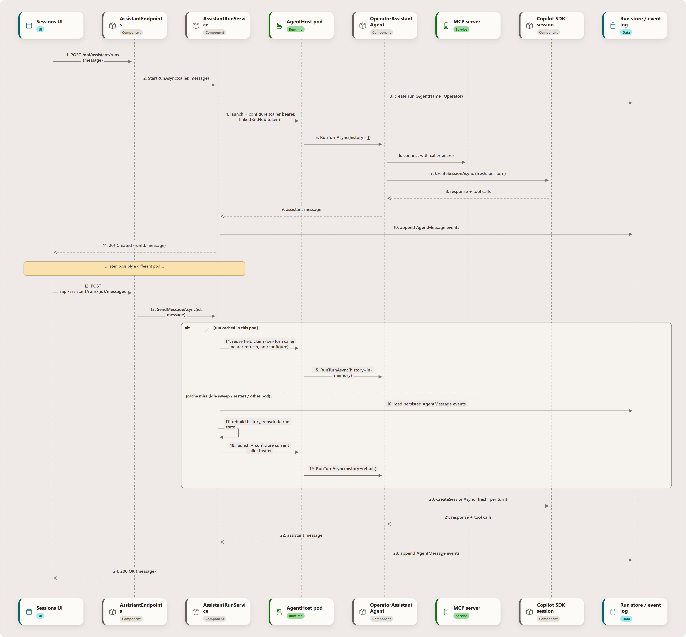

# Assistant Runtime — Conceptual Deep Dive

## Purpose and scope

The Assistant (also surfaced in the UI as **Sessions**) is a distinct, lightweight execution path from a full project run. There is no worktree or review/merge workflow. The API owns the durable conversation, while the model/tool loop runs in an AgentHost pod with MCP tool access — held across the turns of an active conversation and released once it goes quiet. This page explains that path end to end: how a conversation is created, why it survives idle periods and pod restarts, how caller identity reaches MCP without being persisted, and why the SDK's own session persistence is deliberately turned off.

Primary scope:

- `apps/Agentweaver.Api/Assistant/AssistantRunService.cs` — run lifecycle, durable concurrency limit, idle/pod-idle sweeps, durable rehydration.
- `apps/Agentweaver.Api/Endpoints/AssistantEndpoints.cs` — the HTTP surface.
- `apps/Agentweaver.Api/Assistant/RemoteOperatorAssistantAgent.cs` — AgentHost launch/hold/release and the A2A proxy.
- `apps/Agentweaver.Api/Sandbox/KubernetesSandboxExecutor.cs` — claim reuse for a pod held across turns.
- `apps/Agentweaver.AgentHost/OperatorPodTurnRunner.cs` — pod-side request reconstruction and approval projection.
- `packages/Agentweaver.AgentRuntime/OperatorAssistantAgent.cs` — the per-turn SDK session and tool-access model.

For the tool catalog the assistant calls into, see [MCP Server — Deep Dive](./mcp-server.md) and [Reference — MCP tools](/reference/mcp-tools). For the general agent turn/tool-governance model used by full project runs, see [Agent Runtime & Tools — Deep Dive](./agent-runtime.md) — the Assistant intentionally does **not** go through that heavier path.

## Why a separate, lighter-weight path

A project run needs an isolated git worktree, a sandboxed execution environment, and a review/merge workflow because it changes files in a repository. A chat conversation about the state of the product doesn't need any of that — it needs to durably remember what was said and to call the same MCP tools other clients use. `AssistantRunService` models a session as a run record (`AgentName == "Operator"`) purely so it can reuse the existing run store, event stream, and `/api/runs/{id}` list/delete endpoints, without inheriting worktree or sandbox machinery it doesn't need.

## The life of a session

<!-- Rendered from ../diagrams/src/assistant-runtime-fig1.json by docs/diagram-renderer +
     Playwright (Fluent-styled sequence diagram), replacing Mermaid.
     Edit the JSON, then run `npm run docs:render-diagrams` and commit the
     regenerated PNG + .hash.txt. -->

1. **Start.** `POST /api/assistant/runs` creates a run record and, if an initial message was supplied, immediately runs the opening turn. The response returns the `runId` used for every subsequent message.
2. **Converse.** `POST /api/assistant/runs/{id}/messages` appends the caller's message, runs a turn, and returns the assistant's reply. Each turn is serialized per-run via a semaphore so two messages to the same session can't race.
3. **Persist.** Every turn appends `AgentMessage` events (role + content) to the same durable event log every other run type uses. This is the only source of truth for a conversation's history — the in-memory cache is purely an optimization.
4. **Go idle, or move pods.** Two independent timers, because a conversation and its pod have very different costs. The **pod-idle** sweep releases a conversation's held AgentHost pod after 5 minutes of quiet (`AssistantRunOptions.PodIdleTimeout`) — the conversation stays fully alive and resumable, the next message just pays one cold start again. The much later **conversation-idle** sweep parks the run after 30 minutes without activity (`AssistantRunOptions.IdleTimeout`), releasing any still-held pod and freeing its concurrency slot. Neither sweep touches a run that is blocked on an armed tool-approval. Separately, because there is no session affinity between the UI and API replicas, a later message for the same run can land on a pod that never held it in memory at all.
5. **Resume.** Either case above is a *cache miss*, not a failure. `RehydrateRunAsync` looks the run up in the durable store, checks ownership, replays its persisted `AgentMessage` events into an in-memory history (bounded to the most recent 24 messages — `MaxHistoryMessages`), and — if the run had been marked `Completed` by the idle sweep — flips it back to `InProgress`. The caller never sees a difference; the log line `Rehydrated operator run {RunId} from durable storage (N history messages restored)` is the only trace.

## Caller identity across API, AgentHost, and MCP

Each assistant endpoint extracts the bearer presented on that specific HTTP request. `AssistantRunService` passes it only in the in-memory turn request; it is not written to the run row, history, or event log. On the turn that first claims a pod, `RemoteOperatorAssistantAgent` sends it to the AgentHost through the one-time internal `/configure` call, separately from the linked GitHub access token. `/configure` is genuinely one-shot (a second call is rejected), so on every subsequent turn against the *same held pod* the current bearer instead rides the per-turn `AgentSetupParams.CallerBearerToken`, which `A2ATurnBridgeAgent.ApplyPerTurnSetup` hands to `AgentHostRuntimeState.RefreshCallerBearerToken` before the turn runs. Either way the pod always uses the bearer from the request that triggered the turn.

That separation matters in Entra mode:

- the **caller bearer** is the Microsoft Entra access token used to authorize Agentweaver platform and project operations;
- the **GitHub access token** belongs to the active linked account and is used by the Copilot provider and GitHub operations.

The MCP resource server validates the Entra token's signature, issuer, audience, lifetime, and tenant before accepting it, then forwards the same bearer to the API. The API validates it again and remains the authorization authority. A refreshed browser token is used on the next message because no caller credential is cached with the conversation.

::: tip Only genuinely-active conversations count against the limit
A caller may have at most `MaxConcurrentRunsPerUser` (5) sessions *actively running* at once — enforced only when a brand-new run is created, and counted from **durable run status** (the caller's `InProgress` operator runs in the run store) rather than from any one API replica's in-memory cache.

That distinction is the whole point. The cache conflates "resident in this process" with "actively running": rehydration inserts into it too, so merely opening or replying to an old conversation used to occupy a slot for the next 30 minutes — and with two API replicas and no session affinity, the *same* conversation could occupy a slot on *both*, so the replicas disagreed about the count and a user with a handful of open conversations was falsely told they had too many active ones. One conversation is one row, whichever replicas have it resident, and a parked or finished conversation frees its slot immediately.

Resuming an existing session via rehydration still deliberately does **not** re-check the limit: the alternative would make a conversation unresumable purely because the caller has since started other conversations, with no "resume this one instead" escape hatch the way `StartRunAsync` has "start a different one instead."
:::

## Pod lifetime: held for the conversation, not the turn

The AgentHost pod is claimed on a conversation's first turn and then **held**. Releasing it after every turn cost 15-20s of silence on each message — claim binding, the A2A handshake, MCP connect, history replay, and the `/configure` call alone (which runs `CopilotAIAgent.SetupAsync` and starts a Copilot/BYOK client from scratch) taking ~8s of it.

`KubernetesSandboxExecutor.LaunchAgentHostPodAsync` decides whether a pod is reusable by asking whether *this replica* still holds the run's turn token (`PodNameRegistry`). The turn token is what authenticates the A2A call, so it is exactly the right predicate:

- **token held** → the existing claim is reused as-is: no delete, no recreate, no `/configure`. Only the caller bearer is refreshed, on the per-turn setup channel described above.
- **no token** (other replica, or a restart) → the claim is unreachable and un-reconfigurable from here, so it is deleted and recreated, which is the original cold-start path. Cross-replica turns therefore degrade to the old behaviour rather than breaking.

Held pods are given back by:

- the **pod-idle sweep** after `PodIdleTimeout` (5 min) of quiet, skipped while an approval is armed;
- **conversation dormancy** at `IdleTimeout` (30 min), when the run is parked;
- **turn failure** — `RemoteOperatorAssistantAgent` releases on both its exception and cancellation paths.

A `TryMarkAgentHostPodReleasing` compare-and-swap on the run state guarantees exactly one release is issued no matter how many of those fire. If every explicit path fails, `AgentHostReaperService` is the backstop: it reaps any `agent-*` claim whose run is no longer `InProgress`/`Pending`/`AwaitingReview`.

Holding pods is also what makes the higher concurrency bound cheap — a conversation that is open but quiet holds no pod at all, so the marginal cost of an extra open conversation is close to zero.

## Why the SDK's own session store is off

Each turn, `OperatorAssistantAgent` creates a **brand-new** Copilot SDK session (it never resumes one) and seeds it with the rebuilt history described above. The SDK also offers a native session *store* (`EnableSessionStore` / `InfiniteSessions`) that would persist SDK session state itself. That flag is deliberately `false`.

Before the AgentHost cutover it was briefly flipped on during a hotfix attempt (tracked as the v0.9.68 regression), on the theory that the SDK's "database is locked" failure mode only affected one-shot sandboxed workloads, not the then-in-process assistant. That theory was wrong: because a fresh session was created on *every* turn rather than resumed, every concurrent conversation wrote to the same pod-local SQLite session file. The contention reproduced live in staging within minutes (`Error: database is locked`) and the flag was reverted the same day.

Durable rehydration (the mechanism described above) is unaffected by this and remains the correct answer to cross-pod/idle/restart continuity — it works entirely from Agentweaver's own event log, independent of the AgentHost or SDK session. Using the SDK's native store would require deterministic `SessionId` resume instead of creating a new session per turn; holding the pod across turns shortens the cold start but does not change that — each turn still starts a fresh SDK session with no state to preserve.

## Tool access and sandboxing

The Assistant model/tool loop runs in an AgentHost pod, while the API retains the durable conversation and approval endpoints. The SDK session is also constrained at the tool-declaration layer:

- `AvailableTools` is set to *only* the MCP tool declarations — every SDK built-in native tool (shell, file read/write, `str_replace_editor`, `grep`, `web_fetch`, …) is excluded from the model's tool surface entirely, so it's simply not offered, regardless of what the model asks for.
- `OnPermissionRequest` is a defense-in-depth second layer: it rejects any native shell/read/write/URL permission request outright (in case a built-in somehow still reached the permission layer) and approves MCP/custom tool requests, whose consequential subset is human-gated separately by `ApprovalGatingAIFunction` (driven by `OperatorToolApprovalPolicy`) and enforced by the MCP server itself. That policy is **fail-closed**: only an explicit allow-list of read/low-consequence tools runs without a prompt — every consequential mutator *and any unrecognized or newly added MCP tool* requires an operator decision by default, so a new tool can never silently execute without consent.

Any file system, shell, or code-execution work the assistant needs to do must go through the same MCP run tools (`coordinator_start` / `run_submit` / `run_task`) an external client would use.

## See also

- [The Assistant and Sessions — Getting Started](/guide/assistant)
- [Sessions & the Assistant — User Guide](/experience/assistant-sessions)
- [API reference — Assistant endpoints](/reference/api#assistant-endpoints)
- [Agent Runtime & Tools — Deep Dive](./agent-runtime.md) — the heavier path used by full project runs
- [MCP Server — Deep Dive](./mcp-server.md)
