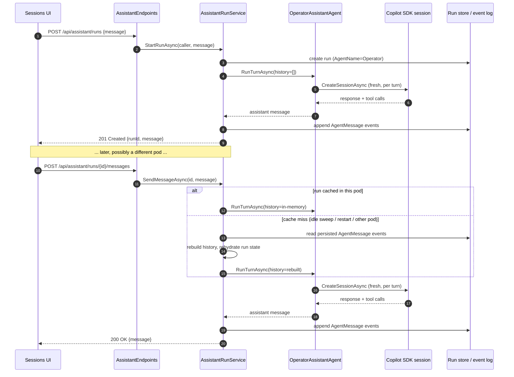

# Assistant Runtime — Conceptual Deep Dive

## Purpose and scope

The Assistant (also surfaced in the UI as **Sessions**) is a distinct, lightweight execution path from a full project run. There is no worktree, no sandbox pod, and no review/merge workflow — it is a single long-lived, resumable chat conversation with MCP tool access, running in-process in the API pod. This page explains that path end to end: how a conversation is created, why it survives idle periods and pod restarts, how it stays safe despite running with no OS-level sandbox, and why the SDK's own session persistence is deliberately turned off.

Primary scope:

- `apps/Agentweaver.Api/Assistant/AssistantRunService.cs` — run lifecycle, concurrency limits, idle sweep, durable rehydration.
- `apps/Agentweaver.Api/Endpoints/AssistantEndpoints.cs` — the HTTP surface.
- `packages/Agentweaver.AgentRuntime/OperatorAssistantAgent.cs` — the per-turn SDK session and tool-access model.

For the tool catalog the assistant calls into, see [MCP Server — Deep Dive](./mcp-server.md) and [Reference — MCP tools](/reference/mcp-tools). For the general agent turn/tool-governance model used by full project runs, see [Agent Runtime & Tools — Deep Dive](./agent-runtime.md) — the Assistant intentionally does **not** go through that heavier path.

## Why a separate, lighter-weight path

A project run needs an isolated git worktree, a sandboxed execution environment, and a review/merge workflow because it changes files in a repository. A chat conversation about the state of the product doesn't need any of that — it needs to durably remember what was said and to call the same MCP tools other clients use. `AssistantRunService` models a session as a run record (`AgentName == "Operator"`) purely so it can reuse the existing run store, event stream, and `/api/runs/{id}` list/delete endpoints, without inheriting worktree or sandbox machinery it doesn't need.

## The life of a session

1. **Start.** `POST /api/assistant/runs` creates a run record and, if an initial message was supplied, immediately runs the opening turn. The response returns the `runId` used for every subsequent message.
2. **Converse.** `POST /api/assistant/runs/{id}/messages` appends the caller's message, runs a turn, and returns the assistant's reply. Each turn is serialized per-run via a semaphore so two messages to the same session can't race.
3. **Persist.** Every turn appends `AgentMessage` events (role + content) to the same durable event log every other run type uses. This is the only source of truth for a conversation's history — the in-memory cache is purely an optimization.
4. **Go idle, or move pods.** An in-memory sweep closes a run after 30 minutes without activity (`AssistantRunOptions.IdleTimeout`), flipping its status to `Completed`. Separately, because there is no session affinity between the UI and API replicas, a later message for the same run can land on a pod that never held it in memory at all.
5. **Resume.** Either case above is a *cache miss*, not a failure. `RehydrateRunAsync` looks the run up in the durable store, checks ownership, replays its persisted `AgentMessage` events into an in-memory history (bounded to the most recent 24 messages — `MaxHistoryMessages`), and — if the run had been marked `Completed` by the idle sweep — flips it back to `InProgress`. The caller never sees a difference; the log line `Rehydrated operator run {RunId} from durable storage (N history messages restored)` is the only trace.

::: tip Rehydration doesn't compete with the concurrency limit
A caller may have at most `MaxConcurrentRunsPerUser` (3) sessions *in progress* at once — enforced only when a brand-new run is created. Resuming an existing session via rehydration deliberately does **not** re-check that limit: the alternative would make a conversation permanently unresumable purely because the caller has since started other conversations, with no "resume this one instead" escape hatch the way `StartRunAsync` has "start a different one instead."
:::

## Why the SDK's own session store is off

Each turn, `OperatorAssistantAgent` creates a **brand-new** Copilot SDK session (it never resumes one) and seeds it with the rebuilt history described above. The SDK also offers a native session *store* (`EnableSessionStore` / `InfiniteSessions`) that would persist SDK session state itself. That flag is deliberately `false`.

It was briefly flipped on during a hotfix attempt (tracked as the v0.9.68 regression) on the theory that the SDK's "database is locked" failure mode only affected one-shot sandboxed workloads, not a long-lived in-process agent. That theory was wrong for this agent specifically: because a fresh session is created on *every* turn rather than resumed, enabling the store meant every turn — across every concurrent conversation in the pod — wrote to the same pod-local SQLite session file. That is exactly the concurrent-write contention the SDK's locking issue describes, and it reproduced live in staging within minutes (every new operator run failed with `Error: database is locked`). It was reverted the same day.

Durable rehydration (the mechanism described above) is unaffected by this and remains the correct, currently-shipped answer to cross-pod/idle/restart continuity — it works entirely from Agentweaver's own event log, independent of whatever the SDK does internally. Re-enabling the SDK's native store safely would require first switching the turn loop to actually resume a deterministic `SessionId` across turns (as `CopilotAIAgent.ResumeSessionAsync` does for full project runs) instead of creating a new session per turn — that is tracked as a follow-up, not yet done.

## Tool access and sandboxing

The Assistant runs **in-process in the API pod**, unlike a full project run, which executes inside a `linux-bwrap` sandbox boundary with a deny-by-default permission gate. Because there's no OS-level sandbox here, the SDK session is deliberately constrained at the tool-declaration layer instead:

- `AvailableTools` is set to *only* the MCP tool declarations — every SDK built-in native tool (shell, file read/write, `str_replace_editor`, `grep`, `web_fetch`, …) is excluded from the model's tool surface entirely, so it's simply not offered, regardless of what the model asks for.
- `OnPermissionRequest` is a defense-in-depth second layer: it rejects any native shell/read/write/URL permission request outright (in case a built-in somehow still reached the permission layer) and approves MCP/custom tool requests, whose consequential subset is human-gated separately by `ApprovalGatingAIFunction` (driven by `OperatorToolApprovalPolicy`) and enforced by the MCP server itself. That policy is **fail-closed**: only an explicit allow-list of read/low-consequence tools runs without a prompt — every consequential mutator *and any unrecognized or newly added MCP tool* requires an operator decision by default, so a new tool can never silently execute without consent.

Any file system, shell, or code-execution work the assistant needs to do must go through the same MCP run tools (`coordinator_start` / `run_submit` / `run_task`) an external client would use — it cannot touch the host directly.

## See also

- [The Assistant and Sessions — Getting Started](/guide/assistant)
- [Sessions & the Assistant — User Guide](/experience/assistant-sessions)
- [API reference — Assistant endpoints](/reference/api#assistant-endpoints)
- [Agent Runtime & Tools — Deep Dive](./agent-runtime.md) — the heavier path used by full project runs
- [MCP Server — Deep Dive](./mcp-server.md)
