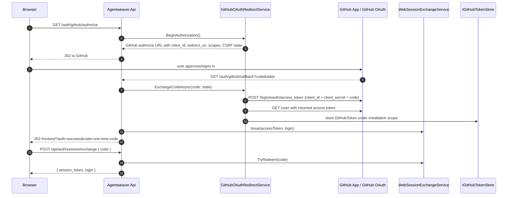

# Auth & Security — Deep Dive

## Purpose & Scope

This document describes the authentication, authorization, and security boundaries for `Agentweaver.Api`, with emphasis on:

- browser/web GitHub sign-in;
- GitHub organization authorization for the SAML-enforced `microsoft` organization;
- the Agentweaver-hosted OAuth 2.1 Authorization Server used by MCP clients;
- Agentweaver-minted JWT validation, refresh-token rotation, revocation, and `jti` denylisting;
- GitHub token storage, middleware ordering, and bypass/exemption rules.

Evidence comes from the API auth/security implementation and the MCP OAuth design doc. The API registers GitHub auth services and the OAuth AS in `Program.cs` (`apps/Agentweaver.Api/Program.cs:111-133`), uses fixed-window rate limiting for selected OAuth flow endpoints (`apps/Agentweaver.Api/Program.cs:135-154`), then runs GitHub token authentication before org authorization (`apps/Agentweaver.Api/Program.cs:360-363`) and maps the auth/OAuth endpoints (`apps/Agentweaver.Api/Program.cs:374-375`).

Deployment secrets are intentionally not reproduced here. Production reads GitHub OAuth client material and the MCP signing key from Key Vault-mounted files into environment variables (`k8s/api-deployment.yaml:77-85`, `k8s/secret-provider-class.yaml:21-29`). The checked-in production defaults set `Auth:GitHub:AllowedOrg` to `microsoft` and leave OAuth signing/issuer/audience empty unless deployment config pins them (`apps/Agentweaver.Api/appsettings.json:21-31`).

Unverified in code: the live production GitHub client ID value itself is not stored in source. The project decision log says web auth was moved from an OAuth App (`Ov...`) to a GitHub App user-to-server app (`Iv...`) and that the client secret is still required for the user authorization-code exchange (`.squad/decisions.md:3548-3554`). The API code is generic GitHub authorization-code OAuth: it requires configured `Auth:GitHub:ClientId`, `ClientSecret`, and `CallbackUrl` (`apps/Agentweaver.Api/Auth/GitHubOAuthRedirectService.cs:38-42`, `apps/Agentweaver.Api/Auth/GitHubOAuthRedirectService.cs:48-58`).

## Web Sign-In Flow



`GET /auth/github/authorize` starts the redirect flow and returns a GitHub authorization URL (`apps/Agentweaver.Api/Endpoints/AuthEndpoints.cs:30-42`). `GitHubOAuthRedirectService.BeginAuthorization()` generates a 256-bit URL-safe CSRF `state`, stores it for 10 minutes, and builds `/login/oauth/authorize` with `client_id`, `redirect_uri`, configured scopes, and `state` (`apps/Agentweaver.Api/Auth/GitHubOAuthRedirectService.cs:60-76`).

The same callback endpoint serves both browser sign-in and MCP OAuth broker callbacks. If the `state` belongs to a pending MCP authorization, control goes to the broker path; otherwise the browser sign-in path runs (`apps/Agentweaver.Api/Endpoints/AuthEndpoints.cs:44-82`). Browser sign-in rejects GitHub errors/missing parameters by redirecting the frontend with an error (`apps/Agentweaver.Api/Endpoints/AuthEndpoints.cs:84-89`).

For browser sign-in, the callback exchanges the GitHub code for a user access token (`apps/Agentweaver.Api/Endpoints/AuthEndpoints.cs:90-96`). The exchange validates and removes the CSRF state (`apps/Agentweaver.Api/Auth/GitHubOAuthRedirectService.cs:81-88`), then posts to GitHub `/login/oauth/access_token` with `client_id`, `client_secret`, `code`, and `redirect_uri` (`apps/Agentweaver.Api/Auth/GitHubOAuthRedirectService.cs:90-100`). This is why the on-behalf-of user authorization-code flow still needs `Auth:GitHub:ClientSecret`; it is a server-side confidential exchange, not a public-client secret.

After GitHub returns an access token, the API calls `GET https://api.github.com/user`, extracts the login/avatar, constructs a `GitHubToken`, and stores it through `IGitHubTokenStore` under `GitHubTokenScope.Installation` (`apps/Agentweaver.Api/Auth/GitHubOAuthRedirectService.cs:113-126`). The returned browser credential is not put directly in the redirect URL. Instead, the callback issues a short-lived single-use code and redirects with only that opaque code (`apps/Agentweaver.Api/Endpoints/AuthEndpoints.cs:92-99`). `WebSessionExchangeService` stores the code in memory for 60 seconds (`apps/Agentweaver.Api/Auth/WebSessionExchangeService.cs:20-27`), issues a 256-bit random code (`apps/Agentweaver.Api/Auth/WebSessionExchangeService.cs:37-47`), and atomically removes it on redemption (`apps/Agentweaver.Api/Auth/WebSessionExchangeService.cs:49-67`). The frontend redeems it via anonymous `POST /api/auth/session/exchange`, which returns `{ session_token, login }` only after successful redemption (`apps/Agentweaver.Api/Endpoints/AuthEndpoints.cs:106-117`).

Device flow remains available for authenticated API callers: `POST /api/auth/github/device` starts the flow and stores the `device_code` server-side (`apps/Agentweaver.Api/Endpoints/AuthEndpoints.cs:119-150`, `apps/Agentweaver.Api/Auth/GitHubDeviceFlowAuthService.cs:49-83`); `POST /api/auth/github/poll` polls GitHub and persists the resulting token (`apps/Agentweaver.Api/Endpoints/AuthEndpoints.cs:152-174`, `apps/Agentweaver.Api/Auth/GitHubDeviceFlowAuthService.cs:85-145`).

## GitHub Org Authorization Gate

```mermaid
flowchart TD
    A[Non-exempt request] --> B{CallerContext exists?}
    B -- no --> U[401 unauthenticated]
    B -- yes --> C{Caller is Agentweaver OAuth JWT?}
    C -- yes --> D{org claim == Auth:GitHub:AllowedOrg?}
    D -- yes --> ALLOW[allow]
    D -- no --> F[403]
    C -- no/raw GitHub token --> E[Extract Bearer token + login]
    E --> P[Authenticated /orgs/{org}/members/{login}]
    P -- 204/200 --> T{AllowedTeam configured?}
    P -- 403 SAML/404/302/not member/inconclusive --> PUB[Unauthenticated /orgs/{org}/public_members/{login}]
    PUB -- 204/200 --> T
    PUB -- not member + private check inconclusive --> I[Inconclusive: 403 retry later, never cache]
    PUB -- not member + private check definitive --> DENY[403 denied]
    T -- no --> ALLOW
    T -- yes --> TEAM[Authenticated team membership endpoint]
    TEAM -- member --> ALLOW
    TEAM -- not member/SAML --> DENY
```

`GitHubOrgAuthorizationMiddleware` must run after `GitHubTokenAuthMiddleware` because it depends on `context.Items["agentweaver.caller"]` (`apps/Agentweaver.Api/Auth/GitHubOrgAuthorizationMiddleware.cs:6-16`, `apps/Agentweaver.Api/Auth/GitHubOrgAuthorizationMiddleware.cs:99-106`). It fails closed when `Auth:GitHub:AllowedOrg` is unset (`apps/Agentweaver.Api/Auth/GitHubOrgAuthorizationMiddleware.cs:91-97`), and the app default config sets that org to `microsoft` (`apps/Agentweaver.Api/appsettings.json:21-24`; production also sets `Auth__GitHub__AllowedOrg=microsoft`, `k8s/api-deployment.yaml:115-118`).

Membership checks are cached for five minutes to reduce GitHub API calls (`apps/Agentweaver.Api/Auth/GitHubOrgAuthorizationService.cs:15-18`, `apps/Agentweaver.Api/Auth/GitHubOrgAuthorizationService.cs:28-29`). The cache key includes login, allowed org, and optional team slug (`apps/Agentweaver.Api/Auth/GitHubOrgAuthorizationService.cs:66-69`). Critically, `Inconclusive` results are never cached because they represent transient GitHub failures or token problems (`apps/Agentweaver.Api/Auth/GitHubOrgAuthorizationService.cs:71-79`).

The first probe is the authenticated private membership endpoint:

```text
GET https://api.github.com/orgs/{org}/members/{login}
Authorization: Bearer <caller GitHub token>
```

The code builds that URL at `apps/Agentweaver.Api/Auth/GitHubOrgAuthorizationService.cs:82-87`. The `github-authz` client disables auto-redirects so a GitHub `302` does not become a misleading success (`apps/Agentweaver.Api/Program.cs:117-118`, `apps/Agentweaver.Api/Auth/GitHubOrgAuthorizationService.cs:172-175`).

SAML caveat: for a SAML-enforced org such as `microsoft`, an authenticated request whose token is not SAML-authorized can return `403`; this is not treated as membership success. The service documents that the public-members fallback must be unauthenticated because GitHub applies SAML enforcement even to authenticated calls to the public endpoint, whereas an unauthenticated public-members request returns the true public-membership status (`apps/Agentweaver.Api/Auth/GitHubOrgAuthorizationService.cs:89-99`). The fallback call explicitly passes `sendAuthHeader: false` for `/orgs/{org}/public_members/{login}` (`apps/Agentweaver.Api/Auth/GitHubOrgAuthorizationService.cs:101-105`).

Rate limiting is deliberately separated from denial. The response mapper checks `429`, or `403` with `X-RateLimit-Remaining: 0` or `Retry-After`, before mapping ordinary `403` to SAML/org-access failure (`apps/Agentweaver.Api/Auth/GitHubOrgAuthorizationService.cs:197-220`). Rate-limit responses become `Inconclusive`, so they are not cached and cannot pin a false denial (`apps/Agentweaver.Api/Auth/GitHubOrgAuthorizationService.cs:197-215`).

Other result handling:

- `204 No Content` and `200 OK` mean member (`apps/Agentweaver.Api/Auth/GitHubOrgAuthorizationService.cs:222-225`).
- Authenticated `401` and `5xx` are `Inconclusive` because the service cannot distinguish non-membership from an expired token or GitHub outage (`apps/Agentweaver.Api/Auth/GitHubOrgAuthorizationService.cs:227-234`).
- If the private check was inconclusive and public membership is not confirmed, the service returns `Inconclusive`, not `Denied` (`apps/Agentweaver.Api/Auth/GitHubOrgAuthorizationService.cs:107-122`).
- A configured `Auth:GitHub:AllowedTeam` must be `org/team-slug`; malformed values disable the team check with a warning (`apps/Agentweaver.Api/Auth/GitHubOrgAuthorizationService.cs:41-56`). The team endpoint is checked after org membership, with `403` mapped to `OrgAccessNotGranted` (`apps/Agentweaver.Api/Auth/GitHubOrgAuthorizationService.cs:138-161`).

For Agentweaver-minted OAuth JWT callers, the org middleware does not call GitHub on every API request. It trusts the token's `org` claim only if it matches the configured allowed org because org membership was enforced when the Authorization Server issued the token and rechecked on refresh (`apps/Agentweaver.Api/Auth/GitHubOrgAuthorizationMiddleware.cs:108-128`).

## OAuth 2.1 Authorization Server

Agentweaver.Api hosts a public-client OAuth 2.1 Authorization Server for MCP clients. The implementation advertises RFC 8414 metadata and JWKS, supports authorization-code + PKCE S256, Dynamic Client Registration (RFC 7591), rotating refresh tokens, revocation (RFC 7009), and OIDC-compatible discovery aliases (`apps/Agentweaver.Api/Endpoints/OAuthServerEndpoints.cs:7-20`). The older `docs/mcp-oauth.md` describes the same Option C design and notes that the GitHub `client_secret` and user GitHub token stay server-side (`docs/mcp-oauth.md:5-15`, `docs/mcp-oauth.md:143-154`).

### Endpoint table

| Endpoint | Auth | Rate limit | Purpose | Evidence |
|---|---:|---:|---|---|
| `GET /.well-known/oauth-authorization-server` | anonymous | no | RFC 8414 AS metadata | `apps/Agentweaver.Api/Endpoints/OAuthServerEndpoints.cs:28-50` |
| `GET /.well-known/oauth-authorization-server/mcp` | anonymous | no | path-aware MCP metadata alias | `apps/Agentweaver.Api/Endpoints/OAuthServerEndpoints.cs:49-51` |
| `GET /.well-known/openid-configuration` | anonymous | no | OIDC discovery alias | `apps/Agentweaver.Api/Endpoints/OAuthServerEndpoints.cs:52-54` |
| `GET /.well-known/openid-configuration/mcp` | anonymous | no | path-aware OIDC alias | `apps/Agentweaver.Api/Endpoints/OAuthServerEndpoints.cs:52-54` |
| `GET /oauth/jwks` | anonymous | no | public signing key set | `apps/Agentweaver.Api/Endpoints/OAuthServerEndpoints.cs:56-67` |
| `GET /oauth/authorize` | anonymous | yes (`oauth`) | authorization-code request, GitHub broker redirect, mandatory PKCE | `apps/Agentweaver.Api/Endpoints/OAuthServerEndpoints.cs:69-128` |
| `POST /oauth/token` | anonymous public-client | yes (`oauth`) | `authorization_code` and `refresh_token` grants | `apps/Agentweaver.Api/Endpoints/OAuthServerEndpoints.cs:130-243` |
| `POST /oauth/register` | anonymous | yes (`oauth`) | Dynamic Client Registration (RFC 7591), public clients only | `apps/Agentweaver.Api/Endpoints/OAuthServerEndpoints.cs:245-306` |
| `POST /oauth/revoke` | anonymous | yes (`oauth`) | Refresh chain revocation and access-token `jti` denylist (RFC 7009) | `apps/Agentweaver.Api/Endpoints/OAuthServerEndpoints.cs:308-338` |

Metadata returns `issuer`, `authorization_endpoint`, `token_endpoint`, `registration_endpoint`, `jwks_uri`, `revocation_endpoint`, supported scopes, response/grant types, S256-only PKCE methods, and `token_endpoint_auth_methods_supported=["none"]` (`apps/Agentweaver.Api/Endpoints/OAuthServerEndpoints.cs:30-46`). Issuer is configured by `Auth:OAuth:Issuer` or derived from the request host; audience is configured by `Auth:OAuth:Audience` or defaults to `{issuer}/mcp` (`apps/Agentweaver.Api/Auth/OAuth/McpOAuthBrokerService.cs:17-32`). Production refuses to start unless issuer and audience are pinned to public values (`apps/Agentweaver.Api/Security/OAuthConfigGuard.cs:21-50`; `apps/Agentweaver.Api/Program.cs:39-43`).

### PKCE, redirect URI policy, and brokered GitHub login

`/oauth/authorize` validates `client_id` and `redirect_uri` before redirecting anywhere, preventing error redirects to untrusted destinations (`apps/Agentweaver.Api/Endpoints/OAuthServerEndpoints.cs:85-92`). Static redirect policy permits loopback HTTP (`127.0.0.1`, `::1`, `localhost`) and configured HTTPS prefixes, rejecting fragments and embedded userinfo (`apps/Agentweaver.Api/Auth/OAuth/McpOAuthBrokerService.cs:34-80`). If a client has registered with DCR, its exact registered redirect URIs are authoritative (`apps/Agentweaver.Api/Endpoints/OAuthServerEndpoints.cs:93-103`, `apps/Agentweaver.Api/Auth/OAuth/McpClientStore.cs:45-62`).

PKCE is mandatory and S256-only: missing `code_challenge` or any `code_challenge_method` other than `S256` is rejected (`apps/Agentweaver.Api/Endpoints/OAuthServerEndpoints.cs:108-113`). Authorization codes are redeemed once, expire in 60 seconds, and are bound to `redirect_uri`, `client_id`, and PKCE verifier (`apps/Agentweaver.Api/Auth/OAuth/McpOAuthBrokerService.cs:120-122`, `apps/Agentweaver.Api/Auth/OAuth/McpOAuthBrokerService.cs:238-260`). PKCE verification compares `BASE64URL(SHA256(ASCII(code_verifier)))` with the stored challenge using fixed-time comparison (`apps/Agentweaver.Api/Auth/OAuth/McpOAuthBrokerService.cs:267-275`).

The broker reuses `GitHubOAuthRedirectService`: it starts GitHub authorization, extracts GitHub's CSRF state, and records the MCP client's request keyed by that state (`apps/Agentweaver.Api/Auth/OAuth/McpOAuthBrokerService.cs:144-162`). On callback, it exchanges the GitHub code, enforces org membership before token issuance, then issues an opaque Agentweaver authorization code for the client redirect (`apps/Agentweaver.Api/Auth/OAuth/McpOAuthBrokerService.cs:168-236`). It also stores the brokered GitHub token per user on a best-effort basis so refresh-time org rechecks can use it; the GitHub token is never returned to the MCP client (`apps/Agentweaver.Api/Auth/OAuth/McpOAuthBrokerService.cs:211-231`).

### Dynamic Client Registration

`POST /oauth/register` accepts a subset of RFC 7591 metadata: `redirect_uris`, optional `client_name`, and optional `token_endpoint_auth_method` (`apps/Agentweaver.Api/Endpoints/OAuthServerEndpoints.cs:350-361`). Every redirect URI must pass the same redirect policy as `/authorize` (`apps/Agentweaver.Api/Endpoints/OAuthServerEndpoints.cs:270-280`). Confidential clients are rejected; only public clients with `token_endpoint_auth_method=none` are supported (`apps/Agentweaver.Api/Endpoints/OAuthServerEndpoints.cs:282-290`). Registered clients receive an ephemeral non-secret `client_id` (`mcp_...`) and exact redirect URI set (`apps/Agentweaver.Api/Auth/OAuth/McpClientStore.cs:25-43`, `apps/Agentweaver.Api/Auth/OAuth/McpClientRegistration.cs:5-16`).

### Token, refresh, and revocation behavior

For `grant_type=authorization_code`, `/oauth/token` redeems the code, mints a 15-minute JWT access token, and issues an opaque refresh token bound to subject, GitHub login, client ID, scope, and org (`apps/Agentweaver.Api/Endpoints/OAuthServerEndpoints.cs:152-179`). For `grant_type=refresh_token`, the refresh token is rotated and a new access token is minted (`apps/Agentweaver.Api/Endpoints/OAuthServerEndpoints.cs:181-240`).

Refresh-time org membership is rechecked when a brokered GitHub token is available. A definitive `Denied` or `OrgAccessNotGranted` revokes the presented refresh token and returns `403 access_denied`; `Inconclusive` falls back to the issuance-time org claim so transient GitHub failure or expired brokered tokens do not lock out private-org members (`apps/Agentweaver.Api/Endpoints/OAuthServerEndpoints.cs:191-227`).

`POST /oauth/revoke` is idempotent and always returns success for unknown tokens, per RFC 7009 semantics. It revokes refresh-token chains and, when the supplied token is a valid Agentweaver access token, extracts the `jti` and deny-lists it until natural expiry (`apps/Agentweaver.Api/Endpoints/OAuthServerEndpoints.cs:308-338`).

## MCP Token Service

`McpTokenService` signs Agentweaver access tokens using RS256. In production, it loads an RSA private key from `Auth:OAuth:SigningKey`, which is intended to be backed by Key Vault secret `mcp-oauth-signing-key`; without a configured key, it generates an ephemeral local-development key and logs a warning (`apps/Agentweaver.Api/Auth/OAuth/McpTokenService.cs:14-20`, `apps/Agentweaver.Api/Auth/OAuth/McpTokenService.cs:34-69`). JWKS exposes the public RSA key with deterministic `kid`, `kty=RSA`, `use=sig`, and `alg=RS256` (`apps/Agentweaver.Api/Auth/OAuth/McpTokenService.cs:127-140`, `apps/Agentweaver.Api/Auth/OAuth/McpTokenService.cs:204-214`).

JWT shape:

| Claim/header | Source/meaning | Evidence |
|---|---|---|
| `alg=RS256`, `kid` | current RSA signing key | `apps/Agentweaver.Api/Auth/OAuth/McpTokenService.cs:23-31`, `apps/Agentweaver.Api/Auth/OAuth/McpTokenService.cs:66-69` |
| `iss` | resolved issuer | `apps/Agentweaver.Api/Auth/OAuth/McpTokenService.cs:95-104` |
| `aud` | MCP resource audience, usually `{issuer}/mcp` | `apps/Agentweaver.Api/Auth/OAuth/McpTokenService.cs:95-104`, `apps/Agentweaver.Api/Auth/OAuth/McpOAuthBrokerService.cs:27-32` |
| `sub` | authenticated subject, currently GitHub login | `apps/Agentweaver.Api/Auth/OAuth/McpTokenService.cs:82-91` |
| `gh_login` | GitHub login | `apps/Agentweaver.Api/Auth/OAuth/McpTokenService.cs:82-91` |
| `scope` | `mcp:invoke` | `apps/Agentweaver.Api/Auth/OAuth/McpTokenService.cs:23-27`, `apps/Agentweaver.Api/Auth/OAuth/McpTokenService.cs:82-91` |
| `org` | allowed org captured at issuance, if configured | `apps/Agentweaver.Api/Auth/OAuth/McpTokenService.cs:92-94` |
| `iat`, `nbf`, `exp` | now, now, now + 15 minutes | `apps/Agentweaver.Api/Auth/OAuth/McpTokenService.cs:84-104` |
| `jti` | unique token ID for revocation denylist | `apps/Agentweaver.Api/Auth/OAuth/McpTokenService.cs:85-91` |

Validation requires issuer, audience, lifetime, signing key, and RS256 with 30 seconds of clock skew (`apps/Agentweaver.Api/Auth/OAuth/McpTokenService.cs:109-125`). `TryValidateAccessToken` returns false for non-Agentweaver JWTs or invalid tokens so the middleware can fall through to raw GitHub token validation (`apps/Agentweaver.Api/Auth/OAuth/McpTokenService.cs:145-180`). `TryReadJtiAndExpiry` validates a token and extracts `jti` plus expiry for revocation (`apps/Agentweaver.Api/Auth/OAuth/McpTokenService.cs:182-202`).

The API middleware validates Agentweaver JWTs before trying the raw GitHub-token path. It resolves issuer/audience, validates the token offline, checks the `jti` denylist through `McpRefreshTokenStore`, and creates a `CallerContext` with `IsOAuthJwt=true` and the org claim (`apps/Agentweaver.Api/Security/ApiKeyAuthMiddleware.cs:168-190`). Denied JTIs live in `McpRevokedJtis` and are checked until expiry (`apps/Agentweaver.Api/Auth/OAuth/McpRefreshTokenStore.cs:139-160`, `apps/Agentweaver.Api/Auth/OAuth/McpRevokedJti.cs:5-24`).

## Token Stores

### GitHub user tokens

`IGitHubTokenStore` stores `GitHubToken` records containing access token, optional refresh token, expiry, login, avatar URL, and scopes (`packages/Agentweaver.Domain/IGitHubTokenStore.cs:3-34`). Scopes are either `installation` or per-user (`user:{userId}`) (`packages/Agentweaver.Domain/IGitHubTokenStore.cs:9-18`). The default registered scope provider is installation-scoped (`apps/Agentweaver.Api/Program.cs:111-115`), with a caller-scoped provider available for hosted multi-tenant deployments (`apps/Agentweaver.Api/Auth/CallerTokenScopeProvider.cs:5-16`, `apps/Agentweaver.Api/Auth/FixedInstallationScopeProvider.cs:5-13`).

On Windows, `OsCredentialStoreGitHubTokenStore` uses Windows Credential Manager (`CRED_TYPE_GENERIC`, DPAPI-protected), with credential target names separated by scope and signed-out tombstones to suppress fallback (`apps/Agentweaver.Api/Auth/OsCredentialStoreGitHubTokenStore.cs:8-18`, `apps/Agentweaver.Api/Auth/OsCredentialStoreGitHubTokenStore.cs:116-156`). On non-Windows it falls back to a file store (`apps/Agentweaver.Api/Auth/OsCredentialStoreGitHubTokenStore.cs:20-27`). The file store writes one JSON file per scope under `{DataDirectory}/auth/{scope-key}.json`, sanitizes scope keys for filenames, and sets owner-only `0600` permissions on Unix best-effort (`apps/Agentweaver.Api/Auth/FileSystemGitHubTokenStore.cs:7-24`, `apps/Agentweaver.Api/Auth/FileSystemGitHubTokenStore.cs:110-126`). The in-memory implementation is development/test-only and loses tokens on restart (`apps/Agentweaver.Api/Auth/InMemoryGitHubTokenStore.cs:6-12`).

`GitHubTokenRefreshService` centralizes valid-token retrieval and refresh. It returns non-expiring or not-near-expiry tokens directly, serializes refreshes per scope, signs out if refresh is impossible, and never logs raw token values (`apps/Agentweaver.Api/Auth/GitHubTokenRefreshService.cs:10-28`, `apps/Agentweaver.Api/Auth/GitHubTokenRefreshService.cs:57-105`). GitHub refresh uses the configured `client_id`, `client_secret`, `grant_type=refresh_token`, and stored refresh token (`apps/Agentweaver.Api/Auth/GitHubTokenRefreshService.cs:119-170`).

### OAuth refresh tokens, clients, and access-token denylist

MCP refresh tokens are opaque to clients but stored only as SHA-256 hashes; a database disclosure cannot replay the plaintext token (`apps/Agentweaver.Api/Auth/OAuth/McpRefreshToken.cs:5-13`, `apps/Agentweaver.Api/Auth/OAuth/McpRefreshTokenStore.cs:15-24`). Tokens have a 30-day sliding lifetime and 90-day absolute lifetime (`apps/Agentweaver.Api/Auth/OAuth/McpRefreshTokenStore.cs:27-31`). Rotation consumes the current token and creates a new one in the same chain; presenting a consumed/revoked token revokes the whole chain as reuse detection (`apps/Agentweaver.Api/Auth/OAuth/McpRefreshTokenStore.cs:62-120`).

Refresh revocation is chain-wide and idempotent (`apps/Agentweaver.Api/Auth/OAuth/McpRefreshTokenStore.cs:122-137`). Access-token revocation adds the `jti` to a bounded denylist until expiry (`apps/Agentweaver.Api/Auth/OAuth/McpRefreshTokenStore.cs:139-160`). EF indexes enforce unique refresh-token hashes, unique revoked JTIs, and unique DCR client IDs (`apps/Agentweaver.Api/Memory/MemoryDbContext.cs:75-80`).

Dynamic clients are persisted in `McpClientRegistrations` with a non-secret client ID and newline-separated exact redirect URIs (`apps/Agentweaver.Api/Auth/OAuth/McpClientRegistration.cs:17-31`). `McpClientStore` creates random `mcp_...` IDs and returns registered redirect URIs for exact-match enforcement at `/oauth/authorize` (`apps/Agentweaver.Api/Auth/OAuth/McpClientStore.cs:25-73`).

## Middleware & Exemptions

`GitHubTokenAuthMiddleware` authenticates API calls. It applies only to `/api/*`, exempting `/api/ping`, `/api/health`, and `/api/auth/session/exchange` because that endpoint exchanges the one-time web sign-in code for a token (`apps/Agentweaver.Api/Security/ApiKeyAuthMiddleware.cs:134-147`). For Agentweaver OAuth JWTs it validates offline and checks the `jti` denylist (`apps/Agentweaver.Api/Security/ApiKeyAuthMiddleware.cs:168-190`). For raw GitHub bearer tokens it caches the result of `GET /user` by SHA-256 token hash for five minutes on success and 30 seconds on failure (`apps/Agentweaver.Api/Security/ApiKeyAuthMiddleware.cs:193-202`, `apps/Agentweaver.Api/Security/ApiKeyAuthMiddleware.cs:217-245`).

`ApiKeyAuthMiddleware` is now a compatibility shim over `GitHubTokenAuthMiddleware.GetCaller`; the old `ApiKeyRegistry` reports no configured keys (`apps/Agentweaver.Api/Security/ApiKeyAuthMiddleware.cs:255-263`, `apps/Agentweaver.Api/Security/ApiKeyRegistry.cs:3-18`). Test bypasses exist but are honored only in Development (`apps/Agentweaver.Api/Security/ApiKeyAuthMiddleware.cs:53-61`, `apps/Agentweaver.Api/Security/ApiKeyAuthMiddleware.cs:93-131`; `apps/Agentweaver.Api/Auth/GitHubOrgAuthorizationMiddleware.cs:53-72`). Production startup fails if either test bypass flag is enabled (`apps/Agentweaver.Api/Security/TestingBypassGuard.cs:13-47`, `apps/Agentweaver.Api/Program.cs:33-37`).

`GitHubOrgAuthorizationMiddleware` exempts these prefixes from org/team checks:

- `/health`, `/healthz`, `/api/health`, `/api/ping`;
- `/auth` and `/api/auth`;
- `/mcp`;
- `/oauth`;
- `/.well-known`.

The list is defined at `apps/Agentweaver.Api/Auth/GitHubOrgAuthorizationMiddleware.cs:25-39` and applied with prefix matching at `apps/Agentweaver.Api/Auth/GitHubOrgAuthorizationMiddleware.cs:191-199`. The `/oauth` and `/.well-known` exemptions are required because discovery and the public-client OAuth flow must be reachable before the client has a token (`apps/Agentweaver.Api/Auth/GitHubOrgAuthorizationMiddleware.cs:35-38`).

Repository path submission has separate security hardening: UNC/device/relative/drive-relative paths and alternate data streams are rejected, optional allowlisted roots are resolved through real paths, and rejection messages avoid path-existence oracles (`apps/Agentweaver.Api/Security/RepositoryRootValidator.cs:7-21`, `apps/Agentweaver.Api/Security/RepositoryRootValidator.cs:73-151`).

## Security Properties, Threats & Gotchas

- **GitHub secrets stay server-side.** The browser and MCP clients never receive the GitHub `client_secret`; MCP clients also never receive the user's GitHub token. The broker documentation and code state this boundary explicitly (`apps/Agentweaver.Api/Auth/OAuth/McpOAuthBrokerService.cs:101-117`, `docs/mcp-oauth.md:151-154`).
- **Do not put tokens in URLs.** Browser sign-in uses a 60-second one-time code so the GitHub access token is returned only via POST body, not redirect query strings (`apps/Agentweaver.Api/Endpoints/AuthEndpoints.cs:92-99`, `apps/Agentweaver.Api/Auth/WebSessionExchangeService.cs:8-19`).
- **SAML org checks are subtle.** For `microsoft`, authenticated membership/public-members requests can be SAML-blocked. The working fallback is the unauthenticated `/public_members/{login}` probe; only publicized org membership can succeed there (`apps/Agentweaver.Api/Auth/GitHubOrgAuthorizationService.cs:89-105`). Private members who do not publicize membership may be denied unless the authenticated GitHub App user token can prove membership.
- **Rate-limit `403` is not denial.** GitHub primary/secondary rate limits map to `Inconclusive` and are never cached (`apps/Agentweaver.Api/Auth/GitHubOrgAuthorizationService.cs:197-215`, `apps/Agentweaver.Api/Auth/GitHubOrgAuthorizationService.cs:73-79`).
- **Cache only stable authz answers.** `Allowed`, `Denied`, and `OrgAccessNotGranted` are cached for five minutes; `Inconclusive` is not (`apps/Agentweaver.Api/Auth/GitHubOrgAuthorizationService.cs:66-79`). Be careful changing this: caching transient failures can pin false denials.
- **Issuer/audience must be public and stable in production.** Internal service hosts would break JWT validation because AS-minted tokens are audience-bound to the public MCP resource. Production startup requires pinned `Auth:OAuth:Issuer` and `Auth:OAuth:Audience` (`apps/Agentweaver.Api/Security/OAuthConfigGuard.cs:3-18`, `apps/Agentweaver.Api/Security/OAuthConfigGuard.cs:31-50`).
- **PKCE is S256 only.** `plain` is rejected and authorization codes are single-use, short-lived, and bound to client/redirect/PKCE (`apps/Agentweaver.Api/Endpoints/OAuthServerEndpoints.cs:108-113`, `apps/Agentweaver.Api/Auth/OAuth/McpOAuthBrokerService.cs:238-260`).
- **Redirect URI exactness matters.** Validate `redirect_uri` before any redirect; registered clients get exact-match redirect enforcement, and static HTTPS prefixes are only defense-in-depth (`apps/Agentweaver.Api/Endpoints/OAuthServerEndpoints.cs:85-103`, `apps/Agentweaver.Api/Auth/OAuth/McpClientRegistration.cs:5-16`).
- **Refresh-token reuse is treated as theft.** Reusing a consumed or revoked refresh token revokes the chain (`apps/Agentweaver.Api/Auth/OAuth/McpRefreshTokenStore.cs:82-87`).
- **Revoked access tokens remain invalid until expiry.** `/oauth/revoke` adds valid access-token `jti` values to the denylist, and middleware rejects denied JTIs before setting caller context (`apps/Agentweaver.Api/Endpoints/OAuthServerEndpoints.cs:308-338`, `apps/Agentweaver.Api/Security/ApiKeyAuthMiddleware.cs:173-180`).
- **Local/dev keys are not production keys.** Ephemeral OAuth signing keys are acceptable only for local development because tokens fail after restart and are not shareable across instances (`apps/Agentweaver.Api/Auth/OAuth/McpTokenService.cs:54-64`).
- **Auth bypass flags are development-only.** Middleware ignores bypass flags outside Development and Production startup fails if bypass is configured (`apps/Agentweaver.Api/Security/TestingBypassGuard.cs:29-47`, `apps/Agentweaver.Api/Security/ApiKeyAuthMiddleware.cs:93-114`, `apps/Agentweaver.Api/Auth/GitHubOrgAuthorizationMiddleware.cs:53-72`).
