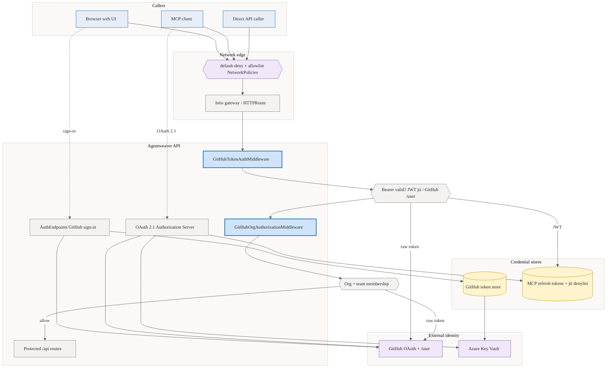
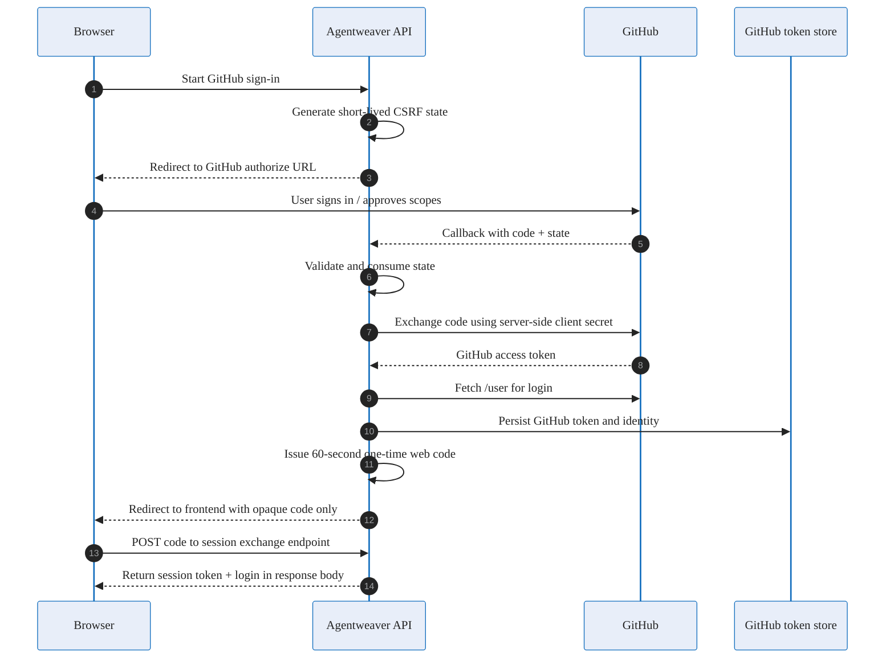
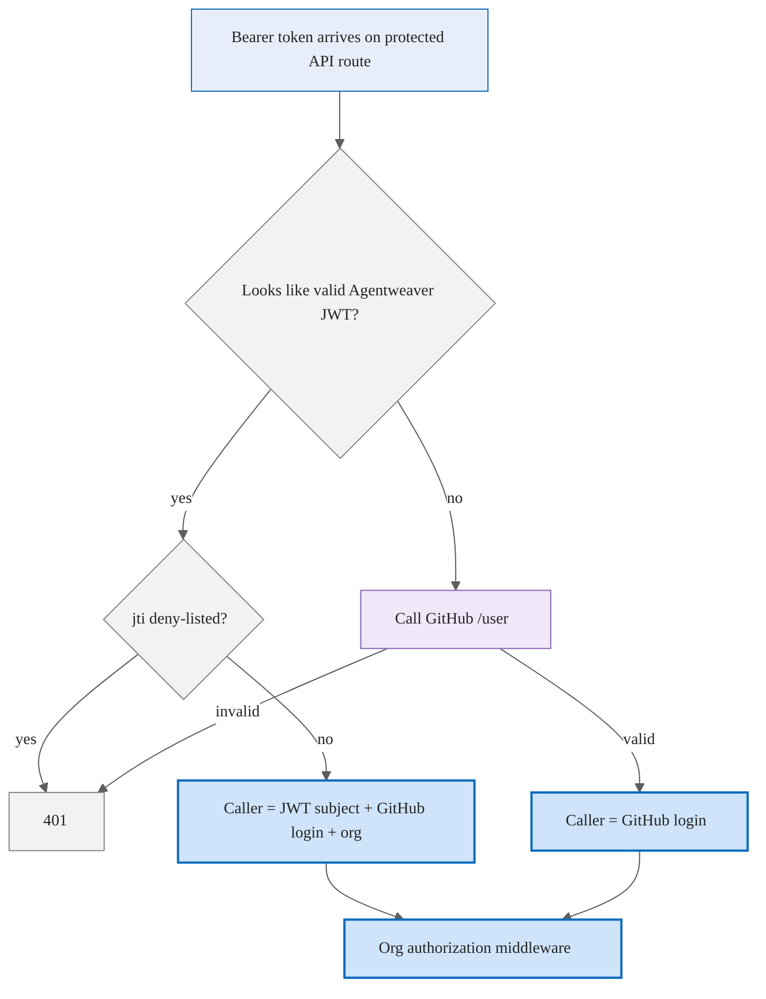
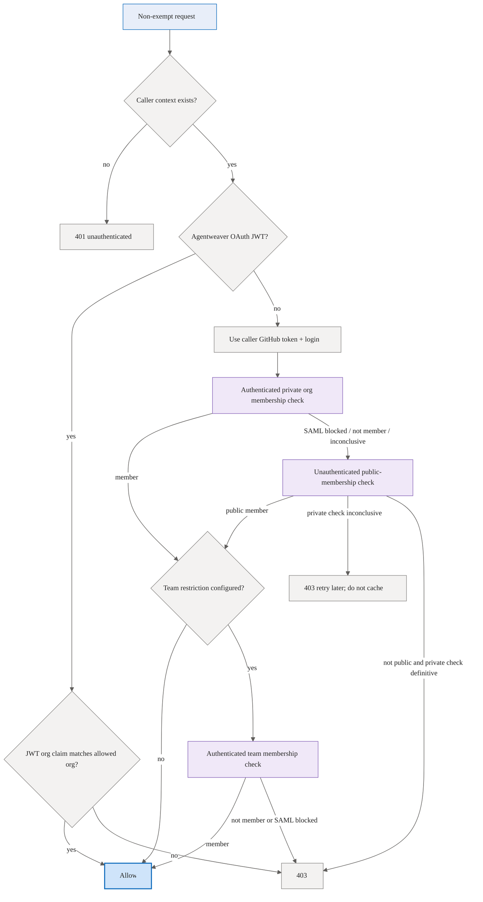
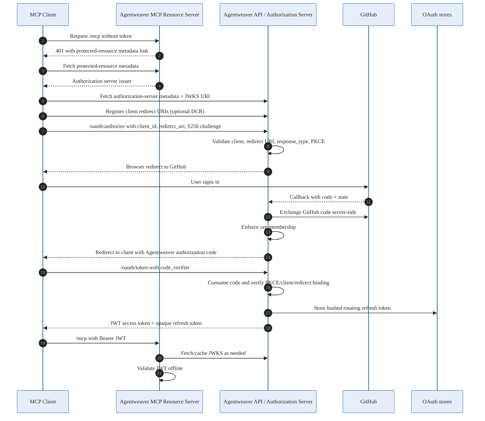

# Auth & Security — Conceptual Deep Dive

## Purpose and mental model

Agentweaver has three related but distinct security jobs:

1. **Know who is calling.** A request must carry a bearer credential that can be mapped to a GitHub user or an Agentweaver-issued OAuth identity.
2. **Know whether that user is allowed.** Most non-bootstrap surfaces are restricted to members of a configured GitHub organization, usually `microsoft`, and optionally a team.
3. **Let MCP clients authenticate without learning GitHub secrets.** Agentweaver acts as an OAuth 2.1 Authorization Server for MCP clients. GitHub remains the human identity provider; Agentweaver mints short-lived tokens for its own MCP resource.

The design deliberately separates **identity proof** from **authorization policy**:

- GitHub proves the user's identity and can prove org/team membership when GitHub's APIs allow it.
- Agentweaver enforces local invariants: allowed org, token lifetime, redirect policy, PKCE, refresh-token rotation, revocation, and middleware exemptions.
- MCP clients receive Agentweaver credentials, not GitHub credentials.

The important rebuild principle is: **never trust a client merely because it reached a route**. Each route should be either explicitly public bootstrap/discovery, or it should pass through bearer-token authentication and org authorization.

## Threat model and guardrail summary

Agentweaver assumes attackers may:

- steal redirect URLs from browser history, logs, or `Referer` headers;
- replay authorization codes or refresh tokens;
- point OAuth error redirects at attacker-controlled URLs;
- send raw GitHub tokens, configured automation keys, malformed JWTs, or revoked Agentweaver JWTs;
- exploit SAML-enforced GitHub org behavior to create false membership conclusions;
- set unsafe config flags accidentally in production;
- run high-volume probing against public OAuth endpoints.

The main guardrails are:

- **No long-lived token in redirect URLs.** Browser sign-in redirects with a short-lived, single-use code, then returns the GitHub token only from a POST exchange.
- **PKCE S256 for public clients.** MCP clients cannot use `plain` PKCE and cannot redeem a code without the verifier.
- **Redirect validation before redirecting.** Invalid OAuth clients or redirect URIs get local errors, not redirects to untrusted destinations.
- **Short-lived access tokens.** Agentweaver JWTs last about 15 minutes; refresh tokens are rotating and theft-sensitive.
- **Revocation at two layers.** Refresh-token chains can be revoked, and access-token `jti` values can be deny-listed until expiry.
- **Fail closed on uncertain authorization.** If org membership cannot be verified for a live request, the request is blocked rather than allowed.
- **Do not cache uncertainty.** Transient GitHub failures and rate limits are not cached as durable authorization facts.
- **Production startup guards.** Test auth bypasses and missing public OAuth issuer/audience config fail fast in production.

Where this lives:

- `apps/Agentweaver.Api/Program.cs`
- `apps/Agentweaver.Api/Security`
- `apps/Agentweaver.Api/Auth`
- `apps/Agentweaver.Mcp`

## Architecture at a glance

Every request crosses a network-policy boundary into the gateway, then passes through two ordered middlewares: `GitHubTokenAuthMiddleware` resolves identity (Agentweaver JWT validated offline against the `jti` denylist, or a raw GitHub token validated via `GET /user` and cached), and `GitHubOrgAuthorizationMiddleware` enforces org/team membership before any protected route runs. Browser sign-in and the MCP OAuth flow both terminate at GitHub as the human identity provider.

## Web sign-in: GitHub OAuth on behalf of the user

Web sign-in solves a browser problem: the user needs to authorize Agentweaver with GitHub, but the browser must not receive server secrets and should not receive the GitHub access token through a URL.

Conceptually, Agentweaver behaves as a confidential GitHub OAuth client:

1. The browser asks Agentweaver to start sign-in.
2. Agentweaver creates a random CSRF `state`, remembers it briefly, and redirects the browser to GitHub's authorization page.
3. GitHub authenticates the human and redirects back with an authorization `code` and the same `state`.
4. Agentweaver validates and consumes the `state`, then exchanges the code server-to-server using its GitHub client ID, callback URL, and client secret.
5. Agentweaver calls GitHub `/user` with the returned GitHub access token to learn the login.
6. Agentweaver stores the GitHub token for later server use.
7. Instead of putting that GitHub token in the frontend redirect, Agentweaver creates a one-time web session code, redirects with only that opaque code, and requires the frontend to redeem it by POST.

### Why this shape

- **CSRF state** binds the callback to a sign-in Agentweaver initiated.
- **Server-side code exchange** keeps the GitHub client secret out of browsers and MCP clients.
- **GitHub `/user` lookup** turns an opaque GitHub access token into the accountable login Agentweaver uses for ownership checks.
- **One-time POST exchange** avoids leaking the GitHub access token through URL logs, history, analytics, reverse proxies, or referrers.
- **Short lifetimes and single use** make stolen intermediate codes less valuable.

### Invariants to preserve when rebuilding

- The GitHub `state` must be random, short-lived, and consumed exactly once.
- The callback must reject missing code/state and GitHub errors.
- The GitHub token must not be placed in a query string or fragment.
- The one-time frontend exchange code must be random, short-lived, and atomically removed on redemption.
- Public sign-in endpoints are bootstrap routes; do not require a bearer token before the user has one.

Web auth uses a GitHub App user-to-server flow. The live production GitHub client ID is supplied by configuration rather than stored in source, and the server-side authorization-code exchange uses a client secret that is also kept out of source.

Where this lives:

- `apps/Agentweaver.Api/Endpoints/AuthEndpoints.cs`
- `apps/Agentweaver.Api/Auth/GitHubOAuthRedirectService.cs`
- `apps/Agentweaver.Api/Auth/WebSessionExchangeService.cs`
- `.squad/decisions.md`

## API bearer authentication: accepting tokens safely

After bootstrap, protected API calls use `Authorization: Bearer ...`. The API tries to resolve the caller in this order:

1. **Agentweaver OAuth JWT.** If the bearer looks like a JWT and validates as an Agentweaver-issued access token, use its subject, GitHub login, org claim, and `jti`.
2. **Raw GitHub bearer token.** Otherwise, ask GitHub `/user` whether the token is valid and which login owns it.
3. **Development-only bypass.** A configured bypass can map tokens to users only in Development; production refuses to start if bypass flags are enabled.

The API does not normally accept automation keys directly. Hosted MCP keeps the automation-key fast path for machine-to-machine callers, then forwards accepted bearer tokens to the API so normal end-to-end identity remains a raw GitHub token or an Agentweaver JWT that the backend can validate.

### Why this shape

- **JWT first** lets MCP callers use Agentweaver-issued tokens without calling GitHub on every request.
- **Raw GitHub fallback** preserves direct API use by users who already have a GitHub OAuth token.
- **Short validation caches** reduce GitHub API load but avoid long-lived stale identity decisions.
- **Deny-list check** gives access-token revocation meaning even before the 15-minute JWT lifetime expires.
- **Production bypass guard** prevents a test convenience from becoming a production backdoor.

### Invariants to preserve when rebuilding

- Never treat an arbitrary bearer token as a user without validating it.
- Cache token validation by a token hash, not by raw token value in logs or cache keys intended for inspection.
- Negative validation results should have a much shorter cache lifetime than positive results.
- A revoked Agentweaver JWT must fail before caller context is created.
- Middleware that needs caller identity must run after bearer-token authentication.

Where this lives:

- `apps/Agentweaver.Api/Security/ApiKeyAuthMiddleware.cs`
- `apps/Agentweaver.Api/Security/ApiKeyRegistry.cs`
- `apps/Agentweaver.Api/Security/TestingBypassGuard.cs`

## GitHub org authorization and the SAML nuance

Identity answers "who are you?" Authorization answers "are you allowed to use this Agentweaver deployment?" For hosted Agentweaver, the primary policy is membership in the configured GitHub organization, usually `microsoft`, with an optional team restriction.

The authorization middleware runs after bearer authentication. It handles two caller classes differently:

- **Agentweaver OAuth JWT callers:** trust the signed `org` claim only if it equals the configured allowed org. This is safe because org membership was checked when the Authorization Server issued the token and is rechecked on refresh when possible.
- **Raw GitHub token callers:** use the caller's GitHub token to ask GitHub whether the login is in the allowed org/team.

### The SAML-enforced org problem

For SAML-enforced GitHub organizations, an authenticated API request can fail even for a real member if the token has not been SAML-authorized for that org. This matters because the normal private membership endpoint may return a SAML-related failure instead of a simple "member" or "not member" answer.

Agentweaver uses a two-probe strategy:

1. **Authenticated private membership check.** This can prove private org membership when the token has sufficient org/SAML access.
2. **Unauthenticated public-membership fallback.** This can prove membership only for users who have publicized their org membership.

The fallback must be unauthenticated. If Agentweaver sends the same SAML-blocked token to the public-members endpoint, GitHub can still apply SAML enforcement and return a misleading failure. Without an auth header, GitHub returns the public-membership truth: public members are visible; private members are not.

The unavoidable trade-off is that private members whose token cannot prove membership and who have not publicized membership may be denied or asked to retry. Agentweaver chooses this over allowing unverifiable callers into a protected deployment.

### Result semantics

- **Allowed:** GitHub proved org membership and, if configured, team membership.
- **Denied:** GitHub gave a definitive non-member answer.
- **Org access not granted:** the token is valid but cannot access the org/team private API, commonly because SAML SSO was not authorized.
- **Inconclusive:** GitHub could not answer reliably because of rate limiting, token failure, network failure, or server error.

Only stable answers are cached briefly. Inconclusive answers are never cached, because caching them would turn a transient GitHub problem into a durable denial.

### Invariants to preserve when rebuilding

- Fail closed if `AllowedOrg` is missing on non-exempt routes.
- Do not let HTTP redirects from GitHub turn into accidental success; membership probes should not auto-follow GitHub redirects.
- Detect rate limits before classifying `403` as SAML/org denial.
- Never cache inconclusive authorization decisions.
- If using JWT org claims, ensure the Authorization Server really enforced org membership before issuing the token.

Where this lives:

- `apps/Agentweaver.Api/Auth/GitHubOrgAuthorizationMiddleware.cs`
- `apps/Agentweaver.Api/Auth/GitHubOrgAuthorizationService.cs`
- `apps/Agentweaver.Api/appsettings.json`
- `k8s/api-deployment.yaml`

## OAuth 2.1 Authorization Server for MCP

MCP clients are public clients: they cannot safely hold a GitHub client secret, and Agentweaver should not hand them the user's GitHub token. The solution is to make `Agentweaver.Api` an OAuth 2.1 Authorization Server for the MCP resource.

In this model:

- GitHub remains the upstream human identity provider.
- Agentweaver is the OAuth Authorization Server seen by MCP clients.
- The MCP server is the OAuth Resource Server.
- The client receives Agentweaver authorization codes, access tokens, and refresh tokens — never GitHub tokens or GitHub client secrets.

### Public discovery endpoints

OAuth-capable MCP clients need unauthenticated discovery before they have a token. Agentweaver therefore publishes:

- Authorization Server metadata (`/.well-known/oauth-authorization-server` and MCP-suffixed alias).
- OIDC-compatible discovery aliases for clients that probe those paths.
- JWKS for the public signing key.
- MCP Protected Resource metadata from the MCP server, advertising the authorization server and resource.

Discovery should not require auth; otherwise clients could not learn how to authenticate. The trade-off is that discovery reveals public configuration, so it should expose only non-secret metadata.

### Authorization endpoint logic

`/oauth/authorize` is intentionally strict before redirecting anywhere:

1. Require `client_id`.
2. Validate `redirect_uri` against the redirect policy.
3. If the client registered dynamically, require the requested redirect URI to match that registered set. Native loopback registrations may ignore port for usability, but token redemption still binds to the exact redirect URI used in the authorization request.
4. Require `response_type=code`.
5. Require PKCE with `code_challenge_method=S256`.
6. Record the client's request, keyed by the GitHub CSRF state used for the brokered login.
7. Redirect the user to GitHub.

Validation failures return local OAuth error responses instead of redirects. This avoids open-redirect vulnerabilities where an attacker supplies a malicious redirect URI and receives error details or codes.

### Brokered GitHub login

The broker joins two flows:

- the MCP client's OAuth authorization-code flow with Agentweaver; and
- Agentweaver's confidential OAuth flow with GitHub.

The GitHub callback is shared with web sign-in. Agentweaver decides which path to take by checking whether the callback `state` belongs to a pending MCP authorization. If yes, it finishes the brokered MCP flow: exchange GitHub code, verify org membership, then issue an Agentweaver authorization code for the MCP client redirect.

The MCP authorization code is not a GitHub code. It is a short-lived, single-use Agentweaver artifact bound to:

- client ID;
- redirect URI;
- PKCE challenge;
- GitHub login / subject;
- requested scope.

### Token endpoint logic

`/oauth/token` supports two grants:

- **authorization_code:** consume the Agentweaver authorization code, verify client ID, exact redirect URI, and PKCE verifier, then mint a JWT access token and issue a refresh token.
- **refresh_token:** rotate the refresh token, optionally recheck org membership, and mint a new JWT access token.

Token responses are marked `no-store` because they contain bearer credentials.

Refresh-time org recheck is best effort. If Agentweaver has a brokered GitHub token for the user, it asks GitHub again. A definitive non-member result revokes and denies. An inconclusive result falls back to the org claim captured at issuance so transient GitHub or SAML-token problems do not lock out valid private-org users every time a GitHub token expires.

### Dynamic Client Registration

Dynamic Client Registration lets public MCP clients register redirect URIs and receive a non-secret `client_id`. The registered redirect set becomes the per-client redirect allowlist. Agentweaver rejects confidential client auth methods because this design assumes public clients plus PKCE, not client secrets.

### Revocation

`/oauth/revoke` is idempotent. Unknown tokens still produce success, matching OAuth revocation semantics and avoiding token existence oracles. If the token is a refresh token, Agentweaver revokes the whole chain. If the token is a valid Agentweaver access token, Agentweaver deny-lists its `jti` until natural expiry.

### Invariants to preserve when rebuilding

- OAuth discovery and authorization bootstrap endpoints must be public, but rate-limit expensive flow endpoints.
- Redirect URI validation must happen before any redirect.
- PKCE must be mandatory and S256-only.
- Authorization codes must be short-lived, single-use, and bound to client, redirect URI, and PKCE.
- MCP clients must never receive GitHub access tokens or the GitHub client secret.
- Refresh tokens must rotate; reuse should revoke the chain.

Where this lives:

- `apps/Agentweaver.Api/Endpoints/OAuthServerEndpoints.cs`
- `apps/Agentweaver.Api/Auth/OAuth/McpOAuthBrokerService.cs`
- `docs/mcp-oauth.md`

## MCP bearer JWTs: issuance, validation, and forwarding

Agentweaver access tokens are JWTs signed with RS256. They are designed to be validated offline by the MCP Resource Server and by the API.

A token represents:

- **issuer (`iss`)**: the public Agentweaver Authorization Server issuer;
- **audience (`aud`)**: the MCP resource, usually `{issuer}/mcp`;
- **subject (`sub`)**: the authenticated GitHub login;
- **GitHub login (`gh_login`)**: explicit login claim for downstream identity;
- **scope**: currently `mcp:invoke`;
- **org**: the allowed org captured at issuance;
- **lifetime claims**: issued-at, not-before, expiry;
- **JWT ID (`jti`)**: revocation handle.

```mermaid
%%{init: {'theme':'base','themeVariables':{'fontFamily':'Segoe UI, system-ui, -apple-system, sans-serif','fontSize':'14px','primaryColor':'#E8EEF9','primaryBorderColor':'#0F6CBD','primaryTextColor':'#242424','lineColor':'#605E5C','clusterBkg':'#FAF9F8','clusterBorder':'#D2D0CE','edgeLabelBackground':'#FFFFFF'}}}%%
flowchart LR
    AS[Agentweaver API signs JWT with RSA private key] --> JWKS[Publishes public key as JWKS]
    Client[MCP client presents JWT] --> MCP[MCP validates signature, iss, aud, exp, alg]
    JWKS --> MCP
    MCP --> Forward[Forward same bearer token to API]
    Forward --> API[API validates JWT and checks jti denylist]
    API --> Authz[Org middleware trusts matching org claim]

    classDef client fill:#E8EEF9,stroke:#0F6CBD,stroke-width:1px,color:#242424;
    classDef svc fill:#F3F2F1,stroke:#8A8886,stroke-width:1px,color:#242424;
    classDef core fill:#CFE4FA,stroke:#0F6CBD,stroke-width:2px,color:#242424;
    classDef data fill:#FFF4CE,stroke:#C19C00,stroke-width:1px,color:#242424;
    classDef ext fill:#F0E8F8,stroke:#8764B8,stroke-width:1px,color:#242424;
    classDef runtime fill:#DDF3DD,stroke:#107C10,stroke-width:1px,color:#242424;
    classDef evt fill:#D6F0F0,stroke:#038387,stroke-width:1px,color:#242424;

    class Client client;
    class JWKS,MCP,Forward svc;
    class AS,API,Authz core;
```

### Signing keys

Production should load a stable RSA private key from configuration/secret storage. Local development can generate an ephemeral key so the flow works on a developer machine, but ephemeral keys invalidate tokens on restart and are unsuitable for multi-instance or hosted deployments.

JWKS exposes only the public key. The `kid` is deterministic from public key material so the same key advertises the same identity across restarts.

### Validation responsibilities

The MCP server validates JWTs using cached JWKS from the Authorization Server. It checks signature, issuer, audience, lifetime, and RS256 algorithm. That lets MCP reject invalid tokens without calling GitHub or the Authorization Server on every request.

The API also validates Agentweaver JWTs when MCP forwards calls downstream. The API additionally checks the `jti` denylist, because revocation state lives in the API database. This split keeps MCP stateless for normal validation while preserving authoritative revocation at the backend.

### Issuer and audience pinning

In production, issuer and audience must be public, stable values. Internal service-to-service hosts such as `http://agentweaver-api:8080` are not the OAuth issuer the client discovered and not the audience embedded in tokens. If production derived issuer/audience from internal request hosts, valid forwarded JWTs would fail validation. Agentweaver therefore requires pinned issuer/audience config in production for both API and HTTP-mode MCP.

Where this lives:

- `apps/Agentweaver.Api/Auth/OAuth/McpTokenService.cs`
- `apps/Agentweaver.Mcp/McpAccessTokenValidator.cs`
- `apps/Agentweaver.Mcp/McpBearerTokenMiddleware.cs`
- `apps/Agentweaver.Mcp/AgentweaverApiClient.cs`
- `apps/Agentweaver.Api/Security/OAuthConfigGuard.cs`
- `apps/Agentweaver.Mcp/Program.cs`

## Token stores and lifetimes

Agentweaver uses different storage strategies for different credential types because each type has a different replay risk and lifecycle.

### GitHub user tokens

GitHub tokens are the credentials Agentweaver uses to act on behalf of a signed-in user or to recheck org membership. They may include access token, optional refresh token, expiry, login, avatar URL, and scopes.

Token scopes separate storage domains:

- **installation scope** for the default web sign-in storage model;
- **per-user scope** for hosted/multi-user flows and brokered MCP refresh-time org checks.

On Windows, tokens are stored in Windows Credential Manager, protected by OS facilities. On non-Windows, Agentweaver falls back to per-scope JSON files under its data directory with owner-only permissions where supported. A signed-out tombstone is stored to distinguish "user explicitly signed out" from "never signed in".

A refresh helper centralizes token retrieval. It returns still-valid tokens directly, serializes refreshes per scope to avoid refresh races, signs out when refresh is impossible, and avoids logging raw token values.

### OAuth authorization state and web exchange codes

Some OAuth artifacts are intentionally in-memory:

- GitHub CSRF states;
- MCP pending authorizations keyed by GitHub state;
- Agentweaver authorization codes;
- browser one-time session exchange codes.

These are short-lived bootstrap artifacts, not durable sessions. The trade-off is operational: a process restart can force the user to restart an OAuth flow, but it avoids persisting sensitive, replayable intermediate codes.

### OAuth refresh tokens

MCP refresh tokens are opaque to clients and stored only as SHA-256 hashes. A database disclosure should not let an attacker replay plaintext refresh tokens.

Refresh tokens have two lifetimes:

- a **sliding lifetime** extended on successful rotation;
- an **absolute lifetime** that caps the whole chain.

Every refresh consumes the presented token and creates a successor in the same chain. Presenting a consumed or revoked token is treated as possible theft and revokes the entire chain.

### Dynamic clients and revoked JTIs

Dynamic client registrations persist non-secret client IDs and registered redirect URIs. Access-token revocation persists JWT IDs (`jti`) with expiry timestamps so the API can reject revoked JWTs until they would naturally expire.

Where this lives:

- `packages/Agentweaver.Domain/IGitHubTokenStore.cs`
- `apps/Agentweaver.Api/Auth/OsCredentialStoreGitHubTokenStore.cs`
- `apps/Agentweaver.Api/Auth/FileSystemGitHubTokenStore.cs`
- `apps/Agentweaver.Api/Auth/GitHubTokenRefreshService.cs`
- `apps/Agentweaver.Api/Auth/OAuth/McpRefreshTokenStore.cs`
- `apps/Agentweaver.Api/Auth/OAuth/McpClientStore.cs`
- `apps/Agentweaver.Api/Memory/MemoryDbContext.cs`

## Middleware exemptions and bootstrap surfaces

Security middleware cannot simply protect every route, because some routes exist specifically to let unauthenticated clients discover or obtain credentials. Agentweaver therefore uses explicit exemptions.

### API bearer-token middleware

The API bearer-token middleware applies to `/api/*` except:

- ping/health routes;
- the web session exchange route that redeems the one-time browser sign-in code.

That exchange route is exempt because the one-time code is the credential being exchanged for a bearer token. Requiring a bearer token there would create a sign-in loop.

### API org-authorization middleware

Org authorization exempts:

- health routes;
- web and API auth bootstrap routes;
- MCP routes;
- OAuth Authorization Server routes;
- well-known discovery routes.

The rule is not "these routes are unimportant." The rule is "these routes either must be public bootstrap/discovery or are protected by a different layer." OAuth endpoints have their own validation and rate limiting; MCP has its own bearer middleware in HTTP mode.

### MCP bearer middleware

HTTP-mode MCP exempts:

- healthz;
- OAuth Protected Resource metadata.

All MCP tool calls require a bearer token. MCP first accepts configured automation keys (pre-shared keys for machine-to-machine callers), then Agentweaver JWTs, then — while enabled — raw GitHub tokens as a transitional path. When a caller token is accepted, MCP forwards that same bearer token to the API so the backend sees the real caller identity rather than a shared service identity.

### Invariants to preserve when rebuilding

- Exemptions should be path-specific, documented, and intentionally small.
- Public bootstrap routes must have their own input validation and, where expensive, rate limits.
- Do not exempt a route merely because it is inconvenient to authenticate.
- Middleware ordering matters: authentication before authorization.

Where this lives:

- `apps/Agentweaver.Api/Security/ApiKeyAuthMiddleware.cs`
- `apps/Agentweaver.Api/Auth/GitHubOrgAuthorizationMiddleware.cs`
- `apps/Agentweaver.Mcp/McpBearerTokenMiddleware.cs`
- `apps/Agentweaver.Mcp/Program.cs`

## Rebuild checklist

If rebuilding Agentweaver auth from scratch, implement the system in this order:

1. **Token abstraction:** define caller context with subject, GitHub login, optional org, and whether the credential is an Agentweaver JWT.
2. **GitHub web sign-in:** confidential code exchange, CSRF state, GitHub `/user` lookup, secure token storage, one-time browser exchange code.
3. **Bearer middleware:** validate Agentweaver JWTs, check revocation, fall back to raw GitHub `/user`, then attach caller context.
4. **Org authorization:** enforce configured org/team, account for SAML, separate denied from inconclusive, cache only stable answers.
5. **OAuth Authorization Server:** discovery, JWKS, authorize, token, DCR, revoke, PKCE S256, redirect policy, brokered GitHub login.
6. **MCP Resource Server:** protected-resource metadata, bearer challenge, JWKS-based JWT validation, downstream token forwarding.
7. **Stores:** OS/file GitHub token store, hashed rotating refresh-token store, dynamic client registration store, `jti` denylist.
8. **Production guards:** fail fast for auth bypass flags and missing public issuer/audience config.

The central design rule is: **GitHub proves the human, Agentweaver narrows that proof to its own resource, and every shortcut must either be short-lived, single-use, explicitly public, or development-only.**
