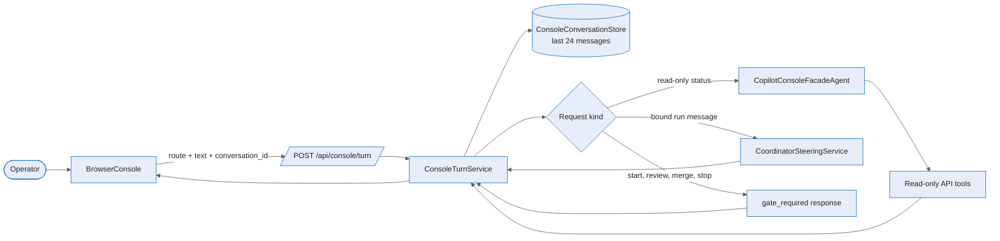

# Browser console — Deep Dive

> ⚠️ **Removed from the UI (#346).** The frontend half of this design (`BrowserConsole.tsx`,
> `ConsolePanelContext`, the LeftNav/top-bar trigger) has been deleted; the Sessions/Assistant
> page is now the sole assistant entry point. The backend facade (`ConsoleTurnService`,
> `CopilotConsoleFacadeAgent`) still exists with no other caller, kept only until a follow-up
> pass confirms it can be deleted outright. This document describes the pre-#346 design.

The browser console is a singleton operator facade for the web app. The browser owns the terminal-style shell, route context, and shortcut commands; the API owns natural-language routing, safe tool execution, and gate surfacing. For the route and DTO contract see the [reference](../reference/browser-console.md); for the user flow see the [experience guide](../experience/browser-console.md).

## Flow

## Shell and context

`BrowserConsole` computes context from the current route: orchestration routes bind both `project_id` and `run_id`, project routes bind `project_id`, and other routes use global scope (`apps/web/src/console/BrowserConsole.tsx:295`). On natural-language submit, the browser posts `message`, `text`, `conversation_id`, and the route context to `apiClient.sendConsoleMessage` (`BrowserConsole.tsx:606`; `apps/web/src/api/client.ts:463`). The shell renders stateful responses as clarification, gate, or error blocks and shows returned links and tool summaries (`BrowserConsole.tsx:361`, `:674`).

`ConsolePanelContext` keeps the panel mounted at the app-shell level, and `ConsoleRouteRedirect` opens the panel then redirects `/console` to `/overview` (`apps/web/src/components/shell/ConsolePanelContext.tsx:1`; `ConsoleRouteRedirect.tsx:1`).

## Backend routing

`ConsoleEndpoints` exposes both `POST /api/console/messages` and `POST /api/console/turn` through the same handler (`apps/Agentweaver.Api/Endpoints/ConsoleEndpoints.cs:63`). It maps console validation errors to the service-selected status code, steering validation to `400`, steering recovery exhaustion to `409`, and provider failures to `401`, `429`, or `503` based on `AgentProviderFailureKind` (`ConsoleEndpoints.cs:24`, `:37`, `:48`, `:70`).

`ConsoleTurnService` normalizes `text`/`message`, creates or reuses a `conversation_id`, resolves the supplied project/run with ownership checks, and rejects a project/run mismatch with `409 context_mismatch` (`apps/Agentweaver.Api/Console/ConsoleTurnService.cs:61`, `:68`, `:77`). It then chooses one of four safe paths:

1. gate-intent words such as confirm, approve, merge, or review return `gate_required` rather than bypassing a human gate (`ConsoleTurnService.cs:93`, `:315`);
2. destructive words such as delete, archive, cancel, or stop return a destructive-action gate (`ConsoleTurnService.cs:96`, `:354`);
3. read-only status/list/show questions run through the Copilot facade (`ConsoleTurnService.cs:105`, `:443`);
4. prose with a bound run is sent as coordinator steering (`ConsoleTurnService.cs:108`, `:278`).

The in-memory `ConsoleConversationStore` keeps the last 24 messages per conversation id (`ConsoleTurnService.cs:22`). That preserves short context for the facade but is intentionally not a durable audit log.

## Facade agent

`CopilotConsoleFacadeAgent` starts a GitHub Copilot MAF session with streaming enabled, a session id derived from the console conversation, session-store persistence disabled, and a read-only tool list from `ConsoleFacadeApiTools.Build` (`packages/Agentweaver.AgentRuntime/ConsoleFacadeAgent.cs:78`). The system addendum tells the model it is the singleton browser console, must ask one focused clarification only when needed, and must not claim to execute budget-consuming, destructive, merge, review, or gate decisions (`ConsoleFacadeAgent.cs:158`).

The available facade tools are status-oriented only: project listing and lookup, project runs, backlog board, run status, coordinator work plan, coordinator children, orchestration topology, blueprints, catalog roles, workflows, decisions, decision inbox, and memory (`ConsoleFacadeAgent.cs:269`). Tool calls use the caller's authorization header when present (`ConsoleFacadeAgent.cs:388`) and return compact completion/failure summaries for display (`ConsoleFacadeAgent.cs:369`).

## Error surface

Provider failures are normalized before reaching the browser. `AgentProviderException` classifies GitHub Copilot auth, rate-limit, model-list, model-unavailable, runtime-not-configured, and transient HTTP failures into `Authorization`, `RateLimited`, `Configuration`, or `ProviderUnavailable`, with a machine-readable error code and user message (`packages/Agentweaver.AgentRuntime/Providers/AgentProviderException.cs:41`). The web helper `formatApiError` maps API status codes into consistent user messages for unauthorized, forbidden, not found, conflict, rate-limited, server, network, and unknown errors (`apps/web/src/api/errors.ts:34`).

## Source

| Concern | File |
|---|---|
| Singleton panel context and redirect | `apps/web/src/components/shell/ConsolePanelContext.tsx`; `ConsoleRouteRedirect.tsx` |
| Browser shell, route binding, submit, rendering | `apps/web/src/console/BrowserConsole.tsx` |
| API client method | `apps/web/src/api/client.ts` |
| Console endpoints and provider status mapping | `apps/Agentweaver.Api/Endpoints/ConsoleEndpoints.cs` |
| Request routing, gates, steering, response builder | `apps/Agentweaver.Api/Console/ConsoleTurnService.cs` |
| MAF-backed facade and safe tools | `packages/Agentweaver.AgentRuntime/ConsoleFacadeAgent.cs` |
| Provider failure classifier | `packages/Agentweaver.AgentRuntime/Providers/AgentProviderException.cs` |
| Web API error formatter | `apps/web/src/api/errors.ts` |

## See also

- [Browser console — Reference](../reference/browser-console.md)
- [Browser console — Experience](../experience/browser-console.md)
- [Coordinator & orchestration](../experience/coordinator-orchestration.md)
- [Coordinator reference](../reference/coordinator.md)
