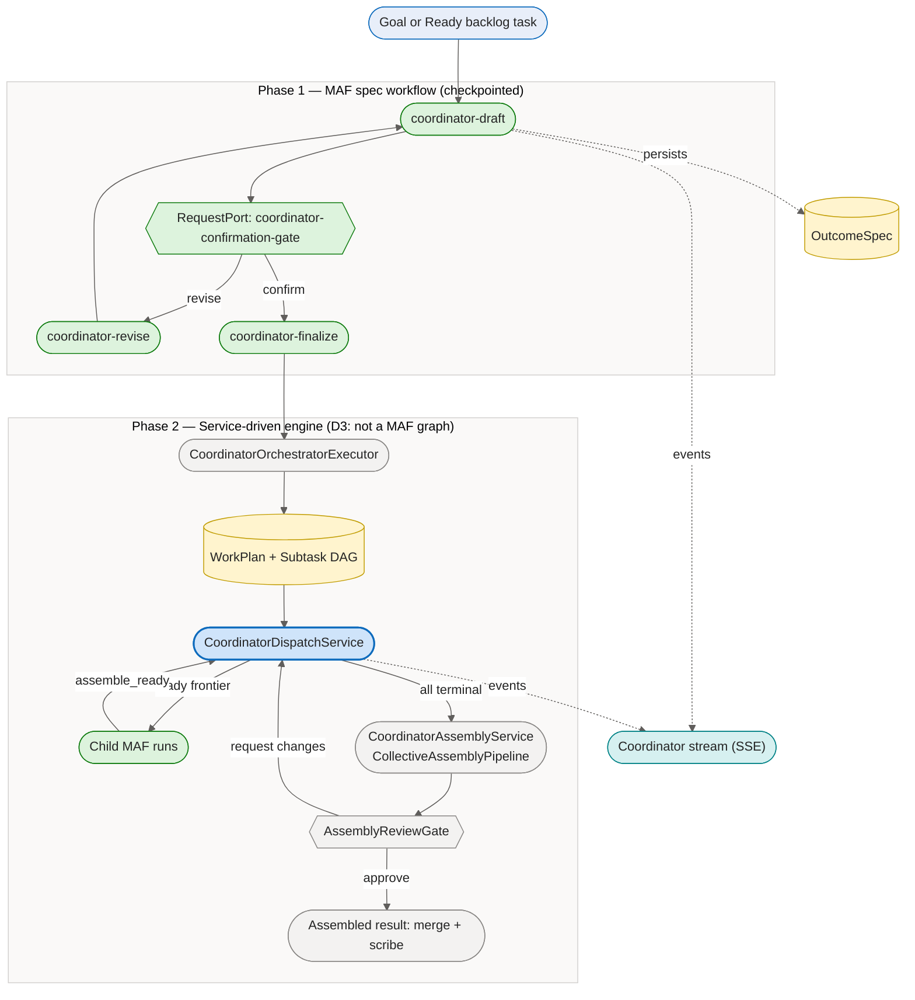
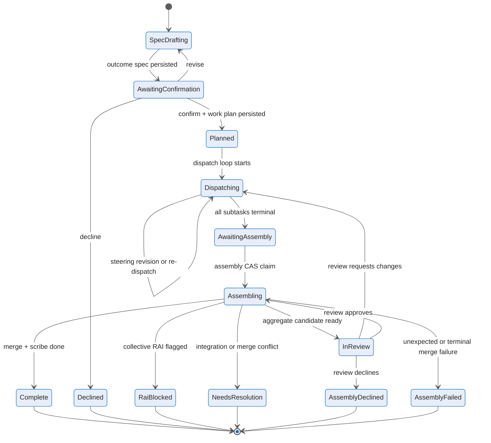
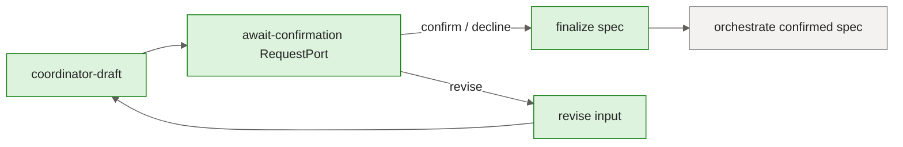
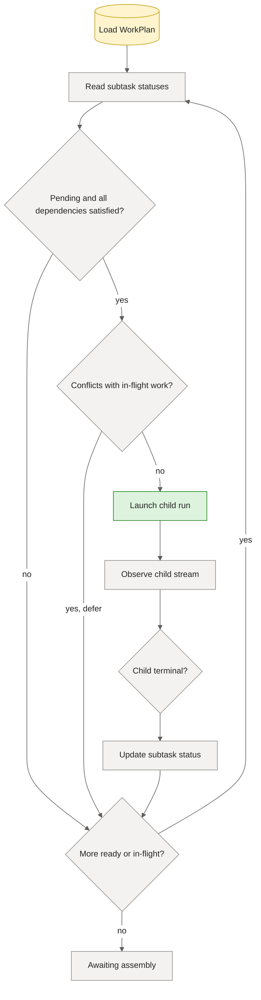
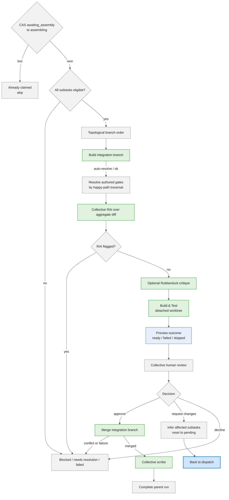

# Coordinator Internals — Conceptual Deep Dive

## Purpose and scope

The orchestration overview explains how a goal moves through Agentweaver at a system level. The focus here is the coordinator itself: the subsystem that turns one broad request into a confirmed intent contract, a dependency-aware work plan, multiple child runs, and one collective result.

The coordinator is best understood as a **durable team manager**. It does not merely ask a model to "do the task." It records what success means, decides how to divide responsibility, starts child workers only when their prerequisites are ready, watches their outcomes, assembles their branches into one candidate result, and routes failure back into retry or terminal states.

Primary scope:

- outcome-spec drafting and confirmation;
- workflow selection and work-plan decomposition;
- subtask dispatch, observation, bubbling, and steering;
- collective assembly, review, merge, and scribe;
- restart recovery and retry semantics.

For the high-level relationship between coordinator orchestration and run workflow orchestration, see [Orchestration Engine — Conceptual Deep Dive](orchestration.md). The sections below assume that overview and go deeper into the coordinator's own internal logic.

## The coordinator mental model

A coordinator run has two personalities:

1. **Model-assisted planner.** It drafts an outcome spec, optionally revises it, selects a workflow shape, and decomposes the confirmed intent into subtasks.
2. **Service-driven supervisor.** After planning, background services drive dispatch and assembly from persisted state. They do not need the planner workflow to stay alive.

That split is the key to rebuilding the subsystem. The model helps create structured intent and plan data. Durable services then advance that data through deterministic state machines.


```mermaid
%%{init: {'theme':'base','themeVariables':{'fontFamily':'Segoe UI, system-ui, -apple-system, sans-serif','fontSize':'15px','primaryColor':'#E8EEF9','primaryBorderColor':'#0F6CBD','primaryTextColor':'#242424','lineColor':'#605E5C','clusterBkg':'#FAF9F8','clusterBorder':'#D2D0CE','edgeLabelBackground':'#FFFFFF'}}}%%
flowchart TB
    Goal(["Goal or Ready backlog task"])

    subgraph P1["Phase 1 — MAF spec workflow (checkpointed)"]
        Draft(["coordinator-draft"])
        CGate{{"RequestPort: coordinator-confirmation-gate"}}
        Revise(["coordinator-revise"])
        Finalize(["coordinator-finalize"])
    end

    Spec[("OutcomeSpec")]

    subgraph P2["Phase 2 — Service-driven engine (D3: not a MAF graph)"]
        Orchestrate(["CoordinatorOrchestratorExecutor"])
        Plan[("WorkPlan + Subtask DAG")]
        Dispatch(["CoordinatorDispatchService"])
        Children(["Child MAF runs"])
        Assembly(["CoordinatorAssemblyService<br/>CollectiveAssemblyPipeline"])
        AGate{{"AssemblyReviewGate"}}
        Result(["Assembled result: merge + scribe"])
    end

    Stream(["Coordinator stream (SSE)"])

    Goal --> Draft --> CGate
    CGate -- revise --> Revise --> Draft
    CGate -- confirm --> Finalize
    Draft -. persists .-> Spec
    Finalize --> Orchestrate --> Plan --> Dispatch
    Dispatch -- ready frontier --> Children
    Children -- assemble_ready --> Dispatch
    Dispatch -- all terminal --> Assembly --> AGate
    AGate -- approve --> Result
    AGate -- request changes --> Dispatch
    Draft -. events .-> Stream
    Dispatch -. events .-> Stream

    classDef client fill:#E8EEF9,stroke:#0F6CBD,stroke-width:1px,color:#242424;
    classDef svc fill:#F3F2F1,stroke:#8A8886,stroke-width:1px,color:#242424;
    classDef core fill:#CFE4FA,stroke:#0F6CBD,stroke-width:2px,color:#242424;
    classDef data fill:#FFF4CE,stroke:#C19C00,stroke-width:1px,color:#242424;
    classDef ext fill:#F0E8F8,stroke:#8764B8,stroke-width:1px,color:#242424;
    classDef runtime fill:#DDF3DD,stroke:#107C10,stroke-width:1px,color:#242424;
    classDef evt fill:#D6F0F0,stroke:#038387,stroke-width:1px,color:#242424;

    class Goal client;
    class Draft,Revise,Finalize,CGate,Children runtime;
    class Spec,Plan data;
    class Orchestrate,Assembly,AGate,Result svc;
    class Dispatch core;
    class Stream evt;
```

The durable artifacts are:

- **Coordinator run** — the parent run visible to clients.
- **OutcomeSpec** — the intent contract.
- **WorkPlan** — the execution contract for the confirmed outcome.
- **Subtask rows and dependency edges** — the dispatch DAG.
- **Child runs** — worker executions tagged with parent run id and subtask id.
- **Coordinator stream events** — the live and replayable explanation of what changed.

## Core invariants

- **Intent is confirmed before execution.** The coordinator can draft and revise, but decomposition is authoritative only after confirmation or unattended confirmation.
- **Plan before dispatch.** Child runs are launched from a persisted WorkPlan, never from transient model text.
- **One parent owns the combined outcome.** Children do agent work; the parent owns the collective RAI pass, review, merge, and scribe.
- **The dependency graph is the hard ordering rule.** A subtask can run only when every dependency is satisfied.
- **`assemble_ready` and `completed` satisfy dependencies.** `failed`, `rai_flagged`, and `blocked` do not; blocked dependents never become ready.
- **Isolation is advisory.** Child subtasks share the orchestration worktree. File-scope declarations and conservative conflict checks reduce clobbering, but the coordinator may still reconcile overlapping edits during collective assembly using a child-wins strategy.
- **Dispatch is single-writer.** The dispatch loop owns subtask status mutation while active.
- **Assembly is exactly-once by database compare-and-swap.** In-memory guards are helpful but not authoritative.
- **Recovery starts from persisted state.** Restart logic routes by WorkPlan status, not by reconstructing chat history.
- **Only terminally ineligible subtasks block assembly.** Pending or still-running children are "not ready yet" and re-arm dispatch; only terminal non-eligible states such as failed/blocked/RAI-flagged produce an `assembly_blocked` verdict (`apps/Agentweaver.Api/Coordinator/AssemblyPlanning.cs:30`, `apps/Agentweaver.Api/Coordinator/CoordinatorAssemblyService.cs:563`).
- **Stale assembly blocks can clear.** If dispatch later observes every subtask eligible, it can advance `assembly_blocked -> awaiting_assembly` so a stale block does not latch forever (`apps/Agentweaver.Api/Coordinator/CoordinatorDispatchService.cs:479`).
- **Provider choice is not dynamic on the live path.** The live coordinator path directly builds Copilot-backed agents; the Foundry dispatcher seam is plumbed but not active here.

## Dispatchable-team guard layers

Coordinator orchestration no longer invents a default worker when a project has no cast team. The guard is layered so every entry point fails visibly instead of starting teamless work:

1. **Interactive start.** `StartCoordinatorRunAsync` calls `CoordinatorRosterGuard.EnsureDispatchableTeam` before the coordinator run row is inserted (`apps/Agentweaver.Api/Coordinator/CoordinatorRunService.cs:111`, `:125`). The project endpoint maps `NoTeamException` to `409 no_team` and `InvalidTeamException` to `422 invalid_team` (`apps/Agentweaver.Api/Endpoints/ProjectEndpoints.cs:486`).
2. **Backlog pickup.** `CoordinatorPickupService` checks the same guard before activating a Ready backlog task. If the roster is absent or unreadable, it atomically reserves a failed coordinator run with result `no_team` or `invalid_team` and returns before any Core Implementer child work can start (`apps/Agentweaver.Api/Coordinator/CoordinatorPickupService.cs:79`, `:106`, `:121`).
3. **Executor defense.** The orchestrator resolves the roster from the same dispatchable-member predicate and fails the coordinator run with `no_team` if no candidate remains, rather than falling back to a fabricated worker (`apps/Agentweaver.Api/Coordinator/CoordinatorOrchestratorExecutor.cs:140`, `:716`). The predicate requires an active member with a role, then rejects Scribe, Ralph, RAI, and Build & Test names/roles (`apps/Agentweaver.Api/Coordinator/CoordinatorRosterGuard.cs:54`, `apps/Agentweaver.Api/Coordinator/CoordinatorOrchestratorExecutor.cs:687`, `:750`).

This preserves the coordinator's model: casting defines who can do work; orchestration only decomposes and assigns work to that real team.

## Coordinator state machine

There are two overlapping state machines: the parent run status and the WorkPlan status. The WorkPlan is the more precise coordinator-internal state after planning.


```mermaid
%%{init: {'theme':'base','themeVariables':{'fontFamily':'Segoe UI, system-ui, -apple-system, sans-serif','fontSize':'15px','primaryColor':'#E8EEF9','primaryBorderColor':'#0F6CBD','primaryTextColor':'#242424','lineColor':'#605E5C','clusterBkg':'#FAF9F8','clusterBorder':'#D2D0CE','edgeLabelBackground':'#FFFFFF'}}}%%
stateDiagram-v2
    [*] --> SpecDrafting
    SpecDrafting --> AwaitingConfirmation: outcome spec persisted
    AwaitingConfirmation --> SpecDrafting: revise
    AwaitingConfirmation --> Declined: decline
    AwaitingConfirmation --> Planned: confirm + work plan persisted

    Planned --> Dispatching: dispatch loop starts
    Dispatching --> AwaitingAssembly: all subtasks terminal
    Dispatching --> Dispatching: child completes and unlocks frontier
    Dispatching --> Dispatching: steering revision or re-dispatch

    AwaitingAssembly --> Assembling: assembly CAS claim
    Assembling --> RaiBlocked: collective RAI flagged
    Assembling --> NeedsResolution: integration or merge conflict
    Assembling --> InReview: aggregate candidate ready
    InReview --> Dispatching: review requests changes
    InReview --> AssemblyDeclined: review declines
    InReview --> Assembling: review approves
    Assembling --> Complete: merge + scribe done
    Assembling --> AssemblyFailed: unexpected or terminal merge failure

    Complete --> [*]
    Declined --> [*]
    RaiBlocked --> [*]
    NeedsResolution --> [*]
    AssemblyDeclined --> [*]
    AssemblyFailed --> [*]
```

`RaiBlocked` and `NeedsResolution` are parked or terminal states. Operators can recover some parked states through steering or full run retry, but the coordinator does not silently continue past them.

## OutcomeSpec drafting logic

### Why the OutcomeSpec exists

The OutcomeSpec prevents every worker from independently interpreting the user's broad request. It turns a goal into a stable contract:

- desired outcome;
- scope and exclusions;
- assumptions;
- material clarifying questions;
- current status: awaiting confirmation, confirmed, or declined.

This contract is stored before the work is decomposed. From that point forward, child workers should treat the spec and their subtask as source of truth rather than reinterpreting the original request.

### How drafting works

The first coordinator phase is a Microsoft Agents Framework workflow:


```mermaid
%%{init: {'theme':'base','themeVariables':{'fontFamily':'Segoe UI, system-ui, -apple-system, sans-serif','fontSize':'15px','primaryColor':'#E8EEF9','primaryBorderColor':'#0F6CBD','primaryTextColor':'#242424','lineColor':'#605E5C','clusterBkg':'#FAF9F8','clusterBorder':'#D2D0CE','edgeLabelBackground':'#FFFFFF'}}}%%
flowchart LR
    Draft[coordinator-draft]
    Gate[await-confirmation RequestPort]
    Finalize[finalize spec]
    Revise[revise input]
    Orchestrate[orchestrate confirmed spec]

    Draft --> Gate
    Gate -- revise --> Revise --> Draft
    Gate -- confirm / decline --> Finalize --> Orchestrate

    classDef client fill:#E8EEF9,stroke:#0F6CBD,stroke-width:1px,color:#242424;
    classDef svc fill:#F3F2F1,stroke:#8A8886,stroke-width:1px,color:#242424;
    classDef core fill:#CFE4FA,stroke:#0F6CBD,stroke-width:2px,color:#242424;
    classDef data fill:#FFF4CE,stroke:#C19C00,stroke-width:1px,color:#242424;
    classDef ext fill:#F0E8F8,stroke:#8764B8,stroke-width:1px,color:#242424;
    classDef runtime fill:#DDF3DD,stroke:#107C10,stroke-width:1px,color:#242424;
    classDef evt fill:#D6F0F0,stroke:#038387,stroke-width:1px,color:#242424;

    class Draft,Gate,Finalize,Revise runtime;
    class Orchestrate svc;
```

The drafting executor compiles team memory and active decisions, resolves the Coordinator charter, and runs a real Copilot coordinator turn. The prompt asks for one JSON object with `desired_outcome`, `scope`, `assumptions`, and `clarifying_questions`.

Important details:

- The human goal and revision feedback are fenced as untrusted data. The model is instructed to restate intent, not obey prompt-injection text inside the goal.
- Drafting streams onto the coordinator run timeline so the UI does not show an empty run while planning happens.
- The parser tolerates extra prose by extracting the first JSON object, but required fields must exist.
- If the model is unavailable or the draft is unparseable, the coordinator run fails visibly. It does **not** fabricate a boilerplate spec.
- Revision overwrites the existing draft in place and re-arms it for confirmation.

### Confirmation paths

Interactive runs suspend at the confirmation gate until a human confirms, revises, or declines.

Backlog pickup runs also go through the same gate. When autopilot is on (`PickupAutopilot: true`, the project default), a bounded `ScheduleUnattendedConfirm` loop fires once the spec reaches `awaiting_confirmation` and confirms it on behalf of the accountable human captured on the backlog item. When autopilot is off, no loop fires — the run stays at `awaiting_confirmation` until the human confirms via the UI. This is not Autopilot bypassing safety: the confirmation is still attributed to the named accountable human, the gate is still enforced, and turning off autopilot simply makes that confirmation explicit instead of automatic. Autopilot also auto-answers child clarifying questions; it does not grant tool approvals, skip the gate for interactive runs, or skip collective human review.

There is a small ordering race between "the spec was persisted and emitted" and "the framework request port is armed." The resume seam handles this by waiting briefly for the pending gate while the spec remains `awaiting_confirmation`, preserving double-submit protection without rejecting a fast confirm.

The web gate mirrors that race tolerance without hiding the safety state. `OutcomeSpecPanel` treats an early `404` from `GET /api/runs/{id}/outcome-spec` as "draft not persisted yet", keeps the panel visible in **Drafting**, and polls every two seconds until REST or SSE supplies the spec. If the run reaches a failure/decline terminal status before content exists, it shows a terminal drafting error (`apps/web/src/components/OutcomeSpecPanel.tsx:160`, `:233`, `:328`, `:401`, `:537`). The confirm button has both React state and a synchronous ref guard, disables confirm/revise while submitting, shows **Confirming...**, retries only `409 no_pending_gate`, refreshes the snapshot on 409, and surfaces non-active conflicts instead of allowing duplicate confirmation attempts (`OutcomeSpecPanel.tsx:237`, `:338`, `:345`, `:360`, `:578`).

## Workflow selection and WorkPlan decomposition

### Workflow selection as shape guidance

After confirmation, the coordinator selects the workflow shape the work should follow. This is `CoordinatorOrchestratorExecutor.SelectWorkflowAsync`, and its defining property is **deterministic-first**: hard, cheap rules collapse the candidate space, and an LLM is consulted only when more than one workflow genuinely fits and no human has already named one.

1. `WorkflowRegistry.ResolveDefault(project)` resolves the project default first. It is both the selector's deterministic fallback (placed first in the candidate list) and the explicit value `SelectWorkflowAsync` returns if any step throws.
2. `WorkflowRegistry.GetOrLoad(project).Available` is ordered default-first, then by id.
3. `ResolveInvocationKindAsync` maps the run's origin to a `WorkflowInvocationKind`: `RunOrigin.BacklogPickup` becomes `Heartbeat`; everything else (and any lookup failure) becomes `Manual`.
4. A request-level dialog override (`CoordinatorDraftInput.WorkflowOverrideId`, sourced from `StartOrchestrationRequest.workflow_override_id`) is checked first. If absent, a backlog-task pin (`BacklogTask.WorkflowOverrideId`, via `ResolveWorkflowOverrideIdAsync`) is checked next. Either override short-circuits selection, but only when the workflow exists **and** `WorkflowTriggerEvaluator.IsEligible` accepts it for the invocation; otherwise the mismatch is logged and selection continues.
5. `WorkflowTriggerEvaluator.IsEligible` filters the candidates by trigger. This is a hard boundary applied **before** any model call — a manual run never selects a heartbeat/event workflow and a heartbeat pickup never selects a manual-only one.
6. Zero eligible candidates → return the project default rather than a trigger-mismatched workflow.
7. Exactly one eligible candidate → use it directly, with **no model call and no selection event** (the common, single-workflow project case stays silent and free).
8. Two or more eligible candidates → build a `WorkflowSelectionContext` and resolve the pick. An explicit `use {workflow-id}` in the revise feedback (`WorkflowSelector.TryParseOverride`) wins outright; otherwise the Copilot-backed `WorkflowSelector.SelectAsync` chooses by process fit.

The LLM is therefore consulted in exactly one situation: **2+ trigger-eligible workflows and no explicit override**. `WorkflowSelector.SelectAsync` itself is conservative — it short-circuits to the default when only one workflow is present, and any model failure, unparseable JSON, or unknown id (`CopilotWorkflowSelectionModel` returns `null` on failure) falls back to the first candidate, the project default. Failures are never silently swallowed: every multi-candidate resolution emits a `coordinator.workflow_selected` event (`EmitWorkflowSelectedEvent`) carrying the chosen id, a rationale, `wasAutoSelected`, an `overrideHint`, and the available set; and a thrown `SelectWorkflowAsync` logs a warning and returns the resolved default so the caller always knows what it is planning against.

The selected workflow is not just recorded for display. It becomes prompt context for decomposition so the resulting subtask graph mirrors the intended process shape. The run workflow factory resolves the effective workflow again at graph-build time, so a stale planning pick can never become unchecked execution.

### Decomposition strategy

The decomposition turn asks for the **minimum set of independently dispatchable subtasks**. Each subtask must include:

- title;
- exact scope, including files or outputs it owns;
- role id, preferably from the active roster;
- optional bespoke charter when no roster/catalog role fits;
- complexity;
- phase;
- advisory isolation hint;
- 1-based dependency indices.

The prompt pushes the model toward few, bounded subtasks and explicit dependency edges. It also asks parallel file-producing subtasks to write unique outputs, then add a consolidation subtask when parallel research needs synthesis.

The decomposition turn is grounded in:

- the confirmed OutcomeSpec;
- the selected workflow summary;
- active roster roles;
- relevant architectural and scope decisions;
- coordinator memory/session context.

The same prompt-injection rule applies: spec fields are fenced and treated as data.

### Defensive parsing and normalization

The WorkPlan builder assumes model output can be malformed and normalizes aggressively:

- extract the first JSON array;
- try a trailing-comma repair;
- skip invalid items rather than failing the whole array;
- require title and scope;
- rebase dependencies after skipped items;
- drop self-references and out-of-range dependencies;
- normalize complexity to low/medium/high;
- normalize phase to none/planning/execution/validation;
- default isolation to worktree;
- default role to core implementer;
- trim optional bespoke charters.

If no valid decomposition is available, the coordinator falls back to one deterministic execution subtask covering the whole confirmed outcome. This keeps the pipeline operational offline, unlike OutcomeSpec drafting where unparseable output fails visibly.

### DAG repair

The dependency graph must be acyclic. If the model creates a cycle, the coordinator traverses dependencies in stable order and drops the back-edge that closes the cycle. It records a note in the plan's isolation summary rather than dispatching a deadlocked graph.

This is a pragmatic trade-off: it preserves progress for most accidental cycles while treating the removed edge as lower confidence than the rest of the ordering constraint. A stricter rebuild can fail and ask for clarification instead.

### Assignment and model selection

Subtasks are assigned to active, dispatchable roster members. Built-in infrastructure agents such as Scribe and RAI are excluded. Role matching scores exact role/title matches, token overlap across capabilities and responsibilities, and phase affinity.

Model selection is fixed to GitHub Copilot on this path:

1. high-complexity subtasks can use the coordinator run's explicit model override;
2. otherwise use the assigned role's default model;
3. otherwise use a catalog role default;
4. otherwise use the run override;
5. otherwise use the configured Copilot default.

The persisted WorkPlan starts as `planned`, with subtasks in `pending` and dependency edges persisted by database ids.

## Dispatch and child tracking

### Ready frontier

Dispatch repeatedly computes the ready frontier:


```mermaid
%%{init: {'theme':'base','themeVariables':{'fontFamily':'Segoe UI, system-ui, -apple-system, sans-serif','fontSize':'15px','primaryColor':'#E8EEF9','primaryBorderColor':'#0F6CBD','primaryTextColor':'#242424','lineColor':'#605E5C','clusterBkg':'#FAF9F8','clusterBorder':'#D2D0CE','edgeLabelBackground':'#FFFFFF'}}}%%
flowchart TD
    Load[(Load WorkPlan)]
    Status[Read subtask statuses]
    Ready{Pending and all dependencies satisfied?}
    Conflict{Conflicts with in-flight work?}
    Launch[Launch child run]
    Observe[Observe child stream]
    Terminal{Child terminal?}
    Update[Update subtask status]
    More{More ready or in-flight?}
    Assembly[Awaiting assembly]

    Load --> Status --> Ready
    Ready -- no --> More
    Ready -- yes --> Conflict
    Conflict -- yes, defer --> More
    Conflict -- no --> Launch --> Observe --> Terminal --> Update --> More
    More -- yes --> Status
    More -- no --> Assembly

    classDef client fill:#E8EEF9,stroke:#0F6CBD,stroke-width:1px,color:#242424;
    classDef svc fill:#F3F2F1,stroke:#8A8886,stroke-width:1px,color:#242424;
    classDef core fill:#CFE4FA,stroke:#0F6CBD,stroke-width:2px,color:#242424;
    classDef data fill:#FFF4CE,stroke:#C19C00,stroke-width:1px,color:#242424;
    classDef ext fill:#F0E8F8,stroke:#8764B8,stroke-width:1px,color:#242424;
    classDef runtime fill:#DDF3DD,stroke:#107C10,stroke-width:1px,color:#242424;
    classDef evt fill:#D6F0F0,stroke:#038387,stroke-width:1px,color:#242424;

    class Load data;
    class Status,Ready,Conflict,Observe,Terminal,Update,More,Assembly svc;
    class Launch runtime;
```

Only `assemble_ready` and `completed` satisfy dependencies. A failed or RAI-flagged dependency fails its still-pending dependents with recovery guidance, because serial dependents cannot safely proceed from a bad prerequisite.

### Distributed pod lease on `dispatching` plans

`Dispatching` is a **distributed single-writer section** now, not just an in-memory one. The
`WorkPlan` row carries `CoordinatorPodId`, which stores the pod/hostname currently holding the
dispatch lease for that plan.

When a pod starts dispatch — or re-arms a previously orphaned dispatch loop — it first claims the
lease by atomically updating the `WorkPlan` row (`ExecuteUpdateAsync`) to stamp
`CoordinatorPodId = <this pod>` and refresh `UpdatedAt`. Only the replica whose conditional UPDATE
actually affects the row proceeds to `StartDispatch`.

This was needed because the old reconciler relied on each process's local `IsDispatchActive`
dictionary. In a multi-replica deployment, the Worker pod could have an active dispatch loop that
API replicas could not see, so every replica sweeping "orphaned" `dispatching` plans could re-arm
the same coordinator independently.

The reconciler now checks two things before trying to steal a plan:

- if another pod owns `CoordinatorPodId` **and** that claim is still fresh, it skips the plan; and
- if the claim is missing or stale, it tries one conditional UPDATE to take ownership.

A lease is considered stale after `Coordinator:PodLeaseStaleTtlSeconds` (default **60 s**). In
practice that means a healthy owner keeps the plan by touching `UpdatedAt`, while another replica
may recover the work if the owner dies and stops refreshing the row.

### Shared worktree conflict control

Child subtasks share one orchestration worktree. `IsolationStrategy` helps communicate intent, but it is not an enforced sandbox.

The dispatcher therefore adds two conservative safeguards:

- If multiple subtasks declare the same output file token, it serializes them by adding dependency edges.
- While a child is in flight, another ready subtask is deferred if their declared file tokens overlap. If either side declares no file tokens, they are assumed to conflict.

This favors correctness over maximum parallelism. A poorly scoped subtask may reduce parallelism, but it is less likely to clobber sibling work.

### Dispatch lock contention on the dependency base branch

When dispatch rebuilds the dependency-base integration branch for downstream subtasks, it treats git ref-lock contention as a transient recovery case rather than a fatal orchestration fault. If LibGit2Sharp throws a locked-file error, the dispatcher asks `WorktreeManager` to best-effort delete stale `.git/refs/heads/{branch}.lock` and `.git/packed-refs.lock` files, then retries up to three times with a short linear backoff.

This path exists for crashed or interrupted prior processes that left a stale lock behind. If the retry still fails, dispatch logs the problem and continues without refreshing that dependency base branch, instead of crashing the whole coordinator loop.

### Child run construction

For each dispatched subtask, the coordinator creates a child run with:

- `ParentRunId` set to the coordinator run;
- `SubtaskId` set to the subtask id;
- assigned agent and selected model from the WorkPlan;
- `ModelSource = GitHubCopilot`;
- inherited run options such as auto-approve-tools and Autopilot;
- scoped approval inheritance for that project/run/subtask.

The child task includes the subtask title/scope, any recovery guidance, the parent OutcomeSpec, dependency summaries, and completed sibling outputs. That gives workers enough local context without asking them to rediscover the entire plan.

Child runs use the trimmed child workflow. They produce work and pass child-level safety checks, then stop at the assemble-ready boundary. They do not each perform human review, merge, or scribe.
In production, the Worker executes those child agent turns in `pod-per-run` mode, so the live agent
session runs inside a dedicated AgentHost pod rather than in-process on the Worker.

### Observation and bubbling

The dispatch loop observes child runs through the durable run event stream. It replays the events already recorded for each child run and then tails new ones as they arrive, so the coordinator sees a complete, ordered history regardless of when it begins observing. This replay-then-tail model means observation is resumable: a coordinator that restarts can reconstruct child progress from the stream rather than depending on in-memory state.

Terminal child events map to coordinator outcomes:

- `run.assemble_ready` maps to `assemble_ready`, unless safety was flagged;
- content-safety failures map to `rai_flagged`;
- completed no-change runs map to `completed`;
- failed, declined, cancelled, and merge-failed child states map to `failed`.

Mid-run child questions and tool approval requests are re-emitted on the coordinator stream with child run id, subtask id, and request id. Autopilot may answer bubbled **questions** by running a one-shot Copilot coordinator turn grounded in the OutcomeSpec and subtask. Tool approvals remain separate and are not auto-granted by Autopilot.

Observation includes stall handling. If a child emits no events within `Coordinator:SubtaskStallTimeoutMinutes` (default five minutes), the coordinator emits `coordinator.child_stall_detected`, persists any partial-output checkpoint it saw, fails the stalled child subtask with recovery guidance, and increments the recovery-attempt counter.

An unresolved tool-approval gate is exempt from that stall timer (issue #212). While a child's most recent interaction is a `tool.approval_required` that has not resolved — with only `tool.approval_pending` heartbeats (every ~20s) following — the watcher records the pending `requestId` and treats the child as a legitimate human-paced wait, logging and continuing to observe instead of firing `agent_stall_timeout`. The exemption self-heals and cannot latch: any other real event (`tool.result` on grant, `tool.error` on deny/expiry, `tool.approval_resolved`, agent output, or a terminal event) clears the flag, so a pod that genuinely hangs after a gate self-expires is still caught. The guard also protects gate sites that emit no heartbeat, such as the preview gate (`AgentPreviewGate.RequestApprovalAsync`). See the [Tool Approval SSE Contract](../tool-approval-sse-contract.md#stall-resilience-coordinator-approval-gate-guard-212).

Pending dependents of that stalled prerequisite do not become runnable. Instead, the dispatcher marks them `blocked`: a terminal, assembly-ineligible status that does not satisfy dependencies and means "this subtask never ran because an upstream dependency stalled." That distinction matters operationally: the stalled child owns the failure, while the blocked dependents record the cascade.

### Topology emission and pod registry projection

Each phase transition and subtask state change emits a `coordinator.topology` event on the coordinator stream. The event is either a **snapshot** (full node list + edges, `seq: 0`) or a **delta** (`seq > 0`, changed nodes only). Edges are emitted only in the snapshot and never change after the work plan is confirmed.

`CoordinatorTopology.BuildSnapshot` and `CoordinatorTopology.SubtaskNode` are the two emission helpers (`apps/Agentweaver.Api/Coordinator/CoordinatorTopology.cs`). Both accept an `IPodNameRegistry?` to populate `executionPodName` per subtask node:

- **Subtask node** — `executionPodName` is set to the Kubernetes pod name registered under the subtask's `childRunId` in `IPodNameRegistry`. `null` when the subtask has not been dispatched yet or the pod binding has not been recorded.
- **Coordinator node** — `executionPodName` is set to the Kubernetes pod name of the API process itself (passed as `coordinatorPodName`, sourced from `IKubernetesEnvironment.PodName`). `null` when running outside Kubernetes.

The frontend renders a pod chip on a node only when `executionPodName` is non-null. It does not fall back to the API pod name for child or intermediate nodes. This means a subtask that has not yet been bound to a pod shows no chip — which is accurate, not misleading.

`IKubernetesEnvironment.PodName` returns `Environment.MachineName` inside a Kubernetes cluster (the pod hostname equals the pod name in a default deployment) and `null` otherwise (`apps/Agentweaver.Api/Infrastructure/KubernetesEnvironment.cs`).

## Collective assembly

When all subtasks settle, dispatch moves the WorkPlan to `awaiting_assembly` and hands off to the assembly service. Assembly is service-driven rather than a MAF workflow because it starts from already-produced git state, has a coordinator-owned review gate, and routes review changes back to re-dispatch rather than back to one model turn.


```mermaid
%%{init: {'theme':'base','themeVariables':{'fontFamily':'Segoe UI, system-ui, -apple-system, sans-serif','fontSize':'15px','primaryColor':'#E8EEF9','primaryBorderColor':'#0F6CBD','primaryTextColor':'#242424','lineColor':'#605E5C','clusterBkg':'#FAF9F8','clusterBorder':'#D2D0CE','edgeLabelBackground':'#FFFFFF'}}}%%
flowchart TD
    Claim{CAS awaiting_assembly<br/>to assembling}
    Eligible{All subtasks eligible?}
    Order[Topological branch order]
    Integration[Build integration branch]
    GateOrder[Resolve authored gates
by happy-path traversal]
    Rai[Collective RAI over aggregate diff]
    RaiFlag{RAI flagged?}
    Rubberduck[Optional Rubberduck critique]
    BuildTest[Build & Test
detached worktree]
    Preview[Preview outcome
ready / failed / skipped]
    Review[Collective human review]
    Decision{Decision}
    Merge[Merge integration branch]
    Scribe[Collective scribe]
    Complete[Complete parent run]
    RequestChanges[Infer affected subtasks<br/>reset to pending]
    AlreadyClaimed[Already claimed<br/>skip]
    Blocked[Blocked / needs resolution / failed]

    Claim -- lost --> AlreadyClaimed
    Claim -- won --> Eligible
    Eligible -- no --> Blocked
    Eligible -- yes --> Order --> Integration
    Integration -- auto-resolve / ok --> GateOrder --> Rai --> RaiFlag
    RaiFlag -- yes --> Blocked
    RaiFlag -- no --> Rubberduck --> BuildTest --> Preview --> Review --> Decision
    Decision -- approve --> Merge
    Decision -- request changes --> RequestChanges
    Decision -- decline --> Blocked
    Merge -- conflict or failure --> Blocked
    Merge -- merged --> Scribe --> Complete
    RequestChanges --> Dispatching[Back to dispatch]

    classDef client fill:#E8EEF9,stroke:#0F6CBD,stroke-width:1px,color:#242424;
    classDef svc fill:#F3F2F1,stroke:#8A8886,stroke-width:1px,color:#242424;
    classDef core fill:#CFE4FA,stroke:#0F6CBD,stroke-width:2px,color:#242424;
    classDef data fill:#FFF4CE,stroke:#C19C00,stroke-width:1px,color:#242424;
    classDef ext fill:#F0E8F8,stroke:#8764B8,stroke-width:1px,color:#242424;
    classDef runtime fill:#DDF3DD,stroke:#107C10,stroke-width:1px,color:#242424;
    classDef evt fill:#D6F0F0,stroke:#038387,stroke-width:1px,color:#242424;

    class Claim,Eligible,Order,GateOrder,RaiFlag,Review,Decision,Complete,RequestChanges,AlreadyClaimed,Blocked svc;
    class Integration,Rai,Rubberduck,BuildTest,Merge,Scribe runtime;
    class Dispatching core;
```

### Exactly-once claim

Assembly starts with a database compare-and-swap from `awaiting_assembly` to `assembling`, stamping the integration branch. Only the winner proceeds. This is the authoritative exactly-once guard across dispatch completion, recovery, and review-triggered re-dispatch.

### Authored assembly gates

After the integration branch is built, the coordinator resolves assembly gates from the selected workflow's happy path rather than from YAML node declaration order. It breadth-first traverses from `start`, following unconditional edges plus `approved`, `pass`, and `review` verdict edges, then runs matching gates in that traversal order (`apps/Agentweaver.Api/Coordinator/CoordinatorAssemblyService.cs:1121`, `:1164`, `:1190`).

Known assembly gates are `rai`, `rubberduck`, `build-test`, and `human-review`; `build_test` workflow nodes normalize to `build-test` (`CoordinatorAssemblyService.cs:1128`). The built-in software workflows now put RAI before Build & Test on the approval path: bug fix runs RAI -> Build & Test -> Human Review, while software delivery runs RAI -> Rubberduck -> Code Review -> Build & Test -> Human Review.

Build & Test is a platform gate, not a human action. The assembly service emits `coordinator.assembly_review_requested` with `gateKind: "build-test"`, creates a detached worktree from the integration branch, runs the build/test verdict turn, and routes its verdict before the human-review gate (`CoordinatorAssemblyService.cs:671`, `apps/Agentweaver.Api/Git/WorktreeManager.cs:155`). In `pod-per-run` mode, the pipeline launches a dedicated AgentHost pod bound to the coordinator run id and passes the detached worktree path as the working-directory override (`apps/Agentweaver.Api/Coordinator/CollectiveAssemblyPipeline.cs:155`, `apps/Agentweaver.Api/Sandbox/IAgentHostPodLifecycle.cs:30`). `/configure` then sets the AgentHost working directory/file-tool root to that path before the first turn (`apps/Agentweaver.Api/Sandbox/KubernetesSandboxExecutor.cs:300`, `:423`). This gives the automated gate a routable A2A endpoint and a stable pod for the later deterministic preview step. Because that detached worktree uses the `git` CLI (`WorktreeManager.cs:546`), the API runtime image installs `git` alongside `libgit2` (`apps/Agentweaver.Api/Dockerfile:58`).

Preview is decoupled from the Build & Test model verdict. After `RunBuildTestAsync` returns, `PreviewStep.RunAsync` runs for approved or request-changes verdicts and skips only declined verdicts (`CoordinatorAssemblyService.cs:753`). It is deterministic and platform-owned: `PreviewCommandResolver` finds a command, the API calls AgentHost `/preview-runner/*`, AgentHost observes the actual bound port, and the API registers the Gateway preview with that observed port (`apps/Agentweaver.Api/Coordinator/Preview/PreviewStep.cs:70`, `apps/Agentweaver.Api/Sandbox/Preview/PreviewCommandResolver.cs:25`, `apps/Agentweaver.Api/Sandbox/Preview/PreviewRunnerHttpClient.cs:78`).

Preview failure is deliberately non-blocking. `PreviewStep` emits `sandbox.preview_ready`, `sandbox.preview_failed`, or `sandbox.preview_skipped_not_applicable` as the terminal preview outcome, and any failure still lets human review proceed (`PreviewStep.cs:229`, `:258`, `:272`). The old approval-time guard remains a safety net: if no final outcome exists, it emits `sandbox.preview_failed` with `reason: "preview_outcome_missing"` rather than resetting and redispatching subtasks (`CoordinatorAssemblyService.cs:2455`). See [Decoupled live-preview provisioning](./live-preview-provisioning.md).

Automated gate request-changes now route through unified steering rather than a hidden reset-and-redispatch reflex. `RouteAssemblyGateThroughSteeringAsync` emits `coordinator.steering_received`, invokes the coordinator decider inline, and emits `coordinator.steering_decision` before executing the chosen action (`apps/Agentweaver.Api/Coordinator/CoordinatorAssemblyService.cs:1680`). A decision can steer in place, dispatch fresh, proceed/terminal, or record an advisory no-op. Fresh dispatch is the only path that resets subtasks, and it is visible before the reset. In-place revision failures now terminalize visibly (`run.failed` reason `child_executor_failed:{executor}` plus failed `workflow.step`) and then fall back through a conscious `dispatch_fresh` decision when needed, so assembly does not silently wedge. See [Unified autonomous steering](./unified-steering.md).

### Eligibility gate

The coordinator does no partial assembly. Every subtask must be `assemble_ready` or `completed`.

- `assemble_ready` means the child produced changes to assemble.
- `completed` means the child completed with no mergeable changes; this is an eligible no-op.
- `failed`, `rai_flagged`, and still-running statuses block the whole plan.

### Integration branch

Eligible child branches are merged into one integration branch in dependency order. Completed no-op children are eligible but contribute no branch. If a merge conflict appears while adding one child branch, the coordinator currently auto-resolves it by accepting that child's version for every conflicting path, emits `coordinator.integration_conflict_auto_resolved`, and continues with the remaining children. This means an agent modifying a file outside its primary output scope is acceptable: the parent coordinator reconciles the overlap with a child-wins strategy rather than blocking assembly. A future follow-up should distinguish this safe case from true sibling-vs-sibling conflicts and surface those as `needs_resolution`.

### Collective RAI

The production pipeline reuses the existing RAI executor over the aggregate diff. A collective RAI safety flag is a hard stop: the WorkPlan is marked `rai_blocked`, the coordinator run is failed, and a human override/recovery path is required.

### Build & Test infrastructure classification

Build/test code feedback and sandbox infrastructure failures take different paths. A `request-changes`
decision from the Build & Test agent is authored feedback and uses normal redispatch routing.
Infrastructure failures are classified before that verdict layer: capacity pending, launch failure, missing
pod IP, missing A2A endpoint, and A2A transport errors become `build_test_infra_*` reasons
(`CollectiveAssemblyPipeline.cs:174`, `:252`; `KubernetesPodAgentEndpointResolver.cs:103`, `:177`;
`RemoteAgentProxy.cs:119`, `:243`). Retryable cases park the plan as `assembly_blocked` so the reconciler
can re-arm it; non-retryable configuration errors mark `assembly_failed` and terminalize the coordinator
(`CoordinatorAssemblyService.cs:1567`, `CoordinatorReconciler.cs:267`). The emitted diagnostic payloads
carry `detail`, `exceptionMessage`, `innerExceptionMessage`, `innerExceptionType`, and
`infrastructureReason`, so operators can see the actual AgentHost launch or transport root cause rather
than only `build_test_infra_agenthost_launch_failed` (`CoordinatorAssemblyService.cs:1590`, `:1604`,
`:1648`). These events are persisted even when they are appended around terminalization because the run
event stream writes late appends before checking completed-run state (`SqliteRunEventStream.cs:81`,
`EfRunEventStream.cs:64`). They no longer masquerade as `REQUEST_CHANGES`, so they do not create a
redispatch loop that keeps asking workers to fix unavailable infrastructure.

### One collective review

The human reviews the combined integration result once. The gate is an in-memory, owner-scoped task keyed by coordinator run id. It is at-most-once: double submissions find no armed gate after the decision is consumed.

Review decisions:

- **Approve** — proceed to one collective merge.
- **Request changes** — submit unified steering feedback to the coordinator. The coordinator chooses in-place steering, fresh dispatch, proceed/terminal, or advisory no-op.
- **Decline** — mark assembly declined and terminalize the coordinator run.
- **Timeout/cancel** — leave recoverable or mark failed depending on path.

### Request-changes routing

The assembly Build & Test pod, detached worktree, and any Gateway preview are intentionally retained while
the run waits at human review, so reviewers can open the preview URL against the exact assembled tree. They
are also retained across automated Build & Test / Rubberduck request-changes redispatches, which preserves
context and avoids a second-pass AgentHost relaunch failure class. Cleanup still runs on terminal outcomes,
and it still runs before non-automated request-changes redispatches where the old review context should be
discarded (`CoordinatorAssemblyService.cs:1536`, `:1548`, `:1869`, `:1918`). `AgentHostReaperService`
treats `AwaitingReview` as active, so review/preview AgentHost claims are not reaped during that window
(`apps/Agentweaver.Api/Sandbox/AgentHostReaperService.cs:86`, `:102`).

When the reviewer requests changes, the coordinator tries to avoid redoing everything:

1. Combine explicit target files with path-like tokens parsed from feedback.
2. Match those files against files touched by each child diff.
3. Select directly matched subtasks.
4. Add every transitive dependent of those subtasks.
5. If no files can be inferred or no child matches, fall back to all subtasks.

Selected subtasks are reset to `pending` with recovery guidance containing the review feedback. Other completed subtasks remain intact. The WorkPlan returns to `dispatching`, and the dispatch loop re-runs the affected frontier. After those children finish, assembly starts again from `awaiting_assembly`.

### Merge, scribe, and decision promotion

Approval triggers one merge of the integration branch into the originating branch, serialized by the repository merge lock. Merge conflicts become needs-resolution. Non-conflict merge failures become assembly failures.

After a successful merge, the coordinator runs one collective Scribe pass. Scribe is best-effort: failure is visible but does not fail the already-merged assembly. The coordinator then promotes pending architectural and scope decisions created by the coordinator during the run, marks the WorkPlan complete, terminalizes the parent run, persists stream events, and completes the stream.

## Recovery and retry semantics

The coordinator assumes in-memory drivers can disappear. Recovery routes by durable WorkPlan state.

| Durable state | Recovery action |
|---|---|
| No WorkPlan | Resume the checkpointed spec draft/confirmation workflow. |
| WorkPlan with no subtasks | Finalize the coordinator run from the spec status. |
| `planned` or `dispatching` | Reset in-flight subtasks to pending and re-arm dispatch. |
| `awaiting_assembly` | Re-arm assembly; the CAS decides the winner. |
| `assembling` or `in_review` | Reset to `awaiting_assembly` and re-run assembly to recreate the assembly driver and review gate. Deferred review decisions submitted to a non-owner replica are durable and are consumed by the owner driver after the gate is re-armed. |
| `complete` | Settle the coordinator run as completed if it was still in progress. |
| blocked/failed/declined assembly states | Settle the coordinator run as failed or declined with the recorded reason. |

The heartbeat also runs a reconciler. It scans for orphaned dispatching, awaiting-assembly, and
assembling plans whose in-memory loop is gone, recreates the coordinator stream if needed, and
re-arms the correct service. For `dispatching` plans it honors the distributed `CoordinatorPodId`
lease first, skipping freshly owned plans and stealing only stale ones. Each candidate is isolated
by try/catch so one corrupt plan does not stop the sweep.

### Bounded final-Scribe recovery

At startup, recovery checks terminal coordinator runs for a missing final Scribe. It skips runs that
already have a Completed or InProgress Scribe child, and stops retrying after the configured number
of Failed attempts. Per-run admission prevents duplicate local launches, while a `SemaphoreSlim`
bounds concurrent in-process Scribe pipelines.

| Configuration key | Default | Effect |
|---|---:|---|
| `Coordinator:FinalScribeMaxConcurrency` | `2` | Maximum final-Scribe recovery pipelines admitted concurrently in this process; values below `1` are floored to `1`. |
| `Coordinator:FinalScribeMaxAttempts` | `3` | Maximum Failed final-Scribe child attempts before recovery stops admitting another attempt; values below `1` are floored to `1`. |

### Reaper as the 3rd heartbeat phase

`CoordinatorHeartbeatService` drives three phases per tick:

1. **Backlog pickup** — claim Ready tasks and start coordinator runs.
2. **Work-plan reconciliation** — re-arm orphaned dispatching/assembly plans.
3. **Agent-host pod reaper** — invoke `AgentHostReaperService` to sweep and terminate orphaned agent-host pods.

The reaper phase runs every `Coordinator:ReaperIntervalTicks` ticks (default **12**, i.e. roughly every 2 minutes at the default interval). This is intentionally coarser than the heartbeat cadence; the reaper lists all pods in the namespace each sweep, so running it on every tick would be excessive.

The reaper is the last line of defense against quota leakage. The normal dispatch paths call `ReleaseAgentHostPodAsync` on all stall-fail and cancellation paths first; the reaper terminates any pod that slips through.

### Automation name in tick records

Each heartbeat tick carries an **automation name** string that identifies which background automation produced the record. `HeartbeatStatusStore.TickRecord` and `RecordTickOutcome` include an `AutomationName` property (e.g. `"Coordinator Heartbeat"`, `"Checkpoint GC"`). The `HeartbeatStatusDto.TickRecordDto` exposes this as the `automation_name` field in the API response.

The frontend **Heartbeat** page shows **Automation** as the first column in the **Recent Activity** table, so operators can distinguish which automation ran on each tick at a glance.

```json
{
  "tick_records": [
    {
      "automation_name": "Coordinator Heartbeat",
      "acted_count": 2,
      "error_count": 0,
      "duration_ms": 340,
      "recorded_at": "2026-06-27T18:00:00Z"
    },
    {
      "automation_name": "Checkpoint GC",
      "acted_count": 0,
      "error_count": 0,
      "duration_ms": 12,
      "recorded_at": "2026-06-27T17:59:50Z"
    }
  ]
}
```

### Failure containment

Several paths intentionally convert ambiguous failure into durable, inspectable state:

- Child start failure creates a terminal failed child run before marking the subtask failed, so embedded child-run inspection has a durable record to render.
- Orphaned/stalled children are failed after the stall TTL instead of being observed forever, and the coordinator emits `coordinator.child_stall_detected`.
- Pending dependents of a failed prerequisite are failed with recovery guidance; pending dependents of a stalled prerequisite are marked `blocked`.
- Unexpected assembly exceptions mark the WorkPlan failed, emit a human-readable assembly failure, terminalize the run, and complete/persist the stream.
- Corrupt reconciler candidates are marked failed rather than retried endlessly.
- Steering recovery is capped per subtask to avoid infinite auto-resume loops.

### Steering and operator recovery

Steering is the live control surface:

- **send** records an informational nudge and changes no state.
- **stop** cancels active child workflows and can terminalize the coordinator on broadcast stop.
- **redirect** and **amend** queue instructions for a child's next turn boundary.
- A targeted redirect can force-complete a stuck child stream so the dispatch loop reaches a boundary and applies the directive.
- For parked coordinators, redirect/amend can reset affected subtasks to pending, reopen the coordinator stream, un-terminalize the run when appropriate, and re-arm dispatch.

The semantics are deliberately "honest": there is no mid-token or mid-tool magical pause. Direction changes apply at turn boundaries or through explicit cancellation/re-dispatch.

### Retrying a pickup run

Retrying a failed backlog-pickup coordinator creates a fresh parent run with `RetriedFrom` pointing to the source run and preserves the durable backlog-pickup origin and accountable human. It does not silently re-claim or duplicate the backlog task.

## CopilotAIAgent vs AgentRunnerDispatcher

The live coordinator path is Copilot-backed in multiple places:

- outcome-spec drafting constructs `CopilotAIAgent` directly;
- workflow selection constructs `CopilotAIAgent` directly;
- decomposition constructs `CopilotAIAgent` directly;
- Autopilot question answering constructs `CopilotAIAgent` directly;
- child runs are created with `ModelSource.GitHubCopilot`;
- live workflow execution uses the Copilot workflow turn-agent path.

The provider-neutral `AgentRunnerDispatcher` can route one-shot runner calls to Foundry, but that seam is not active for the live coordinator/run workflow path. Rebuilding provider choice for coordinator execution requires adding an explicit workflow turn-agent selection point and preserving setup, event normalization, tool governance, checkpointing, and child-run semantics for the new provider.

## Common failure modes

| Failure mode | Coordinator behavior |
|---|---|
| Draft model unavailable or unparseable | Fail visibly; do not invent an OutcomeSpec. |
| Decomposition model unavailable or malformed | Fall back to one deterministic subtask. |
| Model creates dependency cycle | Drop cycle-closing edges deterministically and note it. |
| Workflow selection fails | Fall back to project default workflow. |
| Child run cannot start | Persist terminal failed child run, then fail the subtask. |
| Child safety flagged | Mark subtask `rai_flagged`; dependents do not proceed. |
| Child stream stalls | Emit `coordinator.child_stall_detected`, persist partial output checkpoint when possible, fail the stalled subtask, and mark pending dependents `blocked`. |
| Assembly has ineligible subtasks | Block whole assembly; no partial merge. |
| Integration branch conflict | Mark needs resolution; do not enter review/merge. |
| Collective RAI flagged | Current behavior: mark `rai_blocked` and terminalize failed. |
| Build & Test infrastructure failure | Classify as `build_test_infra_*`; retryable cases park as `assembly_blocked`, non-retryable configuration errors fail assembly. |
| Review requests changes | Reset inferred subtasks and dependents, then re-dispatch. Automated Build & Test / Rubberduck request-changes retain the assembly Build & Test pod and detached worktree for reuse; non-automated request-changes clean those resources up first. |
| Review declines | Mark assembly declined and terminalize. |
| Merge conflict | Mark needs resolution / merge failed. |
| Scribe fails after merge | Emit failure event but keep assembly successful. |
| Process restarts mid-run | Route by persisted WorkPlan status and re-arm idempotent engines. |

## Trade-offs

### Why mix MAF workflow and service-driven loops?

The confirmation phase benefits from MAF request ports and checkpoints because it is a human-suspendable model workflow. Dispatch and assembly are better as durable service loops because they supervise many child runs, rebuild in-memory gates, and advance from relational state.

### Why fail hard for spec drafting but not decomposition?

An invalid OutcomeSpec means the system has not established intent. Fabricating one would violate the confirmation contract. An invalid decomposition happens after intent is confirmed; a one-subtask fallback preserves correctness, though with less parallelism.

### Why no partial assembly?

Partial assembly risks shipping an inconsistent subset of a team plan. The coordinator instead requires every subtask to be eligible, then assembles the whole result once.

### Why conservative file conflict rules?

All child runs share a worktree. If the coordinator cannot prove two subtasks own disjoint files, it serializes them. This may reduce parallelism but avoids silent clobbering.

### Why reset assembly after restart from `in_review`?

The review gate is in memory. After restart, the HTTP endpoint has nothing to complete. Resetting to `awaiting_assembly` rebuilds the integration branch, re-runs the needed stages, and re-arms the review gate from durable state.

## Rebuild blueprint

To rebuild the coordinator from scratch:

1. **Define durable state first.** Create parent runs, OutcomeSpecs, WorkPlans, Subtasks, dependency edges, steering directives, and run events.
2. **Implement draft/revise/confirm.** Use a checkpointed workflow or equivalent request-port mechanism; persist the spec before asking for confirmation.
3. **Fence untrusted user text.** Treat goals, spec fields, feedback, and child questions as data inside prompts.
4. **Select workflow shape conservatively.** Filter by trigger, honor safe overrides, and default deterministically.
5. **Decompose into a minimal DAG.** Parse defensively, normalize fields, repair or reject cycles, and persist before dispatch.
6. **Assign real workers.** Exclude infrastructure agents, choose roster members by role fit, and make model/provider selection explicit.
7. **Dispatch only the ready frontier.** Use satisfied dependencies and conflict checks to control parallelism.
8. **Treat child runs as fragments.** They should stop at assemble-ready; parent-level review/merge/scribe happens once.
9. **Observe by durable events.** Replay then tail where possible; map child terminals into subtask statuses.
10. **Bubble human gates.** Re-emit child questions and approvals on the parent stream with enough correlation to answer the child.
11. **Assemble exactly once.** Use a database CAS for the `awaiting_assembly → assembling` claim.
12. **Require all children to be eligible.** Build one integration branch in dependency order and review the aggregate.
13. **Route review feedback to affected subtasks.** Infer files, include dependents, reset selected subtasks with recovery guidance, and re-dispatch.
14. **Make every failure durable and explainable.** Terminalize parent and child rows with reasons; persist stream events before completing.
15. **Recover by state, not memory.** On startup and heartbeat, route by WorkPlan status and re-arm idempotent drivers.
16. **Do not assume dispatcher provider support reaches live workflows.** Add provider selection at the workflow turn-agent seam if live coordinator runs need non-Copilot providers.


## v0.9.5 observable run-page projection

The current coordinator UI projection is intentionally seeded from durable artifacts, not only from a live SSE stream. `CoordinatorRunPage` fetches the work plan and children together, stores `workPlanData`, and calls `seedTopologyFromWorkPlan(workPlan, children)` so a completed or reloaded run renders the planned graph immediately (`apps/web/src/pages/CoordinatorRunPage.tsx:1974`, `:1987`). It then inserts synthetic **Outcome plan** and **Work plan** nodes into the graph before the downstream subtask nodes, making the planning contract visible as part of the executable topology (`CoordinatorRunPage.tsx:2224`, `:2272`).

The docked session model mirrors the full plan. Every planned subtask is included in the session tree even if no child run exists yet; child-run transcripts and artifacts appear once `childRunId` is present (`CoordinatorRunPage.tsx:2702`; `apps/web/src/components/AgentSessionPanel.tsx:1640`). The tree is flat under the coordinator root by design: dependency ordering is represented by graph edges, not by tree nesting (`CoordinatorRunPage.tsx:2802`).

`AgentSessionPanel` converts raw event streams into a readable coordinator narrative. It builds subtask metadata from `coordinator.work_plan` and `subtask.*` payloads, then formats dispatch/running/ready/completed/failed lines with title, agent, role, and reason (`apps/web/src/components/AgentSessionPanel.tsx:1314`, `:1360`). The panel classifies technical scaffolding separately from high-signal content, and docked coordinator panels expose a technical-details toggle instead of mixing raw tool/file rows into the primary narrative (`AgentSessionPanel.tsx:740`, `:2160`).

## Durable assembly review gate

The review gate is persisted outside the in-memory assembly driver. `CoordinatorAssemblyReviewPersistence.UpsertReviewRequestAsync` records the owner, integration branch, and aggregate tree hash for the coordinator run; `PersistDecisionForPendingRequestAsync` accepts a decision only when the associated WorkPlan is still `in_review` and at the `review` assembly stage (`apps/Agentweaver.Api/Coordinator/CoordinatorAssemblyReviewPersistence.cs:11`, `:111`, `:196`). This prevents the coordinator from completing as though the collective review had closed when the human decision has not been durably recorded.

When the coordinator fails while the review is open, `MarkCoordinatorFailedAsync` stamps `CoordinatorFailedAt` and `CoordinatorFailureReason` and returns `true` so the open review can remain visible instead of being cleared as decided (`CoordinatorAssemblyReviewPersistence.cs:167`). The WorkPlan adds `AssemblyTerminalStage` and `AssemblyStatusReason`, keeping the failing gate/action separate from later cleanup stage movement (`apps/Agentweaver.Api.Data/Memory/WorkPlan.cs:34`).

## Where this lives

- `apps/Agentweaver.Api/Coordinator/`
- `apps/Agentweaver.Api/Runs/`
- `apps/Agentweaver.Api/Memory/`
- `packages/Agentweaver.AgentRuntime/Workflow/`
- `packages/Agentweaver.AgentRuntime/CopilotAIAgent.cs`

## See also

- [Resilient assembly-review loop — Deep Dive](./resilient-assembly-review.md) — the hardening built on top of the assembly pipeline: budget-exhausted escalation, accumulated context, reviewer-rejection lockout, and reliable child-turn terminal emission.
