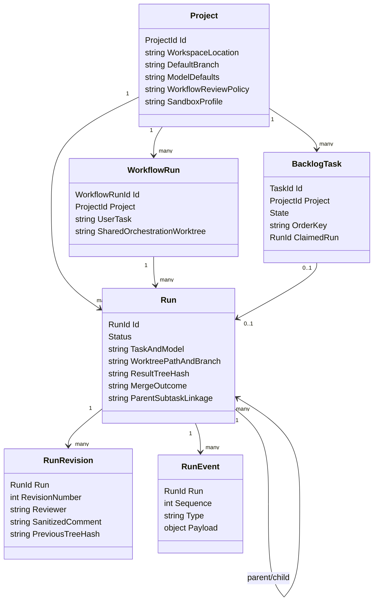
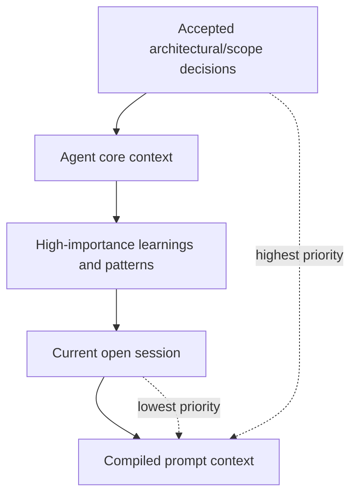

# Data & Persistence — Conceptual Deep Dive

## Purpose and Mental Model

Agentweaver persists more than rows in a database. It persists the state needed to coordinate long-running agent work, recover after restarts, explain why work happened, and safely turn isolated file changes into repository changes.

Think of the data layer as four cooperating persistence systems:

1. **Operational control plane** — the authoritative record of projects, runs, workflow envelopes, backlog tasks, review revisions, cast proposals, and merge state.
2. **Memory and orchestration plane** — decisions, draft decisions, agent memories, sessions, run-event history, coordinator plans, steering directives, and MCP OAuth state.
3. **Git state** — branches and worktrees that hold the actual file changes produced by agent runs.
4. **Kubernetes storage lifecycle** — persistent volumes, SQLite files, migration startup, and backups.

A rebuild should preserve the same separation of concerns: databases answer “what is the system state?”, git answers “what file state did this run produce?”, and exported `.squad` / `.agentweaver` files make selected memory visible to humans and agents.

## Design Goals

The persistence design optimizes for a single Agentweaver API instance coordinating many durable workflows:

- **Recoverable runs**: after a process restart, Agentweaver should know which runs exist, where their worktrees are, what status they were in, and what events already happened.
- **Auditable decisions**: durable team decisions and rejected/merged inbox items should explain the current operating rules.
- **Safe isolation**: unapproved agent changes should live outside the main branch until review and merge.
- **Low operational burden**: SQLite avoids running an external database for the default deployment.
- **Clear write ownership**: the Kubernetes deployment uses one API replica and a ReadWriteOnce data volume, matching SQLite’s single-writer model.
- **Evolvable memory schema**: the memory/orchestration model changes faster than the original operational schema, so it uses EF Core migrations rather than hand-written SQL everywhere.

The main trade-off is deliberate: simple local durability and easy deployment are favored over horizontal write scaling. If Agentweaver needed active-active API replicas, the SQLite/RWO assumptions would need to be revisited.

## Conceptual Domain Model

Agentweaver’s durable domain has two halves: **work execution** and **team memory**.

### Work execution concepts

- **Project**: a repository workspace plus its Agentweaver settings. It defines where work happens, which branch is default, who owns it, what model/provider defaults apply, which workflows are allowed, and what sandbox/review policies are active.
- **Workflow run**: a stable envelope for a user-submitted job. A workflow can create one or many child runs and may own a shared orchestration worktree.
- **Run**: one concrete agent execution. It records the prompt/task, model choice, submitting user, status, timestamps, worktree path, worktree branch, produced tree hash, diff, merge result, parent/child linkage, retry origin, and archive state.
- **Backlog task**: a project-scoped unit of future work. It can move from backlog to ready to claimed, and a claimed task points to at most one run.
- **Run revision**: immutable review feedback against a run. Revisions are append-only because they are part of the audit trail.
- **Run event**: an ordered event in a run’s stream. Events power live UI updates and restart-safe replay.

### Team memory and orchestration concepts

- **Decision**: an accepted rule or fact for the project. Architectural and scope decisions become “boundaries” and outrank other memory.
- **Decision inbox entry**: a proposed decision, learning, pattern, or update. It remains durable whether merged or rejected, so the team can audit why something did or did not become policy.
- **Agent memory**: reusable context associated with a named agent. Some entries are private to that agent; entries tagged `cross-team` can be injected into other agents’ context.
- **Session context**: the current work focus for a project. It captures active issues, summary, and serialized state. At most one session should be considered “current” for a project.
- **Outcome spec / work plan / subtask / dependency**: coordinator planning records. They describe what successful completion means, how the work was decomposed, how subtasks depend on each other, and how assembly/recovery should proceed.
- **Steering directive**: human guidance injected into an active coordinator workflow.
- **MCP OAuth state**: refresh tokens, revoked JWT IDs, and dynamic client registrations needed for MCP authentication flows.

```mermaid
erDiagram
    PROJECT ||--o{ DECISION : owns
    PROJECT ||--o{ DECISION_INBOX : reviews
    PROJECT ||--o{ AGENT_MEMORY : remembers
    PROJECT ||--o{ SESSION_CONTEXT : tracks
    PROJECT ||--o{ OUTCOME_SPEC : defines
    OUTCOME_SPEC ||--o{ WORK_PLAN : plans
    WORK_PLAN ||--o{ SUBTASK : decomposes
    SUBTASK ||--o{ SUBTASK_DEPENDENCY : depends_on
    DECISION ||--o{ DECISION : supersedes
    DECISION ||--o{ DECISION_INBOX : promoted_from

    DECISION {
      int id PK
      string project_id
      string agent_name
      string type
      string status
      int superseded_by_id FK
    }
    DECISION_INBOX {
      int id PK
      string project_id
      string slug UK
      string type
      string status
      int decision_id FK
    }
    AGENT_MEMORY {
      int id PK
      string project_id
      string agent_name
      string type
      string importance
      string tags
      string session_id
    }
    SESSION_CONTEXT {
      int id PK
      string project_id
      string session_id UK
      string focus_area
      string active_issues_json
      datetime ended_at
    }
    OUTCOME_SPEC {
      int id PK
      string project_id
      string coordinator_run_id
    }
    WORK_PLAN {
      int id PK
      int outcome_spec_id FK
      string coordinator_run_id
      string assembly_stage
    }
    SUBTASK {
      int id PK
      int work_plan_id FK
      string status
      string agent_name
    }
    SUBTASK_DEPENDENCY {
      int subtask_id FK
      int depends_on_subtask_id FK
    }
```

## Why Two SQLite Databases?

Agentweaver uses two SQLite-backed stores by default:

1. **`agentweaver.db`** for stable operational state.
2. **`memory.db`** for memory, orchestration, run events, and OAuth state.

This split is intentional. The original control-plane store is hand-written SQL and is conservative: it owns the core lifecycle facts that must be updated predictably during run orchestration. The newer memory/orchestration plane evolves more quickly and benefits from EF Core’s model relationships and migrations. Keeping it in a separate file avoids coupling new EF migrations to the older ADO.NET store.

SQLite is a good fit for the current deployment because:

- Agentweaver runs as a **single API writer**.
- Kubernetes mounts the data volume as **ReadWriteOnce**.
- WAL mode allows readers and one writer to coexist better than rollback journal mode.
- Busy timeouts make short write contention less fragile.
- The database files are easy to mount, inspect, and back up.

The cost is that SQLite is not a distributed coordination system. Cross-pod writes, multi-replica API deployments, and high write concurrency would require a server database or a different locking model.

## Operational Store: `agentweaver.db`

The operational store is the source of truth for the run control plane. If rebuilding Agentweaver, design this database around **state transitions and invariants**, not around object persistence.

It should hold:

- **Projects**: repository/workspace identity and project-level defaults.
- **Runs**: lifecycle state, worktree metadata, results, tree hashes, diffs, merge conflicts, review wait accounting, parent/subtask links, retry provenance, and archive state.
- **Workflow runs**: durable envelopes around user-submitted workflows, including shared orchestration worktree metadata.
- **Backlog tasks**: ordered project work items, claim state, and run linkage.
- **Run revisions**: immutable review feedback history.
- **Cast proposals**: persisted casting proposals that should survive API restarts.

### Consistency model

Operational writes should be small, explicit, and guarded by invariants:

- **Run status changes are controlled transitions**, not arbitrary updates. Merge and review flows rely on compare-and-set style behavior so two actors do not advance the same run inconsistently.
- **Backlog claiming is atomic**: moving a task into a claimed state and reserving the associated run must happen together or not at all.
- **A backlog task can point to at most one run**. This prevents duplicated execution for the same claimed task.
- **Active backlog order keys are unique per project/state** for unclaimed work, so ordered board operations remain deterministic.
- **Run revisions are append-only**. Review comments are evidence and should not be silently edited or deleted.
- **Worktree metadata is durable before work begins**. If the process restarts, the system can find or recreate the run’s worktree from stored path/branch data.

### Migration approach

The operational database uses a bootstrap-and-patch model:

1. Create missing tables if they do not exist.
2. Apply idempotent schema changes for newer columns or indexes.
3. Ignore “already exists” outcomes where safe.

This model is simple and robust for additive SQLite changes. Its trade-off is that complex schema refactors require extra care because there is no full migration history table for this store.

Where this lives: `apps/Agentweaver.Api/Infrastructure`, `packages/Agentweaver.Domain`.

## Memory and Orchestration Store: `memory.db`

`memory.db` is named after memory, but it is broader than that. It stores human/team memory, durable run events, coordinator planning, steering directives, and MCP OAuth state.

It should hold:

- **Decisions** and **decision inbox** entries.
- **Agent memory** and **session context**.
- **Run events** for replayable streams.
- **Outcome specs**, **work plans**, **subtasks**, and **subtask dependencies**.
- **Steering directives**.
- **OAuth refresh tokens**, revoked JWT IDs, and MCP client registrations.

### Why EF Core here?

The memory schema is relational and evolves frequently. EF Core gives this side of the system:

- explicit entity relationships;
- indexes for common project/status/agent lookups;
- migrations with history;
- a path to SQL Server or PostgreSQL for this database if needed later;
- simpler transactional code for inbox promotion and planning updates.

SQLite remains the default provider. SQL Server and PostgreSQL support are configuration options for the EF-backed store, but the production Kubernetes deployment still uses SQLite.

### Core invariants

A rebuild should preserve these rules:

- **Decision inbox slug uniqueness is project-wide**. The same slug should identify one proposed item within a project regardless of agent.
- **Rejected inbox items are retained**. Rejection is a status transition, not deletion.
- **Merging an inbox entry is transactional**. Creating the accepted decision, linking the inbox row, and marking it merged must succeed together.
- **Decisions can supersede decisions**. Supersession keeps old decisions explainable while establishing the new active rule.
- **Session IDs are unique per project**. The “current” session is the most recent non-ended session.
- **Tags are normalized with delimiter semantics**. Tag filters depend on matching whole tags, especially `cross-team`.
- **Subtask dependencies restrict deletion of depended-on subtasks** while allowing a work plan to cascade-delete its owned subtasks.
- **OAuth token and client identifiers are indexed/unique where replay or duplication would be unsafe**.

### Migration approach

The EF database uses normal EF migrations. In production, an init container runs the migration bundle before the API container starts, and the API also runs migrations during startup. This gives two safety nets: schema is prepared before normal serving, and an already-started API can still apply any pending migrations in development or nonstandard deployments.

There is also a transition guard for older databases that predate EF migrations. Its job is to detect a database that already had early memory tables but no EF migration history, seed the expected history marker, create the missing run-event table, and then let normal migrations continue.

Where this lives: `apps/Agentweaver.Api/Memory`, `apps/Agentweaver.Api/Migrations`, `apps/Agentweaver.Api/Program.cs`.

## Durable Run Event Streams

Run events are persisted in `memory.db`, not just kept in memory. The design is a two-layer stream:

1. **Durable write-through**: append the event row to SQLite and assign/record its run-local sequence number.
2. **Live fan-out**: publish the same event to an in-process channel for active subscribers.

The ordering matters: an event is written to SQLite before subscribers can observe it. That means a client may miss a live channel message, but it should not miss the event permanently.

Subscribers use a **replay-then-tail** pattern:

1. Create or find the live channel.
2. Replay persisted rows after the caller’s cursor.
3. Tail the channel.
4. Skip any channel event already delivered during replay.
5. Stop cleanly after terminal event types.

The live channel is bounded. If a subscriber is slow or absent, live copies can be dropped; durability is still preserved by SQLite. This is the key design trade-off: the channel optimizes latency, while the database guarantees recovery.

The essential invariant is **unique `(run_id, sequence)`**. It makes replay deterministic and lets clients resume from “last event I saw.”

Where this lives: `apps/Agentweaver.Api/Infrastructure/SqliteRunEventStream.cs`, `apps/Agentweaver.Api/Memory`.

## Decisions, Memory, and Context Assembly

The memory layer is not a generic note store. It is a priority-ordered context compiler for agents.

The compiler builds context in this order:

1. **Active architectural and scope decisions** — rendered as non-negotiable boundaries.
2. **Agent core context** — durable charter-like information for the target agent.
3. **High-importance learnings and patterns** — selected for the target agent, plus cross-team memories shared by tag.
4. **Current open session** — focus area, active issues, and summary.

This ordering is the most important conceptual rule. Decisions are first because they constrain all work. Session context is last because it is useful but should not override boundaries or durable agent knowledge.

### Decision inbox logic

The inbox is a review buffer between “an agent observed something” and “the team accepts this as durable policy.”

- Agents can submit proposed decisions, learnings, patterns, and updates.
- Pending entries remain visible for review.
- Promotion creates an accepted decision and marks the inbox entry merged.
- Rejection preserves the entry for audit.
- Routine learnings/patterns/updates can be auto-merged by the post-run scribe; architectural and scope boundaries should remain more review-oriented.

This prevents every agent thought from becoming policy while still preserving potentially valuable observations.

### Memory selection logic

Agent memory has two audiences:

- **Targeted memory**: injected only for the named agent.
- **Cross-team memory**: injected for other agents when explicitly tagged for sharing.

Selection is bounded by item count and approximate token budget. Rebuild this as a deterministic selection problem: score by importance, prefer newer items where scores match, and stop before exceeding the budget. This keeps prompts useful and bounded.

### Sessions

A session is the durable “what are we doing right now?” record for a project. Starting a new session ends older open sessions. Updating a session changes focus, active issues, summary, serialized state, or marks it ended. The compiler uses the most recent open session.

### Export/import mirror

SQLite is authoritative for API reads, but selected memory is mirrored to files so humans and agents can inspect it in the workspace:

- `.squad/decisions.md` for accepted decisions;
- `.squad/decisions/inbox/{slug}.md` for pending inbox entries;
- `.squad/agents/{agent}/history.md` for agent history;
- `.squad/identity/now.md` for current session focus;
- `.agentweaver/context/boundaries.md` for architectural/scope boundaries;
- `.agentweaver/context/patterns.md` for reusable patterns.

Export runs after memory mutations and after the post-run scribe pass. Import reads inbox files and creates missing pending rows. Treat files as a human/agent-facing mirror, not as the primary database.

Where this lives: `apps/Agentweaver.Api/Memory`, `apps/Agentweaver.Api/Endpoints`, `packages/Agentweaver.Squad/Memory`.

## Git as Persistent Run State

Agentweaver does not store file changes in SQLite. It stores metadata in SQLite and lets git store the actual content graph.

For a normal run:

1. Create a branch for the run from the originating branch.
2. Check out that branch in a dedicated worktree.
3. Persist the worktree path and branch on the run before agent work starts.
4. Let the agent modify files inside that isolated worktree.
5. Commit the result and persist the produced tree hash/diff.
6. Merge only after review/approval and safety checks.

This provides strong isolation: unreviewed changes are real git changes, but they are not on the main project branch.

### Revisions

A revision reuses the existing run worktree and branch. That is intentional: reviewer feedback should apply on top of the prior candidate result, not start from scratch unless the run is retried as a new run.

### Coordinator shared worktrees

Coordinator workflows have a different isolation rule. Child runs can share the coordinator’s orchestration worktree so one child can read files produced by another child. The database stores the shared worktree path on the workflow/coordinator metadata so orchestration can resume or recover.

The trade-off is explicit: ordinary runs maximize isolation; coordinator child runs allow controlled collaboration inside a shared workspace.

### Merge consistency

Merge is guarded by both database state and repository locking:

- acquire a repository-level merge lock;
- transition the run into a merging state;
- verify the approved tree hash still matches what is being merged;
- detect idempotent already-merged cases;
- update the target branch safely;
- persist the merged commit hash and terminal status;
- remove the worktree on success;
- preserve the worktree and conflict list on merge failure.

The tree hash check is important: it binds human approval to a specific file tree. Without it, a worktree could change after approval but before merge.

### Recovery

Worktree metadata may outlive the physical directory. This can happen if the database and git branch remain but the worktree folder is removed. The recovery path should prune stale git worktree administration data and recreate the worktree from the persisted branch.

Where this lives: `apps/Agentweaver.Api/Git`, `apps/Agentweaver.Api/Runs`, `apps/Agentweaver.Api/Infrastructure`.

## Kubernetes Storage and Backups

The production deployment uses two persistent volumes:

- **`agentweaver-data`**: ReadWriteOnce, mounted at `/data`. It holds `agentweaver.db`, `memory.db`, app home data, and default data-directory artifacts.
- **`agentweaver-workspace`**: ReadWriteMany, mounted at `/workspace`. It holds project workspaces.

The API deployment uses one replica and a `Recreate` strategy. That matches the SQLite/RWO model: one writer owns the database volume, and rollout waits for the old pod to release the disk before the new pod attaches it.

`Database__Path=/data/agentweaver.db` points the operational store at `/data`. The EF SQLite memory database derives its default path from the same directory, so it resolves to `/data/memory.db`. The run-event stream uses that same `memory.db` location.

### Backup model

The backup CronJob runs SQLite’s `.backup` command for `/data/agentweaver.db` and writes timestamped backups under `/data/backups`, pruning matching `agentweaver-*.db` files older than 14 days.

`memory.db` is co-located on the `agentweaver-data` PVC but is not captured by the backup CronJob. The CronJob backs up `/data/agentweaver.db` specifically and prunes only `agentweaver-*.db`; it does not separately back up `/data/memory.db`, which contains decisions, agent memory, sessions, run events, work plans, steering directives, and MCP OAuth/client registration tables. Loss of the PVC therefore loses `memory.db` entirely, so treat that database as not separately backed up.

Backups are also written under the same `/data` PVC. That protects against SQLite file corruption or accidental local overwrite of `agentweaver.db`, but it offers no protection against loss of the entire PVC: if the volume is destroyed, both the database and its co-located backups go with it. Durable protection requires an external volume snapshot or off-cluster backup policy.

Where this lives: `k8s/api-deployment.yaml`, `k8s/pvc-data.yaml`, `k8s/pvc-workspace.yaml`, `k8s/backup-cronjob.yaml`.

## Rebuild Checklist and Invariants

If rebuilding Agentweaver’s data layer from these concepts, preserve these decisions first:

1. **Separate operational state from memory/orchestration state** unless you deliberately migrate both to one coherent server database.
2. **Keep run lifecycle transitions explicit and guarded**. Do not let arbitrary writes mutate terminal or merge states.
3. **Persist worktree path/branch before agent execution** so in-flight work can be recovered.
4. **Use git for file content and SQLite for metadata**. Do not duplicate large diffs as the only source of truth.
5. **Make review revisions append-only**.
6. **Make run events durable before live publication** and replay by sequence.
7. **Treat decisions as higher priority than all other memory**.
8. **Keep inbox rejection/audit history** rather than deleting rejected proposals.
9. **Bound memory injection** by importance, recency, item count, and approximate prompt budget.
10. **Close older open sessions when starting a new session** for the same project.
11. **Use repository-level locking and tree-hash verification for merges**.
12. **Align deployment topology with database semantics**: one SQLite writer on an RWO PVC, or move to a server database before scaling writers.
13. **Back up every authoritative database file**. In the production deployment that means `agentweaver.db` and `memory.db`, not just the operational database.

## Common Gotchas

- `memory.db` is not just memory; it also holds run events, coordinator planning, steering, and OAuth state.
- The two databases have different migration systems: hand-written additive schema setup for `agentweaver.db`, EF migrations for `memory.db`.
- SQLite WAL improves concurrency but does not make SQLite a multi-writer distributed database.
- File exports are mirrors. The API should read authoritative memory from SQLite.
- Child coordinator runs intentionally receive a narrower context than full agents: team boundaries and task-specific instructions matter more than bloating every child prompt with all memory layers.
- A missing worktree directory is recoverable only if the database metadata and git branch still exist.
- Successful merges clean up worktrees; conflicted merges preserve them for inspection.
- The current backup job covers `agentweaver.db` only.
