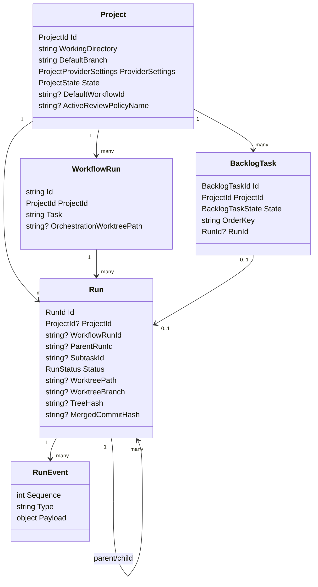
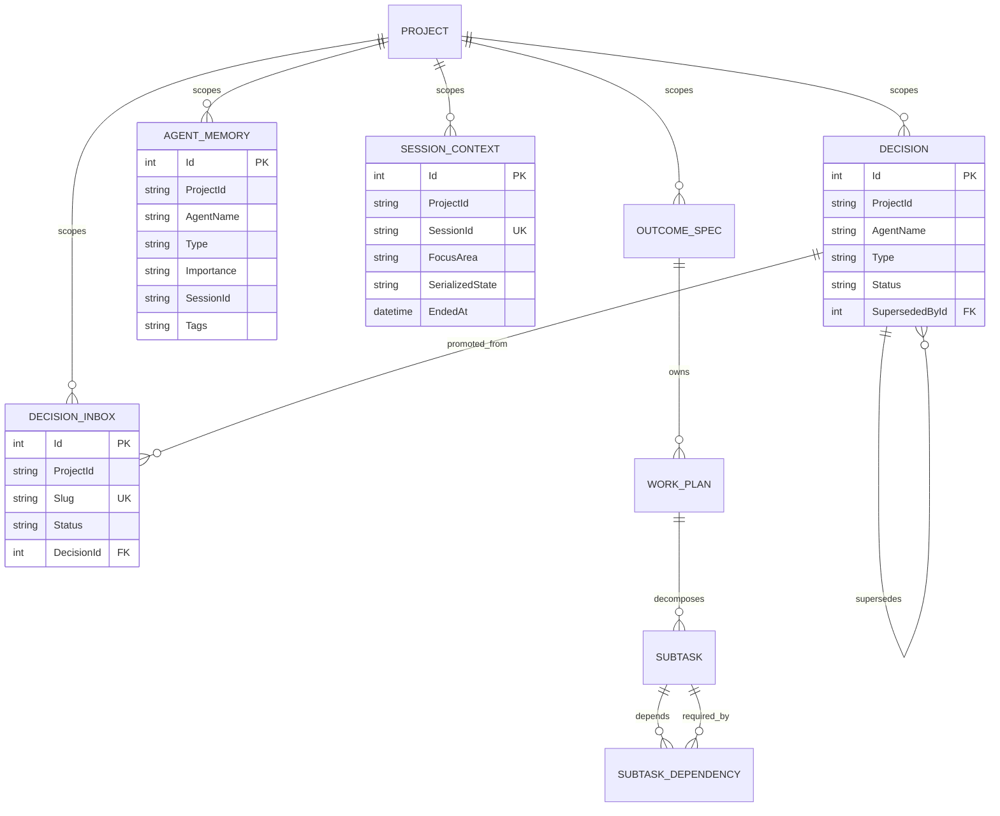

# Data & Persistence — Deep Dive

## Purpose & Scope

Agentweaver persists two related kinds of state:

- **Operational/domain state**: projects, runs, workflow run envelopes, backlog tasks, run revisions, run event streams, and git worktree metadata.
- **Team memory/orchestration state**: decisions, decision inbox entries, agent memory, open sessions, outcome specs, work plans, subtasks, steering directives, and MCP OAuth persistence.

This document focuses on the domain model in `packages/Agentweaver.Domain`, the API persistence layer in `apps/Agentweaver.Api`, the memory subsystem, git worktree persistence, and the Kubernetes data lifecycle.

## Domain Model

The core domain package uses small records/enums for durable concepts rather than EF entities. The principal records are:

- `Project`: a persisted project with `ProjectId`, origin, working directory, default branch, owner, default model provider settings, lifecycle state, backlog pickup settings, workflow/review policy settings, sandbox profile, blueprint provenance, and allowed workflow ids (`packages/Agentweaver.Domain/Project.cs:3-14`, `packages/Agentweaver.Domain/Project.cs:16-68`).
- `Run`: a single agent execution with repository/branch/model/task/user fields, status, timestamps, result, worktree path/branch, tree hash, diff, merge conflicts, project/model/team metadata, workflow linkage, merge commit, parent/subtask linkage, origin, retry provenance, and archive timestamp (`packages/Agentweaver.Domain/Run.cs:7-23`, `packages/Agentweaver.Domain/Run.cs:24-63`).
- `WorkflowRun`: a stable job envelope for user-submitted work; it can point to one shared orchestration worktree for multi-agent workflows (`packages/Agentweaver.Domain/WorkflowRun.cs:3-22`).
- `BacklogTask`: a project-scoped task with state, lexicographic order key, accountable capturer, claim/run linkage, workflow override, archive timestamp, and source-file idempotency marker (`packages/Agentweaver.Domain/BacklogTask.cs:3-28`, `packages/Agentweaver.Domain/BacklogTask.cs:30-42`).
- `RunEvent`: an ordered event payload for run streaming (`packages/Agentweaver.Domain/RunEvent.cs:1-3`).
- `RunStatus`: includes normal lifecycle states plus transient `Committing`/`Merging`, terminal `Merged`/`Declined`/`MergeFailed`, and child-run `AssembleReady` (`packages/Agentweaver.Domain/RunStatus.cs:3-33`).
- `ProjectProviderSettings` stores the default model source and optional Copilot/Foundry model ids (`packages/Agentweaver.Domain/ProjectProviderSettings.cs:3-8`).
- `SandboxPolicy` describes per-repository shell/network/destructive-command policy defaults (`packages/Agentweaver.Domain/SandboxPolicy.cs:3-13`, `packages/Agentweaver.Domain/SandboxPolicy.cs:23-40`, `packages/Agentweaver.Domain/SandboxPolicy.cs:79-89`).

### Memory/orchestration entities

The EF-backed memory model lives in `apps/Agentweaver.Api/Memory`:

- `Decision`: active/superseded/archived team decisions, optionally self-linked by `SupersededById`; tags are comma-separated (`apps/Agentweaver.Api/Memory/Decision.cs:5-18`).
- `DecisionInboxEntry`: draft decisions/learnings/patterns/updates with status `pending`, `merged`, or `rejected`, and an optional link to the promoted decision (`apps/Agentweaver.Api/Memory/DecisionInboxEntry.cs:5-19`).
- `AgentMemory`: per-agent memory entries of type `core_context`, `learning`, `pattern`, or `update`; `Tags` uses comma delimiters and `cross-team` enables cross-agent sharing (`apps/Agentweaver.Api/Memory/AgentMemory.cs:5-16`).
- `SessionContext`: one project session record with focus, active issues JSON, summary, serialized state, and start/end timestamps (`apps/Agentweaver.Api/Memory/SessionContext.cs:5-15`).
- `OutcomeSpec`, `WorkPlan`, `Subtask`, `SubtaskDependency`, and `SteeringDirective` persist coordinator planning, decomposition, dependencies, assembly, recovery, and human steering state (`apps/Agentweaver.Api/Memory/OutcomeSpec.cs:5-18`, `apps/Agentweaver.Api/Memory/WorkPlan.cs:5-34`, `apps/Agentweaver.Api/Memory/Subtask.cs:5-53`, `apps/Agentweaver.Api/Memory/SubtaskDependency.cs:5-10`, `apps/Agentweaver.Api/Memory/SteeringDirective.cs:5-15`).

## Persistence Layer

Agentweaver currently has **two SQLite-backed persistence tracks**:

1. **Main operational SQLite (`agentweaver.db`)** uses hand-written ADO.NET stores via `Microsoft.Data.Sqlite`. `SqliteDb` owns the file, creates schema, applies idempotent `ALTER TABLE` migrations, enables WAL, foreign keys, and a busy timeout per connection (`apps/Agentweaver.Api/Infrastructure/SqliteDb.cs:5-11`, `apps/Agentweaver.Api/Infrastructure/SqliteDb.cs:15-35`, `apps/Agentweaver.Api/Infrastructure/SqliteDb.cs:38-48`, `apps/Agentweaver.Api/Infrastructure/SqliteDb.cs:53-58`). It creates core tables for `runs`, append-only `run_revisions`, `projects`, `workflow_runs`, and `backlog_tasks` (`apps/Agentweaver.Api/Infrastructure/SqliteDb.cs:186-288`). `SqliteProjectStore`, `SqliteRunStore`, `SqliteWorkflowRunStore`, and `SqliteBacklogTaskStore` are registered as singletons in `Program.cs` (`apps/Agentweaver.Api/Program.cs:63-66`, `apps/Agentweaver.Api/Program.cs:157-159`, `apps/Agentweaver.Api/Program.cs:175-177`).
2. **EF Core memory database (`memory.db`)** uses `MemoryDbContext`. It is registered as scoped and defaults to SQLite at `memory.db` next to `Database:Path`; configuration can switch to SQL Server or PostgreSQL (`apps/Agentweaver.Api/Program.cs:213-239`). The API package references EF Core SQLite plus SQL Server/PostgreSQL providers (`apps/Agentweaver.Api/Agentweaver.Api.csproj:12-18`). On startup the API opens the SQLite EF connection, sets WAL and busy timeout, handles pre-migration databases, and then always runs `MigrateAsync()` (`apps/Agentweaver.Api/Program.cs:267-324`). The API Dockerfile builds a `MemoryDbContext` EF migration bundle, and the Kubernetes API deployment runs that bundle in an initContainer before the app starts (`apps/Agentweaver.Api/Dockerfile:17-26`, `k8s/api-deployment.yaml:36-68`).

`MemoryDbContext` exposes DbSets for decisions, inbox, memory, session context, run events, outcome specs, work plans, subtasks, subtask dependencies, steering directives, and MCP OAuth tables (`apps/Agentweaver.Api/Memory/MemoryDbContext.cs:7-21`). Its model configuration adds key indexes and relationships:

- decisions by `(ProjectId, Status)` and `(ProjectId, AgentName)`, plus optional self-FK `SupersededById` (`apps/Agentweaver.Api/Memory/MemoryDbContext.cs:25-31`);
- inbox by `(ProjectId, Status)`, unique `(ProjectId, Slug)`, and optional FK to `Decision` (`apps/Agentweaver.Api/Memory/MemoryDbContext.cs:32-38`);
- agent memory by `(ProjectId, AgentName)` and `(ProjectId, Type)` (`apps/Agentweaver.Api/Memory/MemoryDbContext.cs:39-40`);
- sessions by `(ProjectId, EndedAt)` and unique `(ProjectId, SessionId)` (`apps/Agentweaver.Api/Memory/MemoryDbContext.cs:41-42`);
- run events by `RunId` and unique `(RunId, Sequence)` (`apps/Agentweaver.Api/Memory/MemoryDbContext.cs:43-44`);
- outcome/work-plan/subtask/dependency cascade/restrict relationships (`apps/Agentweaver.Api/Memory/MemoryDbContext.cs:45-72`);
- steering and MCP OAuth indexes (`apps/Agentweaver.Api/Memory/MemoryDbContext.cs:73-80`).

### Durable run events

Run event persistence is intentionally in `memory.db`, not `agentweaver.db`. `SqliteRunEventStream` implements a two-layer stream: synchronous SQLite write-through for durability, then an in-process bounded channel for low-latency fan-out (`apps/Agentweaver.Api/Infrastructure/SqliteRunEventStream.cs:12-29`). Its constructor derives the same `memory.db` path as `Program.cs` (`apps/Agentweaver.Api/Infrastructure/SqliteRunEventStream.cs:61-75`), and each append writes before publishing (`apps/Agentweaver.Api/Infrastructure/SqliteRunEventStream.cs:87-94`). Replays read persisted rows in sequence order (`apps/Agentweaver.Api/Infrastructure/SqliteRunEventStream.cs:230-259`).

## Schema & Migrations

### EF Core migrations (`memory.db`)

| Migration | Adds / changes | Source |
|---|---|---|
| `20260616063937_AddRunEvents` | Creates `AgentMemory`, `DecisionInbox`, `Decisions`, `RunEvents`, `SessionContexts`; adds indexes for memory, inbox, decisions, run events, and sessions. | `apps/Agentweaver.Api/Migrations/20260616063937_AddRunEvents.cs:14-167` |
| `20260617194113_AddOutcomeSpec` | Creates `OutcomeSpecs` and `(ProjectId, CoordinatorRunId)` index. | `apps/Agentweaver.Api/Migrations/20260617194113_AddOutcomeSpec.cs:14-41` |
| `20260617224038_AddCoordinatorWorkPlan` | Creates `SteeringDirectives`, `WorkPlans`, `Subtasks`, `SubtaskDependencies`; wires FKs from work plans to outcome specs and subtasks/dependencies to subtasks. | `apps/Agentweaver.Api/Migrations/20260617224038_AddCoordinatorWorkPlan.cs:14-145` |
| `20260618092606_AddWorkPlanAssemblyStage` | Adds nullable `AssemblyStage` and `AssemblyStartedAt` to `WorkPlans`. | `apps/Agentweaver.Api/Migrations/20260618092606_AddWorkPlanAssemblyStage.cs:14-24` |
| `20260622232717_AddSubtaskRecovery` | Adds `RecoveryAttempts` and `RecoveryGuidance` to `Subtasks`. | `apps/Agentweaver.Api/Migrations/20260622232717_AddSubtaskRecovery.cs:13-24` |
| `20260625004704_AddSubtaskAgentCharter` | Adds nullable `AgentCharter` to `Subtasks`. | `apps/Agentweaver.Api/Migrations/20260625004704_AddSubtaskAgentCharter.cs:8-17` |
| `20260625192342_AddWorkPlanWorkflowId` | Adds nullable `WorkflowId` to `WorkPlans`. | `apps/Agentweaver.Api/Migrations/20260625192342_AddWorkPlanWorkflowId.cs:8-17` |
| `20260625210254_FixMissingSchemaFields` | Adds `SessionContexts.SerializedState`, `Decisions.SupersededById`, `DecisionInbox.DecisionId`, `AgentMemory.SessionId`; changes inbox uniqueness to `(ProjectId, Slug)`; adds FKs for promoted and superseded decisions. | `apps/Agentweaver.Api/Migrations/20260625210254_FixMissingSchemaFields.cs:13-70` |
| `20260626174307_AddMcpRefreshTokens` | Creates `McpRefreshTokens` and `McpRevokedJtis` with token/jti/expiry indexes. | `apps/Agentweaver.Api/Migrations/20260626174307_AddMcpRefreshTokens.cs:14-79` |
| `20260626175343_AddMcpClientRegistrations` | Creates `McpClientRegistrations` and unique `ClientId` index. | `apps/Agentweaver.Api/Migrations/20260626175343_AddMcpClientRegistrations.cs:14-35` |

Current EF schema summary: `memory.db` contains team memory (`Decisions`, `DecisionInbox`, `AgentMemory`, `SessionContexts`), durable event stream (`RunEvents`), coordinator planning (`OutcomeSpecs`, `WorkPlans`, `Subtasks`, `SubtaskDependencies`, `SteeringDirectives`), and MCP OAuth/token registration state (`McpRefreshTokens`, `McpRevokedJtis`, `McpClientRegistrations`) as exposed by `MemoryDbContext` (`apps/Agentweaver.Api/Memory/MemoryDbContext.cs:9-21`).

### Main SQLite schema (`agentweaver.db`)

The hand-written schema creates:

- `runs`: run lifecycle and review/worktree columns (`apps/Agentweaver.Api/Infrastructure/SqliteDb.cs:186-206`). Later idempotent migrations add result/worktree/tree/diff/project/model/team/workflow/merge/parent/subtask/review/origin/retry/archive columns (`apps/Agentweaver.Api/Infrastructure/SqliteDb.cs:60-95`, `apps/Agentweaver.Api/Infrastructure/SqliteDb.cs:126-129`). `SqliteRunStore.InsertAsync` persists the domain run fields into that table (`apps/Agentweaver.Api/Infrastructure/SqliteRunStore.cs:19-58`).
- `run_revisions`: append-only review revision history, protected by no-update/no-delete triggers (`apps/Agentweaver.Api/Infrastructure/SqliteDb.cs:208-229`).
- `projects`: project metadata and model defaults, later extended with heartbeat, workflow, review policy, sandbox, blueprint, and allowed workflow fields (`apps/Agentweaver.Api/Infrastructure/SqliteDb.cs:231-247`, `apps/Agentweaver.Api/Infrastructure/SqliteDb.cs:96-124`). `SqliteProjectStore.InsertAsync` writes the extended project shape (`apps/Agentweaver.Api/Infrastructure/SqliteProjectStore.cs:19-62`).
- `workflow_runs`: stable workflow envelopes, later extended with `orchestration_worktree_path` for shared coordinator worktrees (`apps/Agentweaver.Api/Infrastructure/SqliteDb.cs:249-256`, `apps/Agentweaver.Api/Infrastructure/SqliteDb.cs:133-136`). `SqliteWorkflowRunStore` writes and reads that orchestration path (`apps/Agentweaver.Api/Infrastructure/SqliteWorkflowRunStore.cs:11-26`, `apps/Agentweaver.Api/Infrastructure/SqliteWorkflowRunStore.cs:29-63`).
- `backlog_tasks`: project-scoped board tasks with FK to projects, ordered-state indexes, uniqueness for unclaimed order keys, and one-task-to-at-most-one-run invariant (`apps/Agentweaver.Api/Infrastructure/SqliteDb.cs:258-286`). `SqliteBacklogTaskStore` documents project scoping, conditional updates, order-key retry, and atomic claim+reserve behavior (`apps/Agentweaver.Api/Infrastructure/SqliteBacklogTaskStore.cs:8-13`).
- `cast_proposals`: persisted cast proposals (`apps/Agentweaver.Api/Infrastructure/SqliteDb.cs:138-151`).

## Memory Layers

The verified memory hierarchy has four layers, assembled by `MemoryContextCompiler`: **decisions**, **core context**, **learnings/patterns**, and **current open session** (`apps/Agentweaver.Api/Memory/MemoryContextCompiler.cs:7-11`, `apps/Agentweaver.Api/Memory/MemoryContextCompiler.cs:54-90`). It applies item and approximate token budgets from `MemoryContext:*` or `Memory:*`, defaulting to 20 items and ~4000 tokens (`apps/Agentweaver.Api/Memory/MemoryContextCompiler.cs:14-16`, `apps/Agentweaver.Api/Memory/MemoryContextCompiler.cs:44-52`).

### 1. Decisions / boundaries

Active `architectural` and `scope` decisions are loaded first, sorted by creation time, and rendered as `## Boundaries and Decisions`; the emitted text explicitly says these are non-negotiable and take precedence (`apps/Agentweaver.Api/Memory/MemoryContextCompiler.cs:54-62`, `apps/Agentweaver.Api/Memory/MemoryContextCompiler.cs:189-203`). `CompileDecisionsAsync` can render only this layer for child worker prompts (`apps/Agentweaver.Api/Memory/MemoryContextCompiler.cs:163-187`).

Decisions can be created directly or promoted from the inbox. Direct creation normalizes comma-delimited tags and exports memory files after saving (`apps/Agentweaver.Api/Endpoints/DecisionsEndpoints.cs:276-318`). Inbox submission upserts a pending entry by `(ProjectId, Slug)` and exports after writes (`apps/Agentweaver.Api/Endpoints/DecisionsEndpoints.cs:34-98`). Merge/promote wraps promotion in a transaction, creates the active `Decision`, links `DecisionInbox.DecisionId`, and exports (`apps/Agentweaver.Api/Endpoints/DecisionsEndpoints.cs:131-160`, `apps/Agentweaver.Api/Memory/DecisionPromotion.cs:23-49`). Rejection retains audit history by setting `Status = "rejected"` rather than deleting (`apps/Agentweaver.Api/Endpoints/DecisionsEndpoints.cs:195-219`).

### 2. Core context

Agent charters seed `AgentMemory` entries of type `core_context` and `high` importance when casting adds non-built-in team members (`apps/Agentweaver.Api/Casting/CastingService.cs:1121-1138`). The compiler loads only the target agent's `core_context` entries for layer 2 (`apps/Agentweaver.Api/Memory/MemoryContextCompiler.cs:64-71`).

### 3. Learnings / patterns

High-importance `learning` and `pattern` entries are selected for the target agent, plus cross-agent entries tagged with `,cross-team,` (`apps/Agentweaver.Api/Memory/MemoryContextCompiler.cs:73-83`). Candidate memories are sorted by importance and recency, then bounded by item count and approximate character budget (`apps/Agentweaver.Api/Memory/MemoryContextCompiler.cs:119-150`).

Workers are instructed to record only significant reusable learnings/patterns and notable decisions via the `WorkerMemoryProtocol`, which is appended to worker prompts (`apps/Agentweaver.Api/Runs/RunOrchestrator.cs:35-52`, `apps/Agentweaver.Api/Runs/RunOrchestrator.cs:551-559`). The memory endpoint records entries with normalized comma-delimited tags, optional session id, default importance `medium`, and exports after saving (`apps/Agentweaver.Api/Endpoints/MemoryEndpoints.cs:92-133`).

After terminal project runs, `PostRunScribeService` closes the memory flywheel: it auto-merges pending `learning`, `pattern`, and `update` inbox entries created during the run, leaves architectural/scope items for review, appends the run outcome to the open session summary, and exports the updated memory (`apps/Agentweaver.Api/Runs/PostRunScribeService.cs:9-17`, `apps/Agentweaver.Api/Runs/PostRunScribeService.cs:40-125`). The watch loop fires this service after merged/completed/no-change/declined/failed terminal paths, but child `AssembleReady` runs explicitly skip scribe/merge/cleanup (`apps/Agentweaver.Api/Runs/RunWatchLoopService.cs:252-267`, `apps/Agentweaver.Api/Runs/RunWatchLoopService.cs:281-290`, `apps/Agentweaver.Api/Runs/RunWatchLoopService.cs:308-322`, `apps/Agentweaver.Api/Runs/RunWatchLoopService.cs:373-384`, `apps/Agentweaver.Api/Runs/RunWatchLoopService.cs:388-402`, `apps/Agentweaver.Api/Runs/RunWatchLoopService.cs:325-370`).

### 4. Open session

The current open `SessionContext` is the most recent row for a project with `EndedAt == null`; it contributes focus area, active issues, and summary (`apps/Agentweaver.Api/Memory/MemoryContextCompiler.cs:85-114`). Creating a session closes existing open sessions in the same transaction, enforces unique `(ProjectId, SessionId)`, and exports (`apps/Agentweaver.Api/Endpoints/MemoryEndpoints.cs:182-238`). Updating the current or named session can alter focus, active issues, summary, serialized state, or end the session, then exports (`apps/Agentweaver.Api/Endpoints/MemoryEndpoints.cs:240-274`, `apps/Agentweaver.Api/Endpoints/MemoryEndpoints.cs:325-355`). Casting starts an initial session if none is open (`apps/Agentweaver.Api/Casting/CastingService.cs:1141-1156`).

### Filesystem export/import

Although SQLite is authoritative for API reads, memory is mirrored to repository files. `MemoryExportHelpers.TryExportAsync` materializes decisions, pending inbox, agent memory, and the current session, then calls `SquadMemoryExporter` (`apps/Agentweaver.Api/Endpoints/MemoryEndpoints.cs:442-473`). The exporter writes:

- `.squad/decisions.md` and `.squad/decisions/inbox/{slug}.md` (`packages/Agentweaver.Squad/Memory/SquadMemoryExporter.cs:46-78`);
- `.squad/agents/{agent}/history.md` for `learning` and `update` entries (`packages/Agentweaver.Squad/Memory/SquadMemoryExporter.cs:81-102`);
- `.squad/identity/now.md` for the current session (`packages/Agentweaver.Squad/Memory/SquadMemoryExporter.cs:105-112`);
- `.agentweaver/context/boundaries.md` for architectural/scope decisions (`packages/Agentweaver.Squad/Memory/SquadMemoryExporter.cs:115-140`);
- `.agentweaver/context/patterns.md` for pattern memories (`packages/Agentweaver.Squad/Memory/SquadMemoryExporter.cs:143-162`).

The import path scans `.squad/decisions/inbox/*.md`, parses front matter, and inserts missing pending inbox rows (`apps/Agentweaver.Api/Endpoints/MemoryEndpoints.cs:404-437`, `packages/Agentweaver.Squad/Memory/SquadMemoryImporter.cs:16-31`, `packages/Agentweaver.Squad/Memory/SquadMemoryImporter.cs:34-72`).

## Git Integration

Git repositories are part of project persistence. Blank projects are initialized with an empty initial commit on the default branch, and GitHub-origin projects are cloned using an ephemeral access token that is not stored or logged (`apps/Agentweaver.Api/Git/ProjectGitInitializer.cs:7-13`, `apps/Agentweaver.Api/Git/ProjectGitInitializer.cs:23-55`, `apps/Agentweaver.Api/Git/ProjectGitInitializer.cs:57-90`). The project row stores the working directory and default branch (`packages/Agentweaver.Domain/Project.cs:5-10`, `apps/Agentweaver.Api/Infrastructure/SqliteProjectStore.cs:25-45`).

### Worktree-per-run isolation

`WorktreeManager` is the git integration point for run artifacts. Its class contract states that each run gets a dedicated branch and worktree checked out from the originating branch, isolating changes until an approved merge (`apps/Agentweaver.Api/Git/WorktreeManager.cs:15-20`). The base path defaults to `<AppPaths.DataDirectory>/worktrees` unless `Worktrees:BasePath` is configured (`apps/Agentweaver.Api/Git/WorktreeManager.cs:44-49`). Branch names are `agentweaver/{runId}` (`apps/Agentweaver.Api/Git/WorktreeManager.cs:59-59`).

For ordinary runs, `RunOrchestrator.StartRunAsync` calls `AddWorktree`, then persists `WorktreePath` and `WorktreeBranch` into the run row before starting the workflow (`apps/Agentweaver.Api/Runs/RunOrchestrator.cs:76-107`). Reserved project runs use the same pattern through `UpdateToInProgressAsync` (`apps/Agentweaver.Api/Runs/RunOrchestrator.cs:230-270`). Revisions reuse the existing worktree and branch, so requested changes build on prior commits (`apps/Agentweaver.Api/Runs/RunOrchestrator.cs:316-356`).

`AddWorktree` validates the repository, creates `agentweaver/{runId}` at the originating branch tip if missing, and adds a git worktree directory named by run id (`apps/Agentweaver.Api/Git/WorktreeManager.cs:108-141`). `CommitChanges` stages run changes, filters child-subtask output to declared paths when possible, and returns the committed tree hash (`apps/Agentweaver.Api/Git/WorktreeManager.cs:144-170`, `apps/Agentweaver.Api/Git/WorktreeManager.cs:172-215`). Diffs and file lists are computed between the originating branch and worktree branch (`apps/Agentweaver.Api/Git/WorktreeManager.cs:298-309`, `apps/Agentweaver.Api/Git/WorktreeManager.cs:584-620`).

### Coordinator shared worktree

For coordinator child runs, isolation differs by design. `StartChildRunAsync` reuses the coordinator's shared worktree so child agents can read each other's produced files (`apps/Agentweaver.Api/Runs/RunOrchestrator.cs:149-157`, `apps/Agentweaver.Api/Runs/RunOrchestrator.cs:160-186`). `GetOrProvisionOrchestrationWorktreeAsync` stores the shared worktree on the coordinator run, recreates it via `EnsureWorktree` if the physical directory was lost, and serializes first provisioning with a semaphore (`apps/Agentweaver.Api/Runs/RunOrchestrator.cs:755-799`). The workflow-run store also has an `orchestration_worktree_path` field for the envelope (`apps/Agentweaver.Api/Infrastructure/SqliteWorkflowRunStore.cs:11-26`, `apps/Agentweaver.Api/Infrastructure/SqliteWorkflowRunStore.cs:29-63`).

`EnsureWorktree` is the recovery path for persisted worktree metadata whose physical directory disappeared; it prunes stale git admin entries, removes the throw-away branch created by libgit2 worktree add, and recreates the worktree from the persisted branch (`apps/Agentweaver.Api/Git/WorktreeManager.cs:61-106`).

### Merge and cleanup

Merge is protected by `RepositoryMergeLock` plus run-store CAS transitions. `MergeCoordinator.ExecuteMergeAsync` starts by acquiring the repository lock and transitioning the run to `Merging`, then calls `MergeWorktree` (`apps/Agentweaver.Api/Runs/MergeCoordinator.cs:29-57`, `apps/Agentweaver.Api/Runs/MergeCoordinator.cs:77-97`). `MergeWorktree` verifies the approved tree hash, detects idempotent already-merged branches, and either hard-resets a checked-out originating branch or updates refs only when safe/appropriate (`apps/Agentweaver.Api/Git/WorktreeManager.cs:864-923`, `apps/Agentweaver.Api/Git/WorktreeManager.cs:925-997`, `apps/Agentweaver.Api/Git/WorktreeManager.cs:999-1044`). On success the run is marked merged, the merged commit hash is persisted, and the worktree/branch are removed (`apps/Agentweaver.Api/Runs/MergeCoordinator.cs:100-124`, `apps/Agentweaver.Api/Git/WorktreeManager.cs:1047-1088`). On conflict the worktree is preserved for manual inspection and conflicting paths are stored in the run row (`apps/Agentweaver.Api/Runs/MergeCoordinator.cs:136-159`).

## Backup & Data Lifecycle

Production mounts two PVCs:

- `agentweaver-data`: `ReadWriteOnce`, premium managed CSI, 10Gi; mounted at `/data` by the API and backup job (`k8s/pvc-data.yaml:1-12`, `k8s/api-deployment.yaml:144-146`, `k8s/backup-cronjob.yaml:40-58`).
- `agentweaver-workspace`: `ReadWriteMany`, Azure Files CSI premium, 50Gi; mounted at `/workspace` for project workspaces (`k8s/pvc-workspace.yaml:1-12`, `k8s/api-deployment.yaml:147-148`).

The API sets `Database__Path=/data/agentweaver.db`, `HOME=/data`, and `Workspace__Path=/workspace`; `memory.db` defaults to the same `/data` directory because `Program.cs` derives it from `Database:Path` (`k8s/api-deployment.yaml:91-108`, `apps/Agentweaver.Api/Program.cs:232-237`). The deployment uses one API replica with `Recreate`, which existing docs attribute to SQLite single-writer behavior on the RWO PVC (`docs/deep-dive/infra-deployment.md:78-84`).

The backup CronJob runs daily at `17 3 * * *`, installs `sqlite`, creates `/data/backups`, runs SQLite `.backup` on `/data/agentweaver.db`, and deletes `agentweaver-*.db` backups older than 14 days (`k8s/backup-cronjob.yaml:1-12`, `k8s/backup-cronjob.yaml:33-39`). It mounts the same `agentweaver-data` PVC at `/data` as the API, but the backup command is file-specific rather than a directory/PVC snapshot (`k8s/backup-cronjob.yaml:40-58`, `k8s/api-deployment.yaml:144-146`, `k8s/api-deployment.yaml:186-189`).

Verified: `memory.db` is co-located on the `agentweaver-data` PVC but is not captured by the checked-in CronJob. In production the API sets `Database__Path=/data/agentweaver.db`, and `Program.cs` derives SQLite `memory.db` from the directory of that configured path, so the EF database resolves to `/data/memory.db` (`k8s/api-deployment.yaml:91-108`, `apps/Agentweaver.Api/Program.cs:232-237`). `SqliteRunEventStream` derives the same `/data/memory.db` path (`apps/Agentweaver.Api/Infrastructure/SqliteRunEventStream.cs:61-75`). Because the CronJob only runs `.backup` for `/data/agentweaver.db` and prunes only `agentweaver-*.db`, it misses the separate `memory.db` file that holds decisions, agent memory, sessions, run events, work plans, steering directives, and MCP OAuth/token registration tables (`k8s/backup-cronjob.yaml:33-39`, `apps/Agentweaver.Api/Memory/MemoryDbContext.cs:9-21`).

## Gotchas & Invariants

- **Two databases, two migration systems.** Main operational state is in hand-written SQLite schema/idempotent alters; EF Core `MigrateAsync` governs `memory.db` (`apps/Agentweaver.Api/Infrastructure/SqliteDb.cs:53-157`, `apps/Agentweaver.Api/Program.cs:213-239`, `apps/Agentweaver.Api/Program.cs:321-324`).
- **SQLite is default, not the only EF provider.** `MemoryDbContext` defaults to SQLite but supports SQL Server and PostgreSQL through `Database:Provider` (`apps/Agentweaver.Api/Program.cs:213-238`).
- **`memory.db` holds more than "memory".** It also stores durable run events, coordinator planning tables, and MCP OAuth refresh/client state (`apps/Agentweaver.Api/Memory/MemoryDbContext.cs:13-21`).
- **Run revisions are append-only.** `run_revisions` has triggers that abort updates and deletes (`apps/Agentweaver.Api/Infrastructure/SqliteDb.cs:208-229`).
- **Run events are durable before live fan-out.** `SqliteRunEventStream` writes to SQLite before channel publication and replays from SQLite on reconnect (`apps/Agentweaver.Api/Infrastructure/SqliteRunEventStream.cs:87-94`, `apps/Agentweaver.Api/Infrastructure/SqliteRunEventStream.cs:127-150`).
- **DateTimeOffset ordering is often client-side.** The memory compiler and endpoints call out SQLite translation limitations and sort sessions/decisions in memory (`apps/Agentweaver.Api/Memory/MemoryContextCompiler.cs:54-62`, `apps/Agentweaver.Api/Memory/MemoryContextCompiler.cs:85-90`, `apps/Agentweaver.Api/Endpoints/MemoryEndpoints.cs:168-172`).
- **Tags are comma-delimited with sentinel commas.** Writers normalize tags as `,tag,` and filters look for `,{tag},`; cross-team memory relies on `,cross-team,` (`apps/Agentweaver.Api/Endpoints/MemoryEndpoints.cs:108-112`, `apps/Agentweaver.Api/Memory/MemoryContextCompiler.cs:75-79`).
- **Inbox slug uniqueness is project-wide.** The current EF config and migration use unique `(ProjectId, Slug)`, not `(ProjectId, AgentName, Slug)` (`apps/Agentweaver.Api/Memory/MemoryDbContext.cs:32-33`, `apps/Agentweaver.Api/Migrations/20260625210254_FixMissingSchemaFields.cs:13-55`).
- **Decision boundaries outrank all other memory.** The compiler renders decisions first and labels them non-negotiable (`apps/Agentweaver.Api/Memory/MemoryContextCompiler.cs:54-62`, `apps/Agentweaver.Api/Memory/MemoryContextCompiler.cs:194-203`).
- **Children get decisions, not the full memory stack.** Child prompts include charter, architectural/scope decisions, and worktree boundaries; core context/learnings/session are deliberately excluded (`apps/Agentweaver.Api/Runs/RunOrchestrator.cs:470-505`, `apps/Agentweaver.Api/Runs/RunOrchestrator.cs:561-598`).
- **Scribe is non-blocking.** `PostRunScribeService` catches/logs failures and must not affect terminal run status (`apps/Agentweaver.Api/Runs/PostRunScribeService.cs:9-17`, `apps/Agentweaver.Api/Runs/PostRunScribeService.cs:127-130`).
- **Worktree metadata can outlive physical directories.** `EnsureWorktree` exists for cases where DB/git branch state persists but ephemeral physical worktree directories disappear (`apps/Agentweaver.Api/Git/WorktreeManager.cs:61-106`).
- **Successful merges delete worktrees; conflicts preserve them.** Success calls `RemoveWorktree`; conflict logs preservation for manual inspection (`apps/Agentweaver.Api/Runs/MergeCoordinator.cs:114-115`, `apps/Agentweaver.Api/Runs/MergeCoordinator.cs:148-152`).
- **Backlog active ordering excludes archived items.** The unique `(project_id, state, order_key)` index only applies to `backlog`/`ready` and `archived_at IS NULL` (`apps/Agentweaver.Api/Infrastructure/SqliteDb.cs:278-282`).
