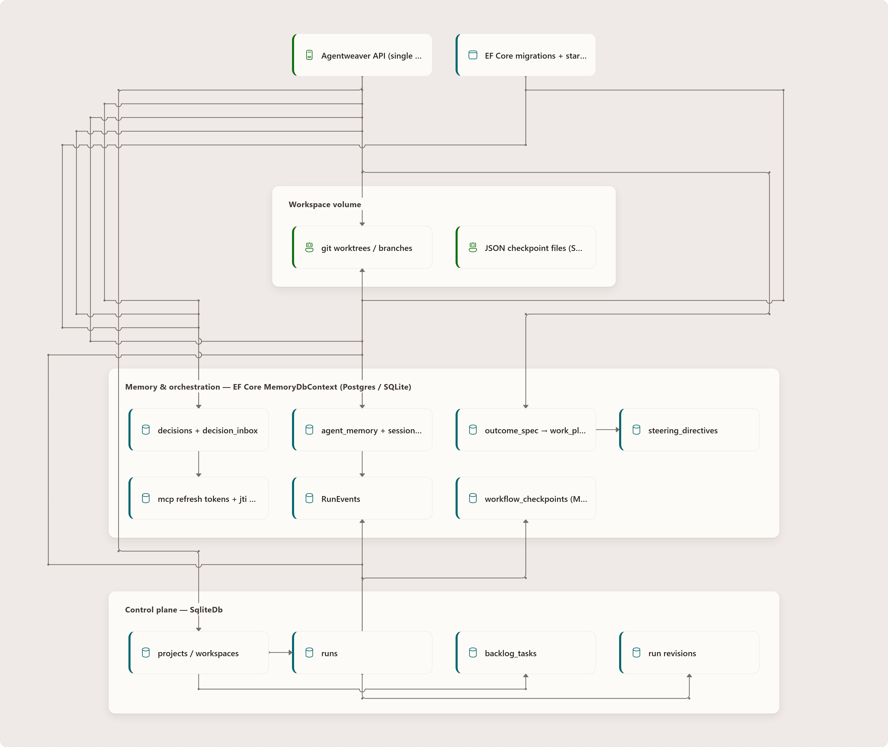

# Data & Persistence — Conceptual Deep Dive

## Purpose and Mental Model

Agentweaver persists more than rows in a database. It persists the state needed to coordinate long-running agent work, recover after restarts, explain why work happened, and safely turn isolated file changes into repository changes.

Think of the data layer as four cooperating persistence systems:

1. **Operational control plane** — the authoritative record of projects, runs, workflow envelopes, backlog tasks, review revisions, cast proposals, and merge state.
2. **Memory and orchestration plane** — decisions, draft decisions, agent memories, sessions, run-event history, coordinator plans, steering directives, and MCP OAuth state.
3. **Git state** — branches and worktrees that hold the actual file changes produced by agent runs.
4. **Kubernetes storage lifecycle** — persistent volumes, PostgreSQL Flexible Server, migration startup, and backups.

A rebuild should preserve the same separation of concerns: databases answer “what is the system state?”, git answers “what file state did this run produce?”, and exported `.squad` / `.agentweaver` files make selected memory visible to humans and agents.

## Architecture at a glance

Provider selection happens at composition: Postgres registers EF operational stores, shared events,
checkpoints, and leases through `MemoryDbContext`; local SQLite registers raw operational stores
and a separate EF memory database. `SqliteDb` is not the production control-plane owner.
Worktrees remain filesystem state. Postgres checkpoints live in `workflow_checkpoints`; file
checkpoints are a SQLite/dev choice, not a response to a production database failure.

<!-- Editable source: ../diagrams/src/data-persistence-fig1.drawio.
     Export with pinned draw.io Desktop 31.4.5 using --spec data-persistence-fig1.
     Review lineage: ../diagrams/reviews/data-persistence-fig1/iteration-manifest.json. -->

## Design Goals

The persistence design supports durable workflows across production replicas while retaining a low-overhead local development mode:

- **Recoverable runs**: after a process restart, Agentweaver should know which runs exist, where their worktrees are, what status they were in, and what events already happened.
- **Auditable decisions**: durable team decisions and rejected/merged inbox items should explain the current operating rules.
- **Safe isolation**: unapproved agent changes should live outside the main branch until review and merge.
- **Low operational burden for local dev**: the SQLite provider avoids a database dependency when running locally.
- **Replica-safe writes in production**: the AKS deployment uses PostgreSQL Flexible Server with two API replicas. CAS-style `UPDATE ... WHERE` guards status transitions; run-level leasing prevents double-dispatch across replicas.
- **Evolvable memory schema**: the memory/orchestration model changes faster than the control-plane schema, so it uses EF Core migrations rather than hand-written SQL everywhere.

Local dev uses SQLite for simplicity. The AKS deployment uses PostgreSQL Flexible Server — this lifts the single-writer constraint and allows two replicas with a RollingUpdate strategy.

## Conceptual Domain Model

Agentweaver’s durable domain has two halves: **work execution** and **team memory**.

### Work execution concepts

- **Project**: a repository workspace plus its Agentweaver settings. It defines where work happens, which branch is default, who owns it, what model/provider defaults apply, which workflows are allowed, and what sandbox/review policies are active.
- **Workflow run**: a stable envelope for a user-submitted job. A workflow can create one or many child runs and may own a shared orchestration worktree.
- **Run**: one concrete agent execution. It records the prompt/task, model choice, submitting user, status, timestamps, worktree path, worktree branch, produced tree hash, diff, merge result, parent/child linkage, retry origin, and archive state.
- **Backlog task**: a project-scoped unit of future work. It can move from backlog to ready to claimed, and a claimed task points to at most one run.
- **Run revision**: immutable review feedback against a run. Revisions are append-only because they are part of the audit trail.
- **Run event**: an ordered event in a run’s stream. Events power live UI updates and restart-safe replay.

| Relationship | Contract |
| --- | --- |
| Project / run | Project-backed runs carry project identity; Operator conversations need not have a project or repository. |
| Workflow envelope / run | A run can participate in an envelope, but participation is not universal. |
| Parent / child run | Parent/subtask linkage identifies coordination; each child owns its worktree and branch. |
| Backlog task / claimed run | The task is project-scoped and points to at most one claimed run. |
| Run / revision | Append-only numbered review feedback belongs to the run. |
| Run / event | Ordered events are unique by `(run_id, sequence)`. |

This table describes participation and ownership, not a universal execution sequence.

### Team memory and orchestration concepts

- **Decision**: an accepted rule or fact for the project. Architectural and scope decisions become “boundaries” and outrank other memory.
- **Decision inbox entry**: a proposed decision, learning, pattern, or update. It remains durable whether merged or rejected, so the team can audit why something did or did not become policy.
- **Agent memory**: reusable context associated with a named agent. Some entries are private to that agent; entries tagged `cross-team` can be injected into other agents’ context.
- **Session context**: the current work focus for a project. It captures active issues, summary, and serialized state. At most one session should be considered “current” for a project.
- **Outcome spec / work plan / subtask / dependency**: coordinator planning records. They describe what successful completion means, how the work was decomposed, how subtasks depend on each other, and how assembly/recovery should proceed.
- **Steering directive**: human guidance injected into an active coordinator workflow.
- **MCP OAuth state**: OpenIddict client, authorization and token entries, consent, and refresh-family state owned by the API authorization server.

| Record/link | Ownership and uniqueness |
| --- | --- |
| Decision / inbox / agent memory | Project-scoped knowledge; promotion links an inbox entry to an accepted decision. Rejection preserves the inbox record. |
| Inbox slug | Unique by `(project_id, slug)`, not globally unique across projects. |
| Session context | Unique by `(project_id, session_id)`; open-session selection is project-relative. |
| Outcome spec / work plan | The plan references its spec and coordinator run. |
| Work plan / subtask | The plan owns its subtasks; deleting a plan cascades to owned records. |
| Subtask dependency | Two different roles: owning `subtask_id` and prerequisite `depends_on_subtask_id`. The prerequisite is not an owned child and its deletion is restricted. |
| Supersession | A decision may reference a successor; that does not make every decision have a successor or promoted inbox entry. |

Source: `apps/Agentweaver.Api.Data/Memory/MemoryDbContext.cs`. Tables make these optional
links and composite keys clearer than a broad, mandatory-cardinality entity diagram.

## Database architecture

### Production (PostgreSQL Flexible Server)

The AKS deployment uses **Azure Database for PostgreSQL Flexible Server** (`Database:Provider=Postgres`). Both stores — the operational control plane and the memory/orchestration plane — are unified behind a single EF Core `MemoryDbContext` and a single database. There is one connection string, one migration mechanism, and no local disk dependency for application state.

This removes the single-writer constraint. The deployment runs two API replicas; Postgres handles concurrent writes safely because every status transition uses a CAS-style `UPDATE ... WHERE status = expected` and run-level leasing ensures exactly one worker executes a given run at a time.

### Local development (SQLite)

In local/dev mode (`Database:Provider=Sqlite`, the default), Agentweaver uses two SQLite files:

1. **`agentweaver.db`** for stable operational state (projects, runs, backlog tasks, revisions).
2. **`memory.db`** for memory, orchestration, run events, and OAuth state.

This split is intentional. The control-plane store is hand-written SQL and conservative; the memory/orchestration plane evolves more quickly and benefits from EF Core's model relationships and migrations. Keeping it in a separate file avoids coupling EF migrations to the ADO.NET store. A single local writer means SQLite's simple transaction model is sufficient — no distributed coordination is needed.

SQLite is a good fit for local development because:

- One writer at a time; no concurrency configuration needed.
- WAL mode allows readers and one writer to coexist.
- Database files are easy to inspect and reset between tests.
- No external dependency to install or configure.

## Operational Store: local `agentweaver.db`, production EF stores

The operational store is the source of truth for the run control plane. If rebuilding Agentweaver, design this database around **state transitions and invariants**, not around object persistence.

It should hold:

- **Projects**: repository/workspace identity and project-level defaults.
- **Runs**: lifecycle state, worktree metadata, results, tree hashes, diffs, merge conflicts, review wait accounting, parent/subtask links, retry provenance, and archive state.
- **Workflow runs**: durable envelopes around user-submitted workflows, including shared orchestration worktree metadata.
- **Backlog tasks**: ordered project work items, claim state, and run linkage.
- **Run revisions**: immutable review feedback history.
- **Cast proposals**: persisted casting proposals that should survive API restarts.
- **Model-usage events**: durable `agent.turn.usage` events record per-turn token and nano-AIU data. Metrics and trace endpoints query telemetry and supported stored data.

### Consistency model

Operational writes should be small, explicit, and guarded by invariants:

- **Run status changes are controlled transitions**, not arbitrary updates. Merge and review flows rely on compare-and-set style behavior so two actors do not advance the same run inconsistently.
- **Backlog claiming is atomic**: moving a task into a claimed state and reserving the associated run must happen together or not at all.
- **A backlog task can point to at most one run**. This prevents duplicated execution for the same claimed task.
- **Active backlog order keys are unique per project/state** for unclaimed work, so ordered board operations remain deterministic.
- **Run revisions are append-only**. Review comments are evidence and should not be silently edited or deleted.
- **Worktree metadata is durable before work begins**. If the process restarts, the system can find or recreate the run’s worktree from stored path/branch data.

### Migration approach

The local raw SQLite operational database uses a bootstrap-and-patch model:

1. Create missing tables if they do not exist.
2. Apply idempotent schema changes for newer columns or indexes.
3. Ignore “already exists” outcomes where safe.

This model is simple and robust for additive SQLite changes. Its trade-off is that complex schema refactors require extra care because there is no full migration history table for this store.

Where this lives: `apps/Agentweaver.Api/Infrastructure`, `packages/Agentweaver.Domain`.

## Memory and Orchestration Store: `memory.db`

`memory.db` is named after memory, but it is broader than that. It stores human/team memory, durable run events, coordinator planning, steering directives, and MCP OAuth state.

It should hold:

- **Decisions** and **decision inbox** entries.
- **Agent memory** and **session context**.
- **Run events** for replayable streams.
- **Outcome specs**, **work plans**, **subtasks**, and **subtask dependencies**.
- **Steering directives**.
- **OpenIddict applications, authorizations, and token entries**, consent, and refresh-family state.

### Why EF Core here?

The memory schema is relational and evolves frequently. EF Core gives this side of the system:

- explicit entity relationships;
- indexes for common project/status/agent lookups;
- migrations with history;
- a path to SQL Server or PostgreSQL for this database when deployment needs outgrow SQLite;
- simpler transactional code for inbox promotion and planning updates.

PostgreSQL is the production provider. SQLite remains the default for local development. SQL Server is also a supported EF provider for the memory store.

### Core invariants

A rebuild should preserve these rules:

- **Decision inbox slug uniqueness is project-wide**. The same slug should identify one proposed item within a project regardless of agent.
- **Rejected inbox items are retained**. Rejection is a status transition, not deletion.
- **Merging an inbox entry is transactional**. Creating the accepted decision, linking the inbox row, and marking it merged must succeed together.
- **Decisions can supersede decisions**. Supersession keeps old decisions explainable while establishing the new active rule.
- **Session IDs are unique per project**. The “current” session is the most recent non-ended session.
- **Tags are normalized with delimiter semantics**. Tag filters depend on matching whole tags, especially `cross-team`.
- **Subtask dependencies restrict deletion of depended-on subtasks** while allowing a work plan to cascade-delete its owned subtasks.
- **OAuth token and client identifiers are indexed/unique where replay or duplication would be unsafe**.

### Migration approach

The EF database uses normal EF migrations. In production, an init container runs the migration bundle before the API container starts, and the API also runs migrations during startup. This gives two safety nets: schema is prepared before normal serving, and an already-started API can still apply any pending migrations in development or nonstandard deployments.

A migration-history guard keeps EF startup deterministic when a database already has memory tables but lacks the expected EF history marker. It seeds the marker, creates the missing run-event table, and then lets normal migrations continue.

Where this lives: `apps/Agentweaver.Api/Memory`, `apps/Agentweaver.Api/Migrations`, `apps/Agentweaver.Api/Program.cs`.

## Durable Run Event Streams

Events are appended durably before acknowledgement. Delivery has distinct implementations:

| Path | Delivery |
| --- | --- |
| `EfRunEventStream.SubscribeAsync` | Queries shared rows after the cursor; waits 250 ms when no rows are available. This supports subscribers on other replicas. |
| `SqliteRunEventStream` | Replays durable rows and tails a bounded process-local channel, deduplicating overlap. |
| Endpoint with local `RunStreamStore` entry | Takes an atomic snapshot and waits for local changes; it need not call the durable subscription path. |

An in-memory channel is not a cross-replica bus. Terminal replay drains its batch and ends;
transport `done` at a review gate does not mean the run completed. The durable log can still
accept permitted late diagnostic events; completion is not a promise that no future append exists.

The essential invariant is **unique `(run_id, sequence)`**. It makes replay deterministic and lets clients resume from “last event I saw.”

Where this lives: `apps/Agentweaver.Api/Infrastructure/SqliteRunEventStream.cs`, `apps/Agentweaver.Api/Infrastructure/EfRunEventStream.cs`, `apps/Agentweaver.Api/Endpoints/RunEndpoints.cs:457-555`.

## Decisions, Memory, and Context Assembly

The memory layer is not a generic note store. It is a priority-ordered context compiler for agents.

The compiler builds context in this order:

1. **Active architectural and scope decisions** — rendered as non-negotiable boundaries.
2. **Agent core context** — durable charter-like information for the target agent.
3. **High-importance learnings and patterns** — selected for the target agent, plus cross-team memories shared by tag.
4. **Current open session** — focus area, active issues, and summary.

This ordering is the most important conceptual rule. Decisions are first because they constrain all work. Session context is last because it is useful but should not override boundaries or durable agent knowledge.

<!-- Generated from ../diagrams/src/canonical-memory-context.drawio as editable draw.io XML,
     then exported by the official draw.io Desktop CLI, replacing a Mermaid flowchart.
     Edit the JSON, then run `npm run docs:render-diagrams` and commit the
     regenerated PNG + .hash.txt. -->

### Decision inbox logic

The inbox is a review buffer between “an agent observed something” and “the team accepts this as durable policy.”

- Agents can submit proposed decisions, learnings, patterns, and updates.
- Pending entries remain visible for review.
- Promotion creates an accepted decision and marks the inbox entry merged.
- Rejection preserves the entry for audit.
- Routine learnings/patterns/updates can be auto-merged by the post-run scribe; architectural and scope boundaries should remain more review-oriented.

This prevents every agent thought from becoming policy while still preserving potentially valuable observations.

### Memory selection logic

Agent memory has two audiences:

- **Targeted memory**: injected only for the named agent.
- **Cross-team memory**: injected for other agents when explicitly tagged for sharing.

Selection is bounded by item count and approximate token budget. Rebuild this as a deterministic selection problem: score by importance, prefer newer items where scores match, and stop before exceeding the budget. This keeps prompts useful and bounded.

### Sessions

A session is the durable “what are we doing right now?” record for a project. Starting a new session ends older open sessions. Updating a session changes focus, active issues, summary, serialized state, or marks it ended. The compiler uses the most recent open session.

### Export/import mirror

The database (Postgres in production, SQLite in dev) is authoritative for API reads, but selected memory is mirrored to files so humans and agents can inspect it in the workspace:

- `.squad/decisions.md` for accepted decisions;
- `.squad/decisions/inbox/{slug}.md` for pending inbox entries;
- `.squad/agents/{agent}/history.md` for agent history;
- `.squad/identity/now.md` for current session focus;
- `.agentweaver/context/boundaries.md` for architectural/scope boundaries;
- `.agentweaver/context/patterns.md` for reusable patterns.

Export runs after memory mutations and after the post-run scribe pass. Import reads inbox files and creates missing pending rows. Treat files as a human/agent-facing mirror, not as the primary database.

Where this lives: `apps/Agentweaver.Api/Memory`, `apps/Agentweaver.Api/Endpoints`, `packages/Agentweaver.Squad/Memory`.

## Git as Persistent Run State

Agentweaver does not store file changes in the database. It stores metadata in the database and lets git store the actual content graph.

For a normal run:

1. Create a branch for the run from the originating branch.
2. Check out that branch in a dedicated worktree.
3. Persist the worktree path and branch on the run before agent work starts.
4. Let the agent modify files inside that isolated worktree.
5. Commit the result and persist the produced tree hash/diff.
6. Merge only after review/approval and safety checks.

This provides strong isolation: unreviewed changes are real git changes, but they are not on the main project branch.

### Revisions

A revision reuses the existing run worktree and branch. That is intentional: reviewer feedback should apply on top of the prior candidate result, not start from scratch unless the run is retried as a new run.

### Coordinator child isolation

Each child receives its own worktree and branch. Dependencies advance through coordinator
integration/assembly rather than concurrent editing of one mutable checkout. Durable child
worktree, branch, and tree-hash metadata identifies the artifact the coordinator can assemble.

The shared workspace volume provides storage visibility, not a shared Git index.
Source: `apps/Agentweaver.Api/Runs/RunOrchestrator.cs:277-317`.

### Merge consistency

Merge is guarded by both database state and repository locking:

- acquire a repository-level merge lock;
- transition the run into a merging state;
- verify the approved tree hash still matches what is being merged;
- detect idempotent already-merged cases;
- update the target branch safely;
- persist the merged commit hash and terminal status;
- remove the worktree on success;
- preserve the worktree and conflict list on merge failure.

The tree hash check is important: it binds human approval to a specific file tree. Without it, a worktree could change after approval but before merge.

### Recovery

Worktree metadata may outlive the physical directory. This can happen if the database and git branch remain but the worktree folder is removed. The recovery path should prune stale git worktree administration data and recreate the worktree from the persisted branch.

Where this lives: `apps/Agentweaver.Api/Git`, `apps/Agentweaver.Api/Runs`, `apps/Agentweaver.Api/Infrastructure`.

## Kubernetes Storage

The production deployment uses one persistent volume for filesystem state:

- **`agentweaver-workspace`**: ReadWriteMany, mounted at `/workspace`. It holds project workspaces, git worktrees, and the shared home directory (`/workspace/.home`).

All application state (runs, projects, memory, events, OAuth) lives in **Azure Database for PostgreSQL Flexible Server**, provisioned externally. Use Azure's built-in automated backups and point-in-time restore for data protection.

Where this lives: `k8s/base/api-deployment.yaml`, `k8s/base/pvc-workspace.yaml`.

## Rebuild Checklist and Invariants

If rebuilding Agentweaver’s data layer from these concepts, preserve these decisions first:

1. **Use the configured provider-aware stores** for operational, memory, orchestration, and event state.
2. **Keep run lifecycle transitions explicit and guarded**. Do not let arbitrary writes mutate terminal or merge states.
3. **Persist worktree path/branch before agent execution** so in-flight work can be recovered.
4. **Use git for file content and the database for metadata**. Do not duplicate large diffs as the only source of truth.
5. **Make review revisions append-only**.
6. **Make run events durable before live publication** and replay by sequence.
7. **Treat decisions as higher priority than all other memory**.
8. **Keep inbox rejection/audit history** rather than deleting rejected proposals.
9. **Bound memory injection** by importance, recency, item count, and approximate prompt budget.
10. **Close older open sessions when starting a new session** for the same project.
11. **Use repository-level locking and tree-hash verification for merges**.
12. **Align deployment topology with database semantics**: production replicas require PostgreSQL and durable leases. SQLite is for local development.
13. **Use PostgreSQL automated backups and point-in-time restore** for production data.

## Common Gotchas

- PostgreSQL is the authoritative production store for runs, projects, memory, plans, steering, OAuth state, and run events.
- SQLite is a local-development provider. It is not a multi-writer distributed database.
- File exports are mirrors. The API reads authoritative memory from its configured store.
- Child coordinator runs intentionally receive a narrower context than full agents: team boundaries and task-specific instructions matter more than bloating every child prompt with all memory layers.
- A missing worktree directory is recoverable only if the database metadata and git branch still exist.
- Successful merges clean up worktrees; conflicted merges preserve them for inspection.

## See also

- [Token usage monitoring — Deep Dive](./token-usage-monitoring.md) — telemetry events, metrics, and traces.

<!-- diagram-context:canonical-memory-context:start -->

Diagram details and constraints

<table><thead><tr><th>Element</th><th>Contract</th></tr></thead><tbody>
<tr><td>title</td><td>Context is selected data, not instructions</td></tr>
<tr><td>takeaway</td><td>Approved decisions, jointly ranked memories and the open session converge into untrusted JSON.</td></tr>
<tr><td>group-title0</td><td>SCOPED INPUTS</td></tr>
<tr><td>group-title1</td><td>SELECTION AND SERIALIZATION</td></tr>
<tr><td>Active decisions</td><td>Active decisions</td></tr>
<tr><td>Active decisions</td><td>Project-wide boundaries</td></tr>
<tr><td>Active decisions</td><td>Approved architecture / scope</td></tr>
<tr><td>Active decisions</td><td>Oldest-created first</td></tr>
<tr><td>Active decisions</td><td>Child prompts: decisions only</td></tr>
<tr><td>Core + learnings</td><td>Core + learnings</td></tr>
<tr><td>Core + learnings</td><td>Agent-scoped candidates</td></tr>
<tr><td>Core + learnings</td><td>Core: exclude legacy trust</td></tr>
<tr><td>Core + learnings</td><td>High learning / pattern</td></tr>
<tr><td>Core + learnings</td><td>Approved cross-team allowed</td></tr>
<tr><td>Open session</td><td>Open session</td></tr>
<tr><td>Open session</td><td>Latest active session</td></tr>
<tr><td>Open session</td><td>Focus / issues / summary</td></tr>
<tr><td>Open session</td><td>Ended sessions excluded</td></tr>
<tr><td>Open session</td><td>Latest StartedAt wins</td></tr>
<tr><td>Joint rank + budget</td><td>Joint rank + budget</td></tr>
<tr><td>Joint rank + budget</td><td>One combined memory list</td></tr>
<tr><td>Joint rank + budget</td><td>Importance, then recency</td></tr>
<tr><td>Joint rank + budget</td><td>Stop at item / char limit</td></tr>
<tr><td>Joint rank + budget</td><td>Approximation: 4 chars/token</td></tr>
<tr><td>Context compiler</td><td>Context compiler</td></tr>
<tr><td>Context compiler</td><td>Assemble scoped sections</td></tr>
<tr><td>Context compiler</td><td>Decisions + selected memory</td></tr>
<tr><td>Context compiler</td><td>Add current session</td></tr>
<tr><td>Context compiler</td><td>Empty inputs → null</td></tr>
<tr><td>Untrusted JSON</td><td>Untrusted JSON</td></tr>
<tr><td>Untrusted JSON</td><td>Historical data, not authority</td></tr>
<tr><td>Untrusted JSON</td><td>Explicit boundary markers</td></tr>
<tr><td>Untrusted JSON</td><td>Ignore embedded instructions</td></tr>
<tr><td>Untrusted JSON</td><td>untrusted-context.v1</td></tr>
<tr><td>relation-0</td><td>1 combine / sort</td></tr>
<tr><td>relation-1</td><td>2 approved</td></tr>
<tr><td>relation-2</td><td>3 latest open</td></tr>
<tr><td>relation-3</td><td>4 selected</td></tr>
<tr><td>relation-4</td><td>5 serialize</td></tr>
<tr><td>assurance</td><td>Defaults: 20 memory items / ≈4,000 tokens. That budget bounds selected memories—not decisions or the entire context.</td></tr>
<tr><td>assurance-0-label</td><td>Joint memory ordering</td></tr>
<tr><td>assurance-0-fact</td><td>Importance first; recency breaks ties.</td></tr>
<tr><td>assurance-0-source</td><td>MemoryContextCompiler.cs</td></tr>
<tr><td>assurance-1-label</td><td>Bounded selection</td></tr>
<tr><td>assurance-1-fact</td><td>Item / character limits cover memory.</td></tr>
<tr><td>assurance-2-label</td><td>Injection resistance</td></tr>
<tr><td>assurance-2-fact</td><td>Context is wrapped as untrusted JSON.</td></tr>
<tr><td>assurance-2-source</td><td>MemoryContextCompilerSecurityTests.cs</td></tr>
<tr><td>n0</td><td>Approved architecture / scope; Oldest-created first</td></tr>
<tr><td>n1</td><td>Core: exclude legacy trust; High learning / pattern</td></tr>
<tr><td>n2</td><td>Focus / issues / summary; Ended sessions excluded</td></tr>
<tr><td>n3</td><td>Importance, then recency; Stop at item / char limit</td></tr>
<tr><td>n4</td><td>Decisions + selected memory; Add current session</td></tr>
<tr><td>n5</td><td>Explicit boundary markers; Ignore embedded instructions</td></tr>
<tr><td>groups</td><td>SCOPED INPUTS; SELECTION AND SERIALIZATION</td></tr>
</tbody></table>

<!-- diagram-context:canonical-memory-context:end -->

<!-- diagram-context:data-persistence-fig1:start -->

Diagram details and constraints

<table><thead><tr><th>Element</th><th>Contract</th></tr></thead><tbody>
<tr><td>title</td><td>Persistence · provider-selected, not one SQLite file</td></tr>
<tr><td>takeaway</td><td>Production PostgreSQL and local SQLite have different operational, event and checkpoint seams.</td></tr>
<tr><td>group-0-title</td><td>POSTGRESQL PROVIDER</td></tr>
<tr><td>group-1-title</td><td>SQLITE / LOCAL PROVIDER</td></tr>
<tr><td>PostgreSQL / EF</td><td>PostgreSQL / EF</td></tr>
<tr><td>PostgreSQL / EF</td><td>Fresh DbContext per store call</td></tr>
<tr><td>PostgreSQL / EF</td><td>Runs, revisions, workflow runs and memory</td></tr>
<tr><td>PostgreSQL / EF</td><td>Program.cs:1026–1049</td></tr>
<tr><td>Raw SQLite operations</td><td>Raw SQLite operations</td></tr>
<tr><td>Raw SQLite operations</td><td>Operational database via raw stores</td></tr>
<tr><td>Raw SQLite operations</td><td>Separate EF MemoryDbContext database</td></tr>
<tr><td>Raw SQLite operations</td><td>Program.cs:875–903,1050</td></tr>
<tr><td>Durable EF event log</td><td>Durable EF event log</td></tr>
<tr><td>Durable EF event log</td><td>Append before acknowledgement</td></tr>
<tr><td>Durable EF event log</td><td>Per-run sequence serialization; shared-row polling</td></tr>
<tr><td>Durable EF event log</td><td>EfRunEventStream:18–37,143–167</td></tr>
<tr><td>SQLite event stream</td><td>SQLite event stream</td></tr>
<tr><td>SQLite event stream</td><td>WAL write-through then channel</td></tr>
<tr><td>SQLite event stream</td><td>In-process channel is not cross-replica fanout</td></tr>
<tr><td>SQLite event stream</td><td>SqliteRunEventStream:92–116</td></tr>
<tr><td>Shared checkpoints + leases</td><td>Shared checkpoints + leases</td></tr>
<tr><td>Shared checkpoints + leases</td><td>PostgreSQL checkpoint rows</td></tr>
<tr><td>Shared checkpoints + leases</td><td>CAS lease store supports multi-replica ownership</td></tr>
<tr><td>Shared checkpoints + leases</td><td>Program.cs:1058–1075</td></tr>
<tr><td>File checkpoints / no-op lease</td><td>File checkpoints / no-op lease</td></tr>
<tr><td>File checkpoints / no-op lease</td><td>Chosen by SQLite/dev configuration</td></tr>
<tr><td>File checkpoints / no-op lease</td><td>Not automatic fallback after a PG failure</td></tr>
<tr><td>RunStreamStore snapshot</td><td>RunStreamStore snapshot</td></tr>
<tr><td>RunStreamStore snapshot</td><td>Endpoint chooses local entry if present</td></tr>
<tr><td>RunStreamStore snapshot</td><td>Otherwise durable SubscribeAsync(cursor) path</td></tr>
<tr><td>RunStreamStore snapshot</td><td>RunEndpoints:457–555</td></tr>
<tr><td>Workspace files</td><td>Workspace files</td></tr>
<tr><td>Workspace files</td><td>Base checkout + isolated worktrees</td></tr>
<tr><td>Workspace files</td><td>Memory mirrors are exports; Git index per child</td></tr>
<tr><td>Workspace files</td><td>RunOrchestrator:277–317</td></tr>
<tr><td>PostgreSQL / EF</td><td>selected</td></tr>
<tr><td>scope</td><td>Columns are configuration alternatives, not failover. Durable event polling and local snapshots coexist.</td></tr>
<tr><td>groups</td><td>POSTGRESQL PROVIDER; SQLITE / LOCAL PROVIDER</td></tr>
</tbody></table>

<!-- diagram-context:data-persistence-fig1:end -->
