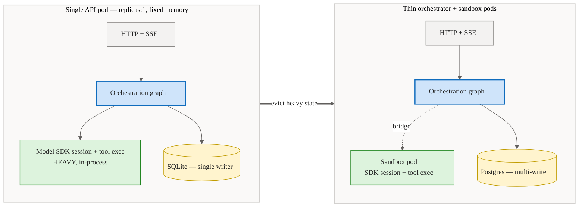
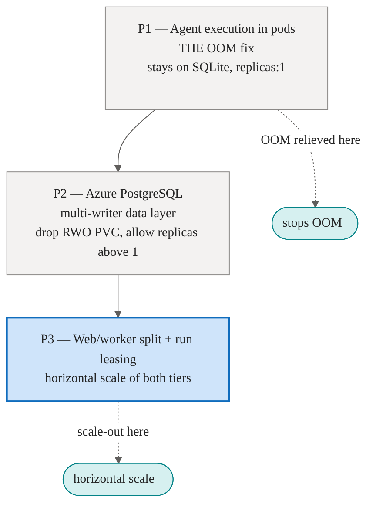
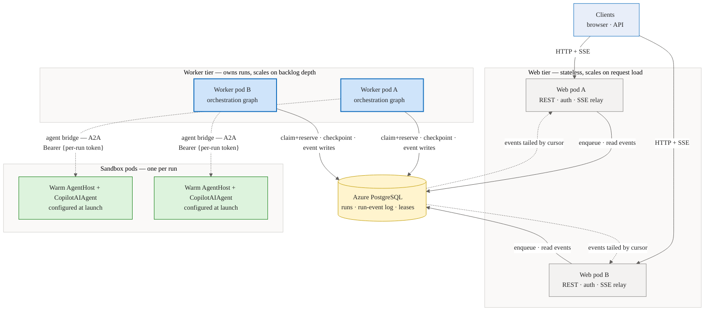
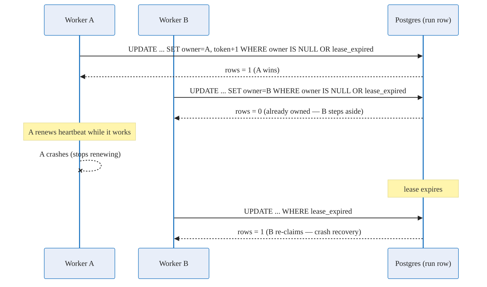
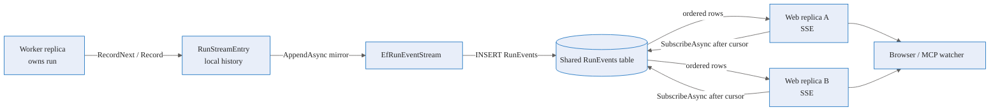

# Distributed Execution & Scaling — Conceptual Deep Dive

## Purpose and Mental Model

Agentweaver starts life as a single API pod that does everything: it serves HTTP and the live event stream, runs the orchestration graph for every run, and writes all durable state to a single-writer SQLite file. That shape is simple and correct for one instance, but it has a ceiling. This document tells the **scaling story** — why the single pod has to give way, and the phased path that turns one vertical box into a horizontally scalable system.

The mental model has three moving parts:

1. **A data layer** that can take writes from more than one process at a time.
2. **A topology** that separates the work that fans out widely (serving API and event streams) from the work that must own a run end-to-end (the orchestration loop).
3. **A coordination primitive** — a durable lease — that lets many identical worker processes share the pool of runs without two of them ever grabbing the same one.

A rebuild should keep these three concerns distinct. The data layer answers "where does state live and who may write it?"; the topology answers "which process does which job?"; and leasing answers "who owns this run right now?".

This page is concept-first. For the exhaustive store inventory, schema additions, and provisioning notes see [Scaling data layer reference](../reference/scaling-data-layer.md); for the operator's view see [Scaling operations](../experience/scaling-operations.md).

## Why move off the single API pod

Two pressures push execution out of one process, and they turn out to be the *same* fix.

### Memory: the OOM

The single pod runs every run's heavy execution state **in-process**. Each active run holds a live model SDK session, an in-process orchestration graph, per-run event channels, and a bounded in-memory history of recently completed runs. Memory therefore scales with *concurrent + recently-completed runs* multiplied by *(SDK session + graph + event history)*. Inside a fixed container memory limit, enough parallel runs eventually exhaust it and the pod is OOM-killed.

The pod cannot simply be scaled out to relieve the pressure, because the data layer underneath it is single-writer SQLite on a ReadWriteOnce volume. That constraint pins the deployment to one replica with a recreate (not rolling) update strategy, so the old pod releases the disk before the new one attaches. Vertical growth is the only lever, and it has run out.

### Isolation: the security boundary

Separately, each run's tool, shell, and model execution wants its own isolation boundary so that one run cannot observe or interfere with another. The natural place to put that boundary is a per-run sandbox pod.

The key insight is that **memory relief and isolation are the same move**. Relocating the heavy execution — the model SDK session, the in-pod runner, and tool/shell/file execution — into a per-run [sandbox pod](./sandbox-pod-execution.md) simultaneously evicts the dominant per-run footprint from the API process *and* gives each run its own isolated boundary. After the move, the API tier becomes a thin orchestrator: HTTP, event relay, and database. This is the foundation everything else builds on.

## The phased rollout

The scaling story did not land in one release. It is **three phases that are now implemented in the codebase**, each independently shippable and each gated by a flag (`Sandbox:AgentExecutionMode`, `Database:Provider`, `App:Role`) that defaults to the simple single-process shape, so any step can be reverted instantly.

### P1 — agent execution in pods (the OOM fix)

P1 relocates only the heavy execution into sandbox pods over a thin agent bridge (the `RemoteAgentProxy` → AgentHost A2A seam, enabled by `Sandbox:AgentExecutionMode=pod-per-run`). It keeps a **single** orchestrating process and the existing SQLite file. This is deliberate and safe: the pod is a *compute satellite*, never a database writer. The `RemoteAgentProxy` carries no `ICheckpointStore` and the pod opens no database connection, so every checkpoint and run-event write is proxied back through the one worker, which remains the sole owner of durable state. Because there is still exactly one writer, SQLite's single-writer invariant holds and nothing forces Postgres yet.

P1 stops the OOM on its own. The dominant per-run footprint — the live model session plus its tool buffers — leaves the API process and dies with the pod. The orchestration graph, the watch loop, and the bounded event history that stay behind are comparatively light. The AgentHost warm pool now runs at `replicas: 2`, so the .NET process and Copilot SDK native binary are pre-warmed before any run starts. Run launch claims a warm pod and calls `/configure`; moving SDK initialization out of the critical path typically removes about 7–20 seconds of cold-start latency, and two concurrent runs can start without waiting for a new AgentHost pod to boot.

The rule that keeps P1 single-writer-safe is precise: the pod must never open a database connection or mount the data volume, all checkpoint and event writes must be proxied through the single worker, and no second orchestrating replica may be added. Only the introduction of a *second writer process* would force the data-layer migration early.

### P2 — Azure Database for PostgreSQL Flexible Server

P2 makes the backing store **provider-aware**, with **Azure Database for PostgreSQL Flexible Server** as the multi-writer target (the current, locked direction). The provider is selected by `Database:Provider`: `postgres`/`postgresql` routes durable state through the EF Core `MemoryDbContext` and its EF-backed stores (`EfRunStore`, `EfRunRevisionStore`, `EfWorkflowRunStore`, `EfBacklogTaskStore`, `EfCastProposalStore`, and `EfRunEventStream`), while the default `sqlite` keeps the single-writer SQLite stores. Once a real multi-writer database is underneath, the ReadWriteOnce data volume can be dropped, the deployment can move from a recreate to a rolling update strategy, and `replicas` can exceed one.

P2 is mostly invisible to end users — the run/review model and the public API and event contracts do not change. What changes is *where* state lives and *who may write it concurrently*. The previously separate raw stores now fold into the single `MemoryDbContext` (which maps `runs`, `run_revisions`, `projects`, `backlog_tasks`, `workflow_runs`, and `cast_proposals` to Postgres tables and `model.Ignore<>()`s them on non-Npgsql providers), so there is one connection story and one migration mechanism; the [data-layer reference](../reference/scaling-data-layer.md) covers exactly which stores move and how.

### P3 — web/worker split + durable run leasing

P3 splits the now-stateless tier by role and adds the coordination primitive that lets many copies of the worker role run at once. The split is real today: `AppRole` reads `App:Role` (env `App__Role`, values `web`/`worker`), and `Program.cs` branches on `isWorker` to wire each tier's concerns. This is where horizontal scale actually arrives, and it is the heart of the topology.

## The web/worker deployment split

Once SQLite is gone, the orchestrator's two jobs have very different scaling shapes, and they are separated into two deployments built from the **same image**, differentiated only by the `App:Role` flag (`web` vs `worker`).

- **Web tier** — serves the REST API, authentication, and the live event (SSE) relay to clients. It is stateless: it holds no run's orchestration graph in memory. It scales with *request and connection load* and can grow freely to N replicas.

- **Worker tier** — owns the orchestration loop. A worker claims a run, runs its orchestration graph in-process, drives the agent turns over the bridge to sandbox pods, and performs the durable checkpoint and run-event writes. It scales with *run backlog depth*, not raw CPU, because claim-then-dispatch work is I/O-bound.

The division of labor is the important idea: **web pods touch clients but never own runs; worker pods own runs but are not on the request hot path.** A client can connect to any web pod and still observe a run that a completely different worker pod is executing — which is exactly what the event fan-out (below) has to make true.

## Durable run leasing

With more than one worker, the central question becomes: **how do N identical workers share one pool of runs without two of them grabbing the same run?** A blind read-modify-write cannot answer this. If two workers both read a run as "unowned" and both write themselves as owner, the last writer wins and the run is dispatched twice — the classic double-dispatch bug. (The run-claim path is now guarded by leasing, below; the analogous subtask-dispatch path — load row, mutate, save with no ownership guard — is **not yet** converted and remains the known multi-replica hazard.)

The fix is a **durable lease** expressed as a *guarded compare-and-set* (CAS) on the work item's row. This is implemented today as `IRunLeaseStore`: the Postgres implementation `PostgresRunLeaseStore` issues a single conditional `ExecuteUpdateAsync` against the `runs` table — claim this run **only if** `owner_id IS NULL OR lease_expires_at < now()`, stamping owner, a fresh deadline, an incremented `fencing_token`, and `attempt` in the same statement. The database guarantees that exactly one worker's update affects a row; every other worker sees zero rows changed and moves on. The winner — and only the winner — proceeds to execute. On non-Postgres single-replica deployments the binding is `NoOpRunLeaseStore`, where every claim trivially succeeds because there is no contention.

Leasing rests on a small set of per-row ideas:

- **Ownership** — which worker currently holds the run (its identity, e.g. a pod name), or nothing if the run is free.
- **Expiry** — a lease deadline. An expired lease is reclaimable by *any* worker even if an owner is still nominally stamped. This is what makes crash recovery automatic: a worker that dies stops renewing, its lease lapses, and another worker re-claims the run.
- **Heartbeat** — a liveness stamp the owner refreshes while it works, so stalls are visible across the fleet rather than only inside one process.
- **A fencing token** — a number that increments on every successful acquisition. A worker must present its token when it writes; a stale (smaller) token is rejected. This stops a paused or zombie former owner from waking up and clobbering a run that has since been re-leased to someone else.

The lease *lifecycle* is owned by `RunWatchLoopService`: on claim it records the `(ownerId, fencingToken)`, runs a background renew loop at half the TTL (`LeaseTtl` = 5 minutes, renew every ~2.5 minutes), and releases on completion or drain. Terminal handlers and `FailRun` first re-check `IsLeaseOwnerAsync` so a worker whose lease was stolen does not finalize a run it no longer owns.

> **Implemented vs. design.** Run-level leasing on the `runs` row (`owner_id`, `lease_expires_at`, `heartbeat_at`, `fencing_token`, `attempt`) is implemented. Extending the same guarded CAS to **subtask dispatch** — and the `(coordinator, subtask, attempt)` dispatch-idempotency record below — is **not yet implemented**; it remains the outstanding hardening item for safe multi-worker coordinator fan-out.

A second, related guarantee covers **child dispatch** *(design target, not yet implemented)*: a coordinator that spawns child runs should do so *exactly once* per (coordinator, subtask, attempt), even if it is re-leased mid-flight to another worker. An idempotency record written in the same transaction that flips the subtask to *dispatched* would make redelivery safe — a duplicate attempt simply discovers the existing child and reuses it rather than spawning a second one.

**Affinity is acceptable and even desirable.** Because a worker that holds a lease also holds that run's in-process orchestration graph and its HITL gates, work for a given run prefers to stay on its owning worker. Affinity is an optimization layered on top of leasing, not a replacement for it: the lease remains the source of truth, so if the owning worker dies, any other worker can still take over.

## Run-event fan-out under multiple replicas

The live event stream is what makes a run watchable in real time. In a single process this is easy: the producer writes events into a process-local history and the SSE relay reads from the same process. With multiple replicas, a run can execute on worker A while an SSE client is connected to web pod B. The shipped fix is to make the shared `RunEvents` table the live replay source: every local `RunStreamEntry` append mirrors into `IRunEventStream`, and `EfRunEventStream.SubscribeAsync` polls the shared table by cursor. Source: `apps/Agentweaver.Api/Infrastructure/RunStreamStore.cs:98`, `apps/Agentweaver.Api/Infrastructure/RunStreamStore.cs:115`, `apps/Agentweaver.Api/Infrastructure/EfRunEventStream.cs:15`, `apps/Agentweaver.Api/Infrastructure/EfRunEventStream.cs:77`, `apps/Agentweaver.Api/Infrastructure/EfRunEventStream.cs:96`.

### Current mechanism: durable write-through + cursor polling

`EfRunEventStream` is registered as the Postgres `IRunEventStream` implementation (`Program.cs:534`). Its append path writes through to `RunEvents` before acknowledging, using a serializable transaction and retrying sequence conflicts. Its subscribe path repeatedly loads rows with `Sequence > lastSeen`, yields them in order, and sleeps for `250 ms` only when no new row was emitted. That gives every replica the same live floor: it can stream any run as long as it can read the shared database. Source: `apps/Agentweaver.Api/Program.cs:534`, `apps/Agentweaver.Api/Infrastructure/EfRunEventStream.cs:63`, `apps/Agentweaver.Api/Infrastructure/EfRunEventStream.cs:71`, `apps/Agentweaver.Api/Infrastructure/EfRunEventStream.cs:84`, `apps/Agentweaver.Api/Infrastructure/EfRunEventStream.cs:89`, `apps/Agentweaver.Api/Infrastructure/EfRunEventStream.cs:97`, `apps/Agentweaver.Api/Infrastructure/EfRunEventStream.cs:114`.

The process-local `RunStreamStore` still matters for same-replica compatibility and low-latency waiters, but it is no longer a horizontal-scale boundary. If a web replica does not have a local stream entry, `/api/runs/{id}/stream` falls back to `IRunEventStream.SubscribeAsync` with the `Last-Event-ID` cursor and writes the replayed rows as SSE frames. Source: `apps/Agentweaver.Api/Endpoints/RunEndpoints.cs:416`, `apps/Agentweaver.Api/Endpoints/RunEndpoints.cs:423`, `apps/Agentweaver.Api/Endpoints/RunEndpoints.cs:429`, `apps/Agentweaver.Api/Endpoints/RunEndpoints.cs:431`, `apps/Agentweaver.Api/Endpoints/RunEndpoints.cs:443`.

The regression test `SubscribeAsync_TailsEventsWrittenByAnotherStreamInstance` creates producer and subscriber `EfRunEventStream` instances over the same database and verifies the subscriber receives events appended by the other instance. Source: `tests/Agentweaver.Tests/EfRunEventStreamTests.cs:27`, `tests/Agentweaver.Tests/EfRunEventStreamTests.cs:30`, `tests/Agentweaver.Tests/EfRunEventStreamTests.cs:37`, `tests/Agentweaver.Tests/EfRunEventStreamTests.cs:42`, `tests/Agentweaver.Tests/EfRunEventStreamTests.cs:46`.

### Coordinator refresh race hardening

Multi-replica streaming also made browser refreshes more common while coordinator rows were still being created. The coordinator endpoints now read through brief creation races: outcome-spec GET waits up to three seconds, work-plan GET waits up to five seconds, and confirm re-reads a confirmed spec before returning a conflict. Source: `apps/Agentweaver.Api/Endpoints/CoordinatorEndpoints.cs:53`, `apps/Agentweaver.Api/Endpoints/CoordinatorEndpoints.cs:88`, `apps/Agentweaver.Api/Endpoints/CoordinatorEndpoints.cs:167`, `apps/Agentweaver.Api/Endpoints/CoordinatorEndpoints.cs:571`, `apps/Agentweaver.Api/Endpoints/CoordinatorEndpoints.cs:591`.

## How the pieces reinforce each other

The three concerns are not independent features bolted together — each one unblocks the next:

- Moving execution into pods (P1) is what makes the orchestrator *thin enough* to be stateless.
- A multi-writer database (P2) is what makes "more than one orchestrator" legal at all.
- Leasing is what makes "more than one orchestrator" *safe*, and the lease's owner identity is what affinity and the brokered checkpoint store key off of.
- Event fan-out is what keeps the user experience identical once a run and its watcher can land on different pods.

Take any one away and the rest cannot stand: leasing without a multi-writer store has nothing to coordinate; multiple workers without event fan-out break live watching; pods without a thin orchestrator do not actually relieve the memory pressure that started the whole story.

## Related reading

- [Scaling data layer reference](../reference/scaling-data-layer.md) — the exhaustive store inventory, leasing schema, fan-out mechanism, and provisioning.
- [Scaling operations](../experience/scaling-operations.md) — what scaling looks like to an operator.
- [Sandbox pod execution](./sandbox-pod-execution.md) — where the heavy agent execution actually runs.
- [Agent communication](./agent-communication.md) and the [A2A bridge](./a2a-bridge.md) — how the worker drives an agent turn inside a pod.
- [Data & persistence](./data-persistence.md) — the durable domain model the migration carries forward.
- [Infrastructure & deployment](./infra-deployment.md) and [AKS architecture](../architecture-aks.md) — the cluster this runs on.
