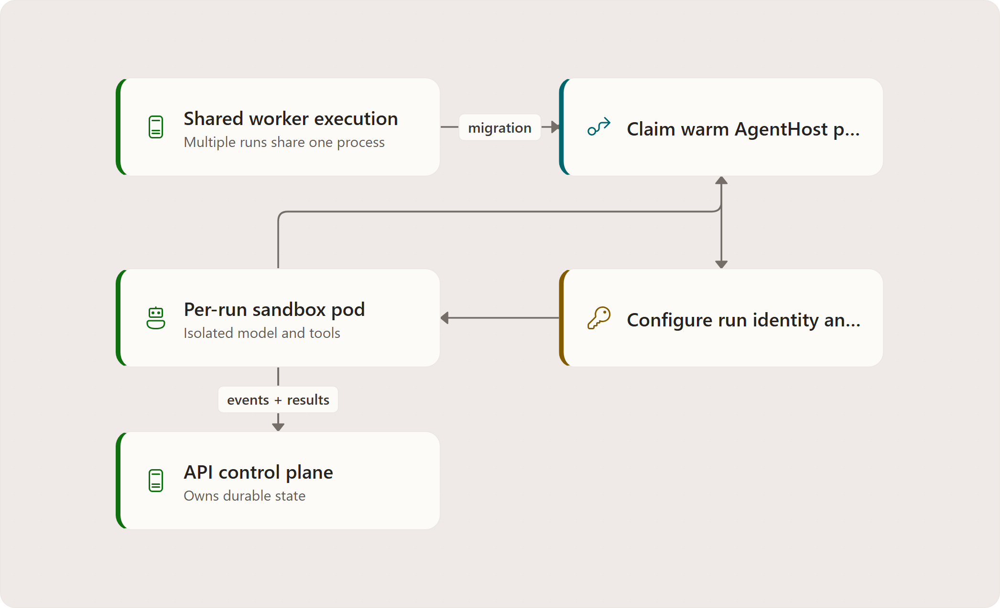
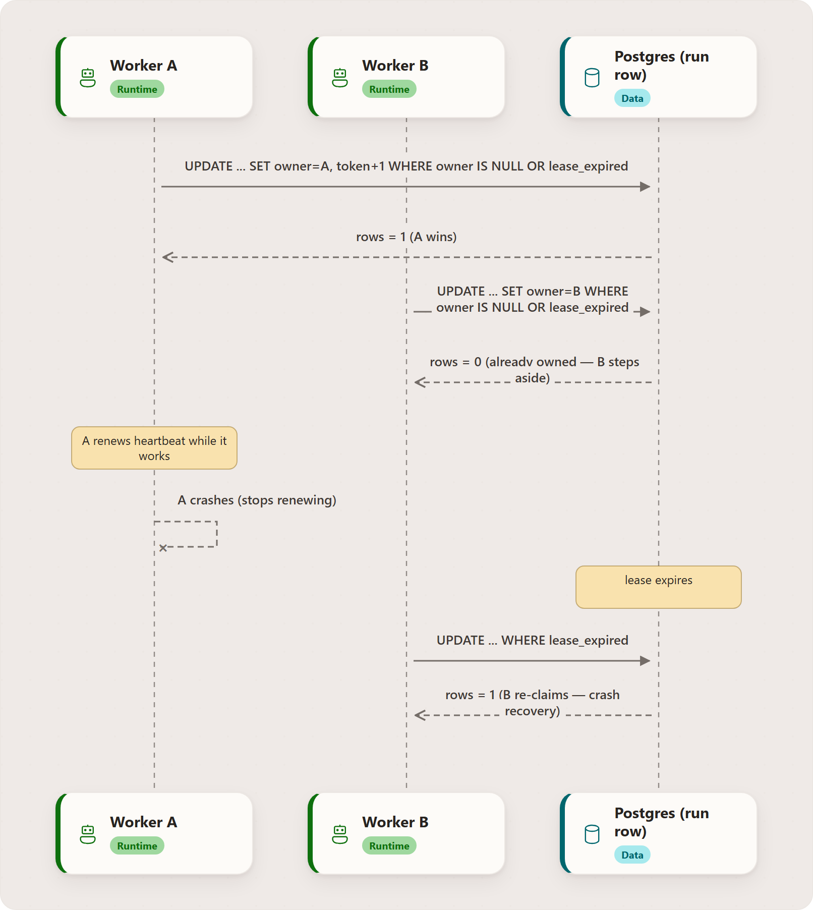

# Distributed Execution & Scaling — Conceptual Deep Dive

## Purpose and Mental Model

Agentweaver uses a web/worker topology for production execution. Web pods serve HTTP and events. Worker pods run orchestration and dispatch work. PostgreSQL stores durable state, and leases prevent duplicate execution across replicas.

The mental model has three moving parts:

1. **A data layer** that can take writes from more than one process at a time.
2. **A topology** that separates the work that fans out widely (serving API and event streams) from the work that must own a run end-to-end (the orchestration loop).
3. **A coordination primitive** — a durable lease — that lets many identical worker processes share the pool of runs without two of them ever grabbing the same one.

A rebuild should keep these three concerns distinct. The data layer answers "where does state live and who may write it?"; the topology answers "which process does which job?"; and leasing answers "who owns this run right now?".

This page is concept-first. For the exhaustive store inventory, schema additions, and provisioning notes see [Scaling data layer reference](../reference/scaling-data-layer.md); for the operator's view see [Scaling operations](../experience/scaling-operations.md).

## Why move off the single API pod

Two pressures push execution out of one process, and they turn out to be the *same* fix.

### Memory: the OOM

The single pod runs every run's heavy execution state **in-process**. Each active run holds a live model SDK session, an in-process orchestration graph, per-run event channels, and a bounded in-memory history of recently completed runs. Memory therefore scales with *concurrent + recently-completed runs* multiplied by *(SDK session + graph + event history)*. Inside a fixed container memory limit, enough parallel runs eventually exhaust it and the pod is OOM-killed.

SQLite remains a local-development option. Production uses PostgreSQL with rolling web and worker deployments, so it can scale beyond one process.

### Isolation: the security boundary

Separately, each run's tool, shell, and model execution wants its own isolation boundary so that one run cannot observe or interfere with another. The natural place to put that boundary is a per-run sandbox pod.

The key insight is that **memory relief and isolation are the same move**. Relocating the heavy execution — the model SDK session, the in-pod runner, and tool/shell/file execution — into a per-run [sandbox pod](./sandbox-pod-execution.md) simultaneously evicts the dominant per-run footprint from the API process *and* gives each run its own isolated boundary. After the move, the API tier becomes a thin orchestrator: HTTP, event relay, and database. This is the foundation everything else builds on.

<!-- Generated from ../diagrams/src/canonical-sandbox-pod-evolution.drawio as editable draw.io XML,
     then exported by the official draw.io Desktop CLI, replacing a Mermaid flowchart.
     Edit the JSON, then run `npm run docs:render-diagrams` and commit the
     regenerated PNG + .hash.txt. -->

## The phased rollout

The current design combines pod-based agent execution, provider-aware persistence, and a web/worker split. `Sandbox:AgentExecutionMode`, `Database:Provider`, and `App:Role` select the runtime topology.

### P1 — agent execution in pods (the OOM fix)

P1 relocates only the heavy execution into sandbox pods over a thin agent bridge (the `RemoteAgentProxy` → AgentHost A2A seam, enabled by `Sandbox:AgentExecutionMode=pod-per-run`). It keeps a **single** orchestrating process and the existing SQLite file. This is deliberate and safe: the pod is a *compute satellite*, never a database writer. The `RemoteAgentProxy` carries no `ICheckpointStore` and the pod opens no database connection, so every checkpoint and run-event write is proxied back through the one worker, which remains the sole owner of durable state. Because there is still exactly one writer, SQLite's single-writer invariant holds and nothing forces Postgres yet.

P1 stops the OOM on its own. The dominant per-run footprint — the live model session plus its tool buffers — leaves the API process and dies with the pod. The orchestration graph, the watch loop, and the bounded event history that stay behind are comparatively light. The AgentHost warm pool now runs at `replicas: 2`, so the .NET process and Copilot SDK native binary are pre-warmed before any run starts. Run launch claims a warm pod and calls `/configure`; moving SDK initialization out of the critical path typically removes about 7–20 seconds of cold-start latency, and two concurrent runs can start without waiting for a new AgentHost pod to boot.

The rule that keeps P1 single-writer-safe is precise: the pod must never open a database connection or mount the data volume, all checkpoint and event writes must be proxied through the single worker, and no second orchestrating replica may be added. Only the introduction of a *second writer process* would force the data-layer migration early.

### P2 — Azure Database for PostgreSQL Flexible Server

The backing store is provider-aware. `Database:Provider=postgres` or `postgresql` routes durable state through `MemoryDbContext` and EF-backed stores, including `EfRunEventStream`. SQLite remains available for local development. Production uses Azure Database for PostgreSQL Flexible Server with rolling deployments.

P2 is mostly invisible to end users — the run/review model and the public API and event contracts do not change. What changes is *where* state lives and *who may write it concurrently*. The previously separate raw stores now fold into the single `MemoryDbContext` (which maps `runs`, `run_revisions`, `projects`, `backlog_tasks`, `workflow_runs`, and `cast_proposals` to Postgres tables and `model.Ignore<>()`s them on non-Npgsql providers), so there is one connection story and one migration mechanism; the [data-layer reference](../reference/scaling-data-layer.md) covers exactly which stores move and how.

### P3 — web/worker split + durable run leasing

P3 separates public surfaces and orchestration deployment responsibilities and adds durable coordination. `AppRole` reads `App:Role` (env `App__Role`, values `web`/`worker`), but role selection alone is not a prohibition on background orchestration: `CoordinatorHeartbeatService` is registered independently and its pickup loop uses `Coordinator:HeartbeatEnabled`. Workers still hold graphs in memory.

## The web/worker deployment split

Once SQLite is gone, the orchestrator's two jobs have very different scaling shapes, and they are separated into two deployments built from the **same image**, differentiated only by the `App:Role` flag (`web` vs `worker`).

- **Web tier** — serves REST, authentication and SSE. This is the public deployment responsibility, not a claim that `App:Role=web` disables every background service.

- **Worker tier** — claims runs, holds orchestration graphs, drives remote leaf turns, and writes checkpoints/events. The shipped HPA uses **CPU 70% and memory 80%, with 2-3 replicas**. Backlog-driven KEDA is a proposed alternative, not the active scaling mechanism; its global queued-run gauge would use `max`, not a sum across replicas.

The intended division is public request handling versus orchestration ownership. Background pickup is independently enabled, so do not interpret this as a hard role-isolation guarantee. A client can observe events through a different web replica using the shared durable stream.

<!-- Generated from ../diagrams/src/distributed-execution-scaling-fig3.drawio as editable draw.io XML,
     then exported by the official draw.io Desktop CLI, replacing a Mermaid flowchart.
     Edit the JSON, then run `npm run docs:render-diagrams` and commit the
     regenerated PNG + .hash.txt. -->

## Durable run leasing

With more than one worker, the central question becomes: **how do identical workers share one pool of runs without duplicate execution?** Durable leases guard both run ownership and coordinator dispatch. A guarded compare-and-set selects one worker to execute each item.

The fix is a **durable lease** expressed as a *guarded compare-and-set* (CAS) on the work item's row. This is implemented today as `IRunLeaseStore`: the Postgres implementation `PostgresRunLeaseStore` issues a single conditional `ExecuteUpdateAsync` against the `runs` table — claim this run **only if** `owner_id IS NULL OR lease_expires_at < now()`, stamping owner, a fresh deadline, an incremented `fencing_token`, and `attempt` in the same statement. The database guarantees that exactly one worker's update affects a row; every other worker sees zero rows changed and moves on. The winner — and only the winner — proceeds to execute. On non-Postgres single-replica deployments the binding is `NoOpRunLeaseStore`, where every claim trivially succeeds because there is no contention.

Leasing rests on a small set of per-row ideas:

- **Ownership** — which worker currently holds the run (its identity, e.g. a pod name), or nothing if the run is free.
- **Expiry** — a lease deadline. An expired lease is reclaimable by *any* worker even if an owner is still nominally stamped. This is what makes crash recovery automatic: a worker that dies stops renewing, its lease lapses, and another worker re-claims the run.
- **Heartbeat** — a liveness stamp the owner refreshes while it works, so stalls are visible across the fleet rather than only inside one process.
- **A fencing token** — increments on successful acquisition. Renew/release require the matching owner/token, and terminal paths check active ownership. This is not a guarantee that every write is atomically fenced or execution is exactly once. Failed renewal logs a warning; it does not itself immediately cancel all work.

<!-- Generated from ../diagrams/src/distributed-execution-scaling-fig5.drawio as editable draw.io XML,
     then exported by the official draw.io Desktop CLI, replacing Mermaid.
     Edit the JSON, then run `npm run docs:render-diagrams` and commit the
     regenerated PNG + .hash.txt. -->

The lease *lifecycle* is owned by `RunWatchLoopService`: on claim it records the `(ownerId, fencingToken)`, runs a background renew loop at half the TTL (`LeaseTtl` = 5 minutes, renew every ~2.5 minutes), and releases on completion or drain. Terminal handlers and `FailRun` first re-check `IsLeaseOwnerAsync` so a worker whose lease was stolen does not finalize a run it no longer owns.

Coordinator dispatch also acquires a database compare-and-set lease through `WorkPlan.CoordinatorPodId`. Only the worker that acquires this lease starts the dispatch loop.

**Affinity is acceptable and even desirable.** Because a worker that holds a lease also holds that run's in-process orchestration graph and its HITL gates, work for a given run prefers to stay on its owning worker. Affinity is an optimization layered on top of leasing, not a replacement for it: the lease remains the source of truth, so if the owning worker dies, any other worker can still take over.

## Run-event fan-out under multiple replicas

The live event stream is what makes a run watchable in real time. In a single process this is easy: the producer writes events into a process-local history and the SSE relay reads from the same process. With multiple replicas, a run can execute on worker A while an SSE client is connected to web pod B. The shipped fix is to make the shared `RunEvents` table the live replay source: every local `RunStreamEntry` append mirrors into `IRunEventStream`, and `EfRunEventStream.SubscribeAsync` polls the shared table by cursor. Source: `apps/Agentweaver.Api/Infrastructure/RunStreamStore.cs:98`, `apps/Agentweaver.Api/Infrastructure/RunStreamStore.cs:115`, `apps/Agentweaver.Api/Infrastructure/EfRunEventStream.cs:15`, `apps/Agentweaver.Api/Infrastructure/EfRunEventStream.cs:77`, `apps/Agentweaver.Api/Infrastructure/EfRunEventStream.cs:96`.

### Current mechanism: durable write-through + cursor polling

`EfRunEventStream` writes through before acknowledging. PostgreSQL uses a
**ReadCommitted transaction plus a per-run advisory transaction lock**, then
allocates `MAX+1` for an automatic sequence, inserts and commits. `RecordNext`
requests allocation with sequence zero and only then updates local history and
signals local waiters. Explicit historical sequence values are idempotent for
identical content and reject conflicting content; not every append mode promises
gaplessness. Subscribers read `Sequence > lastSeen` in order and wait 250 ms only
when empty. There is no PostgreSQL `NOTIFY` or cross-replica notification bus.
Source: `apps/Agentweaver.Api/Infrastructure/EfRunEventStream.cs:224-288`,
`:409-419`, `apps/Agentweaver.Api/Infrastructure/RunStreamStore.cs:183-234`.

<!-- Generated from ../diagrams/src/distributed-execution-scaling-fig4.drawio as editable draw.io XML,
     then exported by the official draw.io Desktop CLI.
     Edit the JSON, then run `npm run docs:render-diagrams` and commit the
     regenerated PNG + .hash.txt. -->

The process-local `RunStreamStore` still matters for same-replica compatibility and low-latency waiters, but it is no longer a horizontal-scale boundary. If a web replica does not have a local stream entry, `/api/runs/{id}/stream` falls back to `IRunEventStream.SubscribeAsync` with the `Last-Event-ID` cursor and writes the replayed rows as SSE frames. Source: `apps/Agentweaver.Api/Endpoints/RunEndpoints.cs:416`, `apps/Agentweaver.Api/Endpoints/RunEndpoints.cs:423`, `apps/Agentweaver.Api/Endpoints/RunEndpoints.cs:429`, `apps/Agentweaver.Api/Endpoints/RunEndpoints.cs:431`, `apps/Agentweaver.Api/Endpoints/RunEndpoints.cs:443`.

The regression test `SubscribeAsync_TailsEventsWrittenByAnotherStreamInstance` creates producer and subscriber `EfRunEventStream` instances over the same database and verifies the subscriber receives events appended by the other instance. Source: `tests/Agentweaver.Tests/EfRunEventStreamTests.cs:27`, `tests/Agentweaver.Tests/EfRunEventStreamTests.cs:30`, `tests/Agentweaver.Tests/EfRunEventStreamTests.cs:37`, `tests/Agentweaver.Tests/EfRunEventStreamTests.cs:42`, `tests/Agentweaver.Tests/EfRunEventStreamTests.cs:46`.

### Coordinator refresh race hardening

Multi-replica streaming also made browser refreshes more common while coordinator rows were still being created. The coordinator endpoints now read through brief creation races: outcome-spec GET waits up to three seconds, work-plan GET waits up to five seconds, and confirm re-reads a confirmed spec before returning a conflict. Source: `apps/Agentweaver.Api/Endpoints/CoordinatorEndpoints.cs:53`, `apps/Agentweaver.Api/Endpoints/CoordinatorEndpoints.cs:88`, `apps/Agentweaver.Api/Endpoints/CoordinatorEndpoints.cs:167`, `apps/Agentweaver.Api/Endpoints/CoordinatorEndpoints.cs:571`, `apps/Agentweaver.Api/Endpoints/CoordinatorEndpoints.cs:591`.

## How the pieces reinforce each other

The three concerns are not independent features bolted together — each one unblocks the next:

- Moving execution into pods (P1) removes heavy leaf state; the orchestration graph remains in the hosting process.
- A multi-writer database (P2) is what makes "more than one orchestrator" legal at all.
- Leasing is what makes "more than one orchestrator" *safe*, and the lease's owner identity is what affinity and the brokered checkpoint store key off of.
- Event fan-out is what keeps the user experience identical once a run and its watcher can land on different pods.

Take any one away and the rest cannot stand: leasing without a multi-writer store has nothing to coordinate; multiple workers without event fan-out break live watching; pods without a thin orchestrator do not actually relieve the memory pressure that started the whole story.

## Related reading

- [Scaling data layer reference](../reference/scaling-data-layer.md) — the exhaustive store inventory, leasing schema, fan-out mechanism, and provisioning.
- [Scaling operations](../experience/scaling-operations.md) — what scaling looks like to an operator.
- [Sandbox pod execution](./sandbox-pod-execution.md) — where the heavy agent execution actually runs.
- [Agent communication](./agent-communication.md) and the [A2A bridge](./a2a-bridge.md) — how the worker drives an agent turn inside a pod.
- [Data & persistence](./data-persistence.md) — the durable domain model the migration carries forward.
- [Infrastructure & deployment](./infra-deployment.md) and [AKS architecture](../guide/architecture-aks.md) — the cluster this runs on.

<!-- diagram-context:canonical-sandbox-pod-evolution:start -->

Diagram details and constraints

<table><thead><tr><th>Element</th><th>Contract</th></tr></thead><tbody>
<tr><td>title</td><td>Move heavy leaf state, keep orchestration</td></tr>
<tr><td>takeaway</td><td>Remoting compute and migrating the database are independent changes.</td></tr>
<tr><td>Before: worker graph</td><td>Before: worker graph</td></tr>
<tr><td>Before: worker graph</td><td>Workflow and gates</td></tr>
<tr><td>Before: worker graph</td><td>Same host as live leaf state</td></tr>
<tr><td>Before: live SDK</td><td>Before: live SDK</td></tr>
<tr><td>Before: live SDK</td><td>Provider session in worker</td></tr>
<tr><td>Before: live SDK</td><td>Heavy per-run footprint</td></tr>
<tr><td>Command sandbox</td><td>Command sandbox</td></tr>
<tr><td>Command sandbox</td><td>Individual shell commands</td></tr>
<tr><td>Command sandbox</td><td>Separate executor seam</td></tr>
<tr><td>Now: worker graph</td><td>Now: worker graph</td></tr>
<tr><td>Now: worker graph</td><td>Workflow and checkpoints</td></tr>
<tr><td>Now: worker graph</td><td>Keeps orchestration ownership</td></tr>
<tr><td>Remote leaf proxy</td><td>Remote leaf proxy</td></tr>
<tr><td>Remote leaf proxy</td><td>Claim/configure then A2A</td></tr>
<tr><td>Remote leaf proxy</td><td>No database migration implied</td></tr>
<tr><td>Per-run AgentHost</td><td>Per-run AgentHost</td></tr>
<tr><td>Per-run AgentHost</td><td>Live SDK + controlled tools</td></tr>
<tr><td>Per-run AgentHost</td><td>Kata pod with executor sidecar</td></tr>
<tr><td>arrow-1</td><td>invoke</td></tr>
<tr><td>arrow-2</td><td>command</td></tr>
<tr><td>arrow-4</td><td>A2A</td></tr>
<tr><td>note-0</td><td>Top: earlier host-local leaf. Bottom: pod-per-run execution.</td></tr>
<tr><td>note-1</td><td>P1 can retain one SQLite writer; multiple writers require suitable shared storage.</td></tr>
<tr><td>note-2</td><td>Graph-level gates stay host-side; pod-local tool approval has a return path.</td></tr>
<tr><td>notes</td><td>Top: earlier host-local leaf. Bottom: pod-per-run execution.; P1 can retain one SQLite writer; multiple writers require suitable shared storage.; Graph-level gates stay host-side; pod-local tool approval has a return path.</td></tr>
</tbody></table>

<!-- diagram-context:canonical-sandbox-pod-evolution:end -->

<!-- diagram-context:distributed-execution-scaling-fig3:start -->

Diagram details and constraints

<table><thead><tr><th>Element</th><th>Contract</th></tr></thead><tbody>
<tr><td>title</td><td>Logical roles and the shipped autoscaler</td></tr>
<tr><td>takeaway</td><td>Separate public traffic and orchestration responsibility without claiming hard role isolation.</td></tr>
<tr><td>Clients</td><td>Clients</td></tr>
<tr><td>Clients</td><td>HTTP and SSE</td></tr>
<tr><td>Clients</td><td>Reconnect with event cursor</td></tr>
<tr><td>Web/API deployment</td><td>Web/API deployment</td></tr>
<tr><td>Web/API deployment</td><td>Public REST/auth/event surface</td></tr>
<tr><td>Web/API deployment</td><td>Background pickup independent</td></tr>
<tr><td>PostgreSQL</td><td>PostgreSQL</td></tr>
<tr><td>PostgreSQL</td><td>Shared state and event cursors</td></tr>
<tr><td>PostgreSQL</td><td>Both roles can write</td></tr>
<tr><td>Worker HPA</td><td>Worker HPA</td></tr>
<tr><td>Worker HPA</td><td>CPU 70% + memory 80%</td></tr>
<tr><td>Worker HPA</td><td>Shipped range: 2-3 replicas</td></tr>
<tr><td>Worker deployment</td><td>Worker deployment</td></tr>
<tr><td>Worker deployment</td><td>Owns in-process graphs</td></tr>
<tr><td>Worker deployment</td><td>Run leases / checkpoints / events</td></tr>
<tr><td>AgentHost pods</td><td>AgentHost pods</td></tr>
<tr><td>AgentHost pods</td><td>Heavy per-run leaf execution</td></tr>
<tr><td>AgentHost pods</td><td>A2A output returns to host</td></tr>
<tr><td>arrow-1</td><td>HTTP</td></tr>
<tr><td>arrow-2</td><td>state</td></tr>
<tr><td>arrow-3</td><td>persist</td></tr>
<tr><td>arrow-4</td><td>scale</td></tr>
<tr><td>arrow-5</td><td>A2A</td></tr>
<tr><td>note-0</td><td>App:Role does not alone disable CoordinatorHeartbeatService pickup.</td></tr>
<tr><td>note-1</td><td>Backlog-driven KEDA is a proposed alternative, not the active HPA.</td></tr>
<tr><td>note-2</td><td>SQL run leases and Kubernetes SandboxClaims are different mechanisms.</td></tr>
<tr><td>notes</td><td>App:Role does not alone disable CoordinatorHeartbeatService pickup.; Backlog-driven KEDA is a proposed alternative, not the active HPA.; SQL run leases and Kubernetes SandboxClaims are different mechanisms.</td></tr>
</tbody></table>

<!-- diagram-context:distributed-execution-scaling-fig3:end -->

<!-- diagram-context:distributed-execution-scaling-fig4:start -->

Diagram details and constraints

<table><thead><tr><th>Element</th><th>Contract</th></tr></thead><tbody>
<tr><td>title</td><td>Durable allocation, then cursor replay</td></tr>
<tr><td>takeaway</td><td>Cross-replica delivery polls shared rows; local notifications are not a distributed bus.</td></tr>
<tr><td>RecordNext</td><td>RecordNext</td></tr>
<tr><td>RecordNext</td><td>Request sequence allocation</td></tr>
<tr><td>RecordNext</td><td>Append with Sequence = 0</td></tr>
<tr><td>EF append</td><td>EF append</td></tr>
<tr><td>EF append</td><td>ReadCommitted + advisory lock</td></tr>
<tr><td>EF append</td><td>Serialize allocation per run</td></tr>
<tr><td>RunEvents</td><td>RunEvents</td></tr>
<tr><td>RunEvents</td><td>MAX+1 / insert / commit</td></tr>
<tr><td>RunEvents</td><td>Return assigned sequence</td></tr>
<tr><td>Local history</td><td>Local history</td></tr>
<tr><td>Local history</td><td>Updated after durable ack</td></tr>
<tr><td>Local history</td><td>Notify only local waiters</td></tr>
<tr><td>Web replica A</td><td>Web replica A</td></tr>
<tr><td>Web replica A</td><td>Read Sequence &gt; lastSeen</td></tr>
<tr><td>Web replica A</td><td>250 ms delay only when empty</td></tr>
<tr><td>Browser watcher</td><td>Browser watcher</td></tr>
<tr><td>Browser watcher</td><td>SSE sequence IDs</td></tr>
<tr><td>Browser watcher</td><td>Remember last event cursor</td></tr>
<tr><td>Reconnect cursor</td><td>Reconnect cursor</td></tr>
<tr><td>Reconnect cursor</td><td>Last-Event-ID</td></tr>
<tr><td>Reconnect cursor</td><td>Not tied to original web pod</td></tr>
<tr><td>Web replica B</td><td>Web replica B</td></tr>
<tr><td>Web replica B</td><td>Ordered replay and live tail</td></tr>
<tr><td>Web replica B</td><td>Read same shared RunEvents</td></tr>
<tr><td>Resumed watcher</td><td>Resumed watcher</td></tr>
<tr><td>Resumed watcher</td><td>Receive rows after cursor</td></tr>
<tr><td>Resumed watcher</td><td>No PostgreSQL NOTIFY required</td></tr>
<tr><td>arrow-1</td><td>append</td></tr>
<tr><td>arrow-2</td><td>commit</td></tr>
<tr><td>arrow-3</td><td>ack</td></tr>
<tr><td>arrow-4</td><td>poll</td></tr>
<tr><td>arrow-5</td><td>SSE</td></tr>
<tr><td>arrow-6</td><td>resume</td></tr>
<tr><td>note-0</td><td>Rows: write-through / live delivery / reconnect on another replica.</td></tr>
<tr><td>note-1</td><td>Explicit historic sequence: identical content is idempotent; conflicts fail.</td></tr>
<tr><td>note-2</td><td>SQL commits before local history update; polling reads the shared table.</td></tr>
<tr><td>notes</td><td>Rows: write-through / live delivery / reconnect on another replica.; Explicit historic sequence: identical content is idempotent; conflicts fail.; SQL commits before local history update; polling reads the shared table.</td></tr>
</tbody></table>

<!-- diagram-context:distributed-execution-scaling-fig4:end -->

<!-- diagram-context:distributed-execution-scaling-fig5:start -->

Diagram details and constraints

<table><thead><tr><th>Element</th><th>Contract</th></tr></thead><tbody>
<tr><td>title</td><td>One lease winner, bounded ownership</td></tr>
<tr><td>takeaway</td><td>Conditional acquisition and fencing guard lease operations and terminal ownership checks.</td></tr>
<tr><td>Worker A claims</td><td>Worker A claims</td></tr>
<tr><td>Worker A claims</td><td>Conditional update</td></tr>
<tr><td>Worker A claims</td><td>Unowned or expired row only</td></tr>
<tr><td>Run row</td><td>Run row</td></tr>
<tr><td>Run row</td><td>Owner + expiry + heartbeat</td></tr>
<tr><td>Run row</td><td>Increment fencing token / attempt</td></tr>
<tr><td>Worker B contends</td><td>Worker B contends</td></tr>
<tr><td>Worker B contends</td><td>Zero affected rows</td></tr>
<tr><td>Worker B contends</td><td>No second winner for that claim</td></tr>
<tr><td>A renews</td><td>A renews</td></tr>
<tr><td>A renews</td><td>Match owner and token t</td></tr>
<tr><td>A renews</td><td>5 min TTL / half-TTL renewal</td></tr>
<tr><td>A stops renewing</td><td>A stops renewing</td></tr>
<tr><td>A stops renewing</td><td>Crash or loss of ownership</td></tr>
<tr><td>A stops renewing</td><td>Expired lease becomes claimable</td></tr>
<tr><td>B takes over</td><td>B takes over</td></tr>
<tr><td>B takes over</td><td>Successful conditional update</td></tr>
<tr><td>B takes over</td><td>Token increases to t+1</td></tr>
<tr><td>arrow-1</td><td>CAS</td></tr>
<tr><td>arrow-3</td><td>expires</td></tr>
<tr><td>arrow-4</td><td>claim</td></tr>
<tr><td>note-0</td><td>Stale renew/release fail; terminal paths recheck active ownership.</td></tr>
<tr><td>note-1</td><td>Failed renewal logs a warning; it does not itself cancel all execution.</td></tr>
<tr><td>note-2</td><td>Do not infer exactly-once execution or fencing of every application write.</td></tr>
<tr><td>notes</td><td>Stale renew/release fail; terminal paths recheck active ownership.; Failed renewal logs a warning; it does not itself cancel all execution.; Do not infer exactly-once execution or fencing of every application write.</td></tr>
</tbody></table>

<!-- diagram-context:distributed-execution-scaling-fig5:end -->
