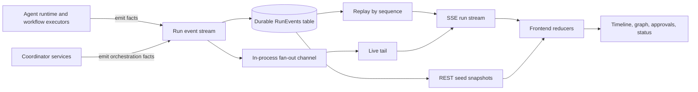
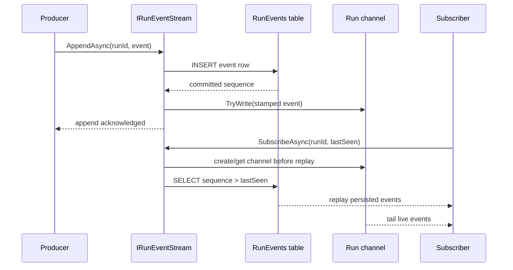
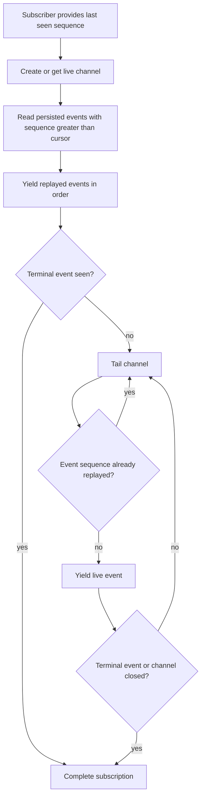
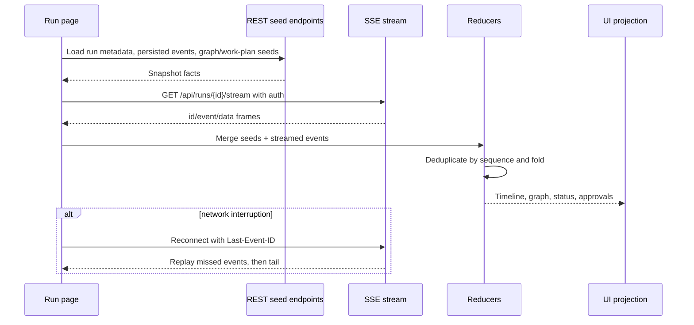
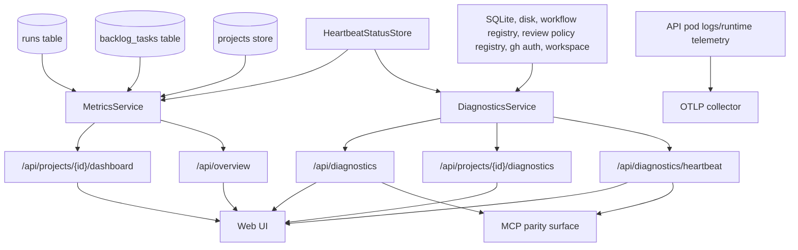

# Events & Observability — Conceptual Deep Dive

## Purpose and Mental Model

Agentweaver treats a run as an ordered stream of facts. The run's state is not just the latest row in a database, and the live UI is not just a websocket-like chat transcript. The durable, replayable event stream is the shared language between:

1. agent/runtime producers,
2. workflow and coordinator orchestration,
3. the SQLite-backed run-event log,
4. SSE clients,
5. frontend reducers,
6. diagnostics and dashboard surfaces, and
7. operators trying to understand what happened.

The foundational mental model is **everything important is an event**. An event says "this happened" rather than "the screen should look like this." Clients and dashboards then project those facts into timelines, graphs, approvals, health summaries, and operational metrics.



This is why run observability is not bolted on after execution. The event stream is part of execution. A run that cannot explain itself is operationally incomplete.

Where this lives:

- `packages/Agentweaver.Domain/RunEvent.cs`
- `packages/Agentweaver.Domain/EventTypes.cs`
- `apps/Agentweaver.Api/Infrastructure`
- `apps/Agentweaver.Api/Endpoints/RunEndpoints.cs`
- `apps/Agentweaver.Api/Diagnostics`
- `apps/Agentweaver.Api/Metrics`
- `apps/web/src/api/sse.ts`
- `apps/web/src/timeline`

## Why Event Sourcing Here?

Agentweaver runs are long-lived, interactive, failure-prone workflows. They can stream model deltas, call tools, wait for human approval, spawn coordinator children, recover after API restart, and finish hours after they were created. A single mutable "status" value is not enough to answer:

- what did the agent say before it failed?
- which tool call needed approval?
- did RAI warn before assembly?
- which coordinator child asked this question?
- what graph shape did the server publish?
- what should a refreshed browser replay?
- what happened before the API process restarted?

Event sourcing solves this by making the timeline itself authoritative. Mutable run rows still matter for control-plane state, but the event log is the authoritative explanation of the run's observable behavior.

The design goals are:

- **Durability before visibility**: an event is written to SQLite before live subscribers see it.
- **Run-local ordering**: each run has monotonically increasing sequence numbers.
- **Replayability**: clients can reopen a completed or restarted run and rebuild the same projection.
- **Low-latency liveness**: active subscribers receive events through an in-process channel instead of polling SQLite.
- **Cursor-based recovery**: reconnecting clients resume after the last sequence they saw.
- **Projection freedom**: different consumers can fold the same events into timelines, graphs, metrics, or coordinator state.

The trade-off is intentional: the stream model makes consumers a little more disciplined, but it makes the system far easier to debug and recover.

## Event Shape and Event Types

The core event schema is deliberately small:

```text
RunEvent
  sequence: run-local integer cursor
  type: stable string such as "agent.message" or "coordinator.graph"
  payload: event-specific JSON-compatible object
```

The sequence is transport and replay metadata. The type is the semantic contract. The payload is typed by convention and by the consumers that understand that event family.

Conceptually, event types fall into families:

| Family | What it explains | Example types |
| --- | --- | --- |
| Run lifecycle | Whether execution started, completed, failed, degraded, cancelled, or became assemble-ready | `run.started`, `run.completed`, `run.failed`, `run.degraded`, `run.assemble_ready` |
| Agent conversation | Agent turns, messages, deltas, intent, and outcome reporting | `agent.message`, `agent.message.delta`, `agent.intent`, `run.outcome` |
| Tooling and gates | Tool calls, tool results, tool errors, approval requests, auto-approval, and questions | `tool.call`, `tool.result`, `tool.error`, `tool.approval_required`, `tool.auto_approved`, `agent.question_asked` |
| Review and merge | Human review gates and repository integration | `review.requested`, `review.approved`, `review.declined`, `merge.started`, `merge.completed`, `merge.failed` |
| Workflow graph | Server-authored graph descriptors and step transitions | `run.workflow_graph`, `workflow.step` |
| RAI and safety | RAI verdicts and degraded-but-continuing conditions | `rai.verdict`, `run.degraded` |
| Coordinator orchestration | Outcome specs, work plans, topology, child lifecycle, steering, and assembly | `coordinator.started`, `coordinator.work_plan`, `coordinator.topology`, `subtask.dispatched`, `coordinator.assembly_completed` |

The important rebuild rule is to keep event types **domain-shaped**, not UI-shaped. For example, emit "tool approval required" with the request identity and message; let the frontend decide how to render an approval card. Emit a coordinator topology snapshot or delta; let the frontend render the graph without inventing scheduling rules.

### Payload discipline

Payloads should be complete enough for a consumer to understand the event without reading transient process memory. That means identifiers matter: run id, child run id, subtask id, request id, work plan id, graph id, and status values should travel with the event that needs them.

At the same time, payloads should avoid becoming a second database. Large or durable objects should be referenced by id or by a focused snapshot contract. The event log explains observable transitions; the operational and memory stores hold broader durable state.

## Durable Stream Architecture

The run-event stream has two layers:

1. **SQLite write-through** for crash-safe durability.
2. **In-process channel fan-out** for low-latency live subscribers.

The ordering is the essence of the design: write first, publish second.



The `RunEvents` table is in the EF-backed memory database. Its conceptual columns are:

- run id,
- sequence,
- event type,
- payload JSON,
- created timestamp.

The unique invariant is `(run id, sequence)`. That is what makes the stream replayable and deduplicatable. If a producer supplies a positive sequence, the stream honors it and inserts idempotently. If the producer does not supply one, the stream assigns the next run-local sequence.

The live channel is bounded. That sounds risky until you remember the layers: the channel is an optimization, not the source of truth. If a slow subscriber misses a live copy, it can recover from SQLite on reconnect.

## Replay-Then-Tail

Subscribing to a run is not "start listening from now." It is:

1. create or find the live channel,
2. replay durable events after the caller's cursor,
3. remember the highest sequence replayed,
4. tail the live channel,
5. skip channel events already delivered by replay,
6. stop when a terminal event or channel completion is observed.

This order prevents the classic replay race. If the stream read SQLite first and only then created the live channel, an event appended between those operations could be lost to the subscriber. Agentweaver creates the channel before the database read, so anything not found in the replay is captured by the tail.



The boundary guarantees are:

- **No durable gap**: every acknowledged append is in SQLite.
- **No replay/live gap**: the channel exists before replay begins.
- **No duplicate at the handoff**: live events with sequence at or below the replay watermark are skipped.
- **Clean terminal replay**: a finished run replays its history and then stops.

## SSE Streaming to Clients

The browser consumes run liveness through Server-Sent Events. The live SSE endpoint is:

```text
GET /api/runs/{id}/stream
```

The persisted REST seed endpoint is:

```text
GET /api/runs/{id}/events
```

That distinction matters. The stream endpoint emits SSE frames. The events endpoint returns an ordered JSON list of persisted run events for snapshot seeding.

Each SSE frame uses the run-event sequence as the SSE id:

```text
id: <sequence>
event: <event type>
data: <camelCase payload JSON>

```

When the stream is done, the endpoint writes:

```text
event: done
data: {}

```

The frontend uses a fetch-based SSE reader rather than plain `EventSource` so it can attach authorization headers and control reconnect cursors. On reconnect, the client sends `Last-Event-ID` with the highest sequence it has processed. The backend maps that cursor to replay from events after that sequence.

### Snapshot + stream

The frontend's robust consumption model is **snapshot + stream**:

1. load REST snapshots or seeds that describe the current known state,
2. open the SSE stream,
3. deduplicate by sequence,
4. fold events through pure reducers,
5. stop reconnecting when terminal events prove the run is done.



A rebuild should preserve this split. A completed run should render from persisted events even if no live process is around. An active run should feel live without forcing the client to poll the database.

## Producers and Consumers

Event producers are any component that knows a fact became true:

- agent runners emit messages, deltas, tool calls, tool results, tool errors, sandbox selection, and outcome signals;
- workflow executors emit step transitions and graph snapshots;
- review and merge flows emit human gate and integration events;
- coordinator services emit outcome specs, selected workflows, work plans, child lifecycle, topology, steering, and collective assembly events;
- recovery services can emit recovery facts when they re-arm work after restart.

Consumers should not depend on producer implementation details. They should depend on the event contract:

- the SSE endpoint serializes events to clients;
- the REST seed endpoint returns persisted events;
- frontend reducers fold events into timeline and topology state;
- coordinator watchers can observe child streams and project child facts onto the parent stream;
- diagnostics and metrics use durable stores and heartbeat state to summarize system health.

The rebuild principle is simple: producers append facts; consumers project facts. Avoid consumers that reach into a producer's in-memory state when the event log can answer the question.

## Diagnostics Stack

Diagnostics answer "is the system healthy enough to operate?" They are read-only, executed checks over live state. They do not fabricate success values.

There are four diagnostic surfaces:

1. **Reachability probes**: `/health`, `/api/health`, and `/api/ping` answer basic liveness/readiness questions.
2. **System diagnostics**: `/api/diagnostics` runs global checks and returns API version, process start time, uptime, project/run counts, total duration, and per-check results.
3. **Project diagnostics**: `/api/projects/{id}/diagnostics` checks workspace and project configuration for one project.
4. **Heartbeat diagnostics**: `/api/diagnostics/heartbeat` exposes the coordinator heartbeat's process-lifetime status, recent tick ring buffer, and automation catalog.

Conceptually, each diagnostic check returns:

```text
name
status: pass | warn | fail
detail
duration_ms
```

The check set is intentionally practical:

- SQLite can execute a trivial query.
- The data directory is writable.
- Built-in workflow and review policy definitions load.
- Coordinator heartbeat is enabled and has ticked recently.
- Project store listing works.
- GitHub CLI authentication is available or warns.
- Project workspace and project `.agentweaver` configuration are present or fall back to built-ins.

The heartbeat store is a small in-process observability buffer. The coordinator heartbeat background service records completed ticks with timestamp, acted count, error count, duration, and last error. Diagnostics reads that ring buffer without coupling to the scheduler's internal loop.

## Metrics and Dashboard Stack

Metrics answer "what is happening across projects and runs?" In this codebase, the metrics service is an application-level aggregation layer over live stores, not a mocked analytics system.

The two main surfaces are:

- `GET /api/projects/{id}/dashboard` for one project's dashboard,
- `GET /api/overview` for the global "Now" overview.

The service reads real SQLite tables and heartbeat state:

- `runs`,
- `backlog_tasks`,
- `projects`,
- in-process coordinator heartbeat status.

It derives:

- runs this week and total runs,
- active runs and active agents,
- tasks done this week from successful terminal runs,
- 30-day throughput,
- per-agent leaderboard and success rates,
- average active run duration excluding accumulated human review wait,
- global in-flight and queued work,
- done-today counts,
- active project rollups,
- recent activity,
- coarse health as healthy or degraded.

It deliberately omits metrics that Agentweaver does not have a real source for. Cost is not reported. Per-workflow health is not invented when run rows do not record a workflow definition identity.



### OTEL export

The AKS deployment configures OTEL environment variables for the API pod: service name, resource attributes, OTLP endpoint, and OTLP protocol. The system overview describes the API pod sending telemetry to an OTLP collector.

The application-level metrics are HTTP/JSON aggregations: the dashboard and diagnostics endpoints compute and return DTO values directly, rather than emitting them as OpenTelemetry metric instruments. The deployment points the API pod at an OTLP collector for telemetry export. The exact runtime instrumentation that flows to that collector depends on deployment configuration outside the metrics service itself.

This distinction is important when rebuilding:

- diagnostics and dashboard metrics are **application API contracts**;
- OTEL is the **operator telemetry export path**;
- do not assume a JSON dashboard field is automatically an OTEL time series unless an explicit instrument or exporter path exists.

## Failure Modes and Recovery

### API process restarts

Durable events survive because they are written to SQLite before live publication. In-process channels do not survive, but subscribers can replay from `RunEvents`. Recovery services re-arm unfinished workflow/coordinator work from durable run and planning state.

### Slow or disconnected clients

The live channel is bounded and may drop live copies under pressure. This does not lose acknowledged events because SQLite is authoritative. A reconnect with `Last-Event-ID` replays missed events.

### Subscriber starts after run completion

The subscriber replays persisted events. If a terminal event appears, the subscription completes cleanly. The frontend can also use the REST events seed to render without holding an SSE connection.

### Reconnect overlaps with prior delivery

Snapshots, REST seeds, and SSE replay can overlap. Clients must deduplicate by sequence. The backend also skips replayed events at the replay/tail handoff.

### When event history is incomplete

Some completed runs may not have a full set of persisted `RunEvents` rows. When no persisted events replay, the stream endpoint falls back to emitting a final agent message reconstructed from the run result, so a subscriber still receives a coherent terminal view. This fallback keeps incomplete histories observable; a rebuild should still treat the durable event rows as the primary model and use the run-result reconstruction only as a backstop.

### Corrupt payload JSON

The stream deserializer logs corrupt persisted payloads and returns a small error-shaped payload instead of crashing replay. That keeps the stream observable even when one row is bad.

### Diagnostics dependency failures

Diagnostics should report `warn` or `fail` with detail and duration rather than hide failures. A missing GitHub CLI auth state is a warning; an unreadable workspace or failed active workflow can be a project-level failure.

### Metrics source gaps

Metrics should omit unsupported values rather than fabricate them. If no real source records cost, do not report cost. If workflow identity is not persisted, do not compute workflow health from guesses.

## Core Invariants

A rebuild should preserve these invariants:

1. **Append is durable before visible.** Never publish to live clients before the event row is committed.
2. **Sequence is run-local and monotonic.** Every run stream is ordered by sequence.
3. **`(run id, sequence)` is unique.** This powers idempotence, replay, and dedupe.
4. **The durable store is authoritative.** Channels are a fan-out optimization only.
5. **Subscribe uses replay-then-tail.** Create the channel before replay, then skip duplicates.
6. **Terminal events close the mental model.** Completed, failed, cancelled, merge-failed, review-declined, and assemble-ready style terminals should stop endless tailing where appropriate.
7. **SSE `id` equals event sequence.** `Last-Event-ID` must be a valid replay cursor.
8. **Clients fold events; they do not invent backend state.** Frontend topology and timeline state are projections.
9. **Diagnostics execute real checks.** No mocked green status.
10. **Metrics come from real sources.** Omit unmeasurable fields rather than estimating.
11. **Auth still applies to observability.** Run streams, event seeds, project diagnostics, and project dashboards remain owner-scoped.
12. **Observability should degrade visibly.** Warnings and partial results are better than silent success.

## Trade-offs

### SQLite plus channel vs external stream broker

SQLite keeps deployment simple and supports replay for a single API writer. The in-process channel makes live streams low latency. The cost is that fan-out is process-local; active-active API replicas would need a shared stream technology or sticky routing plus a server database.

### Generic payload object vs fully typed event hierarchy

A small `RunEvent` record is easy for many producers to emit. The cost is that payload contracts live by convention and consumer discipline. Important event families should keep documented payload shapes and stable type strings.

### SSE vs WebSockets

SSE is a good fit because run events are primarily server-to-client. It works over normal HTTP and has a natural event id concept. The cost is that client-to-server actions, such as approvals and answers, happen through separate REST endpoints.

### Snapshot + stream vs stream-only

Snapshot + stream costs more client merge logic, but it handles refreshes, completed runs, restarts, and late subscribers. Stream-only would be simpler and less reliable.

### Application metrics endpoints vs OTEL instruments

HTTP JSON metrics are easy for the product UI and MCP parity surfaces to consume. OTEL metrics are better for fleet dashboards and alerting. Application metrics should not be confused with automatic OTEL time series unless explicit instrumentation is added.

## Rebuild Blueprint

If rebuilding Agentweaver's events and observability model from scratch, implement in this order:

1. Define a minimal `RunEvent` contract: sequence, type, payload.
2. Define canonical event families and terminal event semantics.
3. Create a durable `RunEvents` table with a unique `(run id, sequence)` index.
4. Build an event stream abstraction with `Append`, `Subscribe`, and `Complete`.
5. Make append write to durable storage before live fan-out.
6. Use one bounded live channel per active run for low-latency subscribers.
7. Implement replay-then-tail subscription with duplicate skipping.
8. Emit SSE frames where `id` is the sequence and `event` is the type.
9. Honor `Last-Event-ID` as the replay cursor.
10. Add a REST event seed endpoint for completed or late-opened runs.
11. Build frontend reducers that fold events into timeline, graph, approval, and status projections.
12. Seed frontend pages from REST snapshots, then merge live SSE events with dedupe.
13. Add diagnostics endpoints that execute real checks and return pass/warn/fail detail.
14. Add heartbeat status as a small thread-safe ring buffer written by the background service.
15. Add dashboard/overview metrics from real stores only; omit unsupported metrics.
16. Configure deployment telemetry export separately through OTEL collector settings.
17. Document which application metrics are HTTP DTOs and which are exported telemetry instruments.
18. Test restart, reconnect, slow subscriber, terminal replay, corrupt payload, and missing optional source scenarios.

## Common Gotchas

- The SSE endpoint is `/api/runs/{id}/stream`; `/api/runs/{id}/events` is the persisted REST seed endpoint.
- A live channel message is not the durable event. The SQLite row is the durable event.
- Do not read SQLite first and create the channel second; that creates a replay gap.
- Do not render raw SSE frames directly as UI. Fold them through reducers.
- Do not compute coordinator topology in the browser when the server emits topology and graph facts.
- Do not let a missing optional graph or seed erase an otherwise usable timeline.
- Do not fabricate metrics because a dashboard layout wants a number.
- Do not equate pod OTEL configuration with custom application metric instruments unless the code actually emits them.
- Keep terminal event handling aligned between backend stream completion and frontend reconnect logic.
- Keep event payloads safe to display as data, not executable content.
