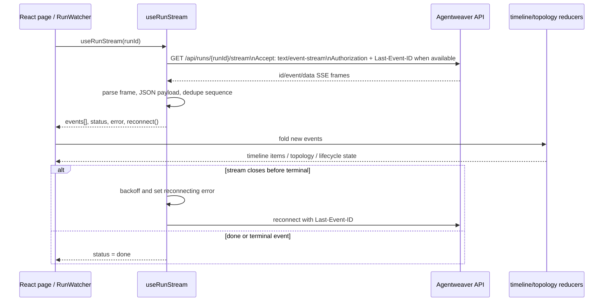
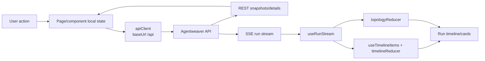

# Frontend — Deep Dive

## Purpose & Scope

Agentweaver's frontend is a React/Vite single-page app in `apps/web/` that signs the user in with GitHub, lets them select or create projects, starts single-agent runs or coordinator orchestrations, and renders live run state from Server-Sent Events (SSE). The ASP.NET Core project in `apps/Agentweaver.Web/` is a static-file host for the built SPA and generated docs; it does not define BFF/API handlers itself (`Program.cs` only wires static files plus SPA/docs fallbacks). [apps/web/src/App.tsx:72](../../apps/web/src/App.tsx#L72) [apps/Agentweaver.Web/Program.cs:6](../../apps/Agentweaver.Web/Program.cs#L6)

The UI supports two main execution paths:

- **Single-agent mode**: a project run is created with a task, branch, and optional `agent_name`; the run detail page renders the workflow execution stream. [apps/web/src/components/NewRunDialog.tsx:59](../../apps/web/src/components/NewRunDialog.tsx#L59) [apps/web/src/pages/WorkflowRunPage.tsx:348](../../apps/web/src/pages/WorkflowRunPage.tsx#L348)
- **Coordinator mode**: an orchestration is created from a natural-language goal; the coordinator drafts an outcome spec, dispatches subtasks, tracks child runs, and owns collective assembly/review. [apps/web/src/components/StartOrchestrationDialog.tsx:55](../../apps/web/src/components/StartOrchestrationDialog.tsx#L55) [apps/web/src/pages/CoordinatorRunPage.tsx:1013](../../apps/web/src/pages/CoordinatorRunPage.tsx#L1013)

## Tech Stack & Build (Vite, React, how Agentweaver.Web serves the SPA, Dockerfile apps/web/Dockerfile)

| Area | Details | Evidence |
|---|---|---|
| Framework/runtime | React 19, React DOM, React Router 7, Fluent UI v9, React Flow, React Markdown, YAML, TypeScript. | `apps/web/package.json:13-27` |
| Tooling | `npm run dev` = Vite, `npm run build` = `tsc -b && vite build`, `npm run lint` = ESLint, `npm run test` = Vitest. | `apps/web/package.json:6-12` |
| Vite dev server | Vite uses `@vitejs/plugin-react` and listens on port `8080`. | `apps/web/vite.config.ts:5-9` |
| Runtime config | `index.html` loads `/env-config.js` before the React module; the Docker entrypoint writes `window.__AGENTWEAVER_CONFIG__.API_URL`. | `apps/web/index.html:10-12`, `apps/web/docker-entrypoint.sh:6-10` |
| API URL in container | The web container sets `AGENTWEAVER_API_URL=/api`, so production/containerized `apiClient` uses `/api` as its base URL. | `apps/web/Dockerfile:46-50`, `apps/web/docker-entrypoint.sh:6-10` |
| Local dev API URL | If runtime config is absent, `API_URL` falls back to `VITE_API_URL`, then `http://localhost:5000`; the checked-in env examples point local dev at port 5000. | `apps/web/src/config.ts:11-13`, `apps/web/.env.example:1` |
| Container build | Docker builds the SPA with Node 22, builds docs with VitePress, publishes `Agentweaver.Web`, then copies `dist` to `wwwroot` and docs to `wwwroot/docs`. | `apps/web/Dockerfile:1-8`, `apps/web/Dockerfile:10-17`, `apps/web/Dockerfile:18-39` |
| ASP.NET Core host | `Agentweaver.Web` targets .NET 10 and disables static web assets because `wwwroot` is populated during the container build. | `apps/Agentweaver.Web/Agentweaver.Web.csproj:3-10` |
| Static serving | `Agentweaver.Web` serves default/static files, marks non-HTML assets immutable, maps `/docs` clean URLs, and falls back non-doc paths to `index.html`. | `apps/Agentweaver.Web/Program.cs:6-17`, `apps/Agentweaver.Web/Program.cs:19-71` |

## App Structure (routing map, key pages/components)

### Routing map

Routes are declared inside `Shell`, beneath `AppShell`, so all signed-in pages share the navigation frame. [apps/web/src/App.tsx:32](../../apps/web/src/App.tsx#L32) [apps/web/src/App.tsx:123](../../apps/web/src/App.tsx#L123)

| Route | Page/component | Purpose | Source |
|---|---|---|---|
| `/`, `/overview` | `OverviewPage` | Global “Now” overview. | `apps/web/src/App.tsx:37-38` |
| `/projects` | `ProjectGalleryPage` | Project gallery / creation landing. | `apps/web/src/App.tsx:39` |
| `/projects/:projectId` | `DashboardPage` | Project dashboard/home. | `apps/web/src/App.tsx:42` |
| `/projects/:projectId/board` | `ProjectPage` | Board/work item surface; includes new run and orchestration entry points. | `apps/web/src/App.tsx:43`, `apps/web/src/pages/ProjectPage.tsx:323` |
| `/projects/:projectId/flow` | `FlowPage` | Live work/agent flow view. | `apps/web/src/App.tsx:44` |
| `/projects/:projectId/orchestrations` | `OrchestrationsPage` | Coordinator run list. | `apps/web/src/App.tsx:45` |
| `/projects/:projectId/orchestrations/:runId` | `CoordinatorRunPage` | Coordinator-mode run detail: outcome spec, topology, subtasks, assembly review. | `apps/web/src/App.tsx:56`, `apps/web/src/pages/CoordinatorRunPage.tsx:1008` |
| `/projects/:projectId/workspace` | `WorkspacePage` | Read-only project/run workspace browser. | `apps/web/src/App.tsx:46` |
| `/projects/:projectId/settings` | `ProjectSettingsPage` | Project settings/provider configuration. | `apps/web/src/App.tsx:47` |
| `/projects/:projectId/team` | `TeamPage` | Squad roster. | `apps/web/src/App.tsx:48` |
| `/projects/:projectId/team/cast` | `CastingWizardPage` | Team casting wizard. | `apps/web/src/App.tsx:49` |
| `/projects/:projectId/memories` | `MemoriesPage` | Decisions/inbox/memory UI. | `apps/web/src/App.tsx:50` |
| `/projects/:projectId/workflows` | `WorkflowsPage` | Workflow definitions. | `apps/web/src/App.tsx:51` |
| `/projects/:projectId/diagnostics` | `DiagnosticsPage` | Diagnostics snapshot. | `apps/web/src/App.tsx:52` |
| `/projects/:projectId/heartbeat` | `HeartbeatPage` | Heartbeat/service status. | `apps/web/src/App.tsx:53` |
| `/projects/:projectId/runs/:runId/execution/:executionId` | `WatchPage` | Legacy/deep execution watcher route. | `apps/web/src/App.tsx:54` |
| `/projects/:projectId/runs/:runId/workflow` | `WorkflowRunPage` | Single run / coordinator child workflow graph and timeline. | `apps/web/src/App.tsx:55`, `apps/web/src/pages/WorkflowRunPage.tsx:233` |

### Key pages/components

| File | Role |
|---|---|
| `apps/web/src/main.tsx` | React entrypoint; wraps `App` in `StrictMode` and an error boundary. [apps/web/src/main.tsx:33-39](../../apps/web/src/main.tsx#L33-L39) |
| `apps/web/src/App.tsx` | Auth gate, Fluent UI provider, browser router, and route map. [apps/web/src/App.tsx:72-130](../../apps/web/src/App.tsx#L72-L130) |
| `apps/web/src/components/shell/AppShell.tsx` | Persistent shell: left nav, top bar, project context, floating orchestration action. [apps/web/src/components/shell/AppShell.tsx:95-114](../../apps/web/src/components/shell/AppShell.tsx#L95-L114) |
| `apps/web/src/components/shell/navConfig.tsx` | Information architecture: global nav plus WORK/SQUAD/OPERATIONS/SYSTEM project sections. [apps/web/src/components/shell/navConfig.tsx:53-100](../../apps/web/src/components/shell/navConfig.tsx#L53-L100) |
| `apps/web/src/components/shell/ProjectSwitcher.tsx` | Project switcher backed by the projects API and recent-project local storage. [apps/web/src/components/shell/ProjectSwitcher.tsx:105-123](../../apps/web/src/components/shell/ProjectSwitcher.tsx#L105-L123) |
| `apps/web/src/components/NewRunDialog.tsx` | Single-agent run creation form; sends branch/task/`agent_name`. [apps/web/src/components/NewRunDialog.tsx:50-64](../../apps/web/src/components/NewRunDialog.tsx#L50-L64) |
| `apps/web/src/components/StartOrchestrationDialog.tsx` | Coordinator-mode creation form; sends a goal to `/orchestrations`. [apps/web/src/components/StartOrchestrationDialog.tsx:50-58](../../apps/web/src/components/StartOrchestrationDialog.tsx#L50-L58) |
| `apps/web/src/pages/WorkflowRunPage.tsx` | Single-run/child-run workflow graph, seeded events, approvals, sandbox preview, run timeline. [apps/web/src/pages/WorkflowRunPage.tsx:247-263](../../apps/web/src/pages/WorkflowRunPage.tsx#L247-L263) |
| `apps/web/src/pages/CoordinatorRunPage.tsx` | Coordinator orchestration detail: SSE stream, REST seeds, topology, AgentRail, steering, toggles, assembly adapter. [apps/web/src/pages/CoordinatorRunPage.tsx:1013-1048](../../apps/web/src/pages/CoordinatorRunPage.tsx#L1013-L1048) |
| `apps/web/src/components/RunWatcher.tsx` | Reusable live run watcher; consumes SSE, folds timeline items, renders `RunLayout`. [apps/web/src/components/RunWatcher.tsx:41-45](../../apps/web/src/components/RunWatcher.tsx#L41-L45) |
| `apps/web/src/timeline/reducer.ts` | Pure timeline reducer for agent messages, tool calls/results, approvals, lifecycle cards, and outcome. [apps/web/src/timeline/reducer.ts:261-499](../../apps/web/src/timeline/reducer.ts#L261-L499) |
| `apps/web/src/state/topologyReducer.ts` | Pure coordinator topology reducer; applies server snapshots/deltas and subtask/steering updates without client-side dependency computation. [apps/web/src/state/topologyReducer.ts:1-9](../../apps/web/src/state/topologyReducer.ts#L1-L9) |

## API Client (baseUrl `/api`, relative paths convention, auth/session, error handling)

`apiClient` is a singleton `AgentweaverApiClient` constructed from `API_URL`. In the packaged web container, `API_URL` is `/api` because `AGENTWEAVER_API_URL` defaults to `/api` and the entrypoint writes that value into `env-config.js`. [apps/web/src/api/apiClient.ts:1-4](../../apps/web/src/api/apiClient.ts#L1-L4) [apps/web/Dockerfile:48](../../apps/web/Dockerfile#L48) [apps/web/docker-entrypoint.sh:6-10](../../apps/web/docker-entrypoint.sh#L6-L10)

The API client convention is: **method paths are relative to the base URL and must not include `/api`**. Examples include `'/runs'`, `'/auth/github/device'`, `'/auth/github'`, `'/projects/{id}/runs'`, and `'/projects/{id}/orchestrations'`; the private `request` method concatenates `${this.baseUrl}${path}`. [apps/web/src/api/client.ts:73-79](../../apps/web/src/api/client.ts#L73-L79) [apps/web/src/api/client.ts:191-200](../../apps/web/src/api/client.ts#L191-L200) [apps/web/src/api/client.ts:236-245](../../apps/web/src/api/client.ts#L236-L245) [apps/web/src/api/client.ts:378-381](../../apps/web/src/api/client.ts#L378-L381) [apps/web/src/api/client.ts:723-739](../../apps/web/src/api/client.ts#L723-L739)

Authentication/session behavior:

- Session token and login are held in `sessionStorage` under `agentweaver.sessionToken` and `agentweaver.sessionLogin`. [apps/web/src/config.ts:15-20](../../apps/web/src/config.ts#L15-L20)
- `AgentweaverApiClient` injects `Authorization: Bearer <token>` when a session token exists. [apps/web/src/api/client.ts:68-71](../../apps/web/src/api/client.ts#L68-L71)
- Fetch requests use `credentials: 'include'`, so cookie/session-backed endpoints also work. [apps/web/src/api/client.ts:729-733](../../apps/web/src/api/client.ts#L729-L733)
- The auth gate exchanges `?auth=success&code=...` via `POST ${API_URL}/auth/session/exchange`, stores `session_token`/`login`, then strips auth tokens/codes from the URL. [apps/web/src/config.ts:61-105](../../apps/web/src/config.ts#L61-L105)
- `AuthGate` then calls `getGitHubAuthStatus`; mismatched stored login or unsigned-in status clears session auth and shows `SignInPage`. [apps/web/src/App.tsx:77-120](../../apps/web/src/App.tsx#L77-L120)

Error handling is centralized around `ApiError(status, body)` for non-OK responses. Most client methods call `request`, which reads the response body as text, throws `ApiError` when `!response.ok`, and JSON-parses non-empty successful responses. The review endpoint has special 409 handling that can throw `RetriableReviewError` when the body contains a retryable review state. [apps/web/src/api/client.ts:33-42](../../apps/web/src/api/client.ts#L33-L42) [apps/web/src/api/client.ts:542-564](../../apps/web/src/api/client.ts#L542-L564) [apps/web/src/api/client.ts:736-738](../../apps/web/src/api/client.ts#L736-L738)

## Live Run Event Stream (SSE consumption, event types, reconnect)

Live execution is fetch-based SSE, not `EventSource`: `useRunStream` opens `GET {baseUrl}/runs/{runId}/stream` with `Accept: text/event-stream`, optional bearer auth, optional `Last-Event-ID`, and `credentials: 'include'`. This enables authenticated streams and replay after reconnect. [apps/web/src/api/sse.ts:163-216](../../apps/web/src/api/sse.ts#L163-L216)

The hook parses SSE frames manually (`id:`, `event:`, `data:`), JSON-parses payloads, deduplicates already-seen sequence IDs, buffers up to 1,000 events by default, treats `done` as terminal, and marks configured run/coordinator terminal event types as terminal. [apps/web/src/api/sse.ts:16-27](../../apps/web/src/api/sse.ts#L16-L27) [apps/web/src/api/sse.ts:196-207](../../apps/web/src/api/sse.ts#L196-L207) [apps/web/src/api/sse.ts:230-264](../../apps/web/src/api/sse.ts#L230-L264)

Supported event types cover normal agent turns/messages/tools, approvals, sandbox events, run/review/merge lifecycle, workflow steps, coordinator graph/topology/work-plan, subtask lifecycle, child questions/approvals, automation, and terminal `done`/`error`. [apps/web/src/api/sse.ts:72-145](../../apps/web/src/api/sse.ts#L72-L145)

Reconnect strategy:

- Reconnect delays are `[1s, 2s, 4s, 8s, 16s, 30s]` with a maximum of five consecutive failures. [apps/web/src/api/sse.ts:25-27](../../apps/web/src/api/sse.ts#L25-L27)
- When a stream closes without a terminal event, `useRunStream` retries with backoff and reports `Stream disconnected; reconnecting...`. [apps/web/src/api/sse.ts:273-291](../../apps/web/src/api/sse.ts#L273-L291)
- Consumers can force a reconnect via the returned `reconnect` callback. [apps/web/src/api/sse.ts:153-161](../../apps/web/src/api/sse.ts#L153-L161)

## State Management & Data Flow

The app uses React state/hooks and a few small contexts/reducers; there is no Redux-style global store in the inspected frontend.

- **Auth/session state** lives in browser session storage and `AuthGate` component state. [apps/web/src/config.ts:15-59](../../apps/web/src/config.ts#L15-L59) [apps/web/src/App.tsx:72-120](../../apps/web/src/App.tsx#L72-L120)
- **Project list state** is a React context (`ProjectListProvider`) that fetches `apiClient.listProjects()`, distinguishes 401 auth errors from load errors, and exposes `appendProject`/`refetch`. [apps/web/src/hooks/useProjectList.tsx:18-80](../../apps/web/src/hooks/useProjectList.tsx#L18-L80)
- **Project navigation context** persists the last active project in local storage so global pages can still render project-scoped nav targets. [apps/web/src/components/shell/projectContext.ts:8-20](../../apps/web/src/components/shell/projectContext.ts#L8-L20) [apps/web/src/components/shell/AppShell.tsx:64-86](../../apps/web/src/components/shell/AppShell.tsx#L64-L86)
- **Recent project switching** stores up to five recent project IDs in local storage. [apps/web/src/components/shell/ProjectSwitcher.tsx:19-34](../../apps/web/src/components/shell/ProjectSwitcher.tsx#L19-L34)
- **Run timeline state** is reduced from SSE events by `useTimelineItems`, which uses `useReducer(timelineReducer, initialTimelineState)` and re-folds when event arrays shrink after reconnect/reset. [apps/web/src/timeline/useTimelineItems.ts:13-45](../../apps/web/src/timeline/useTimelineItems.ts#L13-L45)
- **Coordinator topology state** is reduced from server-authored topology/work-plan/subtask/steering events; the reducer explicitly avoids computing topology client-side. [apps/web/src/state/topologyReducer.ts:1-9](../../apps/web/src/state/topologyReducer.ts#L1-L9) [apps/web/src/state/topologyReducer.ts:128-185](../../apps/web/src/state/topologyReducer.ts#L128-L185)
- **Coordinator REST seeds + SSE deltas**: `CoordinatorRunPage` fetches graph/work-plan/children snapshots so finished or already-started runs render immediately, then folds live SSE over those seeds. [apps/web/src/pages/CoordinatorRunPage.tsx:1018-1048](../../apps/web/src/pages/CoordinatorRunPage.tsx#L1018-L1048) [apps/web/src/pages/CoordinatorRunPage.tsx:1293-1297](../../apps/web/src/pages/CoordinatorRunPage.tsx#L1293-L1297)
- **Single-run REST seeds + SSE deltas**: `WorkflowRunPage` resolves project/team/run detail, seeds persisted events for terminal/parked runs, fetches graph descriptors, and merges persisted events with live events. [apps/web/src/pages/WorkflowRunPage.tsx:290-348](../../apps/web/src/pages/WorkflowRunPage.tsx#L290-L348) [apps/web/src/pages/WorkflowRunPage.tsx:350-385](../../apps/web/src/pages/WorkflowRunPage.tsx#L350-L385)

High-level data flow:

## Auth/Session in the UI (GitHub sign-in handoff, session exchange)

The unauthenticated UI is `SignInPage`. Its sign-in button navigates the browser to `/auth/github/authorize` on the current host, rather than using `apiClient`, so the auth redirect must be handled by the API/proxy in front of or alongside the SPA. [apps/web/src/pages/SignInPage.tsx:52-69](../../apps/web/src/pages/SignInPage.tsx#L52-L69)

On return, `AuthGate` calls `captureSessionAuthFromUrl()` before checking GitHub auth status. The exchange flow is:

1. Read `auth` and `code` from `window.location.search`. [apps/web/src/config.ts:61-65](../../apps/web/src/config.ts#L61-L65)
2. If `auth=success` and `code` exists, `POST ${API_URL}/auth/session/exchange` with JSON `{ code }` and `credentials: 'include'`. [apps/web/src/config.ts:88-94](../../apps/web/src/config.ts#L88-L94)
3. On success, store `session_token` and `login` in session storage. [apps/web/src/config.ts:95-98](../../apps/web/src/config.ts#L95-L98)
4. Always remove `code`, `auth`, and legacy token/login query parameters from the URL. [apps/web/src/config.ts:66-78](../../apps/web/src/config.ts#L66-L78)
5. Validate the browser session with `GET /auth/github`; clear session state if unsigned in or if the stored login does not match the server login. [apps/web/src/App.tsx:79-104](../../apps/web/src/App.tsx#L79-L104)

Signed-in users see `AppShell`; the top bar contains `GitHubSignIn`, which fetches auth status for avatar/login display and posts to `/auth/github/sign-out` before redirecting to `/`. [apps/web/src/components/GitHubSignIn.tsx:62-82](../../apps/web/src/components/GitHubSignIn.tsx#L62-L82)

## Gotchas & Conventions

- **Do not prefix API client paths with `/api`.** Production/container base URL is already `/api`; client methods pass relative API paths like `/runs` and `/auth/github`. Adding `/api` inside a method would produce `/api/api/...`. [apps/web/src/api/client.ts:73-79](../../apps/web/src/api/client.ts#L73-L79) [apps/web/src/api/client.ts:723-739](../../apps/web/src/api/client.ts#L723-L739)
- **`Agentweaver.Web` is a static host, not the API.** It serves files and SPA/docs fallbacks only; no BFF routes are mapped in `Program.cs`. [apps/Agentweaver.Web/Program.cs:6-17](../../apps/Agentweaver.Web/Program.cs#L6-L17) [apps/Agentweaver.Web/Program.cs:19-71](../../apps/Agentweaver.Web/Program.cs#L19-L71)
- **Runtime API URL beats build-time env.** Docker intentionally unsets `VITE_API_URL` during build and writes `/env-config.js` at container start, so the same SPA bundle can point at different API origins. [apps/web/Dockerfile:8](../../apps/web/Dockerfile#L8) [apps/web/docker-entrypoint.sh:6-10](../../apps/web/docker-entrypoint.sh#L6-L10)
- **SSE is fetch-based.** Keep custom headers (`Authorization`, `Last-Event-ID`) and `credentials: 'include'` when changing the stream implementation. [apps/web/src/api/sse.ts:210-216](../../apps/web/src/api/sse.ts#L210-L216)
- **Terminal or parked runs need REST seeds.** `WorkflowRunPage` loads persisted events for terminal/parked statuses because the live SSE stream may already be closed. [apps/web/src/pages/WorkflowRunPage.tsx:200-207](../../apps/web/src/pages/WorkflowRunPage.tsx#L200-L207) [apps/web/src/pages/WorkflowRunPage.tsx:350-367](../../apps/web/src/pages/WorkflowRunPage.tsx#L350-L367)
- **Coordinator topology is server-authored.** The frontend should render snapshots/deltas and avoid inventing dependencies or topology. [apps/web/src/state/topologyReducer.ts:1-9](../../apps/web/src/state/topologyReducer.ts#L1-L9)
- **Coordinator child approvals/questions route to child runs.** The coordinator page re-projects child requests but stores `childRunId` so answers/approvals are sent to the run that asked. [apps/web/src/pages/CoordinatorRunPage.tsx:1234-1291](../../apps/web/src/pages/CoordinatorRunPage.tsx#L1234-L1291)
- **Static asset caching excludes HTML.** Non-HTML static files get long-lived immutable caching; HTML/fallback responses do not. [apps/Agentweaver.Web/Program.cs:7-17](../../apps/Agentweaver.Web/Program.cs#L7-L17)
- **Content safety in timelines is intentional.** Timeline reducer comments state timeline text is rendered as escaped React text nodes, caps content at 50,000 chars, and avoids HTML/markdown interpretation in that pipeline. [apps/web/src/timeline/reducer.ts:1-20](../../apps/web/src/timeline/reducer.ts#L1-L20)
