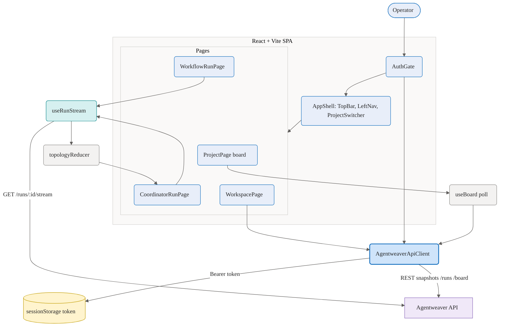
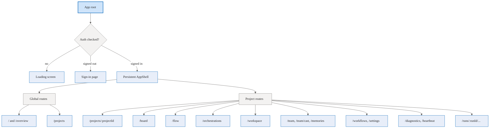
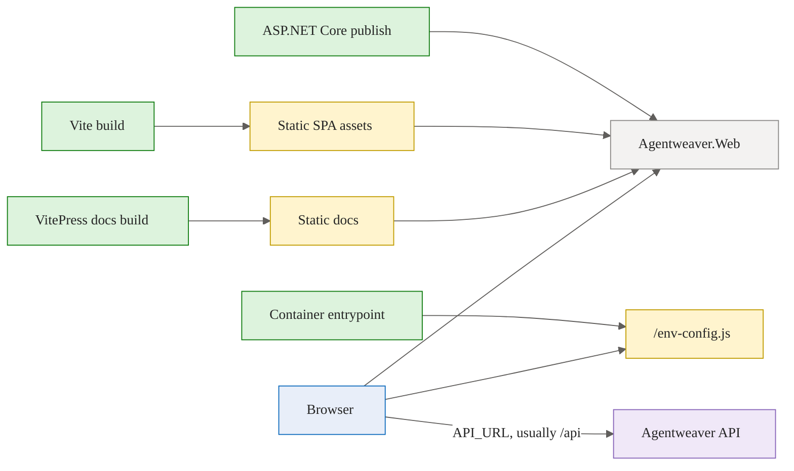
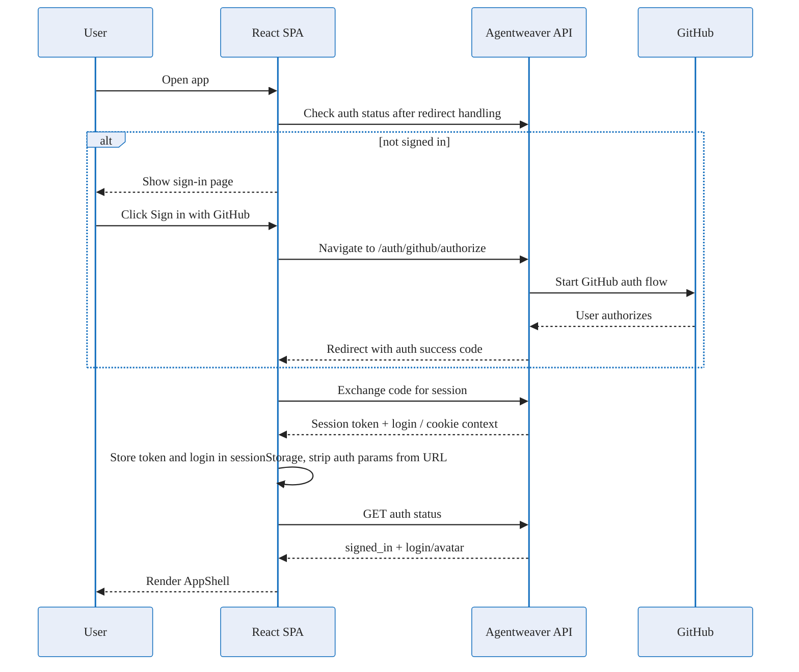
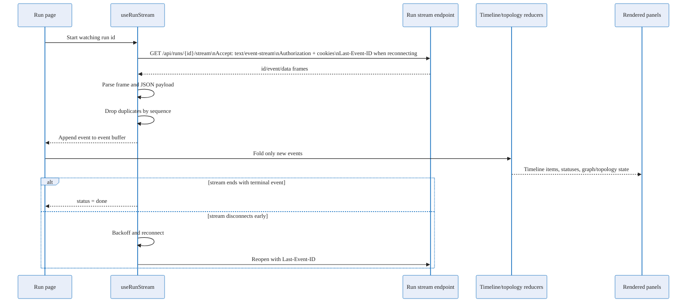
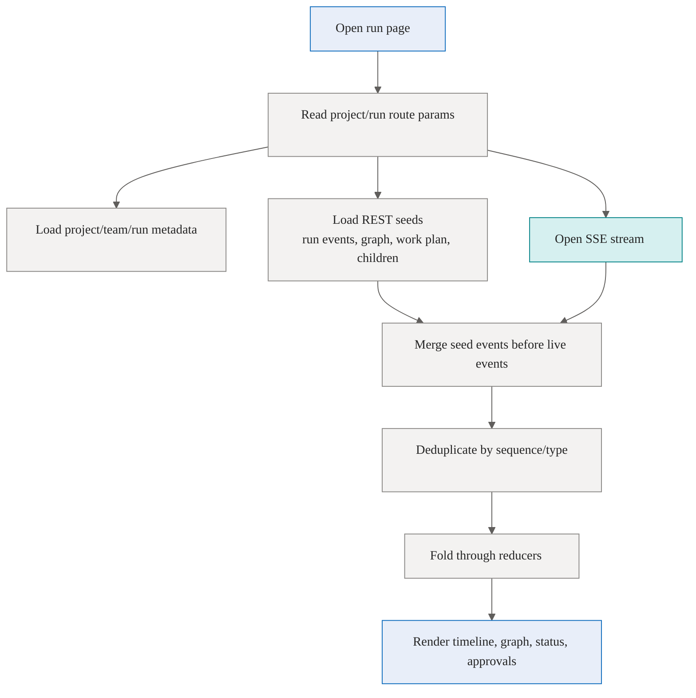
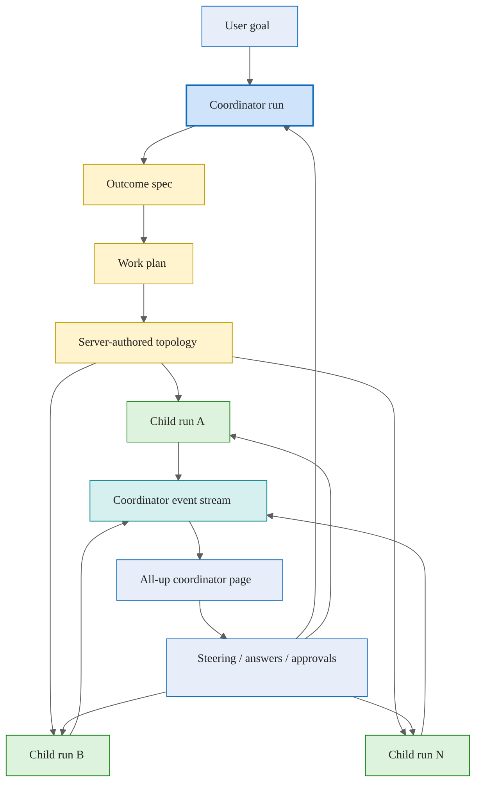

# Frontend — Conceptual Deep Dive

## Purpose and Mental Model

Agentweaver's frontend is a browser-based control room for agent work. It does not run agents, decide orchestration topology, or persist long-term state itself. Its job is to:

1. authenticate the user,
2. let the user choose a project and issue commands,
3. ask the backend for authoritative snapshots,
4. subscribe to live run events,
5. fold those events into UI-friendly state, and
6. render the current state clearly enough that a human can steer, approve, inspect, or recover work.

The most important rebuilding idea is **snapshot + stream**:

- **Snapshots** answer, "What does the backend know right now?" They come from REST calls and are used when a page first loads, when a completed run is reopened, or when the UI needs metadata such as project lists, teams, graph descriptors, work plans, files, and settings.
- **Streams** answer, "What changed after I started watching?" They come from Server-Sent Events (SSE) on a run stream.
- **Reducers** turn raw events into display models: timelines, run status, graph state, coordinator topology, approval cards, and child request lists.

This gives the UI a robust mental model: the backend is the source of truth; the frontend is a deterministic projection of backend facts.

Where this lives:

- `apps/web/`
- `apps/Agentweaver.Web/`

## Frontend Boundary

The frontend has three runtime layers:

1. **React/Vite SPA** — the application the user interacts with. It owns routing, presentation, browser state, REST calls, SSE consumption, and UI projections.
2. **Agentweaver API** — the authoritative backend. It owns projects, auth, runs, orchestration, work plans, event logs, files, reviews, and mutations.
3. **Static web host** — a small ASP.NET Core app that serves the built SPA and docs. It is not a backend-for-frontend; it does not implement the API routes used by the SPA.

A rebuild should preserve that boundary. Avoid putting business decisions in the browser just because the browser has enough data to guess. For example, the coordinator graph is server-authored: the UI renders topology snapshots and deltas instead of recomputing dependencies on the client.

Trade-off: this makes the UI simpler and safer, but it means the backend must emit complete enough facts for the UI to render useful state.

Where this lives:

- `apps/web/src/`
- `apps/Agentweaver.Web/Program.cs`

## Technology Shape

The SPA is a TypeScript React app built with Vite. It uses React Router for browser routes, Fluent UI for the visual system, React Flow/Dagre for graph-like views, and Vitest/Testing Library for frontend tests.

The entrypoint mounts React into the `#root` element, wraps the app in React `StrictMode`, and uses a small error boundary so a render exception becomes a recoverable error screen instead of a blank page.

At the app root, the UI is wrapped in:

- a Fluent UI provider, so components share theme tokens,
- a browser router, so deep links are normal URLs,
- an auth gate, so protected app routes do not render until session validation completes,
- a persistent shell, so navigation and top-level context remain stable across pages.

Rebuild principle: keep the app root boring. Cross-cutting concerns belong there; feature behavior belongs in pages, hooks, reducers, and components.

Where this lives:

- `apps/web/src/main.tsx`
- `apps/web/src/App.tsx`
- `apps/web/package.json`
- `apps/web/vite.config.ts`

## Routing and Information Architecture

Routes are split into **global** destinations and **project-scoped** destinations.

Global routes do not require a project id:

- overview / now view,
- project gallery / project creation.

Project-scoped routes start with `/projects/:projectId` and represent the work surface for one project:

- dashboard,
- board,
- flow,
- orchestrations,
- workspace,
- settings,
- team / casting,
- memories,
- workflows,
- diagnostics / heartbeat,
- run detail pages.

All signed-in routes sit inside the persistent shell. The shell is intentionally above individual pages because navigation, project switching, top bar status, and the floating orchestration action should not disappear when the user opens a deep run page.

The shell derives the active project from the URL. When the user moves to a global page, it remembers the last active project in local storage so the project switcher and project-scoped navigation can still point somewhere useful. This is a UX convenience only; the route remains the source of truth for the currently displayed page.

Rebuild principle: routes should describe user intent, not implementation detail. A run detail URL should be directly openable after refresh, and the page should be able to reconstruct its state from route parameters plus backend snapshots.

Where this lives:

- `apps/web/src/App.tsx`
- `apps/web/src/components/shell/`

## API Client Design

The frontend uses one conceptual API client: a typed wrapper around `fetch`. Each method describes a backend operation in application terms, while the private request layer handles shared mechanics:

- combine the configured base URL with a method path,
- attach session auth if present,
- include cookies for cookie-backed sessions,
- JSON-encode request bodies,
- parse successful JSON responses,
- throw a structured API error for non-OK responses.

### The `/api` base URL convention

Important convention: **the API client base URL may be `/api`, so individual client method paths must not include `/api`.**

For example, the client should be configured with a base URL like `/api`, then methods should call relative API paths like `/runs`, `/auth/github`, or `/projects/{id}/orchestrations`. If a method includes `/api` itself, production builds would accidentally call `/api/api/...`.

This convention is what lets the same SPA run in multiple environments:

- local development can point at `http://localhost:5000`,
- containerized production can point at `/api`, usually through a reverse proxy or same-origin API route,
- the bundle does not need to be rebuilt just because the API origin changes.

### Why centralize API calls?

Centralization gives the app one place to solve auth, errors, request formatting, and response typing. Pages can stay focused on interaction flow: "create a run," "load graph," "approve review," or "list projects." It also makes conventions enforceable; a new endpoint should be added as a method that accepts application inputs and returns typed application data.

Trade-off: the API client can become large. Keep it organized around backend resource groups and avoid embedding page-specific UI decisions in it.

Where this lives:

- `apps/web/src/api/apiClient.ts`
- `apps/web/src/api/client.ts`
- `apps/web/src/api/types.ts`
- `apps/web/src/config.ts`

## Runtime Configuration and Static Hosting

The SPA is built once and configured at container startup. `index.html` loads `/env-config.js` before the React bundle. The container entrypoint writes `window.__AGENTWEAVER_CONFIG__` with the API URL, defaulting to `/api`.

This design separates build-time artifacts from deployment-time configuration:

- Vite builds static JavaScript, CSS, and assets.
- The container decides where the API is at startup.
- The ASP.NET Core host serves the static files and docs.
- Non-HTML assets can be cached aggressively because their built filenames are content-addressed by Vite.
- HTML and fallback responses should not be treated as immutable because they bootstrap the current app version and runtime config.

Rebuild principle: static hosting should be dumb and predictable. Let the API own API behavior; let the SPA own client behavior; let the host serve files and route unknown non-doc paths back to `index.html` for client-side routing.

Where this lives:

- `apps/web/index.html`
- `apps/web/Dockerfile`
- `apps/web/docker-entrypoint.sh`
- `apps/Agentweaver.Web/Program.cs`

## Authentication and Session Flow

The UI starts in an auth gate. It does not render the signed-in shell until it has resolved any auth redirect and verified the current session with the backend.

Conceptually, sign-in works like this:

1. The unauthenticated page sends the browser to the backend GitHub authorization endpoint.
2. The backend completes the GitHub flow and redirects back to the SPA with a short-lived code marker.
3. Before rendering protected routes, the auth gate exchanges that code for session information.
4. The frontend stores the session token and login in `sessionStorage`.
5. The API client sends the token as a bearer header when present and also includes cookies.
6. The auth gate asks the backend for GitHub auth status.
7. If the backend says the user is signed in, the shell renders. Otherwise, local session state is cleared and the sign-in page renders.

The stored login is not just display data. The auth gate compares it with the backend-reported login. If the browser has a token for one user but the backend session reports another, the UI clears local session state rather than silently mixing identities.

The top bar separately fetches auth status for avatar/login display and exposes sign-out. Sign-out calls the backend and returns the browser to the app root.

Trade-offs:

- `sessionStorage` limits token lifetime to the browser tab/session, which is safer than long-lived local storage but means new sessions must rehydrate from cookies or sign in again.
- Sending both bearer auth and cookies supports multiple backend session mechanisms, but every request path must be careful to include credentials consistently.
- URL auth parameters are stripped after exchange so tokens/codes do not linger in browser history or copied links.

Where this lives:

- `apps/web/src/App.tsx`
- `apps/web/src/config.ts`
- `apps/web/src/pages/SignInPage.tsx`
- `apps/web/src/components/GitHubSignIn.tsx`

## State Management Philosophy

Agentweaver does not use a single global Redux-style store. State is scoped to the part of the UI that owns it:

- auth/session state lives in the auth gate and browser session storage,
- the project list lives in a small React context shared by shell components,
- the last active project lives in local storage as a navigation convenience,
- page-level forms and toggles live in local component state,
- run timelines and coordinator topology are derived from event streams through reducers,
- persisted backend state is reloaded through REST snapshots instead of being treated as browser-owned.

This keeps state lifetimes aligned with user workflows. A page can be remounted when the active project changes, forcing clean refetches. A deep run page can be opened directly and rebuilt from snapshots plus the stream. A shell-level project switcher can share the project list without making every feature depend on a global app store.

Rebuild principle: store the minimum browser state needed for responsiveness and navigation. Anything authoritative should be fetched from, or streamed by, the backend.

Where this lives:

- `apps/web/src/hooks/useProjectList.tsx`
- `apps/web/src/components/shell/projectContext.ts`
- `apps/web/src/timeline/`
- `apps/web/src/state/topologyReducer.ts`

## Live Run Timeline: Event-Sourced UI Projection

The live run UI is the heart of the frontend. It treats a run as an ordered stream of facts.

A run can emit events such as:

- agent turn started / ended,
- message deltas and final messages,
- tool calls and tool results,
- shell/tool approval requests,
- workflow graph updates,
- sandbox warnings,
- review and merge lifecycle events,
- coordinator lifecycle events,
- subtask status changes,
- child questions or approvals,
- terminal completion/failure events.

The stream hook uses `fetch`, not browser `EventSource`. That is intentional: authenticated streams need custom headers such as `Authorization`, and replay after reconnect benefits from `Last-Event-ID`.

The hook keeps a bounded event buffer so a runaway stream does not grow the DOM forever. It recognizes terminal events so completed streams stop reconnecting. It uses reconnect backoff so transient network issues do not immediately fail the page.

The timeline reducer is pure: given prior timeline state and the next event, it returns the next display state. It groups messages into turns, pairs tool calls with results, surfaces approvals, tracks outcomes, and bounds large text fields. Because it is pure, the same event sequence should produce the same timeline whether it came live from SSE or from a persisted event log.

This is the key mental model: **SSE events are not rendered directly. They are normalized into durable UI concepts.**

Where this lives:

- `apps/web/src/api/sse.ts`
- `apps/web/src/timeline/`
- `apps/web/src/components/Timeline.tsx`
- `apps/web/src/components/RunWatcher.tsx`

## Snapshot + Stream Synchronization

A live stream alone is not enough. Users frequently open pages after work has already started or completed. A completed run may no longer have an active stream. A coordinator topology snapshot may have been emitted before the browser connected.

Agentweaver solves this by layering data:

1. **REST seed** — load the latest known snapshot or persisted event list.
2. **SSE stream** — append newer live changes.
3. **Deduplication** — avoid showing the same event twice, usually by sequence id.
4. **Reducer fold** — derive display state from the merged event list.

For single-agent runs, the page resolves the execution id, loads project/team/run metadata, optionally fetches persisted events for terminal or parked states, fetches a graph descriptor, and then merges live stream events over the seed.

For coordinator runs, the page loads graph/work-plan/children snapshots so the all-up graph and agent rail render immediately, then applies coordinator SSE events as live deltas.

Trade-off: merge logic adds complexity, but it gives a much better operator experience. Refreshing a finished run should not show an empty timeline just because the live stream has already closed.

Where this lives:

- `apps/web/src/pages/WorkflowRunPage.tsx`
- `apps/web/src/pages/CoordinatorRunPage.tsx`
- `apps/web/src/api/sse.ts`

## Single-Agent Run Flow

A single-agent run is the simplest execution path:

1. The user starts a run from a project surface, usually with a task, branch, and optional agent selection.
2. The backend creates the run and returns identifiers.
3. The UI navigates to a workflow/run detail route.
4. The page resolves the run metadata and stream key.
5. The page loads any persisted seed events and graph descriptor.
6. The page opens the SSE stream.
7. The timeline and graph update as events arrive.
8. Review, request-changes, commit, and merge actions call the API and then refresh or reconnect the stream projection.

The run page is deliberately built from reusable pieces: header, layout, timeline, graph/workflow panels, review controls, sandbox/files panels, and stream hooks. A rebuild should keep the stream/reducer logic independent from the visual layout so the same run projection can appear in different contexts.

Important edge case: coordinator child runs may not appear in the parent project run list because they are children, not top-level project runs. The run detail page can still resolve them directly by run id and treat that run id as the stream/graph key.

Where this lives:

- `apps/web/src/components/NewRunDialog.tsx`
- `apps/web/src/pages/WorkflowRunPage.tsx`
- `apps/web/src/components/RunLayout.tsx`
- `apps/web/src/components/ReviewPanel.tsx`

## Coordinator Orchestration Flow

Coordinator mode is the multi-agent execution path. The frontend presents it as one orchestration, but internally it is a coordinator run plus child runs.

Conceptually:

1. The user gives a goal.
2. The coordinator drafts or confirms an outcome specification.
3. The backend decomposes the goal into a work plan and topology.
4. Subtasks are dispatched to child runs.
5. Child runs emit their own events, questions, tool approvals, and terminal states.
6. The coordinator stream re-projects the all-up lifecycle so the user can monitor and steer from one page.
7. When children are ready, assembly/review/merge phases progress through coordinator events.

The topology reducer is intentionally thin. It applies server-authored snapshots and deltas, merges subtask status updates, and attaches steering state to existing nodes. It does not invent dependencies or compute topology from scratch. This protects the UI from accidentally disagreeing with backend scheduling rules.

Coordinator pages also need special handling for child questions and approvals. The user sees them in the all-up coordinator page, but the response must be sent to the child run that asked. Therefore each displayed request carries the child run id and, when available, the subtask id.

Automation toggles such as autopilot and auto-approve tools are shown at the coordinator level, but backend behavior may cascade them to children. The UI uses optimistic state for responsiveness and reverts on API failure.

Rebuild principle: show the user one orchestration, but keep run ownership precise. Coordinator commands go to the coordinator; child answers and tool grants go to the requesting child.

Where this lives:

- `apps/web/src/components/StartOrchestrationDialog.tsx`
- `apps/web/src/pages/CoordinatorRunPage.tsx`
- `apps/web/src/state/topologyReducer.ts`
- `apps/web/src/components/CoordinatorTopologyGraph.tsx`
- `apps/web/src/components/AgentRail.tsx`

## How the UI Stays in Sync

The UI stays in sync by following these rules:

1. **Use route params as identity.** A page knows which project/run to load from the URL.
2. **Fetch snapshots on entry.** Load enough REST data to render immediately, even for completed runs.
3. **Subscribe to the run stream.** Open one SSE stream for the run currently being watched.
4. **Replay from the last event id.** On reconnect, ask the backend for events after the last seen sequence.
5. **Deduplicate defensively.** Streams, snapshots, reconnects, and singleton events can overlap.
6. **Fold, do not mutate ad hoc.** Raw events become stable UI state through reducers and derived selectors.
7. **Let terminal events stop liveness.** Completed/failed/merged/declined states should not reconnect forever.
8. **Treat backend snapshots as authoritative.** Especially for coordinator topology, work plans, child ownership, and run status.

This pattern is close to event sourcing, but only on the client projection side. The frontend does not own the event log; it consumes the backend's event log and renders a projection.

## Error Handling and Recovery

Frontend error handling is layered:

- render errors are caught by the root error boundary,
- API non-OK responses become structured client errors,
- auth failures clear local session and return to sign-in surfaces,
- stream failures reconnect with backoff where safe,
- missing optional snapshots are tolerated when the stream can still provide state,
- missing durable logs fall back to live SSE when available,
- terminal/parked runs use persisted events because no live stream may exist.

A rebuild should distinguish between fatal and non-fatal failures. Failure to fetch an optional graph descriptor should not prevent the timeline from rendering. Failure to validate auth should prevent protected routes. Failure to reconnect a run stream after repeated attempts should surface an actionable status rather than silently freezing.

## Content and Safety Considerations

Timeline text is rendered as React text, not interpreted HTML. Large content fields are capped before being stored in timeline state to reduce unbounded DOM growth. Display helpers shorten noisy file paths in card headers while preserving fuller details where expansion is supported.

The important design principle is to make untrusted run output observable without making it executable. Agent and tool output should be treated as data.

Where this lives:

- `apps/web/src/timeline/reducer.ts`
- `apps/web/src/components/ToolCallCard.tsx`
- `apps/web/src/components/Timeline.tsx`

## Rebuild Checklist

If rebuilding the Agentweaver frontend from scratch, implement in this order:

1. Static Vite React shell with routing and a root error boundary.
2. Runtime config loader that can set API base URL at deployment time.
3. Typed API client with centralized auth, credentials, JSON parsing, and API errors.
4. GitHub sign-in handoff, session exchange, session validation, and sign-out.
5. Persistent app shell with global/project navigation and project context.
6. Project list/provider and project-scoped pages.
7. Run stream hook using fetch-based SSE with auth headers, `Last-Event-ID`, dedupe, terminal detection, and reconnect backoff.
8. Pure timeline reducer that folds raw events into display items.
9. Single-agent run page using REST seeds plus live SSE.
10. Coordinator page using graph/work-plan/children seeds plus coordinator SSE.
11. Thin topology reducer that applies server-authored snapshots and deltas.
12. Review, approval, question-answering, and steering actions that call the correct owning run.
13. Static hosting with SPA fallback and docs handling.

## Gotchas and Conventions

- Do not prefix API client method paths with `/api`; configure `/api` as the base URL and use relative paths such as `/runs` or `/auth/github`.
- The static web host is not the API. It serves built files, docs, and SPA fallbacks.
- Runtime API URL should override build-time environment so one bundle can deploy to multiple environments.
- Use fetch-based SSE, not plain `EventSource`, if authenticated headers and replay control are required.
- Finished or parked runs need REST seeds because their live stream may already be closed.
- Coordinator topology is server-authored; render it instead of recomputing it.
- Child questions and tool approvals shown on the coordinator page must be answered against the child run that asked.
- Keep browser state small. Backend state is authoritative; UI state is a projection.
